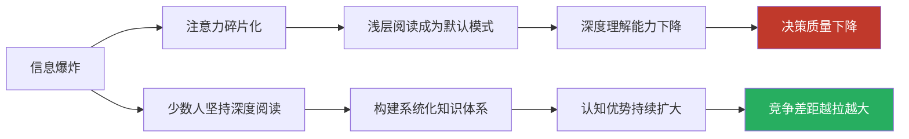
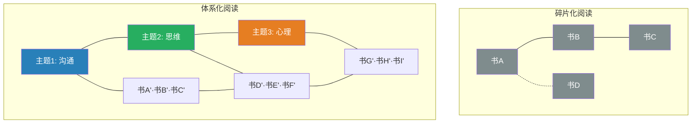

# 第五章 阅读：用系统化阅读构建终身学习引擎

## 一、为什么阅读是这个时代最被低估的超级能力

> "一本好书是一段生命经历，一次灵魂对话，一座随身携带的避难所。" ——毛姆

在信息爆炸的时代，阅读的价值不是被削弱了，而是被放大了。

当短视频和碎片化信息不断侵蚀我们的注意力时，能够深度阅读的人，正在获得一种越来越稀缺的认知优势。这种优势不是抽象的——它直接体现在你的决策质量、问题解决能力、沟通表达水平和职业竞争力上。

### 1.1 阅读的认知投资回报率

在所有个人成长活动中，阅读的投入产出比几乎是最高的。一本售价几十元的书，凝聚了作者数年甚至数十年的研究成果、实践经验和思考结晶。通过阅读，你以极低的时间和金钱成本，获取了他人毕生的智慧。

查理·芒格说过："我这辈子遇到的聪明人，没有不每天阅读的——没有，一个都没有。"这不仅是一句鸡汤，而是对阅读与认知能力之间强正相关关系的朴素描述。

**阅读的回报体现在三个维度：**

| 维度 | 具体回报 | 证据/案例 |
|------|---------|----------|
| 认知升级 | 知识复利效应——每读一本书都降低下一本书的理解成本 | 读过100本书的人理解第101本书的能力远超只读过10本书的人 |
| 思维训练 | 阅读严密论证训练逻辑推理，阅读文学训练共情与想象力 | 长期阅读者在批判性思维测试中得分显著更高 |
| 框架构建 | 帮助你建立理解世界的"透镜"——经济学框架、心理学框架、系统论框架 | 拥有多个认知框架的人在面对新问题时能更快找到切入角度 |
| 职业竞争力 | 快速学习新领域知识的能力是知识经济时代的核心竞争力 | 比尔·盖茨、埃隆·马斯克等行业领袖均为"阅读狂人" |
| 心理健康 | 6分钟阅读可降低68%的压力水平（萨塞克斯大学研究） | 效果优于听音乐、散步、喝茶 |

### 1.2 阅读 vs. 其他学习方式

| 学习方式 | 知识密度 | 时间灵活性 | 成本 | 深度 | 可重复性 |
|---------|---------|-----------|------|------|---------|
| 读书 | ★★★★★ | ★★★★★ | ★★★★★（最低） | ★★★★★ | ★★★★★ |
| 付费课程 | ★★★★ | ★★★ | ★★（较贵） | ★★★★ | ★★★ |
| 短视频/播客 | ★★ | ★★★★ | ★★★★ | ★★ | ★★ |
| 实践摸索 | ★★★ | ★★ | ★★★ | ★★★★ | ★★ |
| 向高手请教 | ★★★★ | ★（受对方时间限制） | ★（可能很贵） | ★★★★ | ★★ |

阅读的独特优势在于：它是唯一一种你可以完全掌控节奏、反复研读、随时暂停思考的学习方式。当你在书上读到一个深刻的洞察时，你可以停下来花20分钟消化它——而在课程或讲座中，你没有这个自由。

### 1.3 信息时代阅读的悖论

我们生活在一个信息极度丰富的时代——每天产生的文字内容如果全部打印出来，可以从地球堆到月球再回来。但悖论在于：**信息越丰富，深度阅读越稀缺，而深度阅读的能力越值钱。**

这就是为什么本章的目标不仅仅是"教你如何读书"，而是帮你**构建一套完整的个人阅读系统**——一套能持续运转、自我优化的终身学习引擎。

---

## 二、核心理念：体系化、方法论、持续性

本章的所有内容围绕三个核心理念展开。理解这三个理念，就理解了本章的底层逻辑。

### 2.1 体系化：从信息孤岛到知识网络

大多数人阅读的模式是：看到推荐→买一本→读完→放回书架→找下一本。每本书都是一个孤立的信息岛屿，与其他读过的内容之间没有连接。这种阅读方式的效率极低——你投入了时间，但知识没有积累，因为它没有被"组织"起来。

体系化阅读意味着：

- **有目标地选书**：不是别人推荐什么就读什么，而是基于你当前的知识缺口和成长目标来选择阅读材料
- **主题式深入**：围绕一个主题选择5-10本书进行对比阅读，从不同角度建立对该领域的立体理解
- **建立连接**：每读完一本书，主动寻找它与你已读内容的关联——它印证了什么？挑战了什么？补充了什么？
- **构建框架**：最终目标不是记住所有细节，而是形成几个关键的"认知框架"，让你能用这些框架来理解新的信息

### 2.2 方法论：高效阅读是可以学习的技能

很多人认为"阅读能力"是一种天赋——有人天生读得快、记得牢，有人天生不行。这是错误的。阅读效率的差异主要来自方法，而非天赋。

本章将介绍经过科学验证的阅读方法，包括：

| 方法 | 核心思想 | 适用场景 | 效果提升 |
|------|---------|---------|---------|
| SQ3R阅读法 | 浏览→提问→阅读→复述→复习，主动阅读比被动阅读效率高3倍以上 | 非虚构类书籍、教材 | 理解率提升30-50% |
| 费曼学习法 | "以教促学"——如果你不能用简单语言解释，说明你没真正理解 | 概念性内容、技术书籍 | 长期记忆保持率提升50%+ |
| 检视阅读法 | 15-30分钟快速把握全书框架，"先见森林再见树木" | 任何新书的第一次接触 | 筛选效率提升10倍 |
| 主题阅读法 | 围绕一个主题同时阅读多本书，构建系统知识 | 深入学习某个领域 | 知识体系完整度显著提升 |
| 批判性阅读 | 不接受→评估，主动分析论点的证据和逻辑 | 学术著作、争议性话题 | 避免被错误信息误导 |

掌握这些方法后，你的阅读效率会有质的飞跃——不是因为你的大脑变快了，而是因为你不再浪费时间在无效的阅读行为上。

### 2.3 持续性：习惯比效率更重要

单次阅读的效率再高，如果你一年只读3本书，总收益也很有限。反过来，即使每次阅读效率一般，但如果你能保持每天阅读30分钟的习惯，一年下来你的知识积累将非常可观。

这就是"持续性"的含义——阅读习惯的建立比单次阅读的技巧更重要。本章会提供一套从零基础到养成习惯的完整路径，帮助你克服"三天打鱼两天晒网"的困境。

**习惯的力量用数字说话：**

| 阅读习惯 | 每天阅读时间 | 一年阅读量（按平均20万字/本） | 十年阅读量 |
|---------|------------|---------------------------|----------|
| 偶尔翻翻 | 不定期，平均5分钟/天 | 约3-4本 | 约30-40本 |
| 轻度习惯 | 每天15分钟 | 约10-12本 | 约100-120本 |
| 中度习惯 | 每天30分钟 | 约20-25本 | 约200-250本 |
| 深度习惯 | 每天60分钟 | 约40-50本 | 约400-500本 |

从"偶尔翻翻"到"轻度习惯"，只需要每天多投入10分钟——但这10分钟的复利效应，在十年后会把你带到完全不同的认知水平。

---

## 三、快速自诊：你的阅读起点在哪里

在深入学习之前，花3分钟完成这个自诊，确定你的阅读现状和优先级。

### 3.1 阅读习惯诊断

**Q1：过去一年你完整读完了几本书？**
- A. 0-2本 → 阅读新手，需要先建立习惯
- B. 3-8本 → 初级读者，有一定基础但不稳定
- C. 9-20本 → 中级读者，已有阅读习惯
- D. 20本以上 → 资深读者，需要提升效率和深度

**Q2：你阅读时最大的困难是什么？**
- A. 静不下心来，读几分钟就走神 → 注意力问题
- B. 读了记不住，过几天就忘 → 记忆问题
- C. 读得太慢，一本书要读很久 → 速度问题
- D. 不知道读什么，选书困难 → 选书问题
- E. 读了很多但感觉没什么用 → 输出/应用问题

**Q3：你目前的阅读方式是怎样的？**
- A. 从第一页读到最后一页，不跳读 → 线性阅读
- B. 会先看目录和前言，但基本按顺序读 → 初步主动阅读
- C. 会根据需要跳读，重点章节精读 → 策略性阅读
- D. 有系统的阅读方法和笔记体系 → 系统化阅读

**Q4：你有阅读笔记的习惯吗？**
- A. 完全不做笔记 → 需要建立笔记系统
- B. 偶尔划线或折角 → 初步标注
- C. 会做摘抄但很少回顾 → 有记录无复习
- D. 有系统的笔记体系并定期回顾 → 成熟的笔记系统

### 3.2 你的阅读画像与建议路径

| 画像 | 特征组合 | 核心瓶颈 | 建议入口 |
|------|---------|---------|---------|
| **零基础型** | 读0-2本/年 + 无笔记 + 静不下心 | 习惯未建立 | 04-学习路径 → 建立仪式感和节奏 |
| **低效勤奋型** | 读8+本/年 + 无方法 + 读了就忘 | 方法缺失 | 01-基础理论 → 学习SQ3R和费曼法 |
| **选择困难型** | 想读但不知道读什么 | 选书无方向 | 03-产品推荐 → 直接拿到精选书单 |
| **效率追求型** | 已有习惯 + 想提速 | 速度和策略 | 02-具体方案 → 速读训练+精读方法 |
| **知行脱节型** | 读了很多 + 感觉没用 | 缺少输出和应用 | 05-常见误区 + 02-具体方案→笔记方法 |

### 3.3 阅读能力水平自评

给自己在以下五个维度打分（1-5分），加总后对照水平表：

| 维度 | 1分 | 3分 | 5分 |
|------|-----|-----|-----|
| **选书能力** | 随便买/别人推什么读什么 | 有大致方向但偶尔踩坑 | 能精准识别高质量书籍 |
| **阅读速度** | 逐字默读，很慢 | 能根据不同内容调整速度 | 熟练运用速读+精读策略 |
| **理解深度** | 读懂字面意思 | 能抓住核心论点和逻辑 | 能批判性评估并建立跨领域联系 |
| **记忆保持** | 读完一周忘大半 | 记住核心观点但细节模糊 | 有笔记系统，能定期复习和应用 |
| **输出应用** | 从不输出 | 偶尔写读书笔记 | 系统化输出（笔记/分享/实践/教人） |

| 总分 | 水平 | 你的主要提升方向 |
|------|------|----------------|
| 5-10分 | 入门级 | 先建立习惯（04-学习路径），再学方法（01-基础理论） |
| 11-15分 | 进阶级 | 重点突破方法论（01-基础理论）和笔记系统（02-具体方案） |
| 16-20分 | 熟练级 | 深化主题阅读（02-具体方案）和批判性阅读（01-基础理论） |
| 21-25分 | 精通级 | 关注知识管理和跨领域整合，本章可作为复习参考 |

---

## 四、本章知识地图

```mermaid
graph TB
    START["第五章：阅读"] --> T["基础理论"]
    START --> P["具体方案"]
    START --> PR["产品推荐"]
    START --> LP["学习路径"]
    START --> MY["常见误区"]
    START --> SUM["本章小结"]

    T --> T1["01 阅读的价值<br/>认知·实用·心理三维价值"]
    T --> T2["02 阅读的科学<br/>眼动·认知加工·大脑机制"]
    T --> T3["03 阅读方法论<br/>SQ3R·费曼·KWL·批判性阅读"]
    T --> T4["04 速读理论与技巧<br/>科学极限·可行训练·速度策略"]
    T --> T5["05 记忆与理解<br/>遗忘曲线·深度加工·笔记系统"]
    T --> T6["06 本节总结"]

    P --> P1["01 速读训练方案<br/>四周训练计划"]
    P --> P2["02 精读与笔记方法<br/>五步精读法·笔记体系"]
    P --> P3["03 主题阅读方案<br/>选书·对比·知识框架"]
    P --> P4["04 阅读计划制定<br/>年度12本书清单"]
    P --> P5["05 不同类型书籍阅读方法<br/>小说·技术·商业·学术"]
    P --> P6["06 电子书与纸质书选择"]
    P --> P7["07 本节总结"]

    PR --> PR1["01 选书原则<br/>如何判断一本书值不值得读"]
    PR --> PR2["02 沟通与表达类"]
    PR --> PR3["03 思维方法类"]
    PR --> PR4["04 心理学类"]
    PR --> PR5["05 商业与管理类"]
    PR --> PR6["06 哲学与人文类"]
    PR --> PR7["07 科技与前沿类"]
    PR --> PR8["08 学习方法类"]
    PR --> PR9["09 健康与生活类"]
    PR --> PR10["10 阅读工具与平台推荐"]
    PR --> PR11["11 本节总结"]

    style START fill:#1a1a2e,stroke:#e94560,color:#fff
    style T fill:#16213e,stroke:#0f3460,color:#fff
    style P fill:#16213e,stroke:#0f3460,color:#fff
    style PR fill:#16213e,stroke:#0f3460,color:#fff
    style LP fill:#0f3460,stroke:#e94560,color:#fff
    style MY fill:#0f3460,stroke:#e94560,color:#fff
    style SUM fill:#0f3460,stroke:#e94560,color:#fff
```

### 各节核心要点速览

| 序号 | 内容模块 | 核心要点 | 阅读时长 | 实操密度 |
|------|---------|---------|---------|---------|
| **基础理论** |
| 01 | 阅读的价值 | 认知升级（知识复利）、实用价值（解决问题/职业竞争）、心理价值（减压/精神滋养） | 15min | 低 |
| 02 | 阅读的科学 | 眼动机制（眼跳/注视/回视）、认知加工三层次（字词→句子→篇章）、工作记忆模型 | 25min | 低 |
| 03 | 阅读方法论 | 艾德勒四层理论、SQ3R五步法、费曼学习法、KWL法、PQ4R法、批判性阅读六问 | 30min | 中 |
| 04 | 速读理论 | 速读的科学极限（500词/分钟上限）、五项可行速读技巧、不同内容的速度策略 | 20min | 中 |
| 05 | 记忆与理解 | 艾宾浩斯遗忘曲线、间隔重复时间表、深度加工理论、四种笔记方法、输入-处理-输出模型 | 30min | 高 |
| 06 | 本节总结 | 四大支柱：价值认知·科学认知·方法体系·记忆工程 | 5min | 低 |
| **具体方案** |
| 01 | 速读训练 | 四周训练计划：眼动训练→视觉广度→减少默读→综合应用 | 20min | 极高 |
| 02 | 精读与笔记 | 精读五步法（预读→标注→提问→复述→总结）、康奈尔笔记/思维导图/卡片笔记/标注系统 | 25min | 极高 |
| 03 | 主题阅读 | 选定主题→收集书单→检视筛选→对比阅读→构建知识框架→输出主题报告 | 20min | 高 |
| 04 | 阅读计划 | 年度12本书精选清单、按季度分配、每本书的阅读策略 | 15min | 高 |
| 05 | 不同类型书籍 | 小说/技术书/商业书/学术论文/哲学书——每种类型的针对性阅读策略 | 20min | 高 |
| 06 | 电子书vs纸质书 | 两种媒介的认知差异、场景选择、混合使用策略 | 10min | 中 |
| **产品推荐** |
| 01 | 选书原则 | 五维选书法（作者权威性/内容系统性/读者评价/时效性/个人匹配度） | 10min | 低 |
| 02-09 | 八大领域书单 | 沟通·思维·心理·商业·哲学·科技·学习·健康——每本书附推荐理由和难度评级 | 60min | 低 |
| 10 | 工具与平台 | 电子书阅读器/笔记软件/阅读社区/有声书平台的选择指南 | 10min | 中 |
| **学习路径** |
| — | 从零到精通 | 四阶段：启动期(1-2周)→适应期(3-8周)→成长期(9-16周)→成熟期(17周+) | 15min | 高 |
| **常见误区** |
| — | 10大阅读误区 | "读书越多越好""必须逐字逐句读""读完就忘等于白读""只读经典就够了"等 | 15min | 中 |
| **本章小结** |
| — | 核心要点回顾 | 行动清单+长期建议+能力检验标准 | 10min | 中 |

---

## 五、章节结构详解

本章共包含六个部分，按照"理论→方案→资源→路径→误区→总结"的逻辑层层递进。下面对每个部分做更详细的展开，帮你理解各部分之间的关系和阅读策略。

### 5.1 基础理论（基础理论/）

基础理论是本章的"地基"。如果你不理解阅读背后的科学原理，后续的方案和方法就只是"照猫画虎"——你知道该怎么做，但不知道为什么这么做，遇到变化时就不知道如何调整。

**本部分解决的核心问题：** 为什么要阅读？阅读时大脑在做什么？有哪些经过验证的阅读方法？如何让读过的内容真正留下？

**包含五个核心议题：**

1. **阅读的价值**——从认知升级、实用技能、心理健康三个维度论证阅读的深远价值。这不是空洞的说教，而是有数据支撑的分析（比如萨塞克斯大学的压力研究、知识复利效应的数学模型）。理解阅读的价值是坚持阅读的内在动力来源。

2. **阅读的科学**——深入讲解阅读时大脑的工作机制：眼球如何运动（眼跳、注视、回视）、信息如何被加工（字词识别→句子理解→篇章理解）、工作记忆的瓶颈在哪里、长期记忆如何形成。这些知识不是"学术摆设"——理解了工作记忆的容量限制，你就会主动把复杂句子拆分成短句；理解了遗忘曲线，你就会在正确的时间点进行复习。

3. **阅读方法论**——详细介绍六种经过验证的阅读方法：艾德勒的四层阅读理论（基础→检视→分析→主题）、SQ3R阅读法、费曼学习法、KWL阅读法、PQ4R阅读法、批判性阅读。每种方法都配有具体的操作步骤和适用场景分析，不是"知道有这回事"，而是"学完就能用"。

4. **速读理论**——科学地审视"速读"这个话题：什么是真的（适度提速20-50%是可行的）、什么是假的（"一目十行"是神话）、什么是可行的训练方法（减少回视、扩大视觉广度、分块阅读等五项技巧）。这部分帮你建立对速读的正确认知，避免被市面上的速读骗局收割。

5. **记忆与理解**——系统讲解如何对抗遗忘：艾宾浩斯遗忘曲线揭示了什么规律、间隔重复如何以最少的复习次数获得最持久的记忆、深度加工理论告诉我们"用自己的话重述"为什么比"反复看"更有效、四种笔记方法（康奈尔笔记法/思维导图/卡片笔记法/读书笔记模板）如何选择和使用。

### 5.2 具体方案（具体方案/）

具体方案是本章的"实操手册"。如果说基础理论回答了"为什么"，具体方案回答的是"怎么做"。

**本部分解决的核心问题：** 如何训练速读？如何精读一本书？如何进行主题阅读？如何制定阅读计划？不同类型的书怎么读？

**包含七个核心模块：**

1. **速读训练方案**——一套为期四周的科学训练计划，每天15-20分钟。第一周练眼动（减少回视），第二周练视觉广度（扩大每次注视的信息获取范围），第三周练减少默读，第四周综合应用。所有训练都有具体的操作步骤和效果评估标准。

2. **精读与笔记方法**——精读不是"慢慢读"，而是有系统的深度研读。本节介绍精读五步法（预读→标注→提问→复述→总结），以及四种笔记系统的选择和使用方法。重点讲解如何通过笔记实现"输入-处理-输出"的完整闭环。

3. **主题阅读方案**——主题阅读是构建系统知识的最佳方法。本节教你如何选定主题、收集书单（5-10本书）、通过检视阅读快速筛选、进行对比阅读、最终构建该领域的知识框架并输出主题报告。

4. **阅读计划制定**——直接提供一份年度12本书的精选阅读清单，涵盖沟通、思维、心理、商业等核心领域。每本书附有阅读策略、预计时长和笔记重点。你不需要再花时间选书——按计划执行即可。

5. **不同类型书籍的阅读方法**——小说、技术书、商业书、学术论文、哲学书……不同类型的书需要不同的阅读策略。本节为每种类型提供针对性的阅读方法，避免你用读小说的方式读技术书，或用读教材的方式读哲学书。

6. **电子书与纸质书的选择**——两种媒介各有优劣，适合不同的场景。本节通过认知科学的研究结果，帮你做出最适合自己的选择，以及如何在两种媒介之间灵活切换。

7. **本节总结**——对具体方案部分的核心要点进行提炼，提供一份可直接执行的操作清单。

### 5.3 产品推荐（产品推荐/）

产品推荐是本章的"资源库"。选书是阅读的第一步——选错了书，再好的阅读方法也白费。

**本部分解决的核心问题：** 如何判断一本书值不值得读？各个领域有哪些高质量的书？用什么工具来辅助阅读？

**包含11个子节：**

1. **选书原则**——五维选书法：作者权威性、内容系统性、读者评价、时效性、个人匹配度。教你用一套可量化的方法快速判断一本书的质量，避免被营销文案和畅销榜误导。

2. **八大领域精选书单**——涵盖沟通与表达、思维方法、心理学、商业与管理、哲学与人文、科技与前沿、学习方法、健康与生活八个领域。每本书附有：推荐理由（为什么值得读）、适合人群（谁应该读）、难度评级（入门/进阶/高级）、核心收获（读完能得到什么）。

3. **阅读工具与平台推荐**——电子书阅读器（Kindle/微信读书等）、笔记软件（Notion/Obsidian/Flomo等）、阅读社区（豆瓣/Goodreads等）、有声书平台的选择指南和使用建议。

### 5.4 学习路径（04-学习路径.md）

学习路径是本章的"导航仪"。它为不同起点的读者设计了从零基础到养成习惯的渐进式路径。

**四个阶段：**

| 阶段 | 时间 | 目标 | 核心任务 | 检验标准 |
|------|------|------|---------|---------|
| 启动期 | 第1-2周 | 建立阅读仪式 | 固定时间+固定地点+每天10分钟 | 连续14天完成阅读 |
| 适应期 | 第3-8周 | 培养专注力 | 延长至每天20-30分钟，开始做笔记 | 单次阅读能持续30分钟不走神 |
| 成长期 | 第9-16周 | 建立知识体系 | 引入主题阅读，建立笔记系统 | 完成第一个主题阅读项目 |
| 成熟期 | 第17周+ | 形成个人风格 | 有自己的选书标准、阅读节奏和输出方式 | 阅读成为自然习惯而非刻意行为 |

### 5.5 常见误区（05-常见误区.md）

常见误区是本章的"避坑指南"。很多人阅读效率低，不是因为方法不对，而是因为观念就有问题。

**10个核心误区：**

1. "读书越多越好"——数量不等于质量，一本深读的书胜过十本翻过的书
2. "必须逐字逐句读"——不同类型的内容需要不同的阅读策略
3. "读完就忘等于白读"——遗忘是正常的，关键是建立复习系统
4. "只读经典就够了"——经典需要基础，且当代作品有其独特价值
5. "速读就是跳读"——科学速读和随意跳过是两回事
6. "读书不需要做笔记"——外部化记忆是阅读系统的核心组件
7. "电子书不如纸质书"——媒介本身不决定阅读质量
8. "读不懂就是书不好"——可能是你的背景知识不够，也可能是阅读策略不对
9. "别人推荐的书一定适合我"——选书需要考虑个人水平和需求
10. "读完一本才能开始下一本"——多本并读有时效率更高

每个误区都配有科学分析和具体纠正建议，帮你建立正确的阅读观念。

### 5.6 本章小结（06-本章小结.md）

本章小结是本章的"行动启动器"。它总结核心要点，提供可立即执行的行动清单，以及阅读能力持续精进的长期建议。

---

## 六、个性化阅读路径

### 路径A：急性子型（"我就想赶紧开始读"）

> 总阅读时间：约1.5小时

1. **本文（章节概览）** → 建立整体认知（10min）
2. **具体方案→阅读计划制定** → 直接拿到年度书单（15min）
3. **具体方案→精读与笔记方法** → 学会基本的阅读+笔记流程（25min）
4. **产品推荐→选书原则** → 学会自主选书（10min）
5. **学习路径** → 制定你的阅读计划（15min）
6. **具体方案→速读训练方案** → 开始第一周训练（15min）

**适合人群**：时间紧迫、想快速开始行动的读者。先拿到可执行的方案，再回头补理论。

### 路径B：系统学习型（"我要知其然也知其所以然"）

> 总阅读时间：约5-6小时（可分3-4天完成）

按章节顺序完整阅读：基础理论（6节）→ 具体方案（7节）→ 产品推荐（11节）→ 学习路径 → 常见误区 → 本章小结

**适合人群**：想要建立完整知识体系、长期受益的读者。理论基础打好后，后续的阅读实践会更加高效。

### 路径C：问题导向型（"我只想解决我的具体问题"）

| 你的主要问题 | 入口章节 | 然后阅读 |
|-------------|---------|---------|
| 静不下心来读书 | 学习路径（启动期部分） | 常见误区→"读书越多越好"等心态误区 |
| 读了记不住 | 基础理论→记忆与理解 | 具体方案→精读与笔记方法 |
| 读得太慢 | 基础理论→速读理论 | 具体方案→速读训练方案 |
| 不知道读什么 | 产品推荐→选书原则 | 产品推荐→八大领域书单 |
| 读了很多但没用 | 常见误区 | 基础理论→费曼学习法 + 具体方案→主题阅读 |
| 想系统学习某个领域 | 具体方案→主题阅读方案 | 基础理论→阅读方法论（主题阅读部分） |
| 和别人讨论时说不出所以然 | 基础理论→费曼学习法 | 具体方案→精读与笔记方法（复述和输出部分） |

### 路径D：进阶提升型（"我已经读了不少书，想更上一层楼"）

> 总阅读时间：约3小时

1. **基础理论→阅读方法论** → 学习批判性阅读和主题阅读（30min）
2. **基础理论→速读理论** → 优化你的阅读速度策略（20min）
3. **具体方案→主题阅读方案** → 掌握系统化知识建构方法（20min）
4. **具体方案→精读与笔记方法** → 升级你的笔记系统（25min）
5. **基础理论→记忆与理解** → 引入间隔重复和输入-输出闭环（30min）
6. **常见误区** → 对照自查，纠正常见错误观念（15min）

**适合人群**：已有一定阅读量但感觉效率或深度不够的读者。重点突破方法论层面的瓶颈。

---

## 七、预期时间线：从"现在"到"阅读自由"

掌握阅读技能不是一个突变过程，而是一个渐进式的迭代。以下是合理的时间预期：

| 阶段 | 时间 | 你会达到的状态 | 关键里程碑 |
|------|------|--------------|-----------|
| 第1周 | 认知期 | 了解自己的阅读现状，选定第一个阅读目标 | 完成自诊，选定第一本书，建立阅读仪式 |
| 第2-4周 | 入门期 | 能够完成基础阅读流程，开始使用SQ3R方法 | 第一次完整做完一本书的SQ3R流程 |
| 第5-8周 | 习惯期 | 阅读频率稳定，开始做系统化笔记 | 连续30天保持每天阅读 |
| 第9-12周 | 方法期 | 掌握多种阅读方法，能根据不同内容灵活切换 | 完成第一个主题阅读项目 |
| 第13-16周 | 深化期 | 建立起个人笔记系统，能进行批判性阅读 | 第一次写出有深度的读书笔记/书评 |
| 第17周+ | 自由期 | 阅读成为自然习惯，形成个人阅读风格 | 不再需要刻意"坚持"，阅读像吃饭一样自然 |

> **重要提示**：阅读习惯的建立需要时间，不要期望一周内就能看到巨大变化。关键是每天坚持——哪怕只读10分钟，也比"等有空了再读"强一万倍。把每一次阅读都当成一次练习，把每一本书都当成一次对话。

---

## 八、本章核心收益清单

完成本章的学习和实践后，你将获得：

| 序号 | 收益 | 具体内容 | 可验证的标志 |
|------|------|---------|-------------|
| 1 | 阅读方法论体系 | 掌握SQ3R、费曼、主题阅读、批判性阅读等方法 | 能根据不同目的选择合适的阅读方法 |
| 2 | 年度阅读计划 | 12本精选好书的阅读安排，附详细策略 | 拿到计划就能开始执行 |
| 3 | 主题阅读框架 | 围绕任何主题进行系统化深入阅读的方法 | 能独立完成一个主题阅读项目 |
| 4 | 习惯养成路径 | 从"不读书"到"爱读书"的完整过渡方案 | 连续30天保持每天阅读 |
| 5 | 精选书单 | 50+本经过筛选的高质量书籍，覆盖八大领域 | 打开书单就能找到适合自己的书 |
| 6 | 避坑指南 | 识别并避开10个常见阅读误区 | 能准确说出每个误区的科学依据 |
| 7 | 笔记系统 | 至少掌握四种笔记方法，能选择最适合自己的 | 有一套运转中的阅读笔记体系 |
| 8 | 速读能力 | 在不损失理解力的前提下提升20-50%阅读速度 | 阅读速度测试有可量化的提升 |

---

## 九、如何使用本章

### 9.1 按阅读目的选择

- 如果你是**阅读新手**：建议从04-学习路径.md开始，先建立阅读习惯，再逐步深入。
- 如果你**已有阅读习惯但效率不高**：建议从01-基础理论.md开始，系统学习阅读方法论。
- 如果你想**快速开始行动**：直接阅读02-具体方案.md中的阅读计划部分，按照年度计划开始你的第一本书。
- 如果你想**了解自己可能犯了哪些错误**：先读05-常见误区.md，对照自查。
- 如果你想**系统学习某个领域的知识**：重点阅读02-具体方案.md中的主题阅读方案部分。

### 9.2 建议的阅读策略

**第一遍：建立框架（通读）**
快速通读全章概览和各节小结，重点关注：
- 基础理论中的"阅读方法论"（了解有哪些方法可用）
- 具体方案中的"阅读计划"（拿到年度书单）
- 学习路径（制定你的阅读计划）

**第二遍：聚焦实操（精读）**
带着具体的阅读目标，深入研读：
- 具体方案中的速读训练和精读方法（学会"怎么做"）
- 基础理论中的记忆与理解（让读过的内容真正留下）
- 常见误区（避免"踩坑"）

**第三遍：融会贯通（复习）**
将理论和实操结合：
- 回顾基础理论中的科学原理（理解"为什么这么做"）
- 根据实践结果调整阅读方案（迭代优化）
- 深入主题阅读和批判性阅读（持续提升）

### 9.3 日常参考

将以下内容保存为快速查阅手册：
- 常见误区 → 每月对照自检
- 阅读方法论 → 遇到不同类型书籍时查阅
- 产品推荐 → 需要选书时参考
- 间隔重复时间表 → 安排复习计划时参考

---

> 无论你从哪里开始，重要的是——**开始阅读，然后坚持下去**。本章的所有内容，都是为这一个目标服务的。

> 下一节：[基础理论→阅读的价值](./基础理论/01-第一节阅读的价值为什么阅读是最重要的个人投资.md)
