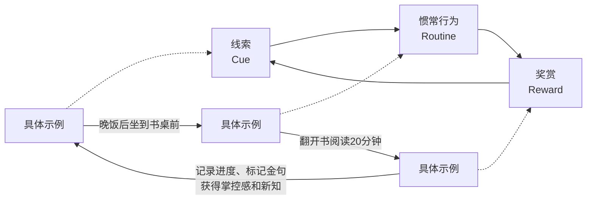
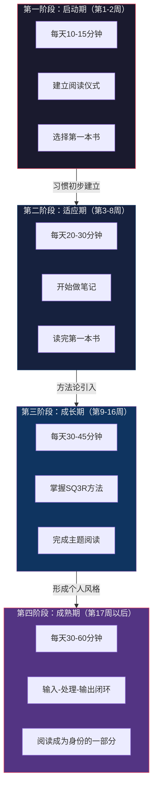
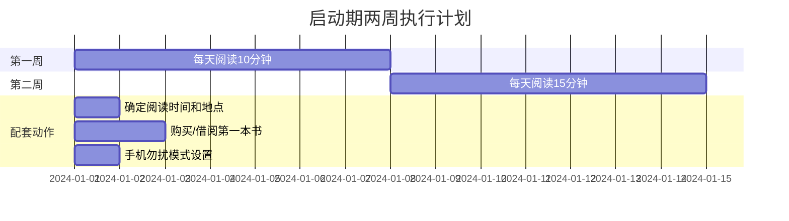
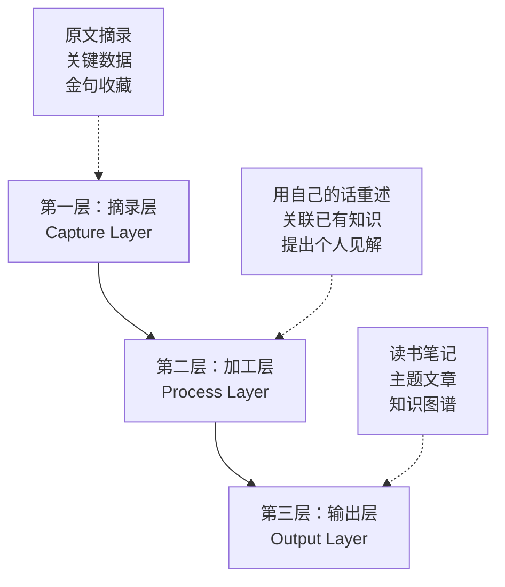
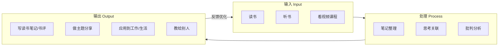
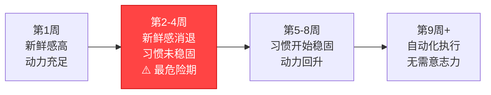

# 阅读的学习路径：从零基础到终身阅读者

## 为什么需要一条学习路径

许多人对阅读的认知停留在"拿起书来读"这个动作上，仿佛阅读能力是天生的——要么你是一个"爱读书的人"，要么不是。这种认知本身就是最大的障碍。事实上，阅读习惯的养成是一个有规律可循的行为改变过程，它遵循心理学中关于习惯形成的普遍规律，同时又具有阅读这一行为独有的特殊性。

美国杜克大学的一项研究表明，人类日常行为中约43%是习惯性行为，而非有意识的决策。这意味着，如果你能将阅读从"需要意志力维持的刻意行为"转变为"不需要思考就自动执行的习惯"，你就赢了。本路径要做的，正是这件事。

### 习惯形成的科学基础

理解习惯形成的底层机制，能让你在执行路径时更加坚定——你知道为什么这样做，而不仅仅是被告知要这样做。

查尔斯·杜希格在《习惯的力量》中提出了"习惯回路"（Habit Loop）模型：每一个习惯都由三个要素构成——**线索**（Cue）、**惯常行为**（Routine）和**奖赏**（Reward）。线索触发行为，行为执行后获得奖赏，奖赏强化线索与行为之间的联结，循环往复，直到自动化。

将这个模型映射到阅读上：

詹姆斯·克利尔在《原子习惯》中进一步将习惯形成的规律总结为四条法则：

| 法则 | 对应阶段 | 在阅读中的应用 |
|------|---------|--------------|
| 第一法则：让它显而易见 | 线索设计 | 把书放在你一定会看到的地方，设定固定阅读时间和地点 |
| 第二法则：让它有吸引力 | 行为设计 | 选择真正感兴趣的书，将阅读与愉悦体验绑定 |
| 第三法则：让它简单易行 | 行为设计 | 从每天10分钟开始，降低一切可能的阻力 |
| 第四法则：让它令人满足 | 奖赏设计 | 记录阅读进度，每完成一本书给自己小奖励 |

这四条法则不是平行的建议，而是一个递进的优先级序列。当你的习惯还没有建立起来时，**"简单"比"有吸引力"更重要**——你不需要爱上阅读，你只需要让它简单到不会拒绝。

### 为什么"渐进"比"一步到位"更有效

行为科学家BJ·福格（BJ Fogg）的"微习惯"理论给出了一个关键洞察：**行为的持续性与初始难度成反比**。你设定的目标越容易，你坚持的概率就越高。这不是因为"简单"意味着"低效"，而是因为习惯的真正价值不在于单次行为的产出，而在于行为的持续累积。

一个每天阅读10分钟、坚持365天的人，远比一个某天读了8小时、然后三个月没碰书的人收获更大。前者累积了60小时的阅读时间，更重要的是，他建立了一个自动运行的习惯系统。后者可能只有8小时的单次体验，而且这个体验大概率因为疲劳而质量不高。

本路径的设计理念正是基于这一科学基础：**小步启动、渐进提升、持续反馈、允许不完美**。

***

## 总体路线图

在进入每个阶段的详细说明之前，先看一下全貌：

各阶段的核心指标一览：

| 维度 | 启动期（第1-2周） | 适应期（第3-8周） | 成长期（第9-16周） | 成熟期（第17周+） |
|------|----------------|----------------|------------------|----------------|
| 每日时长 | 10-15分钟 | 20-30分钟 | 30-45分钟 | 30-60分钟 |
| 核心任务 | 建立仪式感 | 读完第一本书 | 掌握系统方法 | 形成个人风格 |
| 笔记要求 | 无 | 2-3句话摘要 | 系统化笔记 | 知识体系构建 |
| 选书策略 | 兴趣驱动 | 兴趣+需求 | 主题导向 | 体系导向 |
| 意志力消耗 | 高（需要提醒） | 中（偶尔需要） | 低（较自然） | 极低（自动执行） |
| 检验标志 | 连续7天阅读 | 读完第一本书 | 完成主题阅读 | 无需意志力维持 |

***

## 第一阶段：启动期（第1-2周）——播下种子

### 阶段本质

启动期的核心目标不是"读了多少"，而是**让大脑开始将阅读与特定的时间、地点和情境绑定**。神经科学研究表明，当一个行为反复在相同的情境中发生时，大脑会逐渐将情境线索与行为之间建立强联结——这就是习惯的神经基础。你的任务是在这两周内，为这种联结打下地基。

### 具体操作

#### 1. 选择你的第一本书——这是最关键的决策

选书的标准不是"应该读什么"，而是"什么能让你翻开后不想放下"。第一本书的使命只有一本：**让你体验到阅读的愉悦感**，而不是获取知识。

选书的五个实操标准：

- **兴趣优先**：选择你平时就关注的话题。喜欢历史就选历史故事，喜欢科幻就选科幻小说。不要因为别人推荐了一本"经典"就选它——经典有时候是无聊的代名词。
- **难度控制**：选择语言平实、逻辑清晰的书。避免学术性太强、翻译质量差、或需要大量前置知识的书。★★★☆☆及以下的难度是安全区。
- **篇幅适中**：200-300页。太厚会产生压迫感，太薄读完后缺少成就感。
- **叙事性强**：有故事、有案例、有场景的书比纯理论书更容易入门。《被讨厌的勇气》用对话体，《人类简史》用故事体，都是很好的入门选择。
- **口碑验证**：在豆瓣上评分8.0以上、评论数1000以上的书，踩雷概率较低。

**推荐的入门书单（按兴趣方向）**：

| 兴趣方向 | 推荐书目 | 理由 |
|---------|---------|------|
| 人生思考 | 《被讨厌的勇气》（岸见一郎） | 对话体，每章独立，可以随时放下和拾起 |
| 历史故事 | 《人类简史》（尤瓦尔·赫拉利） | 叙事宏大但语言通俗，视野开阔 |
| 心理学 | 《思考，快与慢》（丹尼尔·卡尼曼） | 每一章都是独立的心理实验，有启发性 |
| 科幻 | 《三体》（刘慈欣） | 故事驱动，让人欲罢不能 |
| 传记 | 《鞋狗》（菲尔·奈特） | 创业故事，节奏感强，像读小说 |
| 生活方式 | 《断舍离》（山下英子） | 篇幅短，实操性强，容易读完 |

#### 2. 设定"微目标"——小到荒谬也没关系

第一周的微目标：**每天阅读10分钟**。

不是30分钟，不是20分钟，就是10分钟。10分钟大约能读完一本普通书籍的5-8页——足够让你接触到一些新想法，又不至于让你感到疲惫或厌烦。

为什么是10分钟而不是更多？福格行为模型的核心公式是B=MAP——行为（Behavior）=动机（Motivation）×能力（Ability）×提示（Prompt）。当动机不确定时（刚开始培养习惯的你，动机是波动的），你只能通过降低能力门槛来确保行为发生。10分钟就是那个"低到不需要任何动机也能执行"的门槛。

第二周微目标：**每天阅读15分钟**。仅仅增加5分钟，但你已经在进步。

具体的执行节奏：

#### 3. 设计你的"阅读触发器"——让环境替你做决定

触发器（Trigger）是习惯回路的第一环。好的触发器应该满足三个条件：**固定、高频、与阅读有逻辑关联**。

**时间触发器**：选择一个每天都会发生的固定时刻作为阅读的"启动器"：
- 早晨起床后刷完牙（最推荐——精力最好，干扰最少）
- 午休后（如果午休时间固定）
- 晚饭后（将阅读作为晚餐后的第一个动作）
- 睡前30分钟（不推荐——容易犯困，而且会建立"阅读=犯困"的联结）

**地点触发器**：选择一个固定的位置专门用于阅读。这个位置不应该有多重用途——如果你在书桌前既工作又阅读，大脑会困惑你现在是该工作还是该阅读。哪怕只是一把特定的椅子、沙发的一角，甚至床上特定的一侧，都可以成为阅读的专属空间。

**物品触发器**：将书放在触发位置上，让它成为你环境中最显眼的物品。不要把书放在书架上——放在枕边、桌上、沙发上。视觉线索是触发行为最强有力的信号之一。

#### 4. 创建"低阻力"阅读环境

阻力是习惯的天敌。每一个额外的动作步骤都会降低你执行习惯的概率。你需要在开始阅读之前，就消除所有可能的阻力源。

**数字阻力消除清单**：
- 手机调至"勿扰模式"或物理隔离到另一个房间
- 关闭微信、微博、抖音等应用的通知推送
- 如果使用电子阅读器，关闭Wi-Fi（避免收到消息弹窗）
- 在电脑上使用"Forest"或"专注番茄"等APP锁定社交网站

**物理环境优化**：
- 确保阅读位置光线充足（自然光最佳，台灯选择色温4000K左右的暖白光）
- 准备一杯水或茶（阅读时容易口渴，提前准备避免起身打断）
- 如果环境嘈杂，准备一副降噪耳机或播放白噪音（推荐：雨声、咖啡厅背景音）

### 检验标准

启动期结束时，你应该能够做到：

- [x] 连续7天每天都完成了阅读（哪怕只有10分钟）
- [x] 已经建立了固定的阅读时间和地点
- [x] 能在不借助闹钟提醒的情况下想到"该读书了"
- [x] 阅读时不需要太大的意志力抵抗就能开始

如果你在两周结束时只完成了5-6天，也不要气馁——这仍然比之前的零天有了显著进步。关键是不要停止，直接进入下一阶段。

### 启动期的常见困难与深度应对

**困难1："我找不到时间阅读。"**

这个问题的深层原因不是"没有时间"，而是"阅读在我的优先级中不够高"。每个人每天都有24小时，区别在于如何分配。解决方法不是"找"时间，而是**用阅读替换一个优先级更低的活动**。

具体做法：
1. 记录你一天中所有的"无意识时间消耗"——刷短视频、刷新闻、无目的地翻手机
2. 统计这些活动每天占用了多少时间（大多数人会发现至少有1-2小时）
3. 从中拿出10分钟给阅读。10分钟，不多不少
4. 使用手机的"屏幕使用时间"功能来验证你的统计

**困难2："我一读书就犯困。"**

犯困的原因通常有三个：
1. **选错了时间段**：在精力低谷期（如饭后、深夜）阅读。解决：将阅读时间改到精力最好的时段，通常是上午9-11点或下午3-5点。
2. **选错了书**：内容无聊或难度过高，大脑为了逃避不适而选择"关机"。解决：换一本更有趣或更简单的书。
3. **被动阅读**：眼睛在扫字，大脑没有参与。解决：一边读一边用手指或笔尖引导视线，强迫大脑跟上眼睛的速度。

**困难3："我读了几页就读不下去了。"**

在启动期，读不下去就停下来。这不是放弃，这是**保护你的阅读体验**。强迫自己读下去只会让你建立"阅读=痛苦"的联结，适得其反。关键是明天继续翻开书——哪怕只读了3页，连续性也比单次时长重要100倍。

**困难4："我总是在阅读时走神。"**

走神是大脑的默认模式，不是你的问题。解决方法：
- **标记法**：手边放一支笔，每当走神时在书页边缘画一个小圆点。这会训练你对走神的觉察力——觉察本身就是专注的开始。
- **提问法**：阅读前提前给自己一个问题（如"这一章在讲什么？"），带着问题读会让大脑保持活跃。
- **缩短单次阅读时间**：如果10分钟内走神了5次，先改为5分钟——短到大脑来不及走神。

***

## 第二阶段：适应期（第3-8周）——生根发芽

### 阶段本质

适应期是从"建立仪式"到"建立能力"的过渡。在启动期，你学会了"坐下来读"；在适应期，你要学会"读进去"。这个阶段的核心是**提升阅读的专注力和持续性**，同时开始做最基础的笔记——让阅读从一次性体验变为可以积累的知识。

从神经科学的角度看，这个阶段对应的是习惯回路中"奖赏"的强化期。你的大脑已经开始将"坐到书桌前"和"翻开书"自动化，但这个联结还不够强。你需要通过持续的正向体验来加固它——这就是为什么从这一阶段开始引入笔记和阅读记录，它们提供了可量化的成就感反馈。

### 具体操作

#### 1. 渐进式提升阅读时长

这是经典的"渐进超负荷"原则——和健身一样，你不能直接从5公斤跳到50公斤，但你可以每周增加一点点。

| 周次 | 每日阅读时长 | 增量 | 等价阅读量（按每分钟2页计） |
|------|------------|------|------------------------|
| 第3周 | 20分钟 | +5分钟 | 约140页/周 |
| 第4周 | 20分钟 | 维持 | 约140页/周 |
| 第5周 | 25分钟 | +5分钟 | 约175页/周 |
| 第6周 | 25分钟 | 维持 | 约175页/周 |
| 第7周 | 30分钟 | +5分钟 | 约210页/周 |
| 第8周 | 30分钟 | 维持 | 约210页/周 |

注意"维持周"的设计——每增加一次时长后，下一周不增加，让大脑有时间适应新的强度。这和力量训练中"加重量-适应-再加重量"的节奏完全一致。

#### 2. 开始做"最低限度笔记"

笔记不是负担，而是**让你的大脑从被动接收信息转变为主动加工信息**的关键动作。认知心理学中的"生成效应"（Generation Effect）表明，主动生成的信息比被动接收的信息记忆保持率高30%-50%。

但在这个阶段，笔记要求必须足够低，低到不会成为阅读的阻力。

**最小可行笔记法（MVN - Minimum Viable Notes）**：

每次阅读结束后，花2分钟完成以下三个动作：

今日阅读笔记
━━━━━━━━━━━━
日期：____年__月__日
书名：《____________》
阅读页码：第__页 到 第__页
━━━━━━━━━━━━
1. 今天读到的核心内容（一句话概括）：
   ________________________________________________

2. 让我印象深刻的一个观点/故事/数据：
   ________________________________________________

3. 这个内容和我有什么关系？（可以不填）
   ________________________________________________

这个模板的核心设计逻辑：
- 第一个条目训练你的**概括能力**——能否用一句话说明白今天读了什么
- 第二个条目训练你的**筛选能力**——在众多信息中识别有价值的内容
- 第三个条目训练你的**关联能力**——将书本知识与个人经验连接（这是深度理解的基础）

**工具选择**：纸质笔记本、手机备忘录、Notion、Obsidian都可以。在这个阶段不要纠结工具，用你手边最方便的就行。工具的选择是第三阶段的事。

#### 3. 建立"阅读账户"——可视化你的进步

人类是视觉动物，看到自己的进步轨迹会产生强烈的成就感。这就是"阅读账户"的价值——让你的阅读行为变得可见。

**推荐平台**：
- **豆瓣读书**（douban.com）：中文世界最大的读书社区，标记"在读""读过""想读"三种状态，可以写短评和长评
- **微信读书**：如果你使用电子书，微信读书的阅读时长统计和笔记导出功能非常实用
- **Notion/Obsidian**：如果你偏好自建系统，可以创建一个阅读数据库，记录书名、作者、开始/结束日期、评分、一句话评价

**记录模板**（以豆瓣为例）：
- 标记"在读"时记录开始日期
- 读完后标记"读过"，写100字以上的短评
- 评分标准：★★★★★=改变了我的认知；★★★★=有实质收获；★★★=有可取之处；★★=浪费时间；★=不要读

#### 4. 尝试"场景迁移"——打破阅读的时空限制

在启动期，你建立了"固定时间+固定地点"的阅读仪式。这很好，但也有风险——如果某个条件不满足（出差、旅游、搬家），阅读就中断了。

在适应期，你需要开始**将阅读从特定场景中解放出来**：

- **通勤阅读**：如果你每天通勤超过30分钟，这是一个巨大的阅读时间池。准备一本电子书或一个有声书APP，将通勤时间变为阅读时间。
- **等待阅读**：等餐、等车、排队、等人——这些碎片时间每个只有5-10分钟，但一天累积起来可能有30分钟以上。在手机上常备一本正在读的电子书，利用这些碎片时间。
- **午休阅读**：午饭后的30分钟是阅读的好时机。吃完饭后不要立刻刷手机，而是翻开书读15-20分钟。

**关于有声书的补充说明**：有声书是阅读的一种有效形式，尤其是在通勤、做家务、运动等"手被占用但大脑空闲"的场景中。但有一个前提：你需要保持主动倾听的状态，而不是让声音成为背景噪音。建议在听有声书时不要同时做需要高度注意力的事情（如开车在复杂路段），并且听完一章后花1分钟回顾核心内容。

#### 5. 加入阅读社群——但保持边界感

社交压力是一把双刃剑。适度的社交压力可以提升动力（"别人都在读，我也要读"），但过度的社交压力会将阅读变成负担（"别人都读了10本了，我才读了1本"）。

**加入社群的正确姿势**：
- 选择一个氛围轻松、不攀比数量的读书社群
- 参与讨论但不要追求"发言数量"
- 从别人的分享中发现好书，但不要被书单淹没
- 如果社群让你感到焦虑而不是动力，果断退出

**线下读书会**：如果你所在的城市有线下读书会，强烈建议参加一次。面对面的讨论比线上文字交流更有深度，而且你可能会认识一些有趣的人。

### 适应期的检验标准

- [x] 连续14天每天阅读至少20分钟
- [x] 已经读完了第一本书（从头到尾）
- [x] 开始使用MVN最小可行笔记法
- [x] 在豆瓣或类似平台上建立了阅读记录
- [x] 至少尝试过一次在非固定时间/地点阅读

### 适应期的常见困难与深度应对

**困难1："阅读速度太慢，一个月都读不完一本书。"**

在这个阶段，速度完全不重要。一个月读完一本和两个月读完一本，对习惯养成的影响为零。你在这个阶段的唯一KPI是"每天坐下来读"，不是"读完多少本"。

但如果你确实想理解为什么慢，通常有三个原因：
1. **词汇量不足**：遇到太多不认识的词。解决：不要每个词都查，先根据上下文猜测，实在影响理解的再查。
2. **默读习惯**：在心里一个字一个字地"念"，限制了阅读速度。这个问题在第三阶段会专门解决。
3. **回读习惯**：反复看同一句话。这通常是因为注意力不集中，而不是内容太难。用手指引导视线可以显著减少回读。

**困难2："读了就忘，感觉没什么收获。"**

遗忘是正常的——艾宾浩斯遗忘曲线告诉我们，学习后24小时内会遗忘约70%的内容。但"读了就忘"和"读了没有收获"是两回事。

一本书中如果有3-5个对你有启发的点，并且这些点影响了你的思考或行为，这本书就已经值得了。不要期望记住所有内容——没有人能做到，包括那些声称自己"过目不忘"的人。

MVN笔记法就是对抗遗忘的第一道防线。每次花2分钟记录，你就能在日后快速回顾一本书的精华。

**困难3："总是被手机分散注意力。"**

物理隔离是最有效的方法，没有之一。研究表明，即使手机处于关机状态，只要它在你的视线范围内，就会占用你一部分认知资源（因为大脑需要抑制"去拿手机"的冲动）。所以，阅读时将手机放在另一个房间，而不仅仅是调成静音。

如果你必须用手机阅读（比如微信读书），使用APP内的"专注模式"功能，并在系统设置中关闭除阅读APP外的所有通知。

**困难4："读完了第一本书，不知道第二本读什么。"**

这是一个很好的信号——说明你已经从"能不能读"进入了"读什么"的阶段。建议：
- 如果第一本书让你意犹未尽，找同一作者的其他作品
- 如果第一本书提到了其他书，直接列入待读清单
- 查看本书"产品推荐"章节的分类书单，选择你感兴趣的领域
- 不要纠结"最优选择"——在适应期，任何一本你愿意翻开的书都是好选择

***

## 第三阶段：成长期（第9-16周）——枝繁叶茂

### 阶段本质

成长期是整个路径中**最具变革性的阶段**。在此之前，你建立的是"阅读习惯"；在此之后，你要建立的是"阅读能力"。两者的区别在于：习惯让你坐下来，能力让你读进去、读出来。

这个阶段引入三个核心升级：
1. **方法论升级**：从"随便翻翻"到使用结构化的SQ3R阅读法
2. **笔记系统升级**：从"随手记"到系统化的知识管理
3. **选书策略升级**：从"感兴趣就买"到有规划的主题阅读

### 具体操作

#### 1. 掌握SQ3R阅读法——从被动阅读到主动阅读

SQ3R是由教育心理学家弗朗西斯·罗宾逊（Francis Robinson）在1946年提出的阅读方法，经过近80年的教学实践验证，被公认为最有效的学术阅读方法之一。SQ3R代表五个步骤：Survey（浏览）、Question（提问）、Read（阅读）、Recite（复述）、Review（复习）。

**为什么SQ3R有效**？因为它将阅读从一个被动的"眼睛扫描文字"过程，转变为一个主动的"大脑提出问题并寻找答案"过程。认知心理学研究表明，带有明确目的的阅读，其信息获取效率是无目的阅读的2-3倍。

**SQ3R的五步详解**：

**Step 1：Survey（浏览）——3-5分钟**

不要急着从第一个字开始读。先花3-5分钟快速浏览全章：
- 阅读标题、副标题、加粗文字
- 看图表、表格、示意图
- 阅读每段的第一句话（通常是主题句）
- 阅读本章末尾的总结或要点

目的：在大脑中建立一个"知识地图"，让你知道这一章大概在讲什么，有哪些主要话题。

**Step 2：Question（提问）——1-2分钟**

将标题和副标题转化为问题。例如：
- 标题"记忆的三个阶段" → "记忆的三个阶段分别是什么？它们如何协同工作？"
- 标题"SQ3R阅读法" → "SQ3R的每个步骤具体怎么做？为什么它比普通阅读更有效？"

目的：带着问题阅读，大脑会自动搜索答案，注意力自然集中。

**Step 3：Read（阅读）——主要时间**

带着上一步提出的问题，仔细阅读全章。在阅读过程中：
- 用铅笔在关键段落旁做标记（画线、画星号、写关键词）
- 在页边空白处写下你的思考（同意、反对、联想到什么）
- 遇到问题的答案时，用荧光笔或特殊符号标记

**Step 4：Recite（复述）——每读完一节后**

合上书，用自己的语言回答你在Step 2中提出的问题。可以：
- 大声说出来（最有效——如果你能清晰地解释给别人听，说明你真的懂了）
- 写下来（次优选择——用3-5句话概括这一节的核心内容）
- 在脑海中默述（最低要求——至少在脑中过一遍）

如果答不上来，说明这一节你没有真正理解，回去重新阅读相关段落。

**Step 5：Review（复习）——读完全章后**

读完全章后，花5-10分钟：
- 回顾所有的笔记和标记
- 将各节的核心内容串联起来，形成对全章的整体理解
- 回答："这一章最重要的3个观点是什么？"

**SQ3R的渐进式引入策略**：

不要试图一次性完美执行所有五个步骤——这会让你在第一周就放弃。建议按照以下节奏逐步引入：

| 阶段 | 执行步骤 | 时间增量 |
|------|---------|---------|
| 第9-10周 | 仅执行 S+Q+R（浏览+提问+阅读） | +5分钟 |
| 第11-12周 | 加入 Recite（复述） | +10分钟 |
| 第13-14周 | 加入 Review（复习） | +5分钟 |
| 第15-16周 | 完整SQ3R流程 | 稳定在30-45分钟 |

#### 2. 建立系统化的笔记体系——从记录到知识管理

在适应期你使用的MVN最小可行笔记法是"够用"的，但在成长期，你需要升级为一个**能够积累和检索**的笔记系统。因为你读的书越来越多，如果笔记仍然是散落的，它们就无法产生"复利效应"。

**笔记系统的三层架构**：

**推荐的笔记方法——卡片笔记法（Zettelkasten）的简化版**：

德国社会学家尼克拉斯·卢曼使用卡片笔记法（Zettelkasten）一生发表了70本书和400多篇论文。你不需要复制他的完整系统，但可以借鉴其核心思想：**每条笔记是一个独立的知识单元，通过链接形成知识网络**。

具体操作：
1. **文献笔记**（每本书对应一组）：记录书中的关键观点、数据、案例，标注页码
2. **闪念笔记**（随时记录）：阅读时突然想到的灵感、联想、疑问
3. **永久笔记**（精选整理）：从文献笔记和闪念笔记中筛选最有价值的内容，用自己的语言重新表述，并与已有笔记建立链接

**工具选择建议**：

| 工具 | 优势 | 劣势 | 适合人群 |
|------|------|------|---------|
| Obsidian | 本地存储，双向链接，Markdown | 学习曲线较陡 | 喜欢折腾的技术型读者 |
| Notion | 模板丰富，协作方便 | 依赖云端，有一定学习成本 | 喜欢视觉化管理的读者 |
| 微信读书笔记 | 与阅读无缝集成，导出方便 | 功能有限，不方便二次整理 | 主要使用微信读书的读者 |
| 纸质笔记本 | 零学习成本，手写有记忆加成 | 不便检索，无法链接 | 偏好传统方式的读者 |
| Logseq | 开源，大纲式，双向链接 | 生态不如Obsidian丰富 | 喜欢大纲思维的读者 |

#### 3. 完成第一次主题阅读——从"读一本书"到"研究一个主题"

主题阅读是阅读能力的分水岭。在你完成第一次主题阅读之前，你是一个"读书的人"；在你完成之后，你是一个"用阅读研究世界的人"。

**主题阅读的精简流程**：

**第一步：选择主题**（1天）
- 主题要具体：不是"心理学"，而是"如何提升意志力"
- 主题要与你当前的需求相关：工作上遇到了什么问题？生活中有什么困惑？
- 主题要有足够的高质量书籍：至少5本以上

**第二步：建立书单**（1-2天）
- 在豆瓣搜索该主题，按评分排序
- 查看高分书籍的参考文献和推荐书目
- 选择3-5本，由浅入深排列
- 快速浏览每本书的目录，确认它们确实覆盖了你想了解的方面

**第三步：快速预读**（每本书2-3小时）
- 不需要逐字逐句读每一本书
- 对3-5本书进行检视阅读（快速浏览目录、标题、总结）
- 确定哪些书需要精读，哪些只需要读关键章节

**第四步：对比阅读**（主要时间，2-4周）
- 围绕同一个问题，对比不同书的观点
- 记录共识（大多数书都认同的观点）
- 记录分歧（不同书之间的矛盾观点）
- 分析分歧的原因（研究方法不同？对象不同？时代不同？）

**第五步：综合输出**（3-5天）
- 将所有阅读笔记整合为一篇主题总结
- 形成你自己对该主题的系统性理解
- 输出为一篇3000-5000字的读书报告或博客文章

#### 4. 每月"阅读回顾"——建立反馈循环

每月最后一个周末，花1-2小时进行"阅读回顾"。这不是可选的——**没有反馈的系统无法自我优化**。

**月度回顾模板**：

## [月份] 阅读回顾

### 本月完成
- 书名 | 评分（1-5星）| 一句话评价

### 本月阅读时长统计
- 总时长：___小时
- 日均：___分钟
- 最高单日：___分钟
- 中断天数：___天

### 最大收获
本月阅读中最有价值的一个观点/方法/案例：
___________________________________

### 需要改进的
- 选书方面：___
- 阅读方法方面：___
- 笔记方面：___
- 时间管理方面：___

### 下月计划
- 计划阅读的书目：___
- 重点研究的主题：___
- 需要尝试的新方法：___

### 成长期的检验标准

- [x] 能够在阅读中使用SQ3R的至少三个步骤（S+Q+R）
- [x] 已完成一次主题阅读（至少3本同主题书籍的对比阅读）
- [x] 建立了个人笔记系统，并且使用超过4周
- [x] 每月阅读时间稳定在15-20小时以上
- [x] 完成了至少2次月度阅读回顾
- [x] 能够输出至少一篇完整的读书笔记或主题报告

### 成长期的常见困难与深度应对

**困难1："SQ3R太复杂了，执行起来很费时间。"**

SQ3R的五个步骤确实比"直接开始读"要慢。但你需要理解一个关键区别：**效率不是"读得快"，而是"读了能用"**。如果逐字逐句读完一本书后什么都记不住，那再快也是浪费时间。

渐进引入是关键。前两周只做S+Q+R（浏览+提问+阅读），这三个步骤只增加5分钟的前期准备时间，但能显著提升阅读的专注度和理解深度。等这三个步骤成为习惯后，再加入复述和复习。

**困难2："主题阅读中不同书的观点相互矛盾，不知道该信谁。"**

这恰恰是主题阅读最大的价值——它迫使你发展**批判性思维**。当两本书对同一个问题给出相反的答案时，正确的做法不是选择其中一个，而是追问：
- 他们的研究方法有什么不同？
- 他们的研究对象有什么不同？
- 他们的结论是基于什么数据或案例？
- 他们的时代背景和立场有什么差异？

记录这些异同点，然后形成你自己的判断——这才是真正的"独立思考"。

**困难3："感觉阅读变成了任务，失去了乐趣。"**

这说明你在方法论上投入了太多精力，忘记了阅读的初衷。每个月留出20%-30%的阅读时间给"无用之书"——纯粹为了兴趣和快乐而读的小说、漫画、散文。方法是手段，不是目的。如果方法让你痛苦，那就暂时放下方法。

**困难4："笔记太多，找不到之前记的内容。"**

这是笔记系统缺乏结构的典型症状。解决方案：
- 为每条笔记添加标签（Tag），如#心理学 #习惯 #认知偏差
- 建立一个"索引笔记"——一页汇总所有重要笔记的链接
- 每月回顾时整理一次笔记，删除不再有价值的，合并重复的
- 如果你用Obsidian，善用"图谱视图"（Graph View）发现笔记之间的关联

***

## 第四阶段：成熟期（第17周以后）——开花结果

### 阶段本质

成熟期的标志是：**阅读已经从一个"需要坚持的习惯"变成了一个"自然而然的行为"**。你不再需要闹钟提醒你读书，就像你不需要闹钟提醒你刷牙一样。阅读已经成为你身份的一部分——你不是"一个在努力培养阅读习惯的人"，而是"一个阅读者"。

在这个阶段，你的核心任务从"如何坚持阅读"转变为"如何让阅读产生更大的价值"。

### 具体操作

#### 1. 形成个人阅读风格——从模仿到创造

经过前三个阶段，你已经接触了SQ3R、卡片笔记法、主题阅读等标准化方法。在成熟期，你需要将这些方法**融合、改良、个性化**，形成最适合自己的阅读工作流。

**个性化调整的方向**：
- **阅读节奏**：有人喜欢每天固定时间读30分钟，有人喜欢周末集中读3小时。找到让你最舒服的节奏。
- **笔记风格**：有人喜欢详细摘录，有人喜欢只记关键词。只要你的笔记能帮你在日后回忆和应用，什么风格都行。
- **选书标准**：你已经读了足够多的书，知道什么是好书、什么是烂书。信任自己的判断。
- **精读/泛读比例**：不是每本书都值得精读。成熟读者的比例通常是30%精读+70%泛读。

#### 2. 建立"输入-处理-输出"闭环——让知识产生复利

单纯的阅读（输入）是最低效的学习方式。学习金字塔理论（Learning Pyramid）指出，"阅读"的信息留存率只有10%，而"教授给他人"的留存率高达90%。

**具体输出方式**：

1. **写读书笔记/书评**（最低门槛）：每读完一本书，写一篇500-2000字的书评。不需要写给别人看，写给未来的自己看就行。
2. **主题文章/博客**（中等门槛）：将同一主题的多本书的阅读心得整合为一篇深度文章。这是输出能力的质变——你需要将不同来源的信息综合成一个连贯的论述。
3. **分享和讨论**（中等门槛）：在读书社群、朋友圈、或工作场合分享你的阅读收获。"教是最好的学"不是鸡汤——教学过程中你被迫将模糊的理解转化为清晰的表达。
4. **实践应用**（最高价值）：将阅读中学到的方法、思维模型、工具应用到实际工作和生活中。读了一本关于沟通的书，就在下次会议中有意识地使用其中的技巧。知行合一是阅读的终极目的。

#### 3. 持续优化阅读系统——保持进化

成熟不意味着停止进化。世界在变，你的需求在变，你的阅读系统也应该随之调整。

**年度阅读系统审计**（每年1月进行一次）：

| 审计维度 | 审计问题 |
|---------|---------|
| 选书质量 | 去年读的书中，有多少本让我真正受益？选书标准需要调整吗？ |
| 阅读方法 | 目前的阅读方法是否仍然高效？有没有新的方法值得尝试？ |
| 笔记系统 | 笔记是否容易检索？是否有大量"死笔记"从未被回顾？ |
| 时间分配 | 阅读时间是否充足？是否有被浪费的时间可以回收？ |
| 输出质量 | 输出的频率和质量如何？是否有意识地在提升输出能力？ |
| 知识应用 | 有多少阅读中获得的知识被真正应用到了实践中？ |

#### 4. 拓展阅读的深度和广度——构建T型知识结构

在成熟期，你应该开始有意识地构建自己的**T型知识结构**——横向覆盖多个领域（广度），纵向在一个或两个核心领域深入（深度）。

**深度方向**（纵向）：
- 选择1-2个与你职业或长期兴趣最相关的领域
- 进行系统性的主题阅读：从入门书到进阶书到学术论文
- 目标：在这些领域达到"可以和专家对话"的水平
- 阅读学术论文和前沿研究，而不仅仅是通俗读物

**广度方向**（横向）：
- 定期尝试完全陌生的领域——每年至少读2-3本你"专业"之外的书
- 跨界阅读是创新的源泉：物理学的概念可能启发你对组织管理的思考，生物学的模型可能帮你理解市场行为
- 推荐的跨界领域：科学哲学、认知心理学、复杂系统、进化论、经济学基础

#### 5. 成为阅读的传播者——从读者到引领者

传播不是炫耀，而是**通过教授来深化自己的理解，同时帮助他人获得阅读的乐趣**。

- **推荐好书**：当你读到一本好书时，写一段推荐语发给可能感兴趣的朋友。精准推荐比群发更有价值。
- **组织读书会**：哪怕只有2-3个人，定期讨论一本书的读书会也能产生远超个人阅读的深度——因为他人的视角会照亮你的盲区。
- **写作和分享**：建立一个持续输出的习惯——博客、公众号、小红书、知乎专栏，任何平台都行。持续输出会反过来倒逼你持续输入。
- **成为引导者**：帮助身边想培养阅读习惯但不知道如何开始的人。你会发现，在教别人的过程中，你对阅读方法论的理解会更加深入。

### 成熟期的检验标准

- [x] 阅读已经成为不需要意志力维持的日常习惯
- [x] 每年阅读量稳定在12-24本书以上
- [x] 有自己独特的阅读方法论和笔记系统
- [x] 能够定期输出阅读内容（笔记、文章、分享）
- [x] 阅读对你的工作或生活产生了可观察的积极影响
- [x] 能够清晰地向他人解释你的阅读方法

***

## 特殊情况的应对策略

### 情况1："我实在太忙了，根本没有时间阅读。"

"没有时间"通常是一个优先级问题，而不是时间问题。以下是经过验证的策略：

**策略一：审计你的时间**（适用于不知道时间去哪了的人）

连续三天记录你从起床到睡觉的每30分钟时间块。你大概率会发现每天有1-3小时的"无意识时间消耗"——刷短视频、无目的地浏览新闻、重复检查社交媒体。从中拿出10分钟给阅读。

**策略二：习惯叠加**（适用于已有固定习惯的人）

将阅读绑定到一个你每天都会做的习惯之后：
- 刷牙之后 → 阅读10分钟
- 坐上地铁之后 → 打开电子书
- 午饭之后 → 阅读15分钟

**策略三：碎片化阅读**（适用于日程完全碎片化的人）

将阅读拆分为3个5分钟的碎片，分布在一天中的不同时段。研究表明，3次5分钟的阅读在记忆保持上的效果，接近一次15分钟的连续阅读。

**策略四：早起阅读**（适用于晚上精力不足的人）

比平时早起20分钟，用这20分钟阅读。早晨是一天中干扰最少、精力最充沛的时段。你需要的只是早睡20分钟来保证总睡眠时间不变。

### 情况2："我总是买书但不读。"

心理学上这叫做**"替代满足"（Surrogate Satisfaction）**——购买书籍的行为本身会激活大脑的奖赏回路，给你一种"我在学习"的满足感，从而降低实际阅读的动力。研究发现，购买书籍后实际阅读完成率不到30%。

**应对方法**：
- **"一进一出"规则**：在读完手头的书之前，不买新书。想读的书列入"待读清单"，而不是"购物车"。
- **先借后买**：图书馆借阅或电子书试读，读完再决定是否购买收藏。很多书你翻了几页就不想读了——让图书馆帮你筛选。
- **限制同时在读数量**：一次只读一本书。同时开3-5本是"买书不读"的变体——你把注意力分散了，结果每本都读不完。
- **年度购书预算**：设定一个合理的年度购书预算（如500元），迫使你在购买前做筛选。

### 情况3："我坚持了几周就放弃了。"

习惯养成中最危险的时刻不是第一天，而是**第2-4周**——最初的新鲜感消退，但习惯还没有稳固。这就是行为科学中的"习惯死亡谷"（Habit Valley of Death）。

**跨越"死亡谷"的策略**：

1. **不要追求完美**：习惯养成中有一条"绝不连续中断两天"的法则。偶尔中断一天是正常的，但第二天必须恢复。连续中断三天以上，习惯回路就会开始断裂。
2. **降低门槛**：如果30分钟太难了，回到15分钟。如果15分钟也难，回到5分钟。任何大于零的数字都是胜利。
3. **找到"责任伙伴"**：和一个朋友约定互相督促。每天晚上互发消息报告今天的阅读情况。社交承诺比自我承诺更有约束力。
4. **设置里程碑奖励**：每读完一本书，给自己一个小奖励——一杯好咖啡、一顿美食、一集想看的剧。奖励要即时、具体、与阅读相关或你喜欢的。
5. **回顾你的"为什么"**：在你最想放弃的时候，回到你最初开始阅读的那个原因。把那个原因写在卡片上，放在你的阅读位置旁边。

### 情况4："我读得很慢，一年读不了几本书。"

阅读速度不是衡量阅读能力的唯一标准，甚至不是最重要的标准。一个读得慢但理解深刻、能应用所学的人，远比一个读得快但什么都没记住的人更有收获。

**但如果你想客观评估和提升自己的速度**：

正常的中文阅读速度大约是每分钟300-500字（普通书籍）。低于这个范围通常是因为以下原因之一：

| 慢的原因 | 表现 | 解决方法 |
|---------|------|---------|
| 默读 | 嘴唇在动或心里在"念" | 用手指引导视线，让眼睛移动速度超过默读速度 |
| 回读 | 频繁回头看已经读过的句子 | 用书签遮住已读部分，强迫自己向前推进 |
| 逐字阅读 | 一次只看一个字 | 练习"视幅扩展"——一次看一个词组或短句 |
| 词汇障碍 | 频繁遇到不认识的词 | 不要每个词都查，根据上下文猜测 |
| 注意力不集中 | 读着读着就走神了 | 缩短单次阅读时间，使用SQ3R的提问步骤 |

**区分精读和泛读**：不是每本书都需要逐字逐句地读。一些实用的判断标准：
- **需要精读的书**：教科书、经典著作、与你职业直接相关的专业书、你准备深入研究的主题书
- **可以泛读的书**：畅销书、科普读物、新闻类、大部分商业书、消遣类小说
- **可以跳读的书**：仅为了获取某个特定信息、参考工具书、与你已有知识高度重叠的书

### 情况5："我不知道该读什么书。"

"不知道读什么"通常不是信息不足，而是信息过载——推荐太多，反而不知道选哪个。

**解决方法**：
1. **从问题出发**：你最近在工作或生活中遇到了什么问题？困惑什么？想提升什么？围绕这个问题搜索相关书籍。
2. **从兴趣出发**：你平时刷短视频、看公众号、和朋友聊天时，最常关注什么话题？那就是你的兴趣所在。
3. **从引用出发**：你读过的书引用了哪些其他书？好书引用的其他书通常也是好书。
4. **从信任出发**：找到1-2个和你兴趣相投、品味靠谱的书评人或读书博主，定期关注他们的推荐。
5. **从薄书开始**：选择200页以下的书，降低心理压力。快速读完一本薄书的成就感会激发你读下一本的动力。

### 情况6："我读完一本书后不知道该读什么。"

这是"阅读空白期"——上一本书的满足感还没消退，但新的阅读目标还没确定。

**解决方法**：
- **永远保持"待读队列"**：随时记录感兴趣的书籍，维护一个至少包含5本书的待读清单。当你读完一本时，直接从队列中取出下一本。
- **做主题延伸**：读完一本关于某个主题的书后，找同主题的其他书继续阅读。不知不觉中，你就在进行主题阅读了。
- **查看参考文献**：好书引用的其他书通常也是好书。翻到一本好书的参考文献页面，你经常会发现一个宝藏。
- **轮换领域**：如果你连续读了3本心理学的书，下一本换一个完全不同的领域——历史、科幻、商业。跨领域阅读保持新鲜感。

### 情况7："我总是被'经典必读书单'绑架。"

许多人有一个错觉：必须先读完所有"经典"，才有资格读自己想读的书。这是完全错误的。

经典之所以经典，是因为它们在特定时代提出了重要思想。但并不是所有经典都适合当下的你。如果你读一本"经典"读得非常痛苦，可能是因为：
- 翻译质量差——换一个译本试试
- 时代背景差异太大——先读一本介绍该经典思想的通俗读物，再回来读原著
- 你的前置知识不够——先读一些入门书，再挑战经典
- 这本书确实不适合你——放下它，换一本，没有关系

**阅读的唯一标准是"对当下的你有价值"**，而不是"别人都说它好"。

***

## 不同人生阶段的阅读策略调整

学习路径不是一成不变的模板。不同的人生阶段有不同的时间约束、认知需求和阅读目标，你需要灵活调整。

### 学生阶段（高中/大学）

**优势**：时间相对充裕，学习是主要任务，记忆能力强。
**挑战**：教材占用了大量阅读精力，课外阅读容易被忽略。
**策略**：
- 将课外阅读与专业学习结合——选择与专业相关的通俗读物
- 利用寒暑假进行集中阅读——两个月的假期可以读完10-15本书
- 参加学校的读书社团——这是建立阅读社交圈的最佳时机
- 优先阅读"元技能"类书籍——学习方法、思维模型、沟通技巧

### 职场新人阶段（工作1-3年）

**优势**：有明确的职业需求，阅读动力强。
**挑战**：工作消耗大量精力，阅读时间被严重压缩。
**策略**：
- 优先阅读与职业直接相关的书籍——快速提升专业能力
- 利用通勤时间听有声书——将不可避免的通勤时间转化为学习时间
- 建立"工作问题驱动"的阅读模式——遇到什么问题就读什么书
- 不要追求阅读数量——一本被你真正应用的好书胜过十本翻过的书

### 职场中期阶段（工作3-10年）

**优势**：有了丰富的实践经验，阅读时能更好地将理论与实践结合。
**挑战**：工作压力大，家庭责任增加，阅读时间进一步被压缩。
**策略**：
- 从"快速阅读"转向"深度阅读"——精读少量高质量的书
- 开始跨领域阅读——用其他领域的思维模型解决本领域的问题
- 将阅读与写作结合——通过写文章、做分享来深化理解
- 建立主题阅读计划——每年深入研究1-2个主题

### 家庭育儿阶段

**优势**：以身作则培养孩子的阅读习惯。
**挑战**：时间极度碎片化，精力被严重分散。
**策略**：
- 利用孩子午睡和晚上入睡后的时间阅读
- 选择篇幅短、章节独立的书——随时可以放下和拾起
- 和孩子一起阅读——亲子阅读既培养孩子的习惯，也保持你的阅读量
- 有声书在做家务时特别有用

***

## 本节总结

从零基础到成为终身阅读者，是一段需要耐心、策略和自我理解的旅程。本节提供的四阶段路径——启动期、适应期、成长期、成熟期——是基于行为科学和认知心理学设计的渐进式方案，它不要求你一步到位，只要求你每天进步一点点。

**核心记住这六条**：

1. **小步启动，不追求完美**：每天10分钟就够了。不要让完美主义成为行动的敌人。
2. **连续性大于单次时长**：每天读10分钟连续30天，远好于一次读5小时然后放弃。
3. **方法是工具，不是目的**：SQ3R、卡片笔记法都是帮你更高效阅读的工具。如果工具让你痛苦，换一个或暂时放下。
4. **输出决定输入的质量**：读完一本书后写200字的感想，比读两本书但什么都不写更有价值。
5. **允许中断，但绝不放弃**：中断一两天是正常的，但不要让中断变成停止。第二天继续就是胜利。
6. **享受过程**：阅读应该是快乐的。如果你在某个阶段感到痛苦，说明方法或书选错了，调整就好。

**你现在需要做的只有一件事**——选择一本书，翻开第一页，开始阅读。

不需要等"准备好了"，不需要等"找到了最好的方法"，不需要等"买了合适的工具"。打开你手边的任何一本书，读10分钟。这就是你的第一步。
