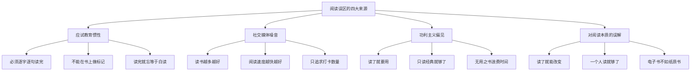
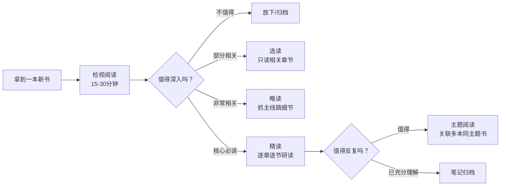
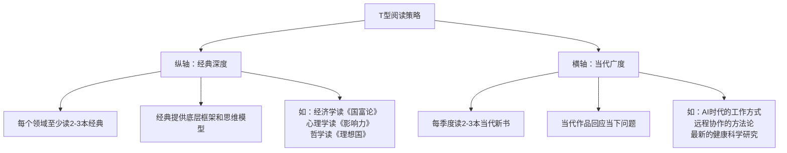
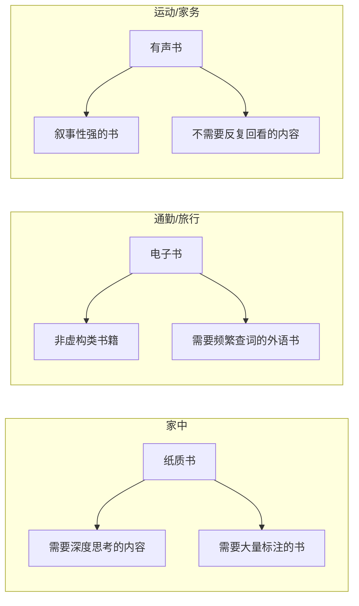
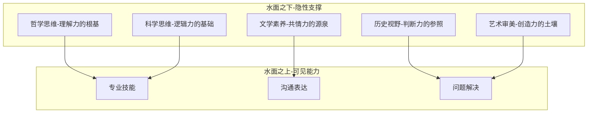
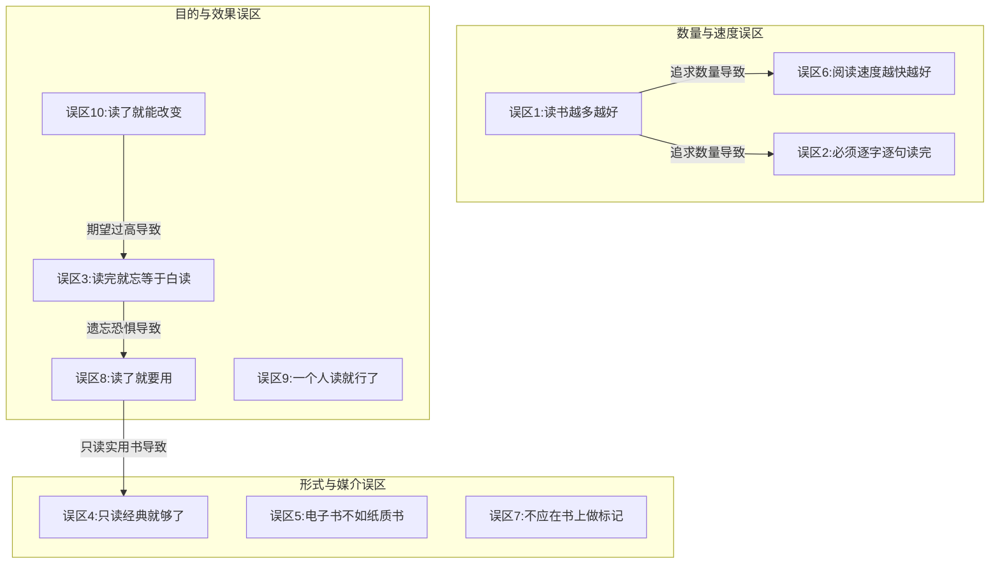

# 阅读的十大常见误区：自我诊断与认知升级指南

## 引言：为什么识别误区比学习技巧更重要

在阅读这件事上，许多人持有看似合理、实则严重阻碍成长的观念。这些误区的来源非常集中：**应试教育的惯性**（必须读完、不能做标记）、**社交媒体的噪音**（追求数量、炫耀打卡）、**功利主义的偏见**（只读有用的）、以及**对阅读本质的根本误解**（读了就能改变）。

误区的危险在于它的"合理性"——每个误区都有一套自洽的逻辑，让你觉得"这样做没问题"。但正是这种合理性，让你在错误的道路上越走越远，浪费了大量时间和精力，却没有获得应有的阅读回报。

本章逐一分析10个最常见的阅读误区。每个误区都包含**误区描述→为什么是误区（含科学依据）→正确认知→行动建议→自查清单**五个部分，确保你不仅能"知道"这些误区，还能在日常阅读中"识别并纠正"它们。

---

## 自我诊断：你中了几个误区？

在逐一分析之前，先做一个快速自测。对以下10个陈述，勾选你认同的：

| 序号 | 陈述 | 你认同吗？ |
|:----:|------|:--------:|
| 1 | 一年读的书越多，说明阅读能力越强 | ☐ |
| 2 | 开始读一本书就应该从头读到尾 | ☐ |
| 3 | 读完就忘的书等于白读 | ☐ |
| 4 | 只有经典才值得花时间读 | ☐ |
| 5 | 纸质书的阅读效果一定比电子书好 | ☐ |
| 6 | 读得快说明阅读能力强 | ☐ |
| 7 | 不应该在书上折角、画线、写批注 | ☐ |
| 8 | 读了用不上的书就是浪费时间 | ☐ |
| 9 | 阅读是个人行为，不需要和别人讨论 | ☐ |
| 10 | 读了一本好书就应该能立刻看到改变 | ☐ |

**结果解读：**
- **0-2个认同**：你已经建立了成熟的阅读认知，本章内容可以作为"防复发"的提醒
- **3-5个认同**：你有一些需要调整的阅读观念，本章会帮你系统性纠正
- **6-8个认同**：你的阅读效率可能远低于潜力，认真读完本章会有显著提升
- **9-10个认同**：你的阅读观念急需全面更新，本章是你最应该优先阅读的内容

---

## 误区一：读书越多越好——数量崇拜的认知陷阱

### 误区描述

许多人将"一年读了多少本书"作为衡量阅读能力的核心指标，甚至在社交媒体上炫耀自己的年度阅读数量。在这种观念下，阅读变成了一场数字竞赛——追求的是数量积累，而非质量提升。一些人甚至以"一年读300本书"为荣，却说不清任何一本书的核心论点。

### 为什么是误区

**科学依据：浅层加工的记忆衰减曲线。** 心理学中的"加工深度理论"（Craik & Lockhart, 1972）明确指出：信息的记忆持久度与加工深度成正比。快速浏览一本书产生的记忆痕迹极其微弱，根据艾宾浩斯遗忘曲线，未经深度加工的信息在24小时内遗忘66%以上，一周后仅残留约15%。

这意味着：如果你一年快速浏览100本书，到年底你可能记不住其中任何一本的核心内容。这不是"阅读"，而是"翻书"。

**更深层的问题：虚假的成就感。** 数量目标会扭曲你的选书策略——你会不自觉地选择薄的、简单的、熟悉的书来"充数"，避开那些真正有挑战性的好书。你读的书越来越多，但认知水平并没有同步提升。

**认知科学的补充：能力圈陷阱。** 只读轻松的书意味着你始终停留在"舒适区"。心理学家Lev Vygotsky的"最近发展区"理论表明：真正的学习发生在舒适区边缘——略高于你当前水平的挑战区。读100本低于你水平的书，不如精读10本能推动你向上突破的书。

### 正确认知

**阅读的目标应该是"理解和内化"，而非"数量积累"。** 一年深度阅读12本书并真正吸收其中的精华，远好于一年快速浏览100本书却什么也没记住。

查理·芒格说过："我见过的聪明人没有不每天阅读的，但他们读的书并不一定很多——关键是他们读的每一本都读透了。"

**判断标准的转变：**

| 旧标准（数量导向） | 新标准（质量导向） |
|:---:|:---:|
| 今年读了多少本书 | 今年有多少本书真正影响了我的思维 |
| 每月完成几本 | 每月深度吸收了几章 |
| 读完就算完成 | 能复述、能应用、能教别人才算完成 |

### 行动建议

1. **设定质量目标而非数量目标**：如"每月深度阅读一本书，能用自己的话复述核心内容，并找到至少一个可执行的行动项"
2. **对好书实行"三遍制"**：第一遍通读理解框架，第二遍精读做笔记，第三遍回顾并应用
3. **建立"阅读影响力档案"**：每季度回顾读过的书，记录每本书对你的思维和行为产生了什么具体影响
4. **警惕"阅读幻觉"**：如果你无法在读完一个月后说出一本书的三个核心观点，说明你没有真正读进去

### 自查清单

- [ ] 我设定的阅读目标是质量导向而非数量导向
- [ ] 我选书时优先选择有挑战性的书，而非容易读完的书
- [ ] 我能复述最近读过的三本书的核心论点
- [ ] 我不会为了凑数量而选择低于自己水平的书

---

## 误区二：必须逐字逐句读完一本书——沉没成本的心理枷锁

### 误区描述

很多人认为，既然开始读一本书，就必须从第一页读到最后一页，一字不漏。如果中途放弃或跳着读，就会产生"不完整"的焦虑感和"浪费"的负罪感。有些人甚至因为一本书读不下去而怀疑自己的阅读能力。

### 为什么是误区

**根源：应试教育的惯性。** 这种观念源于学校教育——考试会考到课本的每一个角落，所以必须逐字逐句地读。但成人的自主阅读与学生的应试阅读有本质区别：应试阅读的目的是"不遗漏考点"，自主阅读的目的是"最大化理解价值"。

**沉没成本谬误。** 经济学中的"沉没成本谬误"在这里完美适用：你已经花了两周时间读了80页，所以觉得"放弃太可惜"。但问题是：继续读下去并不会让已经投入的时间"回本"——只会让你投入更多低回报的时间。

**认知资源的错配。** 莫提默·艾德勒在《如何阅读一本书》中明确指出：不是每本书都值得用同样的方式阅读。有些书值得精读（分析阅读），有些书只需要检视阅读（15-30分钟浏览），有些书甚至可以只读其中与你最相关的几个章节。

**"不适合"不等于"不好"。** 一本书不适合你，可能是因为它与你当前的知识水平不匹配（太浅或太深）、与你的需求不相关、或者它的写作风格与你的阅读习惯不兼容。这些都不是"书的问题"或"你的问题"，只是"匹配问题"。

### 正确认知

**你有权放弃一本不适合你的书。** 这不是半途而废，而是明智的时间管理。你的阅读时间是有限的稀缺资源，应该花在最高回报率的书上。

**实践"50页法则"：** 如果读了30-50页仍然无法吸引你，就果断放下。人生太短，好书太多，不值得在一本不适合你的书上浪费时间。

**灵活选择阅读深度：**

### 行动建议

1. **每本书先进行检视阅读**（15-30分钟）：看目录、前言、后记、每章开头结尾，判断是否值得深入
2. **设定"50页规则"**：50页后仍无感，果断放下。记录放弃的原因，帮助你未来更精准地选书
3. **建立"半途而废"档案**：不是用来自责的——而是用来分析你的阅读偏好，优化未来的选书策略
4. **尝试"选读"模式**：很多非虚构类书籍的章节是独立的，你可以只读与当前需求最相关的2-3章
5. **区分"读不下去"的两种情况**：如果是"这本书不好"，放下即可；如果是"这本书太难"，考虑降低难度或换一个入门版本

### 自查清单

- [ ] 我不会因为"已经读了一半"而强迫自己读完一本不适合的书
- [ ] 我会在读一本新书前先做15-30分钟的检视阅读
- [ ] 我能根据书的质量和需求灵活选择精读、略读或选读
- [ ] 我有放弃一本书的勇气，不为此感到愧疚

---

## 误区三：读完就忘等于白读——遗忘恐惧的认知偏差

### 误区描述

许多人抱怨"读了就忘"，认为既然记不住内容，读书就没有意义。这种想法导致他们要么放弃阅读（"反正也记不住，何必读"），要么强迫自己死记硬背（把阅读变成痛苦的考试复习），要么只读"用得上"的实用书籍（因为"用得上"才记得住）。

### 为什么是误区

**"读完就忘"是一个被严重误解的现象。** 认知心理学研究表明，阅读对你的影响是多层次的，记忆只是其中最表层的一种。

**第一层：隐性知识的积累（你感受不到但真实存在）。** 你可能记不住《思考，快与慢》中每一个认知偏差的具体名称，但你对"人类思维存在系统性偏差"这一事实的认知，已经永久性地改变了你看世界的方式。这种改变是"隐性"的——你无法明确回忆"我在某本书中学到了什么"，但你的思维模式已经被重塑了。

**第二层：认知框架的构建。** 每读一本书，你的大脑都在建立新的神经连接。即使你忘记了具体内容，这些连接依然存在——它们构成了你理解新信息的"底层框架"。这就是为什么广泛阅读的人学习新领域知识的速度更快：不是因为他们记住了更多，而是因为他们有了更好的"理解支架"。

**第三层：潜移默化的行为影响。** 你读过的书会融入你的语言表达、价值判断和行为模式中。这就是为什么广泛阅读的人往往"谈吐不凡"——不是因为他们记住了每本书的内容，而是因为阅读已经内化为他们的一部分。

**科学佐证：内隐记忆（Implicit Memory）。** 神经科学区分了"外显记忆"（你可以有意识回忆的）和"内隐记忆"（影响你的行为但你无法明确回忆的）。大量阅读塑造的是你的内隐记忆系统——它不会让你在考试中得高分，但会切实改变你的认知能力和行为模式。

### 正确认知

**读过的书不会白读，但可以通过方法让阅读的收获更大。** 与其因为"怕忘"而不读，不如理解遗忘的机制，然后用科学方法来对抗它。

**遗忘的分层模型：**

| 遗忘类型 | 表现 | 影响程度 | 可逆性 |
|:---:|:---:|:---:|:---:|
| 细节遗忘 | 忘记具体例子、数据、人名 | 低（不影响理解） | 可通过笔记恢复 |
| 结构遗忘 | 忘记书的整体框架和逻辑 | 中（影响深度应用） | 需要重新翻阅 |
| 核心遗忘 | 忘记核心观点和关键洞见 | 高（阅读价值大幅缩水） | 需要系统复习 |
| 隐性内化 | 无法回忆但已改变思维模式 | 正面（不可见但真实） | 无需恢复，已永久改变 |

### 行动建议

1. **接受"遗忘是正常的"**：根据艾宾浩斯遗忘曲线，24小时内遗忘66%是大脑的正常运作方式，不是你的"记忆力差"
2. **建立"三层笔记系统"**：
   - **即时笔记**：读到精彩处随手记录（2-3句话）
   - **章节笔记**：每章读完用10分钟总结核心观点
   - **全书笔记**：读完整本书后用30分钟写一篇结构化的读书笔记
3. **运用间隔重复策略**：读完后的第1天、第3天、第7天、第30天各花5分钟回顾笔记
4. **实践"费曼检验"**：如果无法用简单语言向一个外行解释你读到的内容，说明你还没有真正理解——这比"记住"更重要
5. **建立外部记忆系统**：使用笔记软件（如Notion、Obsidian、Logseq）建立可搜索的个人知识库，将记忆外包给系统

### 自查清单

- [ ] 我理解遗忘是正常现象，不会因此焦虑
- [ ] 我有系统的阅读笔记方法
- [ ] 我会在读完后定期回顾笔记（间隔重复）
- [ ] 我能区分"隐性内化"和"真正没读进去"

---

## 误区四：只读经典就够了——经典崇拜的知识封闭

### 误区描述

有些人认为，只有经过时间检验的经典才值得阅读，当代的畅销书、新书都是"快餐文化"，不值得浪费时间。他们只读柏拉图、亚当·斯密、达尔文，对当代作家的著作不屑一顾。

### 为什么是误区

**经典的价值毋庸置疑，但经典崇拜会带来三个问题：**

**第一，经典有时代的局限性。** 亚里士多德是伟大的哲学家，但他的物理学观点（"重物比轻物下落更快"）已经被伽利略推翻。亚当·斯密奠定了经济学基础，但他的许多具体论断已被现代经济学修正。阅读经典时必须带着批判性思维，不能全盘接受。

**第二，经典无法回应你当下的具体问题。** 一本2024年出版的关于人工智能对就业市场影响的书，可能比任何经典都更能解决你当前的困惑。经典提供的是底层框架和思维方式，但你需要当代作品来获得时效性的知识和可操作的策略。

**第三，当代优秀作品中蕴含的智慧并不逊色。** 《思考，快与慢》（2011）融合了数十年的认知科学研究，是理解人类思维偏差的必读之作。《人类简史》（2014）以全新的视角重新审视人类文明的演进。《纳瓦尔宝典》（2022）浓缩了一位硅谷投资人的财富与幸福哲学。这些"新经典"的价值不亚于任何传统经典。

**知识体系的完整性需要跨时代覆盖。** 只读经典，你拥有深厚的根基但缺乏对当下的理解；只读当代，你拥有时效性但缺乏深度。两者缺一不可。

### 正确认知

**经典和当代作品各有不可替代的价值，应该按比例兼顾。** 经典提供"道"（底层原理和思维方式），当代作品提供"术"（具体方法和当下语境）。

**选书的"T型策略"：**

### 行动建议

1. **建立"经典+当代"的配比**：建议每读3本经典搭配2本当代作品，保持知识体系的完整性和时效性
2. **选择经典的标准**：优先选择经过多次再版、有权威导读或注释版本的经典，降低阅读门槛
3. **选择当代作品的标准**：优先选择高评分（豆瓣8.0+或Goodreads 4.0+）、有学术背景或实践经验的作者、出版3年以上仍有口碑的书
4. **警惕"畅销陷阱"**：畅销不等于经典——很多畅销书是营销驱动的，几年后就无人问津。判断一本当代书是否值得读，看它出版3-5年后的口碑，而非上市时的销量
5. **阅读权威期刊和杂志**：如《自然》《科学》《经济学人》《哈佛商业评论》等，保持对各领域最新研究的了解

### 自查清单

- [ ] 我的阅读清单中同时包含经典和当代作品
- [ ] 我不会因为一本书"新"就排斥它
- [ ] 我不会因为一本书"老"就认为它过时
- [ ] 我选当代书时有质量筛选标准，不盲目追逐畅销榜

---

## 误区五：电子书不如纸质书——媒介本质主义的认知迷思

### 误区描述

许多阅读爱好者坚持只读纸质书，认为电子书"没有感觉""伤眼睛""读不进去"，甚至认为电子书不是"真正的阅读"。一些人甚至因为"不想看电子书"而放弃了在通勤、旅行等场景中的阅读机会。

### 为什么是误区

**混淆了媒介和本质。** 阅读的本质是信息的接收和深度加工，这与你使用什么媒介来接收信息没有本质关系。一个用Kindle精读《纯粹理性批判》的人，远比一个用纸质书翻完《30天学会XX》的人阅读质量更高。

**科学研究的结论：差异极小。** 多项元分析研究（如Delgado et al., 2018发表在*Educational Research Review*上的综述）表明，在理解和记忆方面，电子书和纸质书之间的差异在统计学上非常小，且主要集中在特定条件下（如时间压力下的长文本阅读）。在正常阅读条件下，两种媒介的效果几乎没有区别。

**各媒介的真实优劣对比：**

| 维度 | 纸质书 | 电子书（如Kindle） | 有声书 |
|:---:|:---:|:---:|:---:|
| 便携性 | ★★☆ | ★★★★★ | ★★★★★ |
| 搜索功能 | ★☆☆ | ★★★★★ | ★★☆ |
| 即时查词 | ★☆☆ | ★★★★★ | ★★★★ |
| 做笔记 | ★★★★★ | ★★★★ | ★★☆ |
| 眼睛舒适度 | ★★★★★ | ★★★★（电子墨水屏） | ★★★★★ |
| 沉浸感 | ★★★★★ | ★★★★ | ★★★ |
| 成本 | ★★☆ | ★★★★ | ★★★ |
| 空间占用 | ★☆☆ | ★★★★★ | ★★★★★ |
| 适合场景 | 家中、图书馆 | 通勤、旅行 | 通勤、运动、家务 |

**有声书的认知价值被严重低估。** 很多人认为"听书不算读书"，但研究表明（Rogowsky et al., 2016），在理解和记忆方面，听书和读书的效果没有显著差异。有声书特别适合通勤、运动、做家务等"碎片时间"，让你在原本无法阅读的场景中也能吸收知识。

### 正确认知

**电子书、纸质书、有声书都是有效的阅读媒介，各有适合的场景。** 选择哪种取决于你的具体需求和使用场景，而不是某种媒介的"高下"。真正的阅读障碍不是"用什么读"，而是"读了之后有没有思考和应用"。

**最佳策略是"混合阅读"：**

### 行动建议

1. **根据场景选择媒介**：不要执着于单一媒介，让阅读渗透到你生活的每一个缝隙
2. **如果只选一种电子阅读器**：推荐电子墨水屏设备（如Kindle Paperwhite），它不发光、不伤眼，接近纸质书的阅读体验
3. **有声书入门推荐**：从叙事性强的非虚构类书籍开始（如《人类简史》《枪炮、病菌与钢铁》），逐步适应听书的节奏
4. **不要让"媒介执念"限制阅读时间**：如果你在通勤时因为"不想看电子书"而刷手机，你每天浪费了1-2小时的阅读时间
5. **善用数字工具的优势**：电子书的高亮和笔记可以一键导出，比手抄纸质书的效率高得多

### 自查清单

- [ ] 我不会因为"只读纸质书"而放弃在通勤中的阅读机会
- [ ] 我根据不同场景选择最合适的阅读媒介
- [ ] 我不会认为某一种媒介"不是真正的阅读"
- [ ] 我至少尝试过两种以上的阅读媒介

---

## 误区六：阅读速度越快越好——速读神话的科学破产

### 误区描述

市面上有许多"速读培训"和"速读技巧"的课程和书籍，宣传可以在不降低理解力的前提下大幅提升阅读速度。许多人因此认为，读得快就是读得好，阅读速度是衡量阅读能力的核心指标。

### 为什么是误区

**科学结论非常明确：真正的速读（大幅超越正常速度且保持理解力）是不可能的。**

认知科学家Keith Rayner等人（2016）在*Psychological Science in the Public Interest*上发表的权威综述指出：

1. **眼睛的物理限制**：人眼通过"注视-跳跃"（fixation-saccade）的方式阅读，每次注视持续200-300毫秒，每秒最多处理约4-5个单词。这是视觉系统的硬性限制，无法通过训练突破。
2. **大脑的处理瓶颈**：阅读理解涉及语音编码、语义提取、工作记忆整合等多个认知过程，这些过程需要时间，不可能被"压缩"。
3. **速读技巧的真实效果**：减少回视、扩大视野范围等技巧确实可以提升速度，但幅度有限（通常不超过20-30%），且主要适用于简单、信息密度低的文本。对于复杂论证的文本，这些技巧几乎无效。

**那些宣称"一目十行"的速读方法，在科学上缺乏任何证据支持。** 它们大多数只是"跳读"的变体——你确实读得更快了，但你跳过了大量信息，理解深度大幅下降。

**"速度焦虑"的真正危害。** 当你执着于阅读速度时，你会不自觉地选择简单的书（因为读得快）、跳过难懂的段落（因为读得慢）、避免需要反复思考的内容（因为"浪费时间"）。最终，你的阅读速度确实提升了，但你的阅读质量却严重下降了。

### 正确认知

**阅读速度应该根据内容的难度和重要性灵活调整，而非一味求快。** 这就是艾德勒所说的"检视阅读"与"分析阅读"的区别。

**阅读速度的"变速器"模型：**

| 阅读内容类型 | 推荐速度 | 阅读策略 | 示例 |
|:---:|:---:|:---:|:---:|
| 熟悉领域的轻松读物 | 快速（300-500词/分） | 扫描关键词，跳过已知内容 | 熟悉领域的通俗读物 |
| 一般非虚构类书籍 | 中速（200-300词/分） | 抓主线，标记重点 | 畅销商业书、自助书 |
| 复杂论证的学术著作 | 慢速（100-200词/分） | 逐段理解，做笔记，反复读 | 哲学经典、学术论文 |
| 技术文档/代码 | 极慢（50-100词/分） | 边读边实践，随时暂停 | 编程教程、数学证明 |

**提升阅读速度的正确方式不是技巧训练，而是大量阅读。** 读得多了，你对常见句式、论证结构、领域术语的熟悉度提升，处理速度自然加快。这就像一个经验丰富的棋手能快速识别棋局模式——不是因为他"看得快"，而是因为他"懂得多"。

### 行动建议

1. **放弃对"速读"的执念**：接受"不同内容需要不同速度"的事实，把省下来的时间用于真正的深度阅读
2. **学习在"变速器"中切换**：简单内容快速扫描，复杂内容放慢速度——这才是真正的阅读能力
3. **对于重要的、难懂的内容，慢即是快**：一段花10分钟彻底理解的内容，比一段花1分钟扫过但没有理解的内容更有价值
4. **通过大量阅读自然提速**：每天坚持阅读30分钟，半年后你的自然阅读速度会提升30-50%——这比任何速读课程都有效
5. **警惕"速读课程"的营销话术**：如果一门课程宣称可以"3倍速阅读且不降低理解力"，它大概率是智商税

### 自查清单

- [ ] 我不会执着于阅读速度，而是根据内容难度灵活调整
- [ ] 我不会因为"读得慢"而焦虑
- [ ] 我没有购买过宣称"大幅提速"的速读课程
- [ ] 我知道提升阅读速度的最佳方式是大量阅读

---

## 误区七：读书不应该折角或画线——书籍圣物化的认知障碍

### 误区描述

有些人对书籍有一种"圣物崇拜"——认为书籍是神圣的物品，不应该被折角、画线、写批注。他们希望读完一本书后，书还是崭新的，书架上的书要保持"完美状态"。

### 为什么是误区

**书籍是工具，不是装饰品。** 一本书的价值不在于它的物理状态，而在于它对你思想的影响。一本被翻烂了的书，通常意味着它被认真阅读过；一本崭新的书，可能意味着它只是被放在书架上"装点门面"。

**在书上做标记是"主动阅读"的核心策略。** 认知心理学研究表明，"生成效应"（Generation Effect）——即主动产出信息（如写下批注、画出结构）比被动接收信息（如单纯阅读）产生的记忆更加深刻。当你在书上做标记时，你正在进行两个关键的认知操作：

1. **选择性注意**：判断哪些内容重要——这本身就是一个深度加工的过程
2. **即时加工**：将你对内容的理解转化为文字批注——这是费曼学习法的微观应用

**历史上的伟大读者都在书上做标记。** 毛泽东的《二十四史》写满了批注，据说他的书房里没有一本"干净"的书。蒙田在书中写满了思考，他的《随笔集》本身就是从阅读批注中发展出来的。钱钟书的读书笔记比他读过的书还厚。

### 正确认知

**大胆地在书上做标记——这是对书的最大尊重，因为它意味着这本书真正被阅读和思考过。** 一本崭新的书只是一件商品，一本被标记过的书才真正属于你。

### 行动建议

1. **建立你的标记系统**：
   - **下划线**：核心观点、关键定义
   - **波浪线**：精彩表达、有共鸣的句子
   - **圆圈**：需要进一步思考的概念
   - **感叹号**：颠覆认知的观点
   - **问号**：有疑问或不同意的地方
   - **页边空白处**：你的思考、联想、反驳
2. **颜色编码（适合多色笔爱好者）**：
   - 红色：核心论点和定义
   - 蓝色：精彩的例子和数据
   - 绿色：有疑问或不同意的地方
   - 黄色：与个人经验的联系
3. **如果你实在不愿意在书上做标记**：使用便利贴或读书卡片，夹在对应页面。但请记住，这种做法的效率远低于直接在书上标记
4. **"标记→整理→内化"三步法**：
   - 第一步：阅读时即时标记
   - 第二步：读完后将标记整理到笔记系统中
   - 第三步：定期回顾笔记，将知识内化为能力
5. **电子书用户的优势**：Kindle等设备的高亮和笔记功能可以一键导出，整理效率远高于纸质书

### 自查清单

- [ ] 我在读书时会主动做标记（画线、批注、折角）
- [ ] 我有自己的标记系统（而不是随意乱画）
- [ ] 我读完后会将标记整理到笔记系统中
- [ ] 我不会因为"怕弄脏书"而放弃做标记

---

## 误区八：读了就要用，否则没必要读——极端实用主义的认知窄化

### 误区描述

有些人过于强调阅读的"实用性"，认为只有能够直接应用到工作和生活中的书才值得阅读。文学、哲学、历史、诗歌等"无用之书"被视为浪费时间。他们的书架上全是"XX天学会XX""XX方法论""XX实操指南"之类的实用书籍。

### 为什么是误区

**极端实用主义会导致三个严重后果：**

**第一，知识结构的单一化。** 只读与工作相关的书，你可能在专业领域越来越深，但视野会越来越窄。查理·芒格反复强调"多元思维模型"的价值——他认为最重要的投资智慧不来自金融学，而来自心理学、物理学、生物学等多个学科。跨越不同学科的知识往往能产生最有创造力的洞察。

**第二，思维深度的浅表化。** 实用书籍教你"怎么做"，但哲学和文学教你"怎么想"。如果你只会"做"但不会"想"，你会成为一个高效的执行者，但很难成为一个有深度的决策者。哲学训练你追问"为什么"的能力，文学训练你理解人性的能力——这些都是领导力和判断力的基础。

**第三，精神世界的贫瘠化。** 阅读不仅是一种学习方式，也是一种精神享受和自我探索的途径。只读实用书籍就像只吃营养补剂、从不吃美食——你的身体可能没有问题，但你的生活缺少了意义感和审美体验。

**"无用之用，方为大用"的科学佐证：**

- 阅读文学作品可以显著提升"心智理论"（Theory of Mind）——即理解他人心理状态的能力（Kidd & Castano, 2013, *Science*）
- 阅读历史可以提供"宏观视角"——帮助你识别当前事件与历史模式的相似性，提升决策质量
- 阅读哲学可以提升"批判性思维"——训练你识别论证中的逻辑漏洞和隐含假设
- 阅读诗歌可以提升"语言敏感度"——让你对文字的精确性和美感有更深的理解

### 正确认知

**"有用"和"无用"的阅读都有价值，而且"无用"的阅读往往有深远的"大用"。** 那些看似无法直接应用的知识，往往在未来的某个时刻以意想不到的方式发挥作用——这被称为"长尾学习效应"。

**知识的"冰山模型"：**

### 行动建议

1. **建立"70-20-10"阅读配比**：
   - 70%专业/实用类书籍（直接提升工作和生活能力）
   - 20%跨领域/通识类书籍（拓展视野、构建多元思维模型）
   - 10%"无用"之书（文学、诗歌、哲学、艺术——滋养心灵）
2. **每月留出时间阅读"无用之书"**：哪怕每周只花2小时读一首诗、一篇散文、一段哲学随笔
3. **不要只从"能解决什么问题"的角度选书**：偶尔从"能拓展我的视野吗""能触动我的心灵吗"的角度选书
4. **相信"复利效应"**：看似无用的阅读会逐渐累积，当你的知识体系达到临界点时，不同领域的知识会产生"涌现"效应——你以为毫无关联的两个知识点突然产生了深刻的联系
5. **重新定义"有用"**：培养共情能力、拓宽认知边界、获得精神慰藉——这些都是"有用"的，只是你可能暂时意识不到

### 自查清单

- [ ] 我的阅读清单中不全是实用类书籍
- [ ] 我至少每月读一本与工作无关的书
- [ ] 我理解"无用之用"的价值，不会因为"用不上"就排斥某类书
- [ ] 我有意识地跨领域阅读，构建多元知识体系

---

## 误区九：一个人读就行了，不需要讨论——孤立阅读的认知局限

### 误区描述

有些人认为阅读是纯粹的个人行为，不需要与他人交流。他们独自阅读、独自思考，从不参加读书会、不与人讨论书中的内容、不写书评分享阅读心得。他们觉得"真正的理解是靠自己想出来的"，讨论是"浪费时间"。

### 为什么是误区

**独自阅读的最大局限是"盲区效应"。** 每个人都有自己的认知盲区——你习惯性忽略的角度、你不自觉带入的偏见、你知识结构中缺失的部分。这些盲区在独自阅读时是看不见的，只有在与他人讨论时才会暴露出来。

**讨论的认知价值体现在三个层面：**

**第一，发现理解盲区。** 你以为自己理解了某个概念，但在向他人解释时可能发现自己的理解还有漏洞——这就是费曼学习法的核心。认知心理学中的"知识错觉"（Illusion of Knowing）告诉我们：人很容易高估自己的理解程度。讨论是戳破这种错觉的最佳方式。

**第二，拓展理解维度。** 不同背景、不同经历的人对同一本书会有截然不同的理解和感悟。一个工程师和一个艺术家读《思考，快与慢》，会关注完全不同的内容。与不同背景的人讨论，可以帮你发现自己忽略的角度。

**第三，深化记忆编码。** 讨论是一种"主动产出"活动，其记忆效果远优于被动阅读。认知心理学研究表明，"生成效应"使得讨论中涉及的知识点的记忆强度比单纯阅读高出30-50%。

**阅读社群的社交价值。** 当你看到其他人也在坚持阅读、分享心得时，你会更有动力坚持下去。这就是社会心理学中的"社会认同效应"——我们倾向于模仿和我们相似的人的行为。

### 正确认知

**阅读是输入，讨论是加工，输出是固化。三者结合才能产生最佳效果。** 独自阅读只能让你获得书中的内容，讨论能让你获得超出书本的洞察。

**讨论的最佳实践：**

| 讨论方式 | 深度 | 时间成本 | 社交成本 | 适合人群 |
|:---:|:---:|:---:|:---:|:---:|
| 写读书笔记/书评 | ★★★★ | 中 | 低 | 偏好独立思考者 |
| 线上读书群讨论 | ★★★ | 低 | 中 | 时间碎片化者 |
| 线下读书会 | ★★★★★ | 高 | 中 | 深度交流爱好者 |
| 一对一深度讨论 | ★★★★★ | 中 | 高 | 有固定阅读伙伴者 |
| 教/讲给别人听 | ★★★★★ | 中 | 中 | 费曼学习法实践者 |

### 行动建议

1. **加入一个线上或线下的读书会**：找到与你阅读兴趣相近的社群，哪怕只有3-5个人
2. **每读完一本书，至少与一个人分享你的阅读心得**：可以是朋友、同事、家人，甚至是社交媒体上的陌生人
3. **在社交媒体上写书评或读书笔记**：这不仅是分享，更是对自己理解的检验——如果你无法清楚地表达，说明你还没有真正理解
4. **尝试"费曼式教学"**：找到一个对这本书不了解的人，用最简单的语言向他解释书的核心内容。教是最好的学
5. **如果找不到合适的社群，自己创建一个**：邀请2-3个朋友，每月共读一本书，月底花1小时讨论。简单的规则比精致的平台更重要

### 自查清单

- [ ] 我有至少一个可以讨论阅读的伙伴或社群
- [ ] 我读完一本书后会通过某种方式输出（笔记、书评、讨论）
- [ ] 我能在讨论中发现自己理解的盲区
- [ ] 我不会因为"社恐"而完全放弃讨论

---

## 误区十：阅读是万能的，读了就能改变——知行差距的致命陷阱

### 误区描述

有些人对阅读抱有过高的期望——他们认为读了一本关于沟通的书，就能立刻成为沟通高手；读了一本关于时间管理的书，就能立刻变得高效有序；读了一本关于投资的书，就能立刻在股市中赚钱。当现实与期望不符时，他们就会感到失望，甚至怀疑阅读的价值。

### 为什么是误区

**核心问题：混淆了"知识"和"能力"。** 阅读给你的是知识（知道什么是对的），但能力（能做到对的）需要通过实践来构建。这两个东西之间存在一个巨大的鸿沟——斯坦福大学教授Jeffrey Pfeffer和Robert Sutton称之为"知行差距"（Knowing-Doing Gap）。

**"知行差距"的四重障碍：**

1. **习惯的惯性**：你读了关于早起的书，但你的生物钟和行为惯性不会因为读了一本书就改变。改变习惯需要系统的方法和持续的努力（详见第四章"习惯"部分）。
2. **环境的阻力**：你读了关于专注力的书，但你的工作环境充满打断和噪音——环境的力量往往大于个人意志。
3. **反馈的缺失**：实践需要反馈来校准方向，但阅读本身不提供反馈。你需要在实践中获得反馈，不断调整。
4. **知易行难**：知道"应该怎么做"和"真正去做"之间隔着巨大的心理距离。这就是为什么减肥书是最畅销的书类之一，但肥胖率仍在上升。

**改变是渐进的，不是顿悟式的。** 神经科学研究表明，建立新的神经通路需要反复练习（至少需要21-66天，取决于行为的复杂度）。阅读可以缩短"知道怎么做"的时间，但无法缩短"真正学会"的时间。

### 正确认知

**阅读是改变的起点，而非终点。** 一本好书给你的是地图和指南针，但路还是要你自己走。读100本书不实践，不如读10本书并真正践行。

**从"读"到"变"的完整链条：**

大多数人在第A步就停下了。真正实现改变的人，走完了从A到H的完整链条。

### 行动建议

1. **每读完一本有实践价值的书，制定1-3个"最小可执行行动项"**：
   - 不是"提升沟通能力"（太抽象）
   - 而是"明天开会时主动发言一次"（具体、可执行、可衡量）
2. **将行动项纳入你的日程和待办事项中**：不写进日程的行动项等于不存在
3. **建立"阅读→行动"的转化清单**：每本书一张表，记录你从中学到了什么、计划做什么、实际做了什么、效果如何
4. **定期回顾阅读的"投资回报率"**：每个月花30分钟回顾：这个月读的书对我的实际生活产生了什么影响？如果没有，原因是什么？
5. **实践"最小可行改变"**：不要试图一次性改变太多——选择一个最小的行动项，持续践行，直到它变成习惯，然后再加下一个

### 自查清单

- [ ] 我每读完一本实践类书都会制定具体的行动项
- [ ] 我有将行动项纳入日程的习惯
- [ ] 我能区分"知道"和"做到"
- [ ] 我不会因为"读了没用"而怀疑阅读的价值——我知道"用"需要实践

---

## 十大误区总结与关系图

### 误区之间的关系

这十个误区并非孤立存在，它们之间存在深层的逻辑关联：

### 核心纠正

这十个误区可以归结为**三个核心主题**：

**主题一：关于阅读的数量与质量（误区1、2、6）**

核心纠正：阅读的价值在于深度理解和实际应用，而非数量和速度。质量永远优先于数量，深度永远优先于速度。

**主题二：关于阅读的媒介与形式（误区4、5、7）**

核心纠正：关注阅读的本质（信息的深度加工），而非形式（用什么读、怎么读、书的状态如何）。形式服务于本质，而非相反。

**主题三：关于阅读的目的与效果（误区3、8、9、10）**

核心纠正：阅读的价值是多维度的（认知、情感、实践），需要通过笔记、讨论和实践来最大化。阅读不是魔法，而是需要系统方法支撑的长期投资。

### 快速纠正指南

| 误区 | 一句话纠正 | 一个立刻能做的改变 |
|:---:|:---:|:---:|
| 1. 读书越多越好 | 质量重于数量 | 把年度目标从"读X本"改为"吃透X本" |
| 2. 必须逐字逐句读完 | 灵活选择阅读方式 | 给每本书一个30分钟的"检视期" |
| 3. 读完就忘等于白读 | 遗忘是正常的，方法可以改善 | 开始在读完后写3句话的读后感 |
| 4. 只读经典就够了 | 经典与当代兼顾 | 下一本选一本近5年的当代好书 |
| 5. 电子书不如纸质书 | 媒介不等于质量 | 尝试在通勤时用手机读电子书 |
| 6. 阅读速度越快越好 | 速度因内容而异 | 对重要的内容刻意放慢速度 |
| 7. 不应在书上做标记 | 标记是主动阅读的表现 | 在下次读的书上大胆画一条线 |
| 8. 读了就要用 | "无用"之书有大用 | 读一本与工作完全无关的书 |
| 9. 一个人读就行了 | 讨论可以倍增收获 | 读完书后跟一个人聊聊 |
| 10. 读了就能改变 | 知行合一才是关键 | 从下本书中选一个行动项去做 |

---

## 本章总结

识别并纠正这些误区，不是为了让你感到"以前都做错了"，而是为了帮助你建立更科学、更有效的阅读观念。每一个误区都代表一个可以优化的方向——你不需要一次性改变所有误区，只需要从你最容易犯的那一个开始，有意识地进行调整。

**记住这三个原则：**

1. **深度优先于广度**：读透一本书的价值远大于浏览十本书
2. **实践优先于理论**：读完就用，哪怕只用一个点
3. **系统优先于冲动**：建立自己的阅读方法论，而不是凭感觉读书

小小的观念转变，会带来阅读效果的显著提升。从今天开始，选择一个你最容易犯的误区，迈出改变的第一步。
