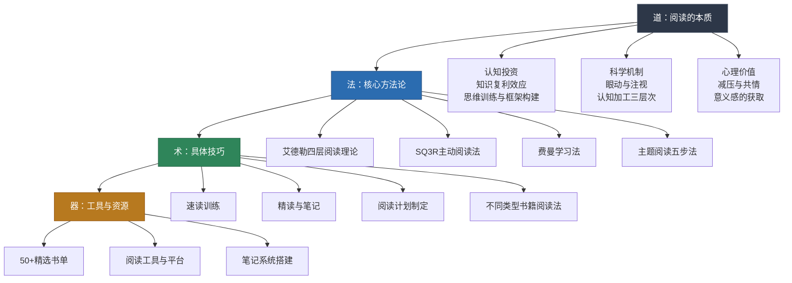
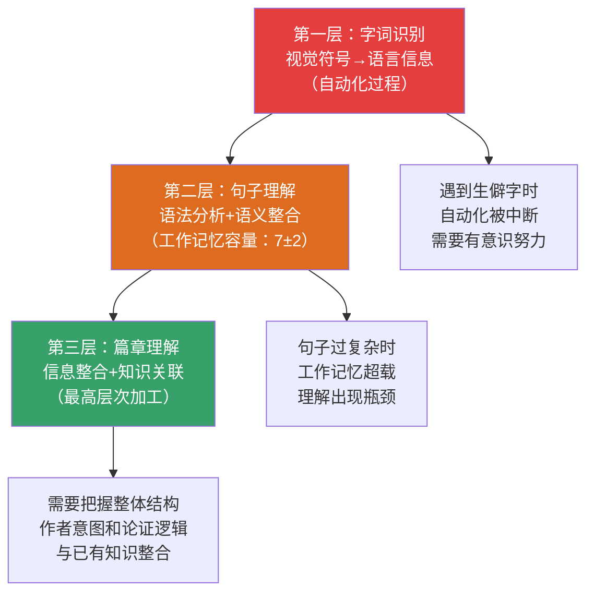
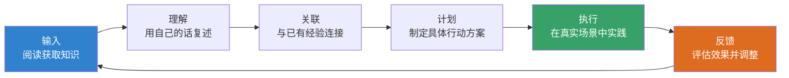
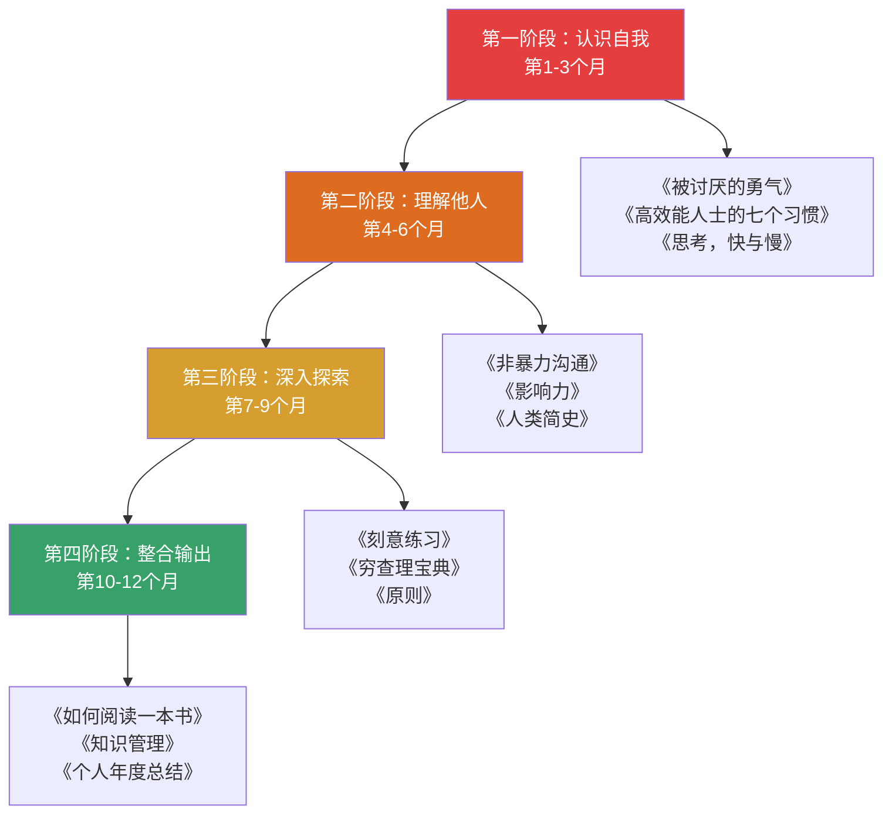
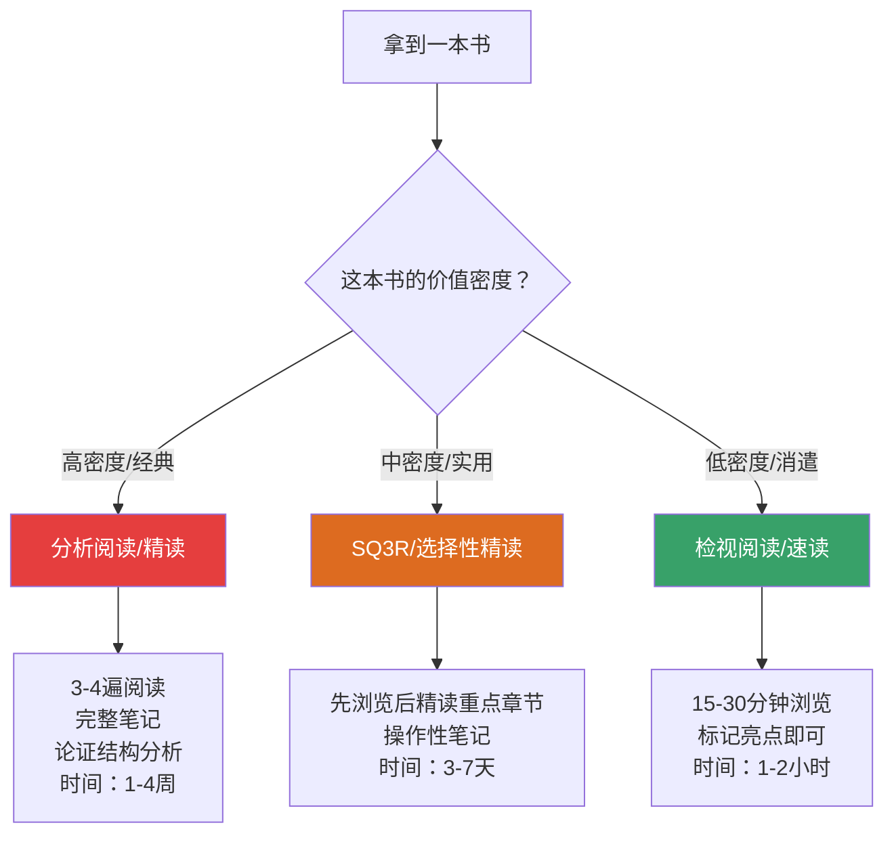
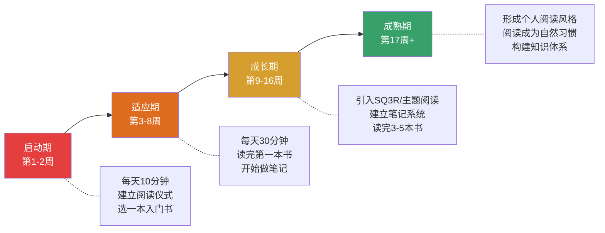
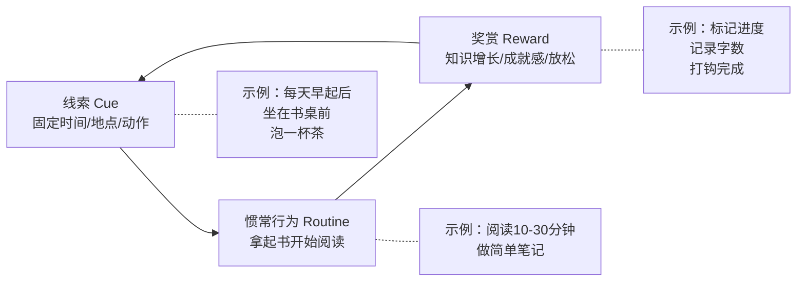

# 第五章小结：阅读——用系统化阅读构建终身学习引擎

> "一本好书是一段生命经历，一次灵魂对话，一座随身携带的避难所。" ——毛姆

本章从基础理论到具体方案，从产品推荐到学习路径，从误区纠正到习惯养成，为你构建了一套完整的阅读提升体系。作为章节的收尾，本小结不只是简单复述要点——它是一张**全景地图**，帮你把分散在各小节的知识点串联成完整的认知网络；它也是一份**实战速查手册**，让你在日常阅读决策中能快速找到答案。

## 一、本章知识架构总览

本章按照"道法术器"的逻辑框架展开，从底层原理到实操工具层层递进。理解这个架构，能帮你建立系统性的阅读思维，而不是零散地记技巧。

## 二、六大核心原理：贯穿全章的底层逻辑

阅读技巧千变万化，但底层原理只有六个。掌握这六个原理，你就能理解所有方法背后的"为什么"，从而在任何情况下都能自主判断，而不是死记硬背阅读公式。

### 2.1 知识复利效应——阅读是投入产出比最高的个人投资

**核心机制**：每读一本书，你理解下一本同类书籍的能力就会提升。这种"知识复利"意味着，读过100本书的人理解第101本书的速度和深度，远超只读过10本书的人。查理·芒格说过："我这辈子遇到的聪明人，没有不每天阅读的——没有，一个都没有。"

**三个层面的价值回报**：

| 维度 | 具体回报 | 证据/案例 |
|------|---------|----------|
| 认知升级 | 知识复利效应——每读一本书都降低下一本书的理解成本 | 读过100本书的人理解第101本书的能力远超只读过10本书的人 |
| 思维训练 | 阅读严密论证训练逻辑推理，阅读文学训练共情与想象力 | 长期阅读者在批判性思维测试中得分显著更高 |
| 框架构建 | 帮助你建立理解世界的"透镜"——经济学框架、心理学框架、系统论框架 | 拥有多个认知框架的人在面对新问题时能更快找到切入角度 |
| 职业竞争力 | 快速学习新领域知识的能力是知识经济时代的核心竞争力 | 比尔·盖茨、埃隆·马斯克等行业领袖均为"阅读狂人" |
| 心理健康 | 6分钟阅读可降低68%的压力水平（萨塞克斯大学研究） | 效果优于听音乐、散步、喝茶 |

**你的关键应用**：不要用"读了也记不住"来否定阅读的价值。知识复利是隐性的——你读过的每一页都在悄然改变你的认知结构，即使你无法逐字回忆。

### 2.2 眼动科学——理解阅读的生理机制

**核心机制**：阅读不是眼睛匀速扫过文字，而是一系列快速跳跃（眼跳，20-40毫秒）和短暂停顿（注视，200-300毫秒）的交替。真正的信息获取只发生在注视阶段。

**关键数据**：

| 指标 | 数值 | 训练意义 |
|------|------|---------|
| 每次注视获取汉字数 | 2-3个（熟练读者） | 通过视觉广度训练可提升到4-5个 |
| 正常回视比例 | 10-15% | 超过20%说明材料过难或注意力不集中 |
| 视觉广度 | 注视点左1-2字，右2-3字 | 通过练习可逐步扩大 |
| 眼跳期间信息获取 | 基本为零（眼跳抑制） | 追求"跳过"文字是无效的 |

**你的关键应用**：速读训练的本质不是"让眼睛动得更快"，而是扩大每次注视的信息获取范围、减少不必要的回视。理解这一点，你就不会被"一分钟读万字"的伪速读误导。

### 2.3 认知加工三层次——阅读不只是"看"

**核心机制**：大脑对文字的加工分为三个递进层次，每一层都是下一层的基础：

**你的关键应用**：如果你读某本书感觉"每个字都认识，但不知道在说什么"，问题出在第三层——篇章理解。解决方法不是重读，而是先看目录和结论，建立整体框架后再精读。

### 2.4 主动阅读原则——从被动接收者到主动对话者

**核心机制**：被动阅读（眼睛扫过文字但大脑不加工）和主动阅读（带着问题、带着目的去阅读）的效率差距可达3-5倍。艾德勒的四层阅读理论、SQ3R阅读法、费曼学习法，本质上都是"主动阅读"的不同实现方式。

**四种主动阅读方法对比**：

| 方法 | 核心策略 | 适用场景 | 时间投入 | 效果评级 |
|------|---------|---------|---------|---------|
| 艾德勒四层阅读 | 从检视到主题，逐层深入 | 任何书籍 | 灵活 | ★★★★★ |
| SQ3R阅读法 | 浏览→提问→阅读→复述→复习 | 非虚构类教材/工具书 | 1-2周/本 | ★★★★★ |
| 费曼学习法 | 用最简单的语言向他人解释 | 概念性强的书籍 | 每章30分钟 | ★★★★ |
| 主题阅读法 | 围绕一个主题同时读多本书 | 构建系统知识 | 1-3个月/主题 | ★★★★★ |

**你的关键应用**：不要只用一种方法读所有书。小说用沉浸式阅读，工具书用SQ3R，哲学书用分析阅读，研究一个领域用主题阅读。方法匹配内容，才是高效阅读的关键。

### 2.5 遗忘对抗机制——让读过的内容真正留下

**核心机制**：艾宾浩斯遗忘曲线告诉我们，学习后20分钟内遗忘42%，1天后遗忘66%，6天后遗忘75%。但遗忘不是不可逆的——通过"深度加工"和"间隔重复"，可以将信息从短期记忆转化为长期记忆。

**遗忘对抗的四层防线**：

| 防线 | 方法 | 原理 | 效果 |
|------|------|------|------|
| 第一层：即时加工 | 读完一章后用自己的话复述 | 深度编码比浅层重复更有效 | 记忆保持率提升50-80% |
| 第二层：笔记系统 | 摘录+复述+关联+行动记录 | 多通道编码强化记忆 | 形成可检索的外部记忆 |
| 第三层：间隔重复 | 读完后1天、3天、7天、30天各复习一次 | 间隔效应优于集中复习 | 长期保持率提升至90% |
| 第四层：输出驱动 | 写读书笔记、讲给别人听、应用到实践中 | 输出是最强的记忆巩固方式 | 理解深度提升3-5倍 |

**你的关键应用**：读完一本书不做任何后续处理，一周后你只会记住5-10%的内容。但如果你在读完后写一篇500字的读书笔记，一个月后你仍然能记住60-70%。笔记不是"额外负担"，而是阅读不可分割的一部分。

### 2.6 知行合一——阅读的终极检验标准

**核心机制**：阅读的最终目的不是"知道"，而是"做到"。从"读了"到"做了"之间，存在一个巨大的鸿沟——大多数人跨不过去，所以读了很多书却没有改变。

**从知识到行动的转化路径**：

**你的关键应用**：每读完一本非虚构类书籍，至少提取1-3个"可执行行动项"，在读完后的一周内开始实践。如果你读完一本书却说不出"这本书让我可以做什么不同的事"，那么这次阅读的转化率接近于零。

## 三、阅读方法论速查：从"会读书"到"善读书"

### 3.1 艾德勒四层阅读理论

| 层次 | 解决的问题 | 核心操作 | 时间投入 |
|------|-----------|---------|---------|
| 基础阅读 | "这个句子在说什么" | 识别文字、理解句意 | 学校教育阶段完成 |
| 检视阅读 | "这本书在说什么" | 15-30分钟内浏览目录、序言、索引、章节标题 | 15-30分钟 |
| 分析阅读 | "这本书详细说了什么，说得对不对" | 概括主旨、列举论点、识别术语、评价论证 | 1-4周 |
| 主题阅读 | "关于这个主题，不同作者说了什么" | 围绕主题同时读多本书，比较、分析、综合 | 1-3个月 |

**关键提醒**：大多数人只停留在前两个层次。真正有价值的阅读从第三层开始——分析阅读要求你不仅要"读懂"，还要"评判"。主题阅读是最高层次，也是构建某个领域系统知识的最佳方法。

### 3.2 SQ3R阅读法完整操作流程

| 步骤 | 英文 | 操作 | 时间 | 关键要点 |
|------|------|------|------|---------|
| S | Survey（浏览） | 快速浏览目录、章节标题、插图、表格、摘要和结论 | 5-10分钟 | 建立对全书的初步印象和知识框架 |
| Q | Question（提问） | 将章节标题转化为你想回答的问题 | 3-5分钟 | 主动提问激活大脑，带着问题阅读效率远高于被动接收 |
| R1 | Read（阅读） | 带着问题有目的地阅读，寻找答案 | 因书而异 | 不只是"看"文字，要"思考"文字背后的含义 |
| R2 | Recite（复述） | 合上书用自己的话复述刚读过的内容 | 每章5-10分钟 | 无法复述=没有真正理解，这是最诚实的检验 |
| R3 | Review（复习） | 回顾笔记、标记和问题，1/3/7/30天各复习一次 | 每次10-15分钟 | 对抗遗忘曲线的关键步骤 |

### 3.3 费曼学习法四步操作

| 步骤 | 操作 | 检验标准 |
|------|------|---------|
| 第一步 | 选择一个概念 | 能用一句话说清这个概念是什么 |
| 第二步 | 用最简单的语言向一个完全不懂的人解释 | 对方能听懂，不使用专业术语 |
| 第三步 | 发现解释不清楚的地方，回去重新学习 | 卡壳的地方就是理解的漏洞 |
| 第四步 | 简化你的解释，使用类比和日常语言 | 用一个比喻就能让外行人秒懂 |

**你的关键应用**：费曼学习法的最佳实践场景是"读完一本书后，尝试向朋友讲述这本书的核心观点"。如果你能把一本书的核心思想用3分钟讲清楚，说明你真正理解了。

### 3.4 主题阅读五步法

| 步骤 | 操作 | 具体方法 |
|------|------|---------|
| 第一步 | 确定研究主题 | 明确你想深入了解的领域，如"认知心理学""投资理财" |
| 第二步 | 建立参考书目 | 通过豆瓣、知乎、专家推荐、参考文献追踪，收集10-20本相关书籍 |
| 第三步 | 检视阅读筛选 | 用检视阅读快速浏览每本书，筛出5-8本最相关的 |
| 第四步 | 带领作者对话 | 围绕你的问题，让不同作者"回答"同一问题，记录各家观点 |
| 第五步 | 构建知识框架 | 整合所有观点，形成你自己的理解体系，输出主题阅读报告 |

## 四、阅读的实践方案速查

### 4.1 一年12本书的阅读计划

**节奏设计**：每月一本，涵盖六大领域（沟通、思维、心理、商业、哲学、科技），按照"认识自我→理解他人→深入探索→整合输出"的逻辑递进。前3个月选"入门级"书籍建立信心，后续逐步提升难度。

### 4.2 不同类型书籍的阅读方法

| 书籍类型 | 推荐方法 | 阅读策略 | 笔记重点 |
|---------|---------|---------|---------|
| 实用工具书 | SQ3R法 | 先看目录找到最相关的章节，不必按顺序读 | 操作步骤、模板、可执行清单 |
| 思想/哲学书 | 分析阅读 | 慢读、精读，每章做论证结构分析 | 核心论点、论证逻辑、个人评价 |
| 小说/文学 | 沉浸式阅读 | 不设目的，享受阅读过程，允许情感投入 | 触动你的段落、引发的联想、人生感悟 |
| 专业教材 | SQ3R+费曼法 | 按章节系统学习，每章完成后尝试复述 | 概念定义、公式推导、例题解析 |
| 研究领域 | 主题阅读 | 围绕一个主题同时读5-8本书 | 各家观点对比、知识框架图、未解问题 |

### 4.3 速读与精读的平衡策略

不是所有内容都值得精读，也不是所有内容都应该速读。关键在于**匹配**：

## 五、阅读资源体系速查

### 5.1 八大领域精选书单框架

| 领域 | 入门推荐 | 进阶推荐 | 深度推荐 |
|------|---------|---------|---------|
| 沟通与表达 | 《非暴力沟通》 | 《关键对话》 | 《沟通的艺术》 |
| 思维方法 | 《思考，快与慢》 | 《学会提问》 | 《穷查理宝典》 |
| 心理学 | 《被讨厌的勇气》 | 《社会心理学》 | 《亲密关系》 |
| 商业与管理 | 《高效能人士的七个习惯》 | 《从0到1》 | 《原则》 |
| 哲学与人文 | 《苏菲的世界》 | 《沉思录》 | 《存在与时间》 |
| 科技与前沿 | 《人类简史》 | 《生命3.0》 | 《规模》 |
| 学习方法 | 《如何阅读一本书》 | 《刻意练习》 | 《学习之道》 |
| 健康与生活 | 《睡眠革命》 | 《运动改造大脑》 | 《我们为什么会生病》 |

**选书原则**：优先选择经过时间检验的经典（出版5年以上、再版3次以上），其次选择领域内公认权威的著作，最后参考豆瓣评分8.0以上且评论数超过1000的作品。

### 5.2 阅读工具与平台推荐

| 类别 | 工具 | 用途 | 推荐理由 |
|------|------|------|---------|
| 电子阅读 | 微信读书 | 日常阅读 | 海量正版、社交批注、免费时长 |
| 电子阅读 | Kindle | 深度阅读 | 护眼墨水屏、专注无干扰 |
| 笔记工具 | Notion/飞书文档 | 结构化笔记 | 支持数据库、双向链接、模板 |
| 笔记工具 | 微信读书导出 | 划线批注整理 | 一键导出所有划线和笔记 |
| 知识管理 | Obsidian | 知识网络构建 | 双向链接、图谱可视化 |
| 书单管理 | 豆瓣 | 书单收藏与评分 | 社区评价、阅读记录 |
| 有声书 | 喜马拉雅/得到 | 碎片时间利用 | 通勤、做家务时"听书" |

## 六、学习路径阶段回顾

本章规划了一条从零基础到终身阅读者的四阶段学习路径，每个阶段都有明确的行为目标和评估标准：

### 各阶段核心里程碑

| 阶段 | 时间 | 核心里程碑 | 完成标志 | 常见卡点与应对 |
|------|------|-----------|---------|--------------|
| 启动期 | 第1-2周 | 建立阅读仪式感 | 连续7天每天阅读10分钟 | "没时间"→起床后第一件事读10分钟；"选不出书"→从最薄的开始 |
| 适应期 | 第3-8周 | 读完第一本书 | 完整读完一本书并写下3点收获 | "读不下去"→允许跳读，先看最感兴趣的章节；"读完就忘"→开始做笔记 |
| 成长期 | 第9-16周 | 掌握至少一种系统阅读方法 | 用SQ3R读完一本书，笔记完整 | "方法太麻烦"→先从最简单的"读完复述"开始；"笔记太多"→每次只写3句话 |
| 成熟期 | 第17周+ | 阅读成为无意识习惯 | 不读书会觉得"少了点什么" | "遇到瓶颈"→换一个领域阅读；"失去兴趣"→参加读书会/找阅读伙伴 |

### 习惯形成的科学基础

理解习惯形成的底层机制，能让你在执行路径时更加坚定。查尔斯·杜希格在《习惯的力量》中提出了"习惯回路"模型：

**关键策略**：将阅读与一个你每天 already 在做的事情绑定（如早起、午休、通勤），利用已有的"线索"触发阅读行为。不要依赖意志力，而要依赖环境设计——把书放在你一定会看到的地方。

## 七、常见误区速查表

以下是本章"常见误区"部分的核心纠正要点，在日常阅读决策中随时对照：

| 误区 | 错误认知 | 正确认知 | 行动纠正 |
|------|---------|---------|---------|
| 读书越多越好 | 一年读100本=厉害 | 质量重于数量，10本精读>100本翻过 | 每本书至少有一章精读+笔记 |
| 必须逐字逐句读完 | 不读完=失败 | 非虚构类允许跳读、选读、略读 | 觉得无聊就跳，只精读最有价值的章节 |
| 读完就忘等于白读 | 记不住=没用 | 阅读的影响是潜移默化的，改变认知结构 | 接受遗忘，但用笔记系统减少遗忘 |
| 读了就能改变 | 知道=做到 | 知行合一才是关键，从知识到行动有巨大鸿沟 | 每本书至少提取1个行动项并执行 |
| 阅读速度越快越好 | 读得快=效率高 | 理解深度比速度重要100倍 | 重要书籍放慢速度，允许回视和停顿 |
| 只读经典就够了 | 新书都不靠谱 | 经典+前沿结合，知识需要更新 | 70%经典+30%新书，保持知识新鲜度 |
| 读了就要用 | 每本书都必须有实用价值 | 阅读的价值包括认知训练、情感共鸣、视野拓宽 | 允许"无用之用"，文学和哲学同样重要 |
| 只追求打卡数量 | 打卡天数=阅读质量 | 打卡只是手段，不是目的 | 关注"读了什么"而不是"读了几天" |
| 电子书不如纸质书 | 媒介决定阅读质量 | 内容>媒介，适合自己的就是最好的 | 根据场景选择：深度阅读用纸质/Kindle，碎片时间用手机 |
| 一个人读书太孤独 | 没有氛围坚持不下去 | 读书会/阅读伙伴是辅助，核心是内在驱动 | 先建立个人习惯，再考虑社交阅读 |

## 八、自我检验清单

完成本章学习后，用以下清单检验自己的掌握程度：

### 理论知识（知道"为什么"）

- [ ] 能解释知识复利效应，并举一个自己体验过的例子
- [ ] 能说出眼动阅读的基本机制（眼跳、注视、回视）
- [ ] 能区分认知加工的三个层次（字词→句子→篇章）
- [ ] 能解释遗忘曲线，说出至少两种对抗遗忘的方法
- [ ] 能说出艾德勒四层阅读理论的四个层次及各自解决的问题

### 实操技能（知道"怎么做"）

- [ ] 能执行SQ3R阅读法的完整五个步骤
- [ ] 能用费曼学习法向他人解释一个刚学到的概念
- [ ] 能为一本非虚构类书籍制定阅读计划（选方法、定时间、设目标）
- [ ] 能设计一个适合自己的笔记系统（至少包含摘录、复述、行动三个模块）
- [ ] 能区分速读和精读的适用场景，并做出正确的选择

### 实践成果（做到"读了用"）

- [ ] 已经选定第一本书并开始阅读
- [ ] 已经建立每天固定的阅读时间段（至少10分钟）
- [ ] 已经创建阅读笔记（纸质或电子），并至少记录了一章内容
- [ ] 已经向至少一个人分享过你读到的内容

### 持续进化（养成了习惯）

- [ ] 连续30天保持每天阅读的习惯
- [ ] 完成了第一本书的完整阅读和笔记
- [ ] 能够不翻书就复述一本书的核心论点
- [ ] 从书中提取了至少1个行动项并在现实中执行
- [ ] 开始规划第二本书的阅读计划

## 九、一页纸速查卡

以下是可以打印出来贴在书桌上的速查卡，每次阅读前看一眼：

┌─────────────────────────────────────────────────┐
│              每日阅读自检清单                      │
├─────────────────────────────────────────────────┤
│                                                   │
│  ✅ 今天读了吗？至少10分钟                        │
│  ✅ 带着问题读了吗？先浏览目录和标题               │
│  ✅ 读完一章后复述了吗？合上书说说刚读了什么        │
│  ✅ 做笔记了吗？至少写3句话                       │
│  ✅ 有可执行的行动项吗？从书中提取至少1个           │
│                                                   │
│  ─────────── 阅读方法选择 ───────────             │
│  ▸ 小说/文学：沉浸式阅读，享受过程                │
│  ▸ 工具书：SQ3R法，先浏览后精读重点章节           │
│  ▸ 哲学/思想：分析阅读，慢读+论证结构分析         │
│  ▸ 研究领域：主题阅读，5-8本书对比+知识框架       │
│                                                   │
│  ─────────── 对抗遗忘四步 ───────────             │
│  ▸ 读完即复述（5分钟）                           │
│  ▸ 当天写笔记（15分钟）                          │
│  ▸ 1/3/7/30天间隔复习（各10分钟）                │
│  ▸ 向他人讲述或写文章输出                        │
│                                                   │
│  ─────────── 记住这三句话 ───────────             │
│  ▸ 方法匹配内容，不同书用不同读法                 │
│  ▸ 笔记不是负担，是阅读不可分割的一部分           │
│  ▸ 从知识到行动，每本书至少提取1个行动项          │
│                                                   │
└─────────────────────────────────────────────────┘

## 十、行动清单：从今天开始

理论的价值在于行动。以下是按时间分解的具体行动项，每一步都对应本章的具体内容。

### 今天就做

- [ ] 从本章推荐书单中选择一本书（不确定就选《被讨厌的勇气》或《高效能人士的七个习惯》）
- [ ] 承诺每天阅读10分钟——不多，就是10分钟。选择一个固定时间段（如早起后或睡前）
- [ ] 把书放在你一定会看到的地方（床头、书桌、沙发旁）
- [ ] 阅读时手机调至静音或放在另一个房间
- [ ] 把你开始阅读的计划告诉一个朋友——社交承诺会显著提升坚持概率

### 本周内完成

- [ ] 用SQ3R的"浏览"步骤（S）快速翻阅你选的书，建立整体印象
- [ ] 准备一个笔记本或电子笔记工具（Notion/Obsidian/备忘录均可）
- [ ] 写下你读这本书想回答的3个问题（Q步骤）
- [ ] 开始正式阅读，每天记录"今天读了什么"（2-3句话即可）

### 一个月内完成

- [ ] 读完第一本书，写下300-500字的读书笔记
- [ ] 尝试向一个朋友或家人讲述这本书的核心观点（费曼学习法实践）
- [ ] 从书中提取1-3个可执行行动项，在现实中尝试执行
- [ ] 评估自己的阅读体验：喜欢什么时间读？喜欢纸质还是电子？读多长时间注意力最好？
- [ ] 根据评估结果，优化你的阅读环境和时间安排

### 三个月内完成

- [ ] 读完3本书，每本都有读书笔记
- [ ] 尝试用不同的方法读不同的书（至少体验SQ3R和分析阅读两种方法）
- [ ] 建立个人笔记系统，能快速检索过去读过的内容
- [ ] 开始规划下一个季度的阅读计划，考虑引入主题阅读

### 六个月内完成

- [ ] 读完6本书以上，形成稳定的阅读习惯
- [ ] 完成至少一次主题阅读（围绕一个主题读3-5本书）
- [ ] 构建了某个领域的初步知识框架
- [ ] 阅读已经成为你生活中自然而然的一部分——不读书会觉得"少了点什么"
- [ ] 开始考虑将阅读与写作结合，通过输出深化理解

## 十一、长期精进建议

阅读是一种需要持续精进的能力。以下是按年度分解的长期建议：

### 第一年：建立习惯

专注于让阅读成为生活中不可或缺的一部分。按照本章提供的学习路径，从启动期（每天10分钟）逐步过渡到成熟期（每天30分钟以上）。目标不是读多少本书，而是让阅读成为一种不需要意志力维持的自动化行为。

**关键指标**：连续30天每天阅读 → 连续90天 → 连续180天 → 连续365天。每一次连续记录的延长，都是习惯巩固的里程碑。

### 第二年：提升方法

在习惯稳固的基础上，专注于提升阅读的效率和深度。熟练掌握SQ3R阅读法，尝试主题阅读，建立个人笔记系统和知识管理体系。目标是从"会读书"升级到"善读书"。

**关键指标**：能根据不同书籍类型灵活选择阅读方法；笔记系统能支撑快速检索和知识关联；至少完成1次完整的主题阅读。

### 第三年及以后：构建体系

通过持续的主题阅读和跨领域阅读，逐步构建你自己的知识框架和思维模型。目标是从"读一本书"升级到"研究一个领域"，从"获取知识"升级到"创造知识"。

**关键指标**：能就某个领域发表有深度的见解；知识体系开始产生跨领域的连接和洞察；阅读从"输入"变成"输入-输出"的循环。

## 十二、最后的话

你需要记住三句话：

**第一，阅读是一场马拉松，不是短跑。** 不要追求速度和数量，而是追求深度和持续性。每天进步一点点，一年后你会惊讶于自己的成长。读100本翻过的书，不如精读10本真正理解的书。

**第二，方法匹配内容，才是高效阅读的关键。** 没有一种"万能阅读法"能适用于所有书籍。小说需要沉浸，工具书需要SQ3R，哲学书需要分析阅读，研究需要主题阅读。学会根据不同内容选择不同方法，你的阅读效率会提升3-5倍。

**第三，阅读的终极目的是改变，不是积累。** 读了100本书却没有任何行为改变，和没读差别不大。每读完一本书，问自己一个问题："这本书让我可以做什么不同的事？"如果你能回答这个问题，并且真的去做了——那这次阅读就值了。

记住，阅读是一座随身携带的小型避难所。在任何你需要的时候，翻开一本书，它会给你答案、给你安慰、给你力量。

从现在开始，翻开你的下一本书。
