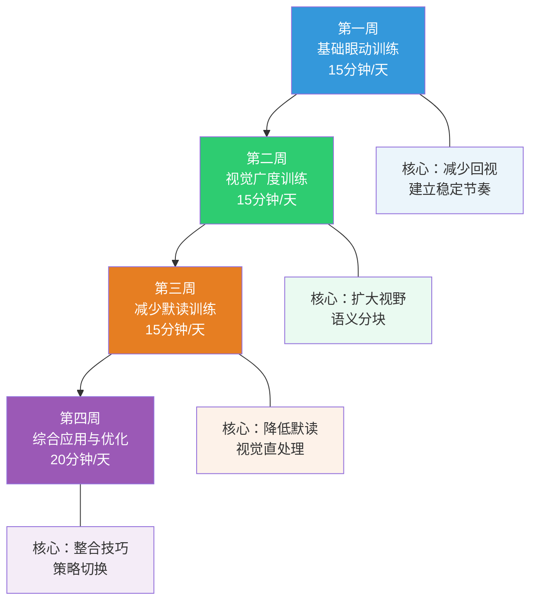
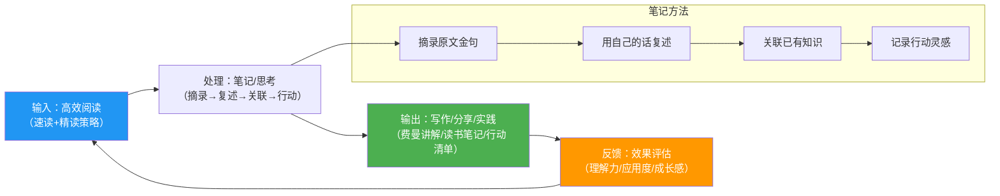

## 第一部分：速读训练方案

### 一、速读训练的目标与前提

#### 1.1 什么是科学的速读训练

速读训练的核心目标不是追求"一目十行"的神话，而是通过系统化的科学训练，在保持理解力的前提下，将你的阅读效率提升 20%—50%。这个提升主要来自四个可训练的维度：

| 训练维度 | 核心机制 | 预期提升幅度 |
|---------|---------|------------|
| 减少无效回视 | 消除不必要的回跳式眼动 | 10%—15% |
| 扩大有效视觉广度 | 每次注视获取更多语义单元 | 10%—20% |
| 降低默读依赖 | 减少对内部语音环路的过度依赖 | 5%—15% |
| 提升策略灵活性 | 根据内容类型动态切换阅读速度 | 10%—20% |

认知科学家基思·雷纳（Keith Rayner）等人在 2016 年发表于《Psychological Science in the Public Interest》的综述论文中明确指出：没有科学证据表明人们可以在保持深度理解的前提下，将阅读速度提升到每分钟 500 个英文单词（约每分钟 1000—1200 个中文字）以上。那些宣称可以"一目十行"的速读者，在标准化理解测试中的表现通常大幅下降。

但速度可以适度提升。通过 4—8 周的科学训练，将阅读速度提升 20%—50% 是完全可行的，而且不会显著损失理解力。关键在于：训练是渐进的、可测量的、有科学依据的。

#### 1.2 训练前的必要前提

在开始训练之前，需要确认以下前提条件：

**前提一：你已经有了基本的阅读习惯。** 速读训练是"锦上添花"，不是"雪中送炭"。如果你连每天阅读 10 分钟的习惯都没有建立，建议先完成"学习路径"中的启动期（1—2 周），建立基本的阅读节奏后再开始速读训练。一个连走都不稳的人去练跑步，受伤的概率远大于进步的概率。

**前提二：你的阅读材料选择是合理的。** 速读技巧主要适用于信息密度中低的非虚构类文本（新闻报道、博客文章、商业书籍、通俗科普等）。对于学术论文、法律文件、哲学经典、高等数学教材等高信息密度的文本，速读技巧的适用性非常有限——这些文本需要的是慢速精读，而非快速扫描。

**前提三：你理解"理解力优先"的原则。** 任何时候，如果理解力下降到 70% 以下，就应该放慢速度。速度的提升必须以不显著损失理解力为前提。这不是一句空话——在训练过程中，你需要持续监测自己的理解力水平。

#### 1.3 训练的心理准备

速读训练会经历一个"不舒服"的阶段。当你强迫自己用比平时更快的速度阅读时，最初的几天会感到焦虑、不适应，甚至觉得"什么都没读进去"。这是完全正常的——就像你刚开始健身时肌肉酸痛一样。大脑的神经可塑性需要时间来适应新的阅读模式。

关键心态：**接受暂时的理解力下降。** 在训练初期，你的理解力可能会从平时的 80%—90% 下降到 60%—70%。这不代表训练失败，而是大脑在适应新节奏的必经阶段。随着训练的推进，理解力会逐渐回升，最终在更高的速度下达到与之前相当的理解水平。

---

### 二、训练前的基线测量

在开始四周训练之前，你必须先测量自己的基线阅读速度和理解力水平。没有基线数据，你就无法判断训练是否有效。这就像减肥——如果你不称体重，你永远不知道自己有没有瘦。

#### 2.1 测量工具与材料

**材料选择标准：**
- 难度适中的非虚构类文章（约 2000—3000 字）
- 你不太熟悉但也不完全陌生的主题
- 有清晰的结构（有小标题、段落分明）
- 最好附有理解测试题（如果没有，自己准备 5—8 个问题）

**推荐材料来源：**
- 微信读书中的非虚构类书籍章节
- 豆瓣阅读中的长文章
- 《经济学人》《财新》等杂志的深度报道
- 知乎上的长篇回答（有结构、有论点的）

#### 2.2 测量步骤

**步骤一：计时阅读**

用手机计时器记录你阅读整篇文章所花费的时间。阅读时保持你最自然、最舒适的节奏——不要刻意加快或放慢。读完后记录总用时（精确到秒）。

**步骤二：理解力测试**

读完后，合上材料，回答以下类型的问题（如果文章自带测试题则直接使用）：
- 这篇文章的核心论点是什么？（主旨题）
- 作者用了哪些论据来支持他的观点？（论据题）
- 文章中提到了哪些关键数据或案例？（细节题）
- 作者的结论是什么？你是否同意？（评价题）

每题 1 分，计算正确率。

**步骤三：计算阅读速度**

阅读速度（字/分钟）= 文章总字数 ÷ 阅读时间（分钟）

例如：一篇 2400 字的文章，你用了 8 分钟读完，那么你的阅读速度为 2400 ÷ 8 = 300 字/分钟。

#### 2.3 基线数据记录表

将测量结果填入以下表格，作为训练的起点参照：

┌─────────────────────────────────────────────┐
│            阅读基线数据记录表                    │
├─────────────────────────────────────────────┤
│ 测量日期：____年____月____日                     │
│ 测试材料：__________________________________     │
│ 材料字数：____________字                        │
│ 阅读时间：____________分____________秒           │
│ 阅读速度：____________字/分钟                    │
│ 理解力得分：____/8（____%）                      │
│ 自评舒适度：□很轻松 □刚好 □有点吃力 □很吃力      │
│ 默读程度：□几乎不默读 □偶尔默读 □经常默读 □全程默读│
│ 回视频率：□几乎不回视 □偶尔 □经常 □频繁回视       │
└─────────────────────────────────────────────┘

#### 2.4 基线数据的解读

| 阅读速度（中文） | 水平评估 | 训练重点 |
|----------------|---------|---------|
| 200 字/分钟以下 | 偏慢，可能存在频繁回视或默读过重 | 第一周眼动训练是重中之重 |
| 200—350 字/分钟 | 正常范围，大多数成年人在此区间 | 四周训练全面提升 |
| 350—500 字/分钟 | 较快，有一定速读基础 | 重点放在策略灵活性训练 |
| 500 字/分钟以上 | 已经很快，提升空间有限 | 转向精读深度和策略切换 |

理解力方面：如果基线理解力已经低于 60%，说明你当前的阅读存在理解障碍，建议先解决理解问题（可能是注意力、背景知识或阅读方法的问题），再进行速读训练。

---

### 三、四周速读训练计划

以下是为期四周的系统训练计划。每天训练 15—20 分钟，一周训练 5—6 天（建议休息 1 天）。四周总计训练时间约 5—6 小时。

#### 3.1 整体训练架构

---

#### 第一周：基础眼动训练

**训练目标：** 减少不必要的回视（regression），建立稳定、流畅的眼动节奏。

**科学原理：** 阅读时，眼球并非匀速滑动，而是以"跳跃—注视—跳跃"的方式运动。每次跳跃（saccade）约 20—40 毫秒，每次注视（fixation）约 200—250 毫秒。大多数读者存在过多的回视——眼睛跳回已经读过的文字。研究表明，约 30%—50% 的回视是不必要的，通常由注意力不集中、缺乏自信或阅读焦虑导致。通过外部引导物强制眼睛向前移动，可以有效减少这类无效回视。

**每日训练安排（共 15 分钟）：**

**训练一：手指引导阅读（5 分钟）**

用食指（或笔尖）沿着文字行匀速移动，眼睛跟随引导物前进。引导物的速度应略快于你当前的舒适阅读速度——大约快 10%—15%。

操作要点：
- 引导物放在文字下方约 1 厘米处，不要遮挡文字
- 移动速度保持匀速，不要忽快忽慢
- 如果不小心回视了，不要自责，轻轻把注意力拉回到引导物上即可
- 每天选择不同的文章，避免因为熟悉内容而影响训练效果

为什么手指引导有效？当你的视觉注意力锁定在一个持续向前移动的物体上时，大脑会抑制向后跳跃的冲动。这就像在高速公路上开车——当前方有明确的引导线时，你不太容易走神或回头。

**训练二：节拍器阅读（5 分钟）**

使用手机上的节拍器 APP（推荐"节拍器"或"Pro Metronome"），设定一个略快于你当前阅读速度的节拍。每响一声，眼睛跳到下一个注视点。

训练节奏规划：
- 第 1—2 天：每分钟 60 拍（每秒 1 拍，较慢）
- 第 3—4 天：每分钟 70 拍
- 第 5—6 天：每分钟 80 拍
- 第 7 天：自由复习，不使用节拍器

每拍对应一个注视点，大约阅读 2—4 个字。节拍器的作用是为你的阅读建立一个外部的"时间锚点"，让眼动节奏从"随机"变为"有规律"。

**训练三：自由阅读与反思（5 分钟）**

关闭节拍器和手指引导，以正常方式阅读一篇文章。读完后花 1 分钟反思：
- 我刚才有没有明显的回视？
- 我的阅读节奏是否比训练前更稳定了？
- 哪些段落我容易回视？（通常是复杂句子或不熟悉的概念）

**第一周训练效果自评标准：**

| 指标 | 未达标 | 基本达标 | 良好 |
|------|--------|---------|------|
| 回视频率 | 与基线相比无变化 | 减少约 20% | 减少约 30% 以上 |
| 阅读节奏 | 仍然忽快忽慢 | 明显更稳定 | 基本能保持匀速 |
| 理解力 | 下降超过 20% | 下降 10%—20% | 下降不超过 10% |

---

#### 第二周：视觉广度训练

**训练目标：** 扩大每次注视时能够有效获取信息的范围，从逐词阅读过渡到语义分块阅读。

**科学原理：** 正常读者每次注视的"有效视觉广度"约为 3—5 个中文字（约 7—9 个英文字母）。这意味着每读一行 20 个字的文字，你需要 4—6 次注视。通过训练，可以将有效视觉广度扩展到 5—8 个中文字，从而将每行的注视次数减少到 3—4 次。

关键概念——"语义分块"（chunking）：人脑不是逐字处理信息的，而是将文字组织成有意义的语义单元来理解。例如：

- 逐词阅读：「他 / 今天 / 去了 / 市中心 / 的 / 图书馆」→ 6 个注视点
- 语义分块：「他今天 / 去了市中心的 / 图书馆」→ 3 个注视点

语义分块不是跳过文字，而是用更大的"窗口"来一次获取更多信息。

**每日训练安排（共 15 分钟）：**

**训练一：周边视野扩展（5 分钟）**

在一行文字中选择一个词作为注视点（用笔在下方画个点作为标记），保持眼睛不动，尝试用余光读取该词左右两侧的词。

训练进阶：
- 第 1—2 天：尝试读取注视词左右各 1 个词（共 3 个词）
- 第 3—4 天：尝试读取注视词左右各 2 个词（共 5 个词）
- 第 5—6 天：尝试读取注视词左右各 3 个词（共 7 个词）

训练时不要移动眼睛——如果发现自己在移动视线，说明你在"偷看"而非真正使用周边视野。真正的周边视野感知是一种模糊的、整体性的信息获取，你不需要看清每个字，只需要捕捉到语义轮廓。

**训练二：跳读训练（5 分钟）**

在一行文字中，每隔一个词跳读一次。例如，只读第 1、3、5、7 个词，然后尝试理解整行的意思。这个训练迫使你利用周边视野来获取被跳过的词的信息。

跳读训练的要点：
- 第一遍：只读奇数位的词，尝试理解整行含义
- 第二遍：只读偶数位的词，补充理解
- 第三遍：正常阅读，验证你的理解是否正确

这个训练的目的不是让你养成跳读的习惯，而是扩展你的视觉广度——当你的周边视野足够敏锐时，你可以在正常阅读中一次获取更多的文字信息。

**训练三：整行感知训练（5 分钟）**

尝试将每一行文字作为一个整体来"拍照"，而不是逐词阅读。具体方法：
- 将视线聚焦在一行文字的中间位置
- 不移动眼睛，尝试在 1 秒内"感知"整行文字的大致含义
- 不要试图读取每一个字——只需要捕捉每行的关键词和整体语义
- 读完一行后，快速跳到下一行的中间位置

这个训练在初期会非常困难，你可能觉得"什么都没看清"。这是正常的——你在训练的是一种全新的信息获取方式，大脑需要时间来适应。

**第二周训练效果自评标准：**

| 指标 | 未达标 | 基本达标 | 良好 |
|------|--------|---------|------|
| 周边视野 | 只能看到注视词左右各 1 个词 | 能看到左右各 2 个词 | 能看到左右各 3 个词 |
| 语义分块 | 仍然逐词阅读 | 偶尔能进行语义分块 | 大部分时候能分块阅读 |
| 阅读速度 | 与第一周持平 | 提升约 10% | 提升约 15%—20% |
| 理解力 | 下降超过 15% | 下降 5%—15% | 基本持平或略有下降 |

---

#### 第三周：减少默读训练

**训练目标：** 降低对"内部语音"（subvocalization）的依赖程度，提升视觉通道直接处理文字信息的能力。

**科学原理：** 默读是指阅读时在内心"念出"文字的声音。这种内部语音由大脑的布洛卡区（Broca's area）和语音环路（phonological loop）产生。默读对理解复杂内容非常重要——它帮助你保持信息在工作记忆中的活跃状态。但默读也是限制阅读速度的主要因素之一，因为"念"的速度远慢于"看"的速度。

**重要提醒：** 完全消除默读既不可能也不可取。研究表明，即使是最熟练的读者，在阅读有意义的文本时也会保留一定程度的默读。训练的目标不是消灭默读，而是将默读的程度从"全程逐字念"降低到"只在关键处念"。

**每日训练安排（共 15 分钟）：**

**训练一：数字干扰法（5 分钟）**

在阅读的同时，在心里默数"1、2、3、4……"。这个额外的认知任务会占用语音环路的资源，迫使你更多地依赖视觉通道来处理文字信息。

操作要点：
- 数数的速度保持匀速，大约每秒一个数
- 数数的同时继续阅读，不要停下来
- 刚开始时理解力会显著下降（可能降到 50%—60%），这是正常的
- 随着训练推进（第 3—4 天），理解力会逐渐回升

这个训练的原理是"认知资源竞争"——你的语音环路被数数占用了，大脑被迫启动视觉直处理通道来理解文字。就像左手画圆、右手画方一样，初期很难，但练多了就自然了。

**训练二：快速翻页扫描（5 分钟）**

以比正常速度快 2—3 倍的速度翻阅一本书，不要试图读取每一个字，只需要快速扫描每页的关键信息——标题、加粗文字、图表、数字、专有名词等。

这个训练的目的有两个：
- 让你习惯于"不完整阅读"的感觉，降低逐字阅读的强迫感
- 训练你从页面中快速提取关键信息的能力

每页停留时间不超过 3 秒。5 分钟大约可以扫描 50—100 页。扫完后合上书，回忆你在翻阅过程中印象最深的 3—5 个信息点。

**训练三：综合速度训练（5 分钟）**

结合前三周的所有技巧——手指引导（第一周）、语义分块（第二周）、减少默读（第三周）——以较快的速度阅读一篇文章。读完后测试自己的理解程度。

具体操作：
- 用手指引导保持节奏
- 尝试一次获取 3—5 个字的语义块
- 默数或哼一段简单的旋律来干扰默读
- 目标速度：基线速度 × 1.3（比基线快 30%）

**第三周训练效果自评标准：**

| 指标 | 未达标 | 基本达标 | 良好 |
|------|--------|---------|------|
| 默读程度 | 数数时完全无法阅读 | 数数时能读但理解力下降明显 | 数数时理解力下降不超过 20% |
| 快速扫描 | 完全抓不住信息 | 能抓住每页 1—2 个关键点 | 能抓住每页 3 个以上关键点 |
| 综合速度 | 低于基线 × 1.2 | 达到基线 × 1.2—1.3 | 达到基线 × 1.3 以上 |
| 理解力 | 下降超过 20% | 下降 10%—20% | 下降不超过 10% |

---

#### 第四周：综合应用与优化

**训练目标：** 将前三周的训练成果整合到日常阅读中，培养根据内容类型灵活切换阅读速度的策略能力。

**科学原理：** 最重要的速读技巧不是"读得更快"，而是"知道什么时候该快、什么时候该慢"。真正的阅读高手不是全程高速扫描，而是像一个熟练的司机——在直道上加速，在弯道上减速，在十字路口停下来观察。策略灵活性的训练比单纯的速度训练更有价值。

**每日训练安排（共 20 分钟）：**

**训练一：速度测试与记录（5 分钟）**

选择一篇 1500—2000 字的文章，计时阅读，记录阅读速度（字/分钟）。然后闭卷回答 5—8 个理解测试题，记录正确率。

将结果记录在训练日志中：

┌───────────────────────────────────────┐
│         第四周速度测试记录              │
├───────┬────────┬────────┬─────────────┤
│  日期  │ 速度    │ 理解率  │ 备注        │
│       │字/分钟  │        │             │
├───────┼────────┼────────┼─────────────┤
│ 第1天  │        │        │             │
│ 第2天  │        │        │             │
│ 第3天  │        │        │             │
│ 第4天  │        │        │             │
│ 第5天  │        │        │             │
└───────┴────────┴────────┴─────────────┘

目标是在保持 70% 以上理解率的前提下，逐步提升速度。如果理解率低于 70%，说明当前速度已经超出了你的有效处理能力，需要适当放慢。

**训练二：策略切换训练（10 分钟）**

选择一篇 3000 字以上的长文（最好是结构清晰的非虚构文章，有明确的论点、论据、案例分层），对不同部分使用不同的阅读速度：

| 文本类型 | 阅读策略 | 速度参考 |
|---------|---------|---------|
| 标题和小标题 | 快速扫过，建立框架 | 基线 × 1.5—2.0 |
| 过渡性段落（"接下来我们将讨论……"） | 快速浏览 | 基线 × 1.3—1.5 |
| 核心论点段落 | 中速阅读，确保理解 | 基线 × 0.8—1.0 |
| 具体数据和案例 | 视重要性选择速度 | 灵活调整 |
| 作者的结论和总结 | 慢速精读 | 基线 × 0.7—0.9 |
| 重复性内容（作者重申已有观点） | 快速跳过 | 基线 × 2.0+ |

这个训练的核心是培养"阅读雷达"——在阅读过程中不断评估"这段内容对我有多重要"，并据此调整阅读速度。这种策略性思维比单纯的快速阅读更有价值。

**训练三：反思与优化（5 分钟）**

每天训练结束后，花 5 分钟回答以下问题，记录在训练日志中：

1. 今天哪个训练环节感觉最有效？为什么？
2. 今天哪个环节仍然感觉困难？具体困难是什么？
3. 与第一天的基线数据相比，我有哪些进步？
4. 我在日常阅读中是否已经开始自然地使用训练中的技巧？
5. 明天我需要重点改进哪个方面？

这种反思不是浪费时间——研究表明，元认知反思（对自身认知过程的思考）是技能习得的关键加速器。没有反思的训练是盲目的重复，有反思的训练是精准的迭代。

---

### 四、训练中的关键注意事项

#### 4.1 理解力警戒线

这是整个训练中最重要的原则，值得反复强调：**任何时候，如果理解力下降到 70% 以下，必须立即放慢速度。**

为什么是 70%？因为低于 70% 的理解力意味着你丢失了将近三分之一的信息——这已经不是"高效阅读"，而是"无效扫描"。速度再快，理解力不够就是白费功夫。

理解力的自测方法：每读完一段（约 200—300 字），快速问自己："这段话的核心意思是什么？"如果你能在 3 秒内用一句话概括出来，说明理解力在线；如果卡壳了或者概括出来的意思明显偏离原文，说明你已经超速了。

#### 4.2 训练材料的选择

好的训练材料应该满足以下条件：

| 维度 | 推荐 | 避免 |
|------|------|------|
| 难度 | 中等偏易，略低于你的舒适区上限 | 远超你当前水平的学术论文 |
| 信息密度 | 中低密度，非虚构类 | 高密度技术文档、数学公式 |
| 熟悉度 | 有一定了解但不完全熟悉 | 完全陌生的领域或烂熟于心的内容 |
| 篇幅 | 1500—3000 字/篇 | 超过 5000 字的长文（训练期） |
| 结构 | 有小标题、段落分明 | 密集无分段的纯文本 |

推荐训练材料类型：
- 微信读书中的商业/自我管理类书籍章节
- 财经类杂志的深度报道
- 科技博客的长文分析
- 知乎/公众号中有结构的干货文章

#### 4.3 常见错误与纠正

**错误一：把速读当成"跳读"**

很多初学者误解速读的含义，认为速读就是跳过大部分文字、只看关键词。这不是速读，这是"偷懒式浏览"。真正的速读是在更高的信息获取效率下保持完整的理解——你看到了更多的文字，只是看得更快了。

纠正方法：训练时确保每行文字至少有一次注视，不要整行整行地跳过。

**错误二：全程高速，不懂降速**

有些人在训练后养成了"全程快速"的习惯，无论什么内容都用同一种速度阅读。这就像开车只会踩油门不会踩刹车——迟早要出事。

纠正方法：在训练中加入"策略切换"环节，有意识地对不同类型的内容使用不同的速度。

**错误三：过度关注速度，忽视理解力**

速度测试的数字很容易让人上瘾——"我今天读到 450 字/分钟了！"但如果理解力只有 55%，这个数字毫无意义。

纠正方法：每次速度测试都必须同时记录理解力，用"有效阅读速度"（速度 × 理解率）来衡量真正的进步。

**错误四：训练时间过长**

有些人觉得"练得越多越好"，把每天的训练时间从 15 分钟延长到 1 小时。实际上，速读训练是一种高强度的认知训练，就像高强度间歇训练（HIIT）一样——短时间高强度比长时间低强度更有效。超过 30 分钟后，训练效果会因为注意力疲劳而大打折扣。

纠正方法：严格控制每天的训练时间在 15—25 分钟之间。宁可短而精，不要长而散。

**错误五：跳过基础训练直接练高级技巧**

有些人觉得第一周的眼动训练"太简单"，想直接跳到第三周的减少默读训练。这就像健身不练基础力量直接上大重量——受伤的概率远大于进步的概率。

纠正方法：严格按照四周计划的顺序进行。每周的训练都建立在前一周的基础上，跳过任何一周都会影响后续训练的效果。

#### 4.4 训练日志模板

坚持记录训练日志是确保训练有效性的关键。以下是一个简洁实用的日志模板：

┌─────────────────────────────────────────────────┐
│              速读训练日志                          │
├─────────────────────────────────────────────────┤
│ 第____周  第____天    日期：____年____月____日      │
│                                                  │
│ 今日训练内容：                                     │
│   □ 训练一：_______________（5分钟）               │
│   □ 训练二：_______________（5分钟）               │
│   □ 训练三：_______________（5—10分钟）            │
│                                                  │
│ 速度测试（如适用）：                                │
│   阅读速度：______字/分钟                          │
│   理解力：______%                                 │
│   有效阅读速度：______字/分钟（速度×理解率）         │
│                                                  │
│ 今日感受：                                        │
│   ____________________________________________     │
│                                                  │
│ 明日重点改进：                                     │
│   ____________________________________________     │
└─────────────────────────────────────────────────┘

---

### 五、训练后的效果评估

#### 5.1 四周训练结束后的复测

在完成四周训练后，使用与基线测量完全相同的测试方法（相同类型的材料、相同数量的理解测试题），重新测量你的阅读速度和理解力。

将结果与基线数据进行对比：

┌──────────────────────────────────────────┐
│           训练效果对比表                    │
├──────────┬──────────┬──────────┬──────────┤
│   指标    │  训练前   │  训练后   │  变化    │
├──────────┼──────────┼──────────┼──────────┤
│ 阅读速度  │ ___字/分  │ ___字/分  │ +___%    │
│ 理解力    │ ___%     │ ___%     │ +/-___%  │
│ 有效速度  │ ___字/分  │ ___字/分  │ +___%    │
│ 回视频率  │ ___      │ ___      │ -___%    │
│ 默读程度  │ ___      │ ___      │ 变化描述  │
└──────────┴──────────┴──────────┴──────────┘

#### 5.2 预期效果范围

| 训练效果等级 | 速度提升 | 理解力变化 | 有效速度提升 |
|------------|---------|-----------|------------|
| 优秀 | 30%—50% | 持平或略有提升 | 30%—50% |
| 良好 | 20%—30% | 下降不超过 5% | 15%—30% |
| 一般 | 10%—20% | 下降 5%—10% | 5%—15% |
| 需要继续 | 10% 以下 | 下降超过 10% | 不明显 |

如果训练效果为"一般"或"需要继续"，不要灰心。有些人的神经系统需要更长的适应期。建议：
- 将四周训练重复一遍，重点关注最薄弱的环节
- 检查训练日志，找出哪些训练环节投入不足
- 考虑是否有外部因素影响（睡眠不足、压力过大、注意力分散等）

#### 5.3 效果的长期维持

速读技巧就像肌肉记忆——停止训练后会逐渐退化。为了维持训练效果，建议：

1. **将速读技巧融入日常阅读：** 在每天的正常阅读中，有意识地使用训练中学到的技巧（手指引导、语义分块、策略切换等）。不是每次阅读都要"训练"，但至少保持技巧的活跃度。

2. **每周做一次速度测试：** 每周选择一篇文章进行计时阅读和理解力测试，监控自己的速度和理解力是否出现退化。这只需要 5—10 分钟，但可以帮你及时发现问题。

3. **每季度进行一次强化训练：** 每 3 个月，花一周时间重新进行第四周的综合训练（每天 20 分钟），刷新和巩固训练效果。

---

### 六、不同场景的速读策略

速读不是一套"一刀切"的技巧，而是需要根据具体场景灵活调整的策略体系。以下是几种常见场景下的速读策略：

#### 6.1 信息收集型阅读

**场景：** 你需要在大量资料中快速找到与你需求相关的信息。例如，在 10 篇文章中找到关于某个话题的 3 个关键数据点。

**策略：** 扫描式阅读
- 先读标题和小标题，判断哪些段落可能包含目标信息
- 对可能相关的段落使用"关键词扫描"——眼睛快速扫过，只捕捉与目标关键词相关的信息
- 找到目标信息后，放慢速度精读该段落
- 对不相关的段落直接跳过

**速度参考：** 基线 × 2.0—3.0（非目标段落），基线 × 0.8—1.0（目标段落）

#### 6.2 学习型阅读

**场景：** 你需要从一篇文章或一本书中学习新知识。例如，学习一个新的技术概念或了解一个新的行业趋势。

**策略：** 分层式阅读
- 第一层：快速浏览全文，建立整体框架（3—5 分钟）
- 第二层：对核心段落进行中速阅读，确保理解关键概念
- 第三层：对难点和关键数据进行慢速精读
- 第四层：回顾全文，用自己的话总结核心收获

**速度参考：** 基线 × 1.5（第一层），基线 × 1.0（第二层），基线 × 0.7（第三层）

#### 6.3 评估型阅读

**场景：** 你需要判断一篇文章或一本书是否值得深入阅读。例如，决定是否要买一本书、是否要精读一篇论文。

**策略：** 检视阅读
- 阅读标题、副标题、作者介绍（30 秒）
- 阅读目录或段落标题（1 分钟）
- 阅读引言和结论（2—3 分钟）
- 随机翻阅 2—3 个章节，读每章的前两段（3—5 分钟）
- 综合评估：这本书/文章的核心观点是什么？对我的需求有多大价值？值得深入阅读吗？

**速度参考：** 基线 × 2.0—3.0（整个过程应在 10 分钟内完成）

#### 6.4 消遣型阅读

**场景：** 你在阅读新闻、社交媒体、轻松的博客文章等不需要深度理解的内容。

**策略：** 快速浏览
- 标题决定是否继续——如果标题不感兴趣，直接跳过
- 每段只读第一句话（大多数新闻写作采用"倒金字塔"结构，核心信息在段首）
- 对感兴趣的段落放慢速度，其余快速带过
- 不需要做笔记，不需要复述

**速度参考：** 基线 × 1.5—2.5

---

### 七、训练工具与资源推荐

#### 7.1 计时工具

| 工具 | 平台 | 特点 | 推荐度 |
|------|------|------|--------|
| 手机自带计时器 | iOS/Android | 简单可靠，无需安装 | ★★★★★ |
| Forest 专注森林 | iOS/Android | 计时+专注力管理，有激励机制 | ★★★★ |
| Toggl Track | 全平台 | 专业时间追踪，可生成报告 | ★★★★ |

#### 7.2 节拍器工具

| 工具 | 平台 | 特点 | 推荐度 |
|------|------|------|--------|
| Pro Metronome | iOS/Android | 专业节拍器，BPM 精准 | ★★★★★ |
| 节拍器（小程序） | 微信小程序 | 无需安装，随开随用 | ★★★★ |
| 在线节拍器 | 网页 | 搜索"在线节拍器"即可使用 | ★★★ |

#### 7.3 阅读速度测试工具

| 工具 | 平台 | 特点 | 推荐度 |
|------|------|------|--------|
| Spreeder | 网页/APP | 专业速读训练工具，支持自定义文本 | ★★★★★ |
| 微信读书 | APP | 内置阅读统计，可查看阅读速度 | ★★★★ |
| Readlax | 网页/APP | 专注力训练+速度测试 | ★★★★ |

#### 7.4 训练记录工具

| 工具 | 平台 | 特点 | 推荐度 |
|------|------|------|--------|
| Notion/飞书文档 | 全平台 | 可创建自定义训练日志模板 | ★★★★★ |
| Excel/Numbers | 全平台 | 适合做数据追踪和趋势分析 | ★★★★ |
| 纸质笔记本 | 离线 | 最简单的记录方式，无干扰 | ★★★★ |

---

### 八、四周训练的进阶延伸

四周训练完成后，如果你希望继续提升，可以进入进阶训练阶段。

#### 8.1 第五至八周：巩固与深化

第五至八周的训练重点从"学习新技巧"转向"将技巧内化为习惯"。具体方法：

**每周安排：**
- 周一/周三/周五：策略切换训练（15 分钟）——选择不同类型的文本，练习在不同速度之间灵活切换
- 周二/周四：理解力强化训练（15 分钟）——以中等偏快的速度阅读，读完后进行详细的理解力自测（复述全文要点、画出文章结构图、提出批判性问题）
- 周六：综合速度测试（10 分钟）——计时阅读 + 理解力测试，记录数据

**进阶训练的衡量标准：** 到第八周结束时，你应该能够：
- 在不刻意使用技巧的情况下，自然地以高于基线 20%—30% 的速度阅读中等难度的文章
- 能够在 10 秒内判断一篇文章应该用什么速度来阅读
- 理解力保持在 75% 以上

#### 8.2 不同文本类型的专项训练

在基本速读能力稳定之后，可以针对特定类型的文本进行专项训练：

**商业/管理类书籍：**
- 特点：信息密度中等，有大量案例和故事，核心论点往往在章节开头和结尾
- 策略：对案例和故事使用快速浏览（1.5x），对核心论点和框架使用中速阅读（1.0x），对数据和图表使用慢速精读（0.8x）

**技术/科学类文章：**
- 特点：信息密度高，有大量专业术语和公式
- 策略：第一遍快速浏览建立框架（2.0x），第二遍对关键概念进行中速精读（1.0x），第三遍对难点进行慢速研读（0.7x）。技术类文本通常需要多遍阅读，速读主要用在第一遍的框架建立上。

**新闻/资讯类内容：**
- 特点：信息密度低，结构规范（倒金字塔），核心信息在前两段
- 策略：只读前两段 + 小标题，快速判断是否需要深入阅读。大多数新闻只需要 30 秒就能获取核心信息。

**文学/小说类：**
- 特点：语言本身就是内容的一部分，速读会损失审美体验
- 策略：文学作品一般不建议速读。如果确实需要快速了解情节（比如为了讨论或考试），可以使用"情节扫描"策略——重点读对话和动作描写，快速浏览环境描写和心理描写。但这只是应急手段，不是推荐的阅读方式。

---

### 九、知识管理循环：速读的终极目标

速读训练的最终目的不是"读得快"，而是让你在有限的时间内获取更多的有效信息，从而为知识管理的完整循环提供更高效的输入。

速读让你在单位时间内"输入"更多信息，但输入只是知识管理的第一步。如果只有输入没有处理和输出，你读得再快也不过是"信息的搬运工"。真正的阅读效率 = 输入速度 × 处理深度 × 输出质量。速读训练提升的是第一个乘数，而精读与笔记方法（第二部分）提升的是后两个乘数。三者结合，才能构成完整的高效阅读体系。

***
