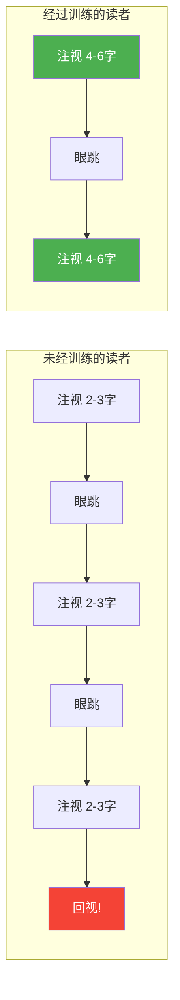
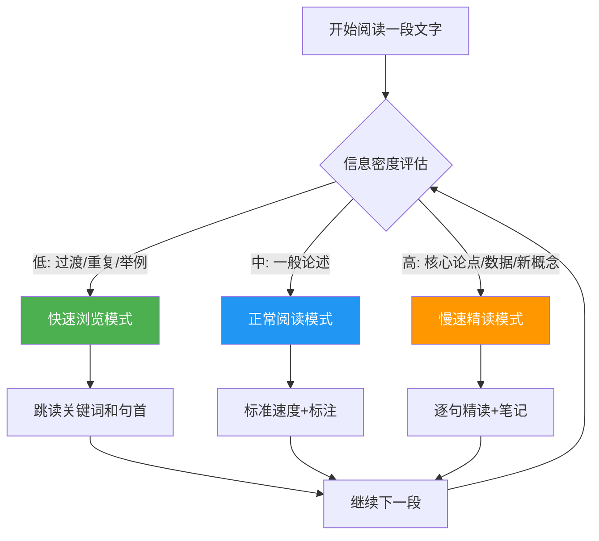
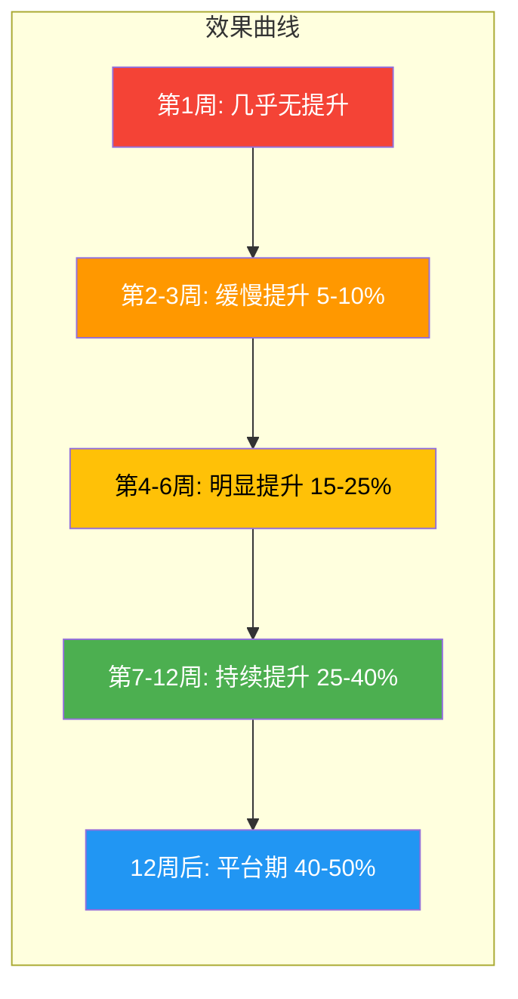

## 一、速读训练的科学基础

速读训练不是玄学，而是一套建立在眼动科学和认知心理学之上的可量化、可复现的技能训练体系。本节作为速读训练方案的"科学底座"，将从生理机制、认知瓶颈、训练原理三个维度，为你构建完整的速读认知框架——只有理解了"为什么这样练"，才能在训练中做出正确的判断和调整。

### 1.1 阅读速度的生理极限与认知边界

在开始任何训练之前，你必须先了解自己面对的是什么样的"硬件限制"。阅读速度并非可以无限提升——它受到眼球运动、神经传导和认知处理三重约束。

#### 1.1.1 眼球运动的物理约束

阅读时，眼球并不是匀速滑过文字的，而是进行两种交替运动：

- **眼跳（Saccade）**：快速跳跃运动，每次持续 20-40 毫秒，期间大脑主动抑制视觉输入（眼跳抑制），几乎不获取信息。
- **注视（Fixation）**：眼球静止停顿，每次持续 200-300 毫秒，这是唯一真正获取文字信息的阶段。

这意味着，**阅读速度本质上取决于"每次注视能获取多少有效信息"和"完成一行需要多少次注视"**。一个未经训练的中文读者，每行文字通常需要 4-6 次注视，每次注视只能有效处理 2-3 个汉字。而经过训练的读者，可以将注视次数减少到 2-3 次，每次注视的有效处理范围扩大到 4-6 个汉字。

**关键数据：**

| 指标 | 未训练读者 | 训练后读者 | 提升幅度 |
|------|-----------|-----------|---------|
| 每次注视时长 | 250-300ms | 200-230ms | 15-25% |
| 每行注视次数 | 4-6次 | 2-3次 | 40-50% |
| 回视频率 | 15-20% | 5-8% | 50-60% |
| 有效视觉广度 | 左1-2字/右2-3字 | 左2-3字/右4-5字 | 约一倍 |

#### 1.1.2 认知处理的速度瓶颈

即使眼球运动优化到极致，大脑的信息处理速度仍然是一个硬约束。认知心理学家基思·雷纳（Keith Rayner）等人在 2016 年发表于 *Psychological Science in the Public Interest* 的综述论文中明确指出：

> 没有科学证据表明人们可以在保持深度理解的前提下，将阅读速度提升到每分钟 500 个英文单词（约 1000 个中文字）以上。

认知瓶颈主要来自三个方面：

1. **语音环路（Phonological Loop）的处理带宽**：即使默读不出声，大脑中仍然有一个"内部语音"在工作，其处理速度约为每秒 2-3 个音节。这是默读速度的根本限制。
2. **工作记忆（Working Memory）的容量限制**：米勒定律告诉我们，工作记忆只能同时保持 7±2 个信息单元。当句子过于复杂时，工作记忆溢出就会导致理解失败。
3. **语义整合的时间成本**：将单个词汇组合成有意义的句子、将多个句子整合成连贯的篇章，都需要时间——这个时间无法被"训练掉"。

**结论：科学的速读训练，目标是将阅读速度提升 20-50%，同时保持 70% 以上的理解率。** 任何宣称可以将速度提升数倍甚至十倍的"速读术"，要么牺牲了理解力，要么本身就是骗局。

#### 1.1.3 中文阅读的特殊性

中文作为一种无空格分词的表意文字系统，在速读训练中有几个独特的考量：

- **字形密度高**：每个汉字承载的信息量平均高于英文单词，因此中文的正常阅读速度（每分钟 300-500 字）在信息吞吐量上与英文（每分钟 200-300 词）相当。
- **无空格分词**：英文的空格天然提供了词汇边界提示，中文读者需要依靠经验和上下文来完成分词，这对视觉广度训练提出了更高要求。
- **同音字干扰**：默读时，中文的同音字比英文更多，这使得"减少默读"训练在中文环境下效果可能不如英文显著。
- **竖排与横排**：现代中文以横排为主，但古籍和部分港台出版物仍使用竖排。竖排阅读的眼动模式与横排不同，需要单独训练。

### 1.2 速读训练的四大科学原理

所有有效的速读训练方法，都可以归结为以下四个原理。理解这些原理，你就能判断任何一种速读技巧是否值得投入时间训练。

#### 原理一：减少回视（Regression Reduction）

**机制**：回视是指眼睛在阅读过程中向后跳回到已经读过的文字。正常阅读中约 10-15% 的眼跳是回视，这是必要的——遇到复杂句子时重新审视是合理的。但研究表明，大量回视（超过 20%）是由注意力不集中、缺乏阅读信心或不良阅读习惯导致的"无效回视"。

**训练逻辑**：通过外部引导（手指、笔、节拍器）强制眼睛向前运动，逐步消除无效回视的习惯。这类似于用辅助轮学骑自行车——先用外部约束建立正确模式，再逐步撤除辅助。

**科学依据**：认知心理学家马塞尔·亚当斯（Marcel Adam Just）和帕特里夏·卡彭特（Patricia Carpenter）的眼动研究发现，减少无效回视可以将阅读速度提升 10-20%，且对理解力没有显著影响。

#### 原理二：扩大视觉广度（Perceptual Span Expansion）

**机制**：视觉广度是指每次注视时能够有效获取信息的范围。中文读者的平均视觉广度约为注视点左侧 1-2 字到右侧 2-3 字。视觉广度不是固定的——它可以通过训练逐步扩大。

**训练逻辑**：通过刻意练习"用余光读取周边文字"，迫使大脑提升外围视觉的信息处理能力。这类似于篮球运动员练习"余光传球"——通过反复训练，将原本需要"看"才能获取的信息变成"扫一眼"就能获取。

**科学依据**：眼动研究专家基思·雷纳的研究表明，视觉广度的扩大是熟练读者与初学者之间最显著的差异之一。训练视觉广度可以将每次注视的有效信息获取量提升 30-50%。

#### 原理三：减少默读（Subvocalization Reduction）

**机制**：默读是指阅读时在内心"念出"文字的声音。默读由语音环路驱动，其处理速度是阅读速度的主要瓶颈之一。完全消除默读既不可能也不可取——对于复杂内容，默读对理解至关重要。但对于简单或熟悉的内容，适度减少默读可以显著提升速度。

**训练逻辑**：通过占用语音环路的处理资源（如默数数字），迫使大脑更多地依赖视觉通道直接处理文字信息。这类似于在跑步机上跑步时听音乐——音乐占据了部分注意力资源，让你不会过度关注"跑步"本身，反而跑得更放松。

**科学依据**：认知心理学家弗兰克·史密斯（Frank Smith）在《理解阅读》（*Understanding Reading*）中指出，默读程度是可以调节的——读者可以根据文本难度自动调整默读的参与程度。训练的目标不是消除默读，而是提升"调节旋钮"的灵活度。

**重要警告**：减少默读不适用于所有场景。对于信息密度高、逻辑复杂的文本（学术论文、法律文件、哲学著作），默读是理解的保障。强行减少默读会导致理解力大幅下降。

#### 原理四：策略灵活性（Strategic Flexibility）

**机制**：最有效的"速读"技巧不是"读得更快"，而是"知道什么时候该快、什么时候该慢"。不同段落的信息密度不同，使用统一的阅读速度是一种浪费。

**训练逻辑**：培养对文本信息密度的敏感度，学会在快速浏览和慢速精读之间灵活切换。这类似于开车——老司机不会在高速公路上用 20 码的速度行驶，也不会在闹市区用 120 码的速度飞驰。

**科学依据**：阅读研究者沃尔特·金奇（Walter Kintsch）的"建构-整合模型"指出，阅读理解是一个动态的、自适应的过程——读者会根据文本的难度和重要性自动调整加工深度。训练策略灵活性，本质上是让这个自适应过程更加高效和可控。

### 1.3 训练前的自我评估

在开始训练之前，你需要建立自己的"阅读基线"——了解当前的阅读速度和理解水平，才能在训练过程中准确衡量进步。

#### 1.3.1 阅读速度测试方法

**测试材料**：选择一篇约 2000-3000 字的非虚构类文章（难度适中，如杂志长文或博客深度文章），确保你之前没有读过这篇文章。

**测试步骤**：

1. 准备一个计时器（手机秒表即可）。
2. 以你正常的、舒适的阅读速度阅读全文，同时计时。
3. 读完后立即停止计时，记录总时间。
4. 不回看文章，回答 5-8 个理解测试题（可以自己根据文章内容出题，或使用文章附带的思考题）。
5. 计算阅读速度和理解率。

**计算公式**：

阅读速度（字/分钟）= 文章总字数 ÷ 阅读时间（分钟）
理解率（%）= 答对题数 ÷ 总题数 × 100%

**中文读者的阅读速度参考标准**：

| 等级 | 速度（字/分钟） | 理解率 | 说明 |
|------|----------------|--------|------|
| 初学者 | 200-300 | 60-70% | 逐字阅读，回视频繁 |
| 普通读者 | 300-500 | 70-80% | 正常默读速度 |
| 熟练读者 | 500-700 | 70-80% | 有一定速读技巧 |
| 高效读者 | 700-1000 | 65-75% | 熟练运用速读策略 |
| 专业级 | 1000+ | 60-70% | 针对低密度文本 |

**注意**：以上数据适用于信息密度中等的非虚构类文本。对于学术论文、法律文件等高密度文本，即使是专业读者，速度也会大幅下降到 200-400 字/分钟。

#### 1.3.2 眼动习惯自测

在没有专业眼动仪的情况下，你可以通过以下方法粗略评估自己的眼动习惯：

**回视频率测试**：
1. 阅读一段文字时，有意识地观察自己是否有"往回看"的冲动。
2. 用手指放在正在读的那行文字下方，每读完一行就移动手指。如果你发现自己经常把手指移回上一行，说明回视频率较高。
3. 粗略估计：如果你觉得大约每读 5 行就有 1 行想"往回看"，你的回视频率约为 20%——这是一个可以显著改善的水平。

**默读程度测试**：
1. 阅读一段简单的文字（如新闻报道），同时注意内心是否有"声音"在念出文字。
2. 尝试在阅读时轻轻哼一段旋律（如"生日快乐歌"），观察理解力是否明显下降。
3. 如果哼旋律后理解力下降超过 30%，说明你对默读的依赖程度较高，减少默读训练对你会有较大效果。

#### 1.3.3 建立训练日志

训练日志是追踪进步、发现问题的核心工具。建议使用以下格式：

【速读训练日志】第 __ 天 | 日期：____

训练前状态
├── 今日精力评分（1-10）：____
├── 阅读材料类型：____
└── 材料难度（1-10）：____

训练记录
├── 训练项目1：_________ 时长：____分钟 感受：____
├── 训练项目2：_________ 时长：____分钟 感受：____
└── 训练项目3：_________ 时长：____分钟 感受：____

速度测试结果
├── 阅读速度：____ 字/分钟
├── 理解率：____%
└── 与上次对比：↑/↓/→

今日发现
├── 什么技巧最有效：____
├── 什么困难需要解决：____
└── 明日调整计划：____

### 1.4 四周系统训练方案

以下是基于上述科学原理设计的四周渐进式训练方案。每周聚焦一个核心技能，第四周进行综合应用。每天训练 15-20 分钟，坚持 6 天休息 1 天。

#### 第一周：基础眼动优化

**核心目标**：减少无效回视，建立稳定的眼动节奏。

**为什么从眼动开始？** 眼动是阅读的"硬件层"——如果眼球运动不稳定，所有高级技巧都无法发挥效果。这就像盖房子必须先打地基一样。

**每日训练（15 分钟）：**

**训练一：手指引导阅读（5 分钟）**

操作方法：
1. 用食指沿着文字行匀速移动，眼睛跟随手指前进。
2. 手指的速度设定为你当前舒适阅读速度的 120%——略快于你"舒服"的速度，但不至于完全跟不上。
3. 关键要点：**手指只能向前移动，绝不后退。** 如果你没看清某个词，不要回视，继续前进。
4. 每读完一行，手指快速跳到下一行的开头。

为什么有效：手指的物理引导强制眼睛向前运动，打断了"回视"的自动习惯。经过一周训练，即使不使用手指，你的回视频率也会显著降低。

常见错误：
- 手指移动太慢（等于没有训练效果）
- 手指移动太快（完全看不懂，打击信心）
- 手指停在某个词上不动（模拟回视，适得其反）

**训练二：节拍器阅读（5 分钟）**

操作方法：
1. 使用手机节拍器 APP（推荐"Pro Metronome"或"节拍器"），设定初始节奏为每分钟 60 拍。
2. 每响一拍，眼睛跳到下一个注视点。不要试图在两拍之间"看完"所有文字——只是让节拍控制你的眼跳节奏。
3. 第 1-2 天维持 60 拍，第 3-4 天提升到 80 拍，第 5-6 天尝试 100 拍。
4. 如果在某个节奏下理解力明显下降（低于 70%），退回上一个节奏再练两天。

为什么有效：节拍器提供了一个外部的、稳定的节奏参照系，帮助你建立"匀速前进"的眼动模式。这类似于用节拍器练钢琴——外部节奏会逐步内化为你的自然节奏。

**训练三：自由阅读（5 分钟）**

操作方法：
1. 关闭节拍器，收起手指，以正常方式阅读一篇文章。
2. 在阅读过程中，有意识地观察自己是否有回视的冲动。
3. 每当产生回视冲动时，在心里记一次"tick"。读完后估计你的回视频率。

为什么有效：这个训练的目的是将前两个训练的效果"迁移"到自然阅读状态。只有在自由阅读中也能减少回视，训练才算真正生效。

**训练材料选择**：
- 适合：杂志文章、博客文章、新闻特写、通俗非虚构
- 避免：学术论文、法律文件、文学作品（这些需要精读，不适合速读训练）
- 难度标准：生词率低于 5%，你对文章主题有基本了解

#### 第二周：视觉广度扩展

**核心目标**：扩大每次注视时能够有效获取信息的范围。

**为什么第二周练视觉广度？** 在第一周减少了无效回视之后，第二周可以专注于"让每次注视获取更多信息"。这两个技能是速读的"双引擎"——减少无效动作 + 提升有效产出。

**每日训练（15 分钟）：**

**训练一：周边视野激活（5 分钟）**

操作方法：
1. 在一行文字中选择一个词作为注视点，用手指指向该词。
2. 保持眼睛不动（盯住手指指向的词），尝试用余光读取该词左侧和右侧的词。
3. 开始时可能只能感知到左右各 1 个词的模糊轮廓。不要着急，这是正常的。
4. 逐步尝试：先确认左右各 1 个词 → 然后各 2 个词 → 最终目标是各 3 个词。

进阶变化：
- **字符级训练**：不仅识别左右的"词"，还尝试识别它们的具体字形。
- **语义猜测**：只用余光获取左右词的模糊信息，然后猜测整句话的意思，再验证。

科学依据：神经可塑性研究表明，持续的外围视觉训练可以扩大 V1 视觉皮层中负责中心视野以外区域的神经元的响应范围。

**训练二：短语块阅读（5 分钟）**

操作方法：
1. 选择一段文字，将每行文字在心里划分为 2-3 个"语义块"。
2. 每个语义块只用一次注视完成——眼睛跳到块的中间位置，用周边视野覆盖整个块。
3. 读完一行后，快速在脑中整合各块的意思。

示例：
原文：他今天下午三点在市图书馆的二楼阅览室读完了那本关于认知心理学的书

传统阅读（逐词）：他 / 今天 / 下午 / 三点 / 在 / 市图书馆 / 的 / 二楼 / 阅览室 / 读完了 / 那本 / 关于 / 认知心理学 / 的 / 书（15次注视）

块状阅读：他今天下午三点 / 在市图书馆的二楼阅览室 / 读完了那本关于认知心理学的书（3次注视）

**训练三：整行闪视训练（5 分钟）**

操作方法：
1. 用一张白纸遮住一行文字。
2. 快速移开白纸（暴露时间约 0.5 秒），然后立即遮回去。
3. 在这 0.5 秒内，尝试捕捉尽可能多的信息——不需要逐字读取，只需要抓住关键词和整体意思。
4. 说出来或写下来你看到了什么，然后移开白纸验证。

为什么有效：这个训练迫使你的大脑在极短时间内最大化信息获取效率，是扩展视觉广度最"暴力"但也最有效的方法之一。

#### 第三周：默读调节训练

**核心目标**：学会根据文本难度调节默读的程度，提升视觉直通处理能力。

**核心理念**：这一周的目标不是"消除默读"——那是反科学的。目标是让你获得一个"旋钮"，可以根据需要调节默读的参与程度。对于简单内容，调低默读以提速；对于复杂内容，调高默读以保理解。

**每日训练（15 分钟）：**

**训练一：数字干扰法（5 分钟）**

操作方法：
1. 在阅读的同时，在心里持续默数"1, 2, 3, 4, 5……"
2. 数字会占用语音环路的处理资源，迫使你更多地依赖视觉通道处理文字。
3. 刚开始时，理解力会下降 20-30%，这是正常现象。
4. 坚持训练，理解力会逐步回升——这说明你的视觉直通处理能力在增强。

预期进度：
- 第 1-2 天：理解力下降 30-40%，感到非常吃力
- 第 3-4 天：理解力下降 20-30%，开始有适应感
- 第 5-6 天：理解力下降 10-20%，能基本跟上

**训练二：关键词扫描（5 分钟）**

操作方法：
1. 选择一篇中等难度的文章。
2. 不逐字阅读，而是快速扫描每行的关键词——通常是名词和动词。
3. 跳过虚词（的、了、在、是、和等）和修饰性词语，只捕捉"骨架信息"。
4. 读完后，尝试用自己的话概括文章主旨。

示例：
原文：随着人工智能技术的快速发展，越来越多的企业开始将机器学习算法应用于日常业务流程的优化中。

关键词扫描：人工智能 / 发展 / 企业 / 机器学习 / 应用 / 业务流程 / 优化
整合理解：AI和机器学习被企业用来优化业务。

**训练三：速度阶梯训练（5 分钟）**

操作方法：
1. 选择同一篇文章的三个连续段落。
2. 第一段用正常速度阅读（基准速度）。
3. 第二段用 1.5 倍速度阅读——加快手指移动或节拍器节奏。
4. 第三段用 2 倍速度阅读——允许理解力下降到 60%。
5. 读完三段后，分别回忆每段的核心内容，观察速度与理解力的关系。

训练目的：让你亲身体验"速度-理解力曲线"——了解在什么速度下你的理解力开始显著下降，从而建立对自身极限的准确认知。

#### 第四周：综合应用与策略切换

**核心目标**：将前三周的单项技能整合到自然阅读中，培养速度策略的灵活性。

**每日训练（20 分钟）：**

**训练一：速度基准测试（5 分钟）**

操作方法：
1. 使用与第一周测试相同难度的材料（但不同的文章）。
2. 计时阅读，计算速度和理解率。
3. 与第一周的基线数据对比，评估进步幅度。

预期进步：
- 如果训练认真，四周后阅读速度应提升 15-30%。
- 理解率应保持在 70% 以上（与基线相比不应显著下降）。
- 如果速度提升了但理解率下降到 60% 以下，说明你过于追求速度，需要放慢节奏。

**训练二：段落策略切换（10 分钟）**

操作方法：
1. 选择一篇 2000-3000 字的长文。
2. 阅读过程中，对不同段落使用不同的阅读策略：
   - **快速浏览**：过渡性段落、举例说明、重复论证的内容
   - **正常阅读**：一般性论述、背景介绍
   - **慢速精读**：核心论点、关键数据、新颖概念
3. 在每段旁边用符号标记你使用的策略：⚡（快）、📖（中）、🔍（慢）

训练目的：这不是"读得快"的训练，而是"读得聪明"的训练。真正的高效读者不是全程高速，而是知道什么时候该加速、什么时候该刹车。

**训练三：读后复盘（5 分钟）**

操作方法：
1. 读完文章后，不回看原文，用自己的话写下三个要点。
2. 然后回看原文，验证你的记忆准确度。
3. 记录你在哪些段落使用了"快速浏览"策略——这些段落的信息你是否记住了？

复盘问题清单：
- 哪些段落我快速浏览了但仍然记住了关键信息？（策略正确）
- 哪些段落我快速浏览了但完全没有印象？（策略需要调整——这类段落可能比看起来更重要）
- 哪些段落我放慢了速度但其实可以更快？（过度谨慎，可以适当提速）

### 1.5 不同类型文本的速度策略

速读不是对所有文本一视同仁地"加速"，而是根据文本类型选择最合适的阅读策略。以下是针对常见文本类型的速度策略指南。

#### 1.5.1 低信息密度文本

**典型代表**：新闻报道、社交媒体内容、博客文章、通俗杂志、产品说明书

**推荐速度**：每分钟 500-800 字

**策略要点**：
- 重点阅读标题、导语和每段的第一句话（主题句通常在段首）
- 跳过过渡性语句、重复论证和情感渲染段落
- 对于事实性信息（数据、人名、时间），适当放慢确认
- 对于评论性内容（"笔者认为""不得不说"），可以大幅跳读

#### 1.5.2 中等信息密度文本

**典型代表**：非虚构类畅销书、商业书籍、自我提升类书籍、行业报告

**推荐速度**：每分钟 300-500 字

**策略要点**：
- 每章先快速浏览结构（标题、小标题、图表）
- 对核心论点和关键数据使用正常速度阅读
- 对案例和故事可以适当加速——案例是为了说明论点，如果论点已经理解，案例可以略读
- 每读完一章，花 30 秒回顾核心要点

#### 1.5.3 高信息密度文本

**典型代表**：学术论文、教科书、法律文件、技术文档、经典哲学著作

**推荐速度**：每分钟 100-300 字

**策略要点**：
- 不适合使用速读技巧。对于这类文本，慢速精读 + 笔记才是正确策略
- 可以使用"结构化略读"作为第一遍——快速了解全文结构和论点，然后在第二遍进行精读
- 对于特别复杂的段落，可能需要反复阅读 3-4 遍
- 务必做笔记——这类文本的信息量超出工作记忆的处理能力，必须借助外部记录

#### 1.5.4 文学作品

**典型代表**：小说、散文、诗歌、戏剧

**推荐速度**：因人而异，无固定标准

**策略要点**：
- 文学作品的阅读速度取决于你的阅读目的——是为了欣赏语言艺术，还是为了了解情节
- 速读技巧对文学作品的价值有限——文学的价值在于语言的节奏、意象的美感和叙事的张力，这些需要"慢品"
- 但对于长篇小说中的过渡性段落（环境描写、背景交代），可以适当加速
- 诗歌和戏剧不建议使用任何速读技巧

### 1.6 训练中的常见问题与排除指南

#### 问题一：训练了两周，速度没有明显提升

**可能原因**：
1. 训练强度不够——每天不足 15 分钟，或训练天数不够（每周少于 4 天）。
2. 训练材料太难——生词率过高，大量认知资源被用于理解词义而非优化眼动。
3. 追求速度而忽视了技巧——只是"读得更快"，而没有真正运用回视减少、视觉广度扩展等具体技巧。

**解决方案**：
- 确保每天 15-20 分钟的训练量，每周至少 5 天。
- 降低训练材料难度——选择你熟悉领域的、生词率低于 3% 的文章。
- 回到第一周的单项训练，确保每个技巧都练到位再进入下一阶段。

#### 问题二：速度提升了但理解力大幅下降

**可能原因**：
1. 速度提升超过了认知处理能力——你的"硬件"还没准备好。
2. 减少默读训练过度——对于你当前的文本难度，默读仍然是必要的。
3. 追求"不回视"过头——有些回视是必要的（遇到复杂句子时），不应该完全消除。

**解决方案**：
- 立即将速度降低 10-15%，直到理解力恢复到 70% 以上。
- 在训练日志中标记"理解力下降"的段落，分析是因为什么原因（生词？句式复杂？逻辑跳跃？）。
- 减少默读训练只用于简单文本，复杂文本仍然保持默读。

#### 问题三：训练时有效果，但日常阅读中无法迁移

**可能原因**：
1. 训练和日常阅读的材料类型差异太大——你用新闻文章训练，但日常读的是技术文档。
2. 训练时有意识地运用技巧，但日常阅读时回到了"自动模式"。
3. 训练时间不够长——4 周只是入门，真正的迁移需要 8-12 周的持续练习。

**解决方案**：
- 在日常阅读中有意识地"激活"训练技巧——每次开始阅读时花 5 秒提醒自己"减少回视、扩大视觉广度"。
- 将训练材料逐步转向你日常阅读的文本类型。
- 延长训练周期——将 4 周训练扩展为 8-12 周，在第 5-8 周继续强化各项技巧，在第 9-12 周专注于自然阅读中的应用。

#### 问题四：训练过程中感到头痛或眼疲劳

**可能原因**：
1. 训练强度突然增加——从不训练直接进入每天 20 分钟的高强度训练。
2. 阅读环境光线不足或屏幕亮度过高。
3. 长时间保持同一姿势，颈椎和眼部肌肉紧张。

**解决方案**：
- 从每天 10 分钟开始，每周增加 5 分钟，逐步适应。
- 确保阅读环境光线充足且均匀（推荐色温 4000-5000K 的台灯）。
- 每训练 20 分钟，休息 5 分钟，做眼部放松运动（远眺、眨眼、眼球转动）。
- 如果头痛持续出现，暂停训练并咨询眼科医生。

### 1.7 推荐工具与资源

#### 1.7.1 计时与测速工具

| 工具名称 | 平台 | 核心功能 | 推荐理由 |
|---------|------|---------|---------|
| Spreeder | Web/iOS | 闪视训练（RSVP） | 专业的速读训练工具，支持自定义文本 |
| ReadMe! | Web | 阅读速度测试 | 提供标准化的理解力测试题 |
| 微信读书 | iOS/Android | 阅读时长统计 | 日常阅读数据追踪 |
| Forest | iOS/Android | 专注计时 | 帮助维持训练时的专注力 |

#### 1.7.2 节拍器工具

| 工具名称 | 平台 | 推荐理由 |
|---------|------|---------|
| Pro Metronome | iOS/Android | 界面简洁，支持自定义节奏和视觉提示 |
| 节拍器 (Soundbrenner) | iOS/Android | 支持振动模式（训练时不打扰他人） |
| 在线节拍器 | Web (allround.metronome.com) | 无需安装，浏览器直接使用 |

#### 1.7.3 训练日志模板

推荐使用以下任一工具记录训练日志：

- **Notion / 飞书多维表格**：适合数据追踪和可视化进步曲线
- **Obsidian**：适合结合笔记和日志
- **Excel / Google Sheets**：最简单的数据记录方式，适合做图表分析
- **纸质笔记本**：训练时远离屏幕，减少干扰

### 1.8 训练效果的科学预期

以下是基于认知科学研究和大量训练实践总结的效果预期曲线。了解这条曲线，可以帮你建立合理的期望，避免"急于求成"或"过早放弃"。

**关键节点解读**：

- **第 1 周（无感期）**：大脑还在适应新的眼动模式，速度可能不升反降。这是正常的——就像换了新的跑步姿势，一开始会跑得更慢。**不要放弃。**
- **第 2-3 周（萌芽期）**：你开始在单项训练中感受到技巧的效果，但自然阅读中的迁移还不明显。继续坚持。
- **第 4-6 周（突破期）**：各项技巧开始融合，自然阅读中的速度提升变得可测量。这是信心建立的关键阶段。
- **第 7-12 周（巩固期）**：技巧逐步内化为自动习惯，速度持续提升，理解力保持稳定。
- **12 周后（平台期）**：速度提升进入平台期，进一步的提升需要在阅读策略（知道什么时候快、什么时候慢）上下功夫，而非继续强化基本功。

**最终效果预期**：经过 12 周的系统训练，大多数读者可以将阅读速度提升 30-50%，同时保持 70% 以上的理解率。这已经是一个显著的、实用的提升——意味着你原来需要 2 小时读完的书，现在 1.5 小时甚至 1 小时就能读完。

### 1.9 关于速读的常见误区

#### 误区一："速读就是一目十行"

**真相**："一目十行"是一个文学修辞，不是科学概念。即使用最激进的闪视训练（RSVP），每次也只能呈现一个词或一个短语。真正的速读提升来自于减少无效动作（回视、默读）和提升有效产出（视觉广度），而非"同时看很多行"。

#### 误区二："速读可以替代精读"

**真相**：速读和精读是两种不同的技能，适用于不同的场景。速读适合信息密度低的文本和初步筛选阶段，精读适合高密度文本和深度理解阶段。一个高效的读者需要同时掌握这两种技能，并根据场景灵活切换。只追求速读而忽视精读，就像只练短跑不练长跑——在需要耐力的场景中会吃亏。

#### 误区三："速读训练会降低文学鉴赏能力"

**真相**：不会。速读训练提升的是你的"快速阅读"能力，它不会替代或损害你的"慢速精读"能力。就像一个练了短跑的运动员，他的长跑能力不会因此变差。事实上，训练了速读的读者在阅读文学作品时，反而能更灵活地在"快进"和"慢品"之间切换。

#### 误区四："速度越快越好"

**真相**：阅读速度有一个最优区间——在这个区间内，速度和理解力达到最佳平衡。超过这个区间，速度的提升以理解力的显著下降为代价，得不偿失。研究表明，对于大多数非虚构类文本，最优阅读速度约为最大阅读速度的 60-70%。训练的目标是找到并稳定在你的最优区间。

#### 误区五："速读只适合年轻人"

**真相**：速读训练的效果与年龄的关系远小于与训练投入的关系。虽然年轻人的神经可塑性更强，训练效果可能更显著，但任何年龄段的人都可以通过训练提升阅读效率。研究显示，50-60 岁的读者经过训练后，阅读速度同样可以提升 20-30%。

***
