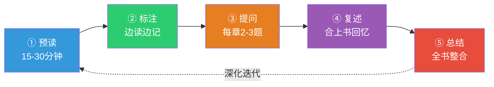
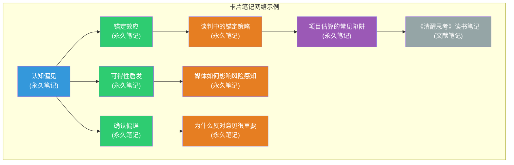
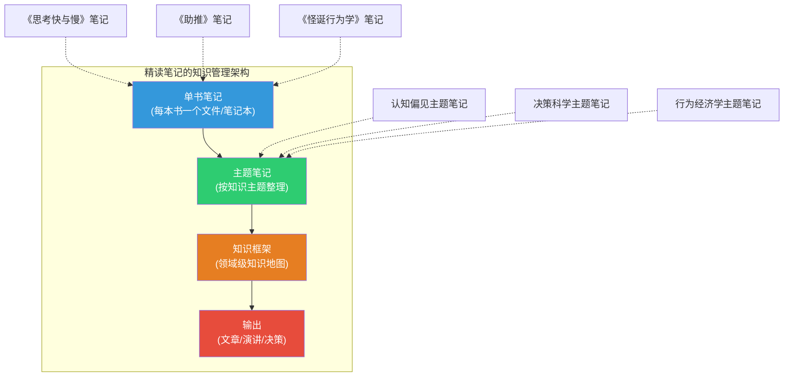

## 第二部分：精读与笔记方法

如果说速读是让你在信息的海洋中快速航行，那么精读就是让你潜入深海，打捞那些沉在水底的珍珠。精读不是"慢慢读"那么简单——它是一套系统化的深度理解方法，需要主动的思维参与、结构化的笔记支撑和持续的反思迭代。本部分将从精读的科学原理出发，逐步展开精读的完整方法论体系、三大笔记方法的详细操作流程，以及常见误区的纠正方案。

---

### 一、精读的定义与科学基础

#### 1.1 什么是精读

精读（Close Reading）源自新批评学派的文学分析方法，指对文本进行逐字逐句的深入研读，关注语言的细节、论证的逻辑、观点的深度和表达的艺术。与速读追求"信息提取效率"不同，精读追求的是"理解深度"——不是读了多少，而是理解了多深。

精读的本质是**建构性阅读**（Constructive Reading）。认知心理学家金特施（Walter Kintsch）在其"建构—整合模型"（Construction-Integration Model）中指出，阅读理解包含两个层次：

| 层次 | 内容 | 精读中的体现 |
|------|------|------------|
| 文本基础（Textbase） | 文字的字面含义、句子间的逻辑关系 | 逐句理解论证链，标注因果关系 |
| 情境模型（Situation Model） | 读者将文本与已有知识整合后形成的深层理解 | 与已有知识对比，形成个人见解 |

大多数人的日常阅读只停留在文本基础层次——他们"读完了"但没有"读懂"。精读的目标就是从文本基础深入到情境模型，真正将作者的思想内化为自己的理解。

#### 1.2 精读的认知科学原理

精读之所以有效，基于三个认知科学原理：

**原理一：深层加工效应（Levels of Processing Effect）**

1972年，认知心理学家克雷克（Fergus Craik）和洛克哈特（Robert Lockhart）提出了"加工水平理论"：信息的记忆深度取决于加工的深度。浅层加工（如默读、划线）产生的记忆较弱，深层加工（如提问、复述、联系已有知识）产生的记忆持久且可迁移。精读中的每一个步骤——标注、提问、复述、总结——都是在推动你从浅层加工走向深层加工。

**原理二：测试效应（Testing Effect）**

心理学家罗迪格（Henry Roediger）和卡匹克（Jeffrey Karpicke）在2006年的经典实验中证明：主动回忆（合上书复述）比重复阅读更有效。精读中的"复述"环节正是利用了测试效应——当你合上书尝试回答自己的问题时，你对内容的记忆和理解会被显著强化。

**原理三：精细编码效应（Elaborative Encoding）**

当你将新信息与已有知识建立联系时，记忆编码更精细、提取路径更丰富。精读中的"个人联想"环节——让你联想到自己的经历、其他书的内容或新的想法——就是在进行精细编码，让新知识嵌入你已有的知识网络中。

#### 1.3 精读的适用场景

精读是一种高强度的阅读方式，不适合所有文本。以下是精读的最佳适用场景：

| 场景 | 原因 | 示例 |
|------|------|------|
| 经典著作 | 每一句话都可能蕴含深意，需要反复品味 | 《论语》《道德经》《红楼梦》《百年孤独》 |
| 核心理论书籍 | 需要深入理解每一个概念和论证链条 | 《思考，快与慢》《人类简史》《国富论》 |
| 超出当前水平的文本 | 信息密度高、概念抽象，需要逐句攻克 | 学术论文、专业教材、技术规范 |
| 对你特别重要的书籍 | 计划反复阅读、长期引用、深入研究 | 职业领域的奠基性著作 |
| 有争议的观点 | 需要仔细审视论证逻辑，判断是否成立 | 社科领域的争议性论著 |
| 文学经典 | 语言本身是艺术，需要品味用词、节奏、意象 | 诗歌、散文、经典小说 |

**不适合精读的文本：** 新闻报道、娱乐杂志、社交媒体内容、通俗博客、已熟悉领域的入门书籍。这些文本信息密度低，用精读是"大炮打蚊子"，浪费时间和精力。

#### 1.4 精读与速读的关系

精读和速读不是对立的，而是互补的。一个成熟的阅读者应该能够自如地在两种模式之间切换：

| 维度 | 速读 | 精读 |
|------|------|------|
| 目标 | 快速提取关键信息 | 深度理解与批判性思考 |
| 速度 | 300—800 字/分钟 | 50—150 字/分钟 |
| 适用文本 | 信息密度低、结构清晰的非虚构 | 经典、理论、高密度文本 |
| 认知负荷 | 中等 | 高 |
| 输出 | 信息摘要、要点列表 | 深度笔记、个人见解、知识网络 |
| 记忆持久度 | 短期（数天） | 长期（数月至数年） |

实际阅读中，最常见的策略是"先速读后精读"：先用速读完成检视阅读，了解全书框架和重点章节，然后对重点章节进行精读。这比"从头到尾精读"效率高得多——因为你把精读的精力花在了刀刃上。

---

### 二、精读前的准备工作

#### 2.1 背景知识储备

精读一本有一定难度的书之前，花30—60分钟做背景知识储备，可以显著提升精读效果。具体做法：

**第一步：了解作者背景**（10分钟）
- 作者是谁？哪个学派/流派？
- 作者的核心主张是什么？
- 这本书在作者的学术脉络中处于什么位置？

**第二步：了解写作背景**（10分钟）
- 这本书写于什么时代？回应什么问题？
- 同时代有哪些相关的著作？
- 这本书出版后引发了什么讨论？

**第三步：获取他人视角**（10—20分钟）
- 在豆瓣、Goodreads 上查看高赞书评
- 在知乎上搜索相关讨论
- 如果是学术著作，查看Google Scholar上的引用和评论

**第四步：建立初步框架**（10—20分钟）
- 翻阅目录，画出全书的结构图
- 标记你最感兴趣的章节
- 写下你希望通过精读回答的2—3个核心问题

这些准备工作不是"浪费时间"，而是在为你的大脑搭建"脚手架"——有了脚手架，新的知识才能更快、更稳地附着上去。

#### 2.2 检视阅读：15—30分钟的全局扫描

在开始精读之前，先进行一次检视阅读。检视阅读的目标是回答以下问题：

1. **这本书的主题是什么？**（一句话概括）
2. **作者的核心论点是什么？**（2—3句话概括）
3. **全书的结构是怎样的？**（画出章节结构图）
4. **哪些章节是核心？哪些是补充？**（标记优先级）
5. **作者的写作风格是怎样的？**（叙事型？论证型？混合型？）

检视阅读的具体操作：

1. 阅读书名页和序言（3分钟）——获取全书定位
2. 研究目录（5分钟）——建立结构框架
3. 阅读导言和结论（5分钟）——获取核心论点
4. 翻阅每一章的开头和结尾（10分钟）——了解各章主旨
5. 随意翻阅几页正文（5分钟）——感受写作风格

完成检视阅读后，你应该能用一段话向别人介绍这本书的核心内容。如果你做不到，说明检视阅读还不够充分。

#### 2.3 制定精读计划

精读一本200—300页的书，通常需要10—20小时。制定一个合理的精读计划：

┌─────────────────────────────────────────────────┐
│              精读计划模板                          │
├─────────────────────────────────────────────────┤
│ 书名：__________________________________________  │
│ 总页数：__________  预计精读时长：__________小时    │
│                                                  │
│ 精读安排：                                        │
│   第1天：检视阅读 + 制定计划（____分钟）            │
│   第2天：第___章至第___章（____分钟）               │
│   第3天：第___章至第___章（____分钟）               │
│   第4天：第___章至第___章（____分钟）               │
│   第5天：第___章至第___章（____分钟）               │
│   ...                                            │
│   最后一天：全书总结与知识整理（____分钟）           │
│                                                  │
│ 精读重点章节（标★）：                              │
│   ★ 第___章：___________________________          │
│   ★ 第___章：___________________________          │
│   ★ 第___章：___________________________          │
│                                                  │
│ 需要查阅的背景资料：                               │
│   1. ___________________________________________  │
│   2. ___________________________________________  │
│                                                  │
│ 精读产出目标：                                     │
│   □ 完成读书笔记                                  │
│   □ 画出全书思维导图                               │
│   □ 写出500—2000字的书评                          │
│   □ 整理出可执行的行动清单                          │
└─────────────────────────────────────────────────┘

---

### 三、精读的五步法

精读的五步法是精读的核心方法论。五步分别是：预读（Preview）、标注（Annotate）、提问（Question）、复述（Recite）、总结（Summarize）。每一步都有明确的操作标准和产出要求。

#### 第一步：预读（Preview）——建立知识地图

预读已在"2.2 检视阅读"中详细说明。这里补充一个关键技巧：**预读时制作"阅读路标"**。

阅读路标是你在检视阅读时标记的重点章节和待解问题。在精读过程中，当你遇到疲惫或困惑时，阅读路标可以帮助你快速定位到最重要的内容，避免在次要信息中迷失方向。

阅读路标示例：
阅读路标——《思考，快与慢》
├── ★ 第一部分（第1-9章）：系统1与系统2的基本概念 → 必须精读
├── ★ 第三部分（第19-24章）：过度自信与决策 → 重点精读
├── ○ 第二部分（第10-18章）：启发式与偏见 → 选读重点章节
├── ○ 第四部分（第25-38章）：选择与前景理论 → 选读重点章节
└── 待解问题：
    1. 系统1和系统2的生理基础是什么？
    2. 如何在实际决策中识别和克服认知偏见？
    3. 前景理论对投资决策有什么启示？

#### 第二步：标注（Annotate）——与作者对话

标注是精读的核心动作。标注不是随意画线，而是有系统、有层次的"与作者对话"。标注的质量直接决定了精读的效果。

**标注的五个层次：**

| 层次 | 标注内容 | 标注符号（推荐） | 认知加工深度 |
|------|---------|---------------|------------|
| 第一层：标记 | 关键论点、核心结论 | 下划线 `___` | 浅 |
| 第二层：注释 | 用自己的话概括该段核心意思 | 旁注 `→` | 中 |
| 第三层：质疑 | 对论证逻辑的疑问或反对意见 | `?` 或 `???` | 中高 |
| 第四层：联系 | 与已有知识、其他书、个人经历的联系 | `↔` 或 `联：` | 高 |
| 第五层：应用 | 这个知识点可以在什么场景中使用 | `用：` 或 `→` | 最高 |

**标注的实操规范：**

**纸书标注法：**
- 使用不同颜色的笔代表不同层次（建议3色以内，过多会混乱）
- 黑色/蓝色：标记关键论点和注释
- 红色：标记质疑和强烈不同意的内容
- 铅笔：标记个人联想和应用想法（可以修改）
- 使用便利贴标记特别重要的页面，便于后续快速定位

**电子书标注法：**
- 微信读书/Kindle 支持多色高亮，建议颜色编码与纸书一致
- 每条高亮后立即写批注，不要"只划不写"
- 利用笔记导出功能，定期将标注整理到笔记系统中

**标注的常见错误：**

| 错误 | 表现 | 纠正方法 |
|------|------|---------|
| 标注过多 | 整页都是下划线，等于没有标注 | 每页最多标注3—5处，只标记最重要的内容 |
| 只划不写 | 只有下划线，没有旁注和评论 | 每条标注至少写一句话的旁注 |
| 被动标注 | 只标记"看起来重要"的内容 | 问自己"如果这段话消失了，我会损失什么？" |
| 层次单一 | 所有标注都是下划线 | 使用符号系统区分不同层次的标注 |
| 标注后不回顾 | 标注完就扔在那里 | 每章精读后花5分钟回顾所有标注 |

**标注符号系统示例（可根据个人习惯自定义）：**

精读标注符号系统
━━━━━━━━━━━━━━━━━━━━━━━━━━━━━━━
___   核心论点（最重要的观点和结论）
≈≈≈   精彩表达（特别优美或有力的句子）
?     疑问（不理解或需要进一步查证的内容）
???   强烈质疑（不同意或认为有逻辑漏洞的内容）
!     恍然大悟（突然理解或获得新启发的瞬间）
→     因果关系（标注论点和论据之间的逻辑链）
↔     联系（与其他知识、经历或书籍的关联）
用：   应用场景（这个知识可以在哪里使用）
总：   段落总结（用自己的话概括本段核心）

#### 第三步：提问（Question）——从被动接受到主动思考

提问是精读中最容易被跳过、但效果最强的步骤。大多数人的阅读是"接受模式"——作者说什么就信什么。提问迫使你切换到"批判模式"——主动审视作者的论证。

**每读完一个章节，提出2—3个深度问题。** 问题的质量决定了思考的深度。以下是三类核心问题和提问模板：

**第一类：理解性问题（检验你是否读懂了）**

| 问题模板 | 示例 |
|---------|------|
| 作者在本章的核心论点是什么？ | "卡尼曼在第20章的核心论点是'锚定效应是普遍存在的认知偏见'" |
| 作者用什么证据来支持这个论点？ | "他引用了三个实验数据和两个商业案例" |
| 本章与前一章的逻辑关系是什么？ | "第20章是第19章'启发式'的具体展开" |
| 作者使用了哪些关键概念？它们之间是什么关系？ | "锚定效应、可得性启发式、代表性启发式都属于系统1的判断捷径" |

**第二类：分析性问题（检验论证是否成立）**

| 问题模板 | 示例 |
|---------|------|
| 这个论点的前提假设是什么？这些假设合理吗？ | "假设实验结果可以推广到真实生活场景——但实验室环境和真实场景差异很大" |
| 有没有被作者忽略的反面观点？ | "卡尼曼强调偏见的负面性，但启发式在快速决策中也有进化优势" |
| 作者的论据是否充分？是否有以偏概全？ | "只引用了美国大学生的实验数据，跨文化适用性存疑" |
| 这个论证的逻辑链条是否严密？ | "从'实验室中存在锚定效应'到'商业谈判中锚定效应普遍存在'，中间缺少过渡论证" |

**第三类：应用性问题（检验知识是否可迁移）**

| 问题模板 | 示例 |
|---------|------|
| 这个知识对我有什么实际意义？ | "了解锚定效应后，我在薪资谈判时可以主动设定锚点" |
| 我可以在什么场景中应用这个知识？ | "产品定价、项目估算、日常决策" |
| 这个知识与我已有的哪些知识可以整合？ | "与行为经济学中的'损失厌恶'可以整合为一套决策框架" |
| 如果我要教别人这个知识，我会怎么讲？ | "先用一个生活中的锚定效应例子引入，再解释原理" |

**提问的质量自检：**

- 好问题：能引发你深入思考，需要你回到原文中寻找证据
- 坏问题：答案是显而易见的，或者只需要翻翻书就能找到

#### 第四步：复述（Recite）——用输出倒逼理解

复述是精读中利用"测试效应"的核心步骤。合上书，用自己的话回答第三步中提出的问题。如果无法流利地回答，说明你对这个内容的理解还不够深入，需要回到原文重新阅读。

**复述的四种形式：**

| 复述形式 | 操作方法 | 适用场景 | 时间投入 |
|---------|---------|---------|---------|
| 口头复述 | 对着镜子或录音设备讲解，想象对方完全不懂这个领域 | 习惯口头表达的学习者 | 5—10分钟/章 |
| 书面复述 | 在笔记本上写下你的理解，不翻书，凭记忆写 | 习惯书面表达的学习者 | 10—15分钟/章 |
| 思维导图 | 画一张本章的思维导图，包含核心概念和关系 | 视觉型学习者 | 10—20分钟/章 |
| 费曼讲解 | 用最简单的语言向一个假想的初学者解释 | 所有人（效果最好的方法） | 10—15分钟/章 |

**费曼讲解法的详细操作：**

费曼讲解法是复述中最有效的一种。诺贝尔物理学奖得主理查德·费曼以"能够用最简单的语言解释最复杂的概念"而闻名。他的方法被总结为四步：

1. **选择概念**：确定你要讲解的概念或章节
2. **用简单语言讲解**：假装对方是一个12岁的孩子，用最通俗的语言解释
3. **发现卡壳的地方**：如果你在某个地方解释不清楚，或者不得不使用专业术语，说明你对这部分理解不够深
4. **回去重新学习**：回到原文，重新理解卡壳的部分，然后再次尝试用简单语言解释

费曼讲解法的核心价值在于：它迫使你将"我以为我懂了"转化为"我真的懂了"。很多时候，我们觉得自己理解了一个概念，但当需要用简单语言解释时，才发现自己的理解充满了模糊和矛盾。

**复述后的自检清单：**

复述自检清单
━━━━━━━━━━━━━━━━━━━━━━━━━━━━━━━
□ 我能否用一句话概括本章的核心论点？
□ 我能否列出支撑核心论点的2—3个关键论据？
□ 我能否解释本章的关键概念（不用翻书）？
□ 我能否说出本章与前几章的逻辑关系？
□ 我能否举出一个生活中的例子来说明本章的核心观点？
□ 我能否指出本章论证中的一个潜在问题或局限？

评分标准：
  6/6 完全掌握，可以进入下一章
  4—5/6 基本掌握，回顾薄弱环节后继续
  3/6以下 理解不充分，需要重新精读本章

#### 第五步：总结（Summarize）——整合输出

总结是精读的最后一步，也是将分散的知识点整合为系统理解的关键步骤。

**单章总结（每章精读后完成，5—10分钟）：**

每章精读后，写一段100—300字的总结，包含：
- 本章的核心论点（1句话）
- 支撑论点的关键论据（2—3句话）
- 你对本章的评价（1—2句话）
- 本章与全书主题的关系（1句话）

**全书总结（整本书精读后完成，500—2000字）：**

完成整本书的精读后，写一篇全书总结。全书总结应该包含以下结构：

全书总结模板
━━━━━━━━━━━━━━━━━━━━━━━━━━━━━━━

一、核心主旨（一句话概括）
  "这本书的核心主旨是：__________"

二、作者要解决的核心问题
  "作者试图回答的核心问题是：__________"
  "这个问题为什么重要：__________"

三、核心论点与关键论据
  "论点1：__________"
    "论据：__________"
  "论点2：__________"
    "论据：__________"
  "论点3：__________"
    "论据：__________"

四、全书逻辑结构
  "第一章至第三章建立了________的基础概念"
  "第四章至第六章展开了________的详细分析"
  "第七章至第八章给出了________的实践方案"

五、个人评价
  "优点：__________"
  "不足：__________"
  "与同类书籍相比：__________"

六、最重要的收获（3—5个）
  "收获1：__________"
    "为什么重要：__________"
  "收获2：__________"
    "为什么重要：__________"
  "收获3：__________"
    "为什么重要：__________"

七、行动计划
  "基于这本书，我计划："
  "1. __________（短期，1周内）"
  "2. __________（中期，1个月内）"
  "3. __________（长期，持续执行）"

---

### 四、笔记方法详解

精读必须配合有效的笔记方法。没有笔记的精读，就像没有地图的探险——你可能看到了很多风景，但最终找不到回去的路。以下是三种经过验证的高效笔记方法，从简单到复杂，你可以根据自己的需求选择。

#### 方法一：康奈尔笔记法（Cornell Method）

康奈尔笔记法是最经典的结构化笔记方法，由康奈尔大学的沃尔特·鲍克（Walter Pauk）在20世纪50年代开发。它的核心优势是将"记录"和"复习"整合在同一个页面上，避免了"记了笔记但从不看"的问题。

**页面布局：**

┌──────────────────────────────────────────┐
│              精读笔记                       │
│  书名：__________________  第___章          │
│  日期：____年____月____日                   │
├─────────────┬────────────────────────────┤
│             │                            │
│   提示区     │         笔记区              │
│  (约1/3)    │        (约2/3)              │
│             │                            │
│  关键词：    │  1. 作者的核心论点是...       │
│             │     ____________            │
│  问题：      │     ____________            │
│  ?__________│                            │
│             │  2. 支撑论据包括...           │
│  ?__________│     ____________            │
│             │     ____________            │
│  关键概念：  │                            │
│  →_________ │  3. 案例：________           │
│  →_________ │     ____________            │
│             │     ____________            │
│  联想：      │                            │
│  ↔_________ │  4. 我的疑问/思考：           │
│  ↔_________ │     ____________            │
│             │                            │
├─────────────┴────────────────────────────┤
│  总结区（用1—3句话概括本页核心内容）：         │
│  ________________________________________  │
│  ________________________________________  │
└──────────────────────────────────────────┘

**三个区域的使用规范：**

| 区域 | 内容 | 时机 | 注意事项 |
|------|------|------|---------|
| 笔记区（右侧） | 关键信息、论点、数据、案例、论证链条 | 精读过程中 | 用自己的话记录，不要逐字抄写；使用缩写和符号提高速度 |
| 提示区（左侧） | 关键词、问题、提示词 | 精读完成后 | 与笔记区的内容一一对应；这些问题将用于后续复习 |
| 总结区（底部） | 用1—3句话概括本页核心内容 | 精读完成后 | 必须用自己的话；如果写不出总结，说明你对内容理解不够 |

**使用流程：**

1. **精读过程中**（第1—2遍）：在右侧笔记区记录关键信息。记录时使用简写、符号、关键词，不要追求完整性。目标是快速捕捉信息。
2. **精读完成后**（约15分钟后）：回顾笔记区，在左侧提示区写下对应的问题或关键词。例如，如果笔记区写了"锚定效应——人们在做数值估计时会被无关数字影响"，提示区就写"什么是锚定效应？"
3. **最后**：在底部总结区用1—3句话概括本页核心内容。
4. **复习时**：遮住右侧笔记区，只看左侧的问题，尝试回忆答案。回答完毕后对照右侧笔记区检查正确率。

**康奈尔笔记法的优势与局限：**

| 优势 | 局限 |
|------|------|
| 结构清晰，适合复习 | 对于非线性的、概念关联复杂的知识不太适合 |
| 将记录和复习整合在一起 | 需要预先准备模板或定制笔记本 |
| 提示区的问题可用于自测 | 初期需要一定时间适应布局 |
| 总结区迫使你进行深度加工 | 不太适合纯叙事类文本（如小说） |

#### 方法二：卡片笔记法（Zettelkasten）

卡片笔记法（Zettelkasten）是德国社会学家尼克拉斯·卢曼（Niklas Luhmann）使用的方法。卢曼一生发表了70多本书和400多篇论文，跨越社会学、法学、政治学、行政学等多个领域。他将自己的惊人产出归功于这套笔记系统——他称自己的笔记系统为"交流伙伴"（communication partner），认为与笔记系统的对话激发了他大部分的写作灵感。

**卡片笔记法的核心思想：** 笔记不是"存储"知识的仓库，而是"生成"知识的引擎。每一条笔记都是一个独立的知识节点，通过与其他笔记的链接，形成一个不断生长的知识网络。

**四种卡片类型：**

| 卡片类型 | 内容 | 生命周期 | 示例 |
|---------|------|---------|------|
| 闪念笔记（Fleeting Note） | 随时记录的想法、灵感、疑问 | 1—2天内处理，处理后丢弃 | 手机备忘录、便利贴 |
| 文献笔记（Literature Note） | 书中/文章中的关键信息摘录 | 永久保存，但需加工 | "《思考快与慢》第20章：锚定效应的定义和实验证据" |
| 永久笔记（Permanent Note） | 用自己的话记录的一个独立想法 | 永久保存，是知识库的核心 | "锚定效应之所以强大，是因为它在无意识层面运作——人们即使知道锚定效应的存在，仍然会受到影响" |
| 索引笔记（Index Note） | 某个主题下所有相关卡片的导航页 | 随新卡片增加而更新 | "认知偏见：→ 锚定效应、可得性启发、确认偏误、损失厌恶..." |

**卡片笔记法的四大原则：**

**原则一：原子化（Atomicity）**

每张卡片只记录一个想法。这不是为了强迫症，而是为了灵活性——原子化的笔记可以自由组合，就像乐高积木一样。如果你把三个想法写在一张卡片上，以后想单独引用其中一个就很困难。

好例子（原子化）：
卡片 #20240315-001
━━━━━━━━━━━━━━━━━━━━━
锚定效应是一种认知偏见，指人们在做数值估计时，
会被先前接触到的无关数字（"锚"）所影响。
即使人们知道这个锚是随机的，仍然会受到影响。
——卡尼曼《思考，快与慢》第20章

链接：→ 认知偏见 | → 谈判策略 | → 项目估算

坏例子（非原子化）：
认知偏见总结
━━━━━━━━━━━━━━━━━━━━━
锚定效应：被无关数字影响
可得性启发：容易想到的事情概率被高估
确认偏误：只关注支持自己观点的证据
损失厌恶：失去100元的痛苦大于得到100元的快乐
（四个概念混在一起，无法单独引用和链接）

**原则二：用自己的话（Own Words）**

不要直接摘抄原文。用自己的语言重新表述，这个过程本身就是深层加工。直接摘抄是"复制粘贴"，用自己的话是"理解重构"。

直接摘抄（低效）：
> "锚定效应是指当人们需要对某个事件做定量估测时，会将某些特定数值作为起始值，起始值像锚一样制约着估测值。"

用自己的话（高效）：
> "锚定效应：人在估算数字时，会被先看到的数字'拉住'。即使这个数字跟你的估算完全无关，你的答案也会偏向它。比如先看到'85'再估算非洲国家在联合国的比例，你的回答会比先看到'10'时高出很多。"

**原则三：建立链接（Linking）**

每张新卡片都应该与已有的相关卡片建立链接。链接是卡片笔记法的灵魂——没有链接的卡片只是碎片，有链接的卡片才是知识网络。

建立链接时，在每张卡片的底部列出相关卡片的编号或主题：

链接：
→ 认知偏见（#20240310-001）
→ 谈判中的锚定策略（#20240320-003）
↔ 可得性启发（#20240312-002）——对比：两种偏见的触发机制不同
↔ 确认偏误（#20240314-003）——共同点：都是无意识运作

**原则四：永久保存（Permanent Storage）**

卡片一旦创建就不删除，只增加新的链接和注释。即使你后来改变了观点，也不要删除旧卡片——而是在旧卡片上添加注释，说明你现在的看法。这个过程本身就是思想发展的记录。

**数字化工具推荐：**

| 工具 | 特点 | 适用场景 | 价格 |
|------|------|---------|------|
| Obsidian | 本地Markdown文件，双向链接，插件生态丰富 | 重度知识工作者，追求数据自主权 | 免费（同步收费） |
| Logseq | 大纲式编辑，双向链接，日志功能 | 喜欢大纲思维和每日笔记的用户 | 免费 |
| Roam Research | 块级引用，图谱视图，强大的查询功能 | 学术研究者，需要复杂关联的知识工作 | $15/月 |
| Notion | 数据库视图，多模板，团队协作 | 需要结构化管理和团队协作的用户 | 免费（高级收费） |
| 纸质卡片 | 零学习成本，触感体验，无电子干扰 | 喜欢手写的学习者，对数字工具不熟悉 | 低 |

#### 方法三：读书笔记模板

标准化的读书笔记模板可以让你的笔记更加系统化和可检索。以下是一个经过优化的完整模板，覆盖精读的全过程：

【精读笔记模板】

═══════════════════════════════════════
  基本信息
═══════════════════════════════════════
书名：
作者：
译者（如有）：
出版社/出版年份：
阅读日期：____年____月____日 至 ____年____月____日
阅读方式：□精读  □主题阅读中的精读  □重读
评分：___/10
推荐指数：□强烈推荐 □推荐 □一般 □不推荐

═══════════════════════════════════════
  一句话总结
═══════════════════════════════════════
（用一句话概括全书核心主旨，不超过30字）

═══════════════════════════════════════
  核心内容
═══════════════════════════════════════

作者要解决的核心问题：
（作者写这本书是为了解决什么问题？这个问题为什么重要？）

核心论点（3—5个）：
1.
2.
3.
4.
5.

关键概念和术语：
| 术语 | 定义（用自己的话） | 重要性 |
|------|------------------|--------|
|      |                  |        |
|      |                  |        |
|      |                  |        |

全书逻辑结构：
（画出全书的论证结构或章节逻辑图）

═══════════════════════════════════════
  精彩摘录
═══════════════════════════════════════

摘录1（页码：___）：
（原文引用）

→ 我的理解/联想：

摘录2（页码：___）：
（原文引用）

→ 我的理解/联想：

摘录3（页码：___）：
（原文引用）

→ 我的理解/联想：

═══════════════════════════════════════
  个人评价
═══════════════════════════════════════

优点：
1.
2.
3.

不足：
1.
2.
3.

论证中的逻辑问题或漏洞：

与同类书籍的比较：
| 比较维度 | 本书 | 同类书籍A | 同类书籍B |
|---------|------|----------|----------|
| 核心观点 |      |          |          |
| 论证深度 |      |          |          |
| 实操性   |      |          |          |
| 可读性   |      |          |          |

═══════════════════════════════════════
  收获与行动
═══════════════════════════════════════

最深刻的3—5个收获：
1.
   为什么重要：
   如何应用：

2.
   为什么重要：
   如何应用：

3.
   为什么重要：
   如何应用：

行动计划（SMART原则）：
1. 【短期·1周内】
   具体行动：
   验证标准：

2. 【中期·1个月内】
   具体行动：
   验证标准：

3. 【长期·持续执行】
   具体行动：
   验证标准：

推荐理由（50字以内，用于向朋友推荐）：

═══════════════════════════════════════
  复习记录
═══════════════════════════════════════
| 复习时间 | 记忆保持率 | 新增理解 | 备注 |
|---------|-----------|---------|------|
| 1天后   |           |         |      |
| 1周后   |           |         |      |
| 1个月后 |           |         |      |
| 3个月后 |           |         |      |

**模板使用要点：**

- **不要追求一次性填完所有字段。** 精读过程中先填写"基本信息""核心内容"和"精彩摘录"部分；精读结束后再填写"个人评价""收获与行动"部分。
- **"一句话总结"是最重要的字段。** 如果你无法用一句话概括全书核心主旨，说明你还没有真正理解这本书。
- **"行动计划"必须具体、可执行。** 不要写"我要多思考"这种空话，要写"下次做项目估算时，先列出3个不同的锚定点再做判断"。
- **"复习记录"利用间隔重复原理。** 按照1天、1周、1个月、3个月的节奏复习，每次复习时填写记忆保持率和新增理解。

---

### 五、不同类型文本的精读策略

不同类型的文本需要不同的精读策略。用同一种方法精读所有书，就像用同一种菜谱做所有菜——效果不会好。

#### 5.1 非虚构类（商业、科普、自我管理）

**核心策略：** 关注论证逻辑和实操方案

| 精读重点 | 具体操作 |
|---------|---------|
| 核心论点 | 每章提炼1—2个核心论点 |
| 论证逻辑 | 画出论点→论据→结论的逻辑链 |
| 实操方案 | 提取可执行的步骤和模板 |
| 案例分析 | 判断案例是否典型、数据是否可靠 |
| 局限性 | 识别作者忽略的反面观点 |

#### 5.2 经典文学（小说、诗歌、散文）

**核心策略：** 关注语言艺术和叙事技巧

| 精读重点 | 具体操作 |
|---------|---------|
| 语言品味 | 标记特别优美或有力的句子，分析其修辞手法 |
| 叙事结构 | 分析故事线、视角切换、时间线安排 |
| 人物塑造 | 分析人物动机、性格发展、人物关系 |
| 主题层次 | 识别表层主题和深层主题 |
| 文化语境 | 了解作品的历史和文化背景 |

#### 5.3 学术著作

**核心策略：** 关注研究方法和理论框架

| 精读重点 | 具体操作 |
|---------|---------|
| 研究问题 | 作者试图解决什么学术问题？ |
| 理论框架 | 作者使用什么理论视角？ |
| 研究方法 | 数据来源、样本、分析方法是否合理？ |
| 核心发现 | 主要结论是什么？有哪些创新？ |
| 引用网络 | 作者引用了哪些关键文献？这些文献值得追踪 |
| 学术争议 | 其他学者如何评价这个研究？ |

#### 5.4 哲学类

**核心策略：** 关注概念定义和论证严密性

| 精读重点 | 具体操作 |
|---------|---------|
| 概念定义 | 每个核心概念的精确定义是什么？ |
| 论证链条 | 前提→推理→结论，每一步是否严密？ |
| 思想实验 | 作者的思想实验是否有效？能否构造反例？ |
| 历史脉络 | 这个观点在哲学史上的位置是什么？ |
| 现实意义 | 这些抽象思考对现实生活有什么启示？ |

#### 5.5 工具书（手册、指南、参考书）

**核心策略：** 按需查阅 + 系统梳理

| 精读重点 | 具体操作 |
|---------|---------|
| 整体框架 | 先通读目录，建立整体认知 |
| 重点章节 | 选择与当前需求最相关的章节精读 |
| 操作步骤 | 提取可直接使用的步骤、模板、代码 |
| 交叉引用 | 注意章节之间的引用关系 |
| 索引利用 | 善用书后索引快速定位信息 |

---

### 六、精读中的常见问题与解决方案

#### 6.1 问题一：读不进去，注意力涣散

**原因分析：**
- 书的难度超出了你的当前水平
- 阅读环境有干扰（手机、噪音、多任务）
- 没有明确的阅读目标（不知道为什么读）
- 身体状态不佳（疲劳、饥饿、焦虑）

**解决方案：**

| 方案 | 操作 | 适用情况 |
|------|------|---------|
| 番茄工作法 | 25分钟专注 + 5分钟休息，循环4次后长休15分钟 | 日常精读 |
| 环境隔离 | 手机静音/飞行模式，关闭电脑通知，找安静空间 | 有明显外部干扰 |
| 前置问题 | 精读前写下2—3个你想回答的问题 | 缺乏目标感 |
| 降级阅读 | 如果原文太难，先读一本同主题的入门书 | 内容超出当前水平 |
| 身体准备 | 保证充足睡眠，避免饭后立即阅读，保持适度咖啡因摄入 | 身体状态不佳 |

#### 6.2 问题二：标注太多，等于没标

**原因分析：**
- 没有明确的标注标准
- "觉得什么都重要"
- 害怕遗漏，所以全部划线

**解决方案：**

采用"20%法则"：每页最多标注20%的内容。具体操作：
1. 先快速通读整页，不标注
2. 合上书，回忆这页最重要的1—2个信息
3. 翻开书，只标注你回忆出来的内容
4. 如果有遗漏的重要信息，补充标注1—2处

这个方法利用了"测试效应"——先回忆再标注，确保你标注的都是真正重要的内容。

#### 6.3 问题三：笔记记了但从不看

**原因分析：**
- 笔记格式混乱，不方便回顾
- 没有建立复习机制
- 笔记只是"摘抄"，没有个人思考，回顾时没有新收获

**解决方案：**

1. **统一笔记格式**：选择一种笔记方法（康奈尔或卡片法），坚持使用
2. **建立复习机制**：利用间隔重复原理，在精读后1天、1周、1个月各复习一次
3. **让笔记有价值**：每次回顾时添加新的理解和联想，让笔记"活起来"
4. **与行动结合**：将笔记中的关键洞察转化为行动清单，每周回顾

#### 6.4 问题四：精读太慢，一年读不了几本

**原因分析：**
- 对所有书都用精读方法（没有必要）
- 精读过程中缺乏计划，时间分配不合理
- 追求"完美精读"，在不重要的章节花太多时间

**解决方案：**

1. **不是所有书都值得精读。** 一年精读5—10本真正重要的书，远好过"精读"30本但每本都浮于表面。
2. **精读前做检视阅读。** 通过检视阅读确定重点章节，只精读最重要的部分。一本300页的书，核心内容可能只有100—150页。
3. **设定时间盒。** 给每章精读设定时间限制（如1—2小时），超时后强制进入下一章。完美是效率的敌人。
4. **精读与速读结合。** 同一本书中，重要章节精读，次要章节速读。

#### 6.5 问题五：精读完记不住

**原因分析：**
- 只读不写，没有外部化
- 没有与已有知识建立联系
- 没有进行复习
- 信息过载，一次精读太多内容

**解决方案：**

1. **强制输出。** 每章精读后必须写一段100—300字的总结。输出是记忆的加速器。
2. **建立联系。** 每读到一个新概念，问自己"这让我想到了什么？"——与已有知识、个人经历、其他书籍建立联系。
3. **间隔复习。** 按照1天—1周—1个月—3个月的节奏复习笔记。
4. **控制节奏。** 每天精读不超过2—3章，给大脑消化的时间。

---

### 七、精读的进阶技巧

#### 7.1 交叉精读法

对同一主题的多本书进行交叉精读。具体操作：

1. 选择同一主题的3—5本书
2. 按主题（而非按书）组织精读笔记
3. 对比不同作者对同一问题的观点
4. 找出共识、分歧和空白地带
5. 形成自己的综合判断

交叉精读的优势在于：它迫使你从"单向接受"走向"多维比较"，形成独立的批判性思维。

#### 7.2 对话式精读

想象作者就坐在你对面，你正在与他进行一场深度对话。具体操作：

1. **准备阶段**：写下你最想问作者的3个问题
2. **阅读阶段**：边读边想象作者在"回答"你的问题
3. **回应阶段**：对作者的回答提出追问、质疑或补充
4. **总结阶段**：写下这场"对话"的核心收获

对话式精读特别适合阅读观点鲜明、论证性强的非虚构类书籍。

#### 7.3 逆向精读法

从结论开始，逆向追溯作者的论证过程。具体操作：

1. 先读全书的结论章节（通常在最后1—2章）
2. 提问："作者是如何得出这个结论的？"
3. 逆向追溯到中间章节的论证
4. 再追溯到开头章节的前提和假设
5. 评估整个论证链条是否严密

逆向精读法特别适合学术著作和论证性非虚构——它帮助你快速抓住论证的核心逻辑，避免在细节中迷失方向。

#### 7.4 精读笔记的知识管理

当你精读了10本以上的书后，笔记管理变得至关重要。以下是知识管理的最佳实践：

**知识管理的三个层次：**

| 层次 | 内容 | 操作频率 |
|------|------|---------|
| 单书笔记 | 每本书的精读笔记（使用上述模板） | 每读完一本书 |
| 主题笔记 | 将多本书中同一主题的内容整合在一起 | 每精读3—5本同主题书后 |
| 知识框架 | 一个领域的完整知识地图 | 每完成一个主题阅读周期后 |

---

### 八、精读效果的衡量标准

如何判断你的精读是否有效？以下是可操作的衡量标准：

| 维度 | 衡量指标 | 达标标准 |
|------|---------|---------|
| 理解深度 | 能否用自己的话解释全书核心论点 | 合上书，能在2分钟内清晰概括 |
| 批判能力 | 能否指出论证中的1—2个问题或局限 | 不盲目接受，能识别逻辑漏洞 |
| 迁移能力 | 能否将书中的知识应用到新场景 | 举出1—2个书外的应用案例 |
| 连接能力 | 能否将本书内容与其他知识关联 | 说出与其他2—3本书/领域的联系 |
| 记忆持久度 | 1个月后能否回忆核心内容 | 回忆率达到60%以上 |
| 输出能力 | 能否写出有深度的书评或笔记 | 1000字以上，有个人见解 |

**自评问卷（精读完成1周后自测）：**

精读效果自评（每项1—5分）
━━━━━━━━━━━━━━━━━━━━━━━━━━━━━━━
1. 我能用自己的话清晰解释这本书的核心观点    ___/5
2. 我能列出支撑核心观点的3个关键论据         ___/5
3. 我能指出这本书的1—2个不足或局限           ___/5
4. 我能将书中的知识与我的工作/生活联系起来     ___/5
5. 我能说出这本书与我读过的其他书的关系        ___/5
6. 我已经在实际中应用了书中的某个方法          ___/5
7. 我向别人推荐过这本书并说清了推荐理由        ___/5
8. 1个月后我仍然记得这本书的核心内容           ___/5

总分：___/40
35分以上：精读效果优秀
28—34分：精读效果良好
20—27分：精读效果一般，需要加强输出和复习
20分以下：精读方法需要调整

---

### 本节小结

精读不是"慢慢读"，而是一套系统化的深度理解方法。本节涵盖了精读的完整方法论体系：

1. **科学基础**：深层加工效应、测试效应、精细编码效应——理解为什么精读有效
2. **五步法**：预读→标注→提问→复述→总结——精读的核心操作流程
3. **三种笔记方法**：康奈尔笔记法（结构化复习）、卡片笔记法（知识网络）、读书笔记模板（系统化记录）
4. **分类型策略**：非虚构、文学、学术、哲学、工具书——不同文本用不同策略
5. **常见问题**：读不进去、标注过多、笔记不看、太慢、记不住——每个问题都有具体解决方案
6. **进阶技巧**：交叉精读、对话式精读、逆向精读、知识管理——从入门到精通

精读的核心公式：

> **精读效果 = 理解深度 × 笔记质量 × 复习频率 × 输出实践**

四个因子缺一不可。只读不写是"浅层浏览"，只写不复习是"无效存储"，只复习不应用是"纸上谈兵"。真正的精读，是从输入到输出的完整闭环。
