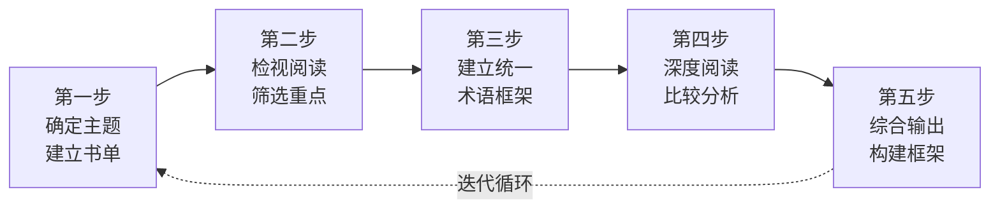
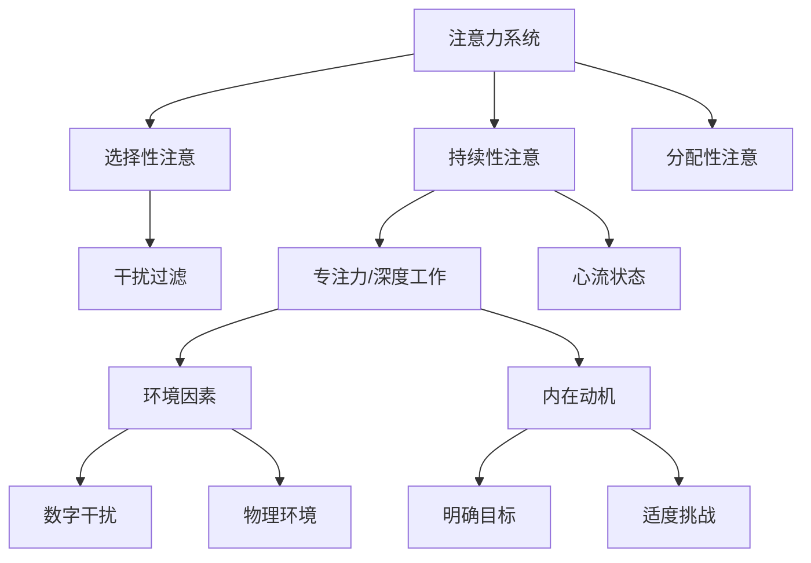
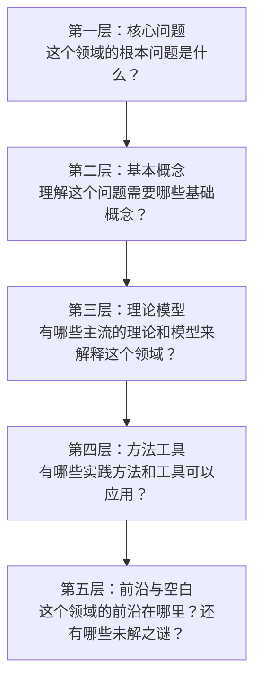
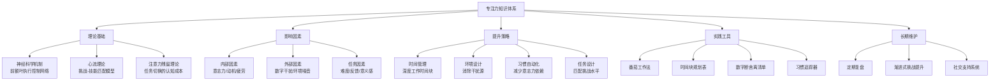
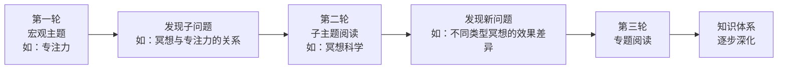

## 第三部分：主题阅读方案

### 一、什么是主题阅读

主题阅读（Syntopical Reading）是莫提默·艾德勒在《如何阅读一本书》中定义的最高阅读层次。它不是读一本关于某个主题的书，而是围绕一个特定主题，同时阅读多本相关的书，通过比较、分析和综合，构建出该主题的完整知识图景。

#### 1.1 主题阅读与其他阅读层次的关系

艾德勒将阅读分为四个层次：基础阅读、检视阅读、分析阅读、主题阅读。前三个层次处理的都是"一本书"——理解单本书的内容、结构和论证。主题阅读则是唯一不以单本书为单位的阅读方式——它以"问题"为中心，书籍只是回答问题的素材来源。

主题阅读的本质转变：
  单本书为中心 → 问题为中心
  跟随作者思路 → 驱动作者回答你的问题
  被动接受信息 → 主动构建知识体系

#### 1.2 主题阅读的四重价值

**全面性**——没有一本书能够覆盖一个主题的所有方面。一本讲专注力的书可能侧重神经科学，另一本侧重行为习惯，第三本侧重数字时代的干扰。通过多本书的交叉阅读，你能够拼凑出完整的拼图。

**批判性**——不同作者对同一问题往往持有不同甚至矛盾的观点。A作者说早起是提升专注力的关键，B作者说关键在于匹配你的昼夜节律。对比阅读迫使你审视每种观点的证据质量和适用条件，形成独立判断，而不是被单一作者的叙事裹挟。

**深度性**——同一个概念在不同书中的反复出现和不同角度的阐释，会产生"间隔重复"的认知效果。你会在不同语境下反复接触核心概念，理解从模糊到清晰，记忆从短期到长期。

**框架性**——碎片化阅读得到的是散点，主题阅读得到的是网络。你不仅知道"是什么"，还知道"为什么"和"怎么用"，更能识别出这个领域的知识盲区——知道自己不知道什么，这是最宝贵的元认知能力。

### 二、主题阅读的五步法

主题阅读不是"同时读5本书"这么简单。它有严格的操作流程，每一步都有明确的目标和产出。

#### 第一步：确定主题，建立书单

**主题选择的三个原则**

**具体且有边界**——"个人成长"太大，"如何提升专注力"刚好，"如何在开放式办公室中保持深度工作状态"则过于狭窄。一个好主题的标准是：你能用一句话说清楚你想研究什么，同时这个主题至少有5本以上高质量的书可供选择。

**与真实需求相关**——主题阅读需要投入大量时间（通常2-6周），如果主题与你当前的工作、学习或生活无关，你很难坚持下去。最好的主题是你正在面临的真实问题：你正在创业，就研究"早期创业者的决策框架"；你正在转行，就研究"跨领域迁移学习"。

**有知识落差**——选择那些你目前只有模糊认知、但又确实需要深入理解的领域。如果一个主题你已经非常精通，主题阅读的边际收益很低；如果一个主题你完全不了解，先读一本入门书比直接做主题阅读更合适。

**建立高质量书单的方法**

不要依赖单一来源。每个来源都有偏差，综合多个来源才能找到真正值得读的书。

| 来源 | 方法 | 优势 | 局限 |
|------|------|------|------|
| 豆瓣/Goodreads | 搜索主题关键词，按评分排序 | 评分系统可靠，评论丰富 | 存在刷分和营销书 |
| 领英/Twitter专家 | 查看领域专家推荐的书单 | 专业性强 | 可能过于学术化 |
| 学术引用网络 | 找到一本核心书，追踪其参考文献 | 发现被忽视的经典 | 学术著作可读性低 |
| 播客/访谈 | 听作者或专家讨论该领域 | 了解最新趋势 | 信息密度低 |
| 知乎/Reddit | 搜索"XX主题 书单推荐" | 经验分享丰富 | 质量参差不齐 |
| 出版社书系 | 查看出版社的该主题系列书 | 编辑已经做过筛选 | 可能过度商业化 |

**书单的结构配置**

一本主题阅读的书单应该像一个团队——每个成员有不同的角色。推荐的配置如下：

典型5-8本书的书单结构：

入门层（1-2本）：建立基本概念和术语体系
  → 科普类、畅销类，语言通俗易懂
  → 作用：降低后续阅读的认知门槛

核心层（2-3本）：深入理解核心理论和方法论
  → 该领域的代表性著作，理论与实践兼备
  → 作用：建立知识框架的主体结构

进阶层（1-2本）：了解前沿研究和深层原理
  → 学术著作或专业论述
  → 作用：提供深度和批判性视角

实践层（1本）：了解实际应用和操作方法
  → 方法论、工具书、案例集
  → 作用：连接理论与行动

**关键提醒**：不要贪多。5本精心选择的书远好于15本随便选的书。主题阅读的质量不取决于书的数量，而取决于你能否在这些书之间建立有意义的连接。

#### 第二步：检视阅读，筛选重点

对书单中的每一本书进行检视阅读（15-30分钟/本），这不是偷懒，而是战略性的信息侦察。

**检视阅读的操作流程：**

1. **看封面和序言**（2分钟）——了解作者的写作意图和目标读者
2. **看目录**（3分钟）——画出全书的结构图，标记与主题相关的章节
3. **翻阅序言和结语**（5分钟）——作者通常在这里总结核心观点
4. **抽读相关章节**（10-15分钟）——读每个相关章节的开头和结尾段落
5. **做判断**——这本书对我的主题有多大价值？相关章节是哪些？

**检视阅读后你可能需要做出三种调整：**

- **淘汰**——某些书的相关性比预期低，果断去掉
- **补充**——在某本书的参考文献中发现了更相关的书
- **降级**——某本书不是核心阅读材料，但可以作为参考

**时间预算**：如果书单有6本书，检视阅读总共需要2-3小时。不要跳过这一步——它能帮你在后续的深度阅读中节省至少10个小时。

#### 第三步：建立统一的术语和框架

这是主题阅读中最关键也最容易被忽视的一步。不同作者使用不同的术语表达相同的概念，或者用相同的术语表达不同的概念，如果不先理清，后续的比较分析会陷入混乱。

**为什么术语统一如此重要**

认知心理学研究表明，人类理解新信息时会依赖已有的知识框架（schema）。当你在不同书之间切换时，如果同一个概念被不同的词语包裹，你的大脑会把它当作不同的概念来处理，导致认知负荷倍增，理解效率下降。

一个真实的例子：在心理学领域，"元认知"（metacognition）、"反思性思维"（reflective thinking）、"自我监控"（self-monitoring）、"内省"（introspection）这四个概念在不同书中有80%的重叠，但初学者很容易以为它们是完全不同的东西。建立术语对照表后，你才能看到它们的真实关系。

**术语统一的操作步骤**

**步骤一：提取核心概念**——从检视阅读的笔记中，列出该主题出现频率最高的10-20个概念和术语。

**步骤二：建立术语对照表**——用一个表格记录不同作者对同一概念的不同表述。

术语对照表模板：

| 统一术语 | 作者A的表述 | 作者B的表述 | 作者C的表述 | 备注 |
|----------|------------|------------|------------|------|
| 深度专注 | 深度工作 | 心流状态 | 注意力集中 | 三个概念不完全等价，心流有额外的愉悦体验维度 |
| 干扰源 | 注意力残留 | 环境噪音 | 认知负载 | 关注层面不同：内在vs外在 |
| 习惯回路 | 惯常行为 | 自动化模式 | 行为脚本 | 核心机制相同 |

**步骤三：建立概念关系图**——用思维导图或概念图展示这些术语之间的关系（包含、对立、因果、并列等）。

**步骤四：选择你的统一术语**——在后续的笔记和输出中，使用一套统一的术语。通常选择最通用、最容易理解的表述。

#### 第四步：深度阅读，比较分析

这是主题阅读的核心阶段——你已经知道要读什么、要找什么，现在开始深入挖掘。

**核心问题设计**

在开始深度阅读之前，你需要列出5-10个核心问题。这些问题决定了你阅读的方向和深度。

**好问题的特征：**
- 开放式——不能用"是/否"回答
- 有争议性——不同作者可能给出不同答案
- 可操作——答案能指导实际行动
- 有层次——既有"是什么"又有"为什么"和"怎么做"

**问题设计的框架：**

| 问题类型 | 示例 | 作用 |
|----------|------|------|
| 定义型 | 什么是XX？它的边界在哪里？ | 建立概念基础 |
| 机制型 | XX是如何运作的？背后原理是什么？ | 理解深层逻辑 |
| 因果型 | 什么因素导致了XX？XX又导致了什么？ | 识别因果关系 |
| 比较型 | XX与YY有什么区别和联系？ | 建立概念网络 |
| 方法型 | 如何有效地做XX？有哪些具体步骤？ | 连接理论与实践 |
| 批判型 | XX的局限性是什么？在什么条件下不成立？ | 培养批判思维 |
| 应用型 | XX在实际生活中如何应用？有什么成功案例？ | 确保学以致用 |

**比较分析的操作方法**

**方法一：问题导向法**——以问题为主线，逐个问题比较不同作者的观点。

比较分析记录模板：

【核心问题】：如何系统性地提升专注力？

【作者A——卡尔·纽波特《深度工作》】
核心观点：通过创造固定的深度工作时间块（每天4小时上限），
配合远离社交媒体和减少任务切换来培养专注力。
证据强度：★★★★☆（有大量案例支撑，但缺乏严格的对照实验）
适用场景：知识工作者、创作者

【作者B——米哈里·契克森米哈赖《心流》】
核心观点：专注力的提升关键在于找到任务难度与个人技能的匹配点，
当挑战略高于技能水平时，注意力会自然聚焦。
证据强度：★★★★★（基于数十年的跨文化研究）
适用场景：需要内在驱动的任务

【作者C——詹姆斯·克利尔《原子习惯》】
核心观点：专注力不是意志力的问题，而是习惯设计的问题。
通过环境设计、习惯叠加和即时奖励，让专注行为自动化。
证据强度：★★★★☆（行为科学支撑，有实操性）
适用场景：需要长期坚持的行为改变

【共同点】：
- 三者都强调环境的重要性（减少干扰源）
- 三者都反对单纯依赖意志力
- 三者都建议循序渐进而非一步到位

【差异点】：
- 纽波特侧重"时间管理"，契克森米哈赖侧重"任务设计"，
  克利尔侧重"习惯自动化"
- 纽波特的方法更适合工作场景，克利尔的方法更通用

【我的判断】：
三个框架可以组合使用——用纽波特的方法安排工作时间，
用契克森米哈赖的原理设计任务难度，用克利尔的方法建立
日常习惯。三者互补而非互斥。

**方法二：作者导向法**——先完整阅读一位作者的相关章节，再切换到下一位。适合需要先深入理解单一观点再做比较的场景。

**方法三：主题导向法**——先确定几个子主题，然后在所有书中分别搜集每个子主题的内容。适合子主题清晰、跨书内容高度交织的场景。

**推荐**：初学者用问题导向法，因为它最直观；进阶者可以用主题导向法，因为效率更高。

**处理观点冲突的策略**

当不同作者的观点相互矛盾时，不要急着选边站。按照以下步骤处理：

1. **检查证据质量**——谁的观点有更强的实证支持？学术研究 > 案例研究 > 个人经验 > 推测
2. **检查适用条件**——两种观点是否适用于不同的场景或人群？矛盾可能只是适用范围不同
3. **检查时间维度**——是否一方的研究更新？知识是会迭代的
4. **保留不确定性**——如果证据都不够强，诚实地说"目前还不确定"比强行下结论更明智

#### 第五步：综合输出，构建框架

主题阅读的最终产出不是一份读书笔记，而是一个知识框架。这个框架应该能回答："关于这个主题，我现在知道了什么？还有什么是我不知道的？"

**知识框架的五个层次**

**输出形式的选择**

| 输出形式 | 适合场景 | 预期字数 | 优势 |
|----------|----------|----------|------|
| 主题研究长文 | 需要系统性记录 | 5000-10000字 | 最完整的记录形式 |
| 知识地图/思维导图 | 需要快速回顾 | 结构化图表 | 一目了然，便于迭代 |
| 演讲/分享 | 需要输出倒逼输入 | 30-60分钟 | 检验理解深度 |
| 博客系列文章 | 需要公开输出获得反馈 | 每篇1500-3000字 | 外部反馈加速学习 |
| 行动方案 | 需要立即应用 | 1000-2000字 | 连接知识与行动 |

**不要跳过输出**——没有输出的主题阅读只完成了一半。输出的过程会暴露你的理解盲区，迫使你回到书中补充。这是认知科学中的"生成效应"（generation effect）——自己生成的信息比被动接收的信息记忆更深刻。

### 三、主题阅读实战示例：以"专注力"为主题

以下是一个完整的主题阅读实战演示，展示五步法在真实场景中的应用。

#### 第一步：确定书单

经过多源检索和筛选，确定以下6本书作为核心书单：

| 序号 | 书名 | 作者 | 定位 | 核心价值 |
|------|------|------|------|----------|
| 1 | 《深度工作》 | 卡尔·纽波特 | 核心理论 | 提出了"深度工作"的概念框架，系统论证专注力在知识经济时代的价值 |
| 2 | 《心流》 | 米哈里·契克森米哈赖 | 核心理论 | 基于30年研究，揭示专注状态的心理机制和触发条件 |
| 3 | 《专注力：化繁为简的惊人力量》 | 于尔根·沃尔夫 | 实践指南 | 提供可直接操作的专注力提升技巧和工具 |
| 4 | 《认知天性》 | 彼得·布朗等 | 科学基础 | 从认知心理学角度解释注意力和记忆的运作机制 |
| 5 | 《原子习惯》 | 詹姆斯·克利尔 | 习惯养成 | 通过习惯设计让专注行为自动化，减少对意志力的依赖 |
| 6 | 《数字极简主义》 | 卡尔·纽波特 | 数字时代应用 | 专门针对数字干扰的应对策略 |

#### 第二步：检视阅读后的调整

经过2小时的检视阅读，做出以下调整：
- 保留全部6本书（相关性都足够强）
- 将《数字极简主义》从"核心层"降级为"参考层"，因为它与《深度工作》有大量重复
- 在《深度工作》的参考文献中发现了一本重要的补充读物——《意志力》（罗伊·鲍迈斯特），加入参考层

#### 第三步：术语统一

建立以下术语对照表：

| 统一术语 | 纽波特 | 契克森米哈赖 | 沃尔夫 | 克利尔 | 布朗等 |
|----------|--------|-------------|--------|--------|--------|
| 深度专注状态 | 深度工作 | 心流 | 全神贯注 | — | 努力检索 |
| 注意力分散 | 注意力残留 | — | 干扰 | 坏习惯的提示 | 分心 |
| 环境设计 | 仪式化 | 初始条件 | 消除干扰 | 环境设计 | — |
| 意志力消耗 | 有限资源 | — | 会疲劳 | 习惯化减少消耗 | 认知负荷 |
| 即时反馈 | — | 反馈循环 | 进度追踪 | 奖励 | 测试效果 |

#### 第四步：比较分析——6个核心问题

**问题1：专注力的科学机制是什么？**

从《认知天性》和《心流》中可以提取出专注力的神经科学基础：专注力涉及前额叶皮层的执行控制网络和默认模式网络之间的切换。当外部干扰激活默认模式网络（走神、反刍）时，专注力被中断。《深度工作》进一步指出，每次切换都会产生"注意力残留"——你的一部分认知资源仍然停留在上一个任务上，完全恢复需要15-25分钟。

**问题2：为什么现代人越来越难以专注？**

《数字极简主义》给出了最系统的回答：智能手机的推送通知、社交媒体的无限滚动设计、即时通讯的频繁打断，共同构成了一个"持续部分注意力"（continuous partial attention）的环境。《深度工作》补充了一个经济学视角：在知识经济中，深度工作的价值在上升，但能够做到深度工作的人在减少，这意味着深度工作者获得了稀缺性溢价。

**问题3：专注力是有限资源还是可以再生的？**

这是一个存在争议的问题。《深度工作》和《意志力》认为意志力/专注力是有限资源（自我损耗理论），每天的深度工作上限约为4小时。但最新的研究（2016年后的元分析）对自我损耗理论提出了质疑，认为意志力的"有限性"更多是心理信念而非生理事实。《心流》的立场更接近"可再生"——当任务匹配个人兴趣和技能水平时，专注力可以持续更长时间而不感到消耗。

**问题4：如何系统性地提升专注力？**

| 策略来源 | 核心方法 | 操作难度 | 见效速度 |
|----------|----------|----------|----------|
| 纽波特 | 固定时间块+远离社交媒体 | 中等 | 2-4周 |
| 契克森米哈赖 | 匹配挑战与技能+获得即时反馈 | 较高 | 需要找到合适任务 |
| 沃尔夫 | 番茄工作法+优先级矩阵 | 低 | 1-2周 |
| 克利尔 | 环境设计+习惯叠加 | 低 | 4-8周 |
| 布朗等 | 间隔检索练习 | 中等 | 2-4周 |

**问题5：数字技术对专注力的影响及应对？**

《数字极简主义》提出了"数字断舍离"的30天实验：暂时远离所有非必要的数字工具，然后有选择地重新引入。《深度工作》建议更温和的策略——"关闭通知+固定查看时间+物理隔离设备"。《原子习惯》从习惯角度补充：不是"戒掉手机"，而是设计新的习惯回路来替代无意识刷手机的行为。

**问题6：专注力与创造力的关系是什么？**

这是一个经常被忽略的问题。《心流》的研究表明，高度专注状态下的创造力显著高于注意力分散状态——因为前额叶皮层在专注状态下能够更好地协调发散思维和收敛思维。但《深度工作》也指出，适度的"无聊时间"（如散步、淋浴）能够激活默认模式网络，促进创意的"孵化"。两者的最佳组合是：深度工作时间块用于执行，刻意安排的休息时间用于孵化。

#### 第五步：知识框架输出

经过以上比较分析，构建出以下"专注力知识地图"：

### 四、主题阅读的常见误区与解决方案

#### 误区一：书单贪多——"我要读20本书"

**问题**：书单过大导致每个主题蜻蜓点水，无法在书与书之间建立深度连接。

**解决**：严格控制在5-8本。如果检视阅读后发现某本书的相关性不高，果断去掉。记住：主题阅读的质量取决于你能在不同观点之间建立多少有意义的连接，而不是你读了多少本书。

#### 误区二：跳过检视阅读——"直接开始精读"

**问题**：在不相关的章节上浪费大量时间，或者读到一半才发现某本书根本不适合。

**解决**：检视阅读是主题阅读中最高效的一步。花2-3小时做检视阅读，可以在后续节省10小时以上的无效阅读。

#### 误区三：忽略术语统一——"我读的时候自然能理解"

**问题**：不同作者用不同术语表达相同概念，导致你以为它们是不同的东西，或者用相同术语表达不同概念，导致混淆。

**解决**：在开始深度阅读之前，花1-2小时建立术语对照表。这个投入的回报是巨大的。

#### 误区四：只做笔记不做比较——"每本书单独做笔记"

**问题**：得到的是几份独立的读书笔记，而不是一个整合的知识框架。主题阅读的核心价值——比较分析——完全没有体现。

**解决**：使用"问题导向"的比较分析模板，以问题为线索串联不同作者的观点。每本书的笔记是原料，比较分析才是成品。

#### 误区五：没有输出——"我读完了就算了"

**问题**：知识停留在短期记忆中，没有转化为长期记忆和可应用的框架。

**解决**：主题阅读必须有输出。最简单的输出是一篇3000字的主题总结，包含核心问题、各作者观点对比、你的判断和行动方案。

#### 误区六：忽视观点冲突——"专家说的都对"

**问题**：面对不同作者的矛盾观点时，要么全盘接受，要么选择性忽略。

**解决**：观点冲突是主题阅读最有价值的部分。它迫使你思考：谁的证据更强？适用条件是什么？能否整合？保持批判性，但也要保持开放性——有些问题目前确实没有定论。

### 五、数字工具与系统搭建

主题阅读涉及大量信息的收集、整理和比较，合适的工具可以事半功倍。

#### 5.1 推荐工具组合

**笔记与知识管理：**
- **Notion / Obsidian**——适合建立术语对照表、概念关系图、比较分析数据库。Obsidian 的双向链接功能特别适合主题阅读中的概念关联。
- **Logseq**——适合日常摘录和快速笔记，大纲结构便于层次化整理。
- **纸质笔记本**——适合思维导图和自由联想，不受软件结构限制。

**文献管理：**
- **Zotero**——免费开源的文献管理工具，适合管理书目信息、做批注和笔记。
- **豆瓣书单**——适合快速建立和管理书单，方便查看评分和评论。

**思维可视化：**
- **XMind / MindNode**——适合绘制概念关系图和知识地图。
- **Excalidraw**——适合快速草图和流程图。

#### 5.2 工作流示例

主题阅读的标准工作流：

1. 建立书单 → Notion数据库（书名、作者、定位、状态）
2. 检视阅读 → 纸质笔记本（快速记录每本书的核心章节）
3. 术语统一 → Notion表格（术语对照表）
4. 深度阅读 → Obsidian（每本书的详细笔记+双向链接）
5. 比较分析 → Notion数据库（问题导向的比较表格）
6. 综合输出 → 长文或思维导图
7. 归档整理 → Obsidian知识库（永久保存和检索）

### 六、主题阅读的时间管理

#### 6.1 时间预算

一个完整的主题阅读项目（6本书）的时间预算大致如下：

| 阶段 | 时间投入 | 产出 |
|------|----------|------|
| 建立书单 | 2-3小时 | 5-8本书单 |
| 检视阅读 | 2-3小时 | 每本书的相关章节标注 |
| 术语统一 | 1-2小时 | 术语对照表 |
| 深度阅读 | 20-30小时 | 比较分析笔记 |
| 综合输出 | 5-8小时 | 知识框架/长文 |
| **总计** | **30-45小时** | **完整的主题知识体系** |

按照每天投入1.5-2小时计算，一个主题阅读项目大约需要3-4周。

#### 6.2 与其他阅读方式的时间分配

主题阅读不应该占据你所有的阅读时间。推荐的年度时间分配：

- **60% 分析阅读**——单本书的深度阅读，培养对单本的理解力
- **25% 主题阅读**——每年完成2-3个主题，构建系统性知识
- **15% 检视阅读**——快速浏览新书，发现值得深入的材料

### 七、进阶技巧：从主题阅读到知识生产

#### 7.1 主题阅读的迭代循环

主题阅读不是一次性的项目，而是一个可以持续迭代的循环。当你完成第一轮主题阅读后，你会发现自己对这个领域的理解产生了新的问题。这些问题可以驱动第二轮主题阅读，聚焦更窄更深的子主题。

#### 7.2 从消费者到生产者

当你在一个主题上完成了2-3轮迭代阅读后，你已经积累了超越大多数人的知识深度。这时你可以考虑从知识消费者转变为知识生产者：

- **写一篇该领域的综述文章**——用自己的框架整合多位作者的观点
- **设计一门课程或工作坊**——教是最好的学
- **创建一个该领域的知识库**——持续更新，成为社区资源
- **与该领域的专家对话**——你的知识深度足以参与专业讨论

#### 7.3 主题阅读与费曼技巧的结合

费曼技巧的核心是"用简单的语言解释复杂概念"。在主题阅读中应用费曼技巧的方法是：每完成一个核心问题的比较分析后，尝试用300字向一个完全不懂这个领域的人解释你的发现。如果你解释不清楚，说明你还没有真正理解——回到书中继续深挖。

### 八、本节核心要点回顾

| 要点 | 关键行动 |
|------|----------|
| 主题阅读以问题为中心 | 先确定5-10个核心问题，再开始阅读 |
| 检视阅读不可跳过 | 花2-3小时做检视阅读，节省10+小时无效阅读 |
| 术语统一是基础 | 建立术语对照表，避免概念混淆 |
| 比较分析是核心 | 使用问题导向法串联不同作者的观点 |
| 输出是终点 | 必须产出知识框架，不能只做笔记 |
| 控制书单规模 | 5-8本精选好书远好于15本随便选的书 |
| 迭代深化 | 完成一轮后聚焦子主题，持续深化 |
