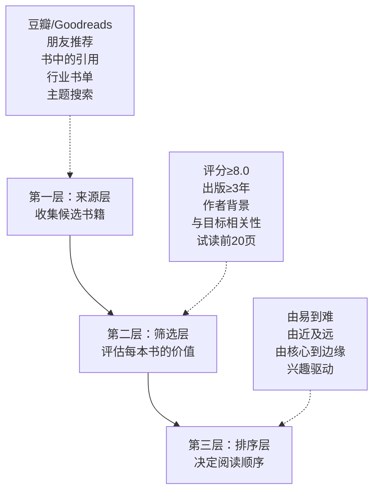
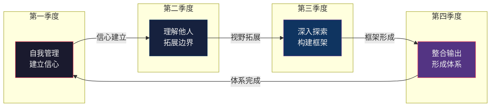
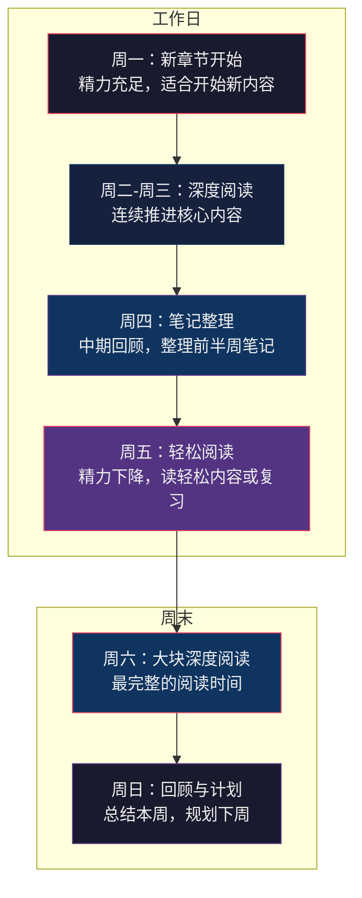
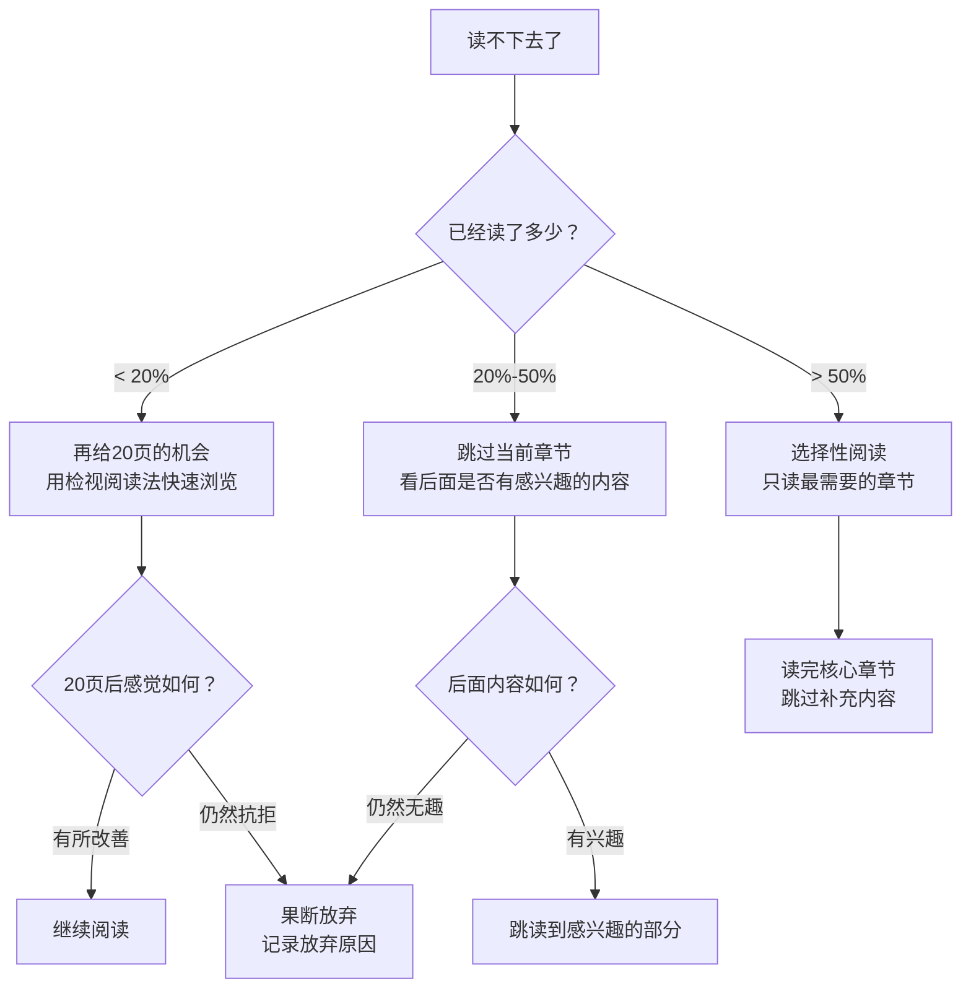
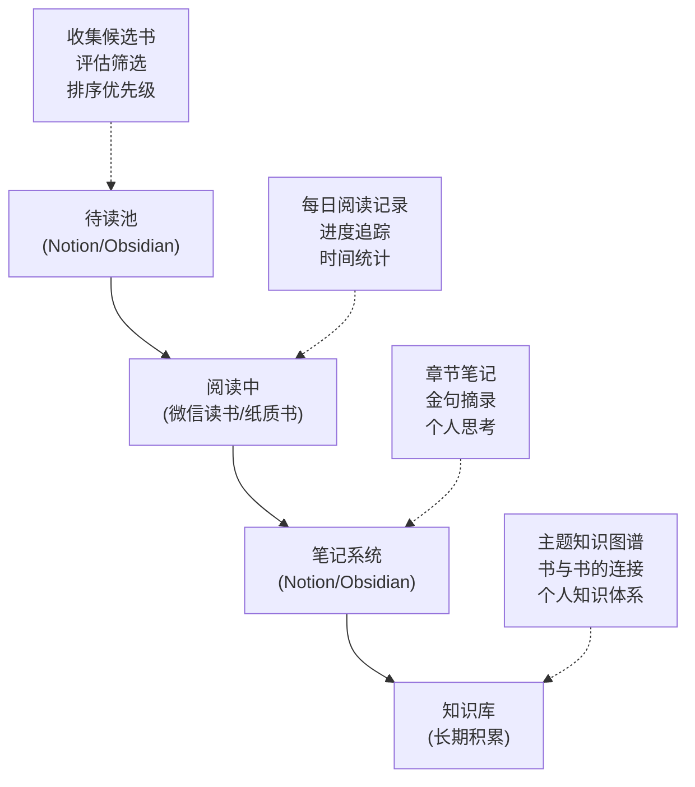

## 第四部分：阅读计划制定

### 一、为什么需要阅读计划

#### 1.1 没有计划的阅读会怎样

大多数人阅读的状态是"随机漫步"——刷到一篇推荐文章就买一本书，读了几页放下，过了几个月又拿起另一本。这种模式有三个致命缺陷：

**缺陷一：选择瘫痪。** 面对书架上未读的书或网上无穷的推荐列表，你花在"决定读什么"上的时间，往往比实际阅读的时间还长。心理学家巴里·施瓦茨在《选择的悖论》中指出，选择过多会导致决策疲劳和满意度下降——你总觉得自己选的不是"最好的那本"，于是一直在选，一直没读。

**缺陷二：知识碎片化。** 今天读一本心理学，明天读一本经济学，后天读一本小说——每本书都是孤立的信息岛屿，无法互相连接。认知科学中的"精细化编码"理论表明，新知识只有与已有知识建立连接，才能真正进入长期记忆。随机阅读破坏了这种连接的可能。

**缺陷三：放弃率居高不下。** 没有计划的人更容易半途而废。行为经济学中的"承诺装置"（Commitment Device）原理说明，提前做出的、具体的、公开的承诺，能显著提高执行率。一份写下来的阅读计划就是你对自己做出的承诺。

#### 1.2 阅读计划的本质：一份知识投资方案

把阅读计划想象成一份投资组合：

- **时间是你的本金**：每天可支配的阅读时间有限，必须分配到回报最高的"标的"上
- **书籍是你的投资标的**：不同书籍的"知识收益率"差异巨大——有的书能改变你的认知框架，有的书只提供零散信息
- **阅读计划是你的投资策略**：决定何时投、投多少、投什么，以及何时止损

好的阅读计划不是让你读得更多，而是让你**用有限的时间获取最大的知识回报**。

#### 1.3 计划与灵活的平衡

阅读计划不是牢笼。它应该像GPS导航——有明确的目的地和路线，但遇到堵车时会自动重新规划。一份好的阅读计划需要同时具备三个特质：

| 特质 | 含义 | 实现方式 |
|------|------|----------|
| 方向性 | 知道自己为什么要读这本书 | 每本书对应一个明确的学习目标 |
| 结构性 | 知道每天/每周读多少 | 将总阅读量分解到可执行的时间单位 |
| 弹性性 | 能够应对计划外的变化 | 预留缓冲时间和替换书目 |

***

### 二、阅读计划的前置工作：认识自己的阅读画像

#### 2.1 评估你的阅读速度

制定计划之前，你需要知道自己的真实阅读速度，而不是凭感觉估算。测试方法如下：

**步骤一：选择测试材料。** 找一本你感兴趣的非虚构类书籍，难度中等（★★★☆☆左右），确保你之前没有读过。

**步骤二：计时阅读。** 设定15分钟计时器，以你正常的速度阅读（不要刻意加快或放慢）。15分钟结束后，标记你读到的位置。

**步骤三：计算速度。** 统计你读了多少页，用页数除以15，得到你的每分钟阅读页数。

阅读速度测试记录表
━━━━━━━━━━━━━━━━━━━
测试日期：____年__月__日
测试书籍：《________________》
书籍难度：★★★☆☆
阅读时长：15分钟
阅读页数：____页
每分钟页数：____页/分钟

速度等级参考（普通32开本，约300字/页）：
├── 初级：0.5-1页/分钟（约150-300字/分钟）
├── 中级：1-2页/分钟（约300-600字/分钟）
├── 良好：2-3页/分钟（约600-900字/分钟）
└── 优秀：3页以上/分钟（900字以上/分钟）

**注意事项：**
- 测试至少进行两次，取平均值，消除偶然因素
- 不同类型的书籍速度差异很大，小说通常比学术书快2-3倍
- 阅读速度会随着练习提升，建议每3个月重新测试一次
- 速度不是目标，理解才是。如果你读得快但记不住，说明速度过快

#### 2.2 盘点你的可用时间

阅读时间不是"找"出来的，而是"分配"出来的。你需要精确地知道自己每天有多少时间可以用于阅读。

**时间审计法（执行一周）：**

连续7天，每天睡前花3分钟记录当天的时间分配。重点关注以下"时间池"：

| 时间段 | 典型时长 | 可阅读性 | 说明 |
|--------|---------|----------|------|
| 通勤时间 | 30-90分钟 | 中 | 适合电子书/有声书，但环境可能嘈杂 |
| 午休时间 | 30-60分钟 | 高 | 安静，精力尚可，适合深度阅读 |
| 等待时间 | 10-30分钟 | 低 | 碎片化，适合轻阅读/复习笔记 |
| 晚间空闲 | 30-120分钟 | 高 | 最大的时间池，适合深度阅读 |
| 早起时间 | 15-30分钟 | 极高 | 精力最好，干扰最少，最推荐 |
| 家务/运动 | 30-60分钟 | 中 | 适合有声书，但需要双手 |

**计算你的每日阅读预算：**

将所有"可阅读性"为中等及以上的时段加总，得到你的理论最大阅读时间。然后乘以0.6（考虑实际执行率），得到你的**实际阅读预算**。

示例计算：
通勤：40分钟 × 0.7（偶尔没座位/太挤）= 28分钟
午休：30分钟 × 0.8（偶尔有聚餐）= 24分钟
晚间：60分钟 × 0.5（经常被其他事占用）= 30分钟
━━━━━━━━━━━━━━━━━━━
理论最大：130分钟
实际预算：130 × 0.6 ≈ 78分钟/天
月度预算：78 × 30 ≈ 2340分钟 ≈ 39小时

#### 2.3 明确你的阅读目标类型

不同的人阅读的目的不同，计划也应该不同。先明确你属于哪种类型（可以是多种的组合）：

**类型A：求知型——为了解决具体问题**

你有明确的问题需要解答：如何管理团队？如何投资理财？如何处理人际关系？你的阅读是"问题驱动"的，每本书都是为了获取特定的知识或技能。

计划特点：书单由问题决定，优先选择实操性强的书，需要做详细笔记和行动计划。

**类型B：成长型——为了提升认知水平**

你没有具体问题，但希望成为一个更有见识、更有深度思考能力的人。你的阅读是"体系驱动"的，目标是构建完整的知识框架。

计划特点：需要跨领域选书，注重经典著作，需要做主题阅读，重视知识之间的连接。

**类型C：享受型——为了阅读本身的乐趣**

你喜欢阅读带来的沉浸感、想象力和情感体验。你的阅读是"体验驱动"的，小说、散文、诗歌是你的主要选择。

计划特点：不需要严格计划，以兴趣为导向，但可以设定"每月一本经典"的底线。

**类型D：职业型——为了职业发展**

你需要不断学习行业知识、专业技能、管理方法。你的阅读是"职业驱动"的，与你的工作直接相关。

计划特点：书单与职业规划挂钩，需要快速提取可应用的知识，笔记侧重行动项。

#### 2.4 确定你的年度阅读量目标

基于前面的速度测试和时间审计，你可以计算出一个实际可行的年度阅读量：

年度阅读量估算公式
━━━━━━━━━━━━━━━━━━━
每日实际阅读预算：____分钟
年阅读天数（扣除休息/出差/生病）：约300天
年度总阅读时间：____分钟

平均书籍页数：____页（建议取300页）
你的阅读速度：____页/分钟
单本书阅读时间：____页 ÷ ____页/分钟 = ____分钟

年度阅读量：年度总阅读时间 ÷ 单本书阅读时间 = ____本

示例：
每日预算：60分钟
年阅读天数：300天
年度总阅读时间：18000分钟 = 300小时
平均书籍：300页
阅读速度：1.5页/分钟
单本书：300 ÷ 1.5 = 200分钟 ≈ 3.3小时
年度阅读量：18000 ÷ 200 = 90本

**重要提醒：** 这个数字是你的"理论上限"，实际执行时打5-7折是正常的。不要用理论上限作为目标——用它乘以0.6得到的数字才是你应该设定的目标。

不同目标对应的阅读节奏：

| 年度目标 | 月度目标 | 每日最低时长 | 适合人群 |
|---------|---------|------------|---------|
| 12本/年 | 1本/月 | 20-30分钟 | 刚开始培养习惯的新手 |
| 24本/年 | 2本/月 | 40-50分钟 | 有一定阅读习惯的读者 |
| 36本/年 | 3本/月 | 60-70分钟 | 稳定的阅读者 |
| 52本/年 | 1本/周 | 90-120分钟 | 高强度阅读者 |
| 100本/年 | 8-9本/月 | 180分钟以上 | 职业读者/全职学习者 |

***

### 三、选书系统：如何构建你的阅读书单

#### 3.1 选书的底层逻辑

选书不是"看到推荐就加购物车"，而是一个系统化的筛选过程。好的选书遵循"三层漏斗"模型：

#### 3.2 选书的五个评估维度

拿到一本候选书后，用以下五个维度评估：

**维度一：作者资质（权重20%）**

作者是否是这个领域的权威？判断标准：
- 有相关的学术背景或实践经验（教授、从业者、研究者）
- 在该领域有其他被认可的作品
- 不是"速成作家"（一年出3本以上不同领域书籍的作者要警惕）
- 有可查证的成果（不是只靠"畅销书作者"这个头衔）

**维度二：内容质量（权重30%）**

快速判断方法：
- 阅读豆瓣/Goodreads上3条好评和3条差评，看差评是否涉及核心内容问题
- 试读目录——目录是否逻辑清晰、覆盖全面
- 试读前20页——语言是否清晰、论证是否扎实
- 查看出版社——优质出版社（如中信、三联、机械工业、人民邮电等）的筛选标准更高

**维度三：与目标的相关性（权重25%）**

这本书能在多大程度上帮助你实现当前的阅读目标？打分标准：
- 5分：直接解决你当前面临的问题
- 4分：提供解决该问题的框架或方法论
- 3分：提供相关背景知识
- 2分：提供间接的启发
- 1分：与当前目标基本无关

**维度四：难度匹配（权重15%）**

书的难度是否适合你当前的阅读水平？评估方法：
- 试读10页，统计你不认识的专业术语数量。超过5个说明难度偏高
- 看每章是否有足够的案例和解释，还是假设读者已有背景知识
- 查看是否有中文原创版本（翻译书的质量受译者影响很大）

**维度五：时间投入产出比（权重10%）**

读完这本书需要多少时间？获得的知识密度如何？
- 300页以内的书通常需要3-6小时
- 500页以上的书需要8-15小时
- 如果一本书的核心观点可以用一篇文章说清楚，考虑读那篇文章代替

#### 3.3 书单的来源渠道

**高质量来源：**

| 来源 | 优势 | 使用方法 |
|------|------|----------|
| 豆瓣读书 | 中文世界最全的书评数据库 | 搜索主题关键词，按评分筛选，阅读长评 |
| Goodreads | 全球最大的读书社区 | 查看年度书单、"Readers Also Enjoyed"推荐 |
| 经典书的参考文献 | 最可靠的书单来源 | 读一本好书，顺藤摸瓜找它引用的书 |
| 大学课程书单 | 经过学术筛选的高质量书单 | 搜索顶尖大学相关课程的syllabus |
| 领域专家推荐 | 有实践检验的推荐 | 关注你尊敬的学者/企业家的阅读清单 |
| 专业书评媒体 | 深度分析和对比 | 纽约时报书评、经济学人书评、上海书评 |

**低质量来源（需要警惕）：**

- 短视频平台的"一分钟荐书"：往往是为了带货，不考虑读者的个体需求
- "XX本必读书单"类文章：通常是拼凑的，没有经过实际阅读验证
- 出版社的营销推荐：存在利益冲突
- 畅销排行榜：反映的是营销能力而非内容质量

#### 3.4 建立你的"待读池"

不要每次读完一本书才开始找下一本。建立一个持续维护的"待读池"，确保你在任何时候都有10-20本经过筛选的候选书。

**待读池管理模板：**

待读池（维护日期：____年__月__日）
━━━━━━━━━━━━━━━━━━━━━━━━━━━━━
【高优先级 - 近期阅读】
1. 《________》 作者：____ 来源：____ 目标：____
2. 《________》 作者：____ 来源：____ 目标：____
3. 《________》 作者：____ 来源：____ 目标：____

【中优先级 - 本季度阅读】
4. 《________》 作者：____ 来源：____
5. 《________》 作者：____ 来源：____
...

【低优先级 - 储备书目】
10. 《________》 作者：____ 来源：____
11. 《________》 作者：____ 来源：____
...

**维护规则：**
- 每读完一本书，从待读池中补充一本新的
- 每月审视一次待读池，移除不再感兴趣的书
- 待读池总数保持在10-20本——太少会导致"断粮"，太多会导致选择瘫痪

***

### 四、年度阅读计划的制定方法

#### 4.1 年度计划的"12本书"模型

"一年读12本书"——每月一本——是一个经过精心平衡的目标。它既具有挑战性（对于没有阅读习惯的人来说），又具有可行性（对于有工作和家庭责任的成年人）。这个目标的核心不是"数量"，而是"深度"。

**为什么是12本？**
- 时间可行性：按每本300页、每天30分钟计算，一个月足够精读一本
- 认知负荷：12个主题/领域，一年内可以建立初步的知识框架
- 心理可行性：12个"完成感"的节点，提供持续的正反馈
- 弹性空间：即使有2-3个月没能完成，全年仍有9-10本的产出

#### 4.2 年度书单的构建原则

**原则一：领域覆盖。** 不要全年只读一个领域的书。知识的价值往往来自不同领域的交叉。建议覆盖6个核心领域，每个领域2本：

| 领域 | 定位 | 典型书目方向 |
|------|------|------------|
| 自我管理 | 基础层 | 习惯、效率、时间管理、目标设定 |
| 思维方法 | 核心层 | 批判性思维、系统思维、决策框架 |
| 心理学 | 理解层 | 认知偏差、动机理论、情绪管理 |
| 商业/经济 | 应用层 | 商业模式、投资理财、经济学原理 |
| 人文通识 | 视野层 | 历史、哲学、科学史、文明演变 |
| 元技能 | 提升层 | 学习方法、阅读方法、写作方法 |

**原则二：难度递进。** 先易后难，从最贴近日常的领域开始，逐步深入。第一季度选择难度较低、实操性强的书，建立信心；第四季度选择需要深度思考的经典。

**原则三：经典与实用兼顾。** 每本书既要是该领域的经典之作，又要有较强的实用价值。纯粹的学术著作留到你已经建立阅读习惯之后。

**原则四：中外结合。** 既有中国作者的本土化视角，也有国际经典的普世智慧。翻译书要注意译者质量——同一本书不同译本的阅读体验可能天差地别。

#### 4.3 年度计划示例：12本书的季度安排

以下是一个经过设计的年度阅读计划示例。它不是唯一的答案，而是展示了选书逻辑如何在实际中应用。

**第一季度（1-3月）：认识自我——建立阅读信心**

| 月份 | 书名 | 作者 | 领域 | 难度 | 选择理由 |
|------|------|------|------|------|----------|
| 1月 | 《高效能人士的七个习惯》 | 史蒂芬·柯维 | 自我管理 | ★★★☆☆ | 经典中的经典，框架清晰，每章独立，适合新年开局 |
| 2月 | 《思考，快与慢》 | 丹尼尔·卡尼曼 | 思维方法 | ★★★★☆ | 诺贝尔奖得主的认知科学经典，帮助理解自己的思维方式 |
| 3月 | 《非暴力沟通》 | 马歇尔·卢森堡 | 沟通表达 | ★★☆☆☆ | 实操性强，读完就能用，提供即时的正反馈 |

**第二季度（4-6月）：理解他人——拓展认知边界**

| 月份 | 书名 | 作者 | 领域 | 难度 | 选择理由 |
|------|------|------|------|------|----------|
| 4月 | 《影响力》 | 罗伯特·西奥迪尼 | 心理学 | ★★★☆☆ | 揭示人类行为的底层逻辑，读完后看世界的方式会改变 |
| 5月 | 《穷查理宝典》 | 查理·芒格 | 商业智慧 | ★★★★☆ | 芒格的多元思维模型，连接心理学、经济学和商业 |
| 6月 | 《学会提问》 | 尼尔·布朗 | 批判性思维 | ★★★☆☆ | 系统学习如何识别论证中的漏洞，是思维的"防身术" |

**第三季度（7-9月）：深入探索——构建知识框架**

| 月份 | 书名 | 作者 | 领域 | 难度 | 选择理由 |
|------|------|------|------|------|----------|
| 7月 | 《被讨厌的勇气》 | 岸见一郎、古贺史健 | 心理学/哲学 | ★★★☆☆ | 阿德勒心理学的对话体入门，关于自我接纳和人际关系 |
| 8月 | 《原则》 | 瑞·达利欧 | 商业/自我管理 | ★★★★☆ | 全球最大对冲基金创始人的决策框架，可直接应用于工作 |
| 9月 | 《人类简史》 | 尤瓦尔·赫拉利 | 人文通识 | ★★★☆☆ | 用全新视角审视人类文明，拓展宏观视野 |

**第四季度（10-12月）：整合输出——形成个人体系**

| 月份 | 书名 | 作者 | 领域 | 难度 | 选择理由 |
|------|------|------|------|------|----------|
| 10月 | 《刻意练习》 | 安德斯·艾利克森 | 学习方法 | ★★★☆☆ | 用科学方法论替代"天赋论"，适用于任何技能的提升 |
| 11月 | 《系统之美》 | 德内拉·梅多斯 | 思维方法 | ★★★★☆ | 系统思维入门经典，帮助理解复杂问题的底层结构 |
| 12月 | 《如何阅读一本书》 | 莫提默·艾德勒 | 元技能 | ★★★★☆ | 阅读方法论的"圣经"，放在年末读是因为你已经积累了足够的阅读经验来理解它 |

**季度节奏的设计逻辑：**

#### 4.4 如何定制你自己的年度计划

上面的示例是一个模板，你需要根据自己的情况进行调整。定制步骤：

**步骤一：确定你的年度阅读主题。** 问自己：今年我最想解决的3个问题是什么？最想提升的3个能力是什么？答案就是你的选书方向。

**步骤二：为每个主题选2-3本候选书。** 使用前面的"选书五维评估法"筛选。

**步骤三：安排阅读顺序。** 遵循以下优先级：
1. 最感兴趣的排在前面（维持动力）
2. 难度低的排在前面（建立信心）
3. 有前置依赖关系的按顺序排（比如先读经济学基础再读投资书）

**步骤四：设置检查点。** 每季度末回顾一次，根据实际执行情况调整下一季度的书单。

***

### 五、月度与周度阅读计划

#### 5.1 月度阅读计划的制定流程

每月开始前，花15分钟制定本月的阅读计划。这15分钟的投入，可以节省你整月的决策时间。

**月度计划制定的四个步骤：**

**步骤一：确定本月阅读书籍。** 从年度计划或待读池中选取本月要读的书。

**步骤二：拆解阅读量。** 将全书页数分配到每周：

月度阅读拆解公式
━━━━━━━━━━━━━━━━━━━
书籍总页数：____页
本月可用周数：4周（扣除出差/旅行周）
每周阅读页数：____页 ÷ 4 = ____页
每周阅读天数：____天
每天阅读页数：____页 ÷ ____天 = ____页
每天阅读时间：____页 ÷ ____页/分钟 = ____分钟

**步骤三：安排阅读策略。** 不同的章节需要不同的阅读策略：

| 章节类型 | 阅读策略 | 时间分配 |
|---------|---------|---------|
| 导论/前言 | 快速浏览，了解全书框架 | 总时间的5% |
| 核心理论章节 | 精读+笔记+复述 | 总时间的40% |
| 案例/故事章节 | 中速阅读，提取关键信息 | 总时间的25% |
| 补充/附录章节 | 略读或跳读 | 总时间的5% |
| 笔记整理与复习 | 回顾+整理+输出 | 总时间的25% |

**步骤四：设定本月阅读问题。** 在开始阅读前，提出2-3个你希望从这本书中找到答案的问题。这些问题会引导你的注意力，让阅读从被动接收变为主动搜索。

#### 5.2 月度阅读计划模板

【月度阅读计划】

本月阅读书籍：____________________
作者：____________________
总页数：____________________
本月阅读问题：
1. ________________________________________
2. ________________________________________
3. ________________________________________

━━━━━━━━━━━━━━━━━━━━━━━━━━━━

第1周：检视阅读 + 前置章节精读
├── Day 1-2：浏览目录、前言、后记，建立全书地图
├── Day 3-4：第1-2章精读
├── Day 5-6：第1-2章笔记整理
└── Day 7：回顾本周内容，提出新问题
页码范围：第____页 到 第____页（共____页）

第2周：核心章节精读（上）
├── Day 1-3：第3-5章精读
├── Day 4-5：关键段落标注与笔记
├── Day 6：尝试复述本周核心观点
└── Day 7：回顾与反思
页码范围：第____页 到 第____页（共____页）

第3周：核心章节精读（下）
├── Day 1-3：第6-8章精读
├── Day 4-5：关键段落标注与笔记
├── Day 6：将本周内容与前两周建立连接
└── Day 7：回顾与反思
页码范围：第____页 到 第____页（共____页）

第4周：总结输出与收尾
├── Day 1-2：剩余章节阅读
├── Day 3-4：全书笔记整合与知识图谱
├── Day 5：撰写书评/读书笔记
├── Day 6：回答月初提出的3个问题
└── Day 7：评估本月阅读质量，调整下月计划
页码范围：第____页 到 第____页（共____页）

━━━━━━━━━━━━━━━━━━━━━━━━━━━━

每日阅读时间：
├── 工作日：____分钟（预计____页）
└── 周末：____分钟（预计____页）

本月阅读重点：
1. ________________________________________
2. ________________________________________
3. ________________________________________

#### 5.3 周度阅读计划：将月计划落地

月计划给你方向，周计划给你执行力。每周日晚上花10分钟，制定下周的阅读安排。

**周计划的核心要素：**

【周度阅读计划】第____周（__月__日 - __月__日）

本周目标：读完第____章到第____章（共____页）
━━━━━━━━━━━━━━━━━━━━━━━━━━━━

周一：第____章（____页）| 时间：____:____ - ____:____
周二：第____章（____页）| 时间：____:____ - ____:____
周三：第____章（____页）| 时间：____:____ - ____:____
周四：笔记整理 + 复习 | 时间：____:____ - ____:____
周五：第____章（____页）| 时间：____:____ - ____:____
周六：深度阅读 + 笔记 | 时间：____:____ - ____:____
周日：本周回顾 + 下周计划 | 时间：____:____ - ____:____

本周关键问题：________________________________________

**周计划的弹性机制：**

不要把7天全部排满。建议只安排5天的阅读任务，留2天作为缓冲。这两天空白日有三个用途：
1. **补课**：如果某天因为意外没能完成阅读，在空白日补上
2. **复习**：用空白日回顾本周读过的内容，巩固记忆
3. **休息**：如果本周任务全部完成，空白日就是奖励——休息也是计划的一部分

***

### 六、阅读节奏与能量管理

#### 6.1 一天中的阅读时间选择

不是所有时间都适合阅读。根据认知科学的研究，人的注意力和认知能力在一天中呈波动状态，遵循"超日节律"（Ultradian Rhythm）——大约每90-120分钟为一个周期，中间有20分钟的低谷。

**最佳阅读时间段排名：**

| 排名 | 时间段 | 精力状态 | 适合的阅读类型 | 推荐度 |
|------|--------|---------|--------------|--------|
| 1 | 早晨起床后1-2小时 | 精力峰值，前额叶最活跃 | 深度阅读、理论学习 | ★★★★★ |
| 2 | 上午10-12点 | 精力充沛，思维清晰 | 分析性阅读、精读 | ★★★★★ |
| 3 | 下午3-5点 | 午后回升期 | 中等难度阅读 | ★★★★☆ |
| 4 | 晚上8-10点 | 精力尚可，干扰较少 | 轻松阅读、小说、散文 | ★★★☆☆ |
| 5 | 午休后 | 精力恢复中 | 轻度阅读、复习笔记 | ★★★☆☆ |
| 6 | 睡前 | 精力低谷，容易犯困 | 不推荐深度阅读 | ★★☆☆☆ |

**关于睡前阅读的特别说明：**

很多人习惯睡前阅读，但需要注意两个问题：
1. 如果你在床上阅读，大脑会建立"床=阅读"的联结，导致你在想睡觉时反而清醒
2. 如果读的是需要思考的内容，大脑会进入兴奋状态，影响入睡

建议：如果一定要睡前读，选择轻松的、不需要深度思考的内容（如小说、散文），并且在阅读结束后做5分钟的放松（如深呼吸）再入睡。

#### 6.2 周阅读节奏的设计

一周7天的阅读安排不应该完全相同。考虑精力波动和生活节奏：

**推荐的周阅读节奏：**

**周末深度阅读的执行方法：**

周末上午（9:00-11:00）是最理想的深度阅读时间。执行方法：

1. **提前准备**：周六晚上就确定明天要读的章节和要解决的问题
2. **环境准备**：准备好水、茶、笔记本，手机调静音放另一个房间
3. **时间分块**：用番茄钟（25分钟阅读 + 5分钟休息）× 4轮 = 2小时
4. **阅读后整理**：花15分钟回顾刚才读的内容，做简要笔记

#### 6.3 月度阅读节奏

一个月的阅读不应是匀速的。考虑到月初的精力充沛和月末的疲劳积累：

**推荐的月度节奏：**

| 时段 | 阅读策略 | 说明 |
|------|---------|------|
| 月初（第1-7天） | 检视阅读 + 开始精读 | 利用月初的新鲜感和精力，快速建立对全书的理解 |
| 月中（第8-21天） | 核心精读 + 笔记 | 最密集的阅读期，处理全书最核心的内容 |
| 月末（第22-28天） | 收尾 + 总结 + 输出 | 完成剩余内容，整理笔记，撰写书评 |
| 月末最后2天 | 回顾 + 规划 | 回顾本月阅读质量，制定下月计划 |

***

### 七、计划的执行、调整与应对

#### 7.1 计划执行的"三日法则"

**如果连续3天没有执行阅读计划，不是你意志力不够，是计划本身有问题。**

三日不读的常见原因和对策：

| 原因 | 诊断方法 | 调整方案 |
|------|---------|---------|
| 时间不够 | 回顾实际日程，找出被占用的时间段 | 减少每日目标，从10分钟重新开始 |
| 书太无聊 | 问自己"翻开书时是否有抗拒感" | 换一本更感兴趣的书，不要有负罪感 |
| 难度太高 | 统计每页查词/查概念的次数 | 降低难度，先读入门书或解读版 |
| 环境干扰 | 记录每次被打断的原因 | 改变阅读时间或地点 |
| 身体疲劳 | 评估睡眠和运动状态 | 先解决睡眠问题，阅读优先级降后 |

#### 7.2 处理"读不下去"的情况

不是每本书都值得读完。但放弃也需要方法，不能随意放弃。

**放弃决策树：**

**放弃后的处理：**
1. 记录你读了多少页，为什么放弃——这是宝贵的选书经验
2. 在豆瓣标记"读过"（标注你读到的位置），写简短的放弃原因
3. 将这本书从待读池中移除
4. 从待读池中选下一本——不要在"选书"上浪费超过1天

#### 7.3 应对计划被打乱的情况

生活中总有意想不到的事情打乱阅读计划：出差、生病、加班、旅行。关键不是"不被打乱"，而是"被打乱后如何快速恢复"。

**恢复策略：**

**情况一：短期中断（1-3天）**
- 不需要调整计划，用空白日补上
- 如果没有空白日，降低接下来几天的每日阅读量，分散补回

**情况二：中期中断（1-2周）**
- 不要试图"补课"——把两周的量压缩到一周只会让你更抗拒
- 直接从当前进度继续，未读的部分标记为"跳过"或留到下月
- 重新评估本月剩余时间，调整目标

**情况三：长期中断（1个月以上）**
- 不要试图回忆"之前读到哪里了"——直接从最近一章的开头重新开始
- 如果已经忘了太多前文，用30分钟快速回顾之前的笔记
- 重新制定接下来的月度计划，不要背负"欠债"的心理压力

#### 7.4 计划的定期复盘

**月度复盘模板（每月最后一天，15分钟）：**

【月度阅读复盘】____月

1. 本月计划完成情况：
   ├── 计划阅读：《________》____页
   ├── 实际阅读：____页（完成率：____%）
   └── 偏差原因：________________________

2. 阅读质量评估（1-5分）：
   ├── 理解程度：____分
   ├── 笔记质量：____分
   ├── 知识应用：____分
   └── 阅读体验：____分

3. 本月最大收获：
   ________________________________________________

4. 本月最大困难：
   ________________________________________________

5. 下月调整计划：
   ├── 阅读量调整：____（增加/减少/维持）
   ├── 时间安排调整：________________________
   └── 选书策略调整：________________________

**季度复盘（每季度末，30分钟）：**

回顾过去3个月的月度复盘，问自己：
- 我的阅读速度是否有所提升？
- 我的阅读习惯是否更加稳定？
- 我是否在按计划覆盖目标领域？
- 我的知识体系是否有明显增长？
- 下一季度的书单是否需要调整？

***

### 八、阅读计划的进阶策略

#### 8.1 并行阅读策略

大多数人一次只读一本书，但"并行阅读"（同时读2-3本）有独特的优势：

**并行阅读的好处：**
- 不同场景读不同的书（通勤读轻松的，周末读深度的）
- 阅读疲劳时可以切换，保持新鲜感
- 不同领域的知识可以互相激发联想

**并行阅读的规则：**
- 最多同时读3本——超过3本会导致注意力分散
- 不同书的难度和类型要有差异（如：1本深度非虚构 + 1本轻松非虚构 + 1本小说）
- 每本书每周至少读一次——否则会遗忘前文
- 用不同的物理位置或阅读工具区分（如：纸质书放床头，电子书放通勤手机）

**并行阅读的节奏示例：**

| 时间段 | 书A（深度非虚构） | 书B（轻松非虚构） | 书C（小说） |
|--------|-----------------|-----------------|------------|
| 工作日早晨 | ✓ 30分钟 | | |
| 工作日通勤 | | ✓ 20分钟 | |
| 工作日晚上 | | | ✓ 20分钟 |
| 周末上午 | ✓ 60分钟 | | |
| 周末晚上 | | | ✓ 30分钟 |

#### 8.2 主题阅读计划

当你对某个领域有深入学习的需求时，可以制定"主题阅读计划"——在2-3个月内集中阅读同一个主题的5-8本书。

**主题阅读计划的制定步骤：**

**第一步：定义主题（1天）**
- 主题要具体：不是"心理学"，而是"如何提升决策质量"
- 写下你希望回答的3-5个核心问题

**第二步：建立书单（2-3天）**
- 搜索并筛选5-8本相关书籍
- 按照从入门到深入的顺序排列
- 包含至少1本该领域的经典和1本最新出版的书

**第三步：制定阅读顺序**

主题阅读的推荐顺序：
━━━━━━━━━━━━━━━━━━━
第1本：入门/概论（建立领域地图）
第2本：经典（理解核心理论）
第3-4本：不同视角（对比不同观点）
第5-6本：应用/案例（将理论落地）
第7本：最新研究（了解前沿动态）
第8本：元认知（反思这个领域的局限性）

**第四步：建立统一的笔记框架**
- 在开始阅读前，建立一个主题笔记模板
- 每本书读完后，将核心观点填入模板的对应位置
- 读完所有书后，整合模板形成主题知识图谱

#### 8.3 阅读与输出的闭环

阅读的最终目的不是"读完"，而是"用上"。将阅读计划与输出计划结合：

**输出形式与频率：**

| 输出形式 | 频率 | 时间投入 | 价值 |
|---------|------|---------|------|
| 每日阅读笔记 | 每天 | 5-10分钟 | 巩固当日所学 |
| 章节总结 | 每章 | 15-20分钟 | 梳理章节逻辑 |
| 书评/读书笔记 | 每本书 | 30-60分钟 | 形成个人见解 |
| 主题文章 | 每季度 | 2-3小时 | 构建知识体系 |
| 分享/讨论 | 不定期 | 30-60分钟 | 通过教授来学习 |

**"费曼学习法"在阅读中的应用：**

理查德·费曼说："如果你不能用简单的语言解释一个概念，说明你还没有真正理解它。"将这个方法应用到阅读中：

1. 读完一章后，合上书
2. 假装你在向一个完全不懂这个领域的朋友解释这一章的内容
3. 用最简单的语言，不用任何专业术语
4. 如果你在某个地方卡住了，说明你还没有真正理解——回去重读

***

### 九、阅读计划制定的常见误区

#### 误区一：目标定得太高

**典型表现：** "我要一年读100本书"、"每天至少读1小时"

**问题分析：** 过高的目标会导致两个后果——要么你因为完不成而自责放弃，要么你为了完成目标而牺牲阅读质量（翻完就算"读过"）。

**纠正方法：** 用前面的公式计算你的实际阅读预算，取60%作为目标。完成目标后可以追加，但底线目标必须是轻松可达的。

#### 误区二：只追求数量，忽视质量

**典型表现：** 在豆瓣标记了50本"读过"，但问起任何一本的核心观点都说不清楚。

**问题分析：** 阅读的价值不在于"读过多少本"，而在于"吸收了多少"。一本精读并做了详细笔记的书，比10本翻完就忘的书价值高100倍。

**纠正方法：** 每本书读完后，用以下标准自测——
- 能否用3句话概括这本书的核心观点？
- 能否说出书中对你最有启发的3个具体点？
- 这本书是否改变了你的某个认知或行为？

如果三个问题中有两个答不上来，说明阅读质量不够。

#### 误区三：计划过于死板

**典型表现：** 每天必须读30分钟，少一分钟都觉得"今天失败了"。

**问题分析：** 过于严格的计划会将阅读从"享受"变成"任务"，从"内在驱动"变成"外在压力"。

**纠正方法：** 计划要有弹性——设定"底线目标"和"理想目标"。底线目标是你无论如何都要完成的最低标准（如每天10分钟），理想目标是你精力充沛时希望达到的标准（如每天45分钟）。

#### 误区四：忽视阅读的"消化时间"

**典型表现：** 读完一本立刻开始下一本，不留任何间隔。

**问题分析：** 认知科学中的"间隔效应"表明，学习后的间隔复习比连续学习更有效。读完一本书后，你需要时间让知识"沉淀"——与已有知识建立连接，形成个人见解。

**纠正方法：** 每读完一本书，留出1-2天的"消化期"。这段时间用来：
- 回顾全书笔记
- 写书评或读书笔记
- 思考这本书与你之前读过的书有什么联系
- 确定这本书的哪些内容可以立即应用

#### 误区五：照搬别人的书单

**典型表现：** 直接使用某个名人推荐的书单，不考虑自己的需求和水平。

**问题分析：** 每个人的知识背景、阅读水平、生活需求都不同。名人推荐的书单反映的是他们的需求，不是你的。而且，很多名人书单是为了营销目的而编排的，未必反映他们真正的阅读习惯。

**纠正方法：** 参考别人的书单，但用自己的"选书五维评估法"重新筛选。一本书是否适合你，取决于三个条件：
1. 它与你当前的目标相关
2. 它的难度适合你当前的水平
3. 它的风格能让你读下去

#### 误区六：忽略翻译书的译本质量

**典型表现：** 随便买一个译本，读起来晦涩难懂，以为是原书的问题。

**问题分析：** 翻译书的质量高度依赖译者。同一本书的不同译本，阅读体验可能天差地别。一本翻译质量差的书会让你误以为原书不好，从而放弃一本本该对你有巨大价值的经典。

**纠正方法：**
- 在豆瓣搜索该书的不同译本，比较评分和评论
- 优先选择知名出版社（中信、三联、商务、人民邮电等）的译本
- 如果英文阅读能力允许，考虑读英文原版
- 在购买前试读前10页，感受翻译是否流畅

***

### 十、不同生活阶段的阅读计划调整

#### 10.1 职场新人（工作1-3年）

**特点：** 时间相对充裕，但知识储备有限，需要快速建立专业基础。

**计划建议：**
- 年度目标：18-24本
- 重点领域：职业技能（40%）、沟通表达（20%）、思维方法（20%）、人文通识（20%）
- 阅读策略：以实用为主，每本书都要提炼出可执行的行动项
- 特别建议：读1-2本关于你所在行业的经典著作，建立行业认知框架

#### 10.2 中层管理者（工作5-10年）

**特点：** 工作繁忙，时间碎片化，需要兼顾管理能力和专业深度。

**计划建议：**
- 年度目标：12-18本
- 重点领域：管理/领导力（30%）、商业智慧（25%）、心理学（20%）、人文通识（25%）
- 阅读策略：善用通勤时间听有声书，周末集中深度阅读
- 特别建议：每季度做一次主题阅读，围绕一个管理主题深入研究

#### 10.3 新手父母

**特点：** 时间极度碎片化，精力有限，但有强烈的成长需求。

**计划建议：**
- 年度目标：8-12本（不要给自己压力）
- 重点领域：育儿/教育（30%）、自我管理（30%）、心理学（20%）、轻松阅读（20%）
- 阅读策略：利用喂奶、哄睡等"身体被占用但大脑空闲"的时间听有声书
- 特别建议：降低标准，每天能读10分钟就是胜利

#### 10.4 自由职业者/创业者

**特点：** 时间灵活但边界模糊，容易被工作吞噬所有时间。

**计划建议：**
- 年度目标：24-36本
- 重点领域：商业模式（30%）、思维方法（25%）、行业知识（25%）、人文通识（20%）
- 阅读策略：将阅读时间固定在日程中，像对待工作会议一样不可取消
- 特别建议：每周至少有1次"无目的阅读"——读一些与工作无关的书，保持思维的开放性

***

### 十一、数字工具与阅读管理系统

#### 11.1 阅读管理工具对比

| 工具 | 书单管理 | 阅读记录 | 笔记导出 | 社交功能 | 推荐场景 |
|------|---------|---------|---------|---------|---------|
| 豆瓣读书 | ★★★★★ | ★★★★☆ | ★★☆☆☆ | ★★★★★ | 中文书为主，社交发现好书 |
| 微信读书 | ★★★★☆ | ★★★★★ | ★★★★☆ | ★★★☆☆ | 电子书阅读，笔记管理 |
| Notion | ★★★★★ | ★★★★★ | ★★★★★ | ★☆☆☆☆ | 自定义程度高，适合系统化管理 |
| Obsidian | ★★★★☆ | ★★★★★ | ★★★★★ | ★☆☆☆☆ | 双向链接，构建知识网络 |
| Readwise | ★★★☆☆ | ★★★★★ | ★★★★★ | ★★☆☆☆ | 自动同步高亮，间隔复习 |
| 滴墨书摘 | ★★★☆☆ | ★★★★☆ | ★★★★☆ | ★★★☆☆ | 纸质书摘录管理 |

#### 11.2 推荐的阅读管理系统架构

**系统的三个核心原则：**
1. **统一入口**：所有书籍信息汇总到一个系统中，避免信息分散
2. **自动记录**：尽可能使用自动记录功能（如微信读书的阅读时长统计），减少手动输入
3. **定期回顾**：每月末花15分钟更新系统，清理不再感兴趣的书，补充新发现的书

***

### 十二、阅读计划制定的核心要义

制定阅读计划的本质，是将"我想多读书"这个模糊的愿望，转化为"每天早上7:00-7:30，在书桌前，读《思考，快与慢》第3章，带着'系统1和系统2如何影响决策'这个问题"这个具体的行动。

好的阅读计划有三个特征：

**第一，它是个性化的。** 没有放之四海而皆准的阅读计划。你的计划必须基于你的阅读速度、可用时间、知识需求和兴趣偏好。照搬别人的计划，就像穿别人的鞋——尺码不对，走不远。

**第二，它是有弹性的。** 计划不是牢笼。它应该给你方向感，同时允许你在路上做出调整。如果一本书让你痛苦不堪，换掉它。如果某个月特别忙，减少阅读量。计划是为你服务的工具，不是你需要服务的主人。

**第三，它是可迭代的。** 你的第一份阅读计划一定不完美。没关系。执行一个月后复盘，调整，再执行，再复盘。每一次迭代都让你的计划更接近"最适合你"的版本。

最后，记住一个简单的真理：**最好的阅读计划，是你真正会执行的那个。** 一份写得天花乱坠但从不执行的计划，不如一份写在便签纸上但每天都在执行的计划。从今天开始，从10分钟开始，从你最想读的那本书开始。

***
