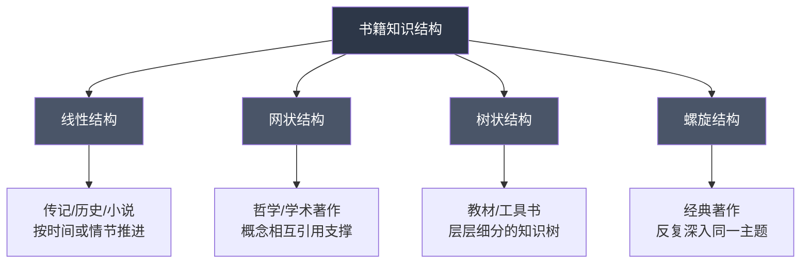
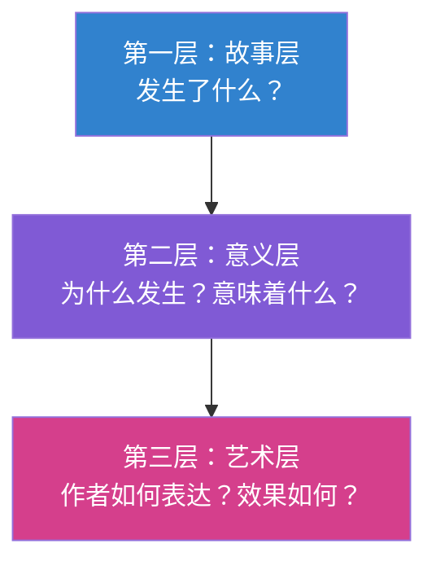
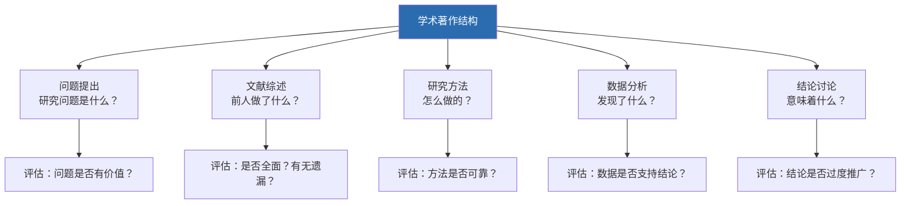
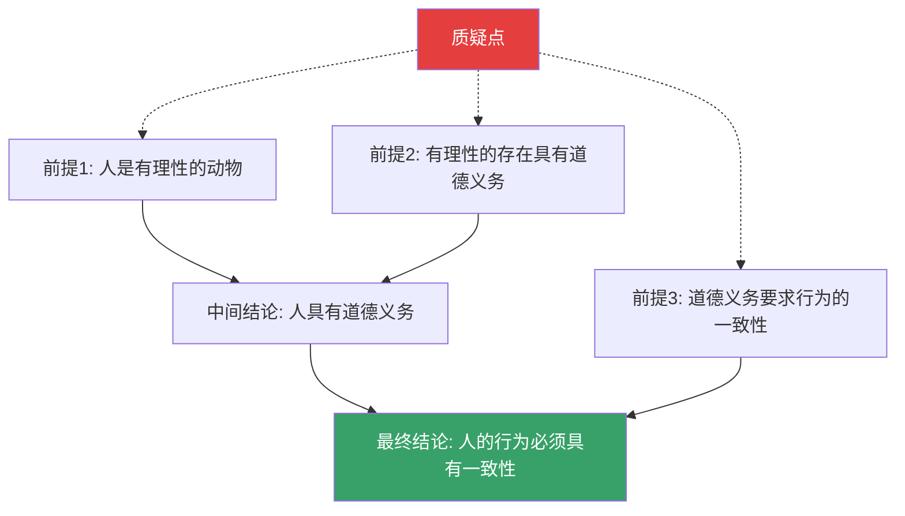
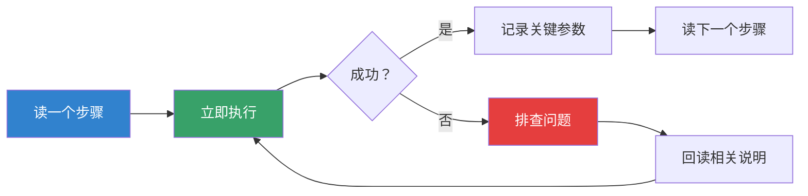
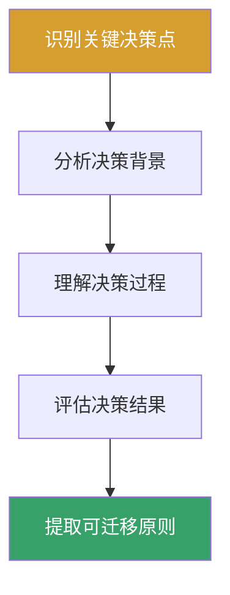
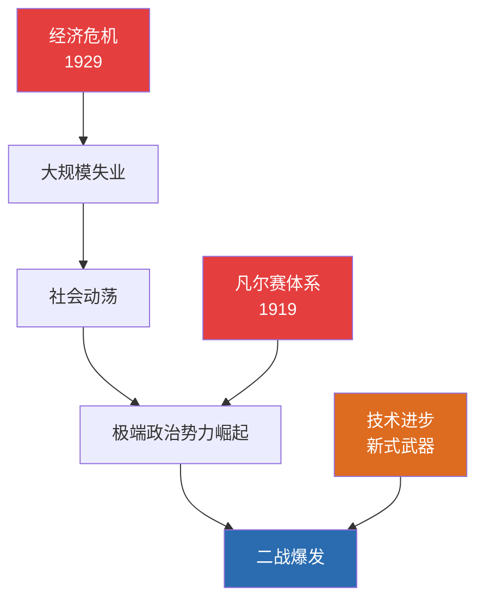
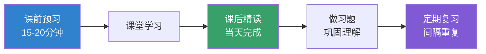

## 第五部分：不同类型书籍阅读方法

不同类型的书籍有着截然不同的知识结构、叙事逻辑和阅读目标。用同一种方法阅读所有书籍，就像用同一把钥匙开所有的锁——要么打不开，要么效率极低。本部分将系统讲解**十种常见书籍类型**的专属阅读策略，从底层原理到实操步骤，帮助你在每种阅读场景中都能找到最优解。

### 一、为什么需要分类型阅读？

#### 1.1 不同书籍的知识结构差异

书籍的类型决定了其信息组织方式。理解这一点，是选择正确阅读策略的前提。



| 结构类型 | 代表书籍 | 阅读重点 | 核心策略 |
|---------|---------|---------|---------|
| 线性结构 | 小说、传记、历史书 | 跟随叙事线索，理解因果 | 沉浸式顺序阅读 |
| 网状结构 | 哲学、学术论文集 | 理解概念间的关系网络 | 交叉参照、概念图谱 |
| 树状结构 | 教材、技术手册 | 掌握知识层级和分支 | 自顶向下、按需深入 |
| 螺旋结构 | 经典著作、宗教文本 | 每次阅读获得新层次理解 | 多轮精读、批注积累 |

#### 1.2 阅读目标与阅读方法的匹配

同一种书籍在不同阅读目标下，也需要采用不同策略：

| 阅读目标 | 方法选择 | 适用场景 |
|---------|---------|---------|
| 获取信息 | 检视阅读 + 选择性精读 | 追踪行业动态、了解新领域 |
| 理解原理 | 分析阅读 + 结构化笔记 | 学习核心学科、掌握方法论 |
| 求得启发 | 主题阅读 + 批判性思考 | 研究型课题、深度思考 |
| 享受体验 | 沉浸式阅读 + 零干扰 | 文学欣赏、休闲阅读 |
| 解决问题 | 目标导向 + 实操验证 | 工具书、教程、指南 |

### 二、非虚构类书籍（商业/心理/科学/通识）

非虚构类书籍是最常见的阅读对象，涵盖商业管理、心理学、科普、社会学等领域。这类书籍的核心特征是**以论点驱动**——作者提出一个或多个核心观点，然后用案例、数据和逻辑进行论证。

#### 2.1 结构特征分析

典型的非虚构类书籍遵循以下结构：


许多非虚构类书籍存在一个普遍问题：**核心论点用30页就能讲清楚，但为了凑成一本书的体量，作者会用大量案例和故事来填充**。识别这一点，是高效阅读的关键。

#### 2.2 四步阅读法

**第一步：侦察阶段（15-20分钟）**

在正式阅读前，快速获取全书的"地图"：

1. 读书名和副标题——副标题通常比书名更直接地说明了核心论点
2. 读目录——画出全书的逻辑结构图
3. 读前言/序言——作者通常在这里说明写书动机和核心观点
4. 随机翻阅3-5个章节的开头和结尾——获取各章核心信息
5. 读最后一章或结论部分——了解作者的最终结论

完成侦察后，你应该能回答三个问题：这本书在讲什么？作者的核心论点是什么？哪些章节对我最有价值？

**第二步：战略性精读（核心章节）**

根据侦察结果，对与你阅读目标最相关的2-3个章节进行精读：

- 逐段阅读，标记论点和论据
- 在页边空白处用自己的话概括每段的核心意思
- 遇到重要论据时，标记"★"
- 遇到质疑时，标记"？"
- 遇到与已有知识产生连接时，标记"↔"

**第三步：速读与跳读（非核心章节）**

对于非核心章节：

- 只读每段的第一句话（主题句通常在段首）
- 关注标题、粗体字、图表
- 跳过冗长的案例故事，只看作者从中得出的结论
- 遇到"总之""因此""所以"等总结性词语时放慢速度

**第四步：结构化输出**

读完后必须进行输出，否则24小时后遗忘率超过70%：

```markdown
## 《书名》读书笔记

### 核心论点（一句话概括）
[用一句话概括作者最想表达的观点]

### 关键概念（3-5个）
1. [概念名]：[用自己的话解释]
2. ...

### 论证逻辑
[用流程图或大纲展示作者的论证结构]

### 我的评价
- 同意的部分：[为什么]
- 质疑的部分：[为什么]
- 可以应用到生活中的：[具体场景]

### 行动计划
1. [具体可执行的行动]
2. ...
```

#### 2.3 常见误区

| 误区 | 问题 | 纠正方法 |
|------|------|---------|
| 逐字逐句通读 | 效率极低，信息过载 | 先侦察，再战略性分配精力 |
| 只划线不做笔记 | 被动标记，记忆留存率低 | 用自己的话重述，主动加工信息 |
| 追求读完所有内容 | 非核心章节浪费大量时间 | 80/20法则，聚焦最有价值的20% |
| 读完不做输出 | 一周后几乎全部遗忘 | 读完当天完成结构化笔记 |
| 对所有案例全盘接受 | 案例可能存在幸存者偏差 | 用"反例思维"检验论点的普适性 |

#### 2.4 进阶技巧：判断非虚构类书籍的质量

不是所有非虚构类书籍都值得精读。在侦察阶段，用以下标准快速判断：

- **论据质量**：作者引用的是原始研究还是二手转述？数据来源是否可追溯？
- **论证逻辑**：是否存在以偏概全、因果倒置、诉诸权威等逻辑谬误？
- **时效性**：核心观点在出版后是否已被新的研究推翻或修正？
- **原创性**：是原创研究还是对已有观点的重新包装？
- **实操性**：作者的建议是否具体、可执行，还是只停留在"要努力""要坚持"的层面？

如果一本书在侦察阶段就暴露出多个质量问题，果断放弃精读，把时间投入到更高质量的书籍中。

### 三、文学作品（小说/散文/诗歌）

文学作品的阅读目标与非虚构类书籍完全不同。你不是为了"获取信息"而读，而是为了**体验语言艺术、理解人性复杂性、获得审美愉悦**。这意味着阅读方法需要根本性的调整。

#### 3.1 文学阅读的三个层次



| 层次 | 关注焦点 | 提问示例 |
|------|---------|---------|
| 故事层 | 情节、人物、时间线 | "接下来发生了什么？""这个人物做了什么选择？" |
| 意义层 | 主题、象征、隐喻 | "这个场景象征着什么？""作者想通过这个故事表达什么？" |
| 艺术层 | 叙事技巧、语言风格、结构设计 | "为什么作者选择这个视角？""这段描写的节奏感如何？" |

初读者通常停留在第一层，有经验的读者能进入第二层，而真正深入的阅读需要触及第三层。

#### 3.2 沉浸式阅读的核心原则

**原则一：尊重作者的节奏**

文学作品（尤其是小说）的节奏是作者精心设计的。快速阅读会破坏这种节奏，就像快进看一部电影。建议的阅读速度是**每分钟200-300字**——比非虚构类书籍慢30%-50%。

**原则二：允许"不懂"**

优秀的文学作品往往有多义性。卡夫卡的《变形记》到底在讲什么？一百个读者有一百种理解。不要急于找到"标准答案"，不确定的感受本身就有价值。

**原则三：在脑海中"放映电影"**

阅读小说时，尝试在脑海中构建场景：人物长什么样？房间是什么布局？对话时的表情和语气是怎样的？这种"心象化"（visualization）能显著增强阅读体验和记忆深度。

**原则四：关注"反常"之处**

当作者做出反常的叙事选择时——一个本应悲伤的场景却用轻快的笔调描写，一个本应正面的人物却做出令人不安的举动——这通常是有意为之。停下来思考：作者为什么要这样写？

#### 3.3 不同文学体裁的细分策略

**长篇小说**

长篇小说的核心挑战是信息量大、人物众多、情节线交织。

- 第一遍：沉浸式通读，不打断阅读流。遇到不理解的地方先标记，不要停下来查资料。目标是完整体验故事。
- 第二遍（可选）：分析式重读。关注第一次阅读时忽略的细节、伏笔和象征。
- 阅读工具：准备一张人物关系图。每出现新人物时添加，标注明关系。对于《百年孤独》《红楼梦》这类人物众多的作品，这是必需品。
- 阅读节奏：每天固定时间阅读，保持连续性。中断超过一周，再拾起来时需要重新进入情境，损耗很大。

**短篇小说/散文**

短篇小说的特征是"少即是多"——每一个词都有其存在的理由。

- 阅读速度应更慢，逐句品味
- 特别关注开头第一段和结尾最后一段——短篇小说的精华往往集中在这里
- 读完后尝试用一句话概括"这个故事在讲什么"——如果做不到，说明还有未理解的层次
- 适合做精细的文本分析练习

**诗歌**

诗歌是语言的极致压缩——用最少的词传递最丰富的意涵。

- 朗读出声：诗歌的节奏、韵律和音乐性只有在朗读时才能充分感受
- 逐行分析：每个词的选择都不是偶然的。为什么诗人用"苍白"而不是"白色"？为什么用"坠落"而不是"掉落"？
- 多次阅读：同一首诗在不同心境下阅读，会有完全不同的感受
- 了解创作背景：诗歌的情感往往与诗人的经历密切相关
- 不要试图"翻译"成散文：诗歌的价值恰恰在于它的模糊性和多义性，将其"翻译"成日常语言会丧失大部分美感

#### 3.4 文学阅读笔记模板

```markdown
## 《书名》阅读笔记

### 基本信息
- 作者：[国籍/时代/流派]
- 首版年份：
- 体裁：[长篇小说/短篇集/散文/诗歌]

### 第一印象
[读完后的直觉感受，不要分析，记录情绪反应]

### 故事梗概
[200字以内概括核心情节，避免流水账]

### 核心主题
1. [主题1]：[在书中如何体现]
2. [主题2]：[在书中如何体现]

### 印象最深的场景/段落
- [页码/章节]：[摘录原文] —— [为什么印象深刻]

### 人物分析
| 人物 | 核心特质 | 转变弧线 | 象征意义 |
|------|---------|---------|---------|
| ... | ... | ... | ... |

### 写作技巧亮点
[叙事视角、语言风格、结构设计等值得学习的地方]

### 与我的关联
[这本书让我想到了自己的什么经历/感受/思考]

### 推荐指数与推荐理由
⭐⭐⭐⭐ (1-5星)：[理由]
```

#### 3.5 常见误区

| 误区 | 问题 | 纠正 |
|------|------|------|
| 追求"读懂"标准答案 | 文学的意义是开放的 | 接受多义性，尊重自己的理解 |
| 只关注情节 | 错过语言和技巧之美 | 放慢速度，品味文字本身 |
| 跳过描写只看对话 | 失去氛围和深层信息 | 描写往往承载着关键的象征意义 |
| 用非虚构的方法读文学 | 追求"效率"会毁掉阅读体验 | 文学阅读的目标是深度体验，不是信息提取 |
| 读完不做任何记录 | 感受很快消散 | 至少记录"第一印象"和"最深感触" |

### 四、学术著作与论文集

学术著作（包括学术专著、论文集、研究报告）的特征是**严谨的研究方法、密集的信息量和复杂的论证结构**。阅读这类书籍需要特殊的方法论。

#### 4.1 学术著作的结构解剖



#### 4.2 三轮阅读法

**第一轮：快速扫描（20-30分钟）**

目标：判断这篇文献是否值得深入阅读。

1. 读标题和摘要——了解研究问题和核心发现
2. 读引言的最后一段——通常包含研究目的和假设
3. 看图表和表格——数据的可视化呈现能快速传递核心信息
4. 读结论/讨论部分——了解作者对自身研究的评价
5. 扫一眼参考文献——判断引用质量和研究基础

这一轮结束后，你应该能判断：这篇文章值得精读（与我的研究高度相关）、略读（有参考价值但非核心）、还是跳过（不相关）。

**第二轮：批判性精读（1-2小时）**

目标：理解研究的完整逻辑链。

带着以下问题逐节阅读：

| 章节 | 核心问题 |
|------|---------|
| 引言 | 研究空白（gap）在哪里？作者如何论证这个空白值得填补？ |
| 文献综述 | 覆盖是否全面？是否遗漏了重要文献？综述的逻辑结构是什么？ |
| 方法 | 样本量是否足够？变量控制是否合理？是否有可重复性？ |
| 结果 | 统计方法是否恰当？效应量（effect size）是否有实际意义？ |
| 讨论 | 结论是否被数据充分支持？是否过度推广？局限性是否诚实承认？ |

**第三轮：整合性阅读**

目标：将这篇文章放入更大的知识网络中。

- 与同主题的其他研究对比：结论一致还是矛盾？
- 找出研究之间的"缝隙"——哪些问题还没有被回答？
- 评估对自己研究/工作的实际参考价值

#### 4.3 学术阅读笔记模板

```markdown
## 论文/著作笔记

### 引用信息
- 作者：
- 年份：
- 期刊/出版社：

### 一句话摘要
[用一句话概括核心发现]

### 研究问题
[具体的研究问题或假设]

### 方法概述
- 研究类型：[实验/调查/案例/元分析]
- 样本：[N=?, 特征]
- 关键变量：[自变量/因变量/控制变量]

### 核心发现
1. [发现1]
2. [发现2]

### 方法论评价
- 优势：[...]
- 局限：[...]

### 对我的启发
[如何应用到我的研究/工作中]

### 相关文献追踪
[从参考文献中选出的待读文献列表]
```

#### 4.4 批判性阅读的具体技巧

学术阅读不是被动接受，而是与作者进行"对话"。以下是培养批判性思维的具体方法：

**质疑数据呈现方式**

- 作者是否选择了对自己论点最有利的统计指标？
- 图表的Y轴是否从零开始？是否存在视觉误导？
- 相关性是否被暗示为因果性？

**检验逻辑链**

- 前提是否成立？
- 推理过程是否有跳跃？
- 结论是否是唯一可能的解释，还是存在替代解释？

**评估可推广性**

- 样本是否具有代表性？
- 实验条件是否能推广到真实场景？
- 文化背景是否限制了结论的适用范围？

### 五、哲学著作

哲学著作的阅读难度在于其**抽象性、系统性和历史语境依赖性**。一本哲学著作不是一个独立的文本，而是一场跨越世纪的思想对话的一部分。

#### 5.1 哲学阅读的独特挑战

| 挑战 | 具体表现 | 应对策略 |
|------|---------|---------|
| 概念抽象 | "存在""本体""先验"等概念无法直接感知 | 从具体例子入手理解抽象概念 |
| 术语体系 | 每位哲学家都有自己的术语系统 | 建立个人术语表，记录每位哲学家对同一概念的特殊用法 |
| 历史语境 | 很多论点是针对特定时代的问题 | 先了解时代背景再进入文本 |
| 论证密度 | 一段话可能包含多层推理 | 拆解论证结构，逐层分析 |
| 翻译损耗 | 中译本可能丢失原文的细微差别 | 重要段落对照原文阅读 |

#### 5.2 三层准备法

在打开一本哲学原著之前，需要做好三个层次的准备：

**第一层：背景知识准备**

- 阅读该哲学家的传记或简介（30分钟足够）
- 了解该哲学流派的基本立场和发展脉络
- 阅读一篇关于这本书的书评或导读文章

**第二层：概念工具准备**

- 了解该哲学家使用的核心术语的含义
- 如果涉及逻辑推理，复习基本的逻辑学概念（演绎、归纳、三段论）
- 如果涉及其他哲学家的观点，至少了解其基本主张

**第三层：阅读心态准备**

- 接受"读不懂"是正常的——哲学著作需要反复阅读
- 准备好与作者"辩论"——哲学阅读的本质是思想对话
- 放弃"快速读完"的期望——一章读一周是合理的节奏

#### 5.3 概念笔记法

哲学阅读最核心的工具是**概念笔记**——记录每位哲学家对关键概念的定义和用法。

```markdown
## 概念笔记：存在（Being）

### 亚里士多德
- 希腊语：τὸ ὄν
- 定义：存在是最基本的范畴，一切事物都"存在"
- 区分：实体存在 vs 属性存在
- 关联概念：实体（ousia）、潜能与现实

### 海德格尔
- 德语：Sein
- 核心主张：西方哲学遗忘了"存在的意义"问题
- 区分：存在（Sein）vs 存在者（Seiendes）
- 方法：通过此在（Dasein）追问存在

### 萨特
- 法语：être
- 核心主张：存在先于本质
- 区分：自在存在（être-en-soi）vs 自为存在（être-pour-soi）
```

#### 5.4 哲学论证的拆解方法

面对一段复杂的哲学论证，按以下步骤拆解：

1. **找出结论**：作者最终想证明什么？
2. **找出前提**：作者基于哪些假设或已知条件？
3. **画出推理链**：从前提到结论经过了哪些中间步骤？
4. **检验每一步**：每一步推理是否有效？是否有隐藏的假设？
5. **寻找反例**：是否存在反例可以推翻这个论证？

这个过程可以用以下结构表示：



#### 5.5 常见误区

| 误区 | 纠正 |
|------|------|
| 跳过导读直接读原著 | 对初学者来说，导读是必要的脚手架 |
| 试图一次"读懂" | 哲学著作至少需要读三遍才能初步理解 |
| 只读一本不读对话者 | 哲学是对话，必须了解对立观点 |
| 脱离语境理解概念 | "自由"在康德和萨特那里的含义完全不同 |
| 过度依赖二手解读 | 二手解读是辅助，不能替代原著阅读 |

### 六、实用工具书（技术手册/教程/指南）

实用工具书的目标是**帮助你学会做某件事**。这类书籍的阅读策略应该完全以"行动"为中心，而不是以"理解"为中心。

#### 6.1 核心原则：边读边做

工具书的最大陷阱是"读完了但不会用"。解决这个问题的方法只有一个：**在阅读的同时进行实操**。



#### 6.2 分场景阅读策略

**技术教程（编程/软件/系统）**

- 搭建好开发环境后再开始阅读——不要在"准备阶段"就耗尽热情
- 对于代码示例：先自己尝试写，再看参考答案
- 遇到错误时，不要立刻看答案，先尝试自己排查（这是最好的学习机会）
- 完成教程后，尝试用学到的技术做一个自己的小项目——教程的终点才是真正的学习起点

**操作手册（设备/工具/系统）**

- 不需要从头到尾阅读，只在需要时查阅
- 重点关注"注意事项"和"常见问题"部分
- 对于关键操作，手写一份简化的操作清单（Cheat Sheet），贴在工作区
- 定期检查更新——操作手册可能随版本更新而变化

**方法论指南（管理/效率/健康）**

- 阅读前明确自己的具体问题——不是"提高效率"，而是"每天早起后的前两小时总是浪费"
- 不要试图同时实施所有建议——选择1-2个最相关的开始
- 设定实验周期：执行新方法2-4周后评估效果
- 记录"实验日志"：执行了什么、效果如何、遇到了什么困难

#### 6.3 工具书笔记模板

```markdown
## 《书名》实操笔记

### 我要解决的问题
[具体、明确的问题描述]

### 核心方法摘要
[作者推荐的方法，用自己的话概括]

### 实操记录

#### 第一次尝试
- 日期：
- 执行步骤：
- 结果：
- 遇到的问题：

#### 调整与改进
- 调整了什么：
- 为什么调整：
- 调整后的结果：

### 最终方案
[经过实践检验后的最优方案]

### 可复用的模板/清单
[整理出日后可以直接使用的操作模板]
```

#### 6.4 高效查阅技巧

对于经常需要查阅的工具书，建立索引系统：

- 在书的最后几页空白处建立"个人索引"——记录你经常需要查阅的主题及对应页码
- 对于电子书，善用搜索功能和书签功能
- 制作"Cheat Sheet"——将最常用的信息浓缩在1-2页纸上

### 七、传记与回忆录

传记和回忆录的核心价值不在于"了解一个人的一生"，而在于**通过他人的经历提炼出可迁移的人生智慧**。

#### 7.1 阅读框架：决策点分析法

传记中最有价值的信息不是"发生了什么"，而是"面对关键时刻，主人公做了什么选择，以及为什么"。



对于每个关键决策点，记录以下信息：

| 维度 | 内容 |
|------|------|
| 情境 | 主人公面临什么处境？有哪些约束条件？ |
| 选项 | 当时有哪些可能的选择？ |
| 决策 | 主人公选择了什么？依据是什么？ |
| 结果 | 短期结果是什么？长期结果是什么？ |
| 反事实 | 如果选择另一条路，可能的结果是什么？ |
| 原则 | 从这个决策中可以提取什么可迁移的原则？ |

#### 7.2 批判性阅读要点

传记和回忆录天然带有主观色彩，阅读时需要保持警觉：

- **作者立场**：传记作者对主人公的态度是崇拜、客观还是批判？这会影响材料的选择和解读
- **信息来源**：作者的信息来源是什么？是第一手资料还是道听途说？
- **幸存者偏差**：传记通常选择"成功者"来书写。那些做了同样选择但失败了的人，你看不到他们的故事
- **时代滤镜**：主人公的"英明决策"可能只是当时的唯一选择，后人的评价可能存在"后见之明"的偏差
- **回忆录的美化**：回忆录作者倾向于美化自己的过去，合理化自己的选择

#### 7.3 传记阅读的输出方法

**人物画像卡**

```markdown
## [人物名] 人物画像

### 基本信息
- 时代/国籍/领域：

### 核心特质（3-5个）
1. [特质]：[具体表现]

### 关键决策
| 时期 | 决策 | 依据 | 结果 |
|------|------|------|------|
| ... | ... | ... | ... |

### 可学习的原则
1. [原则]：[如何应用到我的生活中]

### 不可复制的因素
[哪些成功因素是时代/环境特有的，无法复制]
```

**横向对比阅读**

选择同领域的2-3本传记进行对比阅读，效果远好于单独阅读一本：

- 同一时代的不同人物——理解时代共性与个体差异
- 不同时代的同类人物——理解时代变迁对个人发展的影响
- 成功者与失败者——理解成功的边界条件

### 八、历史书籍

历史书籍的阅读兼具非虚构和文学的特点：既有严谨的史料考证，也需要对叙事和人物的理解。

#### 8.1 历史阅读的三个维度

| 维度 | 关注点 | 提问示例 |
|------|-------|---------|
| 事实层 | 发生了什么？ | "这场战争的起因、经过和结果是什么？" |
| 解释层 | 为什么发生？ | "作者认为的因果关系是否成立？有没有替代解释？" |
| 反思层 | 对今天有什么启示？ | "这段历史揭示了什么规律？与当下有什么相似之处？" |

#### 8.2 历史阅读的核心方法

**多视角阅读法**

同一历史事件，不同立场的作者会给出截然不同的叙述。阅读历史时，至少参考两种不同视角的著作：

- 关于同一战争，读交战双方的史学家的著作
- 关于同一改革，读支持者和批评者的分析
- 关于同一人物，读传记和评传的不同版本

**因果链分析法**

历史事件不是孤立的，而是因果链条上的一环。阅读时，主动构建因果关系图：



注意区分**充分条件、必要条件和相关关系**——很多历史解释犯了把相关性当因果性的错误。

**时代精神理解法**

理解一段历史，必须理解那个时代的"精神"——人们的信念、恐惧、期望和价值观。这些"软件"因素往往比"硬件"因素（地理、资源、技术）更能解释历史事件的发生。

#### 8.3 历史书籍的筛选标准

- **史料基础**：是否基于一手史料？引用是否规范？
- **方法论**：是传统的政治军事史，还是社会史、经济史、文化史等新方法？
- **叙事质量**：学术性与可读性是否兼顾？
- **学术影响**：在学界的引用和评价如何？
- **作者资质**：是否是该领域的专业研究者？

### 九、科普书籍（科学通识）

科普书籍的目标是让非专业读者理解科学概念和发现。好的科普书能做到**准确而不失生动，深入而不失通俗**。

#### 9.1 科普阅读的核心策略

**概念先行**

科普书籍的核心是概念。每读完一个章节，问自己：这个章节的核心概念是什么？我能用自己的话向一个完全不懂的人解释清楚吗？

**检验类比**

好的科普书大量使用类比来帮助读者理解抽象概念。但类比也有局限性——它只在某些方面成立，在另一些方面可能误导。阅读时注意：这个类比在哪里成立？在哪里失效？

**区分事实与推测**

科普书籍中通常混合了以下几种内容：

| 内容类型 | 可信度 | 识别方法 |
|---------|-------|---------|
| 已验证的科学事实 | 高 | 有大量实验支持，科学界共识 |
| 科学假说 | 中 | 有理论基础但尚未完全验证 |
| 作者的推测/观点 | 低-中 | 作者个人观点，可能有争议 |
| 科学史故事 | 中 | 事实部分可信，细节可能有演绎 |

**追踪原始研究**

如果某个科学发现特别引起你的兴趣，追踪到原始论文阅读。科普书为了通俗化，往往会简化甚至扭曲原始研究的结论和局限性。

#### 9.2 不同学科的阅读侧重

| 学科 | 阅读侧重 | 需要特别注意的 |
|------|---------|--------------|
| 物理学 | 理解概念的物理直觉 | 数学公式通常可以跳过，但概念描述要精确理解 |
| 生物学 | 理解系统和过程 | 注意进化论视角——"为什么"通常指向进化优势 |
| 心理学 | 区分已验证和未验证的理论 | 很多"心理学常识"已被后续研究推翻 |
| 天文学 | 理解尺度和时间跨度 | 人类直觉对宇宙尺度无感，需要借助类比 |
| 计算机科学 | 理解算法思想而非技术细节 | 关注思路和原理，具体的编程语言不重要 |

### 十、教科书与考试用书

教科书是结构化程度最高的书籍类型，其阅读策略也应该最系统化。

#### 10.1 教科书的阅读节奏



**课前预习**：快速浏览章节标题、粗体字和图表，建立知识框架。不需要理解所有内容，目标是知道"这章要讲什么"，带着问题去上课。

**课后精读**：这是最核心的环节。逐段阅读，确保理解每个概念。遇到不理解的地方，标记后先继续往下读——有时后面的内容会帮助你理解前面的疑问。

**习题检验**：做习题不是为了"完成任务"，而是为了检验理解。如果一道题做不出来，说明对应的概念没有真正理解，需要回到教材重新阅读。

**间隔复习**：利用艾宾浩斯遗忘曲线的规律，在学习后的1天、3天、7天、14天、30天进行复习，每次复习只需10-15分钟。

#### 10.2 教科书笔记法：康奈尔笔记法

康奈尔笔记法是教科书阅读最经典的笔记方法，将笔记页面分为三个区域：

┌─────────────────────────────────┐
│  关键词/问题栏  │   笔记栏           │
│  (左侧1/3)     │   (右侧2/3)        │
│                │                    │
│  核心概念      │   详细的课堂/阅读   │
│  关键问题      │   笔记内容          │
│  重要术语      │   论证、例子、图表  │
│                │                    │
│                │                    │
├─────────────────────────────────┤
│  总结栏（底部1/4页面高度）            │
│  用1-2句话概括本页核心内容           │
└─────────────────────────────────┘

- **笔记栏**：在阅读/听课时记录详细信息
- **关键词栏**：课后回顾时，在左侧写下关键概念和自测问题
- **总结栏**：在复习时，用1-2句话概括本页的核心内容

### 十一、跨类型阅读的通用能力

虽然不同类型的书籍需要不同的阅读策略，但有一些通用能力适用于所有类型的阅读。

#### 11.1 批判性思维

无论阅读什么类型的书籍，批判性思维都是必需的：

- **质疑前提**：作者的基本假设是什么？这些假设是否成立？
- **评估证据**：支持作者观点的证据是否充分、可靠？
- **识别偏见**：作者可能有什么立场或利益冲突？
- **寻找替代解释**：同一现象是否有其他合理的解释？
- **区分事实与观点**：哪些是客观事实，哪些是主观判断？

#### 11.2 元认知能力

元认知——对自己思维过程的觉察——是高效阅读的底层能力：

- 时刻觉察自己的理解程度：这段我真的理解了吗？还是只是"觉得"自己理解了？
- 监控自己的注意力：我是不是走神了？需要休息吗？
- 评估策略的有效性：当前的阅读方法是否适合这本书？
- 调整阅读速度：重要的地方放慢，次要的地方加速

#### 11.3 连接能力

将新知识与已有知识连接，是深度理解和长期记忆的关键：

- **向内连接**：这本书的内容与我已经知道的什么有关联？
- **向外连接**：这本书的内容能否解释我在其他领域看到的现象？
- **向前连接**：这本书的内容对我未来的什么决策有参考价值？

### 十二、不同类型书籍的阅读策略总览

| 书籍类型 | 阅读速度 | 阅读顺序 | 核心策略 | 输出形式 |
|---------|---------|---------|---------|---------|
| 非虚构类 | 中速，选择性 | 战略性跳跃 | 先侦察后精读 | 结构化笔记+行动计划 |
| 文学作品 | 慢速，沉浸式 | 顺序阅读 | 感受优先，分析其次 | 读后感+人物分析 |
| 学术著作 | 极慢，三轮 | 先结论后全文 | 批判性精读 | 论文笔记+文献追踪 |
| 哲学著作 | 极慢，反复 | 先导读后原著 | 概念笔记+论证拆解 | 概念图谱+对话式笔记 |
| 工具书 | 按需查阅 | 目标导向 | 边读边做 | 实操记录+Cheat Sheet |
| 传记 | 中速 | 顺序阅读 | 决策点分析 | 人物画像+原则提取 |
| 历史书 | 中速 | 顺序阅读 | 多视角+因果分析 | 因果链图+时代分析 |
| 科普书 | 中速 | 顺序阅读 | 概念先行+检验类比 | 概念笔记+延伸阅读 |
| 教科书 | 慢速，精读 | 严格顺序 | 预习-精读-习题-复习 | 康奈尔笔记+习题集 |
| 报刊杂志 | 快速扫描 | 选择性 | 标题+导语筛选 | 摘要卡片+主题归档 |

掌握这些分类型阅读策略后，你的阅读效率和理解深度将获得质的提升。关键不在于记住所有策略，而在于**在拿起一本书的瞬间，能快速判断它属于哪种类型，然后调用对应的阅读模式**。随着实践的积累，这种判断和切换会变成自动化的能力。
