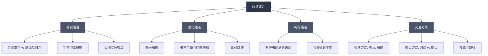
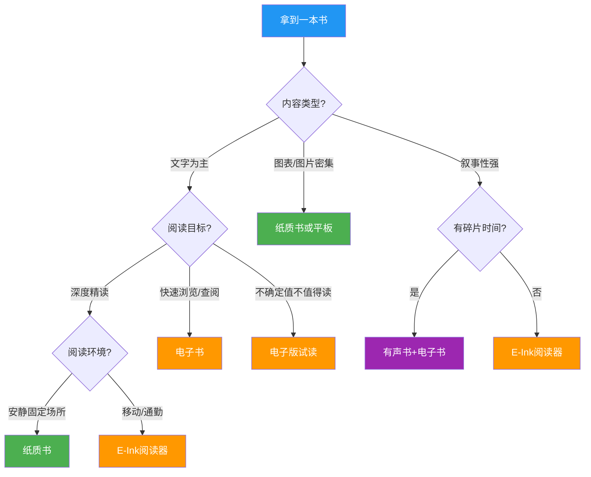
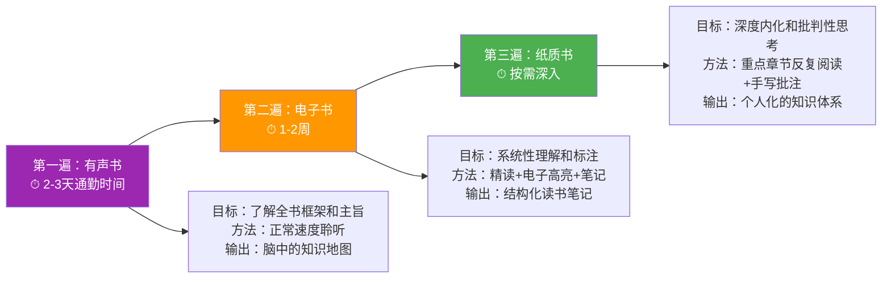

## 第六部分：电子书与纸质书选择

在阅读方法论的完整体系中，有一个经常被忽视但对阅读效率和体验影响巨大的决策：**选择什么媒介来阅读**。纸质书、电子书（E-Ink设备）、有声书、手机/平板阅读——每种媒介都有其独特的认知机制、适用场景和隐性成本。选错媒介，不仅浪费金钱，更会浪费你最宝贵的时间和注意力。

本部分将从认知科学出发，结合实际使用场景，为你建立一套系统化的媒介选择框架。目标是：**让每一次阅读都发生在最合适的媒介上**。

### 一、为什么媒介选择如此重要？

#### 1.1 媒介不是载体，是认知环境

很多人把电子书和纸质书的区别简单归结为"一个用屏幕一个用纸"。这是一个严重的认知误区。媒介不仅仅是内容的载体，它本身就是阅读认知环境的一部分——它影响你的注意力分配、信息编码方式、记忆深度，甚至阅读时的情绪状态。

认知心理学家 Maryanne Wolf 在《普鲁斯特与乌贼》中指出：**人类的大脑并没有天生的"阅读回路"，阅读能力是通过后天训练在原有神经回路上"搭建"出来的**。不同的阅读媒介会激活不同的神经通路，从而影响理解深度和记忆效果。

#### 1.2 研究数据：纸质书 vs 电子书的认知差异

挪威斯塔万格大学 Anne Mangen 教授团队在2013年和2019年进行了两项经典实验，对比了纸质书和Kindle阅读的阅读理解效果：

| 实验指标 | 纸质书组 | 电子书组 | 差异分析 |
|---------|---------|---------|---------|
| 故事情节回忆准确率 | 85% | 73% | 纸质书读者能更准确地回忆事件的时间顺序 |
| 阅读时间 | 较长 | 较短 | 电子书读者倾向于"跳读"，实际阅读深度更低 |
| 阅读后的沉浸感评分 | 4.2/5 | 3.5/5 | 纸质书的触觉反馈增强了叙事沉浸感 |
| 长文本理解测试 | 显著更高 | 基线 | 差距在长文本（>10页）中尤为明显 |

关键发现：**媒介效应在短文本中不显著，但随着文本长度增加，纸质书的阅读理解优势逐渐显现**。原因在于纸质书提供了更好的"空间定位感"——你知道自己读了多厚、还有多厚，大脑利用这种物理空间信息来辅助记忆编码。

#### 1.3 这不意味着纸质书"更好"

需要强调的是：上述研究并不意味着纸质书在所有场景下都优于电子书。媒介选择是一个**多维度的权衡问题**，认知效果只是其中一个维度。便携性、成本、获取便利性、标注效率、搜索功能——这些维度在不同场景下的权重完全不同。接下来我们将逐一拆解每个维度。

### 二、五种阅读媒介的深度分析

#### 2.1 纸质书：深度阅读的黄金标准

**核心优势：**

- **空间记忆编码**：纸质书的物理属性（厚度、页面位置、左右页差异）为空间记忆提供了丰富的锚点。研究表明，读者对"这段话大概在书的前三分之一、左页的中下部"这类物理位置记忆，显著优于对电子书滚动位置的记忆。
- **零干扰环境**：一本纸质书就是一个封闭的阅读空间。没有通知弹窗，没有超链接诱惑，没有电量焦虑。这种"数字隔离"本身就是一种深度阅读的保护机制。
- **标注的仪式感**：用笔在书上画线、写批注的行为涉及精细运动控制，这种多感官参与会增强记忆编码。与单纯点击屏幕高亮相比，手写标注的信息留存率高出29%（Mueller & Oppenheimer, 2014）。
- **视觉疲劳最小**：纸张反射环境光，不主动发光，长时间阅读对眼睛的负担最小。即便是E-Ink屏幕，在对比度和反光特性上仍略逊于真正的纸张。

**核心劣势：**

- **物理重量**：一本300页的平装书约300-400克，硬壳精装可达600克以上。如果你每天通勤携带，这个重量会成为实际负担。
- **存储空间**：100本纸质书大约占据一整面书架。对于小户型居住者，这是一个真实的物理约束。
- **价格较高**：中文纸质书平均定价35-65元，英文原版书更贵（$15-$30）。相比之下，电子书通常便宜30%-50%。
- **获取延迟**：除非在书店现场购买，否则需要等待物流。对于急需查阅的参考资料，这种延迟可能影响工作效率。
- **标注不可搜索**：你在书上写的批注，无法像电子标注那样一键全文检索。当你想找"之前在哪本书上写过关于X的思考"时，纸质书的检索成本极高。

**最佳使用场景：**

- 在家中安静环境下的深度阅读
- 需要反复翻阅、前后对照的经典著作
- 图片/图表密集的艺术、设计、摄影类书籍
- 你打算收藏、反复重读的书
- 需要赠送他人的书（纸质书作为礼物的情感价值远高于电子书）

#### 2.2 E-Ink 电子书阅读器：便携与护眼的平衡点

**代表设备**：Kindle Paperwhite、Kindle Oasis、文石 Boox 系列、掌阅 iReader、小米多看电纸书

**核心优势：**

- **E-Ink 屏幕接近纸质体验**：电子墨水屏通过微胶囊中的黑白粒子在电场作用下排列来显示内容，不主动发光，反射环境光，视觉体验最接近纸张。长时间阅读的视觉疲劳显著低于 LCD/OLED 屏幕。
- **海量存储**：一台设备可存储数千本书。64GB 的阅读器可以存放约 30,000 本纯文本电子书。对于经常出差或旅行的读者，这意味着"随身携带整个图书馆"。
- **即时获取**：想读一本书，从搜索到开始阅读只需30秒。这种即时性大大降低了阅读的启动成本——很多时候，人们不读书不是因为不想读，而是"懒得去找那本书"。
- **强大的标注和搜索功能**：高亮、笔记、全文搜索、导出标注——这些功能让电子书在知识管理方面具有天然优势。你可以在3秒内找到"所有关于认知偏差的标注"。
- **即时查词**：遇到不认识的字词，长按即可查看释义。对于阅读外文原版书，这个功能的价值是巨大的——它消除了"查词打断阅读流"的问题。
- **字号和排版可调**：对于视力不佳的读者，电子书可以自由调整字号、行距、字体，这是纸质书无法提供的个性化体验。

**核心劣势：**

- **翻页延迟和残影**：E-Ink 屏幕的刷新率远低于 LCD，每次翻页都有可见的刷新过程。虽然近年设备已大幅改善（从早期的1秒缩短到现在的0.1-0.3秒），但对于快速翻阅场景仍然不理想。
- **彩色显示受限**：目前彩色 E-Ink 屏幕（如 Kaleido 系列）的色彩饱和度和对比度远不如 LCD，不适合对色彩要求高的书籍（如摄影集、绘本）。
- **空间感较弱**：在 E-Ink 设备上，你很难感知"自己读了整本书的多少"。进度条显示的百分比无法替代纸质书那种"左手边越来越薄"的直观感受。
- **设备依赖和续航焦虑**：虽然 E-Ink 阅读器的续航通常在数周级别，但"没电了就无法阅读"这个事实本身会带来微弱的心理负担。
- **格式兼容性问题**：不同平台的电子书格式（AZW3、EPUB、MOBI、PDF）互不兼容。在某个平台购买的书，可能无法在其他设备上阅读。这种"格式锁定"是电子书生态的长期痛点。

**最佳使用场景：**

- 日常通勤和出行中的阅读
- 阅读大量外文原版书籍
- 需要频繁搜索和查阅的技术参考书
- 不确定是否值得购买的书（先买电子版试读）
- 阅读篇幅较长的系列书籍（如多卷本小说）

#### 2.3 平板电脑（iPad / Android Pad）：多媒体阅读的全能选手

**核心优势：**

- **彩色显示完美**：对于杂志、漫画、绘本、图册等视觉类内容，平板电脑的 LCD/OLED 屏幕是最佳选择。
- **多功能集成**：一台平板可以同时充当阅读器、笔记本、浏览器、视频播放器。在阅读过程中需要查资料、看视频讲解时，切换成本为零。
- **应用生态丰富**：微信读书、Kindle、多看、PDF Expert、MarginNote——平板电脑上的阅读应用生态远比专用阅读器丰富。
- **PDF 体验最佳**：对于A4尺寸的学术论文、技术文档，平板电脑（尤其是12.9英寸的iPad Pro）的显示面积和缩放体验远优于6-7英寸的E-Ink阅读器。

**核心劣势：**

- **干扰源集中**：平板电脑是通知、社交媒体、游戏、视频的集合体。在平板上阅读，你需要极强的自律来抵抗"就刷一下朋友圈"的诱惑。
- **视觉疲劳**：LCD/OLED 屏幕主动发光，长时间阅读（>1小时）会导致明显的眼部疲劳。虽然"夜间模式"和"阅读模式"可以缓解，但无法从根本上消除。
- **重量和尺寸**：iPad Pro 12.9 英寸重约 680 克，加上保护壳超过 800 克。单手长时间持握会感到疲劳。

**最佳使用场景：**

- 阅读杂志、漫画、绘本等视觉类内容
- 阅读 PDF 格式的学术论文和技术文档
- 需要边读边查资料的交叉阅读
- MarginNote 等"阅读+思维导图"工作流

#### 2.4 有声书：被严重低估的阅读媒介

**核心优势：**

- **解放双眼和双手**：有声书让你可以在通勤、做家务、运动、散步等"手眼被占用"的场景中进行阅读。据统计，一个每天通勤1小时的城市上班族，一年仅通勤时间就可以听完约25本书（按每本书6-8小时计算）。
- **专业朗读者的增值**：优秀的有声书朗读者不仅仅是"把字念出来"，他们通过语调、节奏、情感表达为内容增添了额外的理解维度。一些文学作品（如马尔克斯的《百年孤独》）在专业朗读者的演绎下，阅读体验甚至优于默读。
- **降低阅读启动门槛**：对于一些"一直想读但总是翻不开"的经典著作，有声书提供了一个低门槛的入口。先听一遍了解全貌，再决定是否深入纸质阅读。
- **辅助记忆**：听觉记忆和视觉记忆使用不同的神经通路。对同一内容进行"读+听"的双通道输入，可以显著增强记忆效果。

**核心劣势：**

- **信息吸收率较低**：多项研究表明，有声书的信息吸收率约为默读的60%-75%。原因在于：(1) 语音是线性的，无法像文字那样快速回扫和前后跳转；(2) 走神后不容易发现（默读时走神会发现自己盯着同一行字没动，有声书走神时音频会继续播放）。
- **不适合复杂内容**：包含大量公式、图表、代码的技术类书籍，有声书几乎无法有效传达。哲学和学术著作中的复杂论证链，在听觉通道中也很难被完整追踪。
- **阅读速度受限**：虽然有声书支持1.25x-2x变速播放，但即便是2x速，仍然远慢于一个熟练读者的默读速度（默读速度通常是有声书正常速度的3-5倍）。
- **中文有声书生态仍在发展中**：相比英文有声书（Audible平台有数十万种），中文有声书的选择范围较窄，且质量参差不齐。

**最佳使用场景：**

- 通勤、运动、做家务等碎片化场景
- 叙事性强的内容：传记、历史、小说、商业案例
- 作为精读前的"预听"——先听一遍全书概要，再精读重点章节
- 外语学习——用有声书训练听力和语感

#### 2.5 手机阅读：零门槛但高风险

**核心优势：**

- **永远随身携带**：手机是现代人唯一真正做到"形影不离"的设备。这意味着任何碎片时间都可以变成阅读时间——等电梯、排队、等人。
- **零额外成本**：不需要购买任何额外设备。
- **社交分享便利**：看到精彩段落，一键即可分享到微信、微博等社交平台。

**核心劣势：**

- **屏幕太小**：主流手机屏幕6.1-6.7英寸，每页显示的文字量有限，频繁翻页会打断阅读流。
- **干扰最大化**：手机是通知、消息、社交媒体的终极入口。在手机上保持专注阅读的难度，是在纸质书上的10倍以上。
- **姿势问题**：手机阅读时通常低头，长时间保持这个姿势会导致颈椎问题（"手机脖"）。
- **视觉疲劳最严重**：手机屏幕小、亮度高、使用距离近（通常20-30厘米），对眼睛的负担是所有阅读媒介中最大的。

**最佳使用场景：**

- 短时间碎片阅读（<10分钟）
- 微信公众号、新闻资讯等短内容
- 作为其他阅读媒介的补充（如在手机上回顾之前做的电子标注）
- 紧急查阅——只有手机在身边时的临时阅读需求

### 三、系统化选择框架：SCORING 模型

面对一本书，如何快速决定用什么媒介阅读？我设计了一个 **SCORING 模型**，从7个维度进行评估：

**SCORING 七维度评估表：**

| 维度 | 权重 | 评估问题 | 纸质书得分高 | 电子书得分高 |
|------|------|---------|-------------|-------------|
| **S**cope（内容结构） | 15% | 书中图表/图片占比多大？ | >30%图片内容 | 以纯文字为主 |
| **C**ognitive（认知需求） | 20% | 需要多深的理解和记忆？ | 深度精读、反复翻阅 | 浏览、快速获取信息 |
| **O**ccasion（阅读场景） | 20% | 主要在什么环境下阅读？ | 固定安静场所 | 通勤、旅行、移动中 |
| **R**eference（查阅频率） | 10% | 是否需要频繁搜索和引用？ | 不需要频繁搜索 | 需要全文搜索和交叉引用 |
| **I**nvestment（投入意愿） | 10% | 这本书值得购买纸质版吗？ | 经典、收藏价值高 | 一次性阅读、时效性强 |
| **N**otes（笔记需求） | 15% | 做什么类型的笔记？ | 手写批注、思维导图 | 数字化标注、导出分享 |
| **G**roup（社交需求） | 10% | 是否需要与他人分享讨论？ | 借阅、赠送、传阅 | 线上讨论、标注分享 |

**使用方法：** 对每个维度打分（纸质书 vs 电子书，1-5分），加权计算总分，选择总分更高的媒介。

### 四、场景化决策指南

#### 4.1 按书籍类型选择媒介

| 书籍类型 | 推荐首选 | 推荐辅助 | 理由 |
|---------|---------|---------|------|
| 文学小说 | E-Ink 阅读器 | 纸质书（收藏版） | 文学阅读重在沉浸，E-Ink 提供接近纸质的体验且便携；真正喜爱的作品买纸质版收藏 |
| 技术/编程书 | 纸质书 | 电子书（搜索用） | 技术书需要前后翻阅、对照代码，纸质书的空间感更优；电子版作为全文搜索的补充 |
| 学术论文/教材 | 平板电脑 | 纸质打印 | 论文多为PDF格式，平板的PDF体验最佳；需要做大量标注时打印关键章节 |
| 商业/管理类 | 电子书 | 有声书（预听） | 此类书籍信息密度适中，电子书的搜索和标注效率更高；先听有声书了解框架再精读 |
| 哲学/思想类 | 纸质书 | 电子书 | 哲学著作需要反复翻阅、前后参照、深度批注，纸质书的空间记忆编码优势在此类阅读中最为显著 |
| 传记/历史 | 有声书 | 纸质书 | 叙事性强的内容非常适合有声书；特别重要的传记用纸质书精读 |
| 艺术/设计/摄影 | 纸质书（大开本） | 平板电脑 | 此类书籍的核心价值在于视觉呈现，纸质书的色彩还原和开本尺寸不可替代 |
| 漫画/绘本 | 平板电脑 | 纸质书（收藏） | 平板的彩色显示和翻页流畅度最适合漫画阅读；特别喜欢的作品买纸质版收藏 |
| 外文原版书 | E-Ink 阅读器 | 纸质书 | E-Ink 的即时查词功能对阅读外文书至关重要，这个优势足以决定媒介选择 |
| 工具书/字典 | 电子书 | 不推荐纸质 | 工具书的核心使用方式是"查阅"而非"通读"，电子书的全文搜索优势在此场景中碾压纸质书 |

#### 4.2 按生活场景选择媒介

**晨间阅读（家中，30-60分钟）：**
纸质书为首选。早晨是大脑最清醒、注意力最充沛的时段，适合进行深度阅读。纸质书的零干扰特性可以帮助你在这段黄金时间内获得最大的认知收益。

**通勤阅读（地铁/公交，30-60分钟）：**
E-Ink 阅读器为首选。通勤环境嘈杂、空间拥挤，E-Ink 阅读器轻便、护眼、续航持久，是这个场景的最优解。如果通勤时间较短（<20分钟），有声书也是好选择——不需要掏设备、找座位，戴上耳机即可。

**午休阅读（办公室，15-30分钟）：**
手机或E-Ink阅读器。午休时间短，不适合进入深度阅读状态，适合用手机回顾之前的标注，或用E-Ink阅读器进行轻松的泛读。

**睡前阅读（床上，15-30分钟）：**
E-Ink阅读器（带前光）为首选。睡前阅读需要注意两点：(1) 避免蓝光影响褪黑素分泌，(2) 避免手机通知打断。E-Ink 阅读器的暖光模式对睡眠的影响最小。纸质书也是好选择，但需要确保床头灯光柔和且不打扰同住者。

**旅行/出差阅读：**
E-Ink阅读器 + 有声书组合。E-Ink阅读器在飞机、火车上提供沉浸式阅读体验；有声书在步行、等待、换乘等场景中利用碎片时间。

**运动/家务阅读：**
有声书是唯一选择。跑步、健身、做饭、打扫卫生时，双手和双眼都被占用，有声书是唯一能在这些场景中使用的阅读媒介。

### 五、混合阅读策略：媒介组合的艺术

真正高效的读者不会固守单一媒介，而是根据场景灵活组合。以下是三种经过验证的混合策略：

#### 5.1 "三遍法"：同一本书的多媒介深度阅读

适用于经典著作和核心专业书籍：

**实际案例：** 阅读《思考，快与慢》（丹尼尔·卡尼曼）

- **第一遍（有声书）**：通勤时听完，了解"系统1/系统2"框架和主要认知偏差类型。总耗时约8小时。
- **第二遍（电子书/微信读书）**：精读全书，用电子高亮标注关键定义和实验，导出标注到Notion。总耗时约10小时。
- **第三遍（纸质书）**：只重读第一部分和第五部分（理论框架和总结），在书页空白处写下自己的思考和联想。总耗时约3小时。

通过"三遍法"，你对这本书的理解深度远超单一媒介阅读，而且每遍使用的都是当时场景下最适合的媒介。

#### 5.2 "主题阅读媒介矩阵"：同一主题多本书的媒介分配

在进行主题阅读时，不同角色的书使用不同媒介：

| 书籍角色 | 说明 | 推荐媒介 | 示例 |
|---------|------|---------|------|
| 核心书（2-3本） | 主题的奠基之作，需要精读 | 纸质书 | 主题："认知心理学"→《思考，快与慢》《超越智商》 |
| 扩展书（5-8本） | 补充视角和案例，需要泛读 | 电子书 | 主题："认知心理学"→《助推》《噪声》《稀缺》 |
| 参考书（若干） | 提供数据、术语、背景知识，按需查阅 | 电子书 | 专业词典、百科全书、综述论文 |
| 入门书（1-2本） | 建立全局认知，降低学习曲线 | 有声书或电子书 | 科普读物、TED演讲者的著作 |

#### 5.3 "晨读纸质 + 通勤电子 + 运动有声" 三位一体策略

这是适合大多数人的日常阅读组合：

| 时段 | 媒介 | 时长 | 内容类型 | 阅读方式 |
|------|------|------|---------|---------|
| 早晨 6:30-7:30 | 纸质书 | 60分钟 | 当前精读的核心书籍 | 深度精读+手写笔记 |
| 通勤 8:00-9:00 | E-Ink 阅读器 | 60分钟 | 泛读或复习之前的笔记 | 检视阅读+电子标注 |
| 午休 12:30-13:00 | 手机 | 30分钟 | 微信读书/公众号文章 | 碎片阅读+收藏 |
| 运动 18:00-19:00 | 有声书 | 60分钟 | 传记/商业/叙事类 | 聆听+散步 |
| 睡前 22:00-22:30 | E-Ink 阅读器 | 30分钟 | 轻松读物或复习今日笔记 | 放松式阅读 |

**这种组合的年阅读量估算：**

- 早晨纸质书：按精读速度（每小时20页），每天60页，约5天一本书（300页），**年读约70本**
- 通勤电子书：按泛读速度，每天约读完一本书的1/5，**年读约70本**
- 运动有声书：按每天1小时，每本书6-8小时，**年听约50本**
- **总计年阅读量：约150-190本**

当然，这不需要所有时段都用于阅读。根据实际情况，选择其中2-3个时段组合即可。

### 六、常见误区与纠正

#### 误区一："电子书伤眼，所以应该只读纸质书"

**真相：** 这个说法过于笼统。E-Ink 电子墨水屏不发光、反射环境光，对眼睛的负担与纸质书接近。真正伤眼的是手机和平板电脑的 LCD/OLED 屏幕。不应该因为"电子书伤眼"的笼统印象而放弃 E-Ink 阅读器的巨大便利性。

**纠正：** 区分"E-Ink电子书"和"屏幕电子书"。E-Ink设备（Kindle、文石等）的护眼程度接近纸质书；手机/平板的LCD屏幕才是真正需要注意的。使用手机/平板阅读时，开启"阅读模式"或"夜间模式"可以部分缓解。

#### 误区二："读纸质书才算真正的阅读"

**真相：** 这是一种形式主义偏见。阅读的本质是信息的获取、理解和内化，与媒介无关。一个每天在Kindle上精读2小时的读者，其阅读深度和收获远超一个买了一书架纸质书却从不翻开的人。

**纠正：** 关注"阅读行为本身"而非"阅读的形式"。衡量阅读质量的标准是理解深度、笔记质量和知识应用，而不是你翻动的是纸页还是电子页。

#### 误区三："买了电子书阅读器就不需要纸质书了"

**真相：** 单一媒介策略会限制你的阅读效果。如前文所述，不同类型的书籍在不同媒介上的阅读体验差异显著。强迫所有书籍都在同一设备上阅读，会损失每种媒介的独特优势。

**纠正：** 接受"多媒介共存"的阅读生态。你不需要在纸质书和电子书之间做二选一的抉择，而是应该为不同场景和不同类型的书籍配置最适合的媒介。

#### 误区四："有声书不是真正的阅读"

**真相：** 这取决于你如何定义"阅读"。如果阅读的定义是"通过某种媒介获取文本信息"，有声书当然是阅读的一种形式。有声书的信息吸收率确实低于默读（约60%-75%），但它是**在其他场景中不可能进行阅读的时间**里获取信息的唯一方式。

**纠正：** 不要把有声书当作"偷懒"，而要把它当作"阅读时间的延伸"。在通勤、运动、做家务这些场景中，选择是有声书还是什么都不听——答案是显而易见的。有声书不应替代深度阅读，但可以与深度阅读形成完美互补。

#### 误区五："PDF用手机看就行了"

**真相：** PDF 是为A4纸张设计的格式，在手机6英寸的屏幕上阅读A4尺寸的PDF，需要频繁缩放和左右滑动，阅读体验极差。这不仅影响效率，还会因为频繁的操作打断思维的连续性。

**纠正：** PDF 的最佳阅读设备是10英寸以上的平板电脑，其次是E-Ink大屏阅读器（如文石Note系列），再次是打印出来。手机只适合"紧急查阅"，不适合"阅读"。

#### 误区六："电子书平台上买的书就是我的"

**真相：** 你在电子书平台上购买的只是"阅读许可"，而非书籍的所有权。平台倒闭、账号被封、版权方下架——任何一种情况都可能导致你"购买"的书籍消失。2009年亚马逊因版权问题远程删除了用户Kindle上的《1984》，就是最著名的案例。

**纠正：** 对于真正重要的电子书，下载DRM-free版本并本地备份。对于有收藏价值的书，购买纸质版作为"物理备份"。

### 七、电子书平台与工具深度对比

#### 7.1 主流电子书平台对比

| 平台 | 书库规模 | 价格模式 | 格式支持 | 标注导出 | 跨平台 | 特色功能 |
|------|---------|---------|---------|---------|--------|---------|
| 微信读书 | 50万+ | 免费+付费会员 | 自有格式 | 支持导出笔记 | iOS/Android/Web/墨水屏 | 社交阅读、无限卡免费读 |
| Kindle（中国已停服） | — | — | — | — | — | 2023年6月停止中国运营，存量用户需迁移 |
| 掌阅 iReader | 50万+ | 付费购买+会员 | EPUB/PDF/TXT | 支持 | iOS/Android/墨水屏设备 | AI朗读、护眼模式 |
| 豆瓣阅读 | 10万+ | 付费购买 | 自有格式 | 部分支持 | iOS/Android/Web | 原创文学、高质量书评 |
| Apple Books | 百万级 | 付费购买 | EPUB/PDF | 支持 | Apple 生态 | 排版精美、与Apple设备深度集成 |
| Google Play Books | 百万级 | 付费购买+订阅 | EPUB/PDF | 支持 | 全平台 | 上传个人PDF/EPUB到云端同步 |
| 得到 APP | 万级 | 付费购买+会员 | 自有格式 | 支持 | iOS/Android | 书籍解读、知识城邦社区 |
| Z-Library | 千万级 | 免费 | EPUB/PDF/MOBI | N/A | Web | 海量免费资源（存在版权争议） |

#### 7.2 笔记和知识管理工具

电子书阅读的一个核心优势是标注和笔记的数字化。以下工具可以将你的阅读标注转化为知识资产：

**Readwise（$8.99/月）：**
自动同步 Kindle、微信读书、Apple Books、Instapaper 等平台的阅读高亮，每日推送"回顾"帮助你复习旧标注。支持一键导出到 Notion、Obsidian、Roam Research。对于同时使用多个阅读平台的读者，Readwise 是连接"阅读"和"知识管理"的最佳桥梁。

**Obsidian（免费）：**
基于 Markdown 的本地知识管理工具。将阅读笔记以 Markdown 文件形式存储在本地，通过双向链接构建知识网络。适合深度知识管理者，学习曲线较陡但上限极高。

**Notion（免费基础版）：**
All-in-one 工作空间。可以用数据库管理阅读书目、用页面记录读书笔记、用看板追踪阅读进度。上手容易，适合大多数人。

**Flomo（免费基础版）：**
极简卡片笔记工具。不需要排版、不需要分类，像发微博一样快速记录阅读中的灵感和想法。适合不喜欢复杂工具的读者。

**MarginNote（¥128 买断）：**
iPad/Mac 专属的深度阅读工具。在阅读 PDF/EPUB 的同时，可以创建思维导图、制作学习卡片、进行间隔重复复习。是学术阅读和考试备考的终极工具。

#### 7.3 有声书平台

| 平台 | 内容规模 | 价格 | 特色 |
|------|---------|------|------|
| 微信听书 | 中等 | 免费+付费 | 与微信读书生态打通 |
| 喜马拉雅 | 海量 | 会员制 | 中国最大的音频平台，内容最全面 |
| 得到听书 | 中等 | 会员制 | 高质量书籍解读（非全文朗读） |
| 懒人听书 | 中等 | 会员制 | 有声小说、评书资源丰富 |
| Audible（英文） | 20万+ | $14.95/月 | 英文有声书的最佳选择，朗读质量极高 |
| LibriVox（英文） | 数万 | 完全免费 | 志愿者朗读的公共领域书籍 |

### 八、进阶：构建个人媒介选择系统

#### 8.1 建立"书籍-媒介"映射表

在你常用的阅读管理工具（豆瓣、Notion、Excel均可）中，为每本书增加一个"媒介"字段：

书籍：《原则》- 瑞·达利欧
媒介：有声书（第一遍） → 电子书（精读标注） → 纸质书（收藏）
原因：商业叙事类，适合有声书入门；核心原则部分需要精读标注；值得收藏反复翻阅

#### 8.2 定期复盘媒介选择的效果

每季度花15分钟回顾：

- 哪些书用对了媒介？效果如何？
- 哪些书选错了媒介？原因是什么？
- 是否有新的阅读场景需要配置新的媒介？

#### 8.3 投资建议：按优先级配置阅读设备

如果你的预算有限，按以下优先级逐步配置：

| 优先级 | 设备 | 预算 | 适合人群 |
|--------|------|------|---------|
| 1 | 纸质书（按需购买） | 按月度阅读预算 | 所有人——纸质书是阅读的基石 |
| 2 | E-Ink 阅读器 | ¥500-2000 | 每天通勤>30分钟的读者 |
| 3 | 有声书会员 | ¥15-25/月 | 每天有运动/通勤/做家务时间的读者 |
| 4 | 平板电脑 | ¥2000-6000 | 需要阅读PDF论文/技术文档的读者 |
| 5 | 阅读管理工具 | ¥0-90/月 | 年阅读量>30本、需要知识管理的读者 |

### 九、本部分小结

媒介选择不是信仰问题，而是工程问题——**每种媒介都是工具，关键在于在正确的场景中使用正确的工具**。

核心要点回顾：

1. **纸质书**是深度阅读的黄金标准，适合安静环境、经典著作、需要收藏的书籍
2. **E-Ink 阅读器**是便携与护眼的最佳平衡，适合通勤、外文书、大量泛读
3. **平板电脑**是多媒体阅读的全能选手，适合PDF、漫画、杂志、交叉阅读
4. **有声书**是被严重低估的阅读媒介，适合碎片时间、叙事性内容、预听入门
5. **手机**是零门槛但高风险的阅读媒介，只适合碎片时间的短内容阅读
6. 最好的策略不是选择一种媒介，而是**组合多种媒介**，让每一分钟的阅读都发生在最合适的媒介上

记住：**你不是在选择"读纸质书还是电子书"，你是在为每一本书、每一个阅读场景，定制最优的阅读体验**。
