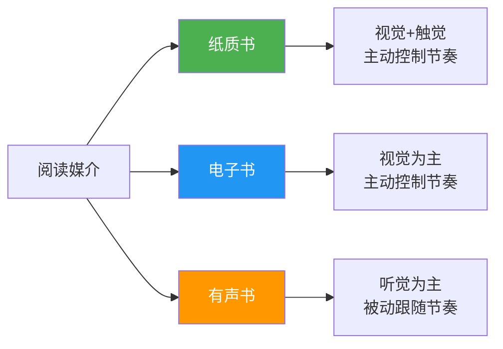
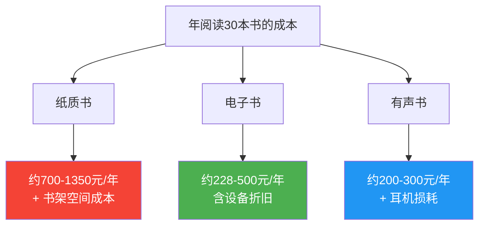
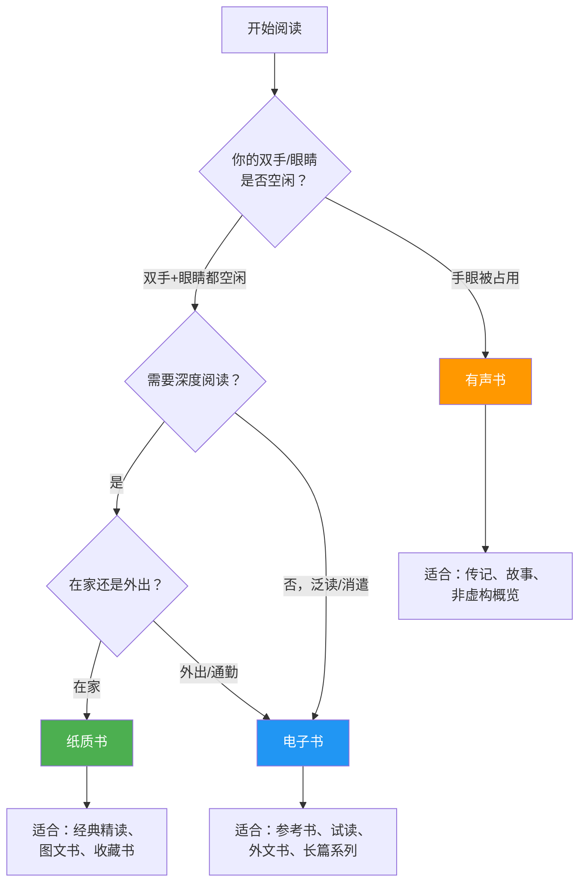
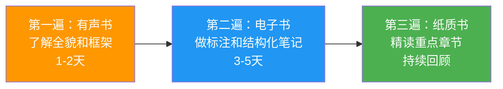
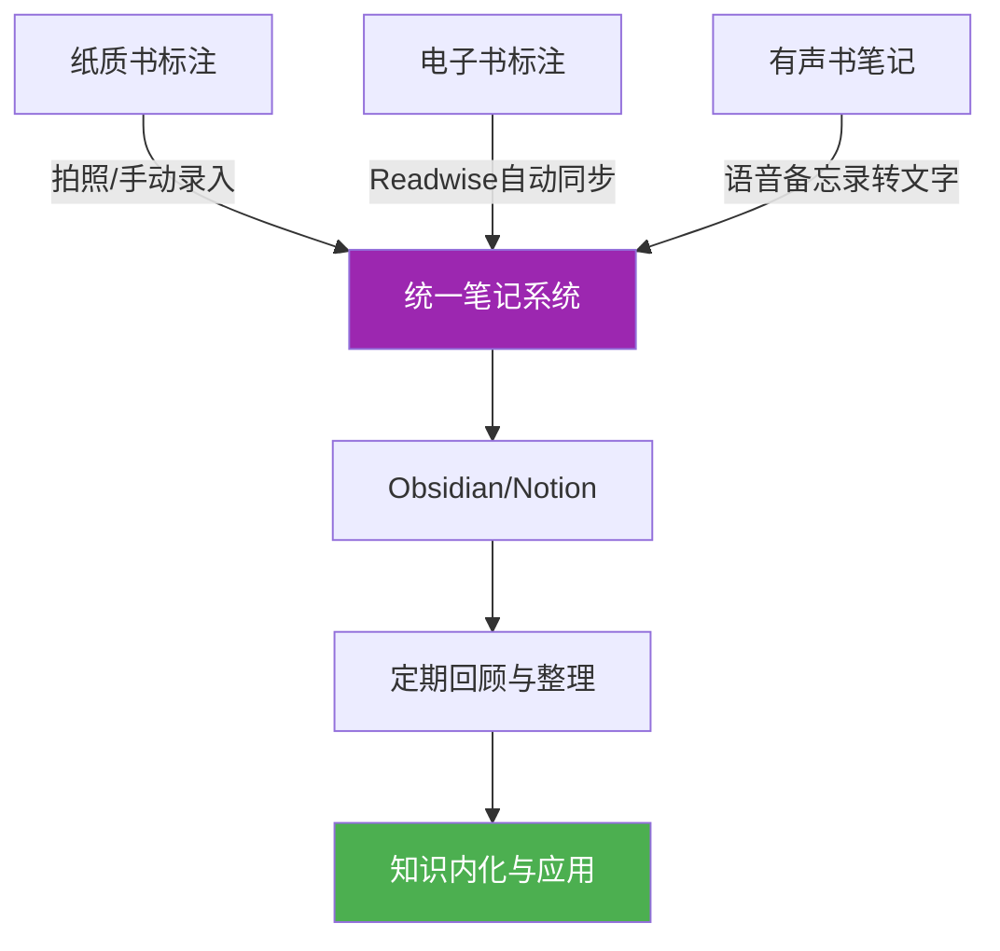

## 一、两种媒介的优劣对比

选择阅读媒介看似是个人偏好问题，实际上涉及认知科学、经济学、行为心理学等多个维度。不同的媒介会深刻影响你的阅读速度、理解深度、记忆留存率和阅读持续性。本节将从科学证据出发，全面对比纸质书、电子书和有声书三种媒介，帮助你建立一套理性的媒介选择框架。

### 1.1 三种媒介的本质差异

在深入对比之前，先理解三种媒介的本质区别：

- **纸质书**：物理载体，通过视觉和触觉接收信息，读者完全控制阅读节奏，信息在空间上有固定的物理位置（"记得在左页的中间看到过"）。
- **电子书**：数字载体，通过屏幕视觉接收信息，读者控制节奏但依赖设备功能，信息没有固定物理位置，依赖搜索和导航。
- **有声书**：声音载体，通过听觉接收信息，节奏由朗读者控制，是最接近"口头传承"的古老阅读方式。

### 1.2 认知科学视角：媒介如何影响大脑

#### 1.2.1 阅读理解深度

挪威斯塔万格大学（University of Stavanger）的 Anne Mangen 教授在2014年进行了一项经典实验：让50名高中生阅读同一篇叙事文本，一半人读纸质版，一半人读PDF电子版。结果发现，**纸质阅读组在理解测试中得分显著高于电子阅读组**。

原因在于"触觉地图"（haptic map）效应：

| 效应 | 纸质书 | 电子书 | 有声书 |
|------|--------|--------|--------|
| 空间定位 | 强——书的厚度、翻页位置提供物理锚点 | 弱——进度条无法替代物理感知 | 无——纯时间线性 |
| 专注度 | 高——无干扰源 | 中——设备自带通知和应用切换 | 中——容易走神 |
| 深度加工 | 促进——书写批注激活运动记忆 | 中等——电子标注效率高但加工浅 | 较弱——被动接收 |
| 认知负荷 | 低——界面简单直觉 | 中——需要学习操作界面 | 低——但信息密度受限于朗读速度 |

#### 1.2.2 记忆编码机制

认知心理学中的"编码特异性原则"（Encoding Specificity Principle）指出：记忆的提取效果取决于编码时的上下文线索。纸质书提供了丰富的多感官线索——纸张的气味、书页的触感、文字在页面上的物理位置——这些线索在回忆时可以作为"钩子"帮助提取信息。

2019年《Nature》子刊《Scientific Reports》发表的研究进一步证实：在纸质阅读时，大脑的海马体（负责记忆形成）和前额叶皮层（负责深度思考）激活程度更高。这解释了为什么很多人感觉"纸质书记得更牢"。

#### 1.2.3 屏幕劣势效应的消退

值得注意的是，随着数字原住民（1995年后出生的人群）的成长，屏幕阅读的理解劣势正在缩小。2022年的一项元分析（涵盖超过17万名参与者）发现，年轻群体在屏幕和纸质阅读的理解差异已从早期的1.5个标准差缩小到0.2个标准差。这意味着：

- 如果你从小习惯屏幕阅读，电子书的理解效果可能已经接近纸质书
- 但纸质书在深度阅读和长文本理解上仍保持微弱优势
- 对于40岁以上的读者，纸质书的认知优势更为明显

### 1.3 多维度详细对比

#### 1.3.1 阅读体验

| 维度 | 纸质书 | 电子书 | 有声书 |
|------|--------|--------|--------|
| 触感 | 纸张质感、翻页手感、墨香，提供独特的仪式感 | 冷冰冰的玻璃屏幕或塑料外壳，E-ink屏稍好 | 无触感体验 |
| 视觉舒适度 | 纸质漫反射光线，对眼睛最友好；E-ink屏模拟纸质效果 | 普通LCD/OLED屏幕发出蓝光，长时间阅读导致眼疲劳；但可调亮度和色温 | 不依赖视觉，完全解放双眼 |
| 阅读速度控制 | 完全自主，可跳跃、回翻、扫读 | 完全自主，但翻页动画可能影响节奏 | 由朗读者决定，可调1.25x-2x速，但高速会损失信息 |
| 沉浸感 | 高——物理隔离了数字干扰 | 中——设备通知、应用切换是主要干扰源；使用专用阅读器可改善 | 取决于环境噪音和注意力，适合叙事类内容 |
| 格式呈现 | 最佳——排版、字体、纸张颜色都经过专业设计 | 良好——可自定义字体和排版，但复杂图表和公式显示常出问题 | 无法呈现图表、公式、代码等视觉元素 |

#### 1.3.2 便携性与存储

**纸质书的物理限制**：一本典型平装书重200-400克，厚1-3厘米。出差带3本书就占了背包1/4的空间和接近1公斤的重量。

**电子书的容量优势**：一台Kindle Paperwhite重205克（约一本书的重量），可存储数千本书。iPad mini重293克，配合微信读书等App，等于随身携带一个图书馆。

**有声书的无感携带**：存在手机里，零额外重量和空间。

携带10本书的重量对比：
━━━━━━━━━━━━━━━━━━━━━━━━━━━━━━━━━━
纸质书：  ████████████████████████  3.5 kg
电子阅读器：█                        0.2 kg
有声书（手机）：                      0.0 kg（已含在手机重量中）
━━━━━━━━━━━━━━━━━━━━━━━━━━━━━━━━━━

#### 1.3.3 成本分析

**纸质书的真实成本**：

- 单本定价：30-80元（国内新书均价约45元）
- 打折渠道：京东/当当满100减50，实际约5-7折
- 二手/多抓鱼：3-5折
- 年阅读量30本：实际支出约700-1350元
- 隐性成本：书架空间（大城市每平米房价折算的存储成本极高）

**电子书的真实成本**：

- 微信读书无限卡：约228元/年，覆盖绝大部分热门书
- Kindle Unlimited：约88元/年（已停止国内服务，但仍可购买单本）
- 单本购买：通常为纸质书的50-70%
- 设备成本：Kindle约600-1500元，iPad约2500-6000元（使用寿命3-5年）
- 年阅读量30本：实际支出约228-500元（含设备折旧）

**有声书的真实成本**：

- 微信读书/得到/喜马拉雅会员：约200-300元/年
- Audible会员：约15美元/月（1本/月）
- 有声书制作成本高，免费资源较少

#### 1.3.4 标注与知识管理

这是三种媒介差异最大的维度，也是影响"读完能不能用"的关键因素。

**纸质书标注**：

- 优势：笔触参与运动记忆，标注过程本身就是深度加工；手写批注的自由度最高，可以画箭头、写旁注、标重点
- 劣势：标注无法搜索、无法导出、无法跨书关联；书一旦借出或丢失，标注随之消失
- 解决方案：读完后用扫描App（如Scanner Pro）将标注拍照，导入Obsidian等笔记工具归档

**电子书标注**：

- 优势：一键高亮，自动收集所有标注；支持全文搜索；可通过Readwise等工具自动同步到Notion/Obsidian；标注可跨设备同步
- 劣势：标注过程缺乏身体参与，加工深度较浅；部分平台限制导出
- 进阶技巧：高亮后立即写一条笔记（而非只划线），强迫自己用自己的话复述，补偿加工深度

**有声书标注**：

- 优势：部分App支持语音书签和笔记
- 劣势：标注极其不便，无法精确定位；回听查找效率极低
- 解决方案：听到重要内容时暂停，用语音备忘录快速记录要点和时间戳

| 标注能力 | 纸质书 | 电子书 | 有声书 |
|----------|--------|--------|--------|
| 标注速度 | 中（手写） | 快（一键） | 慢（需暂停） |
| 标注精度 | 高（字词级） | 高（字词级） | 低（只能标记时间段） |
| 搜索能力 | 无 | 强（全文检索） | 弱（只能按书签定位） |
| 导出能力 | 需手动转录 | 自动同步 | 手动记录 |
| 跨书关联 | 需要笔记工具 | 需要笔记工具 | 困难 |
| 长期保存 | 实体存在即保存 | 依赖平台存续 | 依赖平台存续 |

#### 1.3.5 眼睛健康

**纸质书**：对眼睛最友好。纸张反射环境光而非自发光，对比度自然，不会导致蓝光伤害。但需要注意阅读距离（30-40cm）和光线充足度（300-500勒克斯照度）。

**电子墨水屏（E-ink）**：如Kindle Paperwhite、文石BOOX等。反射环境光，无蓝光，视觉体验接近纸质书。前光功能在暗处阅读也不会太刺眼。是电子阅读中最护眼的选择。

**普通屏幕（LCD/OLED）**：手机、平板、电脑。自发光屏幕会发出蓝光（波长400-450nm），长时间注视会导致：
- 眼疲劳、干涩（眨眼频率从正常的15-20次/分钟降到5-7次）
- 蓝光抑制褪黑素分泌，影响睡眠质量
- 近距离用眼加速近视发展（尤其是青少年）

**护眼策略**：

纸质书 ──────────────── 最护眼
  ↑
E-ink阅读器 ─────────── 接近纸质
  ↑
平板+夜间模式 ────────── 可接受
  ↑
手机 ─────────────────── 最伤眼（屏幕小，距离近）

#### 1.3.6 专注度与干扰

斯坦福大学的研究发现，多任务处理（multitasking）实际上是在多个任务间快速切换（task switching），每次切换都会产生"切换成本"——大脑需要0.5-2秒重新聚焦，累积效应显著降低阅读效率。

- **纸质书**：天然的"飞行模式"。没有通知、没有弹窗、没有诱惑打开其他App。专注度最高。
- **专用电子阅读器**（如Kindle）：没有通知干扰，但翻页延迟可能打断心流。
- **手机/平板阅读**：干扰最大。微信消息、App通知、社交媒体诱惑，都是专注的敌人。建议阅读时开启"专注模式"或"勿扰模式"。
- **有声书**：注意力容易飘散，尤其在做其他事情时（如开车、做饭），信息接收率可能只有30-50%。

### 1.4 选择决策框架

#### 1.4.1 按场景选择

**选择纸质书的场景**：

- **在家中的固定阅读时间**：书桌、沙发、床头，这些固定场景下纸质书的仪式感能帮助你建立"阅读模式"的心理锚点
- **需要深度精读的经典著作**：《思考，快与慢》《国富论》这类需要反复翻阅、前后对照的书，纸质书的空间记忆优势最为明显
- **图片、图表较多的书籍**：艺术画册、建筑设计、摄影集、地图册——任何视觉呈现质量至关重要的书，纸质印刷的色彩还原和细节展现远超屏幕
- **你打算反复阅读并做大量标注的书**：反复翻阅的书会形成"肌肉记忆"——你记得某个观点大概在书的后1/3、偏左页的位置
- **你想要收藏的书**：纸质书有物质存在感，书架本身就是一种身份表达和知识可视化

**选择电子书的场景**：

- **通勤、旅行等移动场景**：地铁上一只手扶杆一只手翻书极其不便，电子书单手操作更友好
- **需要快速搜索和查阅的参考书**：技术文档、法律条文、食谱——任何需要"查"而非"读"的书，电子书的全文搜索能力碾压纸质书
- **不确定是否值得购买的书**：先买电子版试读50页，觉得值得再入纸质版，避免浪费
- **外文原版书**：长按查词功能让阅读外文书的门槛降低了一个数量级，不用再备着词典
- **篇幅较长的系列书籍**：《三体》三部曲、《冰与火之歌》五卷本——省空间也省钱
- **需要快速获取的新书**：电子书即买即读，不用等物流

**选择有声书的场景**：

- **通勤、做家务、运动等"手眼被占用"的场景**：这些碎片时间本来是浪费的，有声书让你"变废为宝"
- **传记、故事类等叙事性强的书籍**：好的朗读者能赋予文字新的情感维度，比自己默读更有感染力
- **作为精读的前置步骤**：先听一遍了解全貌和框架，再用纸质书或电子书精读重点章节，效率比直接精读高30-50%
- **学习语言和发音**：听有声书可以训练语感、学习正确发音，尤其是外语有声书

#### 1.4.2 按书籍类型选择

| 书籍类型 | 推荐媒介 | 原因 |
|----------|----------|------|
| 经典文学/哲学 | 纸质书 | 需要慢读、批注、反复品味 |
| 技术/编程书 | 电子书 | 便于搜索代码片段、复制示例 |
| 小说/传记 | 有声书 | 叙事性强，适合"听故事" |
| 艺术/摄影集 | 纸质书 | 色彩和细节还原至关重要 |
| 工具书/字典 | 电子书 | 搜索效率是核心需求 |
| 商业/管理 | 电子书+有声书 | 先听概览，再精读关键章节 |
| 学术论文 | 纸质书/PDF | 需要标注和引用，复杂公式需精确显示 |
| 儿童绘本 | 纸质书 | 触感体验和亲子互动不可替代 |
| 自我提升 | 有声书→电子书 | 先听建立框架，再读做笔记 |

#### 1.4.3 按个人特质选择

**视觉型学习者**：偏好图表、颜色、空间布局，纸质书和电子书都适合，有声书效果较差。

**听觉型学习者**：偏好听讲和讨论，有声书效果最佳，可能比默读理解更深。

**动觉型学习者**：需要身体参与，纸质书的翻页和手写标注最契合，纯听有声书效果最差。

判断自己的学习类型：回忆最近一次学到新知识的经历——是通过看图/读书学会的（视觉型），还是通过听讲/讨论学会的（听觉型），还是通过动手实操学会的（动觉型）？

### 1.5 混合阅读策略

最理想的方式不是"只选一种"，而是根据场景和目标灵活组合。以下是经过验证的混合策略：

#### 1.5.1 "三遍法"——适合经典/难啃的书

**为什么有效**：

- 第一遍听有声书：不求甚解，建立宏观框架。朗读者的语调和节奏会帮你抓重点。这相当于"预习"。
- 第二遍读电子书：带着框架有目的地精读，高效标注关键论点。电子书的搜索和导出功能让笔记整理事半功倍。
- 第三遍读纸质书：对最精华的20%内容进行深度加工，纸质书的空间记忆效应帮助你把知识"锚定"在大脑中。

#### 1.5.2 "场景切换法"——适合日常阅读

早晨通勤（30分钟）── 有声书 ── 听昨天读到的章节回顾
        ↓
午休时间（20分钟）── 电子书 ── 继续推进新内容
        ↓
晚上在家（45分钟）── 纸质书 ── 深度精读+手写笔记
        ↓
睡前（15分钟）────── 电子书 ── 轻松读物/回顾今天的标注

这套策略的核心是：每个时间段用最适合的媒介，一天之内覆盖同一本书的不同层面。

#### 1.5.3 "先试后买法"——适合不确定的书

1. 在微信读书/豆瓣先看书评和目录，判断是否值得投入时间
2. 买电子版试读前50页，确认内容质量和写作风格
3. 如果值得精读，购买纸质版进行深度阅读
4. 如果只是泛读了解，电子版读完即可

这个策略可以帮你避免每年浪费500-1000元在"买了不读"的书上。

### 1.6 阅读工具生态

#### 1.6.1 电子书平台对比

| 平台 | 优势 | 劣势 | 适合人群 | 价格 |
|------|------|------|----------|------|
| 微信读书 | 免费资源极多，社交功能（想法、排行榜），无限卡性价比极高 | 部分新书需要付费，排版质量参差不齐 | 大众读者、社交型读者 | 无限卡228元/年 |
| Kindle（国际版） | 全球最大电子书库，E-ink护眼，Whispersync同步 | 国内服务已停，需使用国际账号 | 英文阅读者、重度读者 | 设备600-2000元 + 单本购买 |
| 得到 | 高质量书籍解读（听书），知识付费内容丰富 | 电子书资源有限，价格较高 | 快速获取知识、碎片化学习 | 会员365元/年 |
| 多看阅读 | 排版精美，支持epub等多种格式 | 书库规模较小 | 排版控、格式党 | 按本购买 |
| 京东读书 | 与京东PLUS会员联动，中文书库丰富 | App体验一般 | 京东PLUS会员 | PLUS附带 |
| 豆瓣阅读 | 原创文学质量高，排版精致 | 商业书籍少 | 文学爱好者 | 按本购买 |
| Readwise Reader | 聚合所有平台标注，支持RSS、Newsletter | 英文为主，价格较高 | 知识管理重度用户 | 9.99美元/月 |

#### 1.6.2 笔记工具选型

**轻量级（适合刚开始做笔记的人）**：

- **Flomo**：极简卡片笔记，微信输入，零学习成本。适合记录灵感和即时思考。免费版足够日常使用。
- **Apple Notes / Google Keep**：系统自带，无需额外安装。适合随手记录。

**中量级（适合有一定笔记习惯的人）**：

- **Notion**：数据库+页面+模板，灵活性极高。适合建立个人知识库和阅读管理系统。学习曲线中等。
- **印象笔记**：老牌笔记工具，搜索功能（包括图片OCR搜索）强大。但近年口碑下滑，免费版限制多。

**重量级（适合知识管理重度用户）**：

- **Obsidian**：纯Markdown本地存储，双链笔记构建知识网络。插件生态极其丰富。学习曲线较陡但上限最高。适合长期主义者。
- **Logseq**：大纲式双链笔记，比Obsidian更结构化。适合喜欢大纲思维的人。

#### 1.6.3 标注同步工具

**Readwise**（9.99美元/月）：

自动同步Kindle、微信读书、Apple Books、Instapaper、Pocket等十几个平台的高亮和笔记。支持每日回顾（类似Anki间隔复习），自动推送到Notion/Obsidian。是连接"读"和"写"的最佳桥梁。

**简悦**（浏览器插件，免费）：

将网页文章转化为沉浸式阅读模式，支持标注和导出到多种笔记工具。适合阅读网页长文和博客。

**Klib**（Mac端，免费/付费）：

专门导出Kindle和Apple Books标注的工具，支持Markdown格式。

#### 1.6.4 有声书平台对比

| 平台 | 内容质量 | 价格 | 特色 |
|------|----------|------|------|
| 微信读书 | 中等，AI朗读+真人朗读混合 | 无限卡含 | 可与电子书对照阅读 |
| 得到 | 高，专业讲书人解读 | 会员含 | 30分钟浓缩一本书的精华 |
| 喜马拉雅 | 参差不齐 | VIP约200元/年 | 内容最全，包括播客和课程 |
| Audible | 极高，专业配音演员 | 14.95美元/月（1本） | 英文有声书最佳选择 |
| 播客（免费） | 因节目而异 | 免费 | 大量读书类播客可替代有声书 |

### 1.7 常见误区与纠正

#### 误区一："电子书不算真正的阅读"

很多人（尤其是老一辈读者）认为"看电子书不算读书"。这是一种媒介偏见。阅读的本质是信息的解码和理解，与载体无关。认知科学实验已经证明，在同等条件下，电子书和纸质书的理解效果差异小于10%。

**纠正**：关注阅读的深度和质量，而非载体形式。在电子书上认真做笔记的人，收获远大于在纸质书上"翻翻就完"的人。

#### 误区二："有声书是最高效的方式"

有人认为有声书可以"一心二用"，是最高效的学习方式。但研究显示，在多任务状态下听有声书，信息接收率通常只有30-50%。你感觉自己在"听"，但实际上大量信息被大脑过滤掉了。

**纠正**：有声书适合"低精度"场景——听小说娱乐、听传记了解大意、听商业书获取框架。但任何需要深度理解的内容，有声书只能作为辅助手段。

#### 误区三："纸质书太贵，电子书便宜就行"

纯从单价看确实如此，但忽略了几个因素：（1）纸质书的二手市场活跃，多抓鱼等平台让成本大幅降低；（2）纸质书的"沉没成本"反而促进阅读——你花了50块买一本实体书，不读完会心疼；（3）电子书平台的"无限"资源反而导致"囤书不读"的诱惑。

**纠正**：根据阅读目的选媒介，而非根据价格。值得深度阅读的书，纸质版的投入回报比反而更高。

#### 误区四："Kindle是智商税"

国内停止服务后很多人觉得Kindle没用了。实际上，国际版Kindle配合美区Amazon账号，仍然是英文阅读的最佳设备。E-ink屏幕的阅读体验远超iPad。

**纠正**：如果你有英文阅读需求，Kindle（国际版）仍然是最佳选择之一。没有英文需求，国产E-ink设备（文石BOOX、海信A系列）也很优秀。

#### 误区五："所有书都应该用同一种媒介读"

这是最隐蔽的误区。很多人习惯了某种媒介后就"一条路走到黑"，忽略了不同书籍和场景对媒介的不同需求。

**纠正**：建立"媒介弹性"——能根据书籍类型和阅读场景灵活切换。没有最好的媒介，只有最适合当前场景的媒介。

### 1.8 进阶：建立你的个人媒介系统

#### 1.8.1 第一步：盘点你的阅读场景

列出你一周内的所有阅读场景：

场景          时间      可用媒介       推荐媒介
──────────────────────────────────────────────
早起晨读      6:30-7:00  手+眼空闲     纸质书
通勤地铁      8:00-8:40  一只手+眼     电子书/有声书
午休          12:30-13:00 手+眼空闲    电子书
等人的碎片时间  随机       手机在手     电子书
运动跑步      19:00-19:40 手眼被占     有声书
晚上在家      21:00-22:00 手+眼空闲    纸质书
睡前          22:00-22:30 躺在床上     电子书（E-ink）

#### 1.8.2 第二步：为每本书预设媒介

在开始阅读一本书之前，花30秒做判断：

1. 这本书需要精读还是泛读？→ 精读倾向纸质，泛读倾向电子
2. 这本书有大量图表吗？→ 有则纸质优先
3. 我主要在什么场景读这本书？→ 决定是否需要便携性
4. 这本书我要做笔记吗？→ 做笔记则电子书（便于导出）或纸质书（手写加深记忆）

#### 1.8.3 第三步：建立跨媒介知识回流

无论用什么媒介阅读，最终都要汇聚到一个统一的知识管理系统中：

这个"知识回流"步骤是很多人忽略的关键环节。没有它，你的阅读就是"输入-遗忘"的死循环；有了它，阅读才真正转化为长期知识资产。

### 1.9 本节核心要点

1. **纸质书**在深度阅读、记忆留存和专注度上仍有不可替代的优势，适合精读和收藏
2. **电子书**在便携性、搜索、标注导出和成本上优势明显，适合泛读和查阅
3. **有声书**解放双手和眼睛，适合碎片化场景，但信息接收率较低，只适合辅助使用
4. **没有最好的媒介，只有最适合当前场景的媒介**——建立媒介弹性是关键
5. **混合阅读策略**（三遍法、场景切换法）比单一媒介效果提升30-50%
6. **无论用什么媒介，都要建立知识回流系统**——让阅读成果汇入统一的笔记系统

