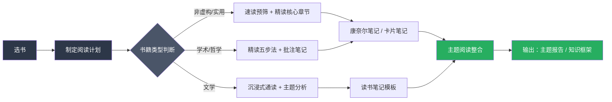

## 本节总结

具体方案部分是整章从"道"到"术"的关键转折——基础理论回答了"为什么这样读"，具体方案回答的是"具体怎么读"。本节对六大方案的核心要点进行提炼，并提供一份可直接落地的操作清单和方案选择指南。

---

### 一、六大方案核心要点回顾

#### 1.1 速读训练方案：科学提速 20%—50%

速读训练不是追求"一目十行"的神话，而是通过四周渐进式训练，消除阅读中的低效行为。四周训练的核心递进逻辑如下：

| 周次 | 训练主题 | 核心技术 | 每日时长 | 检验标准 |
|------|---------|---------|---------|---------|
| 第一周 | 眼动训练 | 减少无效回视，用手指或笔尖引导视线 | 15分钟 | 回视频率下降 30%+ |
| 第二周 | 视觉广度 | 扩大每次注视的信息获取范围，练习"块状阅读" | 15—20分钟 | 每行注视点减少 1—2 个 |
| 第三周 | 降低默读 | 减少对内部语音环路的依赖，用计数法或哼唱法干扰默读 | 15—20分钟 | 默读时嘴巴不再微动 |
| 第四周 | 综合应用 | 在真实阅读场景中灵活切换速度策略 | 20—25分钟 | 整体阅读速度提升 20%+ |

**关键前提**：速读训练建立在已有阅读习惯之上。如果你连每天阅读 10 分钟的习惯都没有，需要先回到"学习路径"的启动期，建立基础节奏后再训练提速。

**科学边界**：认知科学家基思·雷纳（Keith Rayner）2016 年发表于《Psychological Science in the Public Interest》的综述论文明确指出，保持深度理解的前提下，阅读速度上限约为每分钟 500 个英文单词（约 1000—1200 个中文字）。超过这个阈值，理解力会急剧下降。

#### 1.2 精读与笔记方法：从"读过"到"读懂"

精读五步法构建了完整的深度阅读闭环：

预读（10min）→ 标注（随读随标）→ 提问（每章结束后）→ 复述（用自己的话）→ 总结（全书笔记）

与之配套的四大笔记方法各有适用场景：

| 笔记方法 | 最佳适用场景 | 核心优势 | 学习曲线 |
|---------|------------|---------|---------|
| 康奈尔笔记法 | 课堂学习、系统性知识类书籍 | 天然的复习结构（线索→笔记→总结） | 低，10分钟掌握 |
| 思维导图 | 概念关联复杂的书籍、全局梳理 | 可视化知识网络，便于发现关联 | 中，需练习布局 |
| 卡片笔记法（Zettelkasten） | 长期知识积累、跨书关联 | 原子化存储，便于重组和检索 | 高，需持续维护 |
| 读书笔记模板 | 快速记录、批量阅读 | 标准化格式，降低记录阻力 | 最低，填表即可 |

**核心原则**：笔记不是抄书，而是"输入—处理—输出"闭环中的关键环节。不做笔记的阅读，信息在 24 小时内遗忘 70% 以上（艾宾浩斯遗忘曲线）。最有效的笔记策略是用自己的话重述——认知心理学中的"精细化编码"理论表明，深度加工的信息比浅层加工的记忆保持率高出 3—5 倍。

#### 1.3 主题阅读方案：构建系统知识框架

主题阅读是艾德勒四层阅读理论的最高层次，其本质是从"以书为中心"转变为"以问题为中心"。五步法的完整流程：

1. **确定主题与核心问题**——用一句话定义你要回答的问题，例如"如何在数字时代保持专注力"
2. **收集书单（5—10 本）**——通过豆瓣评分、学术引用、专家推荐三条路径交叉筛选
3. **检视阅读筛选**——每本书用 15—30 分钟快速判断其与主题的相关度和质量
4. **对比阅读**——建立"观点矩阵表"，将不同作者对同一问题的论述横向对比
5. **构建知识框架并输出**——写一篇主题报告，用自己的话整合所有来源的核心洞见

**实战示例**：以"习惯养成"主题为例，同时阅读《习惯的力量》《原子习惯》《掌控习惯》《微习惯》四本书。对比发现：杜希格强调"暗示—惯常行为—奖赏"回路，克利尔强调"四定律"框架，福格强调"行为=动机+能力+提示"公式。每本书侧重不同，但都指向同一个核心——习惯是可设计的系统，而非意志力的比拼。

#### 1.4 阅读计划制定：从随机阅读到系统投资

阅读计划的本质是一份"知识投资方案"。没有计划的阅读有三个致命缺陷：

- **选择瘫痪**：花在"决定读什么"上的时间比实际阅读还多
- **知识碎片化**：今天读心理学、明天读经济学，各本书之间无法连接
- **放弃率居高不下**：没有承诺装置，半途而废成为常态

年度 12 本书的推荐阅读顺序按"基础→进阶→拓展"三阶段递进，每本书配有阅读策略和预计时长。核心理念是：**质量优先于数量，一本深读的书胜过十本翻过的书。**

#### 1.5 不同类型书籍的阅读方法：对症下药

十种书籍类型对应十种阅读策略，核心差异在于知识结构：

| 书籍类型 | 知识结构 | 阅读策略 | 笔记重点 |
|---------|---------|---------|---------|
| 非虚构/实用类 | 问题—方案结构 | 先读结论，再找论据 | 行动清单 + 关键论据 |
| 文学/小说 | 情节—主题结构 | 第一遍沉浸式体验，第二遍分析结构 | 人物关系图 + 主题笔记 |
| 学术著作 | 论点—论据—结论结构 | 先读摘要和结论，再审视方法论 | 核心论证链 + 方法评估 |
| 哲学经典 | 螺旋式论证结构 | 反复研读关键段落，结合注释版 | 概念定义 + 论证逻辑图 |
| 工具书/手册 | 树状参考结构 | 按需查阅，不必通读 | 常用章节索引 |
| 传记 | 时间线性结构 | 抓住关键转折点，思考"如果是我会怎样" | 关键决策点 + 启发 |

**核心原则**：阅读策略必须匹配书籍类型。用读小说的方式读技术书会抓不住重点，用读教材的方式读哲学会丧失思辨乐趣。

#### 1.6 电子书与纸质书选择：媒介即环境

媒介选择的科学依据来自认知心理学研究：

- **纸质书**在空间定位（翻页记忆、物理厚度感知）和深度理解上略有优势，适合精读、学术阅读和长时间沉浸式阅读
- **电子书（E-Ink）**在便携性、检索效率和成本上优势明显，适合通勤阅读、快速查阅和主题阅读时的多本并读
- **有声书**在特定场景（通勤、运动、做家务）中是唯一选择，但理解深度和记忆保持率低于视觉阅读

**混合策略**：非虚构类用电子书（方便标注和检索），经典文学和需要反复翻阅的书用纸质书，通勤和碎片时间用有声书。

---

### 二、方案整合：如何组合使用

六大方案并非独立存在，而是可以组合成完整的阅读工作流。以下是三种典型的整合路径：

**路径一：新手入门路径（每周投入 3—4 小时）**

第一步，用阅读计划模板确定年度 12 本书清单，按季度分配。第二步，对每本书先用 15 分钟检视阅读判断价值。第三步，非虚构类书籍使用精读五步法配合康奈尔笔记法。第四步，每读完 3 本同主题的书，进行一次主题整合。

**路径二：效率提升路径（已有阅读习惯，想提速增效）**

第一周开始速读训练，同时保持正常阅读量。训练期间用不同速度策略处理不同类型内容——序言和结论精读，案例和故事略读，核心论证慢读。四周训练结束后，阅读速度应有 20%—50% 的可量化提升。

**路径三：知识体系构建路径（想系统学习某个领域）**

围绕目标领域选定 5—10 本书，用主题阅读五步法执行。核心工具是"观点矩阵表"——横轴是不同书籍，纵轴是该领域的核心问题，交叉格填写每位作者的立场和论据。最终输出一份 5000—10000 字的主题报告。

---

### 三、实操检查清单

以下是具体方案部分的完整行动清单，完成每一项即意味着你掌握了对应的能力：

| 序号 | 检查项 | 对应方案 | 完成标志 |
|------|-------|---------|---------|
| 1 | 完成四周速读训练 | 速读训练方案 | 阅读速度测试提升 20%+ |
| 2 | 掌握精读五步法并完成至少一本书的完整精读 | 精读与笔记方法 | 有一份完整的精读笔记 |
| 3 | 选定并使用至少一种笔记方法（康奈尔/思维导图/卡片/模板） | 精读与笔记方法 | 笔记系统运转 2 周以上 |
| 4 | 完成一个主题阅读项目（3 本以上同主题书籍） | 主题阅读方案 | 有一份主题报告或知识框架 |
| 5 | 制定年度阅读计划并执行至少 1 个月 | 阅读计划制定 | 连续 30 天按计划阅读 |
| 6 | 针对不同类型书籍分别使用正确的阅读策略 | 不同类型书籍阅读方法 | 能说出 3 种以上书籍类型的专属策略 |
| 7 | 确定自己的媒介选择策略 | 电子书与纸质书选择 | 能为每种阅读场景选择最优媒介 |

---

### 四、常见执行误区

在落地具体方案的过程中，以下几个误区最容易出现：

**误区一：同时启动所有方案。** 速读训练、精读方法、主题阅读、笔记系统……每个都想学，结果哪个都没坚持下来。正确做法是**聚焦一个方案**，稳定运行 2—3 周后再叠加下一个。优先级建议：先建立阅读计划（选书）→ 再掌握精读五步法（方法）→ 然后引入笔记系统（工具）→ 最后训练速读（效率）。

**误区二：追求完美的笔记系统。** 花大量时间搭建 Notion/Obsidian 模板，却很少实际记笔记。笔记工具是手段，不是目的。初期用最简单的方式（一个笔记本、一个文档）开始记录，等积累了 20—30 条笔记后再考虑升级工具。

**误区三：速读训练中牺牲理解力。** 为了追求速度数字，跳过关键段落，忽略论证细节。速读训练的底线是"理解力不显著下降"。每次训练后用 2—3 个问题自测理解程度，如果正确率低于 70%，说明速度过快，需要减速。

**误区四：主题阅读选书过多或过少。** 选 1—2 本书不够形成对比，选 15 本以上容易拖延。最佳数量是 5—8 本，其中 2—3 本经典必读，2—3 本当代新作，1—2 本对立观点的书。

**误区五：忽视输出环节。** 读完就放下，不做任何输出。没有输出的阅读，知识留存率通常低于 20%。最简单的输出方式是"一句话总结"——每读完一章，用一句话概括其核心观点。更高阶的输出包括读书笔记、书评、分享演讲和实际应用。

---

### 五、从方案到习惯：长期维护指南

方案的价值在于持续执行，而非一次性使用。以下是将六大方案转化为持久习惯的关键策略：

**第一，建立阅读仪式。** 固定时间（如每天早上 7:00—7:30）、固定地点（书桌前）、固定流程（倒杯水→打开书→开始阅读）。仪式感降低了启动阻力——你不需要每天做"要不要读"的决定，因为到了那个时间、那个地点，阅读就会自动发生。

**第二，设置合理的最小目标。** 每天阅读 10 分钟是最低门槛——即使再忙，10 分钟总能挤出来。行为科学家 B.J. 福格的"微习惯"理论表明，把目标缩小到"不可能失败"的程度，是建立习惯的最有效策略。一旦习惯建立，阅读时长会自然增长。

**第三，用数据追踪进度。** 记录每天的阅读时长、完成的页数、读完的书目。数据反馈是习惯维持的核心动力——看到自己连续 30 天的阅读记录，你不会想中断这个连胜。简单的表格或阅读追踪 App 即可。

**第四，定期回顾和调整。** 每月花 30 分钟回顾：这个月的阅读目标完成情况如何？笔记系统是否顺畅？速读训练效果如何？根据实际情况调整方案——阅读系统不是一成不变的，它需要随着你的成长而迭代。

**第五，找到阅读社群。** 加入读书会、线上阅读小组，或者找一个阅读伙伴。社会承诺效应（Social Commitment Effect）表明，当你的阅读目标被他人知道时，执行率会显著提高。社群还提供了讨论和分享的平台，让阅读从"独行"变成"共行"。

---

### 六、方案选择速查表

面对不同的阅读场景和目标，快速选择最合适的方案组合：

| 你的现状 | 核心瓶颈 | 推荐方案组合 | 预期见效时间 |
|---------|---------|------------|------------|
| 每年读不到 3 本书 | 没有阅读习惯 | 阅读计划制定 + 微习惯启动 | 2—4 周 |
| 读得慢，一本书要一个月 | 阅读效率低 | 速读训练方案（四周计划） | 4—6 周 |
| 读了记不住 | 缺少加工和输出 | 精读五步法 + 康奈尔笔记法 | 2—3 周 |
| 读了很多但感觉没用 | 知识碎片化 | 主题阅读方案 + 卡片笔记法 | 6—8 周 |
| 不知道读什么 | 选书无方向 | 阅读计划制定（年度书单） | 1 周 |
| 不同书用同一种方法读 | 缺乏策略灵活性 | 不同类型书籍阅读方法 | 1—2 周 |
| 纠结电子书还是纸质书 | 媒介选择困惑 | 电子书与纸质书选择指南 | 1 天 |

这六大方案构成了一个完整的阅读能力工具箱。你不需要同时掌握所有方案——根据自己的当前阶段和核心瓶颈，选择 1—2 个方案开始执行，在实践中逐步叠加和完善。阅读能力的提升是一个渐进过程，每一天的坚持都在为你的知识复利账户存入本金。
