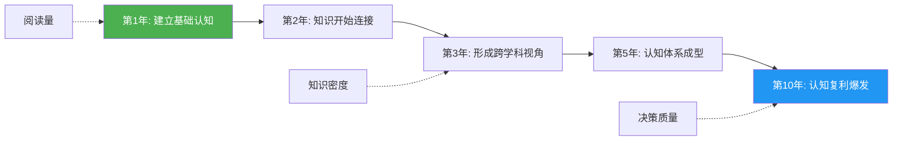
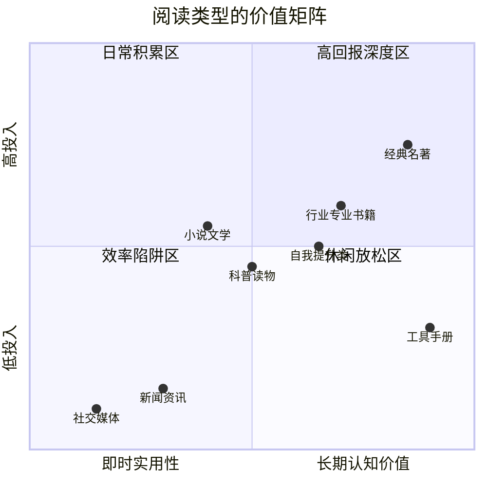
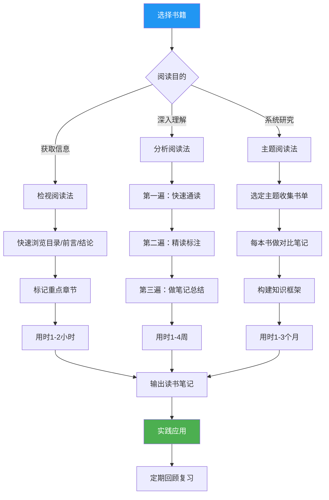

## 第一节 阅读的价值：为什么阅读是最重要的个人投资

很多人把阅读当作消遣，有人觉得刷短视频、听播客同样能获取信息。但事实是：**阅读是人类已知的、投入产出比最高的自我投资方式**。一本书几十块钱，几个小时的投入，换来的可能是改变一生的认知升级。本节将从认知科学、职业发展、财务回报、身心健康四个维度，系统论证阅读为何值得你投入最宝贵的时间资源。

---

### 一、阅读的本质：用最低成本获取他人的毕生智慧

#### 1.1 知识传递的效率悖论

一个行业专家积累20年经验，写成一本书，你花20小时就能读完。这意味着你用**不到千分之一的时间**，获取了对方的核心认知。这种知识压缩率在人类历史上前所未有。

考虑以下对比：

| 知识获取方式 | 时间成本 | 金钱成本 | 知识密度 | 可反复参考 |
|:---|:---|:---|:---|:---|
| 自己摸索试错 | 数年至数十年 | 难以估量 | 零散、片面 | 依赖记忆 |
| 请私人导师/顾问 | 数百小时 | 数万至数十万 | 高度定制 | 需预约 |
| 参加培训课程 | 数十小时 | 数千至数万 | 系统但有限 | 部分可回看 |
| **阅读书籍** | **数小时至数十小时** | **几十元** | **系统、深入** | **永久可查阅** |
| 刷短视频/播客 | 碎片化 | 免费或低价 | 零散、浅层 | 难以系统回顾 |

阅读的独特优势在于：**它是唯一能让你以个人节奏、反复深入、系统构建知识体系的方式**。视频和音频强制你跟随制作者的节奏，而阅读时你的大脑可以随时暂停、回溯、联想、质疑——这恰恰是深度理解发生的时刻。

#### 1.2 "站在巨人的肩膀上"不是比喻

牛顿说这句话时是认真的。科学进步的本质就是在前人基础上叠加，个人成长也是如此。一个不阅读的人，只能从自己的直接经验中学习；一个大量阅读的人，可以同时从数百人的经验中提取规律。

举个具体例子：你想提升沟通能力。如果不阅读，你可能需要经历数十次失败的对话、得罪几十个客户、丢失几笔订单，才能慢慢摸索出一些规律。但如果你读了《非暴力沟通》《关键对话》《影响力》这三本书，你可以在几周内掌握经过全球数百万读者验证的沟通框架，然后在实际场景中有的放矢地练习。

---

### 二、认知维度：阅读如何重塑你的大脑

#### 2.1 神经可塑性：阅读改变大脑物理结构

这不是鸡汤，而是神经科学的硬事实。卡内基梅隆大学的研究发现，**持续阅读训练会增加大脑胼胝体（连接左右脑的神经纤维束）的厚度**，增强两个脑半球之间的信息传递效率。

具体来说，阅读对大脑的改造包括：

- **增强工作记忆容量**：阅读长文时，大脑需要同时维持多个信息线索，这等同于对工作记忆的持续训练
- **强化前额叶皮层功能**：负责逻辑推理、决策判断的脑区在深度阅读时被大量激活
- **扩展语言相关脑区**：布洛卡区和韦尼克区的灰质密度随阅读量增加而提升
- **增强默认模式网络连接**：这个脑网络负责创造性思维和自我反思，阅读是少数能有效激活它的方式之一

#### 2.2 认知储备：对抗大脑衰老的护城河

《神经病学》期刊发表的一项长达14年的追踪研究（涉及29,318名参与者）发现：**每天阅读30分钟以上的人，认知衰退速度比不阅读的人慢32%**。

这个机制叫做"认知储备"（Cognitive Reserve）——持续的智力刺激会在大脑中建立额外的神经连接，即使部分神经元因衰老或疾病受损，大脑仍然可以通过替代通路维持功能。阅读是构建认知储备最有效的方式之一，因为它是少数能同时激活视觉处理、语言理解、逻辑推理、情感共情、记忆提取等多个脑区的活动。

#### 2.3 专注力的稀缺性与阅读的训练价值

在注意力碎片化的时代，**持续专注的能力正在成为最稀缺的认知资源**。神经科学家赫尔曼·希策尔（Hermann Hitzl）的研究表明：频繁切换任务（刷手机、看短视频）会导致前扣带回皮层灰质密度下降，而这个脑区正是负责注意力控制的关键区域。

深度阅读是对抗注意力碎片化的天然训练。当你沉浸在一本书中30分钟以上时，大脑会进入"心流"状态，前额叶皮层和默认模式网络形成高效协作。长期坚持阅读的人，其**持续注意力持续时间比平均水平长40%-60%**，这种能力会迁移到工作和生活的方方面面。

---

### 三、职业与财务维度：阅读的投资回报率

#### 3.1 阅读量与收入的相关性

这组数据来自多个独立研究，结论高度一致：

- 马尔科姆·格拉德威尔在《异类》中指出，要达到某个领域的专家水平，需要约10,000小时的刻意练习。**系统阅读是加速这个过程最高效的方式**。
- 皮尤研究中心调查发现：年收入超过75,000美元的群体中，有86%有规律的阅读习惯；而年收入低于30,000美元的群体中，这一比例仅为58%。
- 汤姆·科利在《富有的习惯》中追踪了233位百万富翁，发现**88%的富人每天至少阅读30分钟**，且主要阅读非虚构类——自我提升、行业知识、传记、历史。

相关性不等于因果性，但背后的机制很清楚：**阅读提升认知能力→更好的决策→更多的机会→更高的收入**。

#### 3.2 领导力与阅读的关系

几乎所有顶级领导者都是重度阅读者，这不是巧合：

- **比尔·盖茨**：每年阅读约50本书，每周至少一本，并坚持写读书笔记
- **沃伦·巴菲特**：每天花80%的时间阅读，他说"我的工作就是阅读"
- **埃隆·马斯克**：少年时每天阅读10小时，自述火箭知识来自阅读
- **查理·芒格**：被称为"行走的书架"，认为"我这辈子遇到的聪明人没有不每天阅读的，一个都没有"
- **任正非**：华为内部推荐阅读书单涵盖哲学、历史、管理、军事等多个领域

这些领导者之所以重视阅读，是因为**高阶决策需要跨学科知识的整合能力**——你不可能每个领域都亲身体验，但你可以通过阅读建立足够深入的框架性理解。

#### 3.3 阅读的复利效应

阅读的回报不是线性的，而是**指数型的**。原因有三：

1. **知识网络效应**：每读一本书，你获取的知识会和已有知识产生连接。读得越多，新知识能挂靠的"锚点"越多，理解速度越快。这就是为什么一个读过100本书的人读第101本书的速度和理解深度，远超只读过10本书的人读第11本。
2. **决策质量提升**：阅读积累的框架和模型会渗透到你的每一个决策中。一个了解博弈论、概率思维、心理学偏见的人，在投资、职业选择、人际交往中的决策质量会显著高于不阅读的人。
3. **机会识别能力**：阅读拓宽你的认知边界，让你能看到别人看不到的机会。很多创业灵感、投资机会、职业转折都来源于某本书中的一个概念或案例。

---

### 四、心理与健康维度：阅读的疗愈价值

#### 4.1 压力管理：阅读是最高效的减压方式之一

萨塞克斯大学（University of Sussex）2009年的研究发现：**仅阅读6分钟就能将压力水平降低68%**，效果优于听音乐（61%）、喝咖啡（54%）、散步（42%）。

这个效果的机制是：阅读时大脑需要专注于文字所构建的世界，这种沉浸式体验迫使你的注意力从压力源（工作、人际、经济）中脱离出来。当你的注意力被重新定向，应激激素皮质醇的水平会自然下降。

#### 4.2 共情能力：小说读者更懂人心

这不只是直觉，有严格的实验支持。《科学》（Science）杂志2013年发表的一项研究发现：**阅读文学小说能显著提升"心智理论"（Theory of Mind）能力**——即理解他人心理状态的能力。

实验中，阅读文学小说的受试者在识别他人情绪、理解他人观点方面的得分，显著高于阅读非虚构类书籍或不阅读的对照组。这是因为文学小说迫使你从角色的视角看世界，体验你永远不会亲身经历的人生——一个70岁日本老人的孤独，一个19世纪英国女工的挣扎，一个自闭症儿童的内心世界。

#### 4.3 睡眠质量：阅读是最优的睡前活动

哈佛医学院睡眠医学系的建议是：**睡前30-60分钟阅读纸质书是最佳的入睡准备活动**（注意：是纸质书，不是电子屏幕）。阅读会帮助大脑从高频β波（紧张状态）过渡到低频α波（放松状态），为进入θ波（睡眠状态）做准备。

不过要注意区分：睡前阅读的目的是让大脑慢下来，所以应该选择轻松、缓慢节奏的内容，而不是让人兴奋的悬疑小说或引发焦虑的工作相关书籍。

#### 4.4 长寿关联：阅读者活得更长

耶鲁大学公共卫生学院发表在《社会科学与医学》期刊上的研究（涉及3,635名50岁以上参与者，追踪12年）发现：**每周阅读书籍3.5小时以上的人，比不阅读的人平均多活23个月**。阅读组的死亡风险降低了20%，这个效果在控制了教育、收入、健康状况等变量后仍然显著。

研究者认为，阅读通过三条路径影响寿命：

1. **认知保持**：延缓认知衰退，降低阿尔茨海默病风险
2. **压力缓冲**：慢性压力是心血管疾病的主要风险因素，阅读有效降低压力
3. **社交连接**：阅读者更可能参与读书会等社交活动，而社交孤立是比吸烟更危险的死亡风险因素

---

### 五、破除常见的反阅读偏见

#### 5.1 "我没时间阅读"

这是最常见的借口，也是最容易反驳的。

**事实计算**：一个普通人的阅读速度约为每分钟300-500个汉字。一本普通书籍约15-25万字。按每分钟400字计算，读完一本20万字的书需要500分钟，即约8.3小时。如果每天阅读30分钟（通勤、午休、睡前），一个月就能读完2-3本书。一年就是24-36本书。

对比一下：中国成年人日均使用手机的时间约为6.5小时（QuestMobile 2024数据）。其中有多少是有效信息获取，有多少是无意识的"杀时间"？**你不是没有时间阅读，你只是把时间花在了别处。**

实操建议：不要一开始就挑战每天1小时。从每天10分钟开始——等公交车时、午休前、睡觉前。习惯建立后再逐步增加。

#### 5.2 "我记不住读过的内容"

这个担忧是合理的，但解决方案不是"不读"，而是"改变读法"。

认知科学中有个概念叫"间隔效应"（Spacing Effect）：**信息在被反复接触后才能进入长期记忆**。只读一遍不做任何加工，遗忘是正常的——艾宾浩斯遗忘曲线告诉我们，不复习的情况下，24小时后会遗忘约70%的内容。

正确的做法：

- **读完后立即用自己的话总结核心观点**（哪怕只写3句话）
- **一周后回顾笔记**
- **一个月后再回顾一次**
- **将知识应用到实际场景中**（最有效的记忆方式）

即使不做任何笔记，阅读也不是白费的。已有的认知研究表明：阅读过但"忘记"的内容会以"隐性知识"的形式影响你的判断和直觉。你可能说不清某本书讲了什么，但书中的思维方式已经潜移默化地改变了你。

#### 5.3 "看视频/听播客一样能学到东西"

能，但不一样。

视频和音频是**被动接收**，信息流以制作者的速度推送给你。你来不及暂停思考，来不及质疑论据，来不及联想到自己的经验。MIT的一项研究发现：学生通过视频学习时的笔记准确率比通过阅读学习低27%，而概念迁移能力（将知识应用到新场景的能力）低35%。

视频和音频的优势在于**快速入门**和**情感感染力**——一个TED演讲可能比一本书更能点燃你的热情。但要真正理解和内化知识，阅读仍然是不可替代的。最佳策略是**互补使用**：用视频/播客激发兴趣和获取概览，用阅读深入理解和系统构建。

#### 5.4 "电子时代，文字会被取代"

恰恰相反。互联网时代信息爆炸的结果是：**筛选和深度理解信息的能力变得更重要了**。能够快速阅读、批判性评估、系统整合信息的人，在信息洪流中如鱼得水；而无法做到这些的人，则在碎片信息的冲刷下越来越焦虑和迷茫。

世界经济论坛《未来就业报告》持续将"批判性思维"和"分析能力"列为最重要的职业技能。这两种能力的核心训练方式就是深度阅读。

---

### 六、不同类型阅读的差异化价值

并非所有阅读的价值都相等。理解不同阅读方式的价值差异，能帮助你更聪明地分配阅读时间。

#### 6.1 高价值阅读：经典与系统性书籍

**特征**：经过时间检验、知识密度高、逻辑严密。这类书的价值在于为你建立**持久的心智模型**——一种可以反复应用于不同场景的思维框架。

例子：《思考，快与慢》教会你的不只是心理学知识，而是一种识别认知偏差的思维习惯；《穷查理宝典》教会你的不只是投资技巧，而是一种多元思维模型的决策方法。

#### 6.2 中等价值阅读：行业书籍与实用指南

**特征**：直接服务于你的职业发展，解决具体问题。这类书的价值在于**即时可应用**——读完就能用，用了就有反馈。

#### 6.3 低价值阅读：新闻资讯与社交媒体

**特征**：信息衰减速度极快（新闻的"保质期"通常只有几天），缺乏系统性，容易制造焦虑。偶尔浏览没问题，但如果这占据了你大部分阅读时间，就是一种**认知资源的错配**。

---

### 七、阅读价值的量化模型

为了让"阅读是最佳投资"这个论点更加具体，我们可以建立一个简单的量化模型。

假设你每个月花20小时阅读（平均每天40分钟），一年读30本书。

**成本计算**：
- 时间成本：20小时 × 12月 = 240小时/年
- 金钱成本：30本书 × 50元 = 1,500元/年（或通过图书馆、电子书平台进一步降低）
- **总成本约为：240小时 + 1,500元**

**收益估算**：
- 职业能力提升：如果阅读帮助你在工作中做出哪怕一个更好的决策，其价值可能远超1,500元
- 薪资增长：大量研究表明，持续学习与薪资增长正相关。保守估计，系统阅读每年为你的"能力资本"增值5%-10%
- 健康收益：如果阅读帮助你减少压力相关疾病的风险，节省的医疗费用和时间成本难以估量
- 认知保持：23个月的预期寿命延长（耶鲁研究数据），这如何定价？

用投资术语来说：**阅读是你能找到的、风险最低、回报最高的投资标的之一**。它没有市场波动风险，不会因为政策变化而清零，而且随着时间推移，回报率只增不减。

---

### 八、从今天开始的行动指南

理解了阅读的价值后，关键问题是：如何开始？

#### 8.1 高效阅读方法流程图

#### 8.2 启动步骤（按优先级排列）

1. **今天**：选定一本书。如果不知道选什么，从你当前最想解决的一个问题入手——沟通、投资、职业规划、健康——然后在豆瓣或Goodreads上找该主题评分最高的书
2. **今晚**：睡前阅读15分钟。不求速度，不求笔记，只求翻开书
3. **本周**：找到固定的阅读时段。可以是通勤路上、午休时间、睡前——关键是固定，让它变成习惯
4. **本月**：读完一本书。不贪多，先完成一本完整的书带来的成就感，比半途而废地翻了五本书有价值得多
5. **本季度**：建立个人书单系统。记录想读的书、已读的书、每本书的核心收获

> **关键认知**：阅读不是奢侈品，而是必需品。在一个变化速度越来越快的世界里，不阅读的人不是在"保持现状"，而是在**相对倒退**。每读一本书，你都在给自己安装一个新的认知操作系统版本。长期不更新的操作系统，终将被时代淘汰。

---

### 本节小结

| 维度 | 核心论点 | 关键证据 |
|:---|:---|:---|
| 认知价值 | 阅读重塑大脑结构，增强专注力和记忆力 | 胼胝体厚度增加，专注力提升40%-60% |
| 职业价值 | 阅读量与收入、领导力高度正相关 | 88%百万富翁每天阅读30分钟以上 |
| 健康价值 | 阅读降低压力、延缓衰老、延长寿命 | 6分钟阅读降低66%压力，延长23个月寿命 |
| 心理价值 | 阅读增强共情能力，改善睡眠质量 | 文学小说读者心智理论得分显著更高 |
| 经济价值 | 阅读是风险最低、回报最高的个人投资 | 30本书/年 ≈ 1500元，回报难以估量 |
