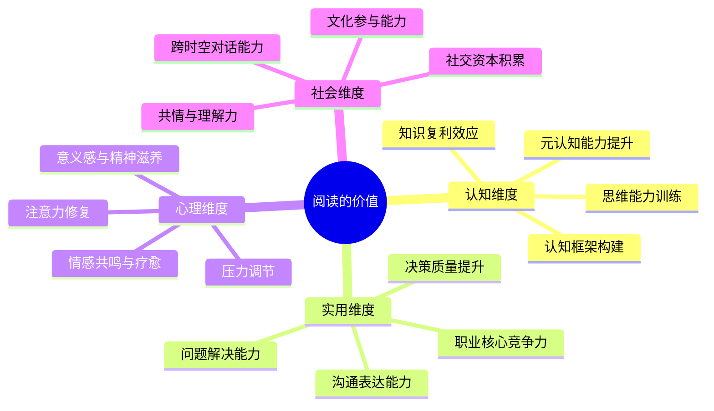

## 阅读的认知价值

在所有个人成长活动中，阅读的投入产出比几乎无可匹敌。一本售价几十元的书，凝聚了作者数年甚至数十年的研究成果、实践经验和思考结晶。通过阅读，我们以极低的时间和金钱成本，获取了他人毕生的智慧。查理·芒格曾说："我这辈子遇到的聪明人，没有不每天阅读的——没有，一个都没有。"这句话揭示了一个朴素但深刻的真相：阅读与认知能力之间存在强烈的正相关关系。

但"阅读很重要"这个判断，如果只停留在口号层面，就无法指导行动。本节将从认知科学、实用技能、心理健康、社会关系四个维度，系统拆解阅读到底如何改变一个人的大脑、能力和命运——以及为什么这些改变是不可替代的。



### 一、认知维度：阅读如何重塑你的大脑

#### 1.1 知识复利效应

每一次阅读都是一次知识输入。但阅读的积累不是线性的，而是复利式的。这个比喻来自金融领域：复利的核心不是本金的大小，而是时间的长度和再投资的频率。知识积累遵循同样的规律。

**具体机制。** 当你读第一本心理学入门书时，你需要理解大量全新的概念——认知偏差、条件反射、图式理论——每一个概念都需要从零开始建立。但当你读第二本心理学书时，第一本书建立的概念网络就成了"脚手架"，新知识可以直接挂载到已有的框架上，理解速度大幅提升。读到第十本心理学书时，你几乎只需要关注作者独特的见解和最新的研究发现，因为你已经掌握了这个领域的基础语言。

**量化理解。** 假设每读一本书需要理解100个新概念。一个读过10本书的人，其知识库中已有约1000个概念（考虑遗忘和重叠后约500个有效概念）。第11本书的100个新概念中，可能有60个与已有知识产生关联，只需要真正"从零理解"40个。而一个只读过2本书的人，可能需要从零理解其中的80个。这就是为什么同样一本中等难度的书，阅读量大的人2天能读完，阅读量小的人可能需要2周——他们付出的认知努力完全不同。

**边际收益递减？** 有人会问：读到一定程度后，收益会不会递减？答案是：在单一领域内会，但跨领域阅读会重新激活复利效应。一个只读经济学的人，读到第50本经济学书时边际收益确实降低了。但如果他开始读生物学，他会发现演化论的框架可以用来理解市场行为，系统论的概念可以用来分析经济周期——跨领域的知识碰撞会产生"知识组合爆炸"，创造全新的理解维度。这正是查理·芒格所强调的"多元思维模型"的核心逻辑。

#### 1.2 思维能力训练

阅读不仅是信息的接收，更是思维的操练。不同类型的阅读材料训练不同的思维能力：

| 阅读类型 | 训练的核心能力 | 训练机制 | 典型材料 |
|----------|--------------|---------|---------|
| 学术著作 | 逻辑推理、论证分析 | 追踪作者的论证链条，评估证据的有效性 | 《思考，快与慢》《枪炮、病菌与钢铁》 |
| 长篇小说 | 共情能力、想象力、叙事思维 | 跟随角色经历复杂的情感变化和人生选择 | 《百年孤独》《卡拉马佐夫兄弟》 |
| 商业案例 | 分析判断、决策思维 | 在不完全信息下评估选项、预测结果 | 《从0到1》《创新者的窘境》 |
| 哲学著作 | 概念分析、批判性思维 | 拆解抽象概念，评估论证的有效性 | 《苏菲的世界》《正义论》 |
| 科普读物 | 类比思维、模型思维 | 将复杂现象转化为可理解的模型 | 《自私的基因》《规模》 |
| 历史著作 | 因果推理、模式识别 | 从大量事件中提取因果关系和历史规律 | 《人类简史》《万历十五年》 |

**为什么阅读训练思维的效果优于其他方式？** 原因在于阅读的"可暂停性"。与对话、视频、演讲不同，阅读允许你在任何一个节点停下来思考。遇到一个精彩的论证，你可以反复阅读、拆解其逻辑结构；遇到一个反直觉的结论，你可以暂停去检验其前提假设是否成立。这种"可控的认知负荷"使得阅读成为深度思维训练的最佳载体。

**批判性思维的培养路径。** 阅读对批判性思维的培养经历三个阶段：

1. **被动接收阶段（阅读量 < 30本）。** 读者倾向于全盘接受作者的观点，缺乏质疑意识。这个阶段是正常的——你需要先积累足够的知识基础，才有能力进行有效的批判。
2. **主动质疑阶段（阅读量 30-100本）。** 随着阅读量增加，你开始发现不同作者之间的矛盾和分歧，学会追问"这个结论的证据是什么？""有没有反例？""作者的立场和利益是否影响了他的判断？"
3. **综合评估阶段（阅读量 > 100本）。** 你能够在多个竞争性观点之间进行权衡，识别每个观点的适用条件和局限性，形成自己的独立判断。你不再非此即彼，而是能够理解"在什么条件下，哪个观点更接近真相"。

#### 1.3 认知框架构建

真正有价值的阅读，不是积累零散的知识点，而是构建认知框架。所谓认知框架，就是你理解世界的"透镜"。

**框架 vs. 知识点的区别。** 知识点是离散的——"供求关系影响价格"是一个知识点。框架是系统性的——经济学思维是一个框架，它不仅包含供求关系，还包含边际效用、机会成本、外部性、博弈论等一系列相互关联的概念，以及这些概念之间的逻辑关系。知识点告诉你"是什么"，框架告诉你"怎么想"。

**不同学科提供的核心框架：**

| 学科 | 核心框架 | 能解释的现象 |
|------|---------|------------|
| 经济学 | 供需均衡、边际分析、博弈论 | 市场行为、政策效果、商业策略 |
| 心理学 | 认知偏差、动机理论、社会影响 | 人的行为模式、决策失误、群体行为 |
| 生物学 | 演化论、生态系统、基因-环境交互 | 竞争与合作、适应与淘汰、多样性 |
| 物理学 | 系统论、熵增定律、反馈回路 | 复杂系统、组织管理、技术演化 |
| 历史学 | 长周期规律、制度演化、路径依赖 | 文明兴衰、社会变迁、政策效果 |
| 哲学 | 逻辑学、伦理学框架、认识论 | 价值判断、论证有效性、知识边界 |

**框架升级的标志。** 当你面对一个新问题时，能够自发地从多个框架去分析它——比如看待"为什么某个创业公司失败了"这个问题，你同时运用经济学框架（市场容量不足）、心理学框架（创始人过度自信）、生物学框架（未能适应环境变化）——说明你的认知框架已经从单一走向多元。这种多元框架视角，是高水平决策者的核心特征。

#### 1.4 元认知能力提升

阅读的最高层次价值，不是让你知道更多，而是让你更清楚自己"知道什么、不知道什么、以及如何知道自己不知道"——这就是元认知。

**阅读如何提升元认知。** 当你大量阅读后，你会反复遇到一种体验：读到某个领域的深入内容时，突然意识到自己此前对这个领域的理解是多么浅薄和片面。这种"认知谦逊"的体验，正是元认知能力提升的标志。一个读过很多书的人，比一个不读书的人更清楚知识的边界在哪里——他知道自己擅长什么，也知道自己的盲区在哪里。这种自我认知，是高效学习和高质量决策的基础。

### 二、实用维度：阅读如何改变你的现实处境

#### 2.1 问题解决能力

你遇到的绝大多数问题，别人都已经遇到过，并且写成了书。

**这个判断为什么成立？** 原因很简单：人类文明已有数千年的文字历史，全球每年出版超过200万种新书。在这个体量下，几乎所有个人层面的问题——职业困惑、人际关系、健康管理、财务规划、心理调适——都有人经历过、研究过、写过。一个善于通过阅读寻找答案的人，相当于拥有一个随叫随到的专家顾问团，而且费用仅为几十元一本书。

**从阅读到问题解决的路径：**

1. **问题定义。** 很多时候，我们无法解决问题，是因为没有准确定义问题。阅读帮你看到问题的多种定义方式——你觉得自己"拖延"，但读了心理学书后发现，你可能不是拖延，而是完美主义导致的启动困难。不同的问题定义，指向完全不同的解决方案。
2. **方案获取。** 一旦问题被准确定义，书籍提供了系统化的解决方案。与搜索引擎给出的碎片化建议不同，一本好的方法论书籍会给出完整的原则、步骤、案例和注意事项。
3. **方案评估。** 阅读多本相关书籍后，你可以对比不同作者的方案，评估各自的适用条件和局限性，选择最适合你具体情况的方法。
4. **实施指导。** 书籍中的详细步骤和真实案例，为方案的实施提供了可操作的路线图。

#### 2.2 职业核心竞争力

在知识经济时代，学习速度就是核心竞争力。那些能够快速学习新领域知识、持续更新技能的人，在职场中具有显著优势。

**为什么阅读是职业发展的"底层操作系统"？** 职业能力可以分为三层：

- **表层技能：** 具体的工具使用、编程语言、行业知识。这些变化最快，需要持续更新。
- **中层能力：** 分析思维、沟通表达、项目管理、团队协作。这些相对稳定，但在不同场景下需要灵活运用。
- **底层认知：** 理解复杂系统的能力、在不确定性中决策的能力、快速学习新领域的能力。这些最为稳定，也最难培养。

阅读对三层能力都有贡献，但其最独特的价值在于底层认知的培养。一个广泛阅读的人，拥有更丰富的思维模型、更强的模式识别能力和更敏锐的判断力——这些底层能力会"向上渗透"，提升他在具体技能和中层能力上的表现。

**行业领袖的阅读习惯。** 比尔·盖茨每年阅读约50本书，并坚持写书评。埃隆·马斯克被问到如何学会造火箭时回答："我读了很多书。"沃伦·巴菲特每天花费80%的时间在阅读上。这些并非名人轶事，而是职业精英的共同模式——他们的阅读习惯直接推动了他们的创新成就。

#### 2.3 沟通与表达能力

广泛的阅读会显著扩展你的词汇量、丰富你的表达方式、提升你的逻辑组织能力。

**词汇量的"输入-输出"关系。** 语言学研究表明，一个人的主动词汇量（能够自如使用的词汇）大约是其被动词汇量（能够理解的词汇）的60-70%。阅读是扩大被动词汇量最高效的方式——你在语境中遇到新词，通过上下文理解其含义和用法，远比背单词表更有效。当被动词汇量增长后，主动词汇量也会随之提升，你的表达自然变得更加精确和丰富。

**逻辑组织能力的迁移。** 当你阅读大量论证严密的文章和书籍后，你会潜移默化地吸收作者的论证结构：如何提出论点、如何组织论据、如何处理反驳、如何得出结论。这种结构化思维能力会直接迁移到你的写作和口头表达中。

**"潜移默化"的科学解释。** 认知科学中有一个概念叫"内隐学习"（implicit learning）——你不需要有意识地学习规则，通过大量接触范例，大脑会自动提取其中的模式。阅读优质文本正是内隐学习的最佳场景：你不需要刻意背诵好句子或分析段落结构，大量优质输入本身就会重塑你的语言输出能力。

#### 2.4 决策质量提升

阅读对决策质量的提升，是其最被低估的实用价值之一。

**决策质量 = 信息质量 × 思维框架质量 × 情绪管理质量。** 阅读同时提升这三个因素：

- **信息质量：** 阅读提供系统化、经过验证的信息，远优于社交媒体和碎片化资讯。
- **思维框架质量：** 多元思维模型让你从更多角度分析问题，减少盲区。
- **情绪管理质量：** 心理学和哲学阅读帮助你识别和管理情绪对决策的干扰。

### 三、心理维度：阅读如何守护你的内在世界

#### 3.1 压力调节

英国萨塞克斯大学（University of Sussex）2009年的研究发现，仅仅6分钟的阅读就能将压力水平降低68%，效果优于听音乐（降低61%）、喝咖啡（降低54%）和散步（降低42%）。阅读能够使肌肉放松、心率减慢，产生类似于冥想的效果。

**为什么阅读的减压效果如此显著？** 心理学家认为，阅读的减压机制包含两个层面：

1. **注意力转移。** 当你沉浸在一本书中时，你的注意力从自身的压力源转移到书中的内容上。这种转移不是简单的"分心"，而是一种深度的认知投入——大脑被书中的情节、论证或观点所占据，没有剩余的认知资源去反刍压力事件。
2. **认知重构。** 阅读提供了看待问题的新视角。当你读到书中人物面临的困境远比你的更严峻，或者读到某种应对逆境的哲学时，你对自身处境的评估会发生改变——这就是认知行为疗法中的"认知重构"，而阅读是触发这种重构的天然途径。

**阅读 vs. 其他减压方式的对比：**

| 减压方式 | 减压效率 | 认知投入度 | 附加价值 | 可及性 |
|---------|---------|----------|---------|-------|
| 阅读 | 极高（-68%） | 高 | 知识增长、思维训练 | 随时随地 |
| 冥想 | 高 | 中 | 注意力训练 | 需要安静环境 |
| 运动 | 高 | 低 | 身体健康 | 需要场地/设备 |
| 听音乐 | 中高（-61%） | 低 | 情绪调节 | 随时随地 |
| 社交聊天 | 中 | 中 | 人际关系 | 需要他人配合 |
| 刷短视频 | 低-中 | 低 | 几乎为零 | 随时随地 |

#### 3.2 情感共鸣与自我认知

文学作品——尤其是优秀的长篇小说——提供了一种独特的情感体验：你可以在安全的环境中，经历他人的人生。

**"叙事传输"理论。** 心理学家梅勒妮·格林（Melanie Green）提出的"叙事传输"（narrative transportation）理论解释了文学阅读的心理机制：当你深度沉浸在一个故事中时，你会暂时"离开"自己的现实世界，进入故事的世界。在这个过程中，你的情绪系统会对故事中的事件产生真实的情感反应——为角色的成功而喜悦，为角色的困境而焦虑，为角色的失败而悲伤。这种情感体验，比任何说教都更能培养共情能力。

**自我认知的深化。** 当你读到某个角色面临的困境与你相似时，你不仅获得了"我不是一个人"的安慰，更获得了看待问题的新视角。心理学家发现，阅读文学作品能够显著提升"心智理论"（Theory of Mind）——即理解他人心理状态的能力。2013年发表在《科学》杂志上的研究（Kidd & Castano）证实，阅读文学小说（而非通俗小说或非虚构类）能够显著提升被试的共情能力和社会认知。

#### 3.3 意义感与精神滋养

在快节奏的现代生活中，许多人感到精神上的空虚和意义感的缺失。哲学、文学、宗教类的阅读能够帮助我们思考更深层的人生问题——我是谁？我要去哪里？什么是有意义的生活？

**"大问题"的阅读路径。** 面对存在性问题，阅读提供了一种独特的优势：你可以与人类历史上最伟大的思想者进行"对话"。你可以通过亚里士多德理解"幸福"（eudaimonia）的本质，通过加缪理解荒谬与反抗，通过维克多·弗兰克尔理解苦难中的意义，通过王阳明理解知行合一。这些思想者花费一生去思考的问题，你可以通过阅读在几周内接触到他们的核心洞见。

#### 3.4 注意力修复

在信息碎片化的时代，阅读还有一个独特的心理价值——它是注意力的"健身房"。

**深度阅读与注意力的关系。** 神经科学研究表明，长期的碎片化信息消费（刷短视频、浏览社交媒体）会削弱大脑维持持续注意力的能力。而深度阅读——持续30分钟以上、不受干扰地阅读一本书——恰恰是对抗这种退化的最佳训练。当你强迫自己在没有外部刺激的情况下持续专注于一个主题时，你在重建大脑的注意力回路。这种训练效果会迁移到工作和学习中，提升你在所有需要持续注意力的任务上的表现。

### 四、社会维度：阅读如何扩展你的世界

#### 4.1 跨时空对话能力

阅读是人类唯一能够跨越时间和空间进行思想交流的方式。通过阅读，你可以与2000年前的孔子对话，与100年前的爱因斯坦交流，与当代的思想领袖辩论。这种跨时空的对话能力，是其他任何活动都无法提供的。

**为什么这种对话有价值？** 因为不同历史时期的人面对不同的环境，发展出了不同的智慧。古希腊人对德性的思考、先秦诸子对治国理政的探讨、启蒙时代对自由与理性的反思、当代科学家对复杂系统的理解——这些智慧散布在不同时代和文化中，只有通过阅读才能将它们汇聚到你一个人的头脑中。这种汇聚，正是创新的源泉。

#### 4.2 社交资本积累

阅读扩展你的谈资和视野，使你能够与更广泛的人群进行有意义的交流。

**"弱连接"理论的应用。** 社会学家马克·格兰诺维特（Mark Granovetter）的"弱连接的强度"理论指出，真正为你带来新机会的，往往不是亲密的强关系，而是不太熟悉的弱关系。广泛阅读使你能够与来自不同背景的人找到共同话题，建立和维护这些弱连接。一个只关注自己专业领域的人，很难与跨行业的人进行深入对话；而一个广泛阅读的人，可以与工程师谈哲学、与艺术家谈科学、与商人谈历史——这种跨界交流能力，在知识经济时代极其珍贵。

#### 4.3 共情与理解力

在日益多元化的社会中，理解和包容不同观点、不同文化、不同生活方式的能力变得越来越重要。阅读——尤其是文学和历史阅读——是培养这种能力的最佳途径。

**"走出回音室"的工具。** 算法推荐使我们越来越容易被困在"信息茧房"中，只接触到与自己观点一致的内容。而一本书是作者独立思考的完整呈现，不受算法操控。当你主动选择阅读与自己观点不同的书籍时，你在训练自己"站在对方立场思考"的能力——这在观点极化的时代尤为珍贵。

### 五、阅读 vs. 其他学习方式：为什么阅读不可替代

有人会问：在视频课程、播客、在线学习平台如此发达的今天，阅读还有独特价值吗？

| 维度 | 阅读 | 视频课程 | 播客/音频 | 实践经验 |
|------|------|---------|----------|---------|
| 信息密度 | 极高（每分钟可获取200-400词） | 中等（含冗余讲解和视觉装饰） | 低-中（受限于口语速度） | 低（需要大量试错） |
| 深度 | 可自由控制，可反复精读 | 受限于课程设计 | 较浅，不适合复杂论证 | 深，但缺乏系统性 |
| 可暂停性 | 完全可控 | 可暂停，但节奏受视频影响 | 可暂停，但不便回看细节 | 不适用 |
| 知识体系化 | 强（一本书即一个体系） | 中等（取决于课程质量） | 弱（通常是碎片化讨论） | 极弱（经验难以体系化） |
| 认知负荷管理 | 读者自主控制 | 由讲师控制 | 由讲述者控制 | 由环境决定 |
| 成本 | 极低（几十元/本） | 中等（几百到几千元） | 免费-低 | 高（时间+机会成本） |
| 适用场景 | 深度学习、系统学习 | 技能演示、操作教学 | 信息获取、灵感激发 | 技能熟练、验证知识 |

**阅读的独特优势在于"可暂停性"和"信息密度"的结合。** 视频虽然直观，但你无法以两倍速跳过一个论证的中间步骤然后回头细看某个关键环节——至少不像阅读那样自然。播客虽然方便，但口语的信息密度远低于书面语。实践经验虽然深刻，但成本高且难以传递。阅读在深度、效率和灵活性上的综合优势，使其成为知识获取的核心方式——其他方式是补充，不是替代。

### 六、常见认知误区

**误区一："读了记不住，等于白读。"**
纠正：阅读的价值不在于记住每一个细节，而在于改变你的思维结构。即使你忘记了具体的内容，阅读过程中建立的概念框架、培养的思维方式和扩展的视野都会留下来。就像你不会记住每一顿饭的每一口食物，但它们都成为了你身体的一部分。

**误区二："读书太慢，不如看短视频学得快。"**
纠正：学习速度 ≠ 信息获取速度。短视频给你的是碎片化的信息片段，缺乏上下文和论证过程。一本书给你的是完整的知识体系——从问题的定义、到分析框架、到解决方案、到实施步骤。前者像是吃了一口菜，后者像是学了一道菜的做法。

**误区三："实用类的书值得读，文学类的书是浪费时间。"**
纠正：文学阅读培养的共情能力、叙事思维和情感理解力，是实用类书籍无法提供的。而且，许多顶级商业思想家——包括彼得·德鲁克和稻盛和夫——都强调文学和哲学阅读对其管理思想的深刻影响。"无用之用，方为大用。"

**误区四："只要读得多就行，不需要挑书。"**
纠正：阅读的质量比数量重要得多。读100本平庸的书，不如精读10本经典。一本经过时间检验的经典著作，其信息密度和思想深度远超大多数畅销书。选书能力本身，就是一种需要培养的元技能。

**误区五："电子书和纸质书效果一样。"**
纠正：研究表明，在深度理解和长期记忆方面，纸质阅读略优于屏幕阅读（Delgado et al., 2018，元分析）。原因是纸质书提供了更好的空间定位感（你记得某个内容在"左页的中间偏下"），并且减少了屏幕阅读时常见的"略读倾向"。但这个差异不大，最重要的是阅读本身——选择你最能坚持的方式。

### 七、阅读价值的复利曲线

理解阅读价值的积累模式，有助于建立合理的期望并坚持长期阅读。

```mermaid
xychart-beta
    title "阅读量与认知提升的关系曲线"
    x-axis "累计阅读量（本）" --> 0, 10, 30, 50, 100, 200, 500
    y-axis "综合认知能力" --> 0, 20, 40, 60, 80, 100
    line "认知提升曲线" --> 0, 10, 28, 45, 70, 82, 92
```

**曲线的三个阶段：**

1. **启动期（0-30本）。** 提升缓慢，因为你还在建立基础知识框架。这个阶段最容易放弃——你读了很多书，但感觉变化不大。实际上，底层框架正在悄悄搭建。
2. **加速期（30-100本）。** 提升加速，知识复利开始显现。你发现读书越来越快、理解越来越深，不同领域的知识开始产生交叉连接。这是"阅读改变人生"的阶段。
3. **精进期（100本以上）。** 提升速度趋缓，但质量更高。你的关注点从"读更多书"转向"读更对的书"和"更深地读"。你开始形成自己独特的知识体系和思维方式。

这个曲线的关键启示是：**不要在启动期放弃。** 大多数人读了几本书后觉得"没什么用"就停了，恰好停在复利效应显现之前。坚持读过30本，你会感受到明显的不同；坚持读过100本，你会成为完全不同的人。

---

> **本节核心要点：** 阅读的价值不是单一维度的"知识获取"，而是认知、实用、心理、社会四个维度的协同提升。这种提升遵循复利曲线——早期缓慢，后期加速。理解这一点，是建立长期阅读习惯的认知基础。
