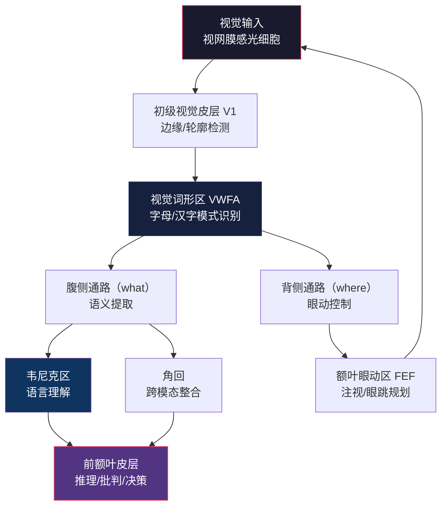
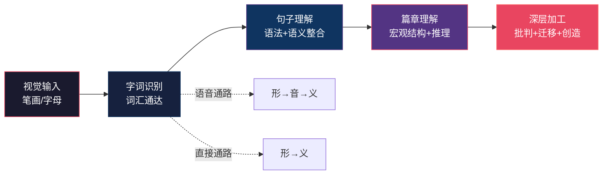
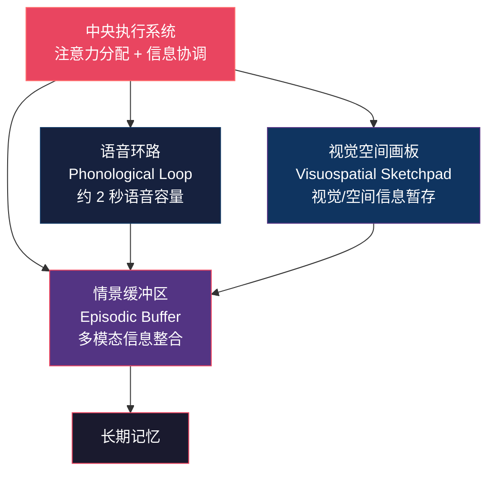

## 第二节 阅读的科学：眼动、认知加工与大脑机制

阅读看似是一个"用眼睛看文字"的简单动作，实际上却是人类认知系统中最精密的协作之一——视觉系统、语言系统、记忆系统和执行控制系统在毫秒级时间尺度上协同运作。理解阅读背后的科学机制，不仅能破除"一目十行""照相记忆"等伪科学迷思，更能为每一种阅读训练方法提供坚实的神经科学依据。

### 一、眼动科学：你的眼睛在阅读时到底在做什么

#### 1.1 眼跳与注视：两种交替出现的基本运动

阅读时，眼球并不是沿着文字匀速滑动的。它进行着一系列快速的跳跃运动（**眼跳**，saccade）和短暂的停顿（**注视**，fixation），两者交替出现，构成了阅读眼动的基本模式。

| 参数 | 数值范围 | 说明 |
|------|---------|------|
| 眼跳持续时间 | 20-40 毫秒 | 极快的弹道式运动，几乎无法主观感知 |
| 注视持续时间 | 200-300 毫秒 | 信息获取的唯一窗口 |
| 眼跳幅度 | 2-8 个字符（中文约 1-4 字） | 跳跃距离因文本难度和阅读水平而异 |
| 每秒注视次数 | 3-5 次 | 专业读者取上限，初学者取下限 |

**真正的信息获取只发生在注视阶段。** 在眼跳期间，大脑会主动"关闭"视觉输入——这种现象叫做**眼跳抑制**（saccadic suppression）。这是进化赋予的保护机制：如果在高速眼跳中仍然接收视觉信息，图像会严重模糊（类似于拍照时手抖导致的运动模糊），大脑选择直接忽略这段输入，只处理注视期间获取的清晰图像。所以，试图在眼跳过程中"顺便看更多内容"是违反神经机制的。

#### 1.2 注视点的分布规律

一个熟练的中文读者，每次注视能够获取大约 **2-3 个汉字**的有效信息。实验数据表明：

- **初学者**：每行文字可能需要 8-12 次注视，每次注视 300-400 毫秒
- **普通成人**：每行约 4-6 次注视，每次 200-280 毫秒
- **熟练读者**：每行约 3-4 次注视，每次 180-220 毫秒

注视点通常不会落在每行的最左侧第一个字，也不会均匀分布。研究表明，读者倾向于将注视点落在**词的中心偏左**位置（对于中文双字词），因为这样可以最大化信息获取效率——利用视觉广度覆盖整个词。当文本难度增加时，注视时间延长、注视次数增多，这是因为大脑需要更多时间进行语义加工。

#### 1.3 回视：看似"浪费"实则必要的策略

回视（regression）是指眼睛在阅读过程中向后跳回到已经读过的内容。正常阅读中，大约有 **10-15%** 的眼跳属于回视。

回视分为两种类型：

- **局部回视**：回跳 1-2 个词，通常是因为刚读到的信息需要与前文重新整合，或者遇到了语义歧义需要消解。这种回视是高效阅读的正常组成部分。
- **长距离回视**：回跳到很前面的句子甚至段落，通常是因为读者意识到自己误解了某个关键信息，或者需要重新审视论证逻辑。适度的长距离回视说明读者在主动监控自己的理解。

**关键判断标准**：回视率超过 20% 通常意味着两个问题之一——阅读材料难度超出读者当前水平，或者读者注意力不集中。但目标不应该是"消灭回视"，而是**减少无效回视**（因走神导致的回视），同时保留甚至鼓励**有效回视**（因深层理解需要而回视）。

#### 1.4 视觉广度：每次注视能看多少

视觉广度（perceptual span）是指每次注视时能够有效提取有用信息的区域范围。这个范围不是对称的，也不是固定的：

| 语言 | 左侧范围 | 右侧范围 | 总计约 |
|------|---------|---------|--------|
| 中文 | 注视点左侧 1 个字 | 注视点右侧 2-3 个字 | 3-4 个字 |
| 英文 | 注视点左侧 3-4 个字母 | 注视点右侧 12-15 个字母 | 约 15-19 个字母 |

中文和英文的视觉广度差异源于文字系统的本质区别：英文是拼音文字，字母之间的空间信息对词的识别很重要；中文是表意文字，每个字携带独立的语义信息，但字形更复杂，单字识别需要更精细的视觉分析。

**视觉广度的边界是"硬"的。** 超出视觉广度范围的内容，读者只能获得非常粗略的信息（比如知道那里有字，但无法识别具体内容）。这意味着声称"一眼看一整行"的速读方法，在神经科学层面是站不住脚的。

#### 1.5 副中央凹预视：还没看到就已经开始处理

视觉广度内部的信息处理并非均匀的。位于注视点旁的**副中央凹**（parafovea，距注视点 2-5 度视角）区域虽然识别精度较低，但已经能启动部分加工——这被称为**副中央凹预视效应**（parafoveal preview benefit）。

具体来说，副中央凹能提前获取：
- 下一个词的词长和基本形状
- 首字的部分信息（对于中文）
- 高频词的部分语义信息

这种预视可以为即将到来的眼跳"预热"，使下一次注视的识别速度加快约 30-50 毫秒。这是人类阅读系统的一种精妙优化——通过并行处理相邻区域的信息来提高整体效率。但预视效应是有上限的，它能加速识别但不能替代识别，更不可能实现"一目十行"。

### 二、认知加工的三个层次

阅读不仅仅是"眼睛看到文字"的感知过程，更是大脑对信息进行多层次、多步骤加工的认知过程。认知心理学将阅读中的信息加工划分为三个递进的层次，每一层都建立在前一层的基础之上。

#### 2.1 第一层：字词识别（词汇通达）

字词识别是阅读的"入口"——将视觉符号转化为语言信息。这个过程对于母语读者来说大部分是自动化的，但"自动化"并不意味着"简单"。

**中文词汇识别的两条通路：**

- **语音通路（形→音→义）**：先将字形转化为语音表征，再通过语音提取语义。这条通路在遇到不熟悉的字时尤为活跃，因为读者需要借助读音来查找语义。
- **直接通路（形→义）**：高频字词可以直接从字形映射到语义，无需经过语音中介。熟练读者对常用字的处理大多走这条通路，速度极快（约 150-200 毫秒）。

中文与拼音文字的关键差异在于：中文不存在"形-音对应规则"（grapheme-phoneme correspondence），读者无法通过拼读规则从字形推出读音。这意味着中文读者必须更多依赖**字形直接通路**和**整词识别**，这也解释了为什么中文阅读对视觉记忆的要求更高。

**影响字词识别速度的因素：**

| 因素 | 影响方式 | 实例 |
|------|---------|------|
| 词频 | 高频词识别更快 | "的"比"觊"快得多 |
| 词长 | 词越长识别越快（信息更多） | 双字词通常比单字词更易识别 |
| 语境 | 上下文可以加速或干扰识别 | "他拿起__笔"中空格处的"铅"识别极快 |
| 字形复杂度 | 笔画越多识别越慢 | "一"比"矗"快 |
| 预测性 | 高预测性语境加速识别 | "太阳从东方__起"中的"升"几乎无需识别 |

#### 2.2 第二层：句子理解

在字词识别的基础上，大脑需要将离散的词汇组合成有意义的句子。这个过程涉及两个并行的子过程：

**语法分析（Syntactic Parsing）：** 大脑根据语法规则确定词与词之间的结构关系。中文的语法分析有其独特挑战——中文缺乏形态变化（没有时态标记、没有性数一致），词与词之间的关系更多依赖语序和虚词。当遇到歧义结构时，大脑会暂时保留多种可能的分析，然后根据后续信息进行消解。例如"咬死了猎人的狗"可以有两种结构分析，大脑会在读到足够信息后选择正确的一种。

**语义整合（Semantic Integration）：** 将各词的语义信息整合成连贯的命题。工作记忆在这里扮演关键角色——你必须在工作记忆中保持前面词语的语义信息，同时整合新输入的词语。这就是为什么**过长的嵌套从句**会让中文读者感到吃力：每多嵌套一层，就需要在工作记忆中多保持一层未完成的结构信息。

**工作记忆的"7±2"瓶颈：** 认知心理学家乔治·米勒（George Miller）发现，人类工作记忆的容量大约为 7±2 个信息单元（chunk）。在句子理解中，这意味着你同时能保持的独立语义单元大约是 5-9 个。当句子的语义单元数超过这个容量，理解就会崩溃——不是因为智力不够，而是因为工作记忆的物理限制。

**实操应对策略：**
- 遇到长句时，主动用标点或停顿将其切分为 5-7 个语义单元
- 用"主-谓-宾"框架快速抓住句子骨架，忽略修饰成分
- 遇到多层嵌套时，先提取最内层的语义，再逐层向外展开

#### 2.3 第三层：篇章理解

篇章理解是阅读的最高层次加工，要求读者将多个句子的信息整合成连贯的文本表征。这个层次的加工超出了单个句子的范围，涉及**宏观结构**（macrostructure）的建构。

篇章理解包含三个核心任务：

1. **局部连贯**（local coherence）：确保相邻句子之间的逻辑关系是清晰的——因果、转折、递进、并列等。
2. **全局连贯**（global coherence）：确保所有句子的信息汇聚成一个统一的主旨。读者需要持续维护一个"全局模型"，将新信息纳入其中。
3. **读者模型更新**（situation model updating）：根据文本信息不断更新自己对所描述情境的心理模型。例如读一篇历史文章时，你需要在脑中持续更新"时间线""人物关系""事件因果链"等模型。

研究表明，优秀的读者和普通读者在字词识别和句子理解层次上的差异其实不大，真正的差距出现在篇章理解层次——优秀读者更善于建构和维护全局连贯的文本表征。

#### 2.4 深层理解：推断与批判

真正的阅读理解不只是"读懂字面意思"，更需要进行推断、评价和批判。优秀的读者在阅读过程中会持续进行三个层次的推断：

| 推断层次 | 定义 | 实例 |
|---------|------|------|
| 局部推断 | 根据上下文推断某个词或句子的隐含含义 | "他攥紧了拳头"→推断他在愤怒或紧张 |
| 整体推断 | 根据全文主旨和论证逻辑推断作者立场 | 作者反复举例反驳→推断他持反对态度 |
| 外部推断 | 将文本信息与已有知识和经验联系，产生新理解 | 读到"沉没成本"→联系自己不舍得放弃亏损股票的经历 |

推断的质量直接决定了阅读的深度。被动的"信息接收者"只完成字面理解，而主动的"意义建构者"则不断在文本信息、已有知识和个人经验之间建立连接。这种连接越多，记忆越牢固，理解越深入。

### 三、工作记忆：阅读理解的核心瓶颈

#### 3.1 巴德利的工作记忆模型

艾伦·巴德利（Alan Baddeley）提出的工作记忆模型是理解阅读瓶颈的关键框架。该模型包含三个核心组件和一个控制系统：

**语音环路（Phonological Loop）：** 负责处理听觉和语言信息。在阅读中，大多数读者会在内心"默读"文字——这就是语音环路在工作，学名叫**默读语音**（subvocalization）。语音环路的容量约为 2 秒的语音信息。这意味着当句子过长时，句首的信息会从语音环路中"衰减"消失，导致读者"读到后面忘了前面"。

**视觉空间画板（Visuospatial Sketchpad）：** 负责处理视觉和空间信息。在阅读图表、地图和示意图时尤为重要。在纯文字阅读中，它负责处理文字的排版和页面布局信息——比如你记得某个重要结论在页面左上角，就是视觉空间画板在起作用。

**中央执行系统（Central Executive）：** 工作记忆的"总指挥"，负责协调语音环路和视觉空间画板的工作，管理注意力的分配，以及在不同任务之间切换。它是有限容量系统中**最容易过载**的组件——每一次注意力切换（看手机、听人说话）都会消耗中央执行系统的资源。

**情景缓冲区（Episodic Buffer）：** 巴德利在 2000 年补充的第四个组件，负责将来自语音环路、视觉空间画板和长期记忆的信息整合成统一的"情景"。这是阅读中将文字信息与已有知识进行整合的关键节点。

#### 3.2 工作记忆对阅读的四重制约

工作记忆的有限容量对阅读产生四个维度的制约：

**第一重：容量制约。** 你能同时在脑中保持的信息量是有限的。实验表明，在阅读任务中，有效容量约为 4±1 个语义单元（比经典的 7±2 更低，因为阅读需要分配资源给语言加工）。

**第二重：时间制约。** 语音环路中的信息如果不被复述，约 2 秒后就会衰减消失。这直接限制了你能在一次阅读中"连贯处理"的句子长度。

**第三重：竞争制约。** 语言加工（字词识别、语法分析）和意义建构（推理、整合）共享同一套认知资源。当语言加工难度增加时（如遇到生僻字、复杂句式），分配给意义建构的资源就会减少——这就是为什么"每个字都认识但整句话看不懂"的现象会发生。

**第四重：切换制约。** 每次注意力从文本上移开再回来，中央执行系统需要重建上下文，这个过程消耗约 15-25 分钟才能恢复到深度专注状态（所谓的"心流"状态）。

#### 3.3 基于工作记忆的阅读策略

理解工作记忆的机制后，可以设计出有针对性的阅读策略：

1. **分块处理**：将复杂句子主动拆分为 4-5 个语义单元，在每个单元处短暂停顿整合
2. **外部卸载**：通过做笔记、画思维导图、标注关键词来将工作记忆中的信息转移到外部载体
3. **复述强化**：读完一个段落后用自己话复述核心观点，将信息从工作记忆转入长期记忆
4. **消除干扰**：关闭手机通知、选择安静环境，因为每一次注意力切换都需要 15-25 分钟才能恢复
5. **预读框架**：先浏览目录和章节标题，建立全局框架后再精读，这样新信息可以直接"挂"在已有的框架上，减轻工作记忆负担

### 四、长期记忆与知识建构

#### 4.1 记忆系统的分类

阅读的最终目标不是信息的短期保持，而是知识的长期储存和灵活运用。人类的长期记忆系统分为多个子系统：

| 记忆类型 | 内容 | 阅读中的体现 | 转化条件 |
|---------|------|-------------|---------|
| 陈述性记忆 | 事实、概念、事件 | "锚定效应是指..." | 重复提取 + 多情境编码 |
| 程序性记忆 | 技能、习惯、流程 | 阅读策略从刻意到自动化 | 大量实践 + 即时反馈 |
| 情景记忆 | 特定时间地点的个人经历 | "我昨天在咖啡馆读了第三章" | 与情感和感官体验绑定 |
| 语义记忆 | 一般知识和概念体系 | "锚定效应的定义和应用" | 抽象化 + 知识网络化 |

阅读学习的理想路径是：**情景记忆 → 语义记忆 → 程序性记忆**。即先在特定情境中接触知识（情景记忆），然后将其抽象化为通用概念（语义记忆），最后通过反复应用将其内化为自动化技能（程序性记忆）。

#### 4.2 图式理论：为什么背景知识如此重要

图式（Schema）是你关于某个主题的已有知识结构。皮亚杰（Jean Piaget）提出的图式理论揭示了知识建构的两种基本机制：

- **同化（Assimilation）**：新信息与已有图式一致，直接纳入。例如你已经知道"哺乳动物"的图式，读到"鲸鱼是哺乳动物"时，直接将鲸鱼纳入这个图式。
- **顺应（Accommodation）**：新信息与已有图式矛盾，需要修改图式来容纳。例如你以为"鱼都是卵生的"，读到"鲨鱼有胎生种类"时，需要修改"鱼类繁殖"的图式。

**图式对阅读理解的影响是全方位的：**

- **信息选择**：图式决定了你注意到什么、忽略什么。一个有经济学背景的读者读同一篇新闻，会自动关注其中的经济因素。
- **信息填补**：当文本省略了某些信息时，图式可以自动填补空白。读到"他走进餐厅，点了牛排"，你的"餐厅图式"会自动补充"看菜单、坐下、付钱"等未提及的环节。
- **推断引导**：图式为你提供推断的框架。一个拥有丰富历史图式的读者，能从一个历史事件推断出其可能的后果。
- **记忆组织**：图式决定了信息如何在长期记忆中组织和存储，从而影响后续的提取效率。

**实操启示：** 读任何一本新书之前，先花 10-15 分钟激活相关的已有知识——浏览目录、翻阅相关笔记、回忆已知概念。这个"预热"过程会让你的图式系统准备好接收新信息，阅读效率和理解深度都会显著提升。

#### 4.3 遗忘曲线与间隔复习

赫尔曼·艾宾浩斯（Hermann Ebbinghaus）的遗忘曲线表明，新学到的信息如果不复习，会在以下时间尺度上遗忘：

- **20 分钟后**：遗忘 42%
- **1 小时后**：遗忘 56%
- **1 天后**：遗忘 66%
- **1 周后**：遗忘 75%
- **1 个月后**：遗忘 79%

对抗遗忘的最有效策略是**间隔重复**（spaced repetition）——在即将遗忘的时间点进行复习，每次复习都能将遗忘曲线"重置"并延长保持时间。对于阅读学习来说，推荐的复习时间点是：读完当天、第 3 天、第 7 天、第 14 天、第 30 天。

### 五、阅读的大脑神经机制

#### 5.1 阅读的核心脑区

功能性磁共振成像（fMRI）和事件相关电位（ERP）研究揭示了阅读时大脑的活动模式。阅读涉及多个脑区的协同工作：

**视觉词形区（Visual Word Form Area, VWFA）：** 位于左侧梭状回底部，是阅读的"字形识别中枢"。它专门负责识别字母串和汉字的视觉模式。VWFA 是一个**阅读特化**的脑区——它在文盲学习阅读的过程中逐渐形成，是文化对大脑塑造的典型例子。中文读者的 VWFA 对汉字笔画和结构的编码方式与英文读者对字母的编码方式有显著差异，体现了大脑的可塑性。

**韦尼克区（Wernicke's Area）：** 位于左侧颞上回后部，是语言理解的核心区域。它负责将词汇的语音和语义信息进行整合，理解词义和句义。韦尼克区受损会导致**感觉性失语症**——患者能流利说话但内容不知所云，能听到声音但无法理解含义。

**布洛卡区（Broca's Area）：** 位于左侧额下回后部，传统上与语言产出相关，但现代研究发现它在阅读中也扮演重要角色——参与句法分析和内部语言（inner speech）的产生。默读时的"内心声音"就涉及布洛卡区的活动。

**角回（Angular Gyrus）：** 位于顶叶下部，是跨模态整合的枢纽——将视觉信息（字形）、听觉信息（语音）和语义信息进行绑定。角回受损会导致**失读症**（alexia）——患者能看到文字但无法将其转化为有意义的语言。

**前额叶皮层（Prefrontal Cortex）：** 阅读中的"高级指挥中心"，负责推理、批判性评价、工作记忆管理和注意力控制。深度阅读（批判性分析、创造性思考）主要依赖前额叶皮层的参与。

#### 5.2 阅读的双通路模型

认知神经科学提出了阅读的**双通路模型**（Dual-Route Model），描述了从字形到语义的两条神经通路：

| 通路 | 路径 | 特点 | 适用场景 |
|------|------|------|---------|
| 词汇通路 | 字形 → 直接匹配语义 | 快速、自动化 | 高频字词、熟悉词汇 |
| 亚词汇通路 | 字形 → 语音编码 → 语义 | 较慢、需要意识参与 | 生僻字、新词、专业术语 |

熟练读者在处理高频字词时主要使用词汇通路（直接从字形到语义），而在遇到生僻字或新词时会切换到亚词汇通路（通过语音中介）。两条通路是**并行运作**的——即使词汇通路已经完成了识别，亚词汇通路仍然在后台验证结果，确保准确性。

#### 5.3 神经可塑性与阅读训练

大脑具有显著的**可塑性**（neuroplasticity），阅读能力的提升伴随着大脑结构和功能的改变：

- **灰质密度变化**：学习阅读的人在 VWFA 区域的灰质密度会增加
- **白质连接增强**：长期阅读训练会增强 VWFA 与语言区之间的白质纤维束连接
- **激活模式优化**：熟练读者阅读时，相关脑区的激活更集中、更高效——不再需要动用大量辅助脑区

这意味着**阅读训练的效果是可以体现在大脑物理结构上的**。但这种改变需要时间和持续练习——大脑重塑不是一朝一夕的事，通常需要数周到数月的持续训练才能观察到显著的神经变化。

#### 5.4 中文阅读的脑机制特殊性

中文阅读在脑机制上与拼音文字阅读存在显著差异：

- **双侧激活**：中文阅读时大脑的激活模式比英文更加双侧化——右脑在中文阅读中的参与度更高，这可能与汉字的视觉空间复杂性有关
- **运动皮层参与**：中文书写训练激活了更多的运动皮层区域，因为汉字书写涉及精细的手部运动控制
- **VWFA 的编码差异**：中文读者的 VWFA 对汉字的编码更依赖整体形状和空间结构，而非线性序列

这些差异说明：针对中文读者的阅读训练方案不能简单照搬英文世界的研究成果，需要考虑中文文字系统的独特性。

### 六、从科学到实践：基于研究的阅读优化

#### 6.1 速度与理解的权衡关系

认知科学研究反复证实的一个核心事实是：**阅读速度和理解深度之间存在客观的权衡关系。**

原因很直接——深层理解需要时间进行推理、整合和知识联结，这些高级认知过程不可能被"跳过"。研究表明：

| 阅读速度 | 理解率 | 适用场景 |
|---------|--------|---------|
| 精读（200-300 字/分） | 70-90% | 学术论文、法律合同、核心教材 |
| 正常阅读（400-600 字/分） | 60-80% | 一般书籍、深度文章 |
| 快速阅读（600-1000 字/分） | 40-60% | 新闻浏览、资料初筛 |
| "速读"（>1000 字/分） | <30% | 信息扫描、找关键词 |

真正的阅读效率不是速度最大化，而是在**特定目标下找到速度和理解的最佳平衡点**。

#### 6.2 伪科学速读的神经科学解构

市面上许多"速读训练"声称可以通过训练让你达到每分钟数千甚至上万字的速度，同时保持高理解率。神经科学研究对此的评价是：

**"一目十行"不可能。** 视觉广度的神经限制决定了每次注视只能有效获取 3-4 个汉字的信息。声称一眼看一整行的方法，实际上是跳过了大量文字——不是"看得更快"，而是"看得更少"。

**"消除默读"不现实。** 默读（subvocalization）是语言理解的必要组成部分，涉及语音环路和布洛卡区的活动。完全消除默读会严重损害理解。实验表明，即使是最熟练的读者也无法完全消除默读。

**"照相记忆"无证据。** 声称可以像照相机一样"拍下"整页内容的"照相记忆"或"全脑阅读"，在严格的科学实验中从未被证实。少数看似拥有此能力的人，实际上是通过非凡的记忆策略（如记忆宫殿）来实现的，并非通过视觉系统。

#### 6.3 基于科学的高效阅读训练框架

既然不能突破神经限制，那么科学的阅读训练应该做什么？核心策略是**在限制内优化效率**：

**训练一：扩展有效视觉广度。** 通过专门练习，将副中央凹区域的信息利用率提升到上限。方法：用速示器（tachistoscope）或手机 App 快速闪现词语，逐步扩大每次闪现的字符数，训练大脑在更短时间处理更多信息。

**训练二：减少无效回视。** 用手指或笔尖作为引导，沿行匀速移动，强制眼睛跟随。这可以减少因注意力分散导致的随机回视。注意：这不是为了"加速"，而是为了减少走神导致的无效运动。

**训练三：优化工作记忆利用。** 通过复述、笔记、思维导图等策略减轻工作记忆负担，把更多认知资源留给深层理解。这不是"看得更快"，而是"理解更多"。

**训练四：建立丰富的知识图式。** 广泛阅读、跨领域学习、定期复习——每增加一个知识图式，未来读到相关内容时的理解速度就会自动提升。这是唯一真正能从底层提升"整体阅读效率"的长期策略。

**训练五：元认知监控。** 训练自己在阅读过程中持续监控理解状态——"我真的理解了这段话吗？"当发现自己走神或理解困难时，及时调整策略（放慢速度、做笔记、回读关键段落）。

### 七、常见误区与科学纠正

| 误区 | 科学事实 | 实际建议 |
|------|---------|---------|
| "速读可以练到每分钟万字" | 视觉广度和认知加工速度有硬上限 | 在 400-800 字/分范围内优化效率和理解 |
| "默读是坏习惯，应该消除" | 默读是语言理解的神经基础 | 不必刻意消除，可适当加快默读速度 |
| "回视说明阅读能力差" | 适度回视是深层理解的正常表现 | 减少无效回视，保留有效回视 |
| "越多读越好，量变引起质变" | 不经思考的大量阅读效果有限 | 精读+复述+间隔复习 > 纯大量泛读 |
| "读得越快记得越牢" | 遗忘曲线表明记忆需要间隔强化 | 配合间隔复习系统巩固阅读成果 |
| "照相记忆可以通过训练获得" | 无科学证据支持，属于伪科学 | 使用记忆宫殿等经验证的记忆策略 |
| "阅读时脑中不应该有任何声音" | 内部语言是理解的正常副产品 | 接受默读，将精力放在理解而非消除声音 |
| "所有材料都应该用同一种速度读" | 不同材料需要不同的阅读策略 | 根据目的和难度灵活调整速度和策略 |

### 八、本节要点回顾

本节从眼动科学、认知加工、工作记忆、长期记忆和脑神经机制五个维度，系统揭示了阅读背后的科学原理。核心要点：

1. **阅读是"注视-眼跳"的交替过程**，信息获取只发生在注视阶段，视觉广度有客观上限
2. **认知加工分为字词识别、句子理解、篇章理解三个层次**，每一层建立在前一层之上
3. **工作记忆是阅读的核心瓶颈**，容量约 4±1 个语义单元，可通过外部卸载和分块策略优化
4. **长期记忆的巩固需要间隔重复**，遗忘曲线表明复习时机比复习次数更重要
5. **阅读涉及多个脑区的协同工作**，中文阅读有其独特的脑机制特征
6. **速度和理解之间存在客观权衡**，真正的效率是找到最佳平衡点而非追求极限速度

理解这些科学原理，你就能辨别阅读领域的真知与伪科学，选择真正有效的训练方法，而不是浪费时间在没有神经科学依据的"速读秘术"上。
