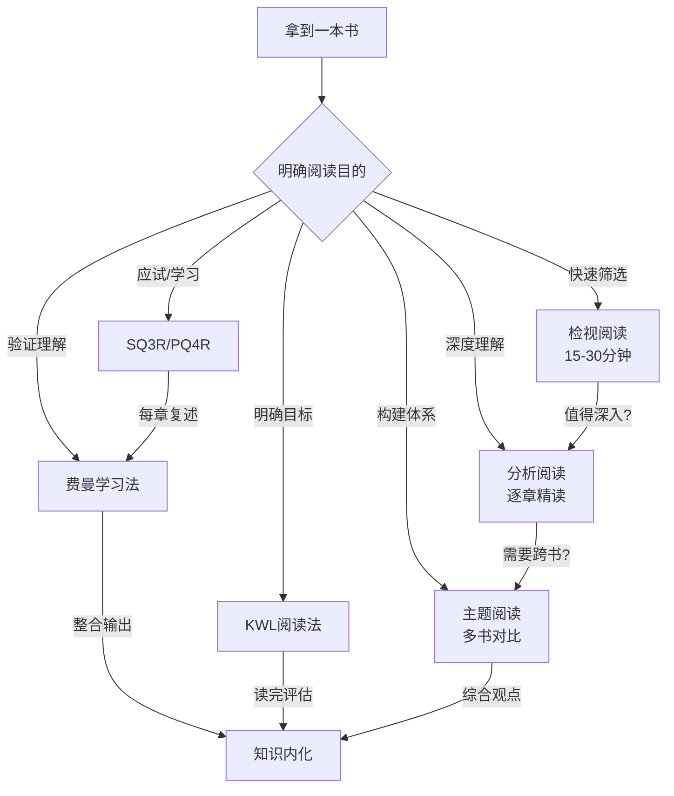
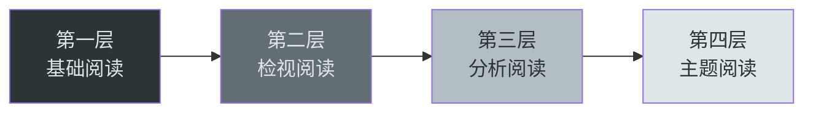
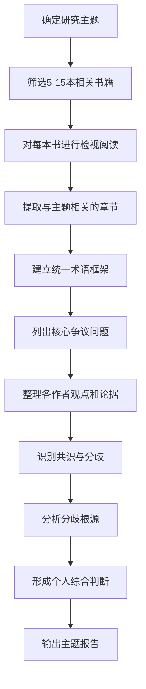
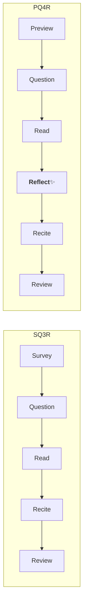
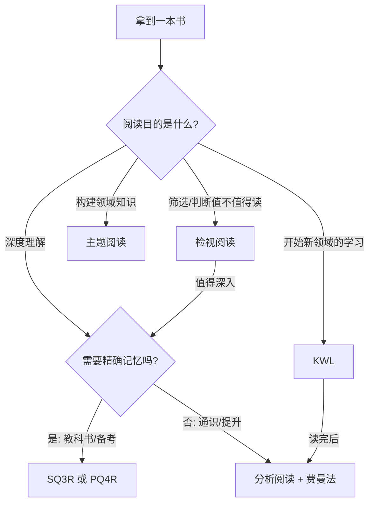
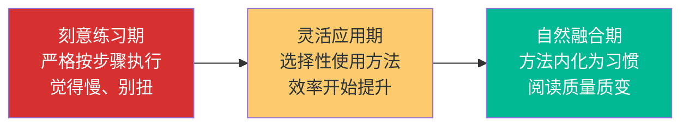

## 第三节 阅读方法论：从"会读书"到"善读书"

"会读书"意味着你能读懂文字、理解句意；"善读书"意味着你能在有限时间内从一本书中提取最大价值，并将知识转化为行动力。两者的差距不是阅读量的问题，而是**阅读策略**的问题。

本节将系统介绍六种经过学术验证的阅读方法论，从经典的艾德勒阅读层次理论到现代的批判性阅读框架，帮你建立一套"方法工具箱"——面对不同类型的书籍和不同的阅读目标，你能迅速选择最合适的方法，而不是千篇一律地从第一页读到最后一页。

---

### 一、莫提默·艾德勒的阅读层次理论

莫提默·艾德勒（Mortimer J. Adler）在其经典著作《如何阅读一本书》（*How to Read a Book*，1940年初版，1972年查尔斯·范多伦修订）中提出了四层阅读理论。这套理论的核心洞见是：**阅读不是一种单一的活动，而是一组由低到高的技能层级**。每一层都包含前一层的能力，并在其基础上增加新的技巧。

#### 1.1 第一层：基础阅读（Elementary Reading）

基础阅读解决的是"这个句子在说什么"的问题。在这个层次上，读者能够识别文字、理解句意，完成基本的信息接收。具体包括四个子阶段：

- **识字阶段**：认识基本的文字符号，能将符号与发音对应
- **词汇扩展阶段**：通过上下文猜测生词含义，词汇量快速增长
- **功能性阅读阶段**：能理解字面意思，完成日常阅读任务（看新闻、读说明书）
- **成熟阅读阶段**：能比较不同观点，开始形成自己的判断

大多数人通过学校教育已经掌握了这个层次。但需要注意的是，**很多成年人实际上仍然停留在基础阅读阶段**——他们能读懂每个字，却无法把握一本书的整体结构和核心论点。如果你发现自己读完一本书后说不出"这本书到底在讲什么"，说明你的阅读能力需要向第二层跃迁。

#### 1.2 第二层：检视阅读（Inspectional Reading）

检视阅读解决的是"这本书在说什么"的问题。核心目标是在有限时间内，快速把握一本书的整体结构和核心论点。这是一种"先见森林，再见树木"的策略。

**系统略读（Systematic Skimming）的完整步骤：**

1. **阅读书名和副标题**（30秒）：书名往往揭示了作者的核心主题和立场。副标题则通常提供了更具体的限定条件。例如《思考，快与慢——我们如何做出决策》，主标题是核心隐喻，副标题是应用领域。
2. **阅读目录**（2-3分钟）：目录是全书的骨架。注意章节之间的逻辑关系——是并列结构、递进结构还是因果结构？标记出你认为最重要的3-5个章节。
3. **阅读序言和导论**（3-5分钟）：作者通常会在序言中说明写作动机、目标读者和核心论点。这部分信息密度极高。
4. **浏览索引**（2分钟）：索引中的高频词条往往就是全书的核心概念。快速扫一眼，识别哪些术语反复出现。
5. **阅读出版者介绍/封底推荐语**（1分钟）：虽然有营销成分，但好的出版介绍会精准概括全书的价值主张。
6. **挑2-3个核心章节快速浏览**（5-10分钟）：不要从头读，而是跳到你最感兴趣的或目录中看起来最重要的章节，读开头几段和结尾几段，以及每段的首句。
7. **随意翻阅**（2-3分钟）：随机翻开几页，读一两段。感受作者的写作风格、论证密度和可读性。

整个过程应在**15-30分钟**内完成。完成后你应该能回答以下问题：

| 问题 | 如果答不上来说明什么 |
|------|---------------------|
| 这本书的主题是什么？ | 序言和目录没有认真读 |
| 作者的核心论点是什么？ | 没有关注章节标题和导论 |
| 这本书的结构是什么？ | 目录浏览不够仔细 |
| 这本书值得深入读吗？ | 需要再挑几个章节快速浏览 |

**粗浅阅读（Superficial Reading）：** 这是检视阅读的第二个子类型。当你遇到一本难度远超你当前水平的书时，第一遍不要停下来查资料、不要纠结于不懂的术语，从头到尾通读一遍，能理解多少算多少。这遍阅读的目的是建立一个整体框架，为第二遍的深入阅读打下基础。很多经典著作（如《纯粹理性批判》《国富论》）都需要先粗浅读一遍，再分析读一遍。

#### 1.3 第三层：分析阅读（Analytical Reading）

分析阅读解决的是"这本书详细说了什么，说得对不对"的问题。这是大多数人在阅读一本好书时应该使用的层次。

**分析阅读的四个阶段：**

**阶段一：把握结构（Structural Reading）**

1. 用一句话（或一段话）概括全书的主题
2. 列举全书的主要部分，以及它们之间的组织关系
3. 找出作者要解决的核心问题（作者想说服你什么？）

**阶段二：理解内容（Interpretive Reading）**

4. 找出作者的关键术语，理解作者赋予这些术语的特殊含义
5. 找出作者的核心论述——在关键句子中，作者表达了哪些最重要的命题
6. 找出作者的论证——哪些论述构成了作者的论据链？
7. 确定作者解决了哪些问题，哪些问题没有解决

**阶段三：评价内容（Critical Reading）**

8. 在表达批评之前，确保你真正理解了作者的观点（"钢铁人原则"）
9. 不要为了争辩而争辩，批评要有理有据
10. 指出作者的知识不足、逻辑错误、分析不完整或论据不充分

**分析阅读的时间投入：** 一本中等难度的非虚构类书籍（约20万字），分析阅读通常需要**8-15小时**。这意味着你一天读2小时，需要一周左右的时间。不要觉得慢——分析阅读一本书获得的理解深度，远超速读十本书。

#### 1.4 第四层：主题阅读（Syntopical Reading）

主题阅读解决的是"关于这个主题，不同的作者说了什么"的问题。这是最高层次的阅读，也是构建某个领域系统知识的最佳方法。

**主题阅读的五个步骤：**

1. **确定主题，列出书单**：围绕你要研究的主题，找到5-15本相关的书。可以通过学术推荐、书评网站、专家书单来筛选。
2. **对每本书进行检视阅读**：快速浏览每本书，找到与你的主题相关的章节。注意：同一概念在不同书中可能用不同的术语来表述。
3. **建立统一的术语框架**：不同作者可能对同一个概念使用不同的术语。你的任务是建立一套"翻译表"，将不同作者的表述统一到同一个框架下。
4. **厘清问题和争议**：围绕你的主题，列出核心问题。对于每个问题，整理不同作者的回答和论据。标注共识点和争议点。
5. **分析和综合**：不要只罗列不同观点，要分析为什么会有分歧（是定义不同、证据不同还是价值立场不同？），然后尝试形成你自己的综合判断。

**主题阅读的时间投入和产出：** 一个中等规模的主题阅读项目（10本书），从选书到完成综合分析，通常需要**3-6周**。但产出的不是10篇零散的读书笔记，而是一份**结构化的主题报告**——这就是你在这个领域的"知识地图"。

---

### 二、SQ3R阅读法

SQ3R由美国俄亥俄州立大学心理学教授弗朗西斯·罗宾逊（Francis P. Robinson）在1946年出版的《有效的学习》（*Effective Study*）中首次提出。"SQ3R"是Survey（浏览）、Question（提问）、Read（阅读）、Recite（复述）、Review（复习）五个步骤的缩写。该方法经过70多年的教育实践检验，是大学学习技能课程中最常教授的阅读策略之一。

#### 2.1 五步详解

**第一步：Survey（浏览）——建立地图**

在正式阅读之前，花5-10分钟快速浏览全书的目录、章节标题、插图、表格、摘要和结论。这一步的目的是建立对全书的初步印象和知识框架。

具体操作：
- 读目录，标记出与你最相关的3-5个章节
- 看每章的标题和副标题，了解全书的逻辑结构
- 关注图表、公式、加粗文字——这些通常是核心内容的视觉标记
- 阅读每章的开头段落和结尾段落（作者通常在这里概括本章要点）

**第二步：Question（提问）——激活大脑**

在浏览的基础上，将章节标题转化为问题。这一步的核心原理是**"问题启动效应"**（Question-Generation Effect）：当大脑带着问题去搜索信息时，注意力和记忆编码效率都会显著提高。

转化技巧：

| 章节标题 | 转化为问题 |
|----------|-----------|
| 认知偏差的类型 | 有哪些常见的认知偏差？它们如何影响决策？ |
| 番茄工作法的原理 | 为什么25分钟是一个有效的工作单元？有什么科学依据？ |
| 有效沟通的障碍 | 最常见的沟通障碍有哪些？如何逐一克服？ |
| Python列表推导式 | 列表推导式和for循环相比有什么优劣？什么场景下应该用哪个？ |

**第三步：Read（阅读）——主动搜索**

带着问题进行有目的的阅读。关键原则：

- **一节一读**：每次只读一个小节（约10-15分钟的阅读量），不要一口气读完一整章
- **边读边标注**：用不同符号标记不同类型的内容——核心论点用★、存疑用？、精彩表述用△、与自己经验相关的用@
- **关注信号词**：注意"因此""然而""最重要的是""本质上"等信号词，它们通常引出核心论点
- **暂停思考**：读到每个主要论点时，停下来问自己："这回答了我刚才的问题吗？我同意吗？"

**第四步：Recite（复述）——强制输出**

每读完一个小节，合上书用自己的话复述刚读过的内容。这一步至关重要——**如果你无法用自己的话解释，说明你并没有真正理解**。

复述的有效形式：
- **口头复述**：对着空气或一个假想听众讲解（费曼法的核心）
- **书面复述**：在笔记本上用3-5句话写下本节要点（不要翻书）
- **思维导图**：画出本节的知识结构图（适合视觉型学习者）
- **自问自答**：回答第二步提出的问题，然后检查是否准确

研究表明，复述环节能将记忆保持率从被动阅读的**10%-20%提升到50%-70%**（基于学习金字塔模型，虽然具体数字存在争议，但"主动输出优于被动输入"的结论已被大量实验验证）。

**第五步：Review（复习）——对抗遗忘**

根据艾宾浩斯遗忘曲线，新学到的知识如果不复习，1天后会遗忘约67%，1周后遗忘约75%。有计划的复习是将短期记忆转化为长期记忆的关键。

**推荐复习时间表：**

| 复习时间点 | 复习内容 | 所需时间 |
|-----------|---------|---------|
| 读完当天 | 回顾所有标记和笔记，重读标★的部分 | 15-20分钟 |
| 第2天 | 只看章节标题和自己的复述笔记，回忆核心内容 | 10分钟 |
| 第4天 | 针对仍然记不清的部分，回到原文重读 | 10-15分钟 |
| 第7天 | 合上书，尝试写出全书的核心框架和3个最重要的观点 | 15分钟 |
| 第30天 | 最终检验——向别人讲解这本书的核心内容 | 10分钟 |

#### 2.2 SQ3R的适用场景和局限

**最适合：** 教科书、学术论文、技术文档、考试复习材料。这些内容的特点是信息密度高、结构清晰、需要精确记忆。

**不太适合：** 小说、诗歌、散文等文学作品。文学阅读的目标是体验和感悟，而不是提取和记忆信息。用SQ3R读小说会破坏阅读体验。

**常见错误：**
- 跳过Survey直接Read：导致"只见树木不见森林"，读到后面发现前面理解错了
- 跳过Recite只Read：这是最常见的错误。很多人觉得"我读懂了就行"，但"读懂"和"能复述"之间有巨大的认知鸿沟
- Review不及时：等到考前才复习，遗忘已经发生了

---

### 三、费曼学习法

诺贝尔物理学奖得主理查德·费曼（Richard Feynman）以其能把复杂的物理概念用极其简单的语言解释清楚而闻名。他的学习方法本质上是一种**"以教促学"的策略**，核心思想是：**如果你不能用简单的语言解释一件事，说明你并没有真正理解它**。

#### 3.1 四步法详解

**第一步：选择概念**

确定你要学习或理解的概念。范围不要太大——一次只选一个。例如，不要选"机器学习"，而是选"梯度下降法"。

**第二步：用简单语言解释**

假设你要向一个12岁的孩子（或一个完全不懂这个领域的人）解释这个概念。规则：
- 不使用专业术语（如果必须用，先解释术语本身）
- 使用日常生活中的类比
- 用短句，避免长难句
- 每一步之间的逻辑要连贯

**第三步：发现卡壳点**

在解释的过程中，你一定会遇到说不清楚的地方。这些卡壳点就是你理解上的漏洞。回到原始材料，重新学习这些部分，直到你能用简单语言说清楚。

**第四步：简化和类比**

对你的解释进行精简——去掉多余的话，找到最精准的类比。如果一个解释需要5分钟，试试能不能压缩到2分钟。如果你能找到一个好的类比，说明你已经达到了深度理解。

#### 3.2 在阅读中的具体应用

将费曼学习法融入日常阅读，可以建立以下习惯：

**每章一讲**：每读完一章，用3-5句话向自己（或录音）讲解本章的核心内容。如果某句话你卡壳了，标记下来，回到原文重读。

**每书一信**：每读完一本书，写一封"给朋友的推荐信"（300-500字），解释这本书的核心观点和推荐理由。这封信不需要真的发出去，但写的过程会迫使你提炼和组织信息。

**公开分享**：在社交媒体、读书笔记平台或读书会中分享你的阅读心得。公开表达会进一步强化你的理解——因为你需要为读者负责，不能含糊其辞。

**教学相长**：如果条件允许，找一个学习伙伴，轮流把自己读到的内容讲给对方听。研究表明，"互相教学"（Peer Teaching）的学习效果比独自学习高出**30%-50%**。

#### 3.3 费曼学习法的科学基础

费曼学习法的效力并非仅仅是经验直觉，它有扎实的认知科学支撑：

- **生成效应（Generation Effect）**：主动生成信息（如用自己的话复述）比被动接收信息（如默读）能产生更强的记忆痕迹。心理学家Slamecka和Graf在1978年的经典实验中首次验证了这一效应。
- **精细化编码（Elaborative Encoding）**：当你用类比、举例和个人经验来解释新知识时，你实际上在为新信息建立更多的记忆提取路径。路径越多，回忆越容易。
- **元认知监控（Metacognitive Monitoring）**：费曼法的第三步（发现卡壳点）本质上是一种元认知活动——你在监控自己的理解程度。研究表明，具备良好元认知监控能力的学习者，其学习效率显著高于缺乏监控的学习者。

---

### 四、KWL阅读法

KWL由美国教育学家唐娜·奥格尔（Donna Ogle）在1986年提出，最初用于课堂阅读教学，后来被广泛应用于自主学习场景。KWL是Know（已知）、Want（想知）、Learned（学到）三个词的首字母缩写。

#### 4.1 三栏笔记法

| K - 已知（Know） | W - 想知（Want） | L - 学到（Learned） |
|-----------------|-----------------|-------------------|
| 关于这个主题，我已经知道什么？ | 我想通过这本书了解什么？ | 读完后我实际学到了什么？ |
| | | |

**K栏的填写要点：**
- 不要怕写错。K栏的目的是激活你已有的知识网络，让新知识有"锚点"可以挂靠
- 写得越具体越好。不要写"我知道一些关于经济学的知识"，而是写"我知道供需关系影响价格、通货膨胀意味着物价上涨"
- 如果你对一个主题几乎一无所知，K栏可以只写"我只知道这个主题的名字"——这本身就是有价值的信息，它告诉你需要从入门级材料开始

**W栏的填写要点：**
- 把模糊的好奇转化为具体的问题。"我想了解心理学"太宽泛，"我想知道为什么我总是拖延"才是好的W栏问题
- 优先级排序：在5-8个问题中，标出最重要的2-3个
- W栏不是一成不变的——在阅读过程中，你可能会发现新的问题，随时添加

**L栏的填写要点：**
- 每读完一章填写一次，不要等到读完全书才写
- 对照W栏——你的问题得到回答了吗？回答得充分吗？
- 记录意外收获——那些你事先没想到但实际学到的东西
- 记录新的困惑——读完后产生的新问题比解答的老问题更有价值

#### 4.2 KWL+进阶版

在原有三栏的基础上增加第四栏**"A - 行动（Action）"**，即"基于我学到的知识，我接下来要采取什么行动？"

| K - 已知 | W - 想知 | L - 学到 | A - 行动 |
|---------|---------|---------|---------|
| 我已有的知识 | 我的学习目标 | 我的新收获 | 我要采取的行动 |

**A栏的填写要求：**
- 每个行动项必须是具体的、可执行的、有时限的
- 不要写"多读书"，要写"本周内用SQ3R方法读完《经济学原理》第三章"
- 不要写"改善沟通"，要写"明天开会时用'复述确认法'确保我理解了同事的意思"

**KWL+的核心价值在于将阅读从"知识获取"延伸到"行为改变"。** 没有行动栏的KWL容易沦为纸上谈兵——你记录了已知、想知、学到，但然后呢？A栏确保阅读的结果不仅仅是一份笔记，而是一个行动计划。

#### 4.3 KWL在不同场景下的变体

**场景一：开始读一本新书**

在翻开书之前，花10分钟填写K和W两栏。这10分钟的投入会让你的阅读效率提升30%以上——因为你已经有了明确的目标和知识锚点。

**场景二：开始学习一个新领域**

先不急着读书，而是用KWL来规划你的学习路径。K栏告诉你起点在哪里，W栏告诉你终点在哪里。然后根据W栏的问题来选择书籍和学习材料。

**场景三：参加读书会或课程**

在每次读书会或课程之前填写K和W，之后填写L和A。这不仅提升你的学习效果，还为读书会讨论提供了高质量的发言素材。

---

### 五、PQ4R阅读法

PQ4R是SQ3R的升级版，由教育心理学家托马斯（Thomas）和罗宾逊（Robinson）在1972年提出。它在SQ3R的基础上增加了"Reflect（反思）"步骤，形成六个步骤：Preview（预览）、Question（提问）、Read（阅读）、Reflect（反思）、Recite（复述）、Review（复习）。

#### 5.1 与SQ3R的核心区别

**Reflect（反思）** 是PQ4R区别于SQ3R的核心步骤。它要求你在阅读过程中和阅读完成后，进行三个层面的反思：

**内容反思**：
- 这个内容与我已经知道的有什么联系？
- 它是否挑战了我之前的某些认知？
- 如果我之前的认知是错的，原因是什么？
- 这个新知识能否解释我以前遇到的某些困惑？

**方法反思**：
- 我当前的阅读策略有效吗？
- 我是否需要调整阅读速度（读得太快容易遗漏，读得太慢容易走神）？
- 这部分内容的难度是否需要我改变阅读方式（比如读两遍、查补充资料、画图理解）？

**价值反思**：
- 这个内容对我有什么实际意义？
- 我可以用它来解决什么问题？
- 它与我的工作/学习/生活有什么关联？
- 如果我必须用一句话向别人推荐这段内容，我会说什么？

#### 5.2 PQ4R的适用场景

PQ4R比SQ3R多了反思环节，因此：
- **耗时更长**：在SQ3R的基础上增加约20%-30%的时间
- **理解更深**：反思环节能显著提升知识的迁移能力（即把学到的知识应用到新场景的能力）
- **更适合深度学习**：当你阅读的是那些需要深度理解和批判性思考的书籍时（如哲学、方法论、战略类书籍），PQ4R比SQ3R更有效

#### 5.3 实操模板：PQ4R阅读记录表

═══════════════════════════════════════
PQ4R 阅读记录表
═══════════════════════════════════════
书名：_______________
章节：_______________
日期：_______________

【Preview 预览】
本章标题：_______________
小节标题：_______________
关键词：_______________
预计重点：_______________

【Question 提问】
Q1：_______________
Q2：_______________
Q3：_______________

【Read 阅读笔记】
核心概念1：_______________
核心概念2：_______________
核心概念3：_______________
关键证据/案例：_______________

【Reflect 反思】
与已有知识的联系：_______________
挑战了哪些旧认知：_______________
阅读方法需要调整吗：_______________
实际应用场景：_______________

【Recite 复述】
（合上书，用自己的话写出本章要点）
_________________________________
_________________________________
_________________________________

【Review 复习日期】
□ 当天复习（日期：___）
□ 第2天复习（日期：___）
□ 第7天复习（日期：___）
□ 第30天复习（日期：___）

---

### 六、批判性阅读

批判性阅读不是"批判"作者——不是挑毛病、不是为了反驳而反驳。它是以一种**分析性的、评估性的态度**来阅读，要求你不只是接受作者的观点，而是主动评估这些观点的合理性、证据的充分性和逻辑的严密性。

批判性阅读的本质是一种**"对话"**——你和作者之间跨越时空的对话。在这场对话中，你不是被动的听众，而是平等的参与者。

#### 6.1 六个核心问题

在阅读任何非虚构类作品时，都可以用以下六个问题来检验作者的论证：

**问题一：作者的核心论点是什么？**

用一句话概括作者的主要观点。如果你做不到这一点，说明你还没有理解这本书。很多书看起来论证繁复，但核心论点往往只有一两句话。例如：
- 《思考，快与慢》：人类有两套思维系统，系统1（快、自动、易出错）和系统2（慢、费力、更准确），大多数认知偏差源于过度依赖系统1。
- 《刻意练习》：天才不是天生的，而是通过大量有目的的、有反馈的、超出舒适区的练习造就的。

**问题二：作者提供了什么证据？**

证据的类型决定了其说服力：

| 证据类型 | 说服力 | 示例 | 注意事项 |
|---------|--------|------|---------|
| 大样本随机对照实验 | 最强 | 双盲药物试验 | 关注样本量、实验设计 |
| 观察性研究/相关性数据 | 较强 | 流行病学调查 | 相关性≠因果性 |
| 专家意见/权威引用 | 中等 | "哈佛教授说……" | 专家是否在相关领域有专长？ |
| 个案/轶事 | 较弱 | "我的朋友用了这个方法……" | 个案不具有统计意义 |
| 类比/隐喻 | 较弱 | "大脑就像计算机……" | 类比只在相似点上成立 |
| 直觉/个人经验 | 最弱 | "我觉得……" | 直觉受认知偏差影响严重 |

**问题三：证据的质量如何？**

- 数据是否来自可靠的研究机构？研究是否经过同行评审？
- 案例是否具有代表性？还是作者"挑选"了对自己有利的案例？
- 引用的权威是否真的在这个领域有专长？一位诺贝尔物理学奖得主关于经济政策的意见，并不比一位经济学教授更有权威性。
- 研究的时间是否过时？一项1970年的心理学研究在2025年可能已被推翻或修正。

**问题四：论证的逻辑是否严密？**

从证据到结论之间是否存在逻辑跳跃？常见的逻辑漏洞包括：
- **偷换概念**：在论证过程中悄悄改变了关键术语的含义
- **循环论证**：用结论来证明前提，用前提来证明结论
- **以偏概全**：用少数案例推导出普遍结论
- **虚假因果**：A发生在B之前，不代表A导致了B

**问题五：有没有被忽略的反面观点？**

好的作者会公正地呈现不同的立场。如果一本书从头到尾只有一面之词，你需要高度警惕。问自己：
- 有没有与作者观点相反的研究或数据？
- 反对者的主要论据是什么？
- 作者为什么选择忽略这些反面观点？是不知道，还是故意回避？

**问题六：这个论点的适用范围是什么？**

每个论点都有其成立的前提条件。问自己：
- 作者的结论在什么文化背景下成立？在其他文化中也成立吗？
- 研究对象是谁？大学生？企业高管？这个结论能推广到其他人群吗？
- 时间条件是什么？十年前成立的结论今天还成立吗？

#### 6.2 常见逻辑谬误识别

在批判性阅读中，识别逻辑谬误是一项关键技能。以下是最常见的十种：

| 谬误名称 | 定义 | 示例 | 识别要点 |
|---------|------|------|---------|
| 稻草人谬误 | 歪曲对方观点，然后攻击被歪曲的版本 | "你支持隐私保护？那你就是想让恐怖分子逍遥法外！" | 检查被反驳的观点是否是对方的原始表述 |
| 诉诸权威 | 仅因某人是权威就认为其观点正确 | "连爱因斯坦都这么说了" | 该权威是否在相关领域有专长？ |
| 滑坡谬误 | 假设A必然导致极端后果B | "如果允许A，就会导致B，然后C、D……最终社会崩溃" | 每一步因果关系是否都有证据支持？ |
| 虚假二分 | 将复杂问题简化为只有两个选项 | "你要么支持我们，要么就是我们的敌人" | 是否存在被忽略的第三种、第四种选项？ |
| 诉诸情感 | 用情感诉求替代理性论证 | "想想那些可怜的孩子！" | 论证中是否有实质性的证据和逻辑？ |
| 以偏概全 | 用少数案例推导出普遍结论 | "我认识的三个程序员都内向，所以程序员都内向" | 样本量是否足够？样本是否有代表性？ |
| 确认偏差 | 只关注支持自己观点的证据 | 只引用支持自己立场的研究 | 作者是否考虑了反面证据？ |
| 诉诸传统 | 因为一直如此所以是对的 | "我们一直都是这么做的" | 传统做法是否仍然适应当前环境？ |
| 诉诸大众 | 因为多数人相信所以是对的 | "几百万人在用这个产品" | 多数人相信不等于正确 |
| 轶事当证据 | 用个人故事替代系统证据 | "我邻居吃这个药好了" | 个案能否代表统计规律？ |

#### 6.3 如何培养批判性阅读能力

**练习一：从"同意"转向"评估"**

阅读时不要默认作者是对的。训练自己养成以下思维习惯：
- 读到一个论点时，先问"如果这个观点是错的，会怎样？"
- 读到一个数据时，先问"这个数据的来源是什么？研究方法是什么？"
- 读到一个结论时，先问"从证据到结论的推理过程是什么？"

**练习二：寻找反面证据**

对于作者的每一个核心论点，主动寻找可能的反例或反对意见。可以：
- 搜索"[主题] + 批评"或"[主题] + criticism"
- 查看该书在Goodreads或豆瓣上的差评（差评中往往包含有价值的批判性观点）
- 寻找同一主题的其他书籍，看看有没有不同观点

**练习三：区分事实与观点**

| 类型 | 示例 | 特征 |
|------|------|------|
| 事实 | "全球平均气温在过去100年上升了约1.1°C" | 可以被验证或证伪 |
| 观点 | "我们应该立即停止使用化石燃料" | 包含价值判断和主观立场 |
| 推论 | "如果不减少碳排放，海平面将上升1米" | 基于证据的预测，但包含假设 |

学会区分这三者是批判性阅读的基础。很多作者会将观点包装成事实来呈现，你需要有能力识别这种做法。

**练习四：关注推理过程**

不仅关注作者"说了什么"，更关注作者"怎么得出这个结论的"。推理过程比结论更重要——一个推理严密但结论与你直觉相反的论证，比一个结论符合你直觉但推理漏洞百出的论证更值得认真对待。

**练习五：练习"钢铁人论证"**

与"稻草人"相反，"钢铁人"（Steel Man）是指先把对方的观点理解到最强、最合理的版本，然后再进行评估。具体做法：
1. 先把作者的观点复述一遍，确保你理解了
2. 问自己："如果我是作者，我怎样才能把这个论点论证得更有力？"
3. 然后再对这个"最强版本"进行评估

这是一种更公正、更深刻的批判性思考方式。它不仅提升了你的阅读质量，也提升了你的思维品质。

---

### 七、六大方法的对比与选择

面对一本书，你不需要每次都用最复杂的方法。选择阅读方法的依据是：**你的阅读目的**和**文本的类型与难度**。

| 方法 | 核心目标 | 时间投入 | 最适合的文本类型 | 最适合的阅读目的 |
|------|---------|---------|----------------|----------------|
| 检视阅读 | 快速筛选 | 15-30分钟 | 任何书籍 | 判断一本书是否值得深入读 |
| 分析阅读 | 深度理解 | 8-15小时/本 | 经典著作、专业书籍 | 真正吃透一本好书 |
| 主题阅读 | 构建体系 | 3-6周/主题 | 多本同主题书籍 | 建立某个领域的系统知识 |
| SQ3R | 高效记忆 | 中等 | 教科书、考试材料 | 学习型阅读、备考 |
| 费曼学习法 | 验证理解 | 低-中等 | 任何需要深度理解的内容 | 确保真正理解而非"以为理解" |
| KWL | 目标导向 | 低 | 任何书籍 | 带着明确目的阅读 |

**决策流程：**

**组合使用才是常态。** 在实际阅读中，你很少只使用一种方法。更常见的流程是：
1. 先用**KWL**明确阅读目标
2. 用**检视阅读**快速判断这本书是否值得读
3. 如果值得，用**SQ3R或分析阅读**进行深度阅读
4. 用**费曼学习法**检验每章的理解程度
5. 用**批判性阅读**评估作者的论证质量
6. 读完后回到**KWL的L栏和A栏**，记录收获和行动计划

---

### 八、数字化时代的阅读策略

在信息过载的今天，阅读方法论也需要适应新的环境。

#### 8.1 纸质阅读 vs 电子阅读

| 维度 | 纸质书 | 电子阅读器 | 手机/平板 |
|------|--------|-----------|----------|
| 深度理解 | 最佳（空间记忆线索） | 较好 | 较差（干扰多） |
| 便利性 | 差（重、占空间） | 好 | 最佳（随身携带） |
| 标注便利性 | 好（直接写画） | 中等（键盘输入慢） | 差（触屏精度低） |
| 适合的阅读类型 | 深度阅读 | 长篇连续阅读 | 碎片化阅读 |
| 对眼睛的负担 | 最低 | 低（电子墨水屏） | 高（蓝光、频闪） |

**实践建议：** 深度阅读（分析阅读、主题阅读）优先选择纸质书或电子墨水阅读器；碎片化阅读（浏览新闻、文章）可以用手机，但要注意控制时长和干扰。

#### 8.2 碎片化阅读的正确打开方式

碎片化阅读不是"浅阅读"的代名词。关键是**把碎片串联成体系**：

1. **建立主题清单**：确定你当前最想深入的3-5个主题
2. **筛选信息源**：为每个主题订阅2-3个高质量信息源（RSS、Newsletter、优质公众号）
3. **碎片收集，整体加工**：每天花15-20分钟浏览碎片信息，标记有价值的内容；每周末花1-2小时，将碎片信息整理到对应主题的笔记中
4. **定期综合**：每月一次，将积累的碎片信息进行主题阅读式的综合分析

#### 8.3 AI辅助阅读

大语言模型时代出现了一种新的阅读辅助方式：用AI帮你预处理文本。

**有效用法：**
- 请AI帮你总结一篇论文的核心论点和方法论（相当于自动化的检视阅读）
- 让AI解释你不理解的概念或术语
- 让AI帮你生成基于某章内容的SQ3R问题
- 让AI扮演"提问者"角色，对你的理解进行苏格拉底式追问

**需要注意：**
- AI的总结不等于你的理解。AI可以帮你完成"检视阅读"，但"分析阅读"和"批判性阅读"必须由你自己完成
- AI可能产生幻觉（hallucination）——即生成看似合理但实际错误的内容。对于AI给出的关键事实，务必回到原文验证
- 不要让AI替代你的思考过程。思考过程本身就是学习的核心价值

---

### 九、常见误区与纠正

#### 误区一：追求阅读速度

"速读"培训行业让人相信读得快=读得好。事实是：**对于需要理解的内容，阅读速度和理解深度是负相关的**。研究表明，当阅读速度超过每分钟400-500字（中文）时，理解率会显著下降。

**纠正：** 不要追求速度，追求方法。用检视阅读快速筛选，然后对值得读的内容用分析阅读深度理解。读得少但读得透，远胜于读得多但都是浮光掠影。

#### 误区二：逐字逐句从头读到尾

很多人拿到一本书就从第一页开始，一字不落地读到最后一页。这种"线性阅读"模式在信息过载的时代效率极低。

**纠正：** 先用检视阅读建立整体框架，然后有选择地深入。一本书中真正核心的内容通常只占20%-30%，你的任务是找到这20%-30%并深入理解。

#### 误区三：只划线不做笔记

很多人阅读时喜欢划线、高亮，但从不回过头来整理和复述。研究表明，单纯划线对记忆几乎没有帮助——因为划线是被动的，大脑没有进行深度加工。

**纠正：** 用SQ3R的Recite步骤替代单纯的划线。每读完一节，合上书用自己的话写下要点。这才是真正有效的笔记。

#### 误区四：一本书必须读完

沉没成本谬误让人觉得"我已经读了100页了，不读完太浪费了"。但时间才是你最稀缺的资源。

**纠正：** 给一本书"三次机会"——如果认真读了三个章节（或前50页）仍然觉得对你没有价值，果断放弃。生命太短，不值得浪费在不值得的书上。彼得·德鲁克说过："高效能人士不做太多事情，他们把少量重要的事情做得非常好。"

#### 误区五：所有书用同一种方法读

读小说和读教科书用同一种方法，就像用锤子拧螺丝——工具不对，再努力也事倍功半。

**纠正：** 根据文本类型和阅读目的选择阅读方法。本节的"七大方法对比与选择"部分已经给出了明确的决策流程。

#### 误区六：读完就结束

很多人读完一本书后，笔记一合，书一放，就再也没有回顾过。根据艾宾浩斯遗忘曲线，不复习的知识在一个月后只剩下不到20%。

**纠正：** 建立复习系统。可以用KWL+的A栏确保有行动项，用间隔重复的时间表进行有计划的复习，用费曼学习法定期回顾。

#### 误区七：把"读过"当作"学会了"

"我读过《刻意练习》"和"我理解了刻意练习的原理并能应用到自己的学习中"是完全不同的两件事。

**纠正：** 用KWL+的L栏和A栏区分"读过"和"学会了"。真正的学习发生在你把知识应用到实际场景中的那一刻。

---

### 十、从"方法"到"习惯"：阅读方法论的内化

知道六种阅读方法是一回事，能够在日常阅读中自然地运用它们是另一回事。从"知道"到"做到"，需要经历三个阶段：

**阶段一：刻意练习期（1-2个月）**

选择一种方法（建议从SQ3R开始，因为它结构最清晰），每次阅读时严格按照步骤执行。可以用本节提供的PQ4R阅读记录表作为模板。这个阶段会觉得很别扭、很慢——这是正常的，任何新技能的学习初期都会如此。

**阶段二：灵活应用期（3-6个月）**

开始根据不同的阅读目的和文本类型，选择不同的方法。阅读记录表可以从详细填写过渡到只在脑中默念步骤。这个阶段你已经开始内化方法论，阅读效率和质量显著提升。

**阶段三：自然融合期（6个月以上）**

方法论已经成为你阅读的"底层操作系统"，你不再需要刻意思考"我现在应该用哪个步骤"，而是自然地在不同方法之间切换。检视阅读变成了一种直觉——拿起一本书，翻几页就知道值不值得读；批判性阅读变成了一种思维习惯——读到任何观点都会自然地评估其证据和逻辑。

**最后的提醒：** 阅读方法论是工具，不是目的。不要因为过于追求方法论的完美执行而丧失了阅读本身的乐趣。最好的阅读状态是——方法论在背后默默地运作，而你全身心地沉浸在作者的思想世界中。
