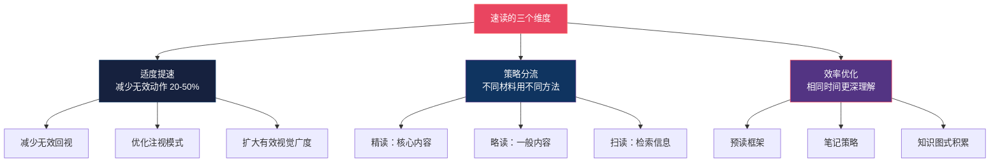
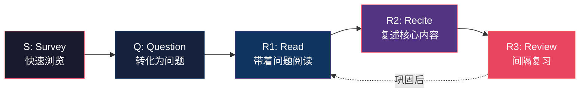
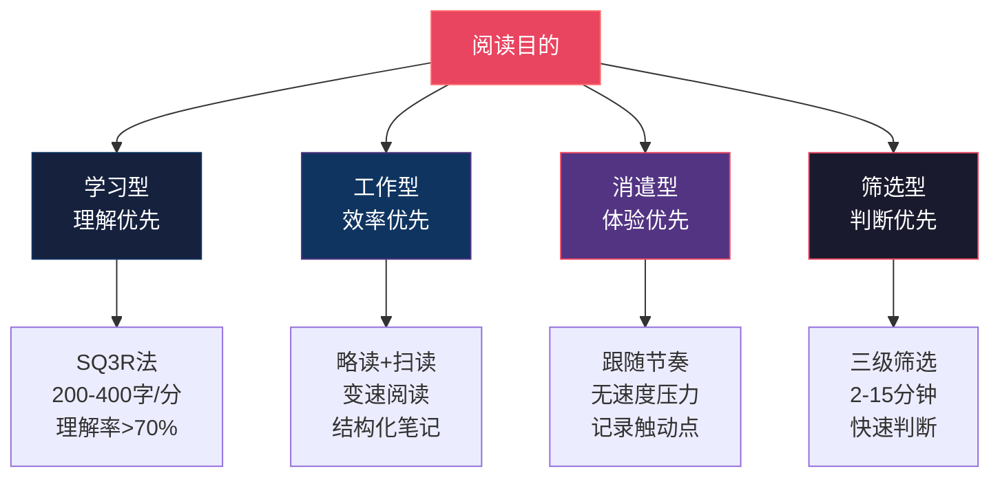

## 第四节 速读理论与技巧

### 一、速读的本质：在认知限制内最大化效率

"速读"（Speed Reading）是阅读领域最具争议性的话题之一。一方面，市场上充斥着"一目十行""每分钟读万字""照相记忆"等诱人宣传；另一方面，认知科学的研究一再表明，人类的阅读速度存在不可突破的生理和认知上限。要真正掌握速读技巧，首先必须厘清科学事实与商业神话的边界。

#### 1.1 阅读速度的科学极限

上一节已经详细介绍了阅读的眼动机制——注视、眼跳、视觉广度等。在此基础上，我们可以从定量角度理解阅读速度的上限：

| 参数 | 数值 | 说明 |
|------|------|------|
| 最短注视时间 | 约 150-200 毫秒 | 低于此时间无法完成词汇识别 |
| 每次注视有效信息 | 2-3 个中文字 | 视觉广度的硬上限 |
| 每秒注视次数 | 3-5 次 | 取决于文本难度和读者水平 |
| 由此推算的理论上限 | 约 600-900 字/分钟 | 理想条件下的最大值 |

基思·雷纳（Keith Rayner）等人在 2016 年发表于《Psychological Science in the Public Interest》的综述论文中，系统分析了数十年的眼动研究数据，得出明确结论：**没有任何科学证据表明，人们可以在保持深度理解的前提下，将阅读速度提升到每分钟 500-600 个英文单词（中文约 800-1000 字）以上。** 那些宣称可以"一目十行"的速读者，在标准化理解测试中的表现通常大幅下降——他们不是"读得更快"，而是"跳得更多"。

#### 1.2 速度神话的三种常见骗局

理解科学极限后，我们来解构市面上最常见的三种速读神话：

**骗局一："一目十行"。** 这种说法暗示人可以同时处理一整行甚至多行文字。但视觉神经科学已经证明，人类视网膜上只有中央凹（fovea）区域具有高分辨率视觉能力，其覆盖范围仅约 2 度视角（中文约 3-4 个字）。超出这个范围的信息只能获得模糊的形状和亮度信息，根本无法识别具体内容。所谓"一目十行"，实际上是用极快的速度跳过大量文字，只捕捉了极少数关键词——这不叫阅读，叫"扫描"。

**骗局二："消除默读就能提速"。** 默读（subvocalization）是阅读时大脑内部的语音加工过程，涉及语音环路和布洛卡区的协同工作。它是语言理解的神经基础之一，而非"坏习惯"。完全消除默读不仅极其困难（即使是最熟练的读者也无法做到），而且会严重损害理解深度。正确的做法不是消除默读，而是适当加快默读的节奏。

**骗局三："照相记忆/全脑阅读"。** 声称可以像照相机一样"拍下"整页内容的所谓"照相记忆"或"全脑阅读"，在严格的科学实验中从未被证实。2006 年，研究人员对一位自称拥有照相记忆的女性进行了实验室测试，结果表明她的"记忆"实际上来自出色的记忆策略（如记忆宫殿），而非视觉系统的特殊能力。

#### 1.3 速读的真正含义

既然存在科学上限，那"速读"还有意义吗？答案是：**有，但需要重新定义。**

真正的速读不是突破认知极限的"魔法"，而是在认知限制内，通过科学训练和策略优化，实现阅读效率的最大化。具体而言，科学的速读包含三个维度：

1. **适度提速**：通过减少无效回视、优化注视模式、扩大有效视觉广度等训练，将阅读速度提升 20-50%，同时不损失理解力
2. **策略分流**：根据不同阅读目的和材料类型，灵活选择精读、略读、扫读等不同策略，避免对所有内容"一视同仁"
3. **效率优化**：通过预读框架、笔记策略、知识图式等手段，在相同时间内获得更深的理解和更持久的记忆

### 二、测量你的阅读速度基线

在开始任何速读训练之前，你需要知道自己的基线阅读速度。没有基线数据，就无法衡量训练效果。

#### 2.1 标准测量方法

**步骤一：选择测试材料。** 选择一篇你从未读过的、难度适中的文章（约 2000-3000 字）。文章应该是连续的散文体（非对话、非列表），内容属于你的正常阅读范围（不要太专业也不要太通俗）。

**步骤二：正常阅读。** 以你平时的阅读速度和方式读完全文。不要刻意加快或放慢，就像平时读书一样。

**步骤三：记录时间。** 用秒表记录从开始读到读完的总时间（精确到秒）。

**步骤四：测试理解。** 合上文章，用自己的话写下文章的核心观点（3-5 个要点）。然后重新打开文章，对照评分。

**步骤五：计算速度。**

阅读速度（字/分钟）= 文章总字数 ÷ 阅读时间（分钟）

**步骤六：计算理解率。**

理解率 = 正确回忆的要点数 ÷ 文章实际要点数 × 100%

#### 2.2 正常阅读速度参考值

| 读者水平 | 中文阅读速度 | 理解率 | 说明 |
|---------|------------|--------|------|
| 初级读者 | 150-250 字/分 | 60-70% | 刚开始培养阅读习惯的人 |
| 普通读者 | 250-400 字/分 | 65-80% | 有日常阅读习惯的人 |
| 熟练读者 | 400-600 字/分 | 70-85% | 大量阅读的人 |
| 专业读者 | 600-800 字/分 | 75-90% | 在特定领域有深厚背景的人 |

需要注意：理解率低于 50% 的"快速阅读"几乎没有意义——你只是在"扫过文字"而非"理解内容"。

#### 2.3 不同材料的速度基线

同一个人在不同材料上的阅读速度可能差异巨大。建议分别测试以下类型的材料：

- **通俗文章**（新闻、博客）：通常最快
- **一般书籍**（非虚构类畅销书）：中等速度
- **专业文献**（论文、技术文档）：通常较慢
- **文学作品**（小说、散文）：因人而异

分别建立基线后，你就能清楚地知道自己在不同类型材料上的起点，也能更准确地衡量后续的训练效果。

### 三、五种经过科学验证的速读技巧

以下技巧均经过认知科学研究的支持，可以在不显著损失理解力的前提下提升阅读速度。每种技巧的原理、训练方法和适用场景都有详细说明。

#### 3.1 技巧一：减少无效回视（Regression Reduction）

**原理。** 回视是指眼睛在阅读过程中向后跳回到已经读过的内容。正常阅读中约 10-15% 的眼跳属于回视，其中大部分是因注意力不集中或缺乏自信导致的无效回视。减少这些无效回视可以直接提升阅读速度。

**训练方法。**

1. **指读法**：用手指或笔尖作为引导物，沿着文字行匀速向前移动。眼睛会自然跟随引导物，减少向后跳跃的冲动。开始时引导速度可以稍慢于正常阅读速度，逐步加快。
2. **节拍器辅助**：使用节拍器 App 设定一个固定节奏（例如每秒 2-3 拍），每拍移动引导物一个语义块。这种外在节奏可以帮助你建立稳定的前进习惯。
3. **遮挡法**：用一张白纸或书签覆盖已读过的内容，只露出当前正在读的行。物理上阻止自己回视。

**适用场景。** 信息密度较低的材料（新闻、博客、通俗读物）。对于高密度材料（学术论文、法律文件），保留回视是必要的。

**训练周期。** 每天练习 15-20 分钟，持续 2-3 周可以显著减少无效回视。

#### 3.2 技巧二：扩大有效视觉广度（Perceptual Span Expansion）

**原理。** 每次注视时，你的视觉系统能有效获取信息的范围（视觉广度）是可以通过训练扩大的。上一节提到，中文读者的视觉广度约为注视点左右各 2-3 个字。通过专门训练，可以将这个范围的利用效率提升到上限。

**训练方法。**

1. **舒尔特表训练（Schulte Table）**：制作一个 5×5 的方格，随机填入 1-25 的数字。将视线固定在中心数字 13 上，用余光找到 1→2→3→...→25 的顺序。每天练习 5-10 分钟，逐步缩短完成时间。
2. **扩展注视练习**：选择一行文字，以中间的词为注视点，尝试在不移动眼睛的情况下用余光读取左右两侧的词。从每次读取 3 个词开始，逐步增加到 5 个、7 个。
3. **闪视训练（Tachistoscope Training）**：使用速示器 App，快速闪现一组字符（100-200 毫秒），然后尝试回忆。逐步增加每次闪现的字符数。

**适用场景。** 所有类型的阅读。视觉广度的提升是底层能力的提升，对所有阅读场景都有帮助。

**训练周期。** 需要持续 4-8 周的训练才能看到明显效果。每天 10-15 分钟即可。

**重要提醒。** 视觉广度的扩大有客观上限。训练的目标是将你的视觉广度利用效率提升到生理极限，而非突破极限。超过生理极限的训练不仅无效，还可能导致眼疲劳。

#### 3.3 技巧三：优化默读节奏（Subvocalization Management）

**原理。** 默读（subvocalization）是阅读时大脑内部的语音加工过程。它不是需要消除的"坏习惯"，而是语言理解的神经基础。但对于简单的、信息密度低的内容，默读速度可能成为瓶颈——你的内部语音可能比你的实际阅读能力慢。

**训练方法。**

1. **加速默读**：不是消除默读，而是加快内部语音的节奏。尝试在心里"念"得更快一些，就像加速播放音频一样。这需要练习，但比消除默读现实得多。
2. **注意力转移**：将注意力从"声音"转移到"意义"上。阅读时不要关注每个字的读音，而是关注词语组合后的含义。这可以让你的语义加工系统部分独立于语音加工系统。
3. **旋律干扰法**：在阅读时轻轻哼一段熟悉的旋律。这会占用一部分语音环路的资源，迫使大脑更多依赖直接语义通路。这个方法适合信息密度低的材料，不建议用于需要深度理解的内容。

**适用场景。** 简单的、信息密度低的材料。对于复杂材料，默读是理解的保障，不应干扰。

**训练周期。** 2-4 周可以看到效果，但要注意监控理解率的变化。

#### 3.4 技巧四：分块阅读（Chunking）

**原理。** 分块阅读是指将文字分成有意义的"语义块"来阅读，而非逐字阅读。例如：

逐字阅读：他 / 今天 / 去 / 了 / 图 / 书 / 馆
分块阅读：他今天 / 去了图书馆

分块阅读的优势在于：每个语义块作为一个整体被处理，可以减少注视次数，同时利用语义结构加速理解。

**训练方法。**

1. **短语划分练习**：选择一段文字，用铅笔在纸上划出语义块的边界。开始时每句话分为 2-3 个块，逐步增加到每句话 1-2 个块。
2. **意群阅读**：阅读时有意识地将注意力放在"意群"上而非单个字词上。可以用手指一次覆盖 3-5 个字作为一个单元来引导。
3. **结构化文本练习**：先在结构清晰的文本（如说明文、议论文）上练习，因为这些文本的语义块边界比较明确。熟练后再应用到散文、小说等结构不那么明确的文本。

**适用场景。** 所有类型的阅读。分块阅读是一种底层能力，越熟练越好。

**训练周期。** 初步掌握需要 1-2 周，真正内化需要 1-2 个月的持续练习。

#### 3.5 技巧五：战略性变速阅读（Strategic Speed Variation）

**原理。** 最重要的速读技巧不是"读得更快"，而是"知道什么时候该快、什么时候该慢"。盲目追求整体速度的提升往往导致理解率下降；而战略性地调整速度，可以在总体效率上获得更大的提升。

**变速策略框架。**

| 内容类型 | 建议速度 | 策略 |
|---------|---------|------|
| 标题、导语 | 快速扫描 | 抓住关键词，判断是否值得深入 |
| 已知信息、过渡段落 | 快速浏览 | 确认与预期一致即可跳过 |
| 核心论点、关键数据 | 放慢速度 | 仔细阅读，确保理解 |
| 新概念、复杂论证 | 慢读+笔记 | 可能需要反复阅读或做笔记 |
| 举例说明、故事 | 中等速度 | 理解例子与论点的关系即可 |
| 总结、结论 | 放慢速度 | 整合全文信息，确认理解 |

**训练方法。**

1. **标记练习**：在阅读前先快速浏览全文（2-3 分钟），用不同颜色标记不同类型的内容：红色=核心论点（慢读）、黄色=关键数据（中速）、绿色=辅助信息（快读）。然后按照标记的指引进行变速阅读。
2. **计时反馈**：在阅读过程中，每读完一段就记录实际用时，与预期用时对比。如果某段用了预期的两倍时间，分析原因——是因为内容确实困难，还是因为注意力分散？
3. **目的导向阅读**：在开始阅读前明确"我要从这篇文章中获得什么"。有了明确的目的，你就能自动判断哪些内容需要精读、哪些可以跳过。

**适用场景。** 所有阅读场景。这是最通用、最实用的速读技巧。

**训练周期。** 观念转变可以在一天内完成，但形成习惯需要 2-4 周的刻意练习。

### 四、速读方法体系：三种核心策略

除了上述具体技巧，还有三种经过系统化整理的阅读策略，它们是从不同角度优化阅读效率的方法体系。

#### 4.1 略读（Skimming）：快速获取全局

略读的目的是在最短时间内获取文章的整体结构和核心观点，判断是否值得深入阅读。

**略读步骤：**

1. **读标题和副标题**（30 秒）：了解文章主题和结构
2. **读导语/摘要**（1 分钟）：获取核心观点
3. **读每段首句**（2-3 分钟）：首句通常是段落主题句，快速扫描每段首句可以把握全文论证脉络
4. **读结论/总结**（1 分钟）：获取作者的最终观点
5. **标记值得深入的段落**：在略读过程中标记需要精读的部分

略读一篇 3000 字的文章通常只需 3-5 分钟，但可以获得约 40-60% 的核心信息。这对于筛选阅读材料、确定阅读优先级非常有价值。

#### 4.2 扫读（Scanning）：精准定位信息

扫读的目的是在大量文本中快速找到特定信息，如某个数据、某个人名、某个概念的定义。

**扫读步骤：**

1. **明确目标**：在开始扫读前，清楚地知道自己在找什么（一个词、一个数字、一个概念？）
2. **利用视觉标记**：数字、大写、加粗、引号等视觉标记可以帮助你快速定位目标
3. **系统扫描**：不要随机浏览，而是按系统路径扫描——例如从上到下、从左到右，或者沿 Z 字形路径
4. **扩大视觉广度**：扫读时不需要逐字阅读，而是用较大的视觉广度覆盖文字，只在发现疑似目标时才聚焦

扫读是一种信息检索技能，在查阅参考书、搜索数据库、浏览网页时非常实用。

#### 4.3 SQ3R 法：结构化精读

SQ3R 是由弗朗西斯·罗宾逊（Francis Robinson）在 1946 年提出的结构化阅读方法，是学术阅读的经典框架。SQ3R 代表五个步骤：

| 步骤 | 英文 | 中文 | 具体操作 | 时间占比 |
|------|------|------|---------|---------|
| S | Survey | 浏览 | 快速浏览标题、目录、图表、摘要 | 5-10% |
| Q | Question | 提问 | 将标题转化为问题，带着问题去读 | 5% |
| R1 | Read | 阅读 | 带着问题仔细阅读全文 | 40-50% |
| R2 | Recite | 复述 | 合上书用自己的话复述核心内容 | 20-25% |
| R3 | Review | 复习 | 间隔复习，巩固记忆 | 15-20% |

SQ3R 的核心优势在于：通过"提问"步骤激活已有知识图式，通过"复述"步骤将信息从工作记忆转入长期记忆。研究表明，使用 SQ3R 方法阅读的学生，其理解率和记忆保持率比普通阅读方法高出 30-50%。

### 五、不同阅读目的的速读策略

阅读目的不同，最优策略也不同。盲目套用同一种方法是阅读效率低下的常见原因。

#### 5.1 学习型阅读：理解优先，速度为辅

**目标**：深度理解并长期记忆核心知识。

**推荐策略**：
- 使用 SQ3R 框架组织整个阅读过程
- 阅读速度控制在 200-400 字/分钟
- 每读完一节就用自己的话做简要笔记
- 遇到新概念时暂停，查资料、做关联
- 读完后进行间隔复习（当天、第 3 天、第 7 天）

**关键指标**：理解率应达到 70% 以上。速度不是主要关注点。

#### 5.2 工作型阅读：效率优先，精准提取

**目标**：快速找到所需信息，做出决策。

**推荐策略**：
- 先用略读确定信息位置，再用扫读精确定位
- 对核心内容用中等速度仔细阅读，对辅助内容快速跳过
- 阅读时同步做结构化笔记（问题→答案格式）
- 善用目录、索引、搜索功能快速定位

**关键指标**：信息提取的准确性和时效性。不需要记住所有内容，但需要知道去哪里找。

#### 5.3 消遣型阅读：体验优先，速度自由

**目标**：享受阅读过程，获得审美体验或放松。

**推荐策略**：
- 不设速度目标，跟随内容自然节奏
- 文学作品注意语言、意境、节奏，不必追求速度
- 可以在精彩段落放慢速度细细品味，在过渡段落加快节奏
- 记录触动自己的句子或想法

**关键指标**：阅读体验的满意度。速度完全服从于体验。

#### 5.4 筛选型阅读：判断优先，快速取舍

**目标**：快速判断一篇文章/一本书是否值得深入阅读。

**推荐策略**：
- 书：读序言+目录+第一章结论，约 15-20 分钟判断
- 文章：读标题+导语+结论，约 2-3 分钟判断
- 论文：读摘要+引言最后一段+结论，约 5 分钟判断
- 使用"三级筛选"：标题筛选→概要筛选→试读筛选

**关键指标**：筛选的准确率和速度。宁可多花 2 分钟确认，也不要误判一本好书。

### 六、速读训练的系统方案

知道技巧是一回事，真正掌握是另一回事。以下是一个为期 8 周的系统训练方案，帮助你将速读技巧内化为自动化能力。

#### 6.1 第一阶段：基线测量与意识建立（第 1 周）

**目标**：了解自己的阅读现状，建立速度意识。

| 日期 | 任务 | 时间 |
|------|------|------|
| 第 1 天 | 测量不同类型材料的基线阅读速度 | 30 分钟 |
| 第 2 天 | 记录自己的阅读习惯（回视频率、默读程度等） | 20 分钟 |
| 第 3 天 | 学习略读方法，在 3 篇文章上练习 | 30 分钟 |
| 第 4 天 | 学习扫读方法，练习定位信息 | 20 分钟 |
| 第 5 天 | 练习变速阅读：对同一篇文章进行标记+变速练习 | 30 分钟 |
| 第 6-7 天 | 综合练习 + 阶段性速度测试 | 各 30 分钟 |

#### 6.2 第二阶段：技巧训练（第 2-4 周）

**目标**：逐一掌握五种速读技巧。

每周重点训练一种技巧：

- **第 2 周**：减少无效回视。每天 15 分钟指读法练习。
- **第 3 周**：分块阅读。每天 15 分钟意群划分练习。
- **第 4 周**：扩大视觉广度。每天 10 分钟舒尔特表 + 5 分钟扩展注视练习。

每天额外花 15 分钟进行正常阅读，应用当周训练的技巧。

#### 6.3 第三阶段：整合应用（第 5-6 周）

**目标**：将多种技巧整合到日常阅读中。

- 每次阅读前先明确目的，选择合适的策略
- 阅读过程中主动应用变速策略
- 每周测量一次阅读速度，监控进步
- 开始建立个人的阅读策略库：什么类型的材料用什么方法

#### 6.4 第四阶段：习惯固化（第 7-8 周）

**目标**：让速读技巧成为自动化习惯。

- 将速读技巧应用到所有日常阅读中
- 不再需要刻意提醒自己"要分块""要指读"
- 定期测量速度和理解率，确保两者平衡
- 根据自己的特点调整和优化策略

#### 6.5 训练效果的合理预期

| 训练阶段 | 速度提升 | 理解率变化 | 说明 |
|---------|---------|-----------|------|
| 第 1 周 | 0-10% | 可能略降 | 正在适应新方法 |
| 第 2-4 周 | 10-20% | 恢复到基线 | 技巧开始见效 |
| 第 5-6 周 | 20-35% | 略有提升 | 策略优化发挥作用 |
| 第 7-8 周 | 30-50% | 稳定或提升 | 技巧内化为习惯 |

**重要提醒**：以上数据基于正常读者的典型表现。个体差异很大，有些人可能提升更多，有些人可能提升较少。关键不是追求极限速度，而是在保持或提升理解率的前提下提高效率。

### 七、数字时代的速读技巧

数字阅读已经成为主流。屏幕阅读和纸质阅读在速读技巧的应用上存在显著差异。

#### 7.1 屏幕阅读的特殊挑战

| 挑战 | 原因 | 应对策略 |
|------|------|---------|
| 注视模式更散乱 | 屏幕亮度、字体渲染影响眼动 | 调整字号为 14-16px，行距 1.5-1.8 |
| 回视频率更高 | 滚动操作打断连续性 | 使用分页而非滚动模式 |
| 注意力更易分散 | 通知、链接、弹窗干扰 | 全屏阅读模式 + 关闭通知 |
| 视觉疲劳更快 | 蓝光、闪烁、对比度 | 护眼模式 + 20-20-20 法则 |

**20-20-20 法则**：每阅读 20 分钟，看 20 英尺（约 6 米）远的物体 20 秒。这可以有效缓解眼部肌肉疲劳。

#### 7.2 数字工具的速读辅助

| 工具类型 | 功能 | 代表工具 |
|---------|------|---------|
| RSVP 阅读器 | 逐词快速显示，消除眼跳 | Sprint Reader, Reedy |
| 文本简化 | 去除广告、排版干扰 | Instapaper, Pocket |
| 速读训练 App | 舒尔特表、闪视训练 | 超级速读、Reading Trainer |
| 笔记工具 | 阅读时同步做笔记 | Notion, Obsidian |
| TTS 工具 | 文本转语音，辅助理解 | 系统内置 TTS |

**RSVP（Rapid Serial Visual Presentation）** 是一种特殊的速读技术，将文本逐词（或逐短语）在屏幕固定位置快速显示，消除了眼跳和回视的需求。研究表明，RSVP 可以在较低速度下提升阅读效率（约 10-20%），但在高速（>400 字/分）时理解率会显著下降。RSVP 适合信息密度低的材料快速浏览，不适合深度阅读。

#### 7.3 纸质 vs 数字：速读策略的选择

| 维度 | 纸质阅读 | 数字阅读 |
|------|---------|---------|
| 眼动效率 | 更稳定，回视更少 | 更散乱，滚动打断节奏 |
| 空间记忆 | 可利用页面位置记忆 | 位置感较弱 |
| 笔记便利性 | 边注、划线直观 | 搜索、整理更方便 |
| 速读训练 | 指读法更容易实施 | 工具辅助更多 |
| 推荐场景 | 深度学习、经典著作 | 信息检索、快速浏览 |

### 八、常见误区与科学纠正

| 误区 | 科学事实 | 正确做法 |
|------|---------|---------|
| "速读可以练到每分钟万字" | 视觉广度和认知加工速度有硬上限，理解率>70% 时上限约 600-1000 字/分 | 在 400-800 字/分范围内优化效率 |
| "默读是坏习惯，应该消除" | 默读是语言理解的神经基础，涉及语音环路和布洛卡区 | 不必刻意消除，可适当加快默读节奏 |
| "回视说明阅读能力差" | 适度回视是深层理解的正常表现（10-15% 为正常范围） | 减少因走神导致的无效回视，保留因理解需要的有效回视 |
| "所有材料都应该用同一种速度读" | 不同材料需要不同的阅读策略和速度 | 根据目的和难度灵活调整，建立变速阅读习惯 |
| "速读训练几天就能见效" | 神经可塑性需要数周到数月才能产生显著改变 | 制定 8 周系统训练计划，耐心坚持 |
| "速读 App 能替代系统训练" | App 只是辅助工具，核心是阅读策略和习惯的改变 | App 训练 + 真实阅读场景应用结合 |
| "读得越快记得越牢" | 遗忘曲线表明记忆需要间隔强化，速度过快反而损害记忆 | 配合间隔复习系统巩固阅读成果 |
| "照相记忆可以通过训练获得" | 无科学证据支持，属于伪科学 | 使用记忆宫殿等经验证的记忆策略 |
| "速读只适合简单材料" | 战略性变速阅读可以应用于所有类型的材料 | 对核心内容精读，对辅助内容快读 |

### 九、本节要点回顾

本节系统介绍了速读的科学基础、核心技巧和实用策略。以下是关键要点：

1. **速读的本质是在认知限制内最大化效率**，而非突破生理极限。通过科学训练可以将阅读速度提升 20-50%，同时不损失理解力。
2. **五种经过验证的速读技巧**：减少无效回视、扩大视觉广度、优化默读节奏、分块阅读、战略性变速阅读。每种技巧都有明确的训练方法和适用场景。
3. **三种核心阅读策略**：略读（快速获取全局）、扫读（精准定位信息）、SQ3R（结构化精读）。根据阅读目的选择合适的策略。
4. **不同阅读目的需要不同策略**：学习型重理解、工作型重效率、消遣型重体验、筛选型重判断。盲目追求速度是最常见的错误。
5. **系统训练需要 8 周**：从基线测量到技巧训练到整合应用到习惯固化，循序渐进。
6. **数字阅读有其特殊性**：屏幕阅读面临注意力分散、视觉疲劳等额外挑战，需要针对性的应对策略。

记住：**最好的速读者不是读得最快的人，而是知道什么时候该快、什么时候该慢的人。** 速度服务于理解，而非相反。
