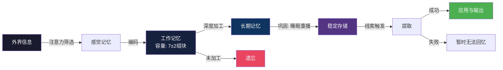
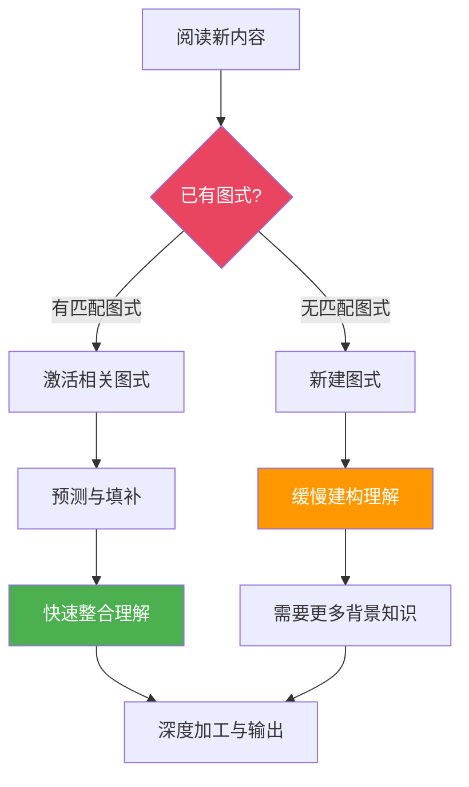
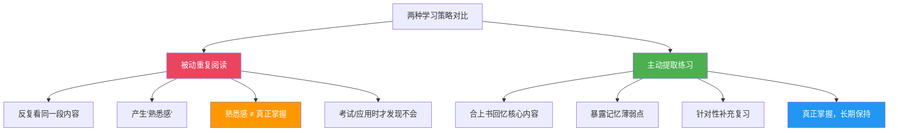
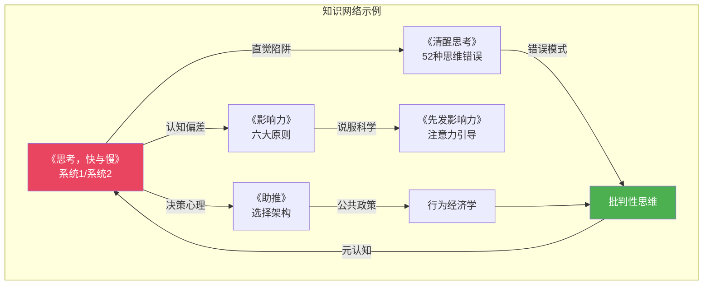

## 第五节 记忆与理解：如何让读过的内容真正留下

阅读的终极目的不是"读过"，而是"留下"。你花在一本好书上的时间，如果在合上书后的一周内遗忘了 80%，那么你真正获得的只是阅读时短暂的愉悦，而非持久的认知增量。本节从认知科学的底层机制出发，系统拆解阅读记忆的形成过程，然后逐层递进到可落地的策略体系——让你读过的每一本书，都真正成为你认知版图的一部分。

### 一、阅读记忆的三阶段模型

人类的记忆并非一个单一的存储仓库，而是一个由多个子系统协作的复杂网络。阅读过程中信息的"留下"，需要依次经过编码、存储、提取三个阶段。任何一个阶段出了问题，信息都无法被长期保留。

#### 1.1 编码：信息如何进入大脑

编码（Encoding）是记忆的起点——外界信息通过感官通道进入大脑，被转化为神经信号。阅读中的编码主要通过视觉通道完成：眼睛接收文字的光学信号，视觉皮层将其转化为字形特征，再由语言区将其转化为语义信息。

**编码的深度决定了记忆的强度。** 这就是认知心理学家克雷克和洛克哈特（Craik & Lockhart, 1972）提出的"加工层次理论"（Levels of Processing Theory）的核心观点。该理论将信息加工分为两个层级：

| 加工层级 | 关注焦点 | 示例 | 记忆效果 |
|---------|---------|------|---------|
| 浅层加工 | 形式特征：字形、排版、字体大小 | "这个词用的是粗体" | 记忆薄弱，几分钟内遗忘 |
| 深层加工 | 语义特征：含义、联系、应用 | "这个概念和我昨天看到的那个理论是矛盾的" | 记忆持久，可达数月甚至数年 |

大多数人的阅读停留在浅层加工——眼睛在文字上机械地扫过，大脑处于"识别模式"而非"生成模式"。这种阅读方式的信息编码效率极低，就像用铅笔在光滑的纸上写字，轻轻一擦就消失了。

**编码的三个关键要素：**

**注意力。** 注意力是编码的"入口阀门"。没有注意力的信息根本不会进入编码过程。神经科学研究表明，当注意力集中时，海马体（hippocampus）的活动显著增强，而海马体正是将短期记忆转化为长期记忆的关键结构。这也解释了为什么在嘈杂环境中、疲惫状态下或频繁切换任务时阅读效果极差——注意力资源被分散，编码通道变得狭窄。

**关联性。** 大脑更倾向于编码那些与已有知识网络相关联的新信息。当你读到一个新概念时，如果能立刻将其与你已有的知识建立联系，这个新概念就有了"抓手"，可以附着在已有的神经网络上。反之，一个孤立的、与你已有知识毫无关联的信息，就像没有根的浮萍，很快就会被遗忘。

**情感唤醒。** 杏仁核（amygdala）与海马体紧密相邻，它负责处理情绪信息。当某条信息伴随着情绪反应——惊讶、共鸣、愤怒、兴奋——时，杏仁核会向海马体发送"重要信号"，增强该信息的编码强度。这就是为什么那些让你产生"这说的不就是我吗"这种共鸣感的内容，往往记得特别牢。

#### 1.2 存储：信息如何在大脑中保持

编码后的信息进入存储阶段。根据存储时间和容量的不同，记忆系统分为工作记忆和长期记忆两个层级。

**工作记忆（Working Memory）。** 工作记忆是阅读过程中的"在线处理空间"，容量极其有限。认知心理学家乔治·米勒（George Miller, 1956）的经典论文指出，工作记忆的容量约为 7±2 个"组块"（chunk）。在中文阅读中，一个"组块"可能是一个词、一个短语或一个概念——取决于读者的知识水平。

工作记忆的有限容量对阅读理解有直接的制约作用：当你在阅读一个长难句或复杂论证时，如果前面的信息还没有被整合完毕，后面的信息就会把前面的"挤出"工作记忆，导致理解断裂。这就是为什么复杂文本需要放慢速度、反复阅读——你需要给工作记忆足够的时间来完成信息整合。

**长期记忆（Long-Term Memory）。** 长期记忆的容量几乎是无限的，存储时间可以从几分钟到一辈子。阅读中获得的知识，如果经过了充分的深度加工，就会进入长期记忆。长期记忆又可以进一步分为：

- **陈述性记忆（Declarative Memory）**：关于"是什么"的记忆，包括事实、概念、事件。阅读中获得的大部分知识属于此类。
- **程序性记忆（Procedural Memory）**：关于"怎么做"的记忆，如阅读技巧本身。通过反复练习，程序性记忆可以达到自动化水平。
- **情景记忆（Episodic Memory）**：关于"什么时候、在哪里"的记忆。你可能记得某本书是在某个特定场景下读的，这种情景记忆可以成为提取知识的线索。

**从工作记忆到长期记忆的转化——巩固（Consolidation）。** 编码后的信息并不会立即稳定地存储在长期记忆中，而是需要经历一个"巩固"过程。巩固主要发生在睡眠期间——尤其是深度睡眠阶段，海马体会将白天编码的信息"重播"并传输到大脑皮层进行长期存储。这就是为什么熬夜阅读的效果往往很差：你获得了输入，但缺乏巩固的时间窗口，大量信息在睡眠不足中流失。

#### 1.3 提取：信息如何被找回来

存储并不等于可用。一条信息安静地躺在长期记忆中，如果没有有效的提取线索，你可能完全不知道它在那里——直到某个特定的触发条件出现，你才突然"想起来"了。

**提取线索（Retrieval Cue）** 是打开记忆之门的钥匙。提取线索越丰富、越独特，提取成功率越高。以下几种线索在阅读记忆中特别有效：

- **情景线索**：你记得那段内容是在哪里读的、当时在做什么。这就是为什么回到你平时读书的环境中，更容易回忆起之前读的内容。
- **语义线索**：通过概念网络中的关联来定位。比如想到"博弈论"，可以联想到"纳什均衡"，进而联想到你读过的那本《策略思维》。
- **情绪线索**：与强烈情绪绑定的内容更容易提取。那些让你拍案叫绝或产生强烈共鸣的段落，回忆起来格外清晰。
- **生成线索**：你自己创造的笔记、思维导图、读书笔记等，是最强的提取线索——因为它们经过了你自己的认知加工，与你的个人知识网络深度绑定。

**提取失败的两种情况：**

| 类型 | 表现 | 原因 | 应对 |
|------|------|------|------|
| 编码失败 | 完全没有印象，仿佛从未读过 | 阅读时注意力不集中，信息从未进入长期记忆 | 改善阅读时的专注度，使用主动阅读策略 |
| 提取失败 | 感觉"知道但想不起来" | 信息存储在长期记忆中，但缺乏有效的提取线索 | 增加提取练习，建立多维索引 |

提取失败比编码失败更常见。很多人误以为自己"记性差"，实际上他们的记忆系统工作正常，只是缺乏有效的提取策略。这就像图书馆里有这本书，但索引卡片没有做好——书还在，只是找不到。

### 二、阅读理解的认知机制

记忆是"留下来"的基础，理解是"留得有意义"的前提。没有理解的记忆只是死记硬背，没有记忆的理解转瞬即逝。要真正让读过的内容留下，必须同时激活理解机制和记忆机制。

#### 2.1 图式理论：理解的脚手架

认知心理学家弗雷德里克·巴特莱特（Frederic Bartlett, 1932）最早提出了"图式"（Schema）概念，后来由让·皮亚杰（Jean Piaget）和大卫·鲁梅尔哈特（David Rumelhart）等人进一步发展。图式是大脑中已经存在的知识框架——它就像一个"模板"，帮助你快速理解和组织新信息。

**图式在阅读中的作用：**

**预测。** 当你看到"从前有一个……"时，你的"故事图式"立刻被激活，你知道接下来会是一个叙事性的内容。当你读一本商业书籍时，你的"商业分析图式"让你知道作者可能会先描述问题、再分析原因、最后给出解决方案。图式让你不需要逐字逐句地理解每一个字，而是可以用已有的框架来"预测"和"填充"信息。

**填补空白。** 没有任何文本能传达全部信息——作者总是假设读者具有一定的背景知识。图式填补了文本中没有明确说出的信息。例如，当文本说"他走进了教室"，你不需要作者告诉你教室里有桌椅、有黑板、有学生——你的"教室图式"自动补充了这些信息。

**过滤和扭曲。** 图式也是一把双刃剑。当新信息与已有图式不一致时，大脑可能会选择性地忽略、弱化甚至扭曲这些信息，以维持图式的稳定性。这就是为什么人们对与自己已有观点矛盾的信息往往"视而不见"——不是故意的，而是图式的自我保护机制在起作用。

**专家与新手的核心差异就在于图式的丰富度和组织性。** 一个物理学教授和一个物理系新生同时读一篇物理论文，教授能快速将新信息整合到自己庞大的知识网络中，而新生则缺乏足够的图式来"接住"新信息，理解过程变得缓慢而费力。

#### 2.2 工作记忆负荷理论：理解的瓶颈

约翰·斯威勒（John Sweller, 1988）提出的"认知负荷理论"（Cognitive Load Theory）是理解阅读瓶颈的关键框架。该理论指出，工作记忆在同一时间能处理的信息量是有限的，超载就会导致理解失败。

**三种认知负荷：**

| 类型 | 定义 | 在阅读中的表现 | 优化方向 |
|------|------|---------------|---------|
| 内在负荷（Intrinsic） | 内容本身的复杂度 | 专业术语多、逻辑链长、概念间关联复杂 | 将复杂内容分解为小块，先掌握基础再进阶 |
| 外在负荷（Extraneous） | 呈现方式导致的额外负担 | 排版混乱、逻辑不清、术语未解释 | 选择结构清晰的书籍；必要时做预处理笔记 |
| 关联负荷（Germane） | 用于深度加工的有效负荷 | 建立联系、批判思考、应用推理 | 最大化此类负荷，减少前两类 |

优化阅读理解的核心策略是：**最小化外在负荷，管理内在负荷，最大化关联负荷。**

具体操作：

1. **选择好的版本和译本。** 同一本书可能有多个中文译本，质量差异巨大。选择口碑好的译本可以显著降低外在负荷。
2. **先建立框架再深入细节。** 在精读之前先进行检视阅读（浏览目录、序言、每章标题），为工作记忆建立一个"预装框架"，后续信息可以分门别类地放入框架中，减少工作记忆的即时处理压力。
3. **一次只处理一个概念。** 当遇到密集的新概念时，停下来逐一消化，而不是试图同时理解所有内容。
4. **利用外部记忆辅助。** 做笔记、画图、列表——将信息从工作记忆中"卸载"到外部介质上，释放工作记忆容量用于更高层次的加工。

#### 2.3 生成效应：自己创造的才记得最牢

认知心理学中有一个被反复验证的现象叫做"生成效应"（Generation Effect）：**当学习者自己生成（而非被动接收）信息时，记忆效果显著更好。**

斯拉明和格林（Slamecka & Graf, 1978）的经典实验表明，让被试自己补全一个词（如"king → p___"），比直接告诉他们答案（"king → prince"），记忆保持率高出 30-40%。

**在阅读中的应用：**

- **预测-验证法。** 读到章节标题时，先花 30 秒预测这一章会讲什么，写下来，然后阅读时与实际内容对比。这个预测过程本身就是"生成"，它激活了你的已有图式，为新信息建立了"钩子"。
- **提问-回答法。** 在阅读前将章节标题转化为问题。例如，看到标题"锚定效应"，你转化为问题"什么是锚定效应？它是如何影响决策的？有哪些实际应用？"——然后带着这些问题去阅读。这比被动地"看看这一章讲什么"有效得多。
- **总结-对比法。** 每读完一节，合上书，用自己的话写出 2-3 句话的核心总结，然后重新打开书对比——你的总结和作者的表达有什么差异？哪些你理解对了，哪些理解偏了？这个过程既利用了生成效应，又实现了自我检测。

#### 2.4 测试效应：回忆比重复阅读更有效

"测试效应"（Testing Effect），也叫"提取练习"（Retrieval Practice），是近二十年认知科学最重要的发现之一。其核心结论是：**主动回忆（测试自己）比被动重复阅读更能促进长期记忆。**

卡皮克等人（Karpicke & Roediger, 2008）的实验清晰地证明了这一点：让两组学生阅读同一篇文章，A 组在阅读后进行回忆测试，B 组在阅读后重复阅读。一周后的测试中，A 组的记忆保持率比 B 组高出 50% 以上。

为什么测试比回忆更有效？原因在于：每次你主动回忆某条信息时，你都在强化那条信息的提取路径。这就像在丛林中反复走同一条路——走的次数越多，路就越清晰。而被动重复阅读只是在"看到"信息，并没有锻炼"提取"的能力。

**在阅读中的具体应用：**

1. **章节回顾测试。** 每读完一章，合上书，用白纸写下你记得的所有关键概念和观点。写不出来的地方就是你的薄弱环节，回去重点复习。
2. **闪卡系统。** 将核心知识点制作成正反面的闪卡（正面是问题，背面是答案），使用间隔重复软件（如 Anki）进行定期测试。
3. **向他人讲解。** 教是最好的学——当你试图向别人解释一个概念时，你实际上在进行高强度的提取练习。你讲不清楚的地方，就是你理解不够深的地方。
4. **自我提问。** 在阅读过程中定期停下来，不看文本，问自己："刚才读的那部分，核心观点是什么？有哪些论据支撑？"

### 三、六大核心策略：让读过的内容真正留下

理解了底层机制后，我们可以设计针对性的策略。以下六种策略覆盖了从编码到存储到提取的完整链条，每一种都有明确的操作步骤和适用场景。

#### 3.1 策略一：预读框架法（Schema Activation）

**原理。** 利用图式理论，在正式阅读之前激活或建立相关的知识框架，为新信息提供"接收器"。

**操作步骤：**

1. **浏览结构**（2-3 分钟）：阅读目录、序言、每章的标题和小标题。用笔在目录上标记你最感兴趣或最重要的章节。
2. **提出问题**（1-2 分钟）：根据目录和标题，列出 3-5 个你希望在阅读中回答的问题。将这些问题写在笔记本或电子文档中。
3. **激活已有知识**（1-2 分钟）：问自己"关于这个主题，我已经知道了什么？"快速写下你已有的相关知识。这一步的目的是激活大脑中已存在的相关图式。
4. **带着框架阅读**：在阅读过程中，有意识地将新信息与你建立的框架对接。遇到能回答你预设问题的内容，标记为"重点"；遇到你已有知识之外的全新内容，标记为"新知"。

**适用场景。** 非虚构类书籍、学术文献、专业教材。对于小说等文学作品，这一步可以简化为"读序言和前几章"。

**预期效果。** 研究表明，预读框架可以将信息编码效率提升 20-30%，因为它减少了工作记忆在理解文本结构上的负担，让更多认知资源可以用于深度加工。

#### 3.2 策略二：渐进式精读法（Progressive Deep Reading）

**原理。** 将阅读过程分为多个层级，每一层级在上一层级的基础上加深理解。这比一次性从头读到尾、不分轻重的方式更符合认知负荷理论的要求。

**三层阅读模型：**

| 层级 | 目标 | 方法 | 时间占比 |
|------|------|------|---------|
| 第一层：扫描 | 建立全局框架 | 读标题、首句、结论；标记核心段落 | 10-15% |
| 第二层：通读 | 理解主要论点 | 逐段阅读，做简要笔记，标记疑问 | 50-60% |
| 第三层：精读 | 深度消化核心 | 反复阅读重点段落，做详细笔记，建立联系 | 25-30% |

**操作细节：**

第一层扫描时，你需要回答三个问题：这本书/这一章的核心主题是什么？作者的核心论点是什么？整体结构是怎样的？

第二层通读时，你的重点是理解而非记忆——不要试图记住所有内容，而是确保你理解了每个段落在说什么。遇到不懂的地方，先标记，不要卡住。理解是一个"先粗后细"的过程。

第三层精读时，你只需要聚焦 20% 的核心内容（帕累托法则——一本书中 20% 的内容承载了 80% 的价值）。对这 20% 的内容进行深度加工：用自己的话重述、建立联系、提出批判、寻找应用场景。

**预期效果。** 渐进式精读可以将阅读效率提升 40-60%。你花在每一层级上的时间都是"精准投入"——不像传统阅读那样"平均用力"，导致重要内容没有深入、次要内容浪费了时间。

#### 3.3 策略三：多维编码法（Multi-Dimensional Encoding）

**原理。** 记忆的编码通道越多，提取路径就越多，记忆就越稳固。同时利用视觉、语义、空间和情感多个通道进行编码，可以显著增强记忆的持久性。

**操作方法：**

**视觉编码——做笔记时使用图示化表达。** 不要只是用文字记录，而是用箭头、框图、表格、思维导图等视觉元素来组织信息。视觉信息由大脑右半球处理，语义信息由左半球处理——双侧编码产生的记忆比单侧编码强得多。

**空间编码——利用位置记忆。** 在书的页边空白处做批注，利用"这段话在书的哪个位置"作为空间线索。研究表明，读者对文本内容的空间位置有显著的记忆效应——你可能忘了某句话的具体内容，但记得它大概在书的左边页面的上半部分。

**情感编码——主动与个人经验建立联系。** 读到一个观点时，问自己："这和我的什么经历有关？这让我想起了什么？这对我意味着什么？"情感连接越强，记忆越深刻。

**故事编码——将抽象概念嵌入叙事。** 人类大脑天生对故事敏感。当你读到一个抽象理论时，尝试为它"编"一个具体的例子或场景。例如，读到"沉没成本谬误"时，想象一个场景：你花了 200 元买了一张电影票，看了 30 分钟发现是烂片，你是否应该继续看完？这个具体的场景会让抽象概念变得生动而持久。

#### 3.4 策略四：间隔提取练习（Spaced Retrieval Practice）

**原理。** 结合间隔重复和测试效应两种强大的认知策略。在读完内容后的特定时间点进行主动回忆，用最少的时间获得最持久的记忆。

**具体操作时间表：**

| 回忆节点 | 时间 | 操作 | 预期记忆保持率 |
|---------|------|------|--------------|
| 即时回顾 | 读完后 5 分钟 | 合上书，写出 3-5 个核心要点 | 80-90% |
| 当日复盘 | 当天晚上 | 翻看笔记，不看书回忆主要框架 | 70-80% |
| 三日复习 | 第 3 天 | 仅看标题和关键词，尝试回忆详细内容 | 60-70% |
| 一周总结 | 第 7 天 | 写一段 200 字左右的总结，不看原书 | 70-80% |
| 月度回顾 | 第 30 天 | 快速浏览笔记，检查哪些还记得、哪些忘了 | 85-90% |

**关键要点：** 每次回忆时，必须先尝试自己回忆，然后再看笔记或原书。这个"先回忆再核对"的顺序至关重要——正是回忆过程中的"挣扎"在强化记忆路径。如果直接看笔记，你就跳过了最有价值的提取练习环节。

**工具推荐：** Anki（间隔重复软件）是最有效的工具。将核心知识点制作为卡片，Anki 会自动安排最佳复习时间。对于阅读笔记，也可以使用 Obsidian 或 Notion 建立双链笔记系统，通过定期"随机漫步"笔记网络来实现非结构化的提取练习。

#### 3.5 策略五：费曼学习法（Feynman Technique）

**原理。** 以物理学家理查德·费曼命名。费曼以其能用最简单的语言解释最复杂的概念而闻名。该方法的核心理念是：**如果你不能用简单的语言向一个外行解释清楚，说明你自己还没有真正理解。**

**四步操作：**

1. **选择概念。** 从你刚读完的内容中选择一个你认为重要的概念或理论。
2. **教给小白。** 想象你要向一个 12 岁的孩子解释这个概念。用最简单的语言，避免专业术语。如果你发现自己在说"这个东西就是那个意思"或者"总之就是……"，说明你对这个概念的理解还不够透彻。
3. **发现卡壳。** 在"教学"过程中，你会发现自己在某些地方卡住了——说不清楚、逻辑不通、举不出例子。这些卡壳点就是你的理解薄弱点。
4. **回炉重造。** 回到原书，重新阅读那些你卡壳的部分，直到你能流畅地解释为止。然后重复第二步。

**进阶应用：**

- **写博客或公众号文章。** 将你读到的知识整理成面向公众的文章。写作过程就是费曼学习法的延伸——你需要组织逻辑、选择语言、提供例子，这些都是深度加工。
- **录制语音或视频讲解。** 对着手机录一段 3 分钟的讲解。回听时你会发现自己哪些地方表述不清、哪些地方逻辑跳跃。
- **在社群中讨论。** 加入读书会或学习社群，定期分享你的阅读收获。他人的提问会迫使你从新的角度审视自己的理解。

#### 3.6 策略六：知识网络构建法（Knowledge Network Building）

**原理。** 孤立的知识点容易遗忘，网络化的知识互相支撑、互相触发。当你的知识从"散点"变成"网络"时，任何一点的激活都能带动整个网络区域的回忆——就像拉起渔网的一个角，整张网都会被带起来。

**操作方法：**

**建立跨书连接。** 每读完一本书，列出 3-5 个这本书与其他你读过的书之间的联系。例如：《思考，快与慢》中的"系统1和系统2"与《助推》中的"选择架构"有什么关系？《影响力》中的"社会认同"原则与《乌合之众》中的"群体心理"有什么共通和不同？

**建立跨领域连接。** 尝试将一个领域的知识应用到另一个领域。例如：经济学中的"边际效用递减"是否可以用来解释为什么你读同一本书读到第三遍时收获越来越小？生态学中的"多样性稳定性"原则是否可以用来解释为什么多元化的阅读计划比专攻一个领域更有价值？

**使用双链笔记工具。** Obsidian、Logseq 等支持双向链接的笔记工具是构建知识网络的理想平台。每一条笔记都可以通过 `[[双向链接]]` 与其他笔记建立关联。随着时间的积累，这些链接会形成一个庞大的知识图谱，你可以在其中自由导航、发现新的关联。

**定期进行"知识审计"。** 每月花 30 分钟浏览你的知识图谱，寻找"孤立节点"（只有一两条链接的笔记）和"密集区域"（互相连接最紧密的区域）。孤立节点可能需要你补充相关阅读，密集区域可能代表你已经形成了一个成熟的知识模块。

### 四、不同类型内容的记忆策略差异

并非所有阅读内容都适用同一种记忆策略。不同类型的知识具有不同的特点，需要针对性地调整策略。

#### 4.1 事实性知识：定义、数据、概念

**特点：** 精确性要求高，一字之差可能意义完全不同。

**最佳策略：**
- 使用闪卡系统（Anki）进行间隔提取练习
- 为每个概念编写一个"一句话定义 + 一个具体例子"
- 利用助记法（首字母缩略、谐音、意象联结）辅助精确记忆
- 定期进行"默写测试"——不看任何材料，写出某个领域的核心概念清单

**示例：** 记忆"锚定效应"——定义：人们在做判断时会被最先接收到的信息（锚）过度影响。例子：商场标价"原价 999，现价 299"——999 就是锚，让你觉得 299 很便宜，即使它的真实价值可能只有 150。

#### 4.2 程序性知识：方法、步骤、流程

**特点：** 需要按照特定顺序执行，理解不如实践有效。

**最佳策略：**
- 将流程转化为"操作清单"（checklist），每次遇到类似场景时按照清单执行
- 在阅读后 24 小时内进行至少一次实际操作
- 记录操作过程中的问题和偏差，与书本知识对比
- 反复实践直到形成肌肉记忆般的自动化反应

**示例：** 读完《非暴力沟通》后，在下一次有冲突的对话中，刻意按照"观察→感受→需要→请求"四步法练习。第一次可能很生硬，第五次就流畅多了。

#### 4.3 概念性知识：理论、框架、模型

**特点：** 抽象度高，需要大量例子来"落地"。

**最佳策略：**
- 为每个理论收集 3-5 个不同场景的例子（从书中找 + 自己举例 + 从其他来源找）
- 画出理论的可视化结构图（概念图、流程图、因果图）
- 用自己的话重新表述理论，与原版对比
- 尝试用该理论解释一个新现象——如果解释得通，说明你真的理解了

**示例：** 学习"马斯洛需求层次"——不仅要记住五个层次，还要能用它解释"为什么物质激励到一定阶段后效果递减""为什么在危机时刻人们会做出在正常时期不会做的选择"等现象。

#### 4.4 叙事性知识：故事、案例、人物传记

**特点：** 天然具有故事结构，情感连接强，但可能缺乏系统性。

**最佳策略：**
- 提取故事中的"核心教训"——不是记住情节，而是理解"这个故事说明了什么道理"
- 将多个相关案例进行对比分析——它们的共同点是什么？差异在哪里？
- 利用故事本身的情感记忆来"附着"理性知识——案例是记忆理论的最好载体
- 建立"案例库"，将读到的精彩案例按照主题分类存储，以便日后写作或演讲时调用

### 五、阅读中的记忆障碍与突破方法

#### 5.1 "读了就忘"综合征

**表现：** 读完一本书，过几天就只记得"好像挺好的"，但说不出具体学到了什么。

**根因分析：** 这通常不是记忆力的问题，而是编码策略的问题。具体来说，可能的原因包括：

| 根因 | 比例 | 诊断方法 | 解决方案 |
|------|------|---------|---------|
| 阅读时注意力分散 | 40% | 回想阅读时是否经常走神、看手机 | 创造专注环境，使用番茄钟（25分钟专注+5分钟休息） |
| 只有输入没有输出 | 30% | 读完后是否有任何形式的笔记或回顾 | 每章至少写 3 句话的总结 |
| 没有建立联系 | 20% | 新知识是否与已有知识产生了关联 | 阅读时主动问"这和我知道的XX有什么关系" |
| 睡眠不足 | 10% | 阅读后当晚睡眠是否充足 | 保证 7-8 小时睡眠，让巩固过程顺利进行 |

#### 5.2 "好像懂了但说不出来"

**表现：** 阅读时觉得理解了，但合上书后无法用自己的话解释。

**根因分析：** 这是"流畅性错觉"（Fluency Illusion）——大脑将"读得流畅"误判为"理解透彻"。当你在阅读过程中，上下文一直在"托着"你，你以为自己理解了，但实际上你只是"跟着走"。

**突破方法：**

1. **强制输出。** 每读完一个章节，立刻合上书，用语音备忘录录一段 2 分钟的讲解。回听时你会发现哪些地方真的理解了、哪些只是"感觉理解了"。
2. **追问三层。** 对任何一个概念，追问三层"为什么"。例如：为什么间隔重复有效？→ 因为它利用了遗忘曲线的时间窗口。为什么遗忘曲线会呈现这种形态？→ 因为海马体的巩固机制受到干扰和衰退的影响。为什么海马体的巩固需要时间？→ 因为突触可塑性（长时程增强）的形成需要蛋白质合成……追问到你答不上来的那一层，就是你的理解边界。
3. **类比测试。** 尝试用一个完全不同的领域来类比你刚学到的概念。如果你能做出合理的类比，说明你理解了概念的本质而非表面。例如：用"免疫系统"来类比"习惯养成"——初次接触（疫苗）→ 小规模激活（微习惯）→ 建立记忆细胞（自动化）→ 快速响应（习惯回路）。

#### 5.3 "书读得多但串不起来"

**表现：** 读了很多书，但知识是碎片化的，无法形成体系。

**根因分析：** 缺乏"整合性阅读"的习惯。每一本书都被当作独立的知识单元来处理，没有与已有的知识网络建立连接。

**突破方法：**

1. **建立主题阅读清单。** 围绕核心主题，列出 5-10 本相关的书进行系统阅读。同一主题的多本书之间自然会产生联系和对比。
2. **使用统一的笔记框架。** 无论读什么书，都使用同一套笔记模板（核心论点→关键证据→个人评价→行动启示→关联知识）。统一的框架让你的笔记具有可比性和可检索性。
3. **定期进行"知识融合"。** 每读完 5 本左右的书，花一个下午的时间专门进行知识整合——画出这些书之间的关系图，找到共同的主题和矛盾的观点，提炼出你自己的"元理论"。
4. **写"领域综述"。** 当你在一个主题上积累了足够的阅读量后，尝试写一篇该领域的综述文章。这个过程会迫使你将所有碎片化的知识整合成一个连贯的叙事。

### 六、数字时代的阅读记忆优化

数字阅读的普及带来了便利，也带来了新的记忆挑战。屏幕阅读与纸质阅读在记忆效果上存在显著差异，了解这些差异并采取针对性措施，是当代读者必须面对的课题。

#### 6.1 屏幕阅读的记忆劣势

挪威斯塔万格大学安妮·曼根（Anne Mangen）教授的系列研究表明，纸质阅读在文本理解和记忆方面略优于屏幕阅读，尤其是在长文本和需要深度理解的内容上。

造成这种差异的原因包括：

| 因素 | 纸质阅读 | 屏幕阅读 | 对记忆的影响 |
|------|---------|---------|------------|
| 空间定位感 | 页面位置固定，形成空间记忆地图 | 滚动阅读打破空间感，难以定位 | 纸质更有助于内容的空间编码 |
| 触觉反馈 | 翻页动作、纸张质感提供触觉线索 | 缺少物理触感 | 额外的感觉通道增强编码 |
| 干扰程度 | 纯文本环境，干扰少 | 通知、链接、弹窗频繁打断 | 干扰降低注意力质量，削弱编码 |
| 阅读深度 | 倾向于更慢、更深入的阅读 | 倾向于更快、更浅层的扫描 | 深度阅读产生更强的记忆痕迹 |

#### 6.2 数字阅读的记忆增强策略

虽然数字阅读有其劣势，但可以通过以下策略弥补：

**降低屏幕阅读速度。** 有意识地放慢屏幕阅读速度——研究表明，屏幕阅读时人们倾向于"F形扫描"（快速扫过开头几行，然后垂直扫描左侧），这种阅读模式的编码深度远低于纸质阅读的线性阅读模式。刻意放慢速度可以部分抵消这种效应。

**利用数字工具的优势。** 数字阅读的劣势可以通过工具弥补——高亮和批注功能（如微信读书的划线和想法）、全文搜索功能、笔记导出功能——这些工具在纸质阅读中是做不到的。关键是不要让工具分散注意力，而是将其作为增强编码和提取的手段。

**创建数字阅读的"仪式感"。** 纸质阅读的物理仪式感（翻开书、翻页、合上书）本身就是一种编码线索。数字阅读缺乏这种仪式感，你可以主动创造：选择固定的阅读 App 和阅读模式（深色模式或护眼模式）、关闭所有通知、使用专注模式、在固定的时间和地点进行阅读。

**关键原则：** 无论选择哪种媒介，核心策略不变——主动加工、深度编码、间隔提取。媒介只是载体，策略才是关键。一个好的纸质读者和一个好的数字读者的记忆效果不会相差太大；而一个主动阅读者和一个被动阅读者之间的差距，远大于任何媒介差异。

### 七、常见误区与科学纠正

| 误区 | 科学事实 | 正确做法 |
|------|---------|---------|
| "我记性差，读了就忘" | 记忆力的个体差异远小于编码策略的差异。大多数人的问题不是记不住，而是没有用对方法 | 使用深度加工和提取练习，而非死记硬背 |
| "读得越快记得越少" | 速度和记忆不是简单的反比关系。战略性变速阅读可以在不降低记忆的前提下提高效率 | 对核心内容精读，对辅助内容快读 |
| "重复阅读就能记住" | 研究反复证明，重复阅读的效果远不如提取练习（测试效应） | 用"回忆-核对"替代"再看一遍" |
| "做笔记就是抄书" | 抄书是最浅层的加工方式。好的笔记应该包含你的理解、联系和评价 | 用自己的话重新组织，加入个人思考 |
| "一本好书只读一遍就够了" | 经典书籍值得反复阅读——每次阅读都会基于你新的知识背景产生新的理解 | 核心书籍至少读两遍：第一遍建立框架，第二遍深化理解 |
| "读书笔记越多越好" | 笔记的价值不在于数量而在于质量。过多的笔记反而会增加检索成本 | 只记录核心概念和个人洞察，控制笔记量 |
| "睡前读书有助于记忆" | 适度阅读确实可以利用睡眠巩固记忆，但如果阅读导致兴奋或焦虑，反而影响睡眠质量 | 选择轻松的阅读内容作为睡前读物，避免需要高度思考的内容 |
| "碎片化阅读也能深度记忆" | 碎片化阅读（如刷公众号）的编码深度远低于连续阅读。频繁切换主题会加重认知负荷 | 核心主题的阅读安排在整块时间中进行，碎片时间用于复习和轻度阅读 |

### 八、本节要点回顾

1. **阅读记忆是三阶段过程：编码→存储→提取。** 任何阶段的薄弱都会导致"读了等于没读"。优化需要覆盖全链条，而非只关注某一环。

2. **编码深度决定记忆强度。** 浅层加工（只关注字面意思）产生脆弱的记忆，深层加工（建立联系、批判思考、应用实践）产生持久的记忆。

3. **图式是理解的脚手架。** 已有知识越丰富，理解新知识越容易。阅读前激活相关图式（预读框架法），可以显著提升编码效率。

4. **工作记忆是理解的瓶颈。** 通过降低外在认知负荷（选择好的版本、建立阅读框架）、管理内在负荷（一次消化一个概念）、最大化关联负荷（深度加工），可以突破瓶颈。

5. **生成效应和测试效应是最强大的记忆增强器。** 自己生成的信息比被动接收的记得更牢；主动回忆比重复阅读的效果高出 50% 以上。

6. **六大核心策略覆盖完整链条：** 预读框架法（激活图式）→ 渐进式精读法（管理负荷）→ 多维编码法（增强编码）→ 间隔提取练习（强化存储）→ 费曼学习法（深度理解）→ 知识网络构建法（系统整合）。

7. **不同类型的知识需要不同的记忆策略。** 事实性知识用闪卡，程序性知识靠实践，概念性知识要举例，叙事性知识提教训。

8. **数字时代需要针对性的补偿策略。** 屏幕阅读在空间编码和注意力方面存在劣势，但可以通过工具和习惯弥补。核心策略不变：主动加工、深度编码、间隔提取。

记住：**阅读的目的不是翻完最后一页，而是在合上书之后，你的认知世界因为这本书而发生了不可逆的改变。** 这种改变不会自动发生——它需要你有意识地编码、有策略地存储、有规律地提取。掌握了本节的方法，你就拥有了将阅读转化为持久认知资产的完整工具箱。
