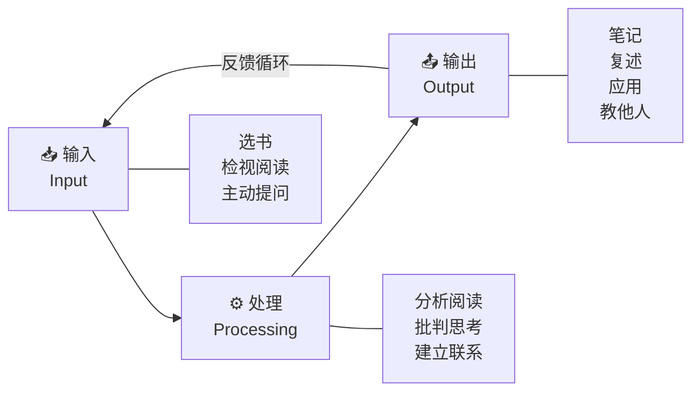
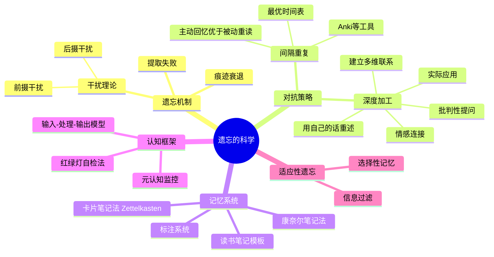

## 一、遗忘的科学

遗忘不是失败，而是大脑最基本的信息管理策略。理解遗忘的机制，才能真正理解如何让读过的内容留在记忆里。

### 1.1 遗忘曲线：艾宾浩斯的发现与其局限

1885年，德国心理学家赫尔曼·艾宾浩斯（Hermann Ebbinghaus）以自己为被试，用无意义音节（如"DAX"、"BUP"）作为记忆材料，通过严格的实验量化了遗忘的速度，绘制出了人类历史上第一条遗忘曲线。

**核心数据：**

| 时间间隔 | 遗忘比例 | 保留比例 |
|---------|---------|---------|
| 20分钟 | 42% | 58% |
| 1小时 | 56% | 44% |
| 1天 | 66% | 34% |
| 2天 | 72% | 28% |
| 6天 | 75% | 25% |
| 31天 | 79% | 21% |

遗忘曲线揭示的残酷现实：**如果你读完一本书后不做任何复习，一周后你可能只记住了四分之一的内容。** 这不是记忆力差的问题，而是大脑的正常工作机制。

**遗忘曲线的局限性需要了解：**

艾宾浩斯实验使用的是无意义音节，而真实阅读材料是有意义的、与已有知识相关联的内容。后续研究（如Bahrick, 1984的外语词汇记忆研究）表明，有意义材料的遗忘速度比无意义音节慢得多——学习西班牙语词汇的学生在50年后仍能记住约50%的词汇。这意味着：

- 遗忘曲线的具体数字不必死记，更重要的是理解"先快后慢"的总体趋势
- 深度理解和有意义联系能够显著减缓遗忘速度
- 艾宾浩斯曲线代表的是"最坏情况"——通过正确的方法，你可以大幅改善这个曲线

### 1.2 遗忘的三大机制

遗忘并非单一现象，认知心理学识别出三种不同的遗忘机制，理解它们有助于针对性地采取对策。

#### 1.2.1 痕迹衰退（Trace Decay）

最直觉的解释：记忆痕迹会随着时间自然消退，就像沙滩上的脚印被海浪逐渐抹去。神经科学的解释是：记忆存储在神经元之间的突触连接中，如果不被重新激活，这些突触连接会逐渐减弱。

**对策：** 定期复习，重新激活突触连接。这正是间隔重复的理论基础。

#### 1.2.2 干扰理论（Interference Theory）

这是目前心理学界最广泛接受的遗忘理论。干扰理论认为，遗忘不是因为记忆消失了，而是因为其他信息干扰了你对目标信息的提取。干扰分为两种：

**前摄干扰（Proactive Interference）：** 旧信息干扰新信息的记忆。例如，你换了新手机号后，总是不自觉地拨出旧号码。在阅读中，如果你连续阅读两本观点相反的书，第二本书的内容可能会干扰你对第一本书的记忆。

**后摄干扰（Retroactive Interference）：** 新信息干扰旧信息的记忆。例如，你刚背完一组单词，紧接着又背了另一组，结果第一组的记忆变差了。在阅读中，如果你在短时间内密集阅读大量同主题书籍，后读的书会"覆盖"先读的书的内容。

**对策：** 不同主题的阅读之间留出间隔（至少15-30分钟的休息），避免同质内容的连续输入。在学习相似内容时，刻意寻找它们之间的差异点以减少混淆。

#### 1.2.3 提取失败（Retrieval Failure）

信息实际上存储在长时记忆中，但你找不到正确的"提取线索"来访问它。最典型的例子是"话到嘴边说不出来"（tip-of-the-tongue phenomenon）——你知道自己知道，但就是想不起来。

编码特异性原则（Encoding Specificity Principle，Tulving & Thomson, 1973）解释了这一现象：信息在什么环境下被编码（学习），就更容易在相同环境下被提取。这就是为什么：

- 在考试教室里复习比在宿舍里复习效果更好
- 某些气味或音乐能突然唤起多年前的记忆
- 情绪状态一致时回忆效果更好（状态依赖记忆）

**对策：** 在多种不同环境下复习同一内容（变化编码情境），建立多条提取路径。复习时不要只看书，而是主动尝试回忆——每多一条提取路径，你就多一个找到这个记忆的入口。

### 1.3 对抗遗忘的核心武器：间隔重复

间隔重复（Spaced Repetition）是对抗遗忘最有效的策略，其核心原理是利用"间隔效应"（Spacing Effect）：将复习分散在多个时间点，比集中在一次复习中效果更好。

#### 1.3.1 间隔效应的科学基础

间隔效应最早由赫尔曼·艾宾浩斯本人发现，后经百余年研究反复验证。Cepeda等人（2006）在一项大规模元分析中汇总了254项研究，确认间隔学习的优越性在不同材料类型、不同年龄群体、不同记忆任务中都成立。

**为什么间隔比重集中更有效？** 两种主流解释：

- **提取难度假说：** 当间隔足够长，记忆已经部分消退时，成功提取需要更多的认知努力，这种"有难度的提取"会产生更强的记忆巩固效果（Bjork的"合意困难"理论）
- **编码变异性假说：** 每次复习时你的心智状态和上下文略有不同，这种变化性创造了更多的提取线索

#### 1.3.2 最优间隔时间表

基于遗忘曲线和后续研究，以下是一个经过验证的间隔重复时间表：

| 复习次数 | 距首次学习的时间 | 预期记忆保持率 | 复习时长（约） |
|---------|----------------|--------------|-------------|
| 第1次复习 | 学习后1天 | 约80% | 10-15分钟 |
| 第2次复习 | 学习后3天 | 约85% | 8-12分钟 |
| 第3次复习 | 学习后7天（1周） | 约90% | 5-10分钟 |
| 第4次复习 | 学习后14天（2周） | 约92% | 5-8分钟 |
| 第5次复习 | 学习后30天（1月） | 约95% | 3-5分钟 |
| 第6次复习 | 学习后60天（2月） | 约96% | 3-5分钟 |

每次复习只需要很短的时间，但累积效果是显著的——经过5次间隔复习，你可以将记忆保持率从遗忘曲线预期的25%提升到95%。

**关键原则：** 每次复习的最优时间点是"即将遗忘但还没有完全遗忘"的时刻。复习太早，效果浪费（因为记忆还很强）；复习太晚，等于重新学习（因为已经完全遗忘了）。

#### 1.3.3 主动回忆 vs 被动重读

间隔复习的质量同样重要。研究表明，**主动回忆**（retrieval practice）的效果远超被动重读：

- Roediger & Karpicke（2006）的经典实验：学生阅读一篇文章后，一组进行回忆测试，另一组重读文章。1周后测试，回忆组的记忆保持率比重读组高出约50%。
- 这个效应被称为"测试效应"（Testing Effect），已被数百项研究重复验证。

**实操建议：**

- 复习时不要直接翻看原文，先合上书尝试回忆，回忆不出来再看
- 用自测题、闪卡（flashcard）代替单纯的重读
- 费曼技巧（用简单语言教别人）本质上就是一种高强度的主动回忆

#### 1.3.4 间隔重复工具实操

现代间隔重复软件（SRS）会自动为你安排复习时间，你只需要添加内容：

**Anki（推荐，免费开源）：**
- 核心机制：每张卡片有"困难/一般/简单/容易"四个按钮，Anki根据你的选择自动调整下次复习间隔
- 最佳实践：每张卡片只测试一个知识点（最小信息原则）；用自己话表述而非照搬原文；添加图片和上下文
- 高效用法：阅读时遇到重要概念，随手创建Anki卡片，利用碎片时间复习

**其他工具对比：**

| 工具 | 平台 | 费用 | 特点 |
|------|------|------|------|
| Anki | 全平台 | 免费（iOS付费） | 最灵活，插件生态丰富，学习曲线较陡 |
| Quizlet | 网页/App | 基础免费 | 界面友好，适合快速创建，但间隔算法较简单 |
| SuperMemo | Windows | 付费 | 间隔重复算法的鼻祖，功能最强大但上手最难 |
| 墨墨背单词 | 移动端 | 部分免费 | 针对中文用户优化，适合语言学习 |
| 微信读书笔记 | 移动端 | 免费 | 导出笔记后手动制卡，适合书籍阅读场景 |

### 1.4 深度加工：让信息"粘"在记忆里

认知心理学家弗格森·克雷克（Fergus Craik）和罗伯特·洛克哈特（Robert Lockhart）于1972年提出了"加工层次理论"（Levels of Processing Theory），认为记忆的持久性取决于信息被加工的深度，而非单纯的重复次数。

#### 1.4.1 浅层加工 vs 深层加工

**浅层加工**关注信息的物理和表面特征——字形、声音、语法结构。例如，"这个词是斜体的""这个字的偏旁是什么"。大多数人的阅读停留在浅层加工的水平——眼睛在文字上滑过，但大脑没有深度参与。

**深层加工**关注信息的语义含义和关联——它是什么意思？它和我已经知道的有什么联系？它在什么情况下适用？深层加工产生的记忆痕迹比浅层加工牢固得多，因为它激活了更广泛的神经网络。

**实验证据：** Craik & Tulving（1975）的经典实验要求被试回答关于单词的不同层次问题。浅层问题如"这个词是大写的吗？"，深层问题如"这个词能填入这个句子吗？"。结果：回答深层问题的被试，记忆保持率是浅层的2-3倍。

#### 1.4.2 在阅读中实现深度加工的六种策略

**策略一：用自己的话重述（Elaborative Rehearsal）**

读完一段内容后，合上书，用自己的话把核心意思说出来或写下来。不要用原文的措辞，要找到你自己的表达方式。这个过程强制你的大脑从"识别模式"切换到"生成模式"。

实操方法：每读完一个小节（约500-1000字），在页边空白处用一句话写下核心要点。注意——必须是自己的话，抄写原文不算。

**策略二：建立多维联系（Elaborative Encoding）**

将新知识与已有的知识、经验、感官记忆建立联系。联系越多、越个人化、越具体，记忆越深刻。

- **与个人经历联系：** 读到"锚定效应"时，回忆你上一次在商场看到"原价XX元，现价XX元"时的感受
- **与已有知识联系：** 读到"第一性原理"时，联想你已经了解的物理学中的公理化方法
- **跨领域联系：** 读到经济学的"边际效用递减"时，联想心理学的"享乐适应"——两者描述的其实是同一类现象
- **感官联系：** 将抽象概念与视觉图像、声音甚至气味联系起来

**策略三：提出批判性问题**

不要全盘接受作者的观点，而是主动质疑：

- 这个论点的证据充分吗？样本量够大吗？有没有可能的替代解释？
- 有没有反例？如果我在相反的条件下观察，结论还成立吗？
- 这个结论在什么条件下成立，什么条件下不成立？
- 作者是否有利益相关的偏见？

批判性思考是深度加工的最高形式，因为它要求你在多个知识层面之间进行复杂的推理和整合。

**策略四：实际应用（Transfer of Learning）**

将你读到的知识应用到实际生活中。读了沟通技巧的书，就在下次会议中刻意练习；读了时间管理的书，就调整你的日程安排。实践不仅巩固记忆，还能暴露书本知识与现实之间的差距。

**策略五：情感连接**

Cahill & McGaugh（1995）的研究表明，杏仁核（处理情绪的脑区）的激活会增强海马体（负责记忆编码的脑区）的功能，使与情绪相关的信息更容易被长期记忆。

在阅读中，如果能将某个知识与情感体验联系起来——比如读到某个案例时感到"这和我的经历一模一样"——这个知识就更容易被长期记住。情感越强烈，记忆越深刻。

**策略六：生成性笔记（Generative Note-Taking）**

研究对比了三种笔记方式的效果：

| 笔记方式 | 加工深度 | 记忆效果 | 适用场景 |
|---------|---------|---------|---------|
| 逐字抄录 | 浅层 | 差 | 不推荐 |
| 改写总结 | 中层 | 良好 | 一般阅读 |
| 用自己的话生成+建立联系 | 深层 | 最佳 | 精读/重要材料 |

Mueller & Oppenheimer（2014）的"笔 vs 键盘"研究发现，用笔手写笔记的学生因为速度较慢，被迫对信息进行筛选和改写，反而比用键盘逐字记录的学生理解得更深。

### 1.5 笔记系统：外部化你的记忆

再好的记忆力也比不上一个可靠的笔记系统。阅读笔记不是抄书，而是对知识的再加工、组织和连接。

#### 1.5.1 康奈尔笔记法（Cornell Note-Taking System）

由康奈尔大学的Walter Pauk于1950年代开发，将笔记页面分为三个区域：

┌─────────────┬──────────────────────────┐
│   提示区     │       笔记区              │
│  (Cue)      │     (Note-Taking)         │
│             │                           │
│ 关键词       │ 记录关键信息、论点、        │
│ 问题         │ 数据、案例                 │
│ 提示         │                           │
│             │                           │
│ 约6cm宽     │        约15cm宽            │
├─────────────┴──────────────────────────┤
│              总结区                      │
│  用1-2句话概括本页核心内容（Summary）      │
│              约5cm高                     │
└─────────────────────────────────────────┘

**使用流程：**
1. 阅读时在右侧笔记区记录关键信息
2. 课后/阅读后在左侧提示区写下关键词和问题
3. 复习时遮住右侧，根据左侧提示回忆内容
4. 底部用1-2句话总结核心要点

这种方法的结构天然强制你进行信息的筛选、组织和概括，是一种内置的深度加工策略。

#### 1.5.2 卡片笔记法（Zettelkasten）

德国社会学家尼克拉斯·卢曼（Niklas Luhmann）使用此方法积累了9万张卡片，发表了70本书和400多篇论文。核心理念：

**三条核心规则：**
- **原子性（Atomicity）：** 每张卡片只记录一个独立的想法
- **自主性（Autonomy）：** 每张卡片脱离上下文也能被理解
- **连接性（Connectivity）：** 每张卡片至少与一张已有的卡片建立链接

**卡片类型：**
- **闪念笔记（Fleeting Notes）：** 阅读时的临时灵感，需要后续处理
- **文献笔记（Literature Notes）：** 对某个来源的简要记录，用自己的话
- **永久笔记（Permanent Notes）：** 经过思考后提炼的独立想法，是知识库的核心

**为什么Zettelkasten如此有效？** 当卡片积累到一定数量后，卡片之间的连接会产生"涌现效应"——你会在不同主题之间发现新的关联和洞察。卢曼称之为"交流伙伴"（communication partner），因为他的卡片系统经常给他意想不到的思路。

**现代实现：** Obsidian（双向链接+图谱可视化）、Logseq（大纲+块引用）、Roam Research（最早的网状笔记工具）都支持Zettelkasten的核心理念。

#### 1.5.3 标注系统

在阅读过程中使用统一的标注系统可以显著提升效率：

| 符号/颜色 | 含义 | 使用频率 |
|----------|------|---------|
| 黄色高亮 | 核心论点和关键信息 | 每节2-3处 |
| 绿色高亮 | 精彩的例子和案例 | 每节1-2处 |
| 蓝色高亮 | 与已有知识有联系的内容 | 视情况 |
| 红色标记 | 不同意或有疑问的内容 | 视情况 |
| 星号（*） | 特别重要，值得复习 | 每章1-2处 |
| 问号（?） | 需要进一步查证 | 视情况 |
| 页边批注 | 用自己的话写下思考和联想 | 尽量多 |

**关键原则：** 高亮不是越多越好。研究表明，当高亮超过文本的20-30%时，效果开始下降——因为太多高亮等于没有高亮。有选择地标注，才是有效的标注。

#### 1.5.4 读书笔记模板

一个实用的读书笔记模板：

```markdown
# 《书名》读书笔记

## 基本信息
- 作者：
- 阅读日期：
- 评分：/10
- 一句话概括：

## 核心主旨
（用3-5句话概括全书的核心论点）

## 关键概念
1. 概念名 → 用自己的话解释
2. 概念名 → 用自己的话解释
3. ...

## 精彩摘录
> "原文引用" —— 页码XX
> 我的思考：...

## 个人感悟
- 这本书改变了我对...的看法
- 书中最有价值的洞见是...
- 我不同意的地方是...

## 行动计划
- [ ] 具体行动1：在什么场景下应用
- [ ] 具体行动2：在什么场景下应用

## 与其他书的联系
- 与《XX》的观点一致/矛盾，因为...
- 与《YY》的理论互补，因为...
```

### 1.6 阅读的"输入-处理-输出"模型

将阅读理解为一个完整的认知过程，包含三个不可跳跃的阶段：



#### 1.6.1 输入阶段

关注信息获取的效率——如何快速筛选值得阅读的书籍，如何通过检视阅读快速把握全书框架，如何通过主动提问激活认知准备。

**关键动作：**
- 明确阅读目的：我要从这本书中获得什么？
- 检视阅读：先看目录、序言、结论，建立框架
- 主动提问：把"我要回答的问题"写在纸上

#### 1.6.2 处理阶段

关注信息加工的深度——如何通过分析阅读深入理解内容，如何通过批判性思考评估论点，如何通过建立联系将新知识整合到已有的知识体系中。

**关键动作：**
- 与作者对话：同意什么？反对什么？为什么？
- 寻找论证结构：前提→推理→结论
- 建立联系：与已知知识、个人经验、其他领域连接

#### 1.6.3 输出阶段

关注知识的固化和应用——如何通过笔记将隐性知识显性化，如何通过复述和教授他人加深理解，如何通过实际应用将知识转化为能力。

**输出的五种形式，从易到难排列：**

| 输出形式 | 认知负荷 | 知识固化效果 | 说明 |
|---------|---------|------------|------|
| 划线标注 | 最低 | 弱 | 聊胜于无，但不等于理解 |
| 写读书笔记 | 低 | 中等 | 被动整理，基本的输出形式 |
| 写书评/分享 | 中等 | 较强 | 需要组织和评价，促进深度加工 |
| 向他人讲解 | 较高 | 强 | "费曼技巧"——教是最好的学 |
| 写应用方案 | 最高 | 最强 | 将知识转化为行动，完成从知到行的闭环 |

大多数人的问题在于：他们只完成了输入阶段，跳过了处理和输出阶段。这就是为什么很多人"读了很多书，却感觉什么也没学到"。阅读的价值不在于你"读过"了多少本书，而在于你"吸收"了多少内容。一本经过深度加工并付诸实践的书，比十本走马观花读过的书更有价值。

### 1.7 元认知与阅读监控

元认知（Metacognition）是"关于认知的认知"——即你对自己思维过程的觉察能力。在阅读中，元认知表现为：你能觉察到自己是否真正理解了正在读的内容，能识别出自己在哪里走神了，能判断当前的阅读策略是否有效。

研究表明，元认知能力是区分高效学习者和低效学习者的核心因素（Dunlosky & Metcalfe, 2009）。

#### 1.7.1 理解状态的实时监控

**"红绿灯"自检法：**

- **绿灯：** 完全理解，能用自己的话复述，能举出例子，可以继续前进
- **黄灯：** 部分理解，感觉似懂非懂，需要放慢速度或做笔记
- **红灯：** 不理解，无法用自己的话解释，需要停下来重新阅读或查资料

每读完一段（约500-1000字），快速判断自己处于哪个灯色。这个动作本身就是在训练元认知能力。

#### 1.7.2 区分"感觉懂了"和"真正懂了"

这是阅读中最危险的认知陷阱。

**"感觉懂了"的特征：**
- 读的时候觉得"说得好有道理"
- 但合上书说不出核心论点
- 无法举出具体例子
- 无法在新情境中应用

**"真正懂了"的特征：**
- 能用自己的话向他人解释
- 能举出原文之外的例子
- 能指出这个观点的适用边界和局限
- 能在新情境中识别和应用

**检验方法：** 尝试用一句话向一个完全不了解这个话题的人解释你刚读到的内容。如果做不到，你就还没有真正理解。

#### 1.7.3 定期自我检测

在阅读过程中，每隔15-20分钟暂停一下，问自己三个问题：

1. **我刚才读了什么？**（回忆主要论点）
2. **它和之前的内容有什么关系？**（建立连接）
3. **我同意吗？为什么？**（批判性评估）

如果第一个问题就答不上来，说明你已经走神了——不是记忆力的问题，而是注意力的问题。回到刚才的位置重新阅读，这次尝试放慢速度或做笔记。

#### 1.7.4 阅读策略的自我优化

定期（每周或每月）回顾自己的阅读实践：

- 哪种笔记方法对你最有效？
- 在什么时间段阅读效率最高？（晨型人 vs 夜型人）
- 你的阅读瓶颈在哪里——是速度、理解、还是记忆？
- 你的笔记系统是否在持续积累价值，还是越积越多但从不回顾？

这种反思本质上是一种"元元认知"——不仅监控当下的阅读过程，还监控自己的阅读系统是否在持续优化。

### 1.8 遗忘的积极面：适应性遗忘

值得注意的是，遗忘并非纯粹的"敌人"。从进化心理学的角度看，遗忘是一种适应性机制（Anderson & Schooler, 1991）：

- **信息过滤：** 如果你记住生活中的每一个细节，大脑会被无关信息淹没。遗忘帮你过滤掉不重要的信息，让你专注于真正有价值的内容。
- **灵活性提升：** 记忆过于精确反而会降低适应能力。研究表明，超强记忆者（如高度超忆症患者）往往在抽象思维和决策方面表现较差。
- **更新能力：** 遗忘过时的信息，为新信息腾出空间。如果你始终牢记旧的操作系统快捷键，学习新快捷键反而更困难。

**启示：** 我们的目标不是消除所有遗忘，而是**选择性地记住**——让重要的信息通过间隔重复和深度加工留存在记忆中，同时允许不重要的信息自然遗忘。

### 1.9 本节核心要点



**一句话总结：** 遗忘是大脑的默认设置，但通过间隔重复（对抗时间）、深度加工（对抗浅表）、主动输出（对抗被动）、元认知监控（对抗走神），你可以将一本书的记忆保持率从25%提升到95%以上。关键不在于读多少本书，而在于让读过的每一本书真正留下。
