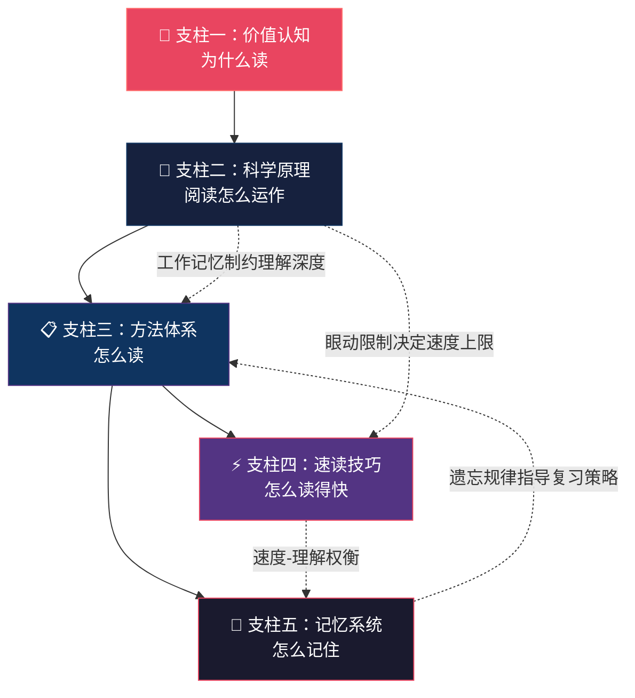
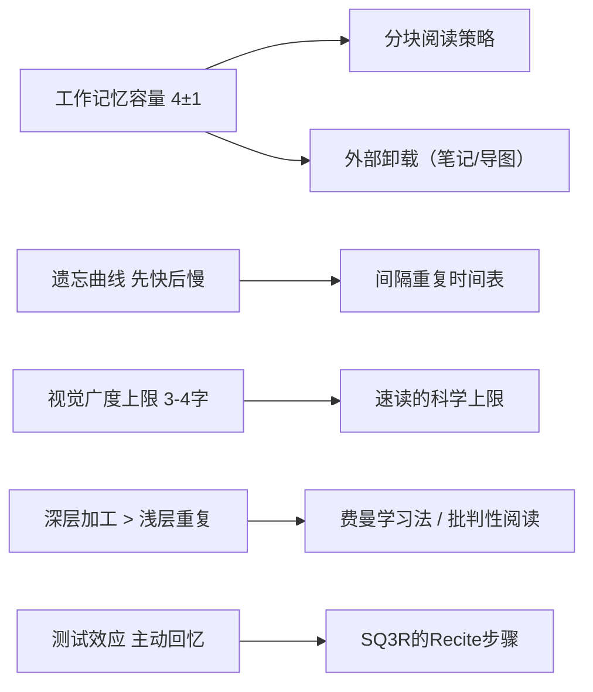
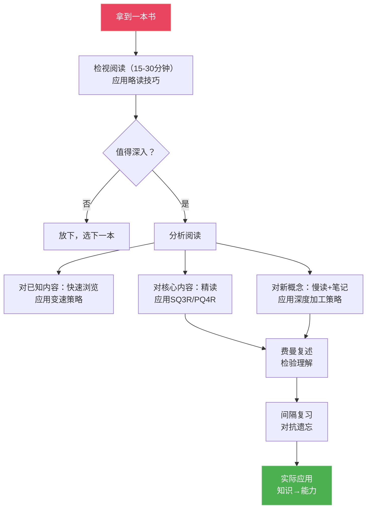

## 本节总结

基础理论是整个阅读能力体系的地基。本节对前七个小节的核心内容进行系统整合，帮助你建立完整的知识框架，同时识别各部分之间的内在联系——这些联系往往比单个知识点更有价值。

### 一、五支柱框架：阅读能力的完整结构

阅读的基础理论可以概括为五个相互支撑的核心支柱：

| 支柱 | 核心问题 | 关键结论 | 对应小节 |
|:---|:---|:---|:---|
| 价值认知 | 为什么要读？ | 阅读在认知、职业、健康、心理四个维度都有不可替代的价值，投入产出比极高 | 第一节、第二节（认知价值部分） |
| 科学原理 | 阅读如何运作？ | 眼动机制、认知加工三层次、工作记忆瓶颈、长期记忆规律、大脑神经机制 | 第二节（科学部分） |
| 方法体系 | 怎么读？ | 艾德勒四层阅读、SQ3R/PQ4R、费曼学习法、KWL法、批判性阅读 | 第三节 |
| 速读技巧 | 怎么读得快？ | 在认知限制内优化效率，五种经过验证的技巧，不同目的用不同策略 | 第四节 |
| 记忆系统 | 怎么记住？ | 遗忘有三种机制，间隔重复+深度加工+主动输出是核心对策，元认知是底层保障 | 第五节、遗忘的科学 |

这五个支柱共同构成一个完整的阅读能力框架。价值认知让你"想读"，科学原理让你"懂读"，方法体系让你"会读"，速读技巧让你"高效读"，记忆系统让你"读有所得"。五者缺一不可——没有动机不会开始，不懂原理会走弯路，没有方法效率低下，不懂速读浪费时间，不解决遗忘等于白读。

### 二、各支柱核心要点提炼

#### 2.1 价值认知：阅读是投入产出比最高的个人投资

阅读的独特价值在于：它是唯一能让你以个人节奏、反复深入、系统构建知识体系的方式。四个维度的价值相互强化：

**认知维度。** 阅读改变大脑物理结构——增加胼胝体厚度、增强前额叶皮层功能、扩展语言相关脑区。持续阅读的人认知衰退速度比不阅读的人慢32%，持续注意力持续时间长40%-60%。知识积累遵循复利曲线：前30本提升缓慢（启动期），30-100本加速显现（加速期），100本以上形成独特的知识体系（精进期）。

**职业维度。** 88%的百万富翁每天至少阅读30分钟。阅读量与收入正相关的底层机制是：阅读提升认知能力→更好的决策→更多的机会→更高的收入。领导力与阅读的关系更为直接——几乎所有顶级领导者都是重度阅读者，因为高阶决策需要跨学科知识的整合能力。

**健康维度。** 仅阅读6分钟就能将压力水平降低68%。文学小说能显著提升共情能力和"心智理论"。每周阅读3.5小时以上的人比不阅读的人平均多活23个月。

**心理维度。** 阅读提供认知重构的天然途径——当你读到书中人物面临的困境远比你的更严峻时，你对自身处境的评估会发生改变。深度阅读还是注意力的"健身房"，是对抗信息碎片化的最佳训练。

**需要破除的偏见。** "没时间"——日均手机6.5小时中挤出30分钟并不难；"记不住"——阅读改变的是思维结构而非记忆细节；"看视频一样"——视频的信息密度和可暂停性远不如阅读。

#### 2.2 科学原理：理解阅读的运作机制

阅读看似简单，实际上是视觉系统、语言系统、记忆系统和执行控制系统在毫秒级时间尺度上的精密协作。

**眼动机制。** 阅读是"注视-眼跳"的交替过程。信息获取只发生在注视阶段（200-300毫秒/次），眼跳期间大脑主动关闭视觉输入（眼跳抑制）。中文读者每次注视有效获取约2-3个汉字，视觉广度有客观上限——声称"一眼看一整行"的速读方法在神经科学层面站不住脚。回视（10-15%为正常）不全是坏事，有效回视是深层理解的正常表现。

**认知加工三层次。** 从低到高依次为：字词识别（词汇通达）→句子理解（语法分析+语义整合）→篇章理解（宏观结构建构）。优秀读者和普通读者在前两层差异不大，真正的差距出现在篇章理解——善于建构和维护全局连贯的文本表征。

**工作记忆瓶颈。** 巴德利的工作记忆模型包含语音环路、视觉空间画板、中央执行系统和情景缓冲区。阅读中的有效容量约为4±1个语义单元，信息在语音环路中约2秒后衰减。每次注意力切换需要15-25分钟才能恢复深度专注。应对策略：分块处理、外部卸载（笔记/导图）、复述强化、消除干扰、预读框架。

**长期记忆规律。** 遗忘有三种机制——痕迹衰退（时间导致衰减）、干扰理论（其他信息干扰提取）、提取失败（缺少正确的提取线索）。艾宾浩斯遗忘曲线揭示"先快后慢"的总体趋势：1天后遗忘66%，但深度理解和有意义联系能显著减缓遗忘速度。

**大脑神经机制。** 阅读涉及视觉词形区（VWFA）、韦尼克区、布洛卡区、角回、前额叶皮层等多个脑区的协同工作。中文阅读有独特的脑机制——双侧激活更明显、运动皮层参与更多、VWFA编码更依赖整体形状和空间结构。

**伪科学速读的三大骗局。** "一目十行"违反视觉广度的神经限制；"消除默读"会损害语言理解的神经基础；"照相记忆"从未在严格实验中被证实。

#### 2.3 方法体系：六种经过验证的阅读方法

不同的阅读目标需要不同的方法，关键是建立"方法工具箱"并灵活选择。

**艾德勒四层阅读。** 基础阅读（读懂文字）→检视阅读（把握全书框架，15-30分钟）→分析阅读（深度理解+批判评价，8-15小时/本）→主题阅读（多书对比构建知识体系，3-6周/主题）。大多数成年人实际上仍停留在基础阅读阶段——能读懂每个字，却无法把握一本书的整体结构和核心论点。

**SQ3R阅读法。** Survey（浏览建立地图）→Question（提问激活大脑）→Read（带着问题主动搜索）→Recite（复述强制输出）→Review（间隔复习对抗遗忘）。复述环节能将记忆保持率从被动阅读的10%-20%提升到50%-70%。最适合教科书、学术论文等信息密度高的材料。

**费曼学习法。** 选择概念→用简单语言解释→发现卡壳点→简化和类比。科学基础是生成效应（主动生成比被动接收记忆更强）、精细化编码（类比和举例建立更多记忆提取路径）、元认知监控（发现卡壳点就是监控理解程度）。

**KWL阅读法。** Know（已知）→Want（想知）→Learned（学到），进阶版增加Action（行动）。核心价值是将阅读从"知识获取"延伸到"行为改变"。

**PQ4R阅读法。** SQ3R的升级版，增加Reflect（反思）步骤——内容反思（与已有知识的联系）、方法反思（当前策略是否有效）、价值反思（对我的实际意义）。理解更深但耗时更长，适合需要深度理解的材料。

**批判性阅读。** 不是"批判"作者，而是以分析性、评估性的态度阅读。六个核心问题：核心论点是什么？提供了什么证据？证据质量如何？逻辑是否严密？有没有被忽略的反面观点？适用范围是什么？还需要识别常见逻辑谬误（稻草人、诉诸权威、滑坡、虚假二分等十种）。

#### 2.4 速读技巧：在认知限制内最大化效率

速读不是突破认知极限的魔法，而是通过科学训练和策略优化实现效率最大化。

**科学上限。** 综合眼动研究数据，理解率>70%时的阅读速度上限约为600-1000字/分钟。通过训练可以将速度提升20-50%，同时不损失理解力。

**五种经过验证的技巧。**
1. 减少无效回视——指读法、节拍器辅助、遮挡法（2-3周见效）
2. 扩大有效视觉广度——舒尔特表、扩展注视练习、闪视训练（4-8周见效）
3. 优化默读节奏——加速默读、注意力从"声音"转到"意义"（2-4周见效）
4. 分块阅读——将文字分成有意义的语义块而非逐字阅读（1-2个月内化）
5. 战略性变速阅读——知道什么时候该快、什么时候该慢（2-4周形成习惯）

**不同目的不同策略。** 学习型阅读重理解（SQ3R法，200-400字/分）；工作型阅读重效率（略读+扫读+变速）；消遣型阅读重体验（跟随节奏无速度压力）；筛选型阅读重判断（三级筛选，2-15分钟判断）。

**训练方案。** 8周系统训练：第1周基线测量→第2-4周技巧训练→第5-6周整合应用→第7-8周习惯固化。预期效果：速度提升30-50%，理解率稳定或提升。

**最重要的认知。** 最好的速读者不是读得最快的人，而是知道什么时候该快、什么时候该慢的人。速度服务于理解，而非相反。

#### 2.5 记忆系统：让读过的内容真正留下

遗忘是大脑的默认设置，但通过正确的方法可以将记忆保持率从25%提升到95%以上。

**对抗遗忘的四大武器。**
1. 间隔重复——在即将遗忘但还没完全遗忘的时刻复习。推荐时间表：第1天、第3天、第7天、第14天、第30天。主动回忆的效果远超被动重读（高出约50%）。
2. 深度加工——记忆持久性取决于加工深度而非重复次数。六种策略：用自己的话重述、建立多维联系、提出批判性问题、实际应用、情感连接、生成性笔记。
3. 主动输出——划线标注（最弱）→写读书笔记→写书评/分享→向他人讲解（强）→写应用方案（最强）。大多数人的问题是只完成了输入，跳过了处理和输出。
4. 元认知监控——"红绿灯"自检法（绿灯=理解，黄灯=似懂非懂，红灯=不理解），区分"感觉懂了"和"真正懂了"，每15-20分钟暂停自问。

**三种笔记系统。**
- 康奈尔笔记法：提示区+笔记区+总结区，天然强制信息筛选和概括
- Zettelkasten卡片笔记法：原子性+自主性+连接性，积累后产生"涌现效应"
- 标注系统：统一的符号/颜色体系，高亮不超过文本的20-30%

**输入-处理-输出模型。** 阅读是一个完整的认知过程：输入（选书+检视阅读+主动提问）→处理（分析阅读+批判思考+建立联系）→输出（笔记+复述+应用+教他人）。输出阶段有反馈循环，会反过来优化下一轮的输入。一本经过深度加工并付诸实践的书，比十本走马观花读过的书更有价值。

**适应性遗忘的积极面。** 遗忘不是纯粹的敌人——它帮你过滤不重要信息、保持认知灵活性、为新信息腾出空间。目标不是消除所有遗忘，而是选择性地记住。

### 三、知识网络：五个支柱之间的关键连接

理解各支柱之间的联系，比孤立地掌握每个知识点更重要。

#### 3.1 科学原理如何指导方法选择

**连接一：工作记忆限制→分块策略。** 工作记忆只能同时保持4±1个语义单元，这直接解释了为什么分块阅读比逐字阅读更高效——每减少一次注视，就少占用一次工作记忆资源。

**连接二：遗忘规律→间隔重复时间表。** 艾宾浩斯曲线的"先快后慢"特征决定了最优复习时间点：前期密集（第1天、第3天），后期稀疏（第7天、第14天、第30天）。复习太早浪费，复习太晚等于重学。

**连接三：视觉广度限制→速读上限。** 每次注视只能有效获取2-3个汉字，这个生理限制决定了理解率>70%时的阅读速度上限约为600-1000字/分钟。任何声称突破这个上限的方法都以牺牲理解为代价。

**连接四：深层加工理论→费曼学习法的效力。** 克雷克和洛克哈特的加工层次理论表明，记忆持久性取决于加工深度。费曼学习法要求"用自己的话解释"和"找到好类比"，这正是最深层的加工形式。

**连接五：测试效应→SQ3R的Recite步骤。** Roediger和Karpicke的实验证明，主动回忆的效果远超被动重读。SQ3R中的Recite步骤正是利用了这个效应——每读完一节就合上书复述。

#### 3.2 方法体系与速读技巧的协同

方法体系和速读技巧不是两套独立的系统，而是可以在同一本书的阅读过程中协同使用：

具体来说：检视阅读阶段应用略读技巧快速判断；分析阅读阶段对不同内容类型使用变速策略——已知信息快速浏览，核心论点精读，新概念慢读+笔记；每个阶段都配合费曼复述和间隔复习。

#### 3.3 从理论到实践的完整链路

五个支柱的学习顺序应该是：价值认知（建立动机）→科学原理（理解机制）→方法体系（掌握工具）→速读技巧（提升效率）→记忆系统（巩固成果）。但在实际应用中，这五个支柱是同时运作的——你不会先"用完"一个支柱再启用下一个，而是在每一次阅读中同时调用所有能力。

### 四、核心概念速查表

| 概念 | 含义 | 来源 | 实操要点 |
|:---|:---|:---|:---|
| 认知复利 | 知识积累非线性，读得越多理解越快 | 认知科学 | 坚持读过30本，进入加速期 |
| 眼跳抑制 | 眼跳期间大脑关闭视觉输入 | 眼动科学 | 不要试图在眼跳中"顺便看更多" |
| 视觉广度 | 每次注视有效获取信息的范围 | 视觉神经科学 | 中文约3-4字，训练只能优化利用效率 |
| 工作记忆 7±2/4±1 | 同时保持的信息单元数 | 巴德利模型 | 遇到长句主动切分，做笔记外部卸载 |
| 加工层次理论 | 记忆持久性取决于加工深度 | 克雷克&洛克哈特 | 用自己的话重述比抄写有效2-3倍 |
| 遗忘曲线 | 遗忘先快后慢，1天后遗忘66% | 艾宾浩斯 | 读完当天必须复习 |
| 间隔效应 | 分散复习优于集中复习 | 艾宾浩斯发现，Cepeda验证 | 按1-3-7-14-30天时间表复习 |
| 测试效应 | 主动回忆效果远超被动重读 | Roediger&Karpicke | 复习时先尝试回忆，想不起来再看 |
| 艾德勒四层阅读 | 基础→检视→分析→主题 | 《如何阅读一本书》 | 大多数人需要从基础阅读跃迁到检视和分析 |
| SQ3R | 浏览→提问→阅读→复述→复习 | 罗宾逊 1946 | 最适合教科书和信息密度高的材料 |
| 费曼技巧 | 用简单语言解释，发现卡壳点 | 理查德·费曼 | 每章一讲，每书一信 |
| 元认知 | 对自己思维过程的觉察 | 认知心理学 | 红绿灯自检法，每15-20分钟暂停 |
| 核心论点评估 | 六个问题检验作者论证 | 批判性阅读 | 核心论点？证据？质量？逻辑？反面？范围？ |
| 变速阅读 | 根据内容重要性调整速度 | 速读策略 | 标题/已知信息快读，核心论点/新概念慢读 |
| Zettelkasten | 原子性+自主性+连接性的卡片笔记法 | 卢曼 | 每张卡片一个想法，至少连接一张已有卡片 |

### 五、自检清单：你的阅读基础理论掌握了多少

用以下清单检验自己对基础理论的掌握程度。如果大部分项目无法自信地回答"是"，建议回到对应小节重新学习。

**价值认知层面：**
- [ ] 能说出阅读在认知、职业、健康、心理四个维度的具体价值
- [ ] 理解知识复利效应的三个阶段（启动期、加速期、精进期）
- [ ] 能反驳"没时间""记不住""看视频一样"三种常见偏见

**科学原理层面：**
- [ ] 理解"注视-眼跳"交替模式，知道信息只在注视阶段获取
- [ ] 知道视觉广度的客观上限（中文约3-4字/次注视）
- [ ] 能解释工作记忆对阅读的四重制约（容量、时间、竞争、切换）
- [ ] 能区分认知加工的三个层次（字词→句子→篇章）
- [ ] 能识别伪科学速读（一目十行、消除默读、照相记忆）

**方法体系层面：**
- [ ] 掌握艾德勒四层阅读，并能根据目的选择合适的层次
- [ ] 能完整执行SQ3R五步法
- [ ] 了解费曼学习法的四步流程及其科学基础
- [ ] 能用六个核心问题进行批判性阅读
- [ ] 了解KWL和PQ4R的适用场景

**速读技巧层面：**
- [ ] 知道自己不同类型材料的基线阅读速度
- [ ] 掌握五种速读技巧的原理和训练方法
- [ ] 能根据不同目的（学习/工作/消遣/筛选）选择合适的策略
- [ ] 理解"速度服务于理解，而非相反"

**记忆系统层面：**
- [ ] 知道遗忘的三种机制及各自的对策
- [ ] 能按间隔重复时间表安排复习（1-3-7-14-30天）
- [ ] 理解"主动回忆优于被动重读"的科学依据
- [ ] 至少掌握一种笔记系统（康奈尔/Zettelkasten/标注系统）
- [ ] 理解输入-处理-输出模型，知道输出的五种形式
- [ ] 能区分"感觉懂了"和"真正懂了"

### 六、常见误区与纠正

| 误区 | 纠正 |
|:---|:---|
| "基础理论不重要，直接学方法就行" | 不懂原理的方法是盲目的——你不知道为什么某个方法有效，也不知道它的适用边界。科学原理是方法选择和效果评估的依据。 |
| "速读可以练到每分钟万字" | 视觉广度和认知加工有硬上限。科学训练可提升20-50%，但理解率>70%时上限约600-1000字/分。 |
| "默读是坏习惯，应该消除" | 默读是语言理解的神经基础，涉及语音环路和布洛卡区。可以适当加快节奏，但不应消除。 |
| "读得越多越好，量变引起质变" | 不经思考的大量阅读效果有限。精读+复述+间隔复习的效果远超纯大量泛读。质量优先于数量。 |
| "读书笔记就是抄书" | 抄写是浅层加工，记忆效果最差。用自己的话重述+建立联系+批判性提问才是深度加工。 |
| "所有的书都应该精读" | 不同阅读目的需要不同方法。检视阅读15-30分钟判断是否值得深入，比盲目精读更高效。 |
| "回视说明阅读能力差" | 适度回视（10-15%）是深层理解的正常表现。应减少因走神导致的无效回视，保留因理解需要的有效回视。 |
| "读完一本书就算完成了" | 读完只是输入阶段的结束。没有处理和输出的阅读，遗忘率高达75%以上。 |
| "只读一个领域的书" | 单一领域阅读会导致边际收益递减。跨领域阅读重新激活复利效应，产生"知识组合爆炸"。 |
| "电子书和纸质书效果一样" | 研究表明深度理解和长期记忆方面纸质阅读略优（更好的空间定位感，更少的略读倾向），但差异不大，选择能坚持的方式最重要。 |

### 七、从理论到行动：下一步

基础理论为你提供了"是什么"和"为什么"的答案。下一节"具体方案"将把这套理论框架转化为可执行的实践方案——速读训练计划、精读与笔记方法、主题阅读方案、阅读计划制定、不同类型书籍的阅读策略、电子书与纸质书的选择指南。

在进入实践之前，建议你：

1. **完成上面的自检清单**，识别自己在哪些支柱上存在薄弱环节
2. **测量自己的基线阅读速度**（选择一篇2000-3000字的适中难度文章，正常阅读后计算速度和理解率）
3. **选择一种笔记系统**开始实践——如果你还没有任何笔记系统，从康奈尔笔记法开始最容易上手
4. **选定下一本书**，带着基础理论的框架去阅读——在阅读过程中有意识地观察自己的眼动习惯、工作记忆状态、加工深度

> **关键认知**：基础理论的价值不在于让你"知道"这些知识，而在于让你在每一次阅读中都能做出更明智的选择——该快读还是慢读？该精读还是略读？该做笔记还是继续读？该复习还是学新内容？这些微决策的累积，最终决定了你的阅读效率和知识积累速度。
