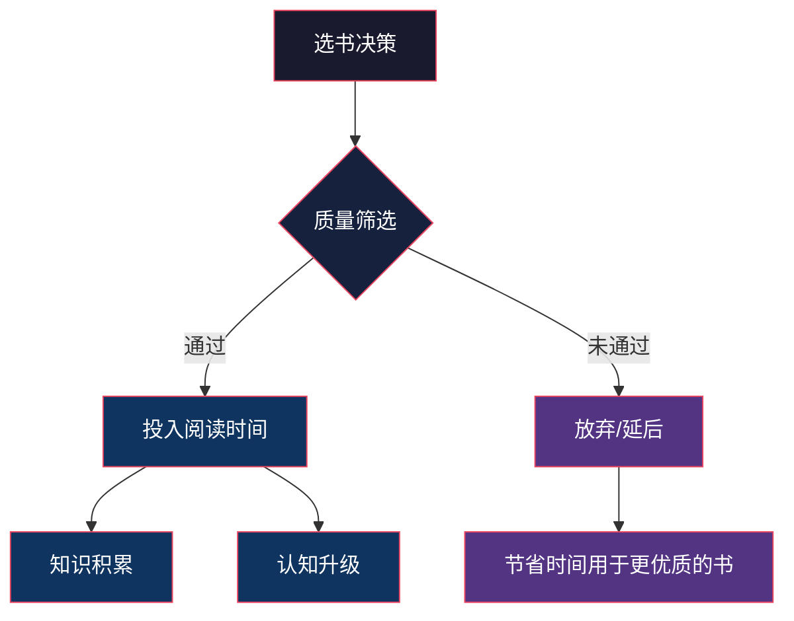
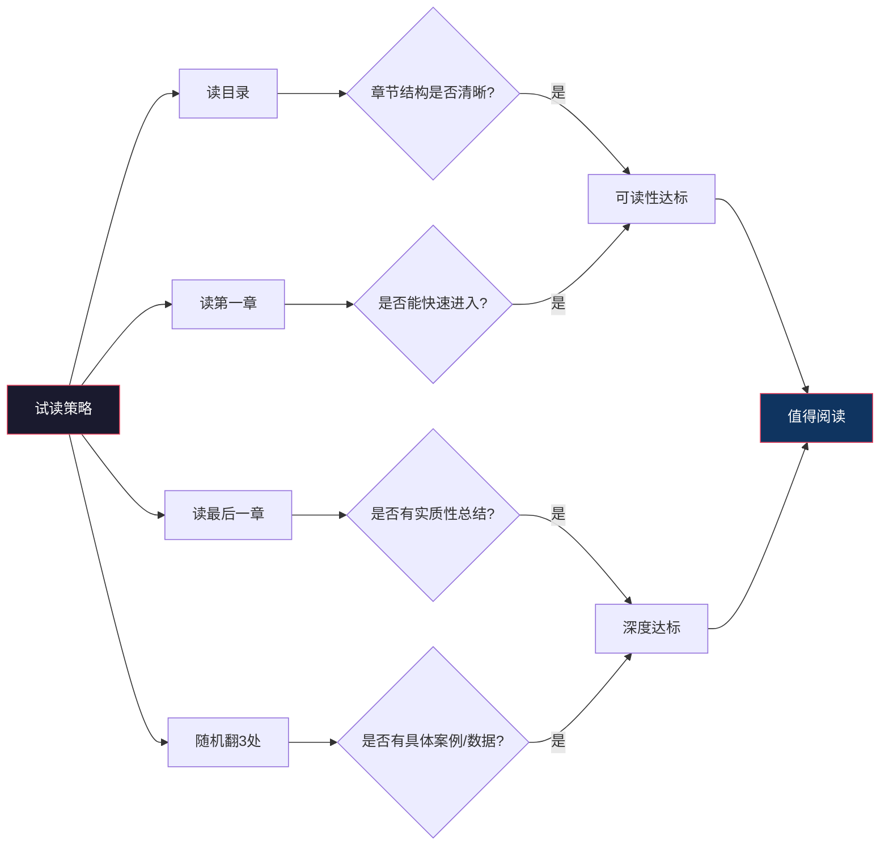
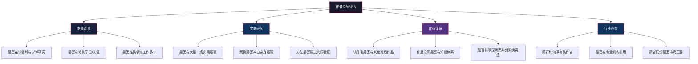
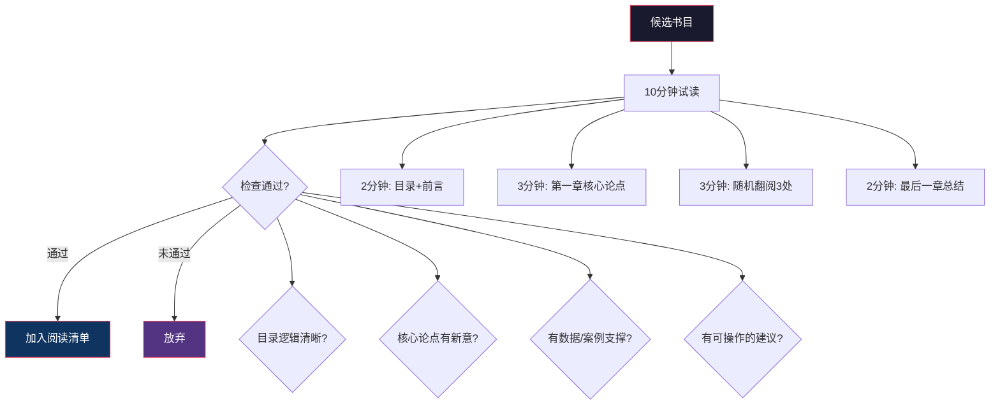

## 选书原则

在进入具体的书单推荐之前，有必要先建立一套系统的选书方法论。选书能力本身就是阅读能力的重要组成部分——一个人的阅读质量，首先取决于他选了什么书来读。

信息时代的一个悖论是：书越多，选对书越难。每年中文出版市场新书超过20万种，英文市场超过30万种。面对如此庞大的选择空间，如果没有清晰的筛选标准，要么陷入"选择瘫痪"迟迟无法开始，要么被营销话术牵着鼻子走，把有限的阅读时间浪费在平庸之作上。

### 为什么选书比读书更重要

一个经常被忽视的事实是：**选错书的代价远大于读得慢的代价**。读得慢的人，只要选对了书，每一小时的阅读都在积累高质量知识；而读得快但选错书的人，速度快反而意味着浪费得更多——他以更高的效率吸收了低质量甚至错误的信息。

投资领域有一个概念叫"能力圈"（Circle of Competence），巴菲特说投资最重要的事是知道自己的能力圈边界。选书同理：知道什么书值得读、什么书不值得读，比读了多少本书重要得多。

### 五大选书原则

#### 原则一：经典优先，时间是最好的过滤器

一本出版超过10年仍然被反复推荐的书，通常比一本刚出版就登上畅销榜的书更值得阅读。这不是说新书都不好，而是说**时间检验是一种低成本、高可靠性的质量筛选机制**。

**为什么经典更可靠？**

经典之所以成为经典，是因为它经历了三重过滤：

1. **市场过滤**：长销书意味着持续有读者购买和推荐，而非靠营销推广
2. **同行过滤**：专业人士持续引用和推荐，说明内容经得起专业审视
3. **认知过滤**：书中的核心思想经受住了时间的检验，没有被后续研究推翻

**具体操作标准：**

| 筛选维度 | 优质信号 | 警惕信号 |
|---------|---------|---------|
| 出版时间 | 初版5年以上，多次再版/修订 | 刚出版即大量营销推广 |
| 引用频率 | 被其他书籍/论文反复引用 | 只在营销渠道被提及 |
| 读者评价 | 多平台评分稳定在4.0以上 | 评分两极分化严重 |
| 作者背景 | 该领域深耕多年的研究者/实践者 | 跨界"斜杠"首次涉足该领域 |
| 出版社 | 该领域有口碑的专业出版社 | 不知名小出版社快速出版 |

**经典优先的例外情况：**

- **技术类书籍**：编程语言、框架等技术迭代快的领域，需要选择最新版本
- **前沿领域**：AI、基因编辑等新兴领域，3年前的书可能已经过时
- **时效性内容**：时事分析、市场报告等本质上有时效性的内容

#### 原则二：可读性与深度兼顾

好的书籍应该既有足够的知识密度，又有良好的表达方式。避免两个极端：

**极端一：过于学术化**

- 大量专业术语堆砌，缺乏解释
- 行文枯燥，逻辑跳跃大
- 假设读者已有深厚的专业背景
- 典型表现：读了30页还在第一章绪论

**极端二：过于浅显**

- 观点陈旧，缺乏新意
- 大量故事填充，实质内容稀薄
- 只告诉你"是什么"，不解释"为什么"
- 典型表现：读完觉得"说的都对，但什么也没学到"

**判断一本书是否兼顾可读性与深度的方法：**

**试读的具体操作：**

1. **看目录**：目录是否逻辑清晰、层次分明？好的目录本身就是一张知识地图
2. **读前言/序言**：作者是否清楚地说明了这本书要解决什么问题、为谁而写
3. **读第一章**：是否能快速进入主题，而非冗长的铺垫
4. **随机翻阅**：随意翻开3-5处，检查是否有具体案例、数据、图表支撑论点
5. **读最后一章**：是否有实质性的总结和行动建议，而非空洞的"展望未来"

#### 原则三：实用价值导向

所选书籍应该能够为读者提供可以实际应用的知识和方法。这里的"实用"不是狭义的"工具书"，而是指**读完之后，你的认知或行为会发生可观察的变化**。

**实用价值的三个层次：**

| 层次 | 说明 | 示例 |
|------|------|------|
| 认知层 | 改变你理解世界的方式 | 读完《思考，快与慢》，你会用"系统1/系统2"的框架分析自己的决策 |
| 方法层 | 提供可直接使用的方法论 | 读完《金字塔原理》，你可以在写作和汇报中直接运用其结构化表达方法 |
| 行动层 | 给出具体的操作步骤 | 读完《清单革命》，你可以立刻为自己的工作制定检查清单 |

**判断实用价值的方法：**

- **问自己**：读完这本书，我能做什么之前做不了的事？或者能用什么不同的方式做之前的事？
- **看书评**：重点看差评，差评中是否有人提到"读完没什么收获"或"全是正确的废话"
- **看目录**：是否有明确的方法论章节、案例章节、行动指南章节

#### 原则四：作者资质验证

一本书的质量上限，很大程度上取决于作者在该领域的积累深度。选书时需要对作者进行基本的背景审查。

**作者资质的评估维度：**

**不同领域的作者资质侧重：**

- **学术类书籍**：优先选择在该领域有多年研究经历、发表过高质量论文的学者
- **实践类书籍**：优先选择有丰富一线经验、用数据和案例说话的从业者
- **方法论书籍**：优先选择自己成功实践过所述方法、且有大量学员/读者验证的作者
- **翻译书籍**：除了原著作者，还要关注译者——优秀的译者能让好书更易读，糟糕的译者能让好书变得无法阅读

**警惕信号：**

- 作者自我介绍中大量使用"畅销书作家""知名博主"等标签，但缺乏专业背景
- 书中案例大量来自他人转述，缺乏第一手经验
- 同一作者短时间内出版多本不同领域的书（说明是"写书的"而非"做学问的"）
- 书籍封面上的推荐语来自其他畅销书作家，而非该领域的专业人士

#### 原则五：与个人发展阶段匹配

同一本书，在不同的人生阶段阅读，收获可能完全不同。选书时需要考虑自己当前的认知水平、面临的问题和成长阶段。

**发展阶段与选书策略：**

| 阶段 | 特征 | 选书策略 | 避免 |
|------|------|---------|------|
| 入门期 | 刚接触某领域，缺乏基础知识 | 选择通俗易懂的入门书、科普书 | 直接啃学术专著 |
| 建立期 | 有一定基础，想系统学习 | 选择教科书级别的经典、体系化著作 | 只读碎片化的文章和观点 |
| 深化期 | 已有体系，想深入某个方向 | 选择该方向的专业著作、前沿研究 | 停留在入门书的舒适区 |
| 融通期 | 多领域积累深厚，想打通关联 | 选择跨学科的综合性著作 | 只在单一领域打转 |

**如何判断一本书是否适合自己当前的阶段：**

- **太简单**：翻阅后觉得"这些我都知道"，每页都在验证已有认知而非获得新认知
- **太难**：读了10页后完全迷失，无法理解作者在说什么
- **刚好合适**：大部分内容能理解，但有30%-50%的内容是新的、需要思考的

### 选书的实操流程

有了以上五大原则，接下来需要一套可执行的筛选流程。以下是经过验证的四步选书法：

#### 第一步：信息收集

从多个渠道收集候选书籍：

**高质量书源（按可靠性排序）：**

1. **领域专家的私人推荐**：最可靠，但获取难度最高。可以通过邮件、社交媒体向你尊重的专家请教
2. **学术引用网络**：在Google Scholar或知网搜索某领域的综述论文，看其引用了哪些书籍
3. **经典书单的交叉推荐**：比较3-5个不同来源的书单，被多个书单同时推荐的书通常质量较高
4. **出版社的专业线**：靠谱的出版社通常有明确的专业方向，如O'Reilly的技术书、中信的商业书
5. **豆瓣/Goodreads的高分长评**：重点看写了详细理由的评价，而非简单的五星好评

**低质量书源（需要警惕）：**

- 畅销榜排名：受营销影响大，排名高不等于质量高
- 短视频/直播推荐：通常带有商业利益，推荐理由缺乏深度
- "必读100本"这类超长书单：数量太多等于没有筛选
- 出版社的营销文案：本质是广告，不具有参考价值

#### 第二步：快速筛选

对收集到的候选书进行初步筛选，使用"10分钟试读法"：

**10分钟试读检查清单：**

- [ ] 目录结构是否逻辑清晰，层次分明？
- [ ] 前言是否清楚说明了目标读者和要解决的问题？
- [ ] 第一章是否快速进入主题，而非冗长铺垫？
- [ ] 书中是否有具体的数据、案例、图表支撑论点？
- [ ] 最后一章是否有实质性总结和行动建议？
- [ ] 语言风格是否流畅，专业术语是否有解释？
- [ ] 是否与我当前的需求和水平匹配？

4项以上打勾 → 加入阅读清单
2-3项打勾 → 暂时搁置，以后再评估
1项以下 → 放弃

#### 第三步：优先级排序

通过筛选的书，需要按优先级排序。排序的依据是**紧急度和重要性的交叉**：

| | 紧急（当前需要解决的问题） | 不紧急（长期成长需要） |
|---|---|---|
| **重要（核心领域）** | 最高优先级，立即阅读 | 高优先级，安排系统阅读 |
| **次重要（相关领域）** | 中优先级，有空时读 | 低优先级，放入候选清单 |

#### 第四步：定期回顾与更新

每季度回顾一次阅读清单：

- **已完成的书**：记录核心收获，评估是否需要重读
- **未完成的书**：分析原因——是书本身的问题还是自己的问题？前者果断放弃，后者重新安排
- **候选清单**：根据新的需求和认知更新排序
- **新增候选**：从最近的阅读中发现的新线索

### 常见选书误区

#### 误区一：被书名和封面欺骗

**典型表现**：被"XX天学会XX""XX改变人生"这类标题吸引

**纠正方法**：书名越夸张，越要谨慎。好的书通常用朴素的标题直接点明主题，如《原子习惯》《深度工作》，而非《改变命运的XX个习惯》

#### 误区二：迷信畅销榜

**典型表现**：认为畅销=好书，只看排行榜选书

**纠正方法**：畅销榜反映的是营销能力和大众接受度，而非内容质量。很多真正的好书因为话题小众或写作风格专业而从未上过畅销榜。反过来说，很多畅销书的内容经不起推敲。

**数据佐证**：尼尔森图书数据显示，每年登上畅销榜的书中，5年后仍在印刷的不到30%。而真正的经典著作，往往在出版10年后才达到销量高峰。

#### 误区三：只读同一类书

**典型表现**：只读某个特定领域或某种特定风格的书

**纠正方法**：知识的价值往往在交叉处产生。查理·芒格强调的"多元思维模型"，本质上就是从不同学科中提取核心思维框架，然后组合使用。建议至少覆盖3-5个不同领域的阅读。

#### 误区四：追求数量而非质量

**典型表现**：一年定下"读100本书"的目标，追求数量而非收获

**纠正方法**：读10本好书并深入消化，远胜于泛泛读100本书。设定目标时，应该关注"读完后我能做什么之前做不了的事"，而非"我读了几本"。

#### 误区五：忽视翻译质量

**典型表现**：只看书名和作者，不关注译者

**纠正方法**：对于翻译书籍，译者的重要性不亚于作者。一本好书被糟糕的译者翻译后，可能变得晦涩难懂甚至面目全非。选择翻译书时，优先选择知名译者或出版社的版本。如果条件允许，可以中英文版本对照阅读。

### 本推荐书单的选书标准

基于以上五大原则，本章后续的书单推荐遵循以下具体标准：

1. **出版时间**：优先选择出版3年以上的书，技术类书籍选择最新版
2. **评分门槛**：豆瓣评分≥7.5，Goodreads评分≥3.8
3. **作者资质**：作者在该领域有至少5年的深耕经历
4. **可读性**：经试读验证，普通读者能够理解70%以上的内容
5. **实用性**：书中有明确的方法论或可操作的建议
6. **互补性**：同一领域的推荐书之间形成互补，而非重复

**书单的阅读建议：**

- 每个领域按入门→进阶的顺序排列
- 标注了每本书的难度等级和预计阅读时间
- 对于特别重要的书，会说明"为什么推荐这本书"以及"适合什么阶段的读者"
- 建议先从自己最需要的1-2个领域开始，而非一口气全买

接下来按八大领域分类推荐，每个领域推荐5-8本书，涵盖入门级到进阶级，共50+本书。这些书单不是"权威推荐"，而是基于上述选书原则筛选出的、值得投入时间阅读的作品。最终的选择权在你手中——选那些与你当前阶段最匹配、最能解决你当前问题的书。
