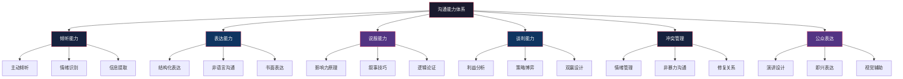
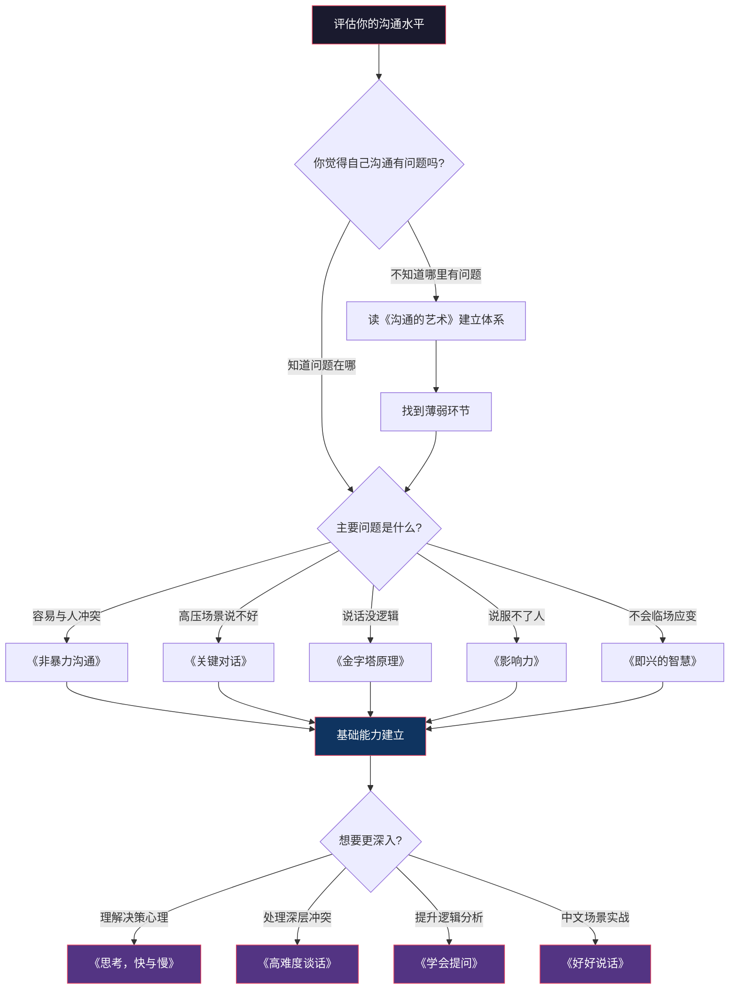

## 一、沟通与表达

沟通是所有技能的底层基础设施——无论你从事什么职业、处于什么人生阶段，沟通能力的高低直接决定了你的想法能否被理解、你的价值能否被看见、你的人际关系能否健康运转。很多人把沟通简单等同于"会说话"，但真正有效的沟通是一个包含了倾听、表达、说服、谈判、冲突管理等多个子系统的复杂能力体系。

### 为什么沟通类书籍值得系统阅读

一个常见的认知误区是：沟通能力是"天生的"，外向的人自然会沟通，内向的人怎么学也没用。这个观点完全错误。沟通学的大量研究表明，沟通能力是一种**可习得、可训练、可量化提升**的技能。哈佛商学院的一项跟踪研究显示，那些系统学习过沟通技巧的MBA毕业生，在毕业10年后的平均薪资比同等条件但未接受沟通训练的毕业生高出约15%——这个差距并非来自专业能力的差异，而是来自"让别人理解并认可你专业能力"的能力差异。

沟通类书籍的价值在于：

- **提供框架**：让你从"凭感觉说话"升级为"有策略地沟通"
- **暴露盲区**：揭示你在沟通中从未意识到的问题模式
- **提供脚本**：在高难度场景中给你可用的话术和步骤
- **建立同理心**：帮助你理解对方的心理机制，从根本上改善沟通效果

### 入门级

入门级书籍的特点是：**不需要任何前置知识，语言平实，案例丰富，读完就能用**。适合沟通基础薄弱、或者意识到自己沟通有问题但不知道从哪里改的人。

---

#### 1.《非暴力沟通》——马歇尔·卢森堡

| 维度 | 说明 |
|------|------|
| 推荐指数 | ★★★★★ |
| 难度 | ★★☆☆☆ |
| 核心方法论 | 观察-感受-需要-请求（OFNR）四步法 |
| 适合人群 | 所有人，特别是容易在沟通中产生冲突的人 |
| 预计阅读时间 | 6-8小时 |
| 豆瓣评分 | 8.4 |

**为什么这本书排在第一位？**

《非暴力沟通》之所以是沟通类书籍的首选，是因为它解决了一个最根本的问题：**大多数人际冲突的根源不是立场分歧，而是表达方式的错误**。卢森堡通过几十年的调解实践发现，人们在表达不满时，习惯性地使用评判、指责、比较、命令等"暴力语言"，这些语言会立刻触发对方的防御机制，导致沟通从"解决问题"变成"互相攻击"。

**核心方法论详解：OFNR四步法**

非暴力沟通的核心是一个简单但深刻的四步框架：

1. **观察（Observation）**：客观描述发生了什么，不加入评判
   - 错误示范："你总是迟到"（"总是"是评判，不是观察）
   - 正确示范："这周三次会议，你分别迟到了10分钟、15分钟和5分钟"
   
2. **感受（Feeling）**：表达你的真实情绪，而非想法或判断
   - 错误示范："我觉得你不尊重我"（"不尊重"是判断，不是感受）
   - 正确示范："我感到焦虑和不被重视"
   
3. **需要（Need）**：说出感受背后未被满足的需求
   - 正确示范："因为我需要被尊重和被重视，我需要知道会议时间对你来说是重要的"
   
4. **请求（Request）**：提出具体、可执行、可拒绝的请求
   - 错误示范："以后别再迟到了"（命令，不是请求）
   - 正确示范："下次会议你能提前5分钟到吗？如果时间冲突，我们也可以重新商量"

**这本书的独特价值：**

- **区分观察与评判**：这是整本书最核心的洞察。大多数人以为自己在"描述事实"，实际上在"做评判"。学会区分这两者，是沟通能力的质变点
- **倾听的力量**：书中用了大量篇幅讲"如何倾听"——不是安静地等对方说完然后反驳，而是真正理解对方的感受和需要
- **自我同理**：在要求别人改变之前，先理解自己的感受和需要。很多沟通问题的根源是"自己都没搞清楚自己要什么"

**实践建议：**

读完这本书后，建议用一周时间做"OFNR日记"：每天记录一次沟通中的冲突或不顺畅，用OFNR框架重新分析，写下"如果重来一次，我会怎么说"。一周后你会发现自己的沟通模式有了明显变化。

---

#### 2.《关键对话》——科里·帕特森、约瑟夫·格雷尼、罗恩·麦克米兰、阿尔·斯威茨勒

| 维度 | 说明 |
|------|------|
| 推荐指数 | ★★★★★ |
| 难度 | ★★★☆☆ |
| 核心方法论 | STATE法（Share Tell Ask Talk Encourage） |
| 适合人群 | 需要在职场中处理复杂沟通场景的人 |
| 预计阅读时间 | 8-10小时 |
| 豆瓣评分 | 8.2 |

**什么是"关键对话"？**

关键对话有三个特征：**观点不同、情绪强烈、利害关系高**。比如：跟老板谈加薪、跟伴侣讨论财务问题、向下属反馈绩效不达标、跟合伙人谈股权分配。这类对话之所以难，是因为当 stakes 高、情绪大的时候，人的大脑会进入"战斗或逃跑"模式，理性思考能力急剧下降——要么变得攻击性强，要么选择逃避。

**核心方法论详解：STATE法**

STATE法是处理关键对话的五步框架：

1. **分享事实经过（Share your facts）**：从最不容易引发争议的事实开始
   - 事实："上个月的项目延期了3天"（事实）
   - 对比："你工作不负责"（评判，会立刻引发对抗）
   
2. **说出你的想法（Tell your story）**：基于事实，表达你的推论和感受
   - "基于这些事实，我担心我们的交付能力在下降"
   
3. **询问对方的想法（Ask for others' paths）**：真诚地邀请对方分享他们的视角
   - "我想听听你的看法，你觉得是什么导致了延期？"
   
4. **做出试探表述（Talk tentatively）**：用"也许""可能"等词软化你的观点
   - "也许我的理解有偏差，但我觉得……"
   
5. **鼓励尝试（Encourage testing）**：营造安全氛围，鼓励对方说出真实想法
   - "如果你有不同的看法，我很想听听"

**这本书的深层洞察：**

- **安全是关键对话的前提**：当对方感到不安全时，他们要么沉默（逃避），要么暴力（攻击）。营造安全感的关键是"共同目的"——让对方知道你们的目标是一致的
- **"综合陈述法"**：如何在表达自己观点的同时邀请对方参与。不是"我说你听"，而是"我抛出一个观点，邀请你来补充和修正"
- **从"心"开始**：在进入关键对话之前，先问自己"我真正的目的是什么"。很多时候我们在对话中不知不觉地从"解决问题"变成了"证明自己是对的"

**与《非暴力沟通》的区别：**

《非暴力沟通》侧重日常人际关系中的沟通改善，强调同理心和感受表达；《关键对话》侧重高压、高风险场景下的沟通策略，强调在情绪激烈时保持理性并推动问题解决。两本书互补而非替代——日常用非暴力沟通，关键时刻用关键对话。

---

#### 3.《沟通的艺术：看入人里，看出人外》——罗纳德·阿德勒、拉塞尔·普罗科特

| 维度 | 说明 |
|------|------|
| 推荐指数 | ★★★★☆ |
| 难度 | ★★★☆☆ |
| 核心价值 | 沟通学的系统性教材，全面覆盖沟通的各个维度 |
| 适合人群 | 希望系统学习沟通知识体系的人 |
| 预计阅读时间 | 20-25小时（教材级体量） |
| 豆瓣评分 | 8.5 |

**为什么推荐一本"教材"？**

如果你的目标不是解决某个具体的沟通问题，而是建立完整的沟通知识体系，那么《沟通的艺术》是最佳选择。这本书已经出到第15版，被全球数百所大学用作沟通学教材，其内容的系统性和准确性经过了数十年的学术检验。

**全书结构与核心知识点：**

全书分为"看入人里"（自我认知与沟通）和"看出人外"（与他人沟通）两大部分：

- **自我在沟通中的角色**：自我概念如何影响你的沟通模式、自我应验预言如何让沟通变成"自我实现的预言"
- **知觉在沟通中的角色**：为什么同一件事，不同的人会有完全不同的理解。归因错误、知觉偏差、刻板印象如何扭曲沟通
- **情绪在沟通中的角色**：什么是情绪、如何辨识和表达情绪、情绪管理的策略
- **语言沟通**：语言的特性、语言与意义的关系、性别与文化对语言使用的影响
- **非语言沟通**：身体语言、面部表情、声音特征、空间距离、触碰、时间、外貌——这些"无声的语言"传递的信息量远超你的想象
- **倾听**：倾听的五个层次、常见的倾听障碍、如何成为更好的倾听者
- **关系沟通**：关系的发展阶段、关系中的沟通模式、亲密关系中的沟通特点
- **冲突管理**：冲突的本质、冲突处理的五种方式（竞争、合作、妥协、回避、迁就）

**阅读建议：**

这本书内容量大，不建议从头到尾通读。推荐的做法是：先通读目录，找到你最薄弱的2-3个章节精读，其余章节作为参考工具书使用。特别推荐精读的章节是：非语言沟通、倾听、冲突管理——这三个领域是大多数人最欠缺的。

---

### 进阶级

进阶级书籍的特点是：**需要一定的沟通基础，提供更系统的方法论，适用于职场和专业场景**。读完入门级书籍后再读这些，效果最佳。

---

#### 4.《金字塔原理》——芭芭拉·明托

| 维度 | 说明 |
|------|------|
| 推荐指数 | ★★★★★ |
| 难度 | ★★★★☆ |
| 核心方法论 | 结构化思维与表达：结论先行、以上统下、归类分组、逻辑递进 |
| 适合人群 | 职场人士，特别是需要进行汇报、写作和演讲的人 |
| 预计阅读时间 | 12-15小时 |
| 豆瓣评分 | 8.1 |

**为什么"表达"需要"结构"？**

大多数人的表达问题是"想法很多，但说出来别人听不懂"。这不是因为你的想法不好，而是因为**人类大脑处理信息的方式是层级化的**——你需要先给结论，再给支撑论据，每一层论据又是下一层论点的结论。芭芭拉·明托在麦肯锡工作时发现了这个规律，并将其系统化为"金字塔原理"。

**金字塔原理的四大核心原则：**

1. **结论先行**：任何一个层次上的思想都必须是其下一层次思想的总结概括
   - 错误："我们调研了三个城市，分析了五份报告，对比了十家供应商，最终决定选择A供应商"
   - 正确："我们决定选择A供应商。原因有三个：价格最优、交付最快、质量达标"
   
2. **以上统下**：上一层次的思想必须是对下一层次思想的概括
   - 如果你的大标题说"成本控制方案"，下面的小标题必须都是关于成本控制的，不能突然出现"团队建设方案"
   
3. **归类分组**：每一组中的思想必须属于同一逻辑范畴
   - 错误：把"苹果、水果刀、香蕉、砧板"放在一起——这混杂了"水果"和"工具"两个类别
   - 正确：水果类（苹果、香蕉），工具类（水果刀、砧板）
   
4. **逻辑递进**：每一组中的思想必须按照逻辑顺序组织
   - 时间顺序：第一步、第二步、第三步
   - 结构顺序：前端、后端、数据库
   - 程度顺序：最重要、次重要、一般重要

**MECE原则——金字塔的骨架：**

MECE（Mutually Exclusive, Collectively Exhaustive，相互独立、完全穷尽）是金字塔原理的核心工具。要求你的分类做到：

- **不重叠**：每个类别之间没有交叉
- **不遗漏**：所有类别加起来覆盖了全部可能性

例如分析"影响销售额的因素"，MECE的分法是：销售额 = 客户数 × 客单价 × 购买频次。这三个因素相互独立（改叢单价不影响客户数），加起来完全决定了销售额。

**这本书的局限性：**

《金字塔原理》最大的问题是可读性较差——原书是为咨询顾问写的，案例偏商业报告，行文略显冗长。建议配合《麦肯锡教我的写作武器》或网上的金字塔原理解读文章一起阅读，能大幅降低理解难度。

---

#### 5.《影响力》——罗伯特·西奥迪尼

| 维度 | 说明 |
|------|------|
| 推荐指数 | ★★★★★ |
| 难度 | ★★★☆☆ |
| 核心方法论 | 六大影响力武器：互惠、承诺与一致、社会认同、喜好、权威、稀缺 |
| 适合人群 | 需要提升影响力和说服力的人 |
| 预计阅读时间 | 10-12小时 |
| 豆瓣评分 | 8.6 |

**为什么"说服"是一种核心沟通能力？**

沟通的终极目标不仅仅是"让对方理解我"，更是"让对方认同我、支持我、跟随我"。《影响力》揭示的不是技巧，而是**人类决策的心理底层机制**——理解了这些机制，你既能提升自己的说服力，也能识别他人的"套路"。

**六大影响力原则详解：**

1. **互惠（Reciprocity）**：人们倾向于回报他人的善意
   - 原理：人类社会的合作基础是"你帮我、我帮你"的互惠规范，违反这个规范会带来强烈的内疚感
   - 应用：先给予，再请求。在提出请求之前，先为对方提供价值——哪怕只是一杯咖啡、一个有用的信息、一次真诚的赞美
   - 识别：商家的"免费试用""免费样品"就是利用互惠原理——你拿了免费的东西，会感到"欠了人情"
   
2. **承诺与一致（Commitment and Consistency）**：人们倾向于保持言行一致
   - 原理：一旦做出承诺（哪怕是微小的），人们会调整后续行为来保持一致性
   - 应用：先获得小的承诺，再逐步升级。比如先问"你觉得环保重要吗？"（获得认同承诺），再问"那你愿意每周少开一天车吗？"（行为承诺）
   - 识别：商家让你"先填问卷""先注册账号"，都是在制造微承诺，增加你后续购买的可能性
   
3. **社会认同（Social Proof）**：人们倾向于参考他人的行为来决定自己的行为
   - 原理：在不确定的情况下，"别人怎么做"是最强的决策参考
   - 应用：展示"多少人已经做了这件事"。产品页面的"已有10万人购买"、餐厅门口的排队，都是社会认同的应用
   - 识别：刷好评、刷销量、雇人排队，都是在伪造社会认同
   
4. **喜好（Liking）**：人们更容易被自己喜欢的人说服
   - 原理：我们对喜欢的人会降低防御、增加信任
   - 应用：找到与对方的共同点（相似性）、真诚赞美（恭维）、多次接触增加熟悉度（曝光效应）、合作完成任务（关联效应）
   - 识别：销售人员跟你聊爱好、找共同朋友，不是在交朋友，是在建立喜好
   
5. **权威（Authority）**：人们倾向于服从权威
   - 原理：社会化过程中形成的"服从权威"倾向，节省了大量决策成本
   - 应用：展示专业资质、引用权威数据、获得专家背书
   - 识别：穿白大褂的不一定是医生，"专家推荐"的不一定真的被专家推荐过
   
6. **稀缺（Scarcity）**：人们越觉得稀缺的东西越有价值
   - 原理：损失厌恶——失去某样东西的痛苦大于获得同样东西的快乐
   - 应用：限时优惠、限量供应、独家信息
   - 识别："仅剩3件""今天截止""名额有限"几乎都是在制造虚假稀缺

**这本书的进阶价值：**

西奥迪尼在2021年出版了《影响力》的全新升级版，新增了第七个原则——"统一性"（Unity），即"我们是一伙人"的感觉。这个原则解释了为什么种族、宗教、校友等"同一群体"的身份认同，比单纯的喜好更能产生影响力。建议直接阅读升级版。

---

#### 6.《好好说话》——马薇薇、黄执中、周玄毅等

| 维度 | 说明 |
|------|------|
| 推荐指数 | ★★★★☆ |
| 难度 | ★★☆☆☆ |
| 核心方法论 | 五维话术：沟通、说服、谈判、辩论、演说 |
| 适合人群 | 希望快速提升日常沟通技巧的中文读者 |
| 预计阅读时间 | 6-8小时 |
| 豆瓣评分 | 7.5 |

**为什么推荐这本书？**

前面推荐的书大多是翻译作品，案例和语境偏西方。《好好说话》的优势在于：**它是中文母语作者写的，案例全部来自中国人的日常场景**——职场汇报、相亲聊天、家庭争论、朋友借钱，这些场景对中文读者来说更有代入感。

**五维话术体系：**

这本书最大的贡献是把"说话"拆成了五个维度，每个维度有不同的目标和策略：

| 维度 | 核心目标 | 关键策略 | 典型场景 |
|------|---------|---------|---------|
| 沟通 | 传递信息，建立理解 | 权力审视、事实锚定 | 日常交流、信息同步 |
| 说服 | 改变对方观点或行为 | 选择权在对方手上 | 推销想法、提建议 |
| 谈判 | 交换利益，达成共识 | 抓住对方痛点、创造筹码 | 薪资谈判、商务合作 |
| 辩论 | 压制对方观点 | 重新定义问题、攻击前提 | 会议争论、方案PK |
| 演说 | 影响多数人 | 故事驱动、情绪节奏 | 演讲、述职、分享 |

**书中的实用技巧举例：**

- **"权力"审视**：每次开口前先判断"在这个场景中，谁的权力更大"。权力大的一方适合用"沟通"（直接说），权力小的一方适合用"说服"（让对方觉得是自己的主意）
- **"买时间"策略**：被问到不会回答的问题时，不要直接说"不知道"，而是用"您这个问题很好，核心在于……"来争取思考时间
- **"负面联想"预防**：在表达观点之前，先想一想"我的话会被联想到什么负面含义"，提前堵住漏洞

**这本书的局限性：**

作为综艺节目团队的作品，这本书在理论深度上不如前几本。部分技巧偏"话术层面"，缺乏底层原理的解释。建议作为入门读物或补充读物，不要把它当作沟通学习的唯一来源。

---

### 高阶级

高阶级书籍的特点是：**理论深度更强，需要更多前置知识，适合已经掌握基础沟通技能、想要突破瓶颈的人**。

---

#### 7.《思考，快与慢》——丹尼尔·卡尼曼

| 维度 | 说明 |
|------|------|
| 推荐指数 | ★★★★★ |
| 难度 | ★★★★★ |
| 核心方法论 | 双系统理论：系统1（快思考）与系统2（慢思考） |
| 适合人群 | 希望理解决策心理、提升深层说服力的人 |
| 预计阅读时间 | 20-25小时 |
| 豆瓣评分 | 8.1 |

**为什么沟通高手需要读认知心理学？**

沟通的本质是影响他人的认知和决策。如果你不理解人类认知系统的运作方式，你的沟通策略就是"瞎蒙"。卡尼曼是诺贝尔经济学奖得主，他用几十年的研究揭示了人类决策中的系统性偏差——这些偏差是所有说服技巧的心理基础。

**与沟通直接相关的核心概念：**

- **系统1与系统2**：系统1是快速、自动、无意识的直觉思维；系统2是缓慢、费力、有意识的理性思维。大多数日常决策由系统1完成，系统2只在"感觉到需要认真思考"时才启动。沟通高手的关键能力是：**知道什么时候激活对方的系统1（情感驱动），什么时候激活对方的系统2（理性分析）**
- **框架效应**：同样的信息，不同的表述方式会导致截然不同的决策。"手术成功率90%"和"手术死亡率10%"是同一个事实，但前者让人更愿意接受手术。理解框架效应，你就能选择最有利的表达方式
- **锚定效应**：人们在做判断时，会被最先接收到的信息"锚定"。谈判中先出价的人会设定锚点——这也是为什么在薪资谈判中，"先开口的人"往往有优势
- **损失厌恶**：失去100元的痛苦是得到100元快乐的2倍。在说服中，强调"不这样做你会损失什么"比"这样做你会得到什么"更有效

**阅读建议：**

这本书厚且信息密度高，建议不要试图一次性读完。分成8-10次阅读，每次读一个主题，读完后思考"这个认知偏差在我的沟通中是否出现过"。特别推荐的章节是：第1部分（系统1和系统2）、第2部分（启发式与偏差）、第5部分（两个自我）。

---

#### 8.《学会提问》——尼尔·布朗、斯图尔特·基利

| 维度 | 说明 |
|------|------|
| 推荐指数 | ★★★★☆ |
| 难度 | ★★★★☆ |
| 核心方法论 | 批判性思维：识别论证中的逻辑漏洞和假设 |
| 适合人群 | 希望提升逻辑分析能力、避免被忽悠的人 |
| 预计阅读时间 | 10-12小时 |
| 豆瓣评分 | 8.3 |

**为什么"提问"比"回答"更重要？**

爱因斯坦说过："如果给我一个小时解决问题，我会花55分钟思考问题本身，花5分钟思考答案。"在沟通中，大多数人的问题不是"不会回答"，而是"不会提问"——他们接受了对方预设的前提，然后在错误的框架里争论不休。

**批判性思维的核心问题清单：**

这本书教你面对任何一段论述时，系统性地问以下问题：

1. **论题和结论是什么？**——对方到底在说什么？他想让我接受什么观点？
2. **理由是什么？**——他用什么来支撑结论？有证据吗？
3. **哪些词句有歧义？**——他用的关键词，我和他的理解一样吗？
4. **什么是价值观假设和描述性假设？**——他有哪些没说出来的前提？
5. **推理中有没有谬误？**——他的逻辑链条有没有断裂？
6. **证据的效力如何？**——他的数据来源可靠吗？样本量够吗？
7. **有没有替代原因？**——他给出的因果关系，有没有其他解释？
8. **数据有没有欺骗性？**——他展示的数据是否经过精心挑选？
9. **什么重要信息被省略了？**——他没告诉我的，和他告诉我的一样重要
10. **能得出哪些合理的结论？**——除了他给的结论，还能得出什么？

**与沟通的直接关联：**

- 在会议中，你不再被花哨的PPT忽悠，而是能快速识别"这个结论的理由是什么？证据可靠吗？有没有被省略的关键信息？"
- 在谈判中，你能识别对方论证中的漏洞，并精准地提出质疑
- 在写作和汇报中，你能确保自己的论证经得起推敲

---

#### 9.《高难度谈话》——道格拉斯·斯通、布鲁斯·佩顿、希拉·汉

| 维度 | 说明 |
|------|------|
| 推荐指数 | ★★★★★ |
| 难度 | ★★★★☆ |
| 核心方法论 | 三层对话结构：事实层、情绪层、身份层 |
| 适合人群 | 需要处理深层次人际冲突的人（分手、离职、家庭矛盾等） |
| 预计阅读时间 | 8-10小时 |
| 豆瓣评分 | 8.3 |

**与《关键对话》有什么不同？**

《关键对话》侧重"如何在高压场景下有效地推动问题解决"，关注的是沟通的策略和技巧。《高难度谈话》则更深入一层——它探讨的是**为什么有些对话如此困难，以及困难的根源在哪里**。如果说《关键对话》教你怎么"打"，《高难度谈话》教你怎么"理解战场"。

**三层对话结构：**

每一场高难度谈话实际上同时在三个层面进行：

1. **"发生了什么"对话（事实层）**：关于事实是什么、谁对谁错、谁该负责
   - 大多数人困在这个层面，争论"事实"和"对错"
   - 真相：在高难度谈话中，双方看到的"事实"往往不同，因为每个人都在通过自己的滤镜看世界
   
2. **情绪对话（情绪层）**：关于双方的情绪感受
   - 大多数人忽视或压制情绪，但情绪从未消失——它会以更猛烈的方式爆发
   - 正确做法：在谈论事实之前，先承认和讨论情绪。"我知道这件事让你很生气，我也感到很委屈"
   
3. **自我认知对话（身份层）**：关于"这场对话对我意味着什么"——它是否威胁到了我的自我形象？
   - 这是最高层次，也是最容易被忽视的
   - 当对方突然变得极具攻击性时，往往不是因为事实层面的分歧，而是因为你说的话威胁到了他的自我认知（比如"你能力不够"威胁到了"我很能干"的自我形象）

**关键实践技巧：**

- **从"指责"转向"贡献"**：不要问"这是谁的错？"，而是问"我们各自对这个问题贡献了什么？"。"贡献"不等于"错"——它是一种更中性的归因方式，让双方都能承认自己的角色而不需要"认错"
- **"我"的故事 vs "他们"的故事**：每个人都在讲一个关于自己的故事（"我是好人，我是受害者"），同时也在讲一个关于对方的故事（"他是坏人，他是加害者"）。高难度谈话的关键是从这两个故事中走出来，去探索"第三故事"——一个中立的观察者会怎么描述这个情况
- **好奇心而非确定性**：带着"我想理解你"的好奇心进入对话，而非"我知道真相"的确定性

---

#### 10.《即兴的智慧》——帕特里夏·瑞恩·马德森

| 维度 | 说明 |
|------|------|
| 推荐指数 | ★★★★☆ |
| 难度 | ★★☆☆☆ |
| 核心方法论 | 即兴表演的核心原则应用于生活和沟通 |
| 适合人群 | 想要提升临场应变能力和人际互动质量的人 |
| 预计阅读时间 | 5-7小时 |
| 豆瓣评分 | 8.0 |

**为什么"即兴"是一种沟通能力？**

我们不可能为每一次对话都提前准备好台词。真正的沟通高手，不是"背了很多话术"的人，而是"能在任何场景下自然、得体、有效地回应"的人。即兴表演的核心原则——接受、添加、倾听、保持当下——恰恰是高效沟通的底层能力。

**核心原则详解：**

- **"是的，而且……"（Yes, and...）**：即兴表演的第一法则。不管对方说什么，先接受（"是的"），再在此基础上添加（"而且"）。这不是"无条件同意"，而是一种沟通态度——先接住对方的话，再表达自己。对比："但是"会否定对方，"而且"会扩展对话
- **不要准备，要到场（Don't prepare, be present）**：与其在脑中预演接下来要说什么，不如全神贯注地倾听对方正在说什么。真正的即兴高手不是"反应快"，而是"听得好"
- **犯错是礼物**：在即兴表演中，没有"错误"——每一个"意外"都是新的可能性。沟通也一样：说错话不可怕，可怕的是因为害怕说错而不敢开口
- **让队友更出色**：即兴表演的核心不是"让自己出彩"，而是"让搭档出彩"。沟通也一样：最好的沟通者不是最能说的人，而是最能让对方感到被理解、被重视的人

---

### 沟通能力提升路线图

根据你的当前水平，选择不同的阅读起点和路线：

**推荐的阅读顺序：**

| 阶段 | 书目 | 阅读目的 | 预计周期 |
|------|------|---------|---------|
| 第一阶段 | 《非暴力沟通》 | 建立沟通的基本态度和框架 | 第1-2周 |
| 第二阶段 | 《关键对话》 | 掌握高压场景的沟通策略 | 第3-4周 |
| 第三阶段 | 《金字塔原理》 | 建立结构化表达能力 | 第5-7周 |
| 第四阶段 | 《影响力》 | 理解说服的心理机制 | 第8-9周 |
| 第五阶段 | 《思考，快与慢》 | 深入理解决策认知 | 第10-13周 |
| 补充阅读 | 《高难度谈话》《学会提问》 | 特定场景的深度能力 | 按需阅读 |

### 十本书的对比选择指南

面对10本书，如何选择最适合自己的？以下对比表帮你快速定位：

| 如果你需要…… | 首选 | 次选 | 可以跳过 |
|-------------|------|------|---------|
| 改善日常人际关系 | 《非暴力沟通》 | 《好好说话》 | 《思考，快与慢》 |
| 应对职场高压沟通 | 《关键对话》 | 《高难度谈话》 | 《即兴的智慧》 |
| 提升汇报和写作质量 | 《金字塔原理》 | 《学会提问》 | 《非暴力沟通》 |
| 提升销售/谈判能力 | 《影响力》 | 《关键对话》 | 《沟通的艺术》 |
| 建立完整的沟通知识体系 | 《沟通的艺术》 | 《非暴力沟通》+《影响力》 | —— |
| 理解人类行为和决策 | 《思考，快与慢》 | 《影响力》 | 《好好说话》 |
| 快速见效、易读易用 | 《好好说话》 | 《即兴的智慧》 | 《思考，快与慢》 |
| 处理家庭/亲密关系冲突 | 《非暴力沟通》 | 《高难度谈话》 | 《金字塔原理》 |

### 常见阅读误区

#### 误区一：只读不做

**典型表现**：读完一本书，划了很多线，做了很多笔记，但生活中说话方式完全没有变化。

**纠正方法**：沟通是"运动技能"而非"知识"——就像游泳不能靠看书学会一样，沟通能力的提升必须靠练习。每读完一本书，至少选一个技巧，刻意练习两周。具体做法：

1. 选定一个技巧（比如非暴力沟通的"观察与评判区分"）
2. 每天至少一次在真实对话中使用
3. 每晚回顾：今天用了吗？效果如何？哪里可以改进？
4. 坚持两周后，这个技巧才会从"刻意使用"变成"自然习惯"

#### 误区二：试图一次学太多

**典型表现**：同时读3本沟通书，每本都只读了前三章，最后哪本也没读透。

**纠正方法**：沟通类书籍的核心方法论互相独立但又可以组合。建议一次只精读一本，读完后花2-4周实践，把书中的方法内化为自己的能力后，再读下一本。贪多嚼不烂在沟通学习中尤为明显——你需要的是深度而非广度。

#### 误区三：把话术当万能药

**典型表现**：背了一堆"万能话术"，在各种场景中机械套用，结果显得不真诚。

**纠正方法**：话术只是"术"，真正重要的是"道"——对对方的理解、对场景的判断、对自我的认知。任何话术脱离了真诚的底色，都会变成套路，而被人识别为"套路"的沟通比不会沟通更糟糕。先建立真诚沟通的态度（《非暴力沟通》），再学习具体策略（《关键对话》《影响力》），最后形成自己的风格。

#### 误区四：忽视非语言沟通

**典型表现**：只关注"说什么"，不关注"怎么说"——语气、表情、肢体语言、眼神接触全部忽视。

**纠正方法**：梅拉比安沟通模型（7-38-55法则）指出，在情感和态度的传递中，语言内容只占7%，声音特征（语调、语速、音量）占38%，视觉信息（表情、手势、姿态）占55%。这意味着你说什么远不如你怎么说重要。建议录下自己的一次演讲或汇报，回放时关掉声音只看画面（检查肢体语言），再关掉画面只听声音（检查语调）——你会发现自己从未意识到的问题。

#### 误区五：认为沟通技巧是"操控"

**典型表现**：觉得学习影响力、说服术等同于"操控别人"，心理上有抵触。

**纠正方法**：沟通技巧是中性的工具。菜刀可以做饭也可以伤人，但你不会因此拒绝使用菜刀。学习说服技巧的目的不是操控他人，而是**让你的想法得到公正的评判机会**。很多时候，好的想法输给差的想法，不是因为想法本身不好，而是提出者不会表达。掌握沟通技巧，是对你好想法的负责。

### 从阅读到实践：沟通能力训练框架

读完书之后，如何把知识转化为能力？以下是一个经过验证的12周训练框架：

| 周次 | 训练重点 | 每日练习 | 推荐参考书 |
|------|---------|---------|-----------|
| 第1-2周 | 倾听训练 | 每次对话中练习"不打断、复述对方观点、确认理解" | 《非暴力沟通》第7章 |
| 第3-4周 | 观察vs评判 | 每天记录一次"我今天说了什么评判性的话，如果改成观察怎么说" | 《非暴力沟通》第3章 |
| 第5-6周 | 结构化表达 | 每次发言前先想"结论是什么→理由是什么→证据是什么" | 《金字塔原理》 |
| 第7-8周 | 情绪识别 | 每天记录自己的情绪变化，练习用准确的词汇描述情绪 | 《非暴力沟通》第4章 |
| 第9-10周 | 提问能力 | 每天至少提出一个"好奇性问题"而非"评判性问题" | 《学会提问》 |
| 第11-12周 | 即兴应变 | 在每次会议中练习"是的，而且……"的回应方式 | 《即兴的智慧》 |

**训练的关键原则：**

- **一次只练一个技能**：多线并行会导致每个技能都浮于表面
- **刻意练习而非自然使用**：刻意让自己在不舒适的场景中使用新技能，舒适区内的练习没有效果
- **寻求反馈**：找一个信任的朋友或同事，让他们在你使用新技能后给你真实的反馈
- **记录进展**：用日记记录每天的沟通练习，回顾时能看到自己的进步轨迹

### 进阶资源与延伸阅读

除了以上10本核心推荐，以下资源可以作为补充：

**播客和视频：**

- **《奇葩说》**：不是娱乐节目，而是顶级的辩论和说服力教学。黄执中、陈铭的辩论技巧值得逐帧分析
- **TED Talks**：最好的公众表达教学资源。建议重点分析那些"你不认同但被说服了"的演讲——这说明演讲者用了有效的说服策略

**在线课程：**

- Coursera 上杜克大学的「Introduction to Negotiation」：谈判领域的顶级课程
- edX 上华盛顿大学的「Introduction to Public Speaking」：公众表达的系统课程

**日常练习场景：**

- **电梯演讲**：练习在30秒内清晰地表达一个观点或方案
- **会议发言**：每次会议至少主动发言一次，练习结构化表达
- **写作**：写是想的延伸——定期写文章能显著提升口头表达的逻辑性
- **复盘**：每天回顾一次重要对话，问自己"如果重来，我会怎么说"
