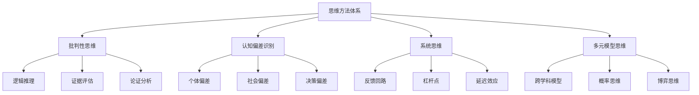
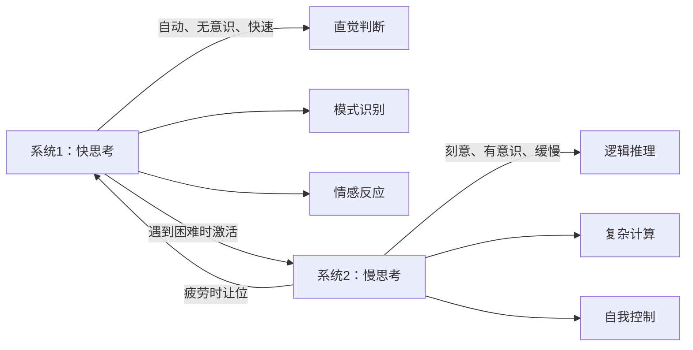
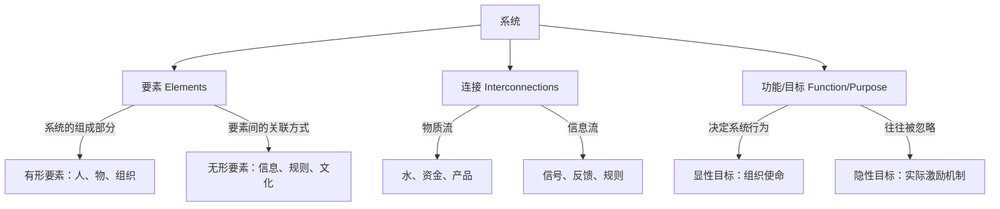
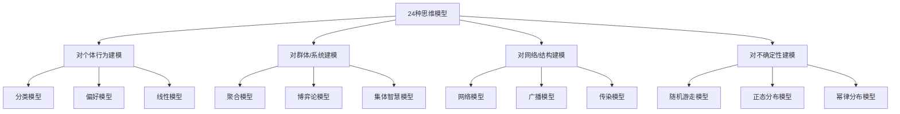

## 二、思维方法

思维方式决定了你看待世界的框架、解决问题的路径和做出决策的质量。如果说知识是"知道什么"，那么思维方法就是"怎么知道"——它决定了你能否从纷繁复杂的信息中抽丝剥茧，找到本质规律。

### 为什么思维方法类书籍如此重要

人类大脑天生依赖直觉和经验做判断，这种机制在远古环境中高效而可靠，但在信息爆炸、因果链条复杂的现代社会中，直觉频繁出错。丹尼尔·卡尼曼的研究表明，人类的思维系统存在系统性的偏差——不是偶尔犯错，而是以可预测的方式犯错。

思维方法类书籍的价值在于：它不教你"想什么"，而是教你"怎么想"。掌握批判性思维、系统思维和多元模型思维，相当于给大脑安装了一套"防错操作系统"，让你在面对复杂问题时不会轻易被表象迷惑。

### 阅读路径建议

思维方法类书籍的阅读顺序很重要。建议按照"识别偏差→建立框架→多元整合"的路径推进：先学会识别自己和他人的思维错误，再建立系统性的思维框架，最后整合多学科的思维模型。跳过基础直接阅读高阶书籍，容易陷入"知道很多模型但不会用"的困境。

---

### 入门级

#### 7.《学会提问》——尼尔·布朗

**推荐指数：** ★★★★★
**难度：** ★★★☆☆

##### 为什么这本书是批判性思维的首选入门读物

在信息过载的时代，最稀缺的能力不是获取信息，而是筛选和评估信息。《学会提问》正是为此而生——它不教你任何具体的知识，而是教你一套"质疑和验证"的方法论。

尼尔·布朗是美国博林格林州立大学的经济学教授，他将批判性思维拆解为一套可操作的流程：面对任何论证，先找到论题和结论，再找到支撑结论的理由，然后评估理由的质量。这套看似简单的框架，却是绝大多数人日常思维中缺失的环节。

##### 核心知识框架

**批判性思维的两大类型：**

| 类型 | 特征 | 适用场景 | 示例 |
|------|------|----------|------|
| 弱势批判性思维 | 用批判性思维捍卫已有立场 | 辩论、辩护 | 律师为当事人辩护 |
| 强势批判性思维 | 用批判性思维评估所有立场，包括自己的 | 决策、研究 | 科学家自我质疑实验结论 |

弱势批判性思维不是"坏的"——在法律辩护等场景中它是必要的。但如果你只想用批判性思维来"赢"，那就失去了它最大的价值：自我修正。

**论证评估的七大要素：**

1. **论题（Issue）**：讨论的是什么问题？是描述性论题（"是什么"）还是规定性论题（"应该怎样"）？
2. **结论（Conclusion）**：作者想让你接受什么观点？
3. **理由（Reasons）**：用什么来支撑结论？没有理由的结论只是观点，不是论证。
4. **关键词的含义（Key Terms）**：同一个词在不同语境中含义可能完全不同。"自由"在政治语境和经济语境中的指向截然不同。
5. **假设（Assumptions）**：论证中未明说但必须成立的前提。分为价值观假设（作者认为什么更重要）和描述性假设（作者认为世界如何运作）。
6. **证据质量（Evidence Quality）**：直觉、个人经历、案例、类比、专家意见、研究报告——不同类型的证据说服力差异巨大。
7. **推理谬误（Reasoning Fallacies）**：论证过程中是否存在逻辑漏洞。

**常见逻辑谬误速查表：**

| 谬误名称 | 定义 | 典型示例 |
|----------|------|----------|
| 人身攻击 | 攻击提出论点的人，而非论点本身 | "他是个骗子，所以他说的都不可信" |
| 诉诸权威 | 仅因为某人是权威就接受其观点 | "专家说的一定对" |
| 诉诸情感 | 用情感代替理性论证 | 用悲惨故事代替数据支撑 |
| 虚假两难 | 只给两个选项，忽略其他可能 | "你要么支持我，要么就是我的敌人" |
| 滑坡谬误 | 假定一个事件必然引发一系列后果 | "允许这个，接下来就会一发不可收拾" |
| 以偏概全 | 用个别案例推断整体规律 | "我认识的程序员都不善社交" |
| 循环论证 | 用结论证明结论 | "这本书好因为它畅销，畅销因为它好" |
| 稻草人谬误 | 歪曲对方观点后攻击 | 对方说"应该减少加班"，你说"你想让我们公司倒闭" |
| 诉诸大众 | "大家都这么做"就是对的 | "几百万人买了这个产品" |
| 赌徒谬误 | 认为随机事件有"补偿"机制 | "已经连续开了5次大，下次肯定开小" |

##### 实操指南：如何在日常生活中练习批判性思维

**每日练习法：**

1. **新闻质疑三问**：每天读一条新闻时，问自己三个问题——这条新闻的信源是什么？有没有提供反面观点？标题和内容是否一致？
2. **广告解构**：看到任何广告时，识别其中使用了哪些说服技巧（诉诸情感、权威背书、社会认同等）。
3. **会议论证检查**：在工作讨论中，留意谁在用数据说话，谁在用"我觉得"说话。

**论证分析模板：**

论题：_____________________________
结论：_____________________________
理由：
  1. ______________________________
  2. ______________________________
  3. ______________________________
关键词定义是否清晰？ _____________
隐含假设是什么？ _________________
证据类型：________________________
证据质量评估：____________________
是否存在逻辑谬误？ _______________
我的判断：________________________

##### 适合人群与阅读建议

- **最适合人群**：大学生、职场新人、信息时代的所有人
- **阅读建议**：不必按顺序读，可以先读自己最关心的谬误类型章节。建议配合实际案例练习，光读不练效果有限
- **延伸阅读**：读完后可进阶到《批判性思维工具》（理查德·保罗）和《逻辑学导论》（柯匹）

---

#### 8.《思考，快与慢》——丹尼尔·卡尼曼

**推荐指数：** ★★★★★
**难度：** ★★★★☆

##### 诺贝尔奖级别的思维革命

丹尼尔·卡尼曼是2002年诺贝尔经济学奖得主——但他是心理学家，不是经济学家。他获奖的原因是：用心理学实验推翻了经济学"理性人假设"的根基，开创了行为经济学这一全新领域。

《思考，快与慢》是他毕生研究的总结，系统地揭示了人类思维的两套系统及其交互机制。这本书不是"心灵鸡汤"，而是一部严肃的学术著作，用大量实验数据说明：人类的判断和决策远没有我们自以为的那么理性。

##### 核心知识框架

**双系统模型：**

| 特征 | 系统1（快思考） | 系统2（慢思考） |
|------|----------------|----------------|
| 速度 | 毫秒级 | 秒到分钟级 |
| 意识状态 | 无意识、自动化 | 有意识、需努力 |
| 能耗 | 低 | 高 |
| 典型任务 | 识别面孔、读简单句子、开车走熟悉路线 | 计算17×24、填税表、比较两款保险 |
| 准确性 | 多数情况可靠，但在特定场景下系统性出错 | 更准确，但容易疲劳、偷懒 |
| 可训练性 | 通过大量重复练习可建立新的"直觉" | 需要专门的逻辑训练 |

**核心认知偏差详解：**

1. **锚定效应（Anchoring Effect）**：先看到的数字会影响后续判断。实验显示，让两组人分别估计"非洲国家在联合国中的比例"，如果先给他们看到10%或65%作为"随机数"，两组的估计值会显著偏向各自的锚点。在商业谈判中，先出价的一方往往占据优势，因为出价本身就是锚点。

2. **可得性偏差（Availability Bias）**：越容易想起的事情，我们越认为它常见或重要。飞机失事的新闻让人高估飞行风险，尽管统计上飞行比驾车安全100倍。社交媒体放大了这种偏差——刷到的极端案例不代表普遍现实。

3. **代表性启发法（Representativeness）**：用"像不像"代替"概率高不高"。经典实验：给受试者描述"琳达31岁，单身，直率聪明，主修哲学，学生时代关注歧视和社会正义问题"，问"琳达是银行出纳"和"琳达是银行出纳且是女权主义者"哪个更可能。大多数人选后者——但这是逻辑错误，两个条件同时成立的概率不可能高于单个条件（合取谬误）。

4. **损失厌恶（Loss Aversion）**：失去100元的痛苦约等于得到200元的快乐。这解释了为什么人们宁愿不行动也不愿冒险——不行动感觉不会"失去"什么，但事实上不行动本身也是一种选择，也可能导致损失。

5. **禀赋效应（Endowment Effect）**：拥有某物后，你会高估它的价值。实验中，随机获得一个杯子的学生平均愿意以7.12美元卖出，而没有杯子的学生平均只愿花2.87美元买。

6. **框架效应（Framing Effect）**：同一信息用不同方式表达，会引发不同决策。"手术存活率90%"和"手术死亡率10%"——理性上完全等价，但前者让人心安，后者让人恐惧。

7. **峰终定律（Peak-End Rule）**：人们对一段体验的评价主要取决于最高峰时刻和结束时刻的感受，而非整体平均值。这解释了为什么一个精彩结尾的糟糕电影比一个糟糕结尾的精彩电影评价更高。

8. **过度自信（Overconfidence）**：人类系统性地高估自己的知识准确性和判断能力。研究表明，当人们说"90%确定"时，实际上正确率只有70%左右。

##### 实操指南

**决策防错清单：**

- 做重要决策前，问自己：这个判断是系统1（直觉）还是系统2（分析）在做？
- 收到一个数字信息后，提醒自己是否有锚定效应在起作用
- 评估风险时，查真实统计数据，而不是凭"感觉"判断
- 在做选择时，把问题反过来问一遍（"如果我现在已经选了B，我愿意花多少钱换成A？"）
- 写下你对自己判断的置信度，事后回溯检验——你会发现系统性过度自信

**适合人群与阅读建议：**

- **最适合人群**：对认知科学感兴趣、愿意投入时间深度阅读的人
- **阅读建议**：这本书内容密度很高，建议分章节精读，每读完一章用笔记总结核心偏差并记录生活中的实例。前三部分（判断、启发法与偏差、过度自信）是最实用的部分，可以优先阅读
- **常见误区**：不要把这本书当成"速查手册"——它的价值在于改变你对自己思维方式的认知，而不是罗列偏差清单

---

#### 9.《清醒思考的艺术》——罗尔夫·多贝里

**推荐指数：** ★★★★☆
**难度：** ★★☆☆☆

##### 认知偏差的速查手册

如果说《思考，快与慢》是认知偏差的"学术巨著"，那么《清醒思考的艺术》就是它的"口袋速查版"。瑞士作家罗尔夫·多贝里用52个短小精悍的章节，每章2-3页，介绍了52种最常见的思维错误。

这本书的优势在于：简短、易读、独立成篇。你可以从任何一章开始读，不需要前置知识。每章用一个生动的案例引入，解释偏差的本质，然后给出简短的应对建议。

##### 核心内容概览

**52种思维错误的分类整理：**

| 类别 | 偏差类型 | 书中涉及的典型偏差 |
|------|----------|-------------------|
| 认知类 | 信息处理偏差 | 幸存者偏差、故事偏差、结果偏差、控制错觉 |
| 社会类 | 群体影响偏差 | 社会认同、权威偏误、从众心理、光环效应 |
| 决策类 | 判断扭曲偏差 | 沉没成本、锚定效应、框架效应、现成偏差 |
| 统计类 | 概率误判偏差 | 赌徒谬误、基本比率忽视、小数定律、均值回归 |
| 自我类 | 自我认知偏差 | 自利性偏差、过度自信、后见之明、享乐适应 |

**书中最值得深思的几个偏差：**

- **幸存者偏差**：我们只看到成功者的故事，看不到失败者的沉默。读到比尔·盖茨辍学创业成功的故事时，不要忽略那些同样辍学但失败的数万人。
- **沉没成本谬误**：已经花出去的钱不应该影响未来的决策。电影看了30分钟发现很烂——正确的做法是立刻离场，而不是"来都来了看完吧"。
- **故事偏差**：人类天生喜欢用故事来理解世界，但故事会简化复杂现实。"一个成功的创业故事"可能省略了99%的运气因素。
- **行动偏差**：人们倾向于做点什么而不是什么都不做——但很多时候，不做才是最优选择。频繁交易的股票投资者收益通常低于长期持有的投资者。

##### 与《思考，快与慢》的对比

| 维度 | 《思考，快与慢》 | 《清醒思考的艺术》 |
|------|----------------|-------------------|
| 深度 | 深入实验机制和理论原理 | 偏重案例和直觉理解 |
| 广度 | 聚焦判断与决策领域 | 覆盖更广泛的日常场景 |
| 阅读难度 | 高，需要专注和思考 | 低，轻松易读 |
| 实用性 | 理解原理后长期受益 | 即学即用，适合速查 |
| 最佳用途 | 系统学习认知科学 | 日常查漏补缺、培养意识 |

##### 阅读建议

- **最适合人群**：希望快速了解常见认知偏差的人，阅读时间有限的职场人
- **阅读建议**：适合放在手机或床头，每天读1-2章。重点不是记住52个偏差名称，而是在日常生活中识别它们。建议读完后做一个"个人偏差清单"——记录自己最容易犯的5-10个偏差，定期回顾
- **不足之处**：由于篇幅限制，每个偏差的解释比较浅，缺乏实验数据支撑。如果对某个偏差特别感兴趣，需要回溯到《思考，快与慢》等学术著作深入了解

---

### 进阶级

#### 10.《系统之美》——德内拉·梅多斯

**推荐指数：** ★★★★★
**难度：** ★★★★☆

##### 从线性思维到系统思维的范式转换

德内拉·梅多斯是系统动力学创始人杰伊·福雷斯特的学生，也是罗马俱乐部《增长的极限》报告的主要作者。《系统之美》是她最具影响力的著作，被誉为系统思维领域的"圣经"。

大多数人习惯线性思维——A导致B，B导致C。但真实世界是系统性的：A导致B，B又反过来影响A，同时C和D也在互相作用。线性思维在简单问题上有效，但在复杂问题上几乎必然失败。《系统之美》教你用系统的眼光看世界，理解为什么"头痛医头"往往适得其反。

##### 核心知识框架

**系统的三大组成要素：**

系统的三大要素中，最重要也最容易被忽略的是**连接**和**目标**。改变系统中的要素（比如换掉一个人）通常效果有限；改变连接（比如改变信息流动方式）和目标（比如改变激励机制）才能从根本上改变系统行为。

**反馈回路——系统的核心驱动力：**

| 回路类型 | 机制 | 效果 | 典型案例 |
|----------|------|------|----------|
| 增强回路（正反馈） | 变化自我强化 | 指数增长或崩溃 | 复利增长、病毒传播、口碑效应 |
| 调节回路（负反馈） | 变化自我抵消 | 趋向稳定目标 | 体温调节、市场价格回归、库存管理 |
| 延迟 | 因果之间存在时间差 | 导致过度反应或反应不足 | 药效延迟导致多吃药、政策效果滞后 |

**系统陷阱（基模）详解：**

1. **政策阻力**：子系统各自追求自身目标，相互抵消。减肥时身体降低代谢率抵消少吃的效果——这是身体的"调节回路"在对抗你的干预。
2. **公地悲剧**：个体理性导致集体非理性。每个渔民多捕一点鱼是理性的，但所有渔民都这样做会导致鱼类资源枯竭。
3. **目标侵蚀**：系统对负面结果的容忍度逐渐提高。"这次考试差一点没关系"逐渐变成"能及格就行"。
4. **竞争升级**：双方互相攀比，螺旋式上升直到一方崩溃。军备竞赛、价格战、加班文化都是典型案例。
5. **富者愈富**：早期优势被正反馈放大。有钱人投资回报更高→更有钱→更多投资机会。
6. **转嫁负担给干预者**：依赖外部干预而非修复自身能力。长期依赖止痛药治头痛，而不是找出头痛的根本原因。

**杠杆点——改变系统的最佳介入位置：**

梅多斯列出了12个杠杆点，从弱到强排列。以下是最重要的几个：

| 杠杆点 | 力度 | 说明 | 示例 |
|--------|------|------|------|
| 参数（数字：税率、补贴等） | ★☆☆ | 最常见但效果最弱的干预 | 提高最低工资 |
| 缓冲区（库存大小） | ★★☆ | 增加系统稳定性 | 增加战略石油储备 |
| 系统结构（物质流的组织方式） | ★★★ | 重新设计供应链、交通路线 | 城市重新规划交通 |
| 延迟（变化速度的匹配） | ★★★ | 改变延迟可大幅影响系统行为 | 缩短决策反馈周期 |
| 信息流（谁获得什么信息） | ★★★★ | 改变信息结构可改变行为 | 公开企业排污数据 |
| 规则（激励、惩罚、约束） | ★★★★ | 改变规则改变游戏 | 碳排放交易制度 |
| 自组织能力（系统自我进化） | ★★★★★ | 允许系统自我创新 | 开源社区的演化 |
| 目标（系统的根本目的） | ★★★★★ | 最强杠杆点 | 从"GDP增长"转向"国民幸福" |
| 范式（系统的底层信念） | ★★★★★ | 最最根本的改变 | 从"征服自然"到"与自然共生" |

##### 实操指南

**系统分析五步法：**

1. **画出系统图**：识别要素、连接和目标，用箭头表示因果关系
2. **找到反馈回路**：标出增强回路（R）和调节回路（B）
3. **识别延迟**：在因果链中标出时间延迟
4. **找出杠杆点**：在系统图中找到"四两拨千斤"的位置
5. **模拟干预效果**：预判改变某个变量后，系统会如何响应

**常见场景的系统思维应用：**

- **团队效率低**：不要只想着"加人"或"加班"（线性思维）。先检查信息流——团队是否清楚目标？反馈机制是否健全？激励是否对齐？
- **减肥反弹**：身体有强大的调节回路维持体重设定点。只靠少吃是"头痛医头"，需要同时改变设定点（运动改变代谢结构、调整饮食习惯改变激素水平）
- **产品增长停滞**：增长来自增强回路（用户推荐→新用户→更多推荐）。如果增强回路在衰减，检查是否有调节回路（如用户体验下降导致流失）在起作用

##### 适合人群与阅读建议

- **最适合人群**：需要处理复杂问题的管理者、决策者、创业者
- **阅读建议**：第一部分（系统的结构和行为）和第三部分（如何改变系统）最实用，可优先阅读。建议边读边画自己工作中遇到的系统图，把抽象概念具象化
- **常见误区**：系统思维不是"什么都往复杂了想"。有些问题确实是线性的，不需要系统分析。关键是学会判断：这个问题是否有反馈回路、延迟和非线性关系？如果有，就需要系统思维

---

#### 11.《穷查理宝典》——查理·芒格

**推荐指数：** ★★★★★
**难度：** ★★★★☆

##### 巴菲特背后的思想巨人

查理·芒格是沃伦·巴菲特长达半个多世纪的合伙人，伯克希尔·哈撒韦的副主席。巴菲特曾说："是芒格让我从猩猩进化成了人类。"如果说巴菲特是投资之神，芒格就是投资之神背后的"思考之神"。

《穷查理宝典》不是一本系统性的教科书，而是芒格历年的演讲稿、访谈和文章的合集。它的核心思想只有一个：**多元思维模型（Latticework of Mental Models）**——不要只用一个学科的视角看问题，而要从多个学科借用最基本的思维模型，构建一个"思维格栅"。

##### 核心知识框架

**铁锤人倾向（Man with a Hammer Syndrome）：**

芒格用一个生动的比喻指出人类思维的致命弱点："手里拿着锤子的人，看什么都像钉子。"如果你只学过经济学，你会用供需关系解释一切；如果你只学过心理学，你会用心理偏差解释一切。每个学科都有自己的"锤子"，但世界远比任何单一学科复杂。

**芒格推荐的核心思维模型：**

| 学科 | 核心模型 | 应用场景 |
|------|----------|----------|
| 数学 | 复利效应、排列组合、贝叶斯定理 | 投资决策、概率评估 |
| 心理学 | 激励偏见、社会认同、损失厌恶 | 理解人性、营销、管理 |
| 经济学 | 机会成本、规模效应、比较优势 | 资源分配、战略决策 |
| 生物学 | 进化论、适应性、生态位 | 理解竞争、市场演化 |
| 物理学 | 临界质量、惯性、均衡 | 理解系统行为、组织变革 |
| 工程学 | 冗余设计、断裂点、安全边际 | 风险管理、系统设计 |
| 化学/物理 | 临界质量、催化作用 | 理解量变到质变 |
| 历史 | 周期、路径依赖、制度惯性 | 预测趋势、避免重蹈覆辙 |

**芒格的25种人类误判心理倾向（核心清单）：**

这是芒格最著名的演讲之一《人类误判心理学》的核心内容，被很多投资者视为"防错指南"：

1. **激励机制偏见**：永远不要低估激励的力量。"给我看激励机制，我就能告诉你结果。"——如果你的KPI只考核短期业绩，就不要期望员工做长期规划。
2. **喜欢/热爱倾向**：人们倾向于忽略所爱之人或事物的缺点，放大其优点。
3. **讨厌/憎恨倾向**：与上一条相反，人们倾向于忽略讨厌之人的优点，放大其缺点。
4. **避免怀疑倾向**：人类大脑倾向于尽快消除不确定性，做出决定——即使仓促。
5. **自视过高倾向**：90%的司机认为自己驾驶水平高于平均。人们高估自己的能力、判断和所有物。
6. **被剥夺超级反应倾向**：失去已有的东西带来的痛苦，远大于得到同样东西的快乐。这就是损失厌恶。
7. **社会认同倾向**：在不确定时，人们会看别人怎么做。从众行为的根源。
8. **对比错误倾向**：不评估绝对值，而是通过比较来判断。房产中介先带你看破房子，再看目标房，你会觉得目标房更好。
9. **压力影响倾向**：极端压力会扭曲人的认知和判断能力。轻度压力可以提高表现，但过度压力会导致认知崩溃。

**逆向思维（Inversion）：**

芒格最推崇的思维方式之一："反过来想，总是反过来想。"

- 想要幸福？先想想什么会让人不幸，然后避免那些事
- 想要投资成功？先想想什么会导致投资失败，然后避开那些陷阱
- 想要企业长寿？先想想什么会杀死企业，然后建立防线

**能力圈（Circle of Competence）：**

芒格反复强调：知道自己能力圈的边界，比能力圈的大小更重要。在能力圈内做决策，成功率高；超出能力圈，就是在赌博。关键不在于"什么都知道一点"，而在于"知道什么自己不知道"。

##### 实操指南

**如何构建自己的思维模型库：**

1. **从三个基础学科开始**：数学（概率和统计）、心理学（认知偏差）、经济学（供需和激励）
2. **每个学科掌握3-5个核心模型**：不必成为专家，但要理解基本原理
3. **遇到问题时跨学科思考**：这个问题从心理学角度看是什么？从经济学角度看呢？
4. **建立"模型卡片"**：每个模型用一张卡片记录——名称、原理、应用场景、注意事项

**芒格的检查清单法：**

芒格做投资决策前会用一个"心理模型检查清单"，逐一排查：

- 激励机制是否对齐？（相关方的激励是什么？）
- 是否有社会认同在影响我的判断？（我是否因为"别人都在买"而想买？）
- 我是否在能力圈内？（我真的理解这个投资吗？）
- 我是否被锚定了？（价格锚点是否影响了我的估值？）
- 逆向思考：如果这笔投资失败了，最可能的原因是什么？

##### 适合人群与阅读建议

- **最适合人群**：有一定知识积累、希望拓展思维广度的人，投资者、创业者、管理者
- **阅读建议**：不要试图从头读到尾——先读"人类误判心理学"和"论学院派经济学"两篇演讲，再根据兴趣选择其他章节。建议准备一个笔记本，把芒格提到的思维模型逐个记录并拓展学习
- **常见误区**：不要因为芒格是投资大师就把这本书当成"炒股秘籍"——它的真正价值在于教你如何思考，而不是教你如何投资

---

#### 12.《模型思维》——斯科特·佩奇

**推荐指数：** ★★★★☆
**难度：** ★★★★☆

##### 从直觉判断到模型驱动的决策

斯科特·佩奇是密歇根大学复杂系统研究中心的教授，他在Coursera上的"模型思维"课程已有超过100万学生。《模型思维》是这门课程的书面版本，系统地介绍了24种常用的思维模型。

如果说芒格的"多元思维模型"是理念宣言，佩奇的《模型思维》就是操作手册。它不只告诉你"要用多种模型"，还具体告诉你"有哪些模型、怎么用、在什么场景下用"。

##### 核心知识框架

**24种模型的分类体系：**

**核心模型详解：**

**1. 正态分布与幂律分布——两种世界观的碰撞：**

| 特征 | 正态分布（高斯分布） | 幂律分布（长尾分布） |
|------|---------------------|---------------------|
| 形状 | 钟形曲线，对称 | L形曲线，右偏 |
| 典型场景 | 身高、考试成绩、测量误差 | 收入、城市人口、网站流量 |
| 极端值 | 极少出现（6σ几乎不可能） | 常见（"黑天鹅"事件） |
| 代表性统计量 | 均值、标准差 | 中位数、分位数 |
| 预测难度 | 低，可信赖平均值 | 高，极端值主导结果 |
| 思维启示 | 大多数事情在"正常范围"内 | 不要忽视"长尾"中的机会和风险 |

理解这两种分布的区别至关重要。如果你把幂律分布的变量当成正态分布来处理——比如用"平均收入"来代表一个国家的经济水平——你会严重误判现实。

**2. 博弈论模型——在互动中做决策：**

现实中的决策很少是独立做出的——你的选择影响他人，他人的选择也影响你。博弈论模型帮助你理解这种互动。

- **囚徒困境**：个体理性导致集体非理性。两个囚犯各自招供是最优策略，但双方都不招供才能得到最好的集体结果。现实中：企业价格战、军备竞赛、公地悲剧。
- **纳什均衡**：没有任何一方能通过单方面改变策略获益的状态。理解纳什均衡可以帮你判断：当前的均衡状态是否可以通过改变规则来优化？
- **协调博弈**：多个均衡中选择哪一个，取决于预期和惯例。这就是"标准"的力量——VHS打败Betamax不是因为技术更好，而是因为更多人预期它会赢。

**3. 网络模型——理解连接的力量：**

- **六度分隔理论**：任何两个人之间的平均距离约为6步。这意味着信息（或病毒）可以在极短时间内传遍整个网络。
- **无标度网络**：真实世界的网络（社交、互联网、航空）不是均匀分布的，而是少数节点（"枢纽"）拥有大量连接。这意味着攻击枢纽可以快速瓦解整个网络。
- **传染模型**：疾病、信息、行为的传播都遵循类似的规律。理解阈值效应——只有当传染率超过某个阈值时，才会形成大流行。

**4. 随机游走模型——理解运气的作用：**

股票价格的短期走势接近随机游走。这意味着大多数技术分析（看K线图找规律）在统计上是无效的。理解随机游走不是要你放弃投资，而是要你认清：很多"规律"只是随机噪声中的幻觉。

##### 多模型思维的方法论

佩奇提出了一个核心原则：**多模型优于单模型**。面对同一个问题，用不同模型分析，然后取交集：

1. **用分类模型**确定问题的类型
2. **用博弈论模型**分析参与者的行为
3. **用网络模型**理解信息和影响的传播
4. **用统计模型**评估不确定性和风险
5. **取各模型预测的交集**——多个模型都指向的结论，可信度最高

这种方法的底层逻辑是"群体智慧"原理：多个独立模型的综合预测，通常优于任何一个单独模型。

##### 适合人群与阅读建议

- **最适合人群**：对数据分析和决策科学感兴趣的人，需要在不确定环境中做决策的人
- **阅读建议**：第1-4章（多模型思维概述）是全书精华，务必精读。之后可以按兴趣选择具体模型深入学习。数学基础薄弱的读者可以跳过公式推导，重点关注每个模型的直觉含义和应用场景
- **与《穷查理宝典》的关系**：芒格是理念倡导者，佩奇是操作实现者。建议先读芒格理解"为什么要用多模型"，再读佩学习"有哪些模型可用"

---

### 思维方法类书籍的整体阅读策略

#### 按阶段选择阅读路径

| 读者阶段 | 推荐书籍 | 核心目标 | 预期时间 |
|----------|----------|----------|----------|
| 完全新手 | 《清醒思考的艺术》 | 认识到思维会出错 | 1-2周 |
| 入门进阶 | 《学会提问》 | 掌握批判性思维框架 | 2-3周 |
| 深入理解 | 《思考，快与慢》 | 理解偏差的科学原理 | 4-6周 |
| 系统提升 | 《系统之美》 | 建立系统思维能力 | 3-4周 |
| 高阶整合 | 《穷查理宝典》+《模型思维》 | 构建多模型思维体系 | 持续学习 |

#### 如何将读到的思维方法内化为习惯

读书只是第一步，真正的挑战是将这些思维方法变成日常习惯。以下是经过验证的内化路径：

1. **识别触发场景**：列出你最容易犯思维错误的场景（开会决策、投资理财、人际冲突等）
2. **建立检查清单**：针对每个场景，列出需要检查的偏差类型
3. **刻意练习**：每周选一个偏差，整周有意识地在生活中识别它
4. **复盘日记**：每周回顾一次，记录自己发现了哪些偏差、犯了哪些错误
5. **教是最好的学**：尝试向他人解释你学到的思维模型——能讲清楚才算真正理解

#### 常见误区

| 误区 | 纠正方法 |
|------|----------|
| 读完思维方法书籍后觉得自己"变聪明了" | 知道偏差和能避免偏差是两回事，持续练习才是关键 |
| 用思维方法去"赢"辩论 | 思维方法最大的价值是自我修正，不是攻击他人 |
| 追求记住所有偏差名称 | 重要的是识别偏差的"感觉"，不是记住术语 |
| 认为读完这几本书就够了 | 思维方法的学习是终身的，实践比阅读更重要 |
| 忽略情绪对思维的影响 | 再好的思维框架，在情绪激动时也会失效——先管理情绪，再理性思考 |

---

> **本节小结**：思维方法类书籍是个人成长的"底层操作系统"。从《清醒思考的艺术》的52种偏差速查，到《学会提问》的批判性思维框架，到《思考，快与慢》的认知科学原理，再到《系统之美》的系统视角和《穷查理宝典》的多元模型——每一本书都在不同层面升级你的思维能力。记住：知道不等于做到，内化思维方法需要持续的刻意练习。
