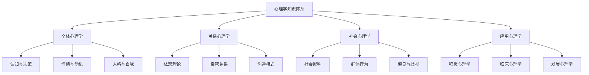
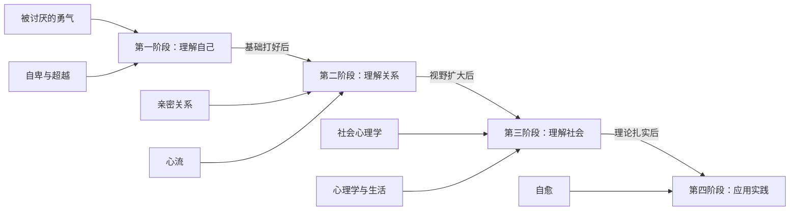
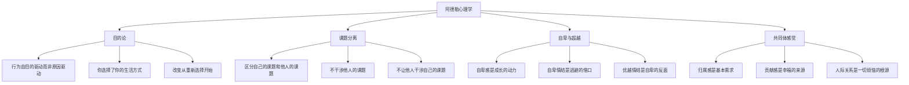
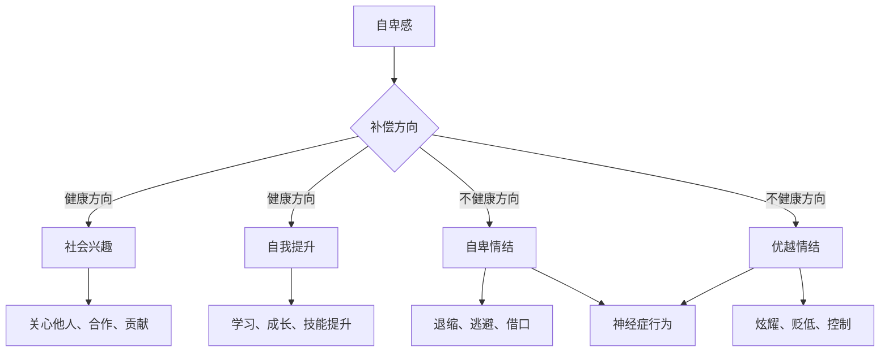
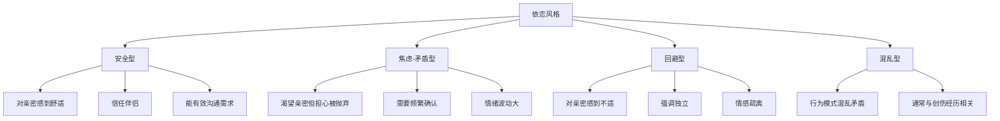
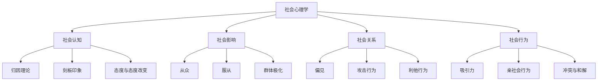
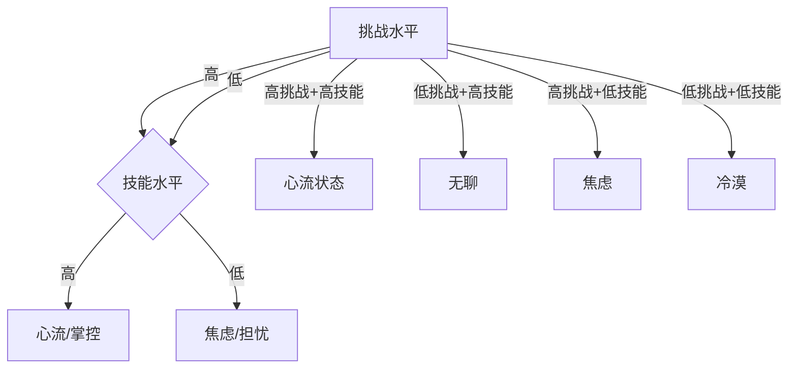
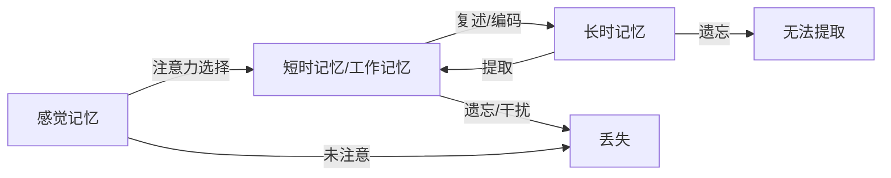
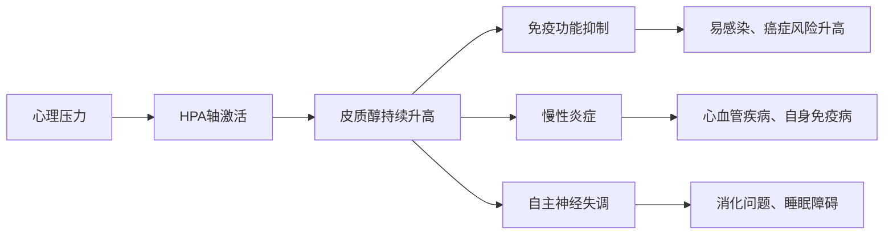

## 三、心理学

心理学是理解自我、理解他人、理解人与人之间动态关系的基础学科。它不像经济学那样关注资源配置，也不像哲学那样追问终极意义——心理学关注的是一个更基本的问题：**人为什么会这样想、这样感受、这样行动？**

这个问题的答案直接影响你生活的方方面面：你如何做决策、如何处理情绪、如何与伴侣沟通、如何在职场中与同事协作、如何教育孩子、如何面对挫折。心理学不是一门"锦上添花"的学科，而是一门"地基工程"——它决定了你理解自己和他人的能力上限。

### 为什么每个人都需要心理学素养

大多数人对自己的心理运作机制知之甚少。你以为你在"理性决策"，实际上大脑在用几十种捷径和偏差替你做了决定。你以为你"了解自己"，实际上你对自己的动机、偏好和情绪触发机制的认知充满了盲区。你以为你"善于沟通"，实际上你在亲密关系中的沟通模式可能正在制造你最不想看到的结果。

心理学素养的核心价值在于三个层面：

| 层面 | 没有心理学素养 | 有心理学素养 |
|------|--------------|------------|
| 自我认知 | 被情绪驱动，不知道为什么反复陷入同样的困境 | 能识别自己的情绪模式、认知偏差和行为惯性 |
| 人际关系 | 凭本能反应，冲突升级后才意识到问题 | 理解对方行为背后的心理需求，提前化解矛盾 |
| 决策质量 | 被直觉和偏见操控，在重要选择上反复犯同类错误 | 识别决策中的心理陷阱，建立校正机制 |

### 阅读路径建议

心理学书籍的阅读应该遵循"自我→关系→社会"的路径。先理解自己的心理运作机制，再学习如何与他人建立健康的关系，最后理解社会层面的心理现象。这个顺序不是随意的——如果你不先理解自己，就很难真正理解关系中的动态；如果你不理解关系，就很难理解群体行为。

---

### 入门级

#### 13.《被讨厌的勇气》——岸见一郎、古贺史健

**推荐指数：** ★★★★★
**难度：** ★★★☆☆

##### 为什么这本书是心理学入门的首选

在所有心理学入门书中，《被讨厌的勇气》有一个独特的优势：它不是在"教"你心理学，而是在"跟你聊"心理学。全书采用一位青年与一位哲人的对话体形式，读起来像是一场深夜长谈——你在青年身上看到自己的困惑，在哲人的回答中找到突破的方向。

岸见一郎是日本研究阿德勒心理学的权威学者，古贺史健则是擅长将复杂思想通俗化的作家。两人的合作让这本书既有学术深度，又有极高的可读性。自2013年出版以来，它在日本销量超过百万册，成为现象级的心理学读物。

##### 核心知识框架

阿德勒心理学（也称"个体心理学"）与弗洛伊德的精神分析、荣格的分析心理学并称为心理学三大流派。但阿德勒的理论有一个鲜明的特点：**它不关注"你为什么变成这样"，而关注"你选择成为什么样的人"**。这种"目的论"的视角，是理解全书的钥匙。

**阿德勒心理学的核心概念体系：**

**目的论 vs 因果论——范式转换：**

| 维度 | 弗洛伊德的因果论 | 阿德勒的目的论 |
|------|----------------|--------------|
| 核心问题 | "你为什么变成这样？" | "你选择成为什么样的人？" |
| 解释逻辑 | 过去的经历决定了现在的你 | 你为了某个目的而选择了现在的行为方式 |
| 对创伤的看法 | 创伤塑造了你，你是受害者 | 你赋予了经历意义，你是选择者 |
| 改变的可能 | 需要追溯过去、修复创伤 | 此刻就可以重新选择 |
| 典型例子 | "我因为童年缺爱所以不信任人" | "我选择了不信任人，因为这样可以避免受伤" |

这种视角转换的力量在于：**如果问题是"过去的经历"造成的，你无法改变过去；但如果问题是"你现在的选择"造成的，你此刻就可以做出不同的选择。**

**课题分离——全书最具实操价值的概念：**

课题分离是阿德勒心理学中最具颠覆性、也最实用的概念。它的核心判断标准只有一个：**"这个选择的后果最终由谁来承担？"** 由谁承担，就是谁的课题。

| 场景 | 谁的课题 | 常见的越界行为 | 正确的做法 |
|------|---------|--------------|----------|
| 孩子不写作业 | 孩子的课题 | 父母催促、责骂、替孩子写 | 告知后果，让孩子自己决定 |
| 你选择什么职业 | 你的课题 | 父母强制要求考公务员 | 尊重自己的选择，承担后果 |
| 同事如何评价你 | 同事的课题 | 过度在意、改变自己迎合 | 专注做好自己的事 |
| 你是否努力工作 | 你的课题 | 因为领导不认可就放弃努力 | 为自己的标准负责 |
| 伴侣是否开心 | 伴侣的课题 | 觉得"让对方开心"是自己的责任 | 表达关心但不背负对方的情绪 |

课题分离不是"冷漠"或"不关心"。它的真正含义是：**你可以在对方需要时提供支持，但你不能替对方做决定，也不能把对方的反应当作自己的责任。** 在亲密关系中，这一点尤为重要——很多关系中的痛苦，来自双方混淆了彼此的课题。

**自卑感、自卑情结与优越情结的区分：**

| 概念 | 定义 | 表现 | 是否健康 |
|------|------|------|---------|
| 自卑感 | 意识到自己不足时的感受 | "我这方面还不够好，需要学习" | ✅ 健康，是成长的动力 |
| 自卑情结 | 把自卑感当作不行动的借口 | "因为我学历低，所以不可能成功" | ❌ 不健康，是逃避的借口 |
| 优越情结 | 通过炫耀或贬低他人来掩盖自卑 | 炫耀财富、学历、人脉 | ❌ 不健康，是自卑的反面表现 |

阿德勒认为：**每个人都有自卑感，这本身不是问题。问题在于你如何回应自卑感。** 如果你把自卑感转化为"我要变得更好"的行动，它就是成长的燃料；如果你把自卑感变成"我不行"的借口，它就变成了枷锁。

##### 实操指南：如何在生活中运用阿德勒心理学

**课题分离练习法：**

1. **识别焦虑来源**：当你感到焦虑或压力时，问自己"这到底是谁的课题？"
2. **用"后果由谁承担"来判断**：如果这个决定的后果最终由对方承担，那就是对方的课题
3. **从最小的事情开始练习**：比如同事午饭吃什么、朋友周末怎么安排——这些明显是对方的课题，先从这些开始放手
4. **逐步扩展到重要领域**：等你在小事上熟练了，再应用到职业选择、关系决策等重要领域

**从"原因论"到"目的论"的思维转换练习：**

当你发现自己在用"因为……所以……"解释自己的行为时，试着改成"我选择……因为……"的句式：

- ❌ "因为我小时候被欺负，所以我不敢社交。"
- ✅ "我选择不社交，因为这样可以避免被拒绝的恐惧。"

这个句式转换看起来简单，但它会迫使你承认一个事实：**你的行为是你自己的选择，而不是过去经历的必然结果。** 承认这一点不舒服，但它给了你改变的力量——既然是选择的，就可以重新选择。

**共同体感觉的日常培养：**

1. **每天做一件不求回报的小事**：帮同事带杯咖啡、给陌生人指路、写一段真诚的感谢
2. **在人际交往中关注"我能贡献什么"而非"我能得到什么"**
3. **扩大"共同体"的范围**：从家人到同事到社区到社会，逐步扩大你关心的人群范围

##### 适合人群与阅读建议

- **最适合人群**：在意他人评价、害怕被人讨厌、在人际关系中感到疲惫的人；对心理学零基础但想入门的读者
- **阅读建议**：这本书适合一口气读完，因为对话体的连贯性很强。读完后建议隔一周再读第二遍——第二遍你会注意到很多第一遍忽略的细节。特别推荐第五章"认真的人生活在当下"，这是全书的高潮
- **常见误区**：课题分离不等于"我行我素"。阿德勒强调的是在尊重彼此课题的前提下建立关系，而不是切断所有联系。如果你把课题分离用成了"我不在乎任何人"，那你理解错了
- **延伸阅读**：如果想深入阿德勒的原始理论，可以继续读《自卑与超越》；如果想看阿德勒心理学在教育中的应用，推荐《孩子：挑战》（鲁道夫·德雷克斯）

---

#### 14.《自卑与超越》——阿尔弗雷德·阿德勒

**推荐指数：** ★★★★☆
**难度：** ★★★☆☆

##### 阿德勒本人的原始声音

如果《被讨厌的勇气》是阿德勒心理学的"通俗解读"，那么《自卑与超越》就是阿德勒本人的"原声带"。这本书的原名是 *What Life Should Mean to You*（1931年），是阿德勒面向普通读者写的，语言比他的学术著作平易得多，但理论深度明显高于通俗解读版。

阿尔弗雷德·阿德勒（1870-1937）的人生经历本身就充满了"自卑与超越"的意味。他童年体弱多病，学业成绩平平，曾被老师断言"只能去当鞋匠"。但他后来成为与弗洛伊德、荣格齐名的心理学三大巨头之一。他提出的"自卑补偿"理论，某种程度上也是对自己人生经历的理论化。

##### 核心知识框架

**自卑补偿理论的完整框架：**

阿德勒认为，人类的一切行为都可以追溯到一个根本动力：**对自卑感的补偿**。婴儿从出生起就处于完全依赖他人的状态——这是人类最原始的自卑感来源。为了克服这种无力感，人会发展出各种补偿策略。

**生活风格（Life Style）——你的人格操作系统：**

阿德勒提出了"生活风格"的概念——每个人在4-5岁时就会形成一套看待自己、看待他人、看待世界的固定模式，这就是你的"生活风格"。它像一个操作系统的底层代码，决定了你后续所有的行为模式。

| 生活风格类型 | 核心信念 | 典型行为 | 可能的问题 |
|------------|---------|---------|----------|
| 控制型 | "我必须掌控一切" | 领导力强、追求完美 | 控制欲过强、难以合作 |
| 索取型 | "别人应该照顾我" | 依赖他人、逃避责任 | 难以独立、关系失衡 |
| 回避型 | "不尝试就不会失败" | 拖延、退缩、自我设限 | 错失机会、自我实现受限 |
| 社会利益型 | "我能为他人做什么" | 合作、贡献、关心他人 | 最健康的生活风格 |

关键点在于：**生活风格不是命运，而是可以被意识和改变的。** 当你意识到自己的生活风格是什么，你就有了选择——继续沿着旧模式走，还是有意识地调整。

**社会兴趣（Social Interest）——心理健康的终极指标：**

阿德勒认为，衡量一个人心理健康程度的最佳指标不是"他有多成功"，而是"他的社会兴趣有多强"。社会兴趣指的是一个人对他人福祉的关心、与他人合作的意愿、为社会做贡献的动机。

阿德勒的这一观点在今天看来极具前瞻性——大量现代研究证实，利他行为、社会连接和意义感是幸福的三大支柱，比金钱、地位和享乐更能预测一个人的心理健康水平。

##### 阿德勒与其他心理学流派的对比

| 维度 | 阿德勒（个体心理学） | 弗洛伊德（精神分析） | 荣格（分析心理学） |
|------|-------------------|-------------------|-----------------|
| 核心动力 | 自卑感的补偿 | 性本能（力比多） | 集体无意识 |
| 时间取向 | 面向未来（目的论） | 面向过去（因果论） | 面向整体（整合） |
| 改变路径 | 意识到生活风格，重新选择 | 潜意识意识化，修通创伤 | 个体化，整合阴影 |
| 治疗关系 | 合作关系 | 移情关系 | 对话关系 |
| 对人性的看法 | 乐观：人可以改变 | 悲观：人被无意识驱动 | 中性：人需要整合 |

##### 实操指南

**识别自己的生活风格：**

1. **回忆童年模式**：你在家里排行第几？你和兄弟姐妹的竞争模式是什么？你父母的教育风格是什么？
2. **观察当前行为模式**：遇到冲突时你倾向于控制、回避还是合作？你在关系中更像照顾者还是被照顾者？
3. **识别核心信念**：完成这个句子"我必须______才能被接受/有价值/安全"

**培养社会兴趣的三个层次：**

1. **行为层次**：每周做一次志愿服务或匿名帮助他人
2. **认知层次**：在做决定时，除了"对我有什么好处"，也问"对他人有什么影响"
3. **存在层次**：找到一个超越自我的人生使命——它不需要宏大，但需要让你感到"我的存在对他人有意义"

##### 适合人群与阅读建议

- **最适合人群**：对阿德勒心理学感兴趣、希望从原著角度理解的读者；教育工作者（阿德勒对儿童心理有深刻洞察）
- **阅读建议**：建议先读《被讨厌的勇气》建立框架，再读这本书加深理解。第三章"自卑与补偿"和第七章"社会兴趣"是全书核心，可以优先阅读。阿德勒的写作风格偏学术但不晦涩，耐心读完会有很大收获
- **不足之处**：书中部分案例基于20世纪初的社会背景，与当代生活有一定距离。但理论本身依然完全适用

---

#### 15.《亲密关系》——罗兰·米勒

**推荐指数：** ★★★★★
**难度：** ★★★☆☆

##### 关于亲密关系的科学圣经

如果说市面上90%的亲密关系书籍都是"经验之谈"或"心灵鸡汤"，那么罗兰·米勒的《亲密关系》就是那10%的"科学之作"。这是一本大学教材，但它的可读性远超大多数通俗读物——因为它用大量真实的研究数据来支撑每一个结论，而不是用"我觉得"或"我的经验是"。

罗兰·米勒是美国休斯顿州立大学的心理学教授，专注于亲密关系研究数十年。《亲密关系》目前已经出到第6版，被全球数百所大学用作教材，是亲密关系领域引用率最高的著作之一。

##### 核心知识框架

**亲密关系的科学定义：**

米勒给出了亲密关系的六个特征，缺一不可：

| 特征 | 含义 | 为什么重要 |
|------|------|----------|
| 了解（Knowledge） | 彼此分享私密信息 | 不了解对方的关系只是表面社交 |
| 关心（Caring） | 对对方的福祉有真切的关心 | 没有关心的关系是工具性的 |
| 相互依赖（Interdependence） | 彼此影响对方的生活和决策 | 独立到互不影响不是亲密关系 |
| 相互一致性（Mutuality） | 把"我"变成"我们" | 存在共同的身份认同 |
| 信任（Trust） | 相信对方会善待自己 | 没有信任的关系充满焦虑 |
| 承诺（Commitment） | 决定维持并投入关系 | 没有承诺的关系随时可能瓦解 |

**依恋理论——理解你在关系中的行为模式：**

依恋理论是亲密关系研究中最重要的理论框架，由约翰·鲍尔比提出，后经玛丽·安斯沃斯和辛迪·哈赞等人发展完善。核心观点是：**你在婴儿期与主要照顾者形成的依恋模式，会深刻影响你成年后的亲密关系。**

**四种依恋风格的详细特征：**

| 维度 | 安全型（约60%） | 焦虑型（约20%） | 回避型（约20%） | 混乱型（少数） |
|------|--------------|--------------|--------------|-------------|
| 对亲密的态度 | 舒适、自然 | 渴望但焦虑 | 不适、想逃 | 矛盾、混乱 |
| 对伴侣的信任 | 高 | 低，需要反复确认 | 中等偏低 | 极低 |
| 冲突处理方式 | 直接沟通、寻求解决 | 情绪化、担心关系破裂 | 退缩、冷处理 | 反应不可预测 |
| 分手后的状态 | 难过但能恢复 | 极度痛苦、难以放下 | 表面无所谓、压抑情绪 | 情绪崩溃 |
| 最大的恐惧 | 相对较少 | 被抛弃 | 失去独立性 | 不确定 |

重要提醒：**依恋风格不是命运。** 研究表明，大约30%的人在成年后会改变依恋风格——通常是从不安全型转向安全型。关键在于：意识到自己的依恋模式，然后通过有意识的努力（如心理咨询、与安全型伴侣的关系）来逐步调整。

**关系中的沟通模式——戈特曼的"末日四骑士"：**

约翰·戈特曼是亲密关系研究领域的另一位重量级学者，他通过数十年的实验室研究，发现了四种能够预测关系破裂的沟通模式，他称之为"末日四骑士"：

| 骑士 | 表现 | 对关系的杀伤力 | 替代行为 |
|------|------|--------------|---------|
| 批评（Criticism） | 对人格的攻击，而非对行为的反馈 | ★★★★ | 用"我"开头表达感受："我感到……当你……的时候" |
| 蔑视（Contempt） | 翻白眼、嘲讽、冷嘲热讽 | ★★★★★（最具杀伤力） | 培养感恩和欣赏的习惯 |
| 防御（Defensiveness） | 否认责任、反击对方 | ★★★ | 承担自己那部分责任 |
| 石墙（Stonewalling） | 关闭沟通、冷暴力、退出对话 | ★★★★ | 请求暂停，约定稍后继续 |

戈特曼的研究发现了一个惊人的预测指标：**如果正面互动与负面互动的比例低于5:1，关系大概率会走向破裂。** 这意味着你需要至少5次积极的互动（微笑、感谢、拥抱、倾听、赞美）来"中和"1次消极互动（批评、争吵、忽视）。

**吸引力的科学——为什么你会被某些人吸引：**

| 因素 | 作用机制 | 研究发现 |
|------|---------|---------|
| 接近性 | 物理距离越近，越可能产生好感 | 大学宿舍中，门对门的住户成为朋友的概率是隔几户的4倍 |
| 相似性 | 态度、价值观、背景相似的人更容易互相吸引 | 相似性对长期关系的预测力远大于互补性 |
| 外貌吸引力 | 首次接触中影响最大 | 外貌的影响在长期关系中会减弱，但不会消失 |
| 互惠性 | 知道对方喜欢自己会增加自己的好感 | 表达好感是最有效的吸引力策略之一 |
| 理想匹配 | 对方恰好满足你最看重的需求 | 每个人的"理想伴侣画像"不同，匹配度比绝对条件更重要 |

##### 实操指南：如何经营亲密关系

**依恋风格自我评估：**

回想你在亲密关系中的典型表现，回答以下问题：

1. 当伴侣不回消息时，你的第一反应是什么？（焦虑→想追问；安全→信任对方在忙；回避→无所谓）
2. 当伴侣想和你深度谈话时，你的感受是什么？（焦虑→担心出了问题；安全→期待交流；回避→想逃）
3. 你最害怕在关系中发生什么？（焦虑→被抛弃；安全→相对从容；回避→失去自我）

**冲突修复四步法：**

1. **软启动（Soft Start-up）**：用"我感到……"代替"你总是……"。不说"你从来不做家务"，说"我一个人做家务时感到很累"
2. **修复尝试（Repair Attempts）**：在争吵升级前喊停——"我们能暂停一下吗？我不想说出伤人的话"
3. **自我安抚（Self-soothing）**：当情绪激动时，暂停20分钟让心率恢复正常（戈特曼研究发现，心率超过100次/分钟时，人几乎无法进行理性沟通）
4. **重新连接（Reconnect）**：冲突结束后，用一个拥抱、一句感谢或一个小小的善意行为来修复连接

##### 适合人群与阅读建议

- **最适合人群**：所有处于或想要进入亲密关系的人——不论单身、恋爱中还是已婚
- **阅读建议**：第一部分（吸引与相识）和第四部分（亲密关系的维持与修复）最实用。建议和伴侣一起读，边读边讨论——这本书本身就是很好的沟通催化剂。第6版新增了大量关于线上约会和社交媒体影响的内容
- **常见误区**：不要把这本书当成"如何找到对象"的攻略——它的核心价值在于教你理解关系的科学规律，从而更好地经营已有或未来的关系
- **延伸阅读**：如果想更深入了解依恋理论，推荐《依恋的力量》（阿米尔·莱文）；如果想了解关系修复的实操方法，推荐《爱的五种语言》（盖瑞·查普曼）

---

### 进阶级

#### 16.《社会心理学》——戴维·迈尔斯

**推荐指数：** ★★★★★
**难度：** ★★★★☆

##### 理解人类社会行为的百科全书

戴维·迈尔斯的《社会心理学》是这个领域的"金标准"教材，目前已经出到第12版，被全球数千所大学采用。迈尔斯是美国密歇根州霍普学院的心理学教授，他的写作风格以"用生动的故事讲严肃的科学"著称——每一章都以引人入胜的案例开头，然后层层深入理论和实验。

社会心理学研究的核心问题是：**他人如何影响我们的思想、情感和行为？** 这个"他人"可以是具体的某个人，也可以是想象中的观众，甚至是整个社会文化。理解社会心理学，就是理解你在社会情境中那些"不自觉"的行为背后的心理机制。

##### 核心知识框架

**社会心理学的核心主题：**

**从众——为什么人们会违背自己的判断：**

从众（Conformity）是社会心理学中最经典的研究领域之一。所罗门·阿施（Solomon Asch）在1950年代进行了著名的线段实验：让一组人判断哪条线段和标准线段一样长，但其中只有一个是真正的被试，其他人都是托。当所有托都给出明显错误的答案时，约75%的真被试至少有一次选择了跟随错误答案。

| 从众类型 | 机制 | 示例 |
|---------|------|------|
| 信息性从众 | 认为他人知道的比自己多 | 在陌生餐厅看别人点什么 |
| 规范性从众 | 想要被群体接纳、避免被排斥 | 明知领导说得不对但附和点头 |
| 无意识从众 | 社会规范内化为自己的行为 | 排队、说"谢谢"、穿得体的衣服 |

影响从众程度的因素包括：群体规模（3-5人时影响最大，再多人效果不明显增加）、一致性（只要有一个"同伴"打破一致，从众率就大幅下降）、公开性（公开作答比私下作答从众率更高）、自信心（越不确定自己判断时越容易从众）。

**服从——米尔格拉姆实验的震撼启示：**

斯坦利·米尔格拉姆在1961年进行了心理学史上最著名的（也是最有争议的）实验：在权威人士的指示下，约65%的普通人愿意对陌生人施加"致命级别"的电击。这个实验揭示了一个令人不安的事实：**普通人在权威情境下，会做出自己平时绝对不会做的事情。**

米尔格拉姆识别了影响服从程度的关键因素：

| 因素 | 服从率高 | 服从率低 |
|------|---------|---------|
| 权威的距离 | 权威在场 | 权威通过电话指挥 |
| 受害者的距离 | 看不到受害者 | 受害者在同一个房间 |
| 同伴的行为 | 两个同伴都服从 | 有两个同伴违抗命令 |
| 机构的声望 | 在耶鲁大学进行 | 在破旧的办公楼进行 |

这个实验的启示不仅在于理解历史上的暴行——它也在警醒我们：**不要高估自己在权威面前的独立性。** 当"领导说的"与"我认为对的"发生冲突时，你需要有意识地启动批判性思维。

**偏见——它从哪里来，如何减少：**

| 偏见的来源 | 机制 | 干预方法 |
|-----------|------|---------|
| 社会分类 | 大脑自动把人分成"我们"和"他们" | 建立共同身份（"我们都是……"） |
| 刻板印象 | 用群体特征代替个体判断 | 增加个体化接触 |
| 社会不平等 | 优势群体维护自身地位 | 制度层面的平等改革 |
| 情感替罪羊 | 挫折和压力向外投射 | 减少不公正感和竞争压力 |
| 从众 | "大家都这么认为" | 权威和制度的反偏见表态 |

戈登·奥尔波特在《偏见的本质》中提出了"接触假说"：在平等地位、共同目标、合作互动和制度支持四个条件下，不同群体之间的接触可以有效减少偏见。这个假说已经被数百项研究证实。

##### 实操指南

**在日常生活中识别社会影响：**

1. **做决定前问自己**：这个选择是"我真的想要"还是"我觉得应该要"？是信息驱动还是从众驱动？
2. **识别权威效应**：当某个建议因为"专家说的"就让你放松警惕时，暂停一下，独立评估论据质量
3. **觉察群体压力**：在会议中发现自己"随大流"时，问自己"如果只有我一个人，我会怎么想？"

**减少偏见的个人实践：**

1. **个体化接触**：有意识地与不同背景的人建立真实的个人关系
2. **反刻板印象训练**：当你发现自己在用"这类人都是……"思考时，主动寻找反例
3. **换位思考**：在评价他人行为前，花30秒想象自己处于对方的处境

##### 适合人群与阅读建议

- **最适合人群**：对人类社会行为感兴趣、希望系统了解社会心理学的读者；管理者、营销从业者、教育工作者
- **阅读建议**：这本书篇幅较长（700+页），建议不要试图一次性读完。先读第三章（社会信念与判断）和第九章（偏见），这两章与日常生活最相关。每章后面的"思考题"值得认真做，它们能帮你把知识内化
- **常见误区**：不要把社会心理学当成"操控术"——它的价值在于让你意识到社会影响的存在，从而做出更自主的选择，而不是让你更善于影响他人

---

#### 17.《心流》——米哈里·契克森米哈赖

**推荐指数：** ★★★★★
**难度：** ★★★☆☆

##### 科学研究"最佳体验"的第一人

米哈里·契克森米哈赖（Mihaly Csikszentmihalyi）是积极心理学的奠基人之一，"心流"（Flow）概念的提出者。他从1970年代开始研究一个简单但深刻的问题：**什么时候人们感到最快乐、最充实、最有活力？**

答案不是"中了彩票"或"躺在沙滩上"——而是当人们全神贯注地投入一项有挑战性但能力足以应对的活动时。契克森米哈赖把这种状态命名为"心流"——一种忘我、忘时间、完全沉浸的最佳体验状态。

##### 核心知识框架

**心流的八个特征：**

契克森米哈赖通过大量研究，识别了心流体验的八个核心特征：

| 特征 | 含义 | 典型描述 |
|------|------|---------|
| 明确的目标 | 清楚知道自己要做什么 | "我知道下一步该怎么做" |
| 即时反馈 | 能立即知道做得好不好 | "我能实时看到进展" |
| 挑战与能力匹配 | 难度恰好在能力边缘 | "有点难但我能做到" |
| 注意力高度集中 | 所有注意力集中在当前任务 | "完全不想别的事" |
| 行动与意识融合 | 行动变得自然流畅 | "不需要想，手自动就动了" |
| 控制感 | 感到自己能掌控局面 | "一切尽在掌握" |
| 自我意识消失 | 不再关注自己的形象和评价 | "忘记了自己" |
| 时间感扭曲 | 时间变快或变慢 | "不知不觉就过了几个小时" |

**心流的条件——挑战-技能平衡模型：**

| 挑战水平 | 技能水平 | 心理状态 | 例子 |
|---------|---------|---------|------|
| 高 | 高 | **心流** | 棋逢对手的对弈、即兴爵士演奏 |
| 高 | 低 | 焦虑 | 新手第一天上班处理复杂任务 |
| 低 | 高 | 无聊 | 资深员工做重复性的简单工作 |
| 低 | 低 | 冷漠 | 无目的地刷手机 |

关键洞察：**心流不是一个"等待发生"的状态，而是一个"可以创造"的条件。** 你不能直接命令自己进入心流，但你可以通过调整挑战和技能的匹配度来增加心流出现的概率。

**日常生活中的心流来源：**

契克森米哈赖用"经验抽样法"（ESM）——随机时间点用呼机提醒被试记录当前状态——研究了数千人的日常体验。发现：

| 活动类型 | 心流出现频率 | 为什么 |
|---------|------------|--------|
| 运动/游戏 | 高 | 目标明确、反馈即时、挑战可控 |
| 创造性工作（写作、编程、绘画） | 高 | 需要全神贯注、有即时进展反馈 |
| 社交对话（深度交流） | 中高 | 需要倾听和回应、有情感反馈 |
| 工作（有自主权时） | 中 | 取决于任务的挑战性和自主程度 |
| 看电视 | 低 | 被动接收、挑战极低 |
| 躺着休息 | 极低 | 无目标、无反馈、大脑进入反刍模式 |

一个反直觉的发现：**人们在工作时比在休闲时更常体验到心流。** 这不是因为工作比休闲"更好"，而是因为工作通常有更明确的目标和反馈机制。这个发现对"如何安排休闲时间"有重要启示——纯粹的放松（看电视、刷手机）不是最好的休息方式，有挑战性的活动（运动、学习新技能、创造）反而能让你感到更充实。

##### 实操指南：如何创造心流

**工作中的心流创造：**

1. **拆分任务到"刚好有挑战"的粒度**：如果任务太容易会无聊，太难会焦虑。把大任务拆成小任务，每个小任务的难度恰好在你能力的边缘
2. **消除干扰**：心流被打断后需要15-25分钟才能恢复。关掉通知、关闭邮件、告诉同事"接下来一小时不要打扰我"
3. **设置明确的完成标准**：不说"把报告写好"，说"写完第三章的三个小节，每个小节至少800字"
4. **建立即时反馈机制**：编程时每写完一个函数就跑测试；写作时每完成一段就回头看是否通顺

**日常生活中的心流培养：**

1. **选择一项需要技能的爱好**：乐器、绘画、攀岩、编程——关键是需要学习和练习
2. **逐步提高挑战水平**：当你觉得当前难度"太简单"时，立刻提高难度
3. **关注过程而非结果**：心流是一种过程体验，如果你总想着"什么时候能弹完"而不是"这个音怎么弹"，你就进不了心流
4. **每天留出不被打扰的"心流时间"**：哪怕只有30分钟

##### 适合人群与阅读建议

- **最适合人群**：感到工作无聊、生活空虚、注意力涣散的人；希望提升工作和生活质量的任何人
- **阅读建议**：前三章（心流是什么、心流的构成要素、心流的条件）是核心。后面按具体生活领域展开（工作、休闲、人际关系等），可以选择性阅读。建议边读边记录自己过去体验过心流的时刻，分析那些时刻的共同特征
- **常见误区**：心流不等于"忙碌"——你可以在忙碌中感到焦虑和疲惫，也可以在放松中感到心流。关键不在于"做多少"，而在于"做的质量和匹配度"

---

#### 18.《心理学与生活》——理查德·格里格、菲利普·津巴多

**推荐指数：** ★★★★☆
**难度：** ★★★★☆

##### 心理学的全景地图

《心理学与生活》是全球使用最广泛的心理学导论教材之一，由斯坦福大学心理学教授菲利普·津巴多和理查德·格里格合著。津巴多就是那个著名的"斯坦福监狱实验"的主持者，也是心理学界最具公众影响力的学者之一。

这本书的价值在于它的**全面性**——它覆盖了心理学的几乎所有主要分支：感知、学习、记忆、发展、人格、社会心理学、临床心理学、健康心理学。如果你只想读一本心理学入门书来建立完整的知识框架，这是最佳选择。

##### 核心知识框架

**心理学的主要分支与本书覆盖范围：**

| 分支 | 研究对象 | 本书对应章节 | 与日常生活的关系 |
|------|---------|------------|----------------|
| 生物心理学 | 大脑、神经系统、激素 | 神经科学与行为 | 理解情绪的生理基础 |
| 认知心理学 | 注意、记忆、思维、语言 | 认知过程 | 提升学习和记忆效率 |
| 发展心理学 | 人从出生到死亡的变化 | 毕生发展 | 理解不同人生阶段的挑战 |
| 人格心理学 | 个体差异和人格结构 | 人格理论 | 理解自己和他人的性格差异 |
| 社会心理学 | 社会情境对行为的影响 | 社会心理学 | 理解从众、偏见、人际吸引 |
| 临床心理学 | 心理障碍的诊断和治疗 | 心理障碍与治疗 | 理解心理健康问题 |
| 健康心理学 | 心理因素对健康的影响 | 健康心理学 | 压力管理、健康行为 |

**记忆的三个系统模型：**

这本书对记忆系统的讲解是所有入门教材中最清晰的之一：

| 系统 | 容量 | 持续时间 | 关键特征 | 提升策略 |
|------|------|---------|---------|---------|
| 感觉记忆 | 大 | 0.5-3秒 | 原始感官信息的短暂保持 | 基本不可控 |
| 短时记忆 | 7±2个组块 | 15-30秒（无复述） | 信息的临时工作台 | 组块化（chunking） |
| 长时记忆 | 理论上无限 | 几分钟到终生 | 信息的永久存储 | 深度编码、间隔复习、多感官关联 |

**经典条件反射 vs 操作性条件反射：**

| 维度 | 经典条件反射（巴甫洛夫） | 操作性条件反射（斯金纳） |
|------|----------------------|----------------------|
| 学习机制 | 两个刺激反复配对 | 行为与后果建立关联 |
| 关键概念 | 条件刺激、条件反应、消退 | 强化（正/负）、惩罚、消退 |
| 经典实验 | 狗听到铃声流口水 | 老鼠按压杠杆获得食物 |
| 日常应用 | 广告把产品与快乐情绪关联 | 用奖励塑造孩子的行为 |
| 学习者的角色 | 被动（自动反应） | 主动（做出行为） |

##### 适合人群与阅读建议

- **最适合人群**：对心理学有系统学习需求、希望建立完整知识框架的读者；准备心理学相关考试的学生
- **阅读建议**：这本书16开、600+页，不必从头读到尾。建议先读第一章（心理学导论）和最后一章（心理学与你的生活），建立全景认知后，按兴趣选择具体章节。第6章（学习）和第9章（认知过程）是最实用的两章
- **与《社会心理学》的关系**：如果把心理学比作一棵树，这本书画出了整棵树的轮廓，而《社会心理学》则对"人际影响"这根枝干做了深入展开。建议先读这本建立框架，再读《社会心理学》深入某一领域

---

### 补充推荐

#### 19.《自愈》——劳拉·西普

**推荐指数：** ★★★★☆
**难度：** ★★☆☆☆

##### 身心连接的科学指南

劳拉·西普是美国的临床心理学家和身心医学专家。《自愈》探讨的核心问题是：**你的心理状态如何影响你的身体健康，以及你如何通过心理手段来改善身体状况？**

这听起来像是"心灵鸡汤"，但西普的论述建立在大量神经科学和心理神经免疫学研究之上。慢性压力会通过下丘脑-垂体-肾上腺轴（HPA轴）持续释放皮质醇，抑制免疫系统功能，增加炎症反应，最终导致各种身体疾病。

**压力-疾病的关系链条：**

书中最实用的部分是"压力管理工具箱"——不是简单的"放松一下"，而是基于循证研究的具体方法：

| 方法 | 机制 | 适用场景 | 每日推荐时间 |
|------|------|---------|------------|
| 正念冥想 | 降低杏仁核反应性，增强前额叶控制 | 日常压力管理 | 10-20分钟 |
| 渐进性肌肉放松 | 降低交感神经活性 | 睡前、焦虑发作时 | 15分钟 |
| 认知重评 | 改变对压力源的评估方式 | 面对具体压力事件 | 实时应用 |
| 社会支持 | 催产素释放，缓冲压力反应 | 长期压力管理 | 日常社交 |
| 规律运动 | 促进内啡肽和BDNF释放 | 所有压力场景 | 30分钟有氧运动 |

- **最适合人群**：长期处于高压状态、有心身症状（如慢性头痛、肠胃问题、失眠）的读者
- **阅读建议**：第三章（压力的生物学机制）和第七章（实用工具箱）最值得精读

---

### 心理学书籍阅读的整体建议

**建立个人心理学知识体系的路径：**

1. **第一步：自我认知**（《被讨厌的勇气》→《自卑与超越》）——理解自己的心理模式
2. **第二步：关系认知**（《亲密关系》→《心流》）——理解与他人的互动和最佳体验
3. **第三步：社会认知**（《社会心理学》→《心理学与生活》）——理解社会层面的心理现象
4. **第四步：应用实践**（《自愈》+ 心理咨询）——把知识转化为行动和改变

**避免"只读不做"的陷阱：**

心理学书籍的最大价值不在于"你知道了多少概念"，而在于"你的行为改变了多少"。每读完一本书，至少选择一个概念或方法，在日常生活中持续练习21天以上。知识只有在反复应用中才能内化为能力。

**何时需要专业帮助：**

书籍可以帮助你理解心理机制、改善日常心理状态，但书籍不能替代专业的心理咨询或治疗。如果你出现以下情况，请寻求专业帮助：持续两周以上的情绪低落、无法控制的焦虑或恐惧、影响日常功能的心理困扰、创伤经历的持续影响。寻求专业帮助不是"软弱"，而是"对自己负责"。

***
