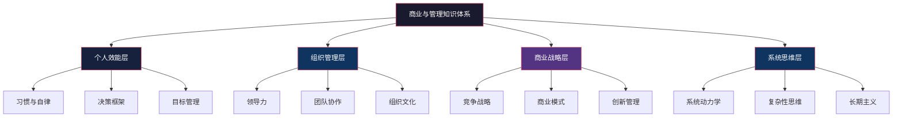
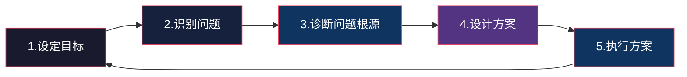
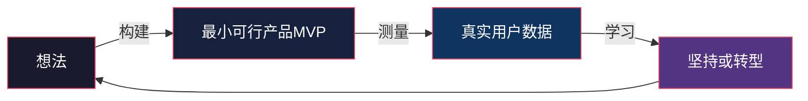
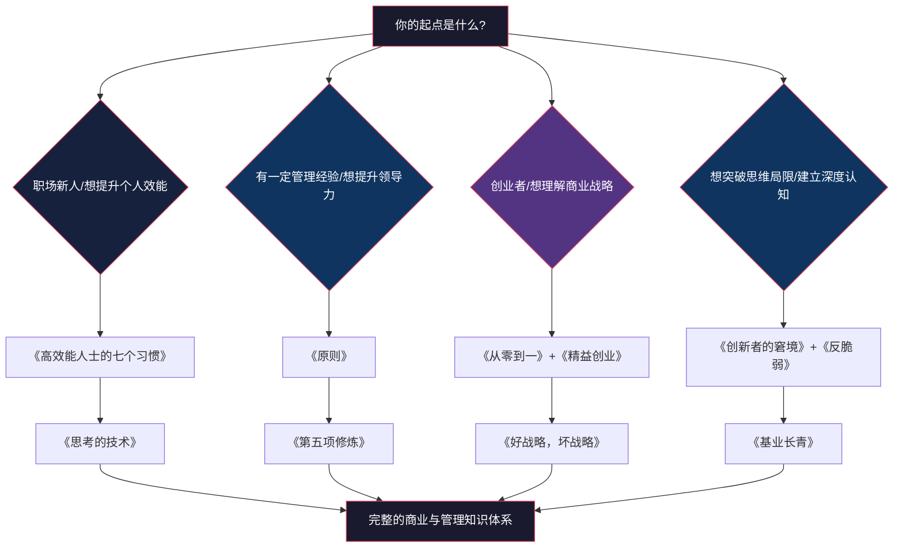

## 四、商业与管理

商业与管理类书籍的价值，远不止于"学会做生意"或"学会管人"。它们的核心功能是帮助你建立**系统性思维框架**——理解一个组织如何运转、一个市场如何演化、一个决策如何产生连锁反应。这种思维框架的应用场景极其广泛：无论你是创业者在做产品决策、中层管理者在协调跨部门资源、还是普通职场人士在规划职业路径，商业与管理思维都能让你看到别人看不到的全局。

### 为什么商业与管理类书籍值得系统阅读

一个常见的认知误区是：商业思维是"做生意的人才需要的"。事实恰恰相反。现代社会的底层逻辑就是商业逻辑——你的薪资由劳动力市场的供需决定、你的职业发展受行业周期影响、你的消费决策被商业模式设计所引导。不理解商业逻辑的人，本质上是在一个自己看不懂的游戏中盲目行动。

商业与管理类知识体系可以分为四个层次：

| 层次 | 核心问题 | 对应能力 |
|------|---------|---------|
| 个人效能 | 如何管理自己？ | 时间管理、习惯养成、目标设定、决策能力 |
| 组织管理 | 如何管理团队？ | 领导力、沟通协调、绩效管理、文化建设 |
| 商业战略 | 如何理解竞争？ | 市场分析、商业模式、创新策略、增长逻辑 |
| 系统思维 | 如何理解复杂系统？ | 反馈回路、非线性效应、涌现现象、长期主义 |

### 入门级

入门级书籍的特点是：**不需要商业背景知识，语言平实，用故事和案例驱动，读完能立刻应用到日常工作和生活中**。适合职场新人、对商业世界感到陌生的读者，或者想从个人效能入手逐步建立商业思维的人。

---

#### 19.《高效能人士的七个习惯》——史蒂芬·柯维

| 维度 | 说明 |
|------|------|
| 推荐指数 | ★★★★★ |
| 难度 | ★★★☆☆ |
| 核心方法论 | 七个习惯：从依赖到独立再到互赖的成长路径 |
| 适合人群 | 所有人，特别是希望提升个人效能的职场新人 |
| 预计阅读时间 | 12-15小时 |
| 豆瓣评分 | 8.2 |

**为什么这本书被称为个人管理领域的"圣经"？**

《高效能人士的七个习惯》自1989年出版以来，全球销量超过4000万册，被翻译成40种语言。这本书之所以经久不衰，不是因为它提供了"速效技巧"，而是因为它建立了一套**以原则为中心**的个人效能体系——柯维认为，真正持久的效能不来自技巧和捷径，而来自与自然法则一致的品格修炼。

**七个习惯的完整解析：**

七个习惯按照"依赖→独立→互赖"的成长路径组织，前三个习惯解决"个人领域的成功"（自我管理），后三个习惯解决"公众领域的成功"（人际关系），第七个习惯是持续更新。

**习惯一：积极主动（Be Proactive）**

核心概念是"关注圈"与"影响圈"的区分。关注圈是你关心但无法控制的事（经济形势、天气、别人的态度），影响圈是你能实际影响的事（你的行为、态度、技能）。高效能人士把精力集中在影响圈——他们不抱怨天气，而是带伞；不抱怨公司制度，而是提升自己的不可替代性。

实操方法：当你发现自己在抱怨或焦虑时，停下来问自己："这件事在我的影响圈内吗？"如果是，列出你能采取的具体行动；如果不是，有意识地把注意力拉回到你能控制的事情上。

**习惯二：以终为始（Begin with the End in Mind）**

核心概念是"个人使命宣言"。柯维要求你想象自己的葬礼——你希望别人怎么评价你的一生？这个思维实验的目的是帮你厘清什么对你真正重要，然后用这个终极目标来指导当下的每一个决策。

实操方法：花一个不受打扰的下午，写下你的个人使命宣言（1-2页）。不需要一次写完——可以先列出对你最重要的5个价值观，然后围绕它们构建使命宣言。每季度回顾一次，看看你的日常行为是否与使命宣言一致。

**习惯三：要事第一（Put First Things First）**

这是时间管理领域最经典的概念之一。柯维用"时间管理矩阵"把所有事情分为四类：

|  | 紧急 | 不紧急 |
|--|------|--------|
| **重要** | 第一象限：危机、截止日期 | 第二象限：预防、规划、学习、关系建设 |
| **不重要** | 第三象限：某些会议、某些电话 | 第四象限：刷手机、闲聊、无意义的忙碌 |

大多数人在第一象限（救火）和第三象限（被别人的紧急事务牵着走）之间疲于奔命。高效能人士的秘诀是**把最多时间花在第二象限**——通过提前规划和预防，减少第一象限的危机；通过果断拒绝，减少第三象限的干扰。

**习惯四：双赢思维（Think Win-Win）**

柯维提出了人际交往的六种模式：赢/输、输/赢、输/输、赢、赢/输、赢/赢。大多数人习惯"赢/输"思维——我的成功建立在你的失败之上。但柯维认为，在大多数长期关系中（职场、家庭、合作），唯一可持续的模式是"赢/赢"——找到双方都满意的方案。

当双赢不可能时，柯维建议选择"不成交"（No Deal）——双方都同意不合作，比一方吃亏要好。

**习惯五：知彼解己（Seek First to Understand, Then to Be Understood）**

这是沟通习惯。柯维认为大多数人倾听的目的不是理解对方，而是准备反驳。他提出了"移情聆听"的概念——不是用自己的经验去解读对方的话，而是真正站在对方的角度去理解他的感受和需要。

实践方法：下次在重要对话中，尝试在回应之前先用自己的话复述对方的观点，直到对方说"对，你理解了我的意思"。这一步看似简单，实际操作中极其困难——因为你的大脑会不断想要打断、反驳、建议。

**习惯六：统合综效（Synergize）**

统合综效的本质是"1+1>2"——通过创造性合作，找到比任何一方单独方案都更好的解决方案。这需要前五个习惯作为基础：你得先有独立思考的能力（习惯1-3），再有与人合作的能力（习惯4-5），才能实现真正的创造性合作。

**习惯七：不断更新（Sharpen the Saw）**

柯维用了一个比喻：一个伐木工人拼命锯树，但锯子已经钝了。有人建议他停下来磨锯子，他说"我没时间，我得锯树"。习惯七就是"磨锯子"——从身体、精神、智力、社会/情感四个维度持续更新自己。

**阅读建议：**

这本书的结构清晰，但篇幅较长（原版约400页）。建议先通读前三章（理解"原则中心"的哲学基础），然后根据你最需要的习惯重点精读。第一章（积极主动）和第三章（要事第一）是最常被引用、也最实用的两个章节。

---

#### 20.《从零到一》——彼得·蒂尔

| 维度 | 说明 |
|------|------|
| 推荐指数 | ★★★★★ |
| 难度 | ★★★☆☆ |
| 核心方法论 | 创造全新价值（从0到1）vs 在已有市场竞争（从1到N） |
| 适合人群 | 创业者、产品经理、对创新感兴趣的人 |
| 预计阅读时间 | 6-8小时 |
| 豆瓣评分 | 7.6 |

**为什么彼得·蒂尔的观点值得重视？**

彼得·蒂尔是PayPal联合创始人、Facebook第一个外部投资人、Palantir联合创始人、Founders Fund创始合伙人。他的投资回报率在硅谷历史上排名前列。更重要的是，他是一个**独立思考者**——他的很多观点与硅谷主流叙事相反，但事后往往被证明是正确的。

**核心思想：从0到1 vs 从1到N**

蒂尔的核心区分是：
- **从0到1（垂直进步）**：创造全新的东西。发明飞机是从0到1——在飞机被发明之前，人类从未飞上天
- **从1到N（水平进步）**：把已有的东西复制到更多地方。造更多的飞机是从1到N

蒂尔认为，真正的创业应该是从0到1——创造一个全新的市场，而不是在已有市场中跟人竞争。从1到N的竞争会把利润压到零（完全竞争），只有从0到1的垄断才能带来超额利润。

**书中关键观点解析：**

**竞争是失败者的游戏**

这个观点违反直觉。蒂尔的逻辑是：在完全竞争市场中，长期利润趋近于零。如果你开了一家和别人一模一样的餐厅，你只能靠价格战生存。但如果你创造了一个全新的品类（比如特斯拉在电动车领域的先发优势），你可以在竞争对手出现之前建立护城河。

这不意味着你要做垄断企业去压榨消费者。蒂尔定义的"垄断"是指"你的产品好到没有直接替代品"——这是创新的自然结果，不是恶意竞争。

**幂次法则（Power Law）**

风险投资行业的核心规律：一个基金的投资组合中，最成功的那一笔投资创造的回报，超过其他所有投资的总和。这个规律也适用于人生选择——你选择进入哪个行业、加入哪家公司、学习哪项技能，这些少数关键决策对人生的影响远大于无数个小决策的总和。

实操启示：不要"分散风险"到无数个平庸的选择上。把最多精力投入到你认为最有潜力的那1-2件事上。

**"你相信什么是大多数人不认同的真相？"**

这是蒂尔面试时最喜欢问的问题。他认为，最有价值的创业机会来自"大多数人认为不可能、但实际上可能"的事情。如果你的创业想法所有人都觉得好，那要么已经有人在做了，要么实际上没那么好。

**这本书的局限性：**

蒂尔的观点带有强烈的幸存者偏差——他是成功者，所以他的策略看起来正确。但对于大多数普通创业者来说，"从0到1"的风险极高。书中对失败案例的分析不足，也缺少实操层面的具体指导。建议结合《精益创业》一起阅读，后者提供了更务实的创业方法论。

---

#### 21.《创新者的窘境》——克莱顿·克里斯坦森

| 维度 | 说明 |
|------|------|
| 推荐指数 | ★★★★★ |
| 难度 | ★★★★★ |
| 核心方法论 | 破坏性创新理论：为什么好的管理实践会导致大公司失败 |
| 适合人群 | 企业管理者、科技行业从业者、关注商业战略的读者 |
| 预计阅读时间 | 15-20小时 |
| 豆瓣评分 | 8.4 |

**为什么这本书改变了商业战略的思维方式？**

克里斯坦森是哈佛商学院教授，他在1997年提出的"破坏性创新"理论，是过去30年最具影响力的商业理论之一。乔布斯、贝佐斯、马斯克都曾引用过他的理论。这本书要回答的核心问题是：**为什么管理最好、最以客户为中心的公司，反而会被新进入的小公司颠覆？**

**破坏性创新的核心逻辑：**

克里斯坦森区分了两种创新：

| 类型 | 持续性创新 | 破坏性创新 |
|------|-----------|-----------|
| 定义 | 在现有性能维度上做得更好 | 用不同的性能维度重新定义市场 |
| 目标客户 | 主流客户（高端市场） | 被忽视的客户（低端市场或新市场） |
| 初始性能 | 高于现有产品 | 低于现有产品（但足够好） |
| 利润率 | 高 | 低 |
| 大公司反应 | 积极跟进 | 忽视或放弃 |

关键洞察：破坏性创新产品在刚出现时，性能往往不如主流产品——所以大公司的管理层看了之后会说"这不是我们的客户想要的"。但破坏性创新产品在其他维度上有优势：更便宜、更简单、更方便、更小。随着时间推移，技术改进会让这些产品在主流性能维度上也变得足够好，同时保持其他优势——此时大公司再想追赶，已经来不及了。

**经典案例解析：**

- **硬盘驱动器行业**：14英寸→8英寸→5.25英寸→3.5英寸。每一次尺寸缩小，都是新公司发起的破坏性创新。大公司每次都看到了新技术，但因为新尺寸硬盘的容量太小，他们的主流客户（大型机制造商）不需要，所以选择忽视。最终新尺寸硬盘的容量追上来，大公司的市场被新公司夺走
- **钢铁行业**：小型轧钢厂最初只能生产最差的钢筋（利润最低的市场），大型综合钢铁厂不屑于竞争这个市场。但小型轧钢厂的技术逐渐提升，从钢筋到角钢到板材，一步步"吃掉"大型厂的市场。大型厂每次都"主动撤退"到更高端的市场，最终被挤出
- **数码相机 vs 胶片相机**：柯达实际上发明了数码相机，但因为数码相机的画质远不如胶片，管理层判断"这不是客户想要的"。后来数码相机的画质追上来了，柯达已经来不及转型

**如何应用破坏性创新理论：**

克里斯坦森在后续著作《创新者的解答》中给出了更实操的建议：

1. **成立独立的小团队**来开发破坏性创新产品——大公司的流程、文化和激励机制天然适合持续性创新，会扼杀破坏性创新
2. **关注"不够好"的市场**——如果某个市场上的客户觉得现有产品"太贵"或"太复杂"，这就是破坏性创新的机会
3. **不要用主流市场的需求来评估破坏性创新产品**——它们的目标客户不同，需求也不同
4. **保持灵活性**——破坏性创新的市场往往和最初预期不同，需要快速迭代和调整方向

**阅读建议：**

原书偏学术，案例集中在硬盘和钢铁行业，阅读体验不算轻松。建议先读前4章（理论框架）和第7章（案例总结），中间的行业案例可以跳读。如果觉得太枯燥，可以先读克里斯坦森后来写的《创新者的解答》或《创新者的基因》，案例更丰富、语言更平实。

---

### 进阶级

进阶级书籍的特点是：**需要一定的商业或管理经验作为基础，提供更深层的原则和方法论，适用于职场进阶和组织管理场景**。这些书不是教你怎么"做事"，而是教你怎么"思考"。

---

#### 22.《原则》——瑞·达利欧

| 维度 | 说明 |
|------|------|
| 推荐指数 | ★★★★★ |
| 难度 | ★★★★☆ |
| 核心方法论 | 将人生和工作经验转化为可执行的原则体系 |
| 适合人群 | 管理者、投资者、希望建立个人决策系统的人 |
| 预计阅读时间 | 15-20小时 |
| 豆瓣评分 | 8.3 |

**为什么达利欧的"原则"值得学习？**

瑞·达利欧是桥水基金（Bridgewater Associates）的创始人，管理着超过1500亿美元的资产，是全球最大的对冲基金。桥水基金的独特之处不仅在于投资业绩，更在于它的工作方式——达利欧把公司运营的每一个环节都转化为明确的、可执行的"原则"，员工依据原则而非直觉来做出决策。

**核心理念解析：**

**极度真实与极度透明**

桥水基金内部实行"极度透明"——几乎所有会议都被录像，任何员工都可以旁听任何会议，包括管理层会议。员工被鼓励对任何人（包括CEO）提出直接的批评和质疑。

达利欧认为，大多数人之所以在工作中隐藏自己的真实想法，是因为害怕冲突和被拒绝。但这种"虚假的和谐"会导致两个严重后果：问题被掩盖直到爆发，决策质量因为缺乏真实反馈而下降。

实践方法：达利洛建议创建一种"棒球卡"式的文化——每个员工都有公开的"能力卡片"，标注他们的强项、弱项和可信度。这听起来很残酷，但达利欧认为，知道彼此的真实评价（即使是负面的），比活在虚假的赞美中要好得多。

**可信度加权决策（Believability-Weighted Decision Making）**

桥水基金不使用"一人一票"的民主决策，也不使用"职位最高的人说了算"的独裁决策。他们使用的是"可信度加权"——在某个领域有更多成功经验和能力的人，其意见被赋予更高的权重。

具体做法：
1. 对于重要决策，召集相关领域的专家
2. 每个人独立给出意见和理由
3. 根据每个人在该领域的过往表现和专业知识，给不同的人分配不同的权重
4. 加权后得出最终决策

这个方法的优势在于：既避免了"一言堂"（领导说了算），也避免了"平均主义"（所有人的意见同等重要）。

**五步流程法**

达利欧把实现任何目标的过程归纳为五步：

关键洞察：大多数人失败在第三步——他们跳过了"诊断问题根源"，直接从"识别问题"跳到"设计方案"。结果就是不断地治标不治本。达利洛建议在诊断阶段至少花和方案设计阶段一样多的时间。

**拥抱失败，系统化学习**

达利欧的人生哲学是"痛苦+反思=进步"。他认为大多数人在失败后会选择逃避（不想再想这件事）或自责（我太差了），这两种反应都不能带来进步。正确的做法是把失败当作学习素材——分析失败的根本原因，把教训转化为原则，然后在未来遇到类似情况时应用这些原则。

桥水基金有一个"问题日志"（Issue Log）系统——任何错误和失败都被记录下来，分析根本原因，转化为改进措施。这个系统运行了几十年，积累了大量的"原则"——这些原则就是公司的核心知识资产。

**这本书的局限性：**

《原则》的内容量很大（原书超过500页），前半部分是达利欧的个人传记，后半部分才是原则体系。很多人读完传记部分后已经失去耐心。建议先读第三部分（工作原则），这是全书精华，生活原则可以在读完工作原则后再看。另外，达利欧的"极度透明"文化在大多数公司难以实施——不要试图照搬桥水的做法，而是理解其背后的原则，然后根据你的具体环境做调整。

---

#### 23.《第五项修炼》——彼得·圣吉

| 维度 | 说明 |
|------|------|
| 推荐指数 | ★★★★☆ |
| 难度 | ★★★★★ |
| 核心方法论 | 五项修炼：系统思考是整合其他四项的核心能力 |
| 适合人群 | 企业高管、组织发展专业人士、对系统思维感兴趣的人 |
| 预计阅读时间 | 15-20小时 |
| 豆瓣评分 | 8.0 |

**什么是"学习型组织"？**

彼得·圣吉是MIT斯隆管理学院的高级讲师，他在1990年出版的《第五项修炼》提出了"学习型组织"的概念——一个能够持续学习、自我更新、适应变化的组织。这个概念在当时极具前瞻性，30多年后的今天依然是组织管理领域的核心议题。

圣吉认为，大多数公司之所以在竞争中失败，不是因为资源不够或人才不足，而是因为**组织的学习能力太差**——它们无法从错误中学习、无法适应快速变化的环境、无法释放员工的集体智慧。

**五项修炼详解：**

| 修炼 | 核心概念 | 为什么重要 |
|------|---------|-----------|
| 自我超越 | 持续学习和自我突破 | 个人成长是组织成长的基础 |
| 心智模式 | 反思和改善我们的思维假设 | 看不见的假设决定了我们能看到什么 |
| 共同愿景 | 建立组织的共同目标和使命感 | 共同愿景驱动真正的投入，而非仅仅是服从 |
| 团队学习 | 通过对话和讨论实现集体智慧 | 团队智商可以远高于个人智商之和 |
| 系统思考 | 看到事物之间的相互关系而非线性因果 | 这是整合前四项的核心能力 |

**第五项修炼——系统思考的深度解析：**

系统思考是这本书最核心的贡献。圣吉认为，大多数人在分析问题时使用的是"线性因果"思维——A导致B，B导致C。但真实世界中的大多数问题是**系统性**的——A导致B，B导致C，C又反过来影响A，形成反馈回路。

**反馈回路的两种类型：**

1. **增强回路（Reinforcing Loop）**：结果强化原因，形成"滚雪球"效应
   - 正面例子：好口碑→更多客户→更多收入→更好的产品→更好的口碑
   - 负面例子：员工流失→工作量增加→员工压力大→更多员工流失

2. **调节回路（Balancing Loop）**：结果抑制原因，形成"恒温器"效应
   - 例子：体温升高→出汗→体温下降；供过于求→价格下降→需求增加→供需平衡

**系统思考的核心法则：**

圣吉提出了11条系统思考法则，其中最关键的是：

- **今日的问题来自昨日的"解决方案"**：很多当下的问题，其实是过去某个"聪明的决定"的副作用。比如：销售下滑→加大促销力度→短期销量回升→客户养成等促销才买的习惯→促销结束后销量更低→需要更大力度的促销
- **越用力推，系统的反弹力越大**：当你的干预措施没有效果时，问题往往不在"力度不够"，而在"你推错了方向"。系统有自己的惯性，硬推只会让反弹更猛
- **渐糟之前先渐好**：很多政策和决策在短期内看起来有效，但长期来看有害。管理层因为看到短期效果而继续加码，直到长期副作用爆发时已经无法挽回
- **因和果在时空中并不紧密相连**：问题的根源可能在很远的地方（空间上）或很久以前（时间上），这使得大多数人看不到真正的因果关系

**啤酒游戏：系统思考的经典实验**

圣吉在MIT的课堂上设计了"啤酒游戏"——模拟一个简单的供应链（零售商→批发商→分销商→工厂），让参与者各自独立做出订购决策。结果，即使每个参与者都做出了"理性"的决策，整个系统也会产生剧烈的波动（牛鞭效应）——下游的一个小需求变化，经过层层放大，到上游会变成巨大的订单波动。

这个游戏揭示了一个深刻的道理：**在复杂系统中，个体的理性行为可能导致集体的非理性结果**。解决方案不是让每个人更努力，而是改变系统结构——比如共享信息、缩短反馈延迟、重新设计激励机制。

**阅读建议：**

这本书的理论深度较高，系统思考的概念需要反复咀嚼。建议先读第1章（概览）和第5章（系统思考），理解核心概念后再读其他章节。如果觉得太抽象，可以先看作者后来写的《第五项修炼·实践篇》，里面有更多实际案例和操作指南。

---

#### 24.《好战略，坏战略》——理查德·鲁梅尔特

| 维度 | 说明 |
|------|------|
| 推荐指数 | ★★★★★ |
| 难度 | ★★★★☆ |
| 核心方法论 | 好战略的核心是"聚焦"——集中资源解决关键问题 |
| 适合人群 | 企业管理者、创业者、需要制定战略的人 |
| 预计阅读时间 | 10-12小时 |
| 豆瓣评分 | 8.0 |

**为什么大多数公司的"战略"是假的？**

鲁梅尔特是UCLA安德森管理学院的战略管理教授，被麦肯锡评为"管理界最有影响力的思想者之一"。他的核心观点极其尖锐：**大多数公司制定的"战略"根本不是战略，而是一堆目标的集合**。

"我们的战略是成为行业领导者""我们的战略是以客户为中心""我们的战略是创新驱动增长"——鲁梅尔特认为这些都是**愿望**，不是战略。真正的战略必须回答一个关键问题：**面对当前的挑战，我们具体应该怎么做？**

**坏战略的四大特征：**

1. **空话**：用高深的词汇掩盖内容的空洞。"我们将利用核心竞争力，通过跨平台协同效应，实现端到端的价值创造"——这句话翻译成人话就是什么都没说
2. **不能直面挑战**：回避真正困难的问题。如果公司面临的主要挑战是产品竞争力下降，战略中却大谈"品牌升级"和"数字化转型"，那就是在回避问题
3. **把目标当战略**：设定目标（"增长20%""成为第一"）不是战略。战略是"如何"实现这些目标的具体路径
4. **糟糕的战略目标**：列出一堆互相矛盾或无法同时实现的目标。真正的战略要求你做出选择——做什么和不做什么

**好战略的核心要素：**

1. **诊断（Diagnosis）**：准确理解当前面临的核心挑战。这一步看似简单，实际上大多数公司做不好——它们要么对问题的诊断过于肤浅，要么根本不愿意面对真正的问题
2. **指导方针（Guiding Policy）**：为应对诊断出的挑战而设计的总体方法。指导方针不是具体行动，而是一个"过滤器"——帮你判断哪些行动值得做、哪些应该放弃
3. **连贯的行动（Coherent Actions）**：一系列相互配合、相互强化的具体行动。"连贯"是关键词——每一个行动都应该支持同一个指导方针，而不是各自为政

**杠杆作用——好战略的秘密武器**

鲁梅尔特特别强调"杠杆作用"——好战略不是把资源均匀分配到所有领域，而是找到能产生最大效果的关键点，然后集中资源在这个点上实现突破。

案例：2003年，三星面临一个战略选择——是继续做低端手机的代工（利润微薄），还是投入巨资建立自己的品牌和技术。三星选择了后者，把资源集中在智能手机和半导体两个领域，放弃了其他不具竞争力的业务。这个"聚焦"战略让三星从一个韩国代工厂变成了全球科技巨头。

**阅读建议：**

这本书用大量真实案例来说明好战略和坏战略的区别——从沃尔玛的低成本战略到星巴克的体验战略，从美国登月计划到伊拉克战争的反叛乱战略。案例部分比理论部分更精彩，建议通读全书。特别推荐第5章（杠杆作用）和第9章（好战略的力量）。

---

### 高阶级

高阶级书籍的特点是：**理论深度更强，挑战常规认知，需要较强的抽象思维能力，适合已经具备商业管理基础、想要突破思维局限的读者**。

---

#### 25.《基业长青》——吉姆·柯林斯、杰里·波拉斯

| 维度 | 说明 |
|------|------|
| 推荐指数 | ★★★★★ |
| 难度 | ★★★★☆ |
| 核心方法论 | 高瞻远瞩公司的共同特质：保存核心+刺激进步 |
| 适合人群 | 企业创始人、高管、对长期主义感兴趣的人 |
| 预计阅读时间 | 12-15小时 |
| 豆瓣评分 | 8.1 |

**这本书回答了什么问题？**

柯林斯和波拉斯花了6年时间研究18家"高瞻远瞩公司"（visionary companies）——这些公司平均创立于1897年，在100多年的时间里持续保持行业领先地位。作为对照，他们选取了18家同样优秀但未能保持长期领先的公司。通过对比分析，他们试图回答：**是什么让一些公司能够跨越多个时代、经历多代领导人、穿越多次危机而持续繁荣？**

**核心发现：造钟，而不是报时**

这是全书最重要的比喻：

- **报时**（Telling Time）：一个有远见的领导者带领公司取得成功——这依赖于个人的能力和魅力
- **造钟**（Building a Clock）：建立一套能够持续产生卓越领导力和卓越绩效的系统——这不依赖于任何个人

高瞻远瞩公司的创始人不是"报时人"，而是"造钟人"。他们关注的不是"我怎么让公司成功"，而是"我怎么建立一个即使没有我也能持续成功的组织"。

对比案例：华特·迪士尼（造钟）vs 哈利·科恩（报时）。迪士尼创造了米老鼠和迪士尼乐园，但他更重要的贡献是建立了一套"创造极致体验"的文化和制度，让迪士尼在创始人去世后几十年依然保持创造力。哥伦比亚电影公司的科恩是一个天才管理者，但他没有建立起超越自己的制度，他去世后公司迅速衰落。

**核心理念：保存核心+刺激进步**

|  | 高瞻远瞩公司 | 对照公司 |
|--|------------|---------|
| 核心理念 | 保持不变（价值观和使命感） | 频繁改变（追随市场热点） |
| 具体做法 | 持续变化（策略、产品、组织结构） | 保守僵化或盲目变革 |
| 激励机制 | 既有核心认同，又有进步驱动 | 只有其中一个 |

高瞻远瞩公司有"核心意识形态"——一组不随时间改变的核心价值观和使命感。这个核心是不可谈判的。但在此之外，它们在具体做法上极其灵活——产品可以变、战略可以变、组织结构可以变，唯一不变的是核心价值观。

案例：3M的核心理念是"鼓励创新和实验"。具体产品从砂纸到便利贴到医疗敷料，不断变化，但"15%时间法则"（员工可以用15%的工作时间做自己感兴趣的项目）这个鼓励创新的制度几十年不变。

**胆大包天的目标（BHAGs）**

高瞻远瞩公司善于设定看似不可能的目标——这些目标被柯林斯称为"BHAGs"（Big Hairy Audacious Goals）。BHAGs的作用不是精确规划未来，而是激发组织的能量和创造力。

经典BHAGs案例：
- 波音在1950年代决定建造747——当时整个航空业都不确定大型喷气式客机是否有市场
- 肯尼迪宣布"十年内把人送上月球"——当时NASA连把人送入轨道的技术都不成熟
- 沃尔玛在1990年设定目标"到2000年成为1250亿美元的公司"——当时年收入只有16亿美元

**这本书的争议：**

《基业长青》出版后，有学者指出书中的一些"高瞻远瞩公司"后来表现不佳（如摩托罗拉、索尼）。柯林斯后来在《从优秀到卓越》中回应了这个质疑——他认为"基业长青"的不是公司，而是"原则"。即使个别公司后来衰落了，它们在鼎盛时期展现出来的管理原则依然成立。

---

#### 26.《反脆弱》——纳西姆·塔勒布

| 维度 | 说明 |
|------|------|
| 推荐指数 | ★★★★★ |
| 难度 | ★★★★★ |
| 核心方法论 | 从不确定性和波动中获益的系统设计原则 |
| 适合人群 | 企业管理者、投资者、对风险管理感兴趣的人 |
| 预计阅读时间 | 15-20小时 |
| 豆瓣评分 | 8.0 |

**为什么"反脆弱"是一个改变思维方式的概念？**

塔勒布是期权交易员出身的哲学家和风险学者，他因2007年成功预测金融危机而闻名。在《黑天鹅》中他提出了"黑天鹅事件"（不可预测的重大事件）的概念，而《反脆弱》是续集——它要回答的问题是：**既然我们无法预测黑天鹅事件，我们该如何设计系统，使之在面对不可预测的冲击时不仅不受损，反而获益？**

**三个核心概念：**

| 状态 | 定义 | 例子 |
|------|------|------|
| 脆弱（Fragile） | 遭受冲击时受损 | 精致的瓷器、过度杠杆化的银行 |
| 坚韧（Robust） | 遭受冲击时不受影响 | 保险箱、分散投资的组合 |
| 反脆弱（Antifragile） | 遭受冲击时获益 | 人体免疫系统、进化、创业生态 |

关键洞察：大多数人追求的是"坚韧"——保护自己不受伤害。但塔勒布认为，真正智慧的策略是"反脆弱"——设计一个系统，让自己在冲击和波动中获益。

**如何实现反脆弱：**

1. **杠铃策略（Barbell Strategy）**：把90%的资源放在极度安全的地方，10%放在极度冒险的地方，不要放在"中间地带"
   - 投资例子：90%放在国债（极度安全），10%放在高风险投机（极度冒险）。中间那些"看起来安全但实际上不安全"的资产（如评级AAA的次级抵押贷款债券）才是最危险的
   - 职业例子：保留一份稳定的工作（安全端），同时在业余时间做一些高风险高回报的探索（冒险端）。不要辞职去做"中等风险"的创业

2. **保留选择权（Optionality）**：拥有"做了不亏，不做也没损失"的选择权
   - 创投基金的逻辑：投10家公司，9家失败（损失有限），1家成为独角兽（收益无限）。关键在于每一笔投资的损失是封顶的，但收益是没有上限的
   - 人生应用：多学技能、多建关系、多做尝试——每一个尝试的成本很低，但其中任何一个都可能带来巨大回报

3. **小剂量的压力源（Via Negativa）**：通过小的、可控的压力来增强系统的韧性
   - 健身就是反脆弱的：你给肌肉施加压力，肌肉在恢复过程中变得更强壮
   - 禁食、冷水浴、高强度间歇训练——这些都是"小剂量压力源"
   - 管理应用：让团队面对小的危机和挑战，比在温室中保护他们更能培养团队的战斗力

**对商业管理的启示：**

- **不要追求效率最大化**：效率最大化意味着消除所有冗余——但在面对不可预测的冲击时，冗余恰恰是生存的保障。多一条供应链、多一个备选方案、多一些现金储备，这些"低效"的东西在危机时刻会救你一命
- **大公司应该鼓励内部竞争**：让多个团队同时尝试不同的方向，而不是统一规划一条路线。这样即使大部分尝试失败了，成功的一个就能弥补所有损失
- **不要用"预测"来管理风险**：与其花大量资源去预测"什么会出问题"，不如设计一个无论什么出了问题都能存活甚至获益的系统

**阅读建议：**

塔勒布的写作风格独特——他喜欢旁征博引、夹叙夹议，经常从古希腊哲学跳到期权定价再跳到医学研究。这种风格让一些读者觉得"散"，但核心论点是清晰的。建议先读第1-3章（概念框架）和第18-20章（杠铃策略的实践应用），中间的历史和哲学部分可以根据兴趣选择性阅读。

---

#### 27.《精益创业》——埃里克·莱斯

| 维度 | 说明 |
|------|------|
| 推荐指数 | ★★★★★ |
| 难度 | ★★★☆☆ |
| 核心方法论 | 构建-测量-学习循环：用最小成本验证商业假设 |
| 适合人群 | 创业者、产品经理、创新项目的负责人 |
| 预计阅读时间 | 8-10小时 |
| 豆瓣评分 | 8.2 |

**为什么创业者需要"精益"方法？**

莱斯是硅谷连续创业者，他从丰田精益生产方式和敏捷软件开发中汲取灵感，提出了"精益创业"方法论。他的核心观点是：**创业最大的浪费不是花多了钱，而是做了一个没人要的产品**。传统的商业计划模式（写计划书→融资→花两年开发产品→推向市场→发现没人要）的失败率极高，精益创业用"快速实验"替代了"长期规划"。

**构建-测量-学习循环（Build-Measure-Learn）**

1. **构建（Build）**：把想法转化为"最小可行产品"（MVP）——一个刚好能测试核心假设的产品版本
2. **测量（Measure）**：让真实用户使用MVP，收集行为数据（不是问卷调查——用户说的和做的往往不同）
3. **学习（Learn）**：根据数据做出判断——是继续沿着当前方向（坚持），还是改变方向（转型）

这个循环的关键是**速度**——每个循环越快越好。一个2周的循环比一个2年的循环好得多，因为你能在同样时间内学到20倍的东西。

**最小可行产品（MVP）不是"烂产品"**

很多人误以为MVP就是一个很粗糙的产品。莱斯的定义是：**MVP是能让你开始"构建-测量-学习"循环的最小产品版本**。它的目的不是"让客户满意"，而是"验证假设"。

MVP的常见形式：
- **视频MVP**：Dropbox在产品还没开发完时，发布了一个演示视频来展示功能。视频一夜之间获得了75000人注册——验证了"人们确实需要无缝同步文件"这个假设
- **贵宾式MVP**：Zappos创始人最初在鞋店拍照，然后放到网站上。有人下单后，他亲自去鞋店买鞋然后寄出。这种"手动版"的做法验证了"人们愿意在网上买鞋"这个假设
- **登录页MVP**：做一个产品介绍页面，看有多少人点击"注册"或"购买"。如果没人感兴趣，就不值得开发完整产品

**转型（Pivot）的艺术**

转型不是"失败"，而是"根据新信息调整方向"。莱斯列出了10种常见的转型类型：

| 转型类型 | 说明 | 案例 |
|---------|------|------|
| 放大/缩小转型 | 聚焦于原产品的一个功能，或把功能扩展成平台 | Instagram从签到应用转型为照片分享 |
| 客户细分转型 | 发现真正需要产品的是另一群人 | 聊天工具的用户主要是企业而非个人 |
| 需求转型 | 发现客户有另一个更紧迫的需求 | YouTube从约会网站转型为视频分享 |
| 平台转型 | 从单一应用变为平台，或反过来 | Shopify从在线商店变为电商平台 |
| 商业模式转型 | 改变盈利方式 | 从一次性收费变为订阅制 |

**经证实的认知（Validated Learning）**

莱斯认为，创业的真正进展不是"写了多少代码""签了多少客户"，而是"学到了多少经证实的认知"——通过实验验证了什么假设、推翻了什么假设。这种思维方式的转变至关重要：它让你用"学习"而非"产出"来衡量进展，从而避免"忙碌但无效"的陷阱。

**阅读建议：**

这本书写得很流畅，案例丰富，适合作为创业入门读物。建议与《从零到一》对照阅读——蒂尔强调"大胆愿景"，莱斯强调"快速验证"，两者看似矛盾但其实互补：你需要一个大胆的愿景来指引方向，同时用精益方法来逐步验证和实现这个愿景。

---

#### 28.《思考的技术》——大前研一

| 维度 | 说明 |
|------|------|
| 推荐指数 | ★★★★☆ |
| 难度 | ★★★☆☆ |
| 核心方法论 | 麦肯锡式的逻辑思考与问题解决方法 |
| 适合人群 | 职场人士、咨询行业从业者、需要提升分析能力的人 |
| 预计阅读时间 | 6-8小时 |
| 豆瓣评分 | 7.5 |

**为什么推荐大前研一？**

大前研一是亚洲最知名的管理咨询师之一，曾在麦肯锡日本担任负责人。他的书的特点是**用东方读者熟悉的方式讲解西方管理思维**，语言直白、案例贴近亚洲商业环境。《思考的技术》不是教你具体的知识，而是教你**如何思考**——如何面对复杂问题时快速找到核心、如何用数据而非直觉来支撑决策、如何用假设驱动的方式来解决问题。

**核心方法论：假设→验证→结论**

大前研一认为，大多数人思考问题的方式是"收集信息→得出结论"。但高效的思考方式是"提出假设→验证假设→修正假设→得出结论"。

区别在于：前者是"信息驱动"的——你需要穷尽所有信息才能得出结论，这在信息爆炸的时代几乎不可能；后者是"假设驱动"的——你先根据有限信息提出一个最可能的假设，然后有针对性地去验证它，这大幅提升了思考效率。

实践步骤：
1. **定义问题**：把模糊的问题转化为具体的、可回答的问题
2. **分解问题**：用MECE原则（相互独立、完全穷尽）把大问题分解为小问题
3. **提出假设**：对每个小问题提出最可能的答案
4. **设计验证**：用最小成本设计实验来验证假设
5. **修正结论**：根据验证结果修正假设，迭代直到得出可靠结论

**"实地调研"的重要性**

大前研一反复强调：不要坐在办公室里想答案，去现场。他举了一个例子：一家连锁餐厅的业绩下滑，管理层在办公室里分析了各种数据和报表，得出了"需要更新菜单"的结论。大前研一去了几家门店实地观察，发现问题出在服务员的态度——客户流失不是因为菜品不好，而是因为用餐体验差。

这个例子说明一个道理：**数据告诉你"发生了什么"，但只有实地调研才能告诉你"为什么发生"**。

**阅读建议：**

这本书篇幅不长，语言轻松，适合作为"思考方法论"的入门读物。如果你已经读过《金字塔原理》和《学会提问》，这本书的很多内容会比较熟悉——它可以作为复习和巩固。特别推荐第2章（逻辑思考的训练方法）和第5章（非线性思考的案例）。

---

### 商业与管理知识进阶路线图

根据你的当前水平和需求，选择不同的阅读路线：

### 主题交叉索引

这些书之间有很多关联和对照，以下是推荐的配对阅读方案：

| 配对 | 互补关系 |
|------|---------|
| 《从零到一》+《精益创业》 | 前者强调大胆愿景，后者强调快速验证——梦想与执行的平衡 |
| 《创新者的窘境》+《好战略，坏战略》 | 前者解释大公司为何失败，后者教你如何制定好战略来避免失败 |
| 《原则》+《高效能人士的七个习惯》 | 两者都关注个人效能和原则体系，但视角不同——前者更偏投资和管理，后者更偏人生哲学 |
| 《第五项修炼》+《反脆弱》 | 前者教你理解系统，后者教你设计反脆弱的系统 |
| 《基业长青》+《创新者的窘境》 | 前者研究成功，后者研究失败——对照阅读能获得更完整的商业图景 |

### 常见误区

在阅读和应用商业与管理类书籍时，以下是最常见的错误：

**误区一：把"原则"当"规则"使用**

达利欧的"极度透明"在桥水基金有效，不代表在你的公司也有效。柯林斯研究的是大型上市公司，不代表他的所有结论都适用于初创企业。原则需要根据你的具体环境做调整——理解原则背后的"为什么"，比记住"怎么做"更重要。

**误区二：只读不练，纸上谈兵**

商业与管理类知识的最大陷阱是"读的时候觉得都对，读完之后什么都没变"。解决方法是：每读完一本书，立即选择一个最想应用的原则，在接下来的一周里刻意练习。比如读完《高效能人士的七个习惯》，先从"要事第一"开始——每天早上花10分钟规划今天的"第二象限"活动。

**误区三：过度依赖单一框架**

《金字塔原理》教你结构化思考，《创新者的窘境》教你理解颠覆，但现实问题往往不能用单一框架解决。真正的商业智慧在于：知道什么时候用什么框架，以及如何把多个框架整合在一起。

**误区四：忽视"中国语境"**

这些书大多是西方商业环境下的产物。中国市场的竞争格局、商业文化、监管环境与西方有显著差异。在应用这些理论时，始终要考虑：这个结论在中国市场是否成立？需要做哪些调整？
