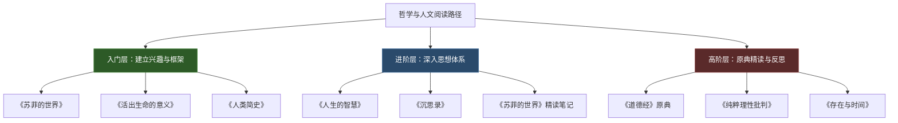
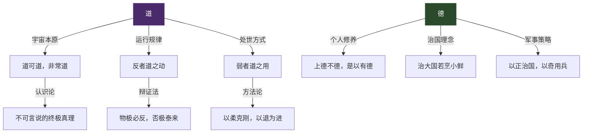
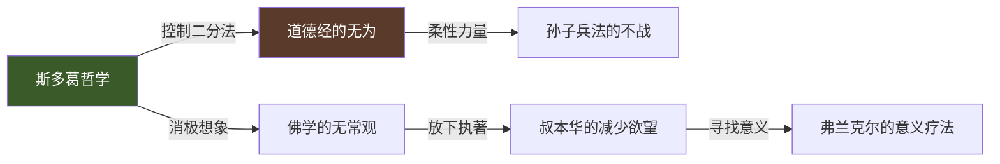

## 五、哲学与人文

哲学和人文类阅读的价值，远不止"陶冶情操"四个字。它们帮助你建立一套理解世界的底层框架——当你面对人生重大抉择、职场伦理困境、社会现象困惑时，这套框架决定了你思考的深度和判断的质量。查理·芒格说过："我这辈子遇到的聪明人，没有不每天阅读的——没有，一个都没有。而他们读的书里，哲学和历史类占了相当大的比重。"

本节推荐的书籍按难度分为三个层级，从通俗读物到原典注疏，覆盖西方哲学、东方智慧、存在主义、斯多葛学派和宏观历史叙事。每本书不仅介绍"是什么"，更告诉你"怎么读"和"读完后怎么用"。

### 阅读路径总览

### 入门层：建立兴趣与框架

入门阶段的目标不是掌握某个哲学体系，而是激发对"大问题"的好奇心，同时建立一个粗线条的思想地图。以下三本书可读性极强，不需要任何哲学基础。

---

#### 24.《苏菲的世界》——乔斯坦·贾德

- **推荐指数**：★★★★★
- **难度**：★★★☆☆
- **字数**：约25万字
- **阅读时间**：15-20小时

**内容定位**

这是一本以悬疑小说形式写成的西方哲学通史。14岁少女苏菲收到一封神秘来信："你是谁？"从此踏上了从苏格拉底到萨特的哲学之旅。贾德用巧妙的叙事结构——书中书、意识嵌套——把2500年的哲学史串成了一条故事线。

**为什么它是哲学入门的首选**

市面上的哲学入门书很多，但大多犯两个毛病：要么太学术（像罗素《西方哲学史》对新手不友好），要么太浅（只讲结论不讲思辨过程）。《苏菲的世界》的独特之处在于：

1. **用故事驱动思考**：你不是在"学习哲学"，而是在跟随苏菲一起思考"我是谁""世界从哪里来""什么是善"这些问题。这种代入感让抽象概念变得具体。
2. **覆盖完整的西方哲学脉络**：从古希腊自然哲学（泰勒斯、赫拉克利特）→古典哲学（苏格拉底、柏拉图、亚里士多德）→中世纪经院哲学→近代经验主义与理性主义→德国古典哲学→存在主义与现代哲学，一条线串下来。
3. **叙事结构本身就是哲学隐喻**：苏菲发现自己是书中人物这一设定，直接呼应了柏拉图的"洞穴寓言"和笛卡尔的"我思故我在"——形式与内容高度统一。

**核心收获**

| 哲学阶段 | 代表人物 | 核心问题 | 对日常生活的启发 |
|---------|---------|---------|----------------|
| 古希腊自然哲学 | 泰勒斯、赫拉克利特 | 世界的本原是什么？ | 培养追问本质的习惯 |
| 古典哲学 | 苏格拉底、柏拉图 | 什么是真理？什么是正义？ | 区分意见与知识 |
| 近代经验主义 | 洛克、休谟 | 知识从何而来？ | 警惕经验的局限性 |
| 德国古典哲学 | 康德、黑格尔 | 理性的边界在哪里？ | 理解人类认知的结构性 |
| 存在主义 | 萨特、加缪 | 人生有什么意义？ | 自由选择与承担责任 |

**怎么读**

- **第一遍**：当小说读，享受故事，不必强记哲学家名字和概念。
- **第二遍**：整理思维导图，按时间线列出每位哲学家的核心观点和代表作。
- **配合使用**：准备一本笔记本，每读完一章写下"这个哲学家的观点对我的生活有什么启发"。这种"从抽象到具体"的转化练习，是哲学阅读最关键的技能。

**常见误区**

- ❌ "读完这本就算懂哲学了"——这本书只是地图，不是目的地。它给你的是线索和兴趣，真正的理解需要后续深入原典。
- ❌ "记住哲学家的生卒年月和著作列表"——哲学不是知识点竞赛，重要的是理解每个思想家试图回答的问题和他们的推理过程。

---

#### 26.《活出生命的意义》——维克多·弗兰克尔

- **推荐指数**：★★★★★
- **难度**：★★☆☆☆
- **字数**：约10万字
- **阅读时间**：5-8小时

**内容定位**

这本书分为两部分：前半部分是弗兰克尔在纳粹集中营（包括奥斯维辛）的亲身经历，后半部分阐述他创立的"意义疗法"（Logotherapy）。它不是一本"心灵鸡汤"——弗兰克尔是维也纳大学的精神病学教授，他的观察带着临床医生的冷静和幸存者的真实。

**为什么它排在入门层**

难度低但冲击力强。没有哲学专业术语，用亲身经历和临床案例说话。任何人在任何阶段读这本书都会获得启发，尤其在遭遇挫折或迷茫时期，它可能成为改变你人生观的转折点。

**意义疗法的三个核心支柱**

1. **意义意志（Will to Meaning）**：人最基本的驱动力不是弗洛伊德说的"快乐原则"，也不是阿德勒说的"权力意志"，而是寻找生命意义的意志。那些在集中营中活下来的人，往往不是身体最强壮的，而是心中有"未完成之事"的人——一本书要写完、一个亲人要重逢、一项使命要达成。

2. **生命的意义是具体的**：不存在抽象的"人生意义"，每个人在每个具体时刻面对的意义都不同。弗兰克尔提出三种发现意义的途径：
   - **创造性价值**：通过工作或创造给予世界某些东西
   - **体验性价值**：通过体验某些事物（自然、艺术、爱）从世界获取某些东西
   - **态度性价值**：当面对不可改变的苦难时，通过选择自己的态度来实现意义

3. **自我超越**：人只有在超越自我时才能真正实现自我。一个只关注自己的人反而最容易迷失；当你的注意力转向某个事业、某个人、某个使命时，你才真正"找到自己"。

**集中营观察中的关键洞察**

弗兰克尔观察到一个反复出现的现象：

> "那些知道自己还有某项使命有待完成的人最有可能存活下来。"

这不是鸡汤式的感悟，而是基于对数千名囚犯的临床观察。他区分了三种囚犯反应模式：

| 类型 | 心理状态 | 结果 |
|------|---------|------|
| 放弃型 | "这一切毫无意义" | 最先衰亡 |
| 麻木型 | 关闭情感，机械生存 | 可以存活但精神受损 |
| 意义型 | "我还有事要做" | 最高存活率 |

**怎么读**

- 这本书很薄，建议一口气读完前半部分（集中营经历），让自己完全沉浸。
- 读完后花30分钟写下自己的"意义清单"：此刻对你最重要的三件事是什么？如果只能保留一个，你会选哪个？
- 如果正处于人生低谷，这本书的疗愈效果比任何心理安慰都强——因为它不回避苦难，而是在苦难中找到了尊严。

---

#### 27.《人类简史》——尤瓦尔·赫拉利

- **推荐指数**：★★★★★
- **难度**：★★★☆☆
- **字数**：约25万字
- **阅读时间**：12-15小时

**内容定位**

以色列历史学家赫拉利用400页讲述了人类从7万年前非洲的一种普通猿类，如何成为地球主宰的故事。这不是传统的历史书——它不按朝代更替编年，而是用"认知革命""农业革命""科学革命"三个转折点来划分人类进程，每个转折都伴随着一个颠覆性的核心论点。

**三大革命的核心论点**

**认知革命（约7万年前）**：智人之所以击败尼安德特人等其他人种，不是因为更强壮或更聪明，而是因为我们发展出了一种独特能力——**虚构故事**。国家、宗教、货币、公司……这些都是人类集体想象的产物。正是因为我们可以相信同一个虚构故事，数百万陌生人才能协作。

**农业革命（约1.2万年前）**：赫拉利称之为"史上最大的骗局"。不是人类驯化了小麦，而是小麦驯化了人类。农业让人口暴增，但个体的生活质量（营养、休闲时间、健康）反而下降了。这个论点极具冲击力——它挑战了"进步必然带来幸福"的默认假设。

**科学革命（约500年前）**：现代科学的核心不是"发现了什么"，而是"承认了无知"。在此之前，人类认为所有重要的知识已经被圣人和经典记录完毕；科学革命的起点是承认"我们不知道"，然后用实验和数学去探索。

**它对哲学阅读的价值**

这本书提供了一个"上帝视角"——当你站在7万年的尺度上看人类文明，很多你觉得天经地义的东西（婚姻制度、私有财产、民族国家）都变成了可以被质疑的"虚构"。这种视角转换能力，是哲学思考的基础。

**怎么读**

- 第一遍通读，重点理解三个革命的核心论点。
- 第二遍带着批判眼光读：赫拉利的论点哪些有充分证据支撑，哪些是过度简化？（例如"农业革命是骗局"这个观点忽略了农业带来的文化和技术积累。）
- 配合阅读：戴蒙德《枪炮、病菌与钢铁》提供地理环境视角的互补解释；弗格森《文明》提供更聚焦西方崛起的分析。

---

### 进阶层：深入思想体系

进阶阶段的目标是深入了解某个具体的哲学传统，掌握其核心概念和思维工具，并开始将其应用于日常决策和自我管理。

---

#### 25.《人生的智慧》——叔本华

- **推荐指数**：★★★★★
- **难度**：★★★☆☆
- **字数**：约15万字
- **阅读时间**：8-12小时

**内容定位**

这本书是叔本华晚年作品《附录与补遗》中最受欢迎的部分，也是他所有著作中最通俗易懂的一本。不同于《作为意志和表象的世界》的艰深体系，这本书直接讨论人如何获得幸福——幸福来自哪里？如何处理财富、名誉、健康？如何面对他人？独处为什么重要？

**叔本华的幸福观：做减法**

叔本华的幸福哲学可以用一个公式概括：

> **幸福 = 减少痛苦，而非追求快乐**

他认为人追求快乐的努力往往适得其反——你越追逐快乐，快乐越像手中的沙子流走。真正的智慧是识别并消除那些造成痛苦的来源：不必要的欲望、无意义的社交、对他人评价的过度在意。

**核心观点拆解**

1. **人的自身比外在拥有更重要**：健康、性格、智力、气质这些"你是谁"的东西，远比财富、地位、名声这些"你拥有什么"更能决定幸福。一个性格开朗的穷人，往往比一个焦虑的富人更幸福。

2. **独处是高级能力**：一个人能够忍受独处，是精神丰富的标志。叔本华有一句名言："人们聚在一起是为了取暖（抵御无聊），但火焰越大，烟雾也越大。"社交的本质往往是逃避内心的空虚。

3. **名誉是别人的幻象**：你无法控制别人怎么看你，为别人的评价而活是把自己幸福的钥匙交到别人手里。

4. **财富是消极的**：财富能消除贫困带来的痛苦，但不能带来积极的幸福。超过一定阈值后，财富的增加对幸福感几乎无贡献——这个观点在200年后被现代积极心理学的研究所证实。

**适用场景**

- 你正在纠结要不要为了更高的薪水换一份不喜欢的工作
- 你在人际关系中感到疲惫，想知道独处是否正常
- 你总觉得"等我达到某个目标就会幸福"，但达到后依然不满足

**与现代心理学的呼应**

叔本华在19世纪提出的很多观点，被20-21世纪的心理学研究反复验证：

| 叔本华观点 | 现代心理学对应 | 关键研究 |
|-----------|--------------|---------|
| 外在拥有不如人的自身重要 | 人格特质是幸福感最强预测因子 | DeNeve & Cooper (1998) |
| 财富超过阈值后不再增加幸福 | Easterlin悖论 | Easterlin (1974) |
| 独处是精神丰富的标志 | 高质量独处促进创造力和自我觉察 | Long & Averill (2003) |
| 减少痛苦比追求快乐更有效 | 消极偏见与损失厌恶 | Kahneman & Tversky (1979) |

---

#### 28.《沉思录》——马可·奥勒留

- **推荐指数**：★★★★★
- **难度**：★★★☆☆
- **字数**：约12万字
- **阅读时间**：不需要从头读到尾，适合反复翻阅

**内容定位**

马可·奥勒留是罗马帝国"五贤帝"中的最后一位，也是人类历史上权力最大的哲学家。《沉思录》是他在军营和宫殿中写给自己的私人笔记——不是为了出版，而是为了提醒自己践行斯多葛哲学的原则。正因为是私人写作，它的真诚和力量远超那些"为了教导别人"的哲学著作。

**斯多葛哲学的核心工具箱**

斯多葛哲学之所以在硅谷和华尔街如此流行（很多CEO把《沉思录》列为必读书），是因为它提供了一套极其实用的心理操作系统：

**1. 控制二分法（Dichotomy of Control）**

这是斯多葛哲学最核心的工具：把生活中的所有事情分为两类——"你能控制的"和"你不能控制的"。你的判断、选择、态度属于前者；天气、他人的行为、你的出身属于后者。把全部精力投入到你能控制的事情上，对不能控制的事情坦然接受。

这不是消极的宿命论，而是一种战略性的注意力分配。一个CEO无法控制市场行情，但可以控制自己的产品质量和团队管理。

**2. 消极想象（Premeditatio Malorum）**

每天花几分钟想象最坏的情况会发生什么：失去工作、失去健康、失去亲人。这不是自虐，而是两个目的：
- **降低焦虑**：当你反复面对恐惧，恐惧就失去了力量
- **增强感恩**：当你想到可能失去的东西，你才真正珍惜现在拥有的

**3. 客观描述（Objective Representation）**

用中性的语言描述发生的事，去掉情绪化的标签。不是"这个蠢货毁了我的项目"，而是"某人做了某个行为，导致了某个结果"。这种认知重评技术（Cognitive Reappraisal）是现代认知行为疗法的核心技术，而斯多葛哲学家在2000年前就已经在实践了。

**为什么它是"操作系统级"的书**

大多数书教你一个技能或一套知识，《沉思录》教你一种**对待一切事物的态度**。它不是用来"读完"的，而是用来"践行"的。硅谷流行的做法是：

- 每天早上随机翻开一页，读一段，作为当天的心理锚点
- 遇到困难决策时，问自己"马可·奥勒留会怎么看这件事"
- 睡前复盘当天，用斯多葛框架审视自己的反应

**推荐译本**

| 译本 | 特点 | 适合人群 |
|------|------|---------|
| 何怀宏译本（中央编译出版社） | 语言典雅，注释详尽 | 喜欢文学性的读者 |
| 梁实秋译本 | 简洁流畅 | 追求可读性的读者 |
| Gregory Hays英译本 | 现代英语，直白有力 | 英文阅读者首选 |

---

### 高阶层：原典精读与哲学实践

高阶阶段面向对哲学有浓厚兴趣的读者。目标是直接接触东方哲学原典，并将其转化为可操作的思维框架和决策原则。

---

#### 29.《道德经》——老子

- **推荐指数**：★★★★★
- **难度**：★★★★☆
- **字数**：约5000字（原文），配合注释版约15-20万字
- **阅读时间**：原文可1小时读完，但值得用一生反复品味

**内容定位**

《道德经》仅五千言，却是中国哲学史上影响最深远的文本——没有之一。它对东亚文化圈（中国、日本、韩国、越南）的影响，堪比《圣经》之于西方。全文81章，分为"道经"（1-37章，讲宇宙本体论）和"德经"（38-81章，讲人事应用论），涵盖了宇宙观、认识论、政治哲学、军事策略和人生智慧。

**为什么它难度高但值得读**

《道德经》的难度不在于篇幅（它比大多数博客文章都短），而在于：
1. **文言文的多义性**：每个字都可能有多种理解，断句不同意义就不同
2. **悖论式表达**："大智若愚""大巧若拙""知者不言，言者不知"——用否定句表达肯定
3. **体悟型知识**：不是逻辑推演，而是需要生活经验去"印证"

但正是这种特质让它超越了时代——2500年前的文字，在AI时代依然能提供独特的视角。

**核心概念图解**

**六大核心思想的现代解读**

**1. 道法自然——顺其规律而非强力干预**

> "人法地，地法天，天法道，道法自然。"（第25章）

这里的"自然"不是大自然，而是"自己如此"——事物本来的样子。老子主张最好的管理不是"控制一切"，而是创造条件让事物自行运转。现代管理学中"自组织团队""敏捷开发"的思想，与"无为而治"惊人地相似。

**2. 上善若水——柔性力量的智慧**

> "天下莫柔弱于水，而攻坚强者莫之能胜。"（第78章）

水的三个特质值得学习：**向下**（谦卑不争）、**适应**（随容器改变形状）、**坚持**（水滴石穿）。在竞争策略中，这意味着不正面硬刚强者，而是找到差异化的生态位。

**3. 知足不辱——欲望管理的艺术**

> "知足不辱，知止不殆，可以长久。"（第44章）

这不是"躺平"哲学，而是一种战略性的满足感管理。知道什么是"足够"，才能避免为追逐更多而失去已经拥有的。现代行为经济学中"满意化"（Satisficing）策略——找到"足够好"的选项就停止搜索——与老子的"知足"完全一致。

**4. 反者道之动——物极必反的辩证法**

> "祸兮福之所倚，福兮祸之所伏。"（第58章）

事物发展到极端就会转向反面。这在投资中有直接应用：市场极度狂热时往往接近顶部，极度恐慌时往往接近底部。在个人生活中，过度追求完美反而导致焦虑，适度接受不完美反而获得平静。

**5. 无为而治——减法管理哲学**

> "为学日益，为道日损。损之又损，以至于无为。"（第48章）

"无为"不是什么都不做，而是不做多余的事。一个优秀的管理者不是事必躬亲，而是建立制度和文化让团队自行运转。在个人生产力中，这意味着识别并消除那些消耗精力但不创造价值的活动。

**6. 大巧若拙——真诚胜过技巧**

> "信言不美，美言不信。"（第81章）

真正有价值的话不一定好听，好听的话不一定真诚。在人际交往中，过度包装的表达往往适得其反，朴素直接的真诚反而最有力量。

**推荐注释版本**

| 版本 | 作者/译者 | 特点 | 适合人群 |
|------|----------|------|---------|
| 《老子今注今译》 | 陈鼓应 | 学术严谨，注释详尽，白话翻译准确 | 系统学习首选 |
| 《老子他说》 | 南怀瑾 | 儒释道融合解读，故事性强 | 喜欢旁征博引的读者 |
| 《道德经说什么》 | 韩鹏杰 | 逐章讲解，通俗易懂，有音频课程 | 通勤听书首选 |
| Arthur Waley英译本 | Arthur Waley | 经典英译，文笔优美 | 英文阅读者 |

**怎么读**

- **第一阶段**：先用白话注释版通读全文，理解大意，不纠结字词。推荐陈鼓应版本。
- **第二阶段**：选择3-5个与你当前生活最相关的章节反复品味。例如：
  - 职场中感到竞争压力大？重点读第8章（上善若水）、第22章（曲则全）
  - 管理团队感觉很累？重点读第17章（太上，不知有之）、第60章（治大国若烹小鲜）
  - 物质欲望过剩感到空虚？重点读第44章（知足不辱）、第12章（五色令人目盲）
- **第三阶段**：尝试自己翻译原文，与各注释版本对照。这种"先猜再查"的方式能极大加深理解。
- **终身践行**：每过几年重读一次，你会发现随着人生阅历增长，同样的文字会有完全不同的领悟。

---

### 跨书阅读策略

哲学阅读与技能类阅读不同，它的目标不是"记住知识"，而是"改变思维方式"。以下是经过验证的高效读法：

#### 主题串联法

不要孤立地读每一本书，而是找到它们之间的对话关系：

当你读完《沉思录》的"控制二分法"，再去读《道德经》的"无为"，你会发现两个相隔千年的传统得出了惊人相似的结论：**把精力放在你能影响的事情上，接受你不能改变的。** 这种跨传统的印证，是哲学阅读最有价值的收获。

#### 摘录-反思法

每读完一个章节或一个核心观点，执行以下三步：

1. **摘录**：把触动你的原文段落抄下来（手写效果优于打字）
2. **翻译**：用自己的话重新表述这段话的意思
3. **连接**：写下"这个观点让我想到了自己生活中的什么场景"

这个方法借鉴了"费曼技巧"——如果你不能用自己的话解释，说明你还没有真正理解。

#### 苏格拉底式自问

读完每本书后，问自己以下问题并写下答案：

- 这本书最颠覆我原有认知的一个观点是什么？
- 如果这个观点是对的，我应该改变什么行为？
- 这个观点在什么情况下可能不成立？
- 我能在未来30天内做一个什么实验来验证它？

---

### 常见误区与纠正

| 误区 | 为什么是错的 | 正确做法 |
|------|------------|---------|
| "哲学太抽象，对我没用" | 你每天做的每个决策都基于某种哲学假设（功利主义？德性论？），只是你没意识到 | 从实用性最强的书开始（如《沉思录》），先体验哲学的实用价值 |
| "读哲学就要读原典，通俗读物不入流" | 对没有基础的人直接读原典，90%会放弃 | 先通过通俗读物建立兴趣和框架，再进入原典 |
| "东方哲学是玄学，不值得认真对待" | 《道德经》的思想已经被现代管理学、心理学、博弈论大量引用 | 带着开放心态阅读，寻找古今印证 |
| "哲学观点都是主观的，没有对错" | 虽然哲学没有"标准答案"，但论证有好坏之分，逻辑有对错之分 | 学习评估论证质量，而不是"信不信由你" |
| "读一遍就够了吧" | 哲学经典的价值在于反复品味，每次读都有新发现 | 把哲学书放在手边，每月随机翻阅几页 |

---

### 延伸阅读清单

完成入门层和进阶层的核心书目后，以下书目可以进一步拓展你的哲学视野：

**西方哲学进阶**
- 《哲学的慰藉》（阿兰·德波顿）——用哲学解决6种人生困境，可读性极强
- 《公正》（迈克尔·桑德尔）——哈佛最受欢迎的公开课，探讨正义的本质
- 《西西弗神话》（加缪）——存在主义的入门之作，"必须想象西西弗是幸福的"
- 《西方哲学史》（罗素）——诺贝尔文学奖得主写的哲学通史，有独特视角

**东方智慧拓展**
- 《论语》（推荐杨伯峻《论语译注》）——儒家思想源头，与道家形成互补
- 《庄子》（推荐陈鼓应《庄子今注今译》）——老子的"逍遥"版本，文笔之美冠绝先秦
- 《禅与摩托车维修艺术》（波西格）——将东方禅思与西方理性主义融合的经典

**跨学科视角**
- 《枪炮、病菌与钢铁》（贾雷德·戴蒙德）——文明发展的地理决定论
- 《自私的基因》（理查德·道金斯）——从基因视角重新理解人性
- 《思考，快与慢》（丹尼尔·卡尼曼）——诺贝尔经济学奖得主的认知偏误研究

哲学和人文类阅读是一场没有终点的旅程。它的回报不是立竿见影的技能提升，而是一种逐渐积累的智慧——一种在纷繁复杂的世界中保持清醒、在不确定中做出合理判断的能力。开始读第一本吧，不必等到"准备好了"。正如叔本华所说："读书是别人替我们思考，我们不过是在重复他的思维过程。"但至少，从别人的思考开始，比完全不思考要好得多。
