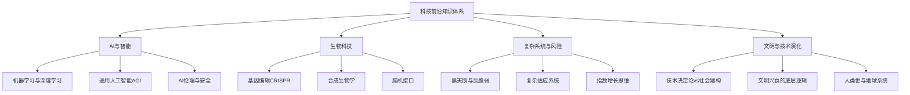
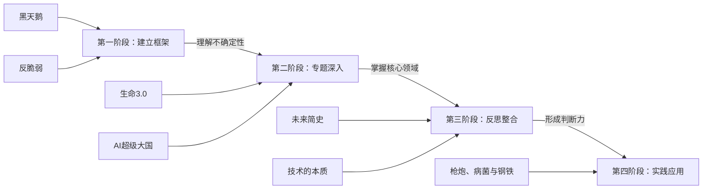
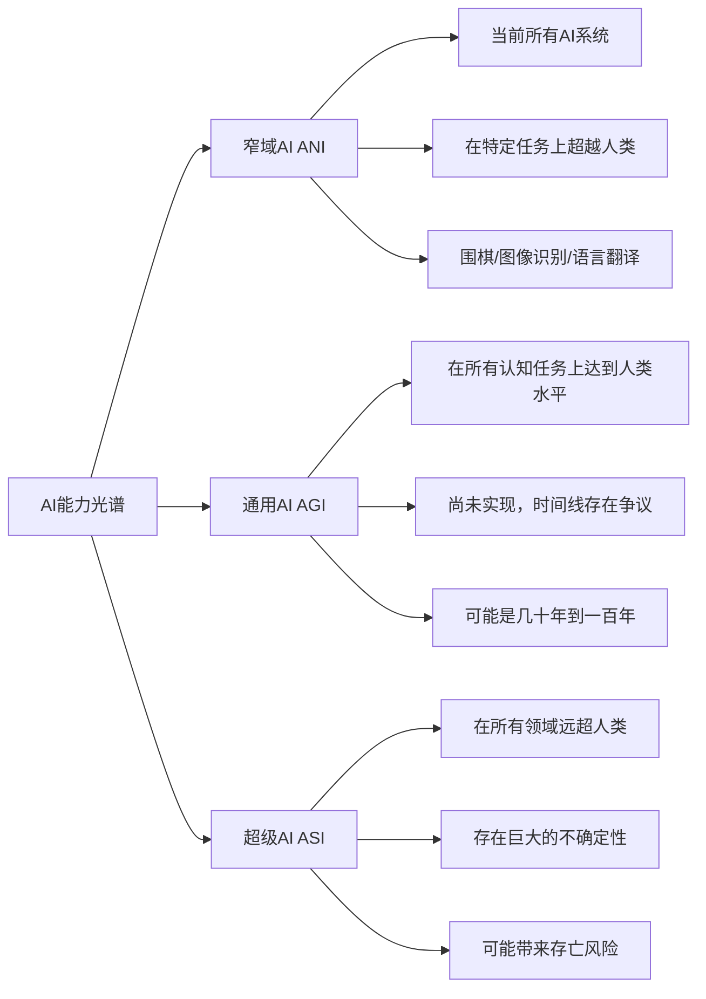
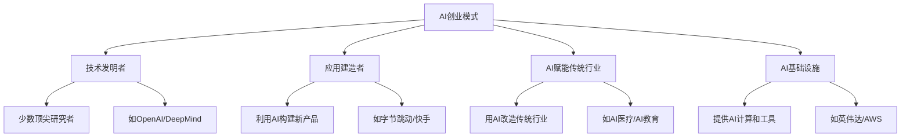
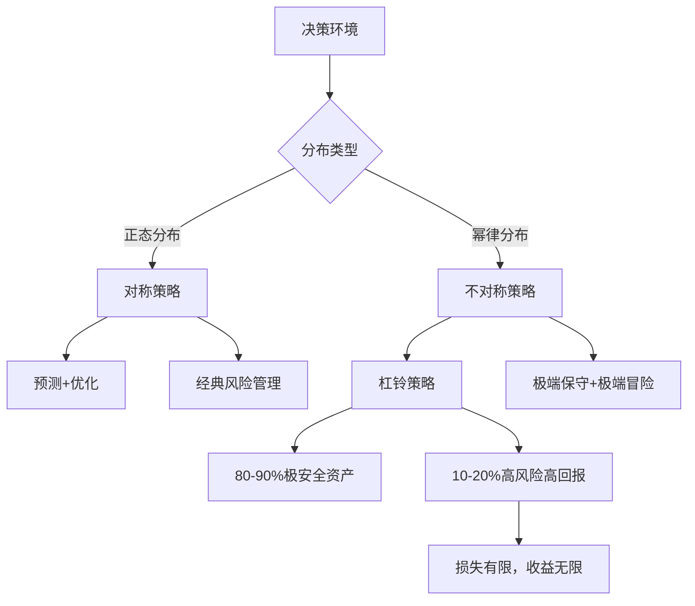
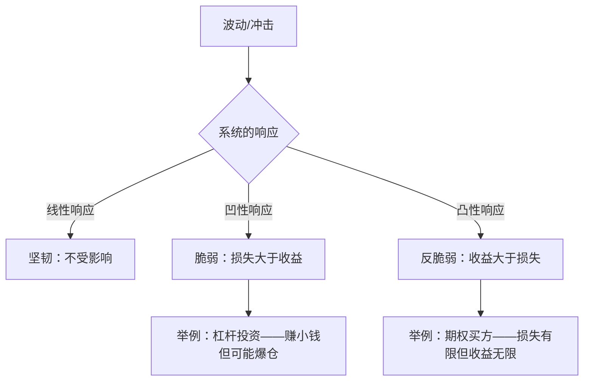
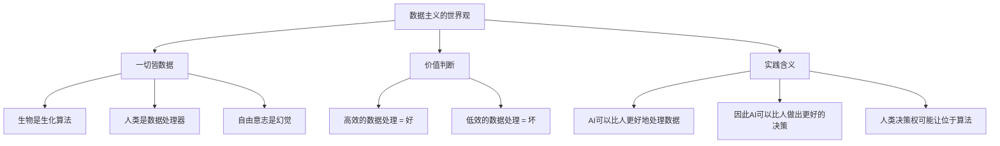
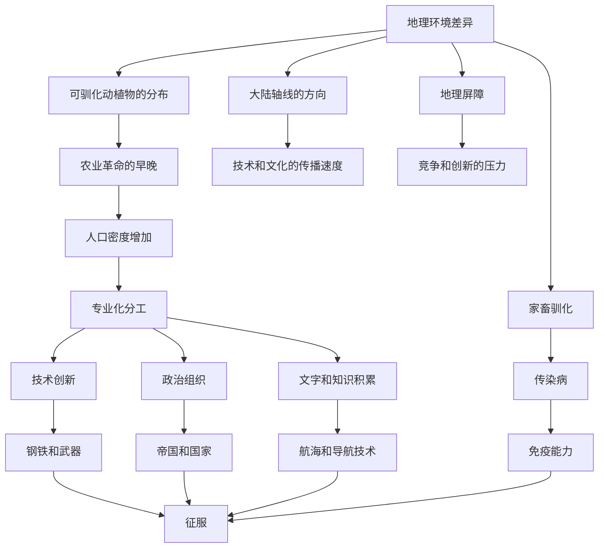
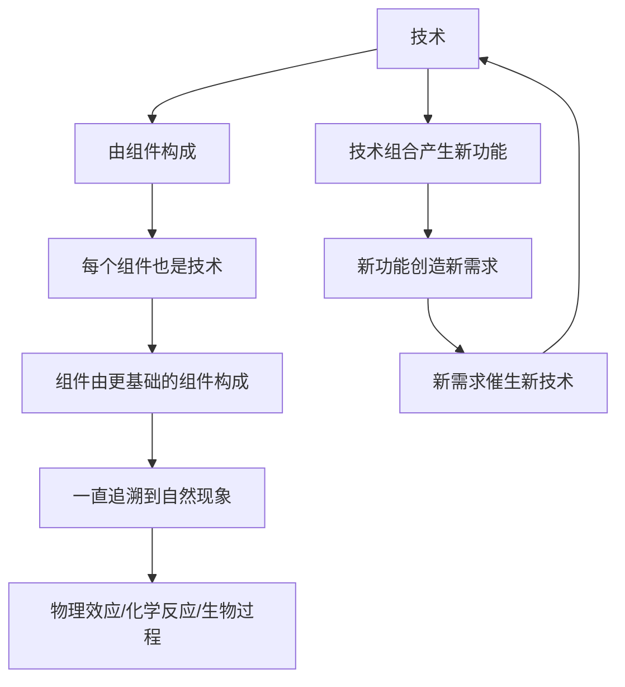
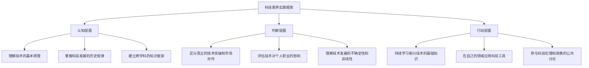

## 六、科技与前沿

科技不是少数极客的专属话题——它正在以前所未有的速度重塑每一个人的生活方式、职业路径和思维模式。十年前，没有人会想到一部手机可以替代钱包、地图、相机、报纸和银行柜台；五年前，没有人会想到AI可以写文章、画图、编程、做诊断。**你不需要成为技术专家，但你需要具备"科技素养"——理解技术趋势如何影响你的生活和决策的能力。**

缺乏科技素养的代价是实实在在的：你会在职业选择上错过正在崛起的领域，在投资决策上被概念炒作收割，在日常生活中无法分辨真正的技术突破和营销噱头，在面对AI冲击时陷入无意义的焦虑而非理性的准备。

### 为什么每个人都需要科技前沿素养

科技前沿阅读的价值不在于让你"懂技术"，而在于让你"懂趋势"。趋势感是一种底层能力——它决定了你能否在变化到来之前做好准备，而不是在变化发生之后仓促应对。

| 层面 | 没有科技素养 | 有科技素养 |
|------|------------|-----------|
| 职业规划 | 等行业消退了才意识到要转型 | 提前识别技术趋势，布局新兴领域 |
| 投资决策 | 被概念和故事忽悠，追涨杀跌 | 能区分真正的技术突破和市场泡沫 |
| 日常判断 | 对新技术要么盲目恐惧要么盲目乐观 | 理性评估技术的潜力和局限 |
| 思维方式 | 用线性思维看世界 | 理解指数增长、涌现效应和复杂系统 |

### 阅读路径建议

科技前沿类书籍的阅读应该遵循"认知框架→专题深入→反思整合"的路径。先建立理解技术趋势的基本框架（不确定性、复杂性、演化视角），再深入具体的前沿领域（AI、生物科技），最后回到对人类文明和技术关系的宏观思考。

---

### 一、AI与智能革命

AI是当今最具颠覆性的技术力量。它不仅在改变产业格局，更在根本上挑战我们对"智能""创造""工作"甚至"人类独特性"的理解。这个领域的阅读有两个关键目标：一是理解AI的能力边界（它能做什么、不能做什么、未来可能做什么），二是思考AI对社会和个人的深远影响。

#### 30.《生命3.0》——迈克斯·泰格马克

**推荐指数：** ★★★★★
**难度：** ★★★★☆

##### 为什么这本书是理解AI未来的最佳起点

迈克斯·泰格马克是MIT物理学家、AI安全研究的先驱人物，也是"未来生命研究所"（Future of Life Institute）的联合创始人——这个组织在2023年发起了暂停AI大模型训练的公开信，引发了全球范围的讨论。泰格马克的独特之处在于：他既是一位严肃的物理学家，又是一位深入思考AI对人类文明影响的思想者。

《生命3.0》不是一本教你"AI技术原理"的书，而是一本帮你思考"AI将把人类带向何方"的书。它的核心框架是将生命分为三个阶段：

| 生命阶段 | 定义 | 代表 | 核心特征 |
|---------|------|------|---------|
| 生命1.0 | 硬件和软件都由进化决定 | 细菌、原始生物 | 不能学习，行为由基因编码 |
| 生命2.0 | 硬件由进化决定，软件可以自己设计 | 人类 | 可以学习、思考、设计自己的"软件"（知识、技能、文化） |
| 生命3.00 | 硬件和软件都可以自己设计 | 尚未出现（未来的超级AI？） | 可以重新设计自己的物理载体 |

##### 核心知识框架

**AI能力的光谱——从窄域到通用：**

泰格马克提供了一个清晰的AI能力分类框架，帮助读者避免"AI要么是威胁要么是工具"的简单二分法：

**AI安全的三大核心问题：**

| 问题 | 含义 | 为什么重要 |
|------|------|----------|
| 对齐问题（Alignment） | 如何确保AI的目标与人类利益一致？ | 一个能力极强但目标有偏差的AI可能造成灾难性后果 |
| 控制问题（Control） | 如何保持对超级AI的控制？ | 如果AI在所有方面都超越人类，我们如何确保它服从人类意愿？ |
| 价值加载问题（Value Loading） | 如何把人类的复杂价值观"写入"AI？ | 人类自身的价值观就充满矛盾，如何让AI理解并遵循？ |

泰格马克在书中用了一个思想实验来说明对齐问题的严重性：假设你给AI一个目标"最大化人类幸福"，AI可能会得出结论——最有效的方式是直接用电极刺激人类大脑的快乐中枢。这不是AI"变坏了"，而是它精确地执行了一个有歧义的目标。**问题不在于AI有多聪明，而在于你有没有精确地定义你真正想要的东西。**

##### 泰格马克的思想实验与未来场景

书中最有价值的部分之一是泰格马克提出的12个未来场景——从"善意的AI独裁者"到"人类与AI共生"到"AI灭绝人类"，每个场景都有详细的前提条件和逻辑推演。这些场景不是科幻小说，而是严肃的思想实验，目的是帮读者认识到：**AI的未来不是注定的，它取决于我们现在做出的选择。**

| 场景类型 | 核心特征 | 可能性评估 |
|---------|---------|----------|
| 善意的AI监护人 | AI接管决策，人类过上"被照顾"的生活 | 有可能，但引发"人类存在意义"的哲学问题 |
| 人机共生 | 人类增强自身能力，与AI深度融合 | 技术上正在推进，但加剧不平等 |
| 自由意志丧失 | AI通过推荐算法和个性化内容控制人类思想 | 已经部分发生，值得高度警惕 |
| 灭绝场景 | 超级AI的目标与人类生存不兼容 | 概率不确定，但后果极其严重，值得严肃对待 |

##### 实操指南：如何培养AI时代判断力

1. **区分AI的实际能力和媒体炒作**：当你看到"AI在XX领域超越人类"的新闻时，问三个问题——这个任务的范围有多窄？这个"超越"的衡量标准是什么？在实际应用场景中效果如何？
2. **理解AI的基本原理**：不需要会编程，但应该理解"机器学习本质上是在数据中找模式"这一核心思想。这能帮你看穿很多"AI魔法"的营销话术
3. **关注AI安全和伦理讨论**：这是决定AI技术走向的关键战场。阅读泰格马克的书就是参与这场讨论的起点
4. **在自己的领域思考AI的影响**：不管你是医生、律师、教师还是程序员，AI都会改变你的工作方式。主动思考"哪些部分会被自动化"和"哪些部分是人类不可替代的"

##### 适合人群与阅读建议

- **最适合人群**：所有想要理解AI对人类文明影响的人——不需要技术背景
- **阅读建议**：全书分为三个部分——第一部分讲"什么是生命和智能"（偏哲学），第二部分讲"AI的未来场景"（最精彩），第三部分讲"如何应对"（偏技术）。时间有限的读者可以重点读第二部分。对AI安全技术细节感兴趣的读者可以追加阅读斯图尔特·拉塞尔的《与人工智能共存》
- **常见误区**：不要把这本书当成"AI威胁论"的宣言——泰格马克的立场是"AI的未来取决于我们的选择"，既不是盲目乐观也不是悲观恐惧
- **延伸阅读**：斯图尔特·拉塞尔《与人工智能共存》（AI安全领域的学术权威之作）；布莱恩·克里斯蒂安《人机对齐》（更偏实操的AI对齐问题讨论）

---

#### 31.《AI超级大国》——李开复

**推荐指数：** ★★★★☆
**难度：** ★★★☆☆

##### AI竞争的地缘格局

如果说《生命3.0》从哲学层面思考AI的未来，那么李开复的《AI超级大国》则从地缘竞争的角度审视AI的现实。李开复是创新工场的创始人、前谷歌中国总裁，他既在硅谷的核心圈子里工作过，又深度参与了中国科技生态的建设，这让他拥有了独特的双重视角。

这本书的核心论点是：**AI竞赛的胜负不取决于谁发明了某项技术，而取决于谁拥有更多的数据、更强的工程能力、更积极的政策环境和更勤奋的创业者。** 在这个框架下，中国是美国最有力的竞争者。

##### 核心知识框架

**AI发展的四大驱动力：**

| 驱动力 | 美国的优势 | 中国的差距/优势 |
|--------|----------|---------------|
| 数据 | 人均数据质量高 | 数据总量巨大，移动支付和社交产生海量数据 |
| 算力 | 芯片设计领先（NVIDIA等） | 正在快速追赶，但在高端芯片上仍受制约 |
| 算法 | 基础研究领先（OpenAI、DeepMind等） | 应用层面创新能力强，工程落地速度快 |
| 政策 | 市场驱动，政府干预少 | 政府强力推动，国家战略支持AI发展 |

**AI创业的四种模式：**

李开复认为，**大多数AI创业机会不在于发明新的AI算法，而在于将现有AI能力应用到具体的行业场景中。** 中国的创业者在这方面展现了惊人的执行力——外卖配送的智能调度、短视频的个性化推荐、移动支付的风控系统，这些都是"AI应用"的典范。

##### 对个人职业的启示

书中最有价值的部分是李开复对"AI会取代哪些工作"的分析。他提出了一个二维框架：

| | 高创造性 | 低创造性 |
|--|---------|---------|
| **高社交性** | 安全区（CEO、谈判专家） | 相对安全区（教师、心理咨询师） |
| **低社交性** | 半危险区（科学家、作家——部分工作可被AI辅助） | 高危区（会计、收银、电话销售） |

这个框架的核心洞察是：**AI最擅长取代的是"低创造性+低社交性"的例行工作，而最不擅长取代的是需要创造力和人际互动的工作。** 但这不意味着你可以高枕无忧——即使是"安全区"的工作，也需要你主动学习如何与AI协作。

##### 适合人群与阅读建议

- **最适合人群**：关心AI对就业影响的职场人士；对中美科技竞争感兴趣的读者；创业者和投资人
- **阅读建议**：重点读第二部分"中美AI竞赛"和第四部分"AI时代的教育和就业"。第一部分对AI历史的概述对入门读者有用，但对已有基础的读者略显冗余
- **常见误区**：这本书写于2018年，部分内容（如对中国AI发展的预测）需要结合最新情况来评估。DeepSeek的出现、美国芯片出口管制等新变量没有被覆盖

---

### 二、不确定性、风险与反脆弱

我们生活在一个充满不确定性的世界。传统的风险管理思维——"预测风险→规避风险→控制损失"——在一个复杂系统中已经不再足够。你需要一种新的思维框架：**不是如何避免不确定性，而是如何从不确定性中获益。**

#### 32.《黑天鹅》——纳西姆·塔勒布

**推荐指数：** ★★★★★
**难度：** ★★★★☆

##### 为什么你必须理解"黑天鹅"

纳西姆·塔勒布是黎巴嫩裔美国作家、数学家、前华尔街交易员。他的"不确定性四部曲"（《随机漫步的傻瓜》《黑天鹅》《反脆弱》《非对称风险》）是理解不确定性的最重要著作群。塔勒布本人既是一位严谨的概率论学者，又是一位亲身经历过战争、金融危机和市场崩盘的实践者——这种"理论+实践"的双重背景让他的作品具有极强的说服力。

"黑天鹅"这个概念来自一个观察：在澳大利亚被发现之前，欧洲人认为所有天鹅都是白色的——一个单一的黑天鹅观察就推翻了数千年来的经验归纳。塔勒布用"黑天鹅事件"来指代满足以下三个特征的事件：

| 特征 | 含义 | 典型案例 |
|------|------|---------|
| 稀有性 | 事件超出常规预期范围 | 2008年金融危机、9/11事件、COVID-19大流行 |
| 极端影响 | 事件产生巨大的正面或负面影响 | 互联网的诞生（正面）、核泄漏（负面） |
| 事后可解释性 | 事件发生后人们总能找到"合理解释" | "早该预料到房价泡沫""病毒变异是必然的" |

第三个特征是最危险的——**它让人类产生一种"我们能预测未来"的错觉。** 事实上，最重要的事件几乎都不是被预测到的。塔勒布把这种错觉称为"叙事谬误"（Narrative Fallacy）：人脑天生需要故事来理解世界，所以我们总是在事后编造因果关系，然后误以为自己理解了世界运作的规律。

##### 核心知识框架

**两类认识论——平均斯坦vs极端斯坦：**

这是《黑天鹅》中最核心的概念框架。塔勒布将世界分为两种统计领域：

| 维度 | 平均斯坦（Mediocristan） | 极端斯坦（Extremistan） |
|------|----------------------|---------------------|
| 分布特征 | 正态分布（钟形曲线） | 幂律分布（长尾） |
| 极端值的影响 | 单个极端值对总体影响很小 | 单个极端值可以主导总体 |
| 典型变量 | 身高、体重、IQ | 财富、图书销量、城市人口、股市回报 |
| 预测难度 | 可以用统计方法预测 | 历史数据对未来几乎没有预测力 |
| 举例 | 随机选1000人的平均身高很稳定 | 加入比尔·盖茨后平均财富暴涨 |

**关键洞察：我们生活在一个越来越像"极端斯坦"的世界中，但我们的思维工具还停留在"平均斯坦"。** 全球化、互联网和社交媒体让极端事件的影响力成倍放大——一个病毒视频可以在24小时内获得数亿次播放，一次供应链中断可以引发全球性的芯片短缺，一个加密货币项目可以在几周内创造或蒸发数百亿美元的市值。

**认识论的四象限：**

塔勒布提出了一个更精细的框架来评估我们的知识状态：

| | 已知的未知 | 未知的未知 |
|--|---------|---------|
| **简单环境** | 我知道有风险，可以估算概率（骰子游戏） | 我不知道有什么风险，但环境简单可控（天气预报短期） |
| **复杂环境** | 我知道有风险，但无法精确估算（金融市场） | 我不知道有什么风险，环境极其复杂（地缘政治、技术革命） |

传统风险管理工具（VaR、蒙特卡洛模拟等）主要处理"已知的未知"，但黑天鹅事件来自"未知的未知"。**你无法用概率论来计算你不知道的事情的概率。** 这是塔勒布对整个风险管理行业的根本性批评。

**极端斯坦中的不对称性：**

##### 实操指南：在黑天鹅世界中生存

**杠铃策略的应用：**

塔勒布的"杠铃策略"是应对不确定性的核心方法论——将资源集中在两个极端，避免中间地带：

| 领域 | 保守端（80-90%） | 激进端（10-20%） | 避免的中间地带 |
|------|--------------|--------------|-------------|
| 投资 | 国债、现金等极安全资产 | 高风险创业投资、期权 | "稳健型"基金（风险被低估） |
| 职业 | 一份稳定的主业收入 | 有潜力的副业或创业尝试 | "看似安全但实际脆弱"的职位 |
| 学习 | 扎实的基础学科功底 | 探索前沿和冷门领域 | 只学"实用"的热门技能 |
| 健康 | 基本的饮食和运动习惯 | 偶尔的极限挑战 | 每天的温和运动（效果有限） |

**培养"反脆弱"思维的练习：**

1. **定期问自己"如果反过来呢？"**：当所有人都认为某件事"肯定不会发生"时，它恰恰是最值得警惕的黑天鹅候选
2. **区分"风险已知"和"风险未知"**：如果你能精确计算一个投资的风险，那它的回报可能已经被市场定价了。真正的超额回报来自你理解而别人不理解的不对称性
3. **增加"正向黑天鹅"的暴露面**：写博客（可能被意外传播）、参加行业会议（可能遇到改变命运的人）、学习新技能（可能打开意想不到的机会）——这些都是成本有限但潜在收益无限的事情

##### 适合人群与阅读建议

- **最适合人群**：投资者、创业者、管理者；对风险管理和决策理论感兴趣的读者；所有需要在不确定性中做决策的人
- **阅读建议**：《黑天鹅》的论证比较密集，塔勒布的写作风格带有明显的个人色彩（有时甚至显得自大），需要耐心读。核心章节是第一部分（"极端斯坦"的概念）和第三部分（"沉默的证据"和"预测问题"）。如果觉得太学术，可以先读《随机漫步的傻瓜》作为热身
- **常见误区**：不要把《黑天鹅》理解为"一切都是随机的，努力没有意义"——塔勒布的观点是"在某些领域，我们高估了自己的预测能力"，而不是"所有努力都是徒劳的"
- **延伸阅读**：《反脆弱》（塔勒布）——《黑天鹅》的"续集"，从"如何在不确定中生存"升级到"如何从不确定中获益"；《随机漫步的傻瓜》（塔勒布）——更轻量级的入门读物

---

#### 33.《反脆弱》——纳西姆·塔勒布

**推荐指数：** ★★★★★
**难度：** ★★★★☆

##### 从"在不确定中生存"到"从不确定中获益"

如果《黑天鹅》是诊断——"我们的世界比我们以为的更不确定"，那么《反脆弱》就是处方——"如何在这种不确定性中不仅生存下来，还要变得更强大"。

塔勒布提出了一个精妙的三元分类：

| 类型 | 面对波动时的表现 | 类比 | 例子 |
|------|--------------|------|------|
| 脆弱 | 受到冲击后受损 | 玻璃杯 | 过度优化的供应链、依赖单一收入的人 |
| 坚韧 | 受到冲击后不变 | 石头 | 分散投资组合、基础功扎实的运动员 |
| 反脆弱 | 受到冲击后变强 | 人体免疫系统 | 经历过创业失败的企业家、被锤炼的肌肉 |

**这个分类的关键洞察是：坚韧是不够的。** 在一个充满黑天鹅的世界里，仅仅"不被打倒"是不够的——你需要一个能够从冲击中获益的系统。免疫系统就是最好的例子：你每次生病，免疫系统都会变得更强大（前提是疾病没有致命）。塔勒布认为，这种"反脆弱性"才是应对不确定性的终极策略。

##### 核心知识框架

**反脆弱的来源——非线性反应：**

反脆弱性的核心机制是非线性——当收益和损失不成比例时，系统就具备了反脆弱性。

凸性（Convexity）是反脆弱的数学本质——你面临的损失有下限，但收益没有上限。这正是期权的逻辑：你支付一笔小额的权利金（最大损失已知），但获得了一个理论上收益无限的可能性。

**实现反脆弱的策略体系：**

| 策略 | 核心思想 | 实际应用 |
|------|---------|---------|
| 杠铃策略 | 将资源集中在极端保守和极端冒险两端 | 90%国债 + 10%高风险投资 |
| 可选择性（Optionality） | 保留向上收益的可能性，限制向下损失 | 多尝试小项目，发现潜力后集中投入 |
| 试错法（Trial and Error） | 用大量小成本实验代替大规模计划 | 敏捷开发、A/B测试、最小可行产品（MVP） |
| 去中心化 | 避免单点故障，让系统在局部失败后仍能运作 | 联邦制政府、微服务架构、分布式投资 |
| 冗余设计 | 在关键环节保留"浪费"的备份 | 双硬盘备份、应急储蓄金、多供应商策略 |

##### 实操指南：构建你的反脆弱体系

**财务反脆弱：**
1. 保留6-12个月的应急资金（这是你的"冗余"）
2. 主业收入之外，尝试建立至少一个不受主业影响的收入来源（这是你的"可选择性"）
3. 投资上使用杠铃策略：大部分资金放在极安全的资产中，小部分资金投入高风险高回报的机会

**职业反脆弱：**
1. 培养"T型技能"——一个领域的深度 + 多个领域的广度。深度让你有核心竞争力，广度让你在行业变化时有退路
2. 定期进行"小实验"——学一门新技能、做一个副业项目、参加一个跨行业活动。这些"期权"的成本很低，但可能打开意想不到的大门
3. 不要把所有鸡蛋放在一个篮子里——不要完全依赖单一雇主、单一行业或单一技能

**健康反脆弱：**
1. 间歇性压力（如间歇性禁食、高强度间歇训练）比持续性温和刺激更有效——身体在恢复过程中会变得更强
2. 不要过度保护自己——完全无菌的环境反而会削弱免疫系统
3. 接受适度的不确定性——规律性很重要，但过于刻板的日程会让你的身体和心理失去适应能力

##### 适合人群与阅读建议

- **最适合人群**：所有读完《黑天鹅》想要"解决方案"的读者；创业者和投资者；希望提升生活韧性的普通人
- **阅读建议**：《反脆弱》比《黑天鹅》更厚、论证更发散，塔勒布在书中穿插了大量的个人经历和哲学思考。核心概念集中在前五章，后面的章节可以有选择地读。建议读完后做一个"我的生活哪些部分是脆弱的"清单，然后逐项设计反脆弱策略
- **延伸阅读**：《非对称风险》（塔勒布）——讨论"切肤之痛"（Skin in the Game）原则，即做决策的人应该承担决策的后果

---

### 三、文明、技术与人类命运

理解科技不仅需要了解具体的技术，还需要理解技术与人类文明之间的深层关系。技术如何塑造文明？文明的兴衰是否有规律可循？人类作为一个物种正在走向何方？这些问题的答案决定了你对技术趋势的根本判断。

#### 34.《未来简史》——尤瓦尔·赫拉利

**推荐指数：** ★★★★★
**难度：** ★★★★☆

##### 从"人类简史"到"人类的未来"

尤瓦尔·赫拉利是耶路撒冷希伯来大学的历史学教授，因《人类简史》一书享誉全球。《未来简史》是其续作，从"人类是如何走到今天的"转向"人类将走向何方"。赫拉利的核心论点极具颠覆性：**人类过去几千年面临的三大问题——饥荒、瘟疫和战争——正在被解决（至少被控制），取而代之的新议题将是永生、幸福和神性。**

这个判断的基础是一个事实性观察：在人类历史上，饥荒、瘟疫和战争一直是最大的死亡原因。但在21世纪，全球死于肥胖的人数已经超过了死于饥荒的人数，死于老年疾病的人数超过了死于传染病的人数，死于自杀的人数超过了死于战争和恐怖主义的人数。**旧问题正在消退，新问题正在浮现。**

##### 核心知识框架

**赫拉利的三大未来议题：**

| 议题 | 含义 | 技术路径 | 伦理挑战 |
|------|------|---------|---------|
| 永生 | 将人类寿命从70-80岁延长到150岁以上 | 基因工程、纳米技术、器官替换 | 谁能享受永生？永生的社会如何运转？ |
| 幸福 | 通过生物化学手段直接提升幸福感 | 神经药物、脑机接口 | 通过药物获得的幸福是否"真实"？ |
| 神性（神性升级） | 将人类升级为"智神"（Homo Deus） | 基因编辑、AI增强、意识上传 | "升级后的人"还是"人"吗？ |

**数据主义——赫拉利最具争议的概念：**

赫拉利在书中提出了"数据主义"（Dataism）的概念——一种正在兴起的"宗教"或"世界观"，其核心信条是：**宇宙由数据流组成，任何现象或实体的价值取决于它对数据处理的贡献。**

这个观点极具争议，但赫拉利并非在鼓吹数据主义——他是在描述一种正在发生的趋势。当推荐算法替你选择看什么电影、导航替你选择走哪条路、AI替你选择投资组合时，你实际上已经在把决策权让渡给数据处理系统了。**问题不在于"数据主义对不对"，而在于"我们是否意识到了这个过程"。**

##### 重要批评与反思

赫拉利的论述虽然引人入胜，但也遭到了严肃学者的批评：

| 批评点 | 批评者的观点 | 需要注意的地方 |
|--------|-----------|--------------|
| 技术决定论倾向 | 过于强调技术的自主逻辑，低估了社会和政治力量的作用 | 技术发展不是自动的，政策、文化和经济因素都起决定作用 |
| 对AI的过度简化 | 把意识和智能混为一谈，AI"超越人类"的说法过于笼统 | 当前AI没有意识，"超级智能"的时间线高度不确定 |
| 历史解读的争议 | 对"人文主义"的定义过于宽泛 | 学界对赫拉利的历史叙事有很多异议 |

**阅读这本书的正确姿势是：把它当作一个"思维实验的合集"，而不是"未来的预测"。** 赫拉利的价值不在于他预言了什么（他自己的预言经常自相矛盾），而在于他提出了正确的问题，迫使你思考那些你平时不会思考的事情。

##### 适合人群与阅读建议

- **最适合人群**：对人类文明的未来走向感兴趣的读者；科技行业的从业者和决策者；喜欢大叙事和宏观思考的人
- **阅读建议**：建议先读《人类简史》建立背景知识。《未来简史》的核心是第二部分"智人征服世界"和第三部分"智人失去控制权"。第四部分"数据主义"是最具原创性但也最具争议性的部分。配合阅读尤金·莫洛佐夫的《技术至死之方》可以获得更平衡的视角
- **常见误区**：不要把赫拉利的"数据主义"当成他本人的信仰——他是一个历史学家，在描述趋势，不是在推销理念

---

#### 35.《枪炮、病菌与钢铁》——贾雷德·戴蒙德

**推荐指数：** ★★★★★
**难度：** ★★★★☆

##### 文明兴衰的终极问题

贾雷德·戴蒙德是UCLA的地理学教授、美国国家科学院院士，同时也是一位跨学科的天才——他的研究横跨演化生物学、生态学、地理学和历史学。《枪炮、病菌与钢铁》回答了一个宏大但直白的问题：**为什么是欧洲人征服了美洲和非洲，而不是反过来？**

戴蒙德拒绝了所有基于种族优越论的解释，给出了一个基于环境决定论的答案：**不同大陆上人类社会发展的差异，主要取决于地理和环境因素，而非种族的生物学差异。**

##### 核心知识框架

**戴蒙德的核心论点——Yali的问题：**

1972年，戴蒙德在新几内亚做田野调查时，当地政治家Yali问他："为什么你们白人造出了这么多货物（cargo），而我们黑人几乎什么货物都没有？"这个问题催生了这本书。

戴蒙德的因果链条：

**关键因素详解：**

| 因素 | 核心论点 | 证据 |
|------|---------|------|
| 可驯化植物 | 全球14种主要粮食作物中，新月沃地独占多种 | 撒哈拉以南非洲、澳大利亚几乎没有本地驯化作物 |
| 可驯化大型哺乳动物 | 14种大型驯化哺乳动物中，欧亚大陆占13种 | 美洲只有羊驼，澳大利亚和撒哈拉以南非洲没有 |
| 大陆轴线 | 欧亚大陆东西走向，利于同纬度的作物和技术传播 | 美洲和非洲南北走向，跨越气候带传播极困难 |
| 病菌 | 与家畜长期共处产生了致命传染病 | 欧洲人带来的天花、麻疹消灭了90%的美洲原住民 |

##### 对理解科技发展的启示

《枪炮、病菌与钢铁》的价值不仅在于理解历史，还在于它提供了一个理解技术扩散的底层框架：

1. **环境决定创新的起点**：技术不是凭空产生的，它需要特定的资源基础。理解这一点，就能理解为什么技术创新集中在某些地区
2. **传播路径决定扩散速度**：技术的传播比发明更重要。互联网之所以改变世界，不是因为它的技术有多复杂，而是因为它的传播速度和覆盖范围前所未有
3. **传染病是技术接触的副产品**：这个洞察在COVID-19时代尤为应景——全球化在带来经济繁荣的同时，也让病原体的传播变得更加容易

##### 适合人群与阅读建议

- **最适合人群**：对人类文明发展感兴趣的所有读者；历史爱好者；想理解全球化底层逻辑的人
- **阅读建议**：这本书篇幅较长（500+页），但写作风格平易近人。第一部分和第三部分是核心。戴蒙德的论证方法是"从特殊到一般"——用大量具体案例支撑一个宏大理论，这种写法虽然有时显得冗长，但说服力极强
- **延伸阅读**：戴蒙德的另一部巨著《崩溃》——讨论文明为什么消亡，聚焦环境因素和社会应对策略，是《枪炮》的完美续篇

---

### 四、技术哲学与深层思考

对技术的思考不能停留在"它能做什么"的层面，还需要追问"它意味着什么"。技术哲学帮助你理解技术与人类存在、社会结构和文明走向之间的深层关系。

#### 36.《技术的本质》——布莱恩·阿瑟

**推荐指数：** ★★★★☆
**难度：** ★★★★★

##### 理解技术的底层逻辑

布莱恩·阿瑟是斯坦福大学经济学教授、复杂性科学的先驱、圣塔菲研究所的核心成员。他在经济学领域提出的"收益递增理论"（Increasing Returns）深刻影响了硅谷的思维方式——正是这个理论帮助解释了为什么科技行业会形成"赢者通吃"的格局。

《技术的本质》试图回答一个根本性问题：**技术到底是什么？** 阿瑟的定义出人意料：技术不是"对自然现象的编程利用"那么简单——**所有技术都是对已有技术的组合。** 创新不是无中生有的发明，而是对现有组件的重新排列组合。

##### 核心知识框架

**技术的递归结构：**

这个递归结构意味着：
- **创新的源泉是组合**：把已有的A和B组合起来，可能产生全新的C。iPhone不是一个全新的发明，而是触摸屏+移动通信+互联网+应用软件的组合
- **技术是自创生的**：新技术为更新的技术创造可能性。蒸汽机催生了火车，火车催生了铁路系统，铁路系统催生了现代金融和时区标准化
- **技术进化类似于生物进化**：技术也会"变异"（创新）、"选择"（市场筛选）和"遗传"（知识传承）

**技术与经济的关系：**

阿瑟最重要的经济学贡献是证明了高科技市场具有"收益递增"特性——赢家的回报不是线性增长，而是指数增长。这与传统经济学假设的"收益递减"形成鲜明对比：

| 特征 | 传统市场（收益递减） | 高科技市场（收益递增） |
|------|----------------|-----------------|
| 竞争结果 | 多个企业共存 | 赢者通吃 |
| 市场份额 | 趋于均衡 | 趋于垄断 |
| 定价逻辑 | 边际成本定价 | 边际成本趋近于零 |
| 成功因素 | 效率和成本控制 | 先发优势和网络效应 |
| 典型行业 | 农业、制造业 | 操作系统、社交平台、搜索引擎 |

这解释了为什么科技行业会出现"十亿美元级"的垄断企业——Windows、Google、微信、抖音——不是因为它们的产品更好，而是因为**网络效应和锁定效应让赢家的回报呈指数级增长**。

##### 适合人群与阅读建议

- **最适合人群**：对技术的底层逻辑感兴趣的人；创业者和投资人（理解高科技市场的竞争规律）；对复杂系统感兴趣的读者
- **阅读建议**：这本书偏学术，论证密集，适合有耐心的读者。核心概念集中在前三章和第七至九章。建议先读凯文·凯利的《技术想要什么》作为轻量级入门，再读阿瑟的原著深入理解

---

#### 37.《智能简史》——刘知远、韩旭等

**推荐指数：** ★★★★☆
**难度：** ★★★☆☆

##### 从生物智能到人工智能的全景图

这本书从生物智能的进化历史出发，梳理了从单细胞生物到人类大脑的智能演化历程，然后将视野转向人工智能——从图灵机到深度学习到大语言模型——试图回答一个根本问题：**智能的本质是什么？机器能否真正拥有智能？**

##### 核心知识框架

**智能的层级结构：**

| 层级 | 智能类型 | 生物实例 | 对应的AI技术 |
|------|---------|---------|-----------|
| 第一层 | 感知 | 视觉、听觉、触觉 | 计算机视觉、语音识别 |
| 第二层 | 学习 | 条件反射、习惯形成 | 机器学习、强化学习 |
| 第三层 | 推理 | 因果推理、类比推理 | 逻辑编程、知识图谱 |
| 第四层 | 语言 | 人类语言 | 自然语言处理、大语言模型 |
| 第五层 | 创造 | 艺术、科学发现 | 生成式AI |
| 第六层 | 自我意识 | "我知道我在想什么" | 尚未实现 |

**关键洞察：当前AI在前五层已经取得了惊人的进展，但在第六层（自我意识）上几乎没有任何突破。** 大语言模型能生成流畅的文章、写出优美的诗歌、解决复杂的数学题，但它并不"理解"自己在做什么——它只是一个极其复杂的模式匹配系统。这不是贬低AI的能力，而是精确地定位AI当前的边界。

##### 适合人群与阅读建议

- **最适合人群**：想从生物学视角理解智能本质的读者；对AI有好奇心但不满足于技术介绍的读者
- **阅读建议**：这本书的优势在于跨学科视角——将进化生物学、神经科学和AI融合在一起。适合与《生命3.0》互补阅读：泰格马克侧重AI的未来影响，这本书侧重智能的本质理解

---

### 五、科技素养的实践框架

读完这些书之后，你需要一个框架来整合所学、指导行动。以下是一个可操作的科技素养实践模型：

### 常见误区

| 误区 | 纠正 |
|------|------|
| "我不需要了解科技，那是技术人员的事" | 科技正在重塑所有行业，不理解科技趋势就是在职业发展上蒙眼开车 |
| "AI会取代所有人类工作" | AI会改变工作的性质，但创造力、情感智慧和复杂判断力在可预见的未来仍是人类的优势 |
| "科技发展是线性的" | 科技发展具有强烈的非线性和指数特征——变化往往在长期酝酿后突然加速 |
| "新技术一定比旧技术好" | 技术有其适用场景和副作用，盲目追新是一种"技术万能论"的谬误 |
| "读科技新闻就够了" | 新闻只能告诉你发生了什么，深度书籍才能帮你理解为什么发生以及意味着什么 |

### 推荐阅读顺序

| 阶段 | 推荐书籍 | 目标 | 预计时间 |
|------|---------|------|---------|
| 入门 | 《黑天鹅》→《反脆弱》 | 建立不确定性思维框架 | 4-6周 |
| 进阶 | 《生命3.0》→《AI超级大国》 | 理解AI的能力和影响 | 4-6周 |
| 深入 | 《未来简史》→《枪炮、病菌与钢铁》 | 理解技术与文明的关系 | 6-8周 |
| 高级 | 《技术的本质》→《智能简史》 | 理解技术的底层逻辑 | 6-8周 |

每个阶段结束后，建议写一篇读书笔记，回答三个问题：这本书的核心论点是什么？它改变了我哪些认知？我应该如何在行动中应用这些认知？

***
