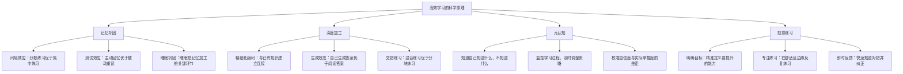
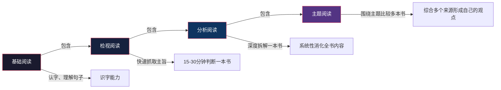
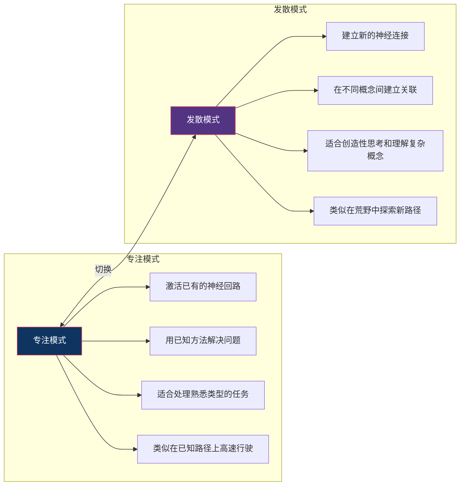
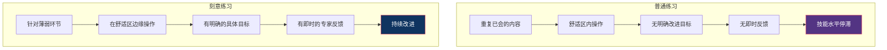
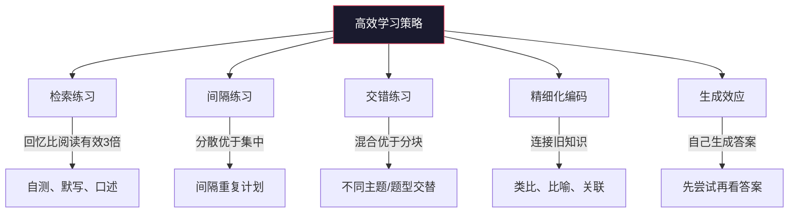
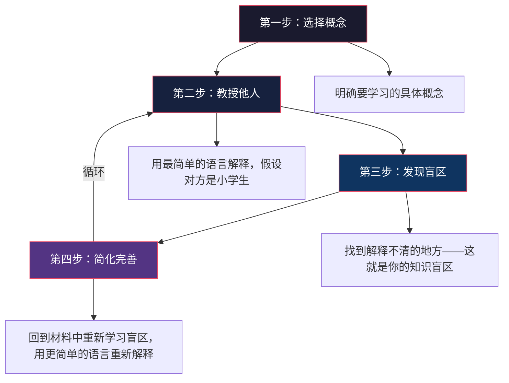
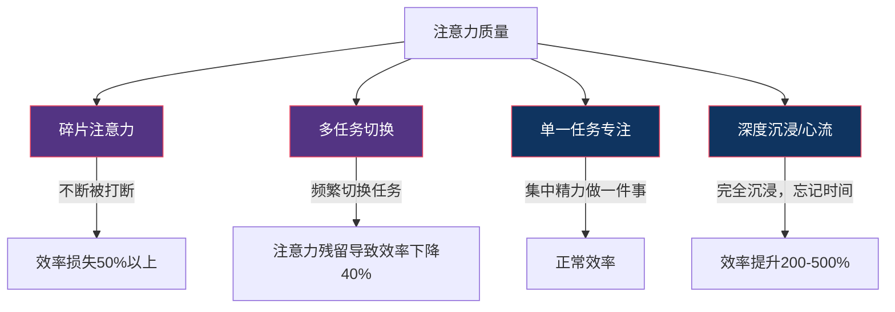
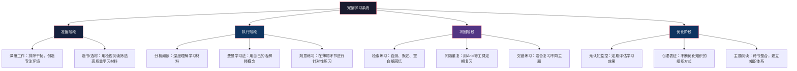

## 七、学习方法

"如何学习"本身就是一个值得深入研究的元学科。大多数人凭直觉和习惯学习——反复阅读、划重点、考前突击——这些方法感觉有效，但认知科学的研究一致表明，它们恰恰是效率最低的学习策略。更糟糕的是，低效的学习方法会产生"流畅性错觉"：因为重读时感觉"都认识"，就误以为自己掌握了，直到考试或应用时才发现一片空白。

学习方法类书籍的价值在于：它用科学证据取代直觉经验，帮你用更少的时间获得更深的理解。在这个知识更新速度越来越快的时代，"学会学习"不是锦上添花，而是核心生存技能。

### 学习科学的核心发现

在过去30年里，认知心理学和神经科学对"人如何学习"这个问题给出了大量颠覆常识的答案。以下是最关键的几项发现：

**学习方法的"反直觉"真相：**

| 直觉认为 | 科学发现 | 实际含义 |
|---------|---------|---------|
| 反复阅读能加深记忆 | 反复阅读的边际收益急剧递减 | 第3遍重读几乎无额外收益，不如做测试 |
| 集中练习效果最好 | 分散练习（间隔效应）记忆保持率高200% | 同样内容学3小时，分3天各1小时远优于一天学3小时 |
| 学习时感觉流畅=学会了 | 流畅性错觉导致高估掌握程度 | 学得"费劲"反而说明在深度加工 |
| 一次只学一个主题 | 交替练习（interleaving）提升辨别能力 | 混合练习不同主题，长期记忆更好 |
| 划线/摘抄是好方法 | 被动标记几乎无效 | 必须主动加工：用自己的话复述、提问、联想 |
| 天赋决定学习上限 | 刻意练习的质量决定进步速度 | "天才"是正确方法+大量练习的产物 |

### 阅读路径建议

学习方法类书籍可以分为三个层次：**认知层**（理解大脑如何学习）、**方法层**（掌握具体学习策略）、**实操层**（在具体场景中应用）。建议先读认知层建立科学基础，再读方法层获取具体工具，最后在实操层的书籍中找到适合自己的应用方案。

---

### 入门级

#### 34.《如何阅读一本书》——莫提默·艾德勒、查尔斯·范多伦

**推荐指数：** ★★★★★
**难度：** ★★★★☆

##### 阅读方法论的奠基之作

这本书初版于1940年，至今仍是阅读方法领域最系统、最权威的著作。作者莫提默·艾德勒是芝加哥大学的哲学教授，同时也是《大英百科全书》第15版的编辑委员会主席。他在学术界和通俗写作之间架起了一座桥梁——这本书既有学术的严谨性，又有面向普通读者的可读性。

《如何阅读一本书》的核心贡献是提出了**阅读的四个层次**理论。这四个层次是递进包含的关系：每一较高层次都包含较低层次的所有技巧，同时增加了新的维度。

##### 核心知识框架：阅读的四个层次

**第一层：基础阅读（Elementary Reading）**

基础阅读是大多数人小学阶段就掌握的能力——认字、理解句子的基本含义。但它不仅仅是"识字"。真正的基础阅读包括：识字能力、词汇扩展能力和基本理解力。如果你在阅读时经常需要回读同一句话才能理解，说明基础阅读能力还需要加强。

**第二层：检视阅读（Inspectional Reading）**

检视阅读的核心目标是在短时间内（15-30分钟）判断一本书是否值得深入阅读，并抓取全书的主旨框架。它分为两个步骤：

1. **系统略读（Skimming）**：
   - 看书名、副标题、封底介绍——确定书的类别和主题
   - 看目录——建立全书结构的心智模型
   - 看序言/前言——了解作者的写作意图和目标读者
   - 挑几个与主题密切相关的章节翻阅——感受作者的论述风格
   - 随手翻阅几页，读几段——判断内容密度和可读性

2. **粗浅阅读（Superficial Reading）**：
   - 从头到尾快速读一遍，遇到不懂的地方不要停下来
   - 目标是先获得全书的整体印象，标记出需要回头深入的部分
   - 这一步的目的是"先见森林，再见树木"

**第三层：分析阅读（Analytical Reading）**

分析阅读是深度消化一本书的完整过程。艾德勒将其分为三个阶段、十五条规则：

*阶段一：找出一本书在谈什么*

| 规则 | 操作 | 目的 |
|------|------|------|
| 规则1 | 依照书的种类与主题分类 | 判断该用什么方式读这本书 |
| 规则2 | 用最简短的话说出整本书在谈什么 | 检验你是否真正理解了主旨 |
| 规则3 | 列出全书的大纲和各部分的大纲 | 理解书的结构和逻辑 |
| 规则4 | 找出作者要问的问题或要解决的问题 | 理解作者的写作动机 |

*阶段二：诠释一本书的内容*

| 规则 | 操作 | 目的 |
|------|------|------|
| 规则5 | 找出关键字，与作者达成共识 | 确保你和作者在用同一套语言 |
| 规则6 | 找出关键句，抓住作者的重要主旨 | 提炼书中的核心论点 |
| 规则7 | 找出论述，重构作者的论证逻辑 | 理解作者如何支撑其观点 |
| 规则8 | 确定作者已解决和未解决的问题 | 评估书的完整性和局限性 |

*阶段三：评论一本书*

| 规则 | 操作 | 目的 |
|------|------|------|
| 规则9 | 在你说出"我同意/不同意/暂缓评论"之前，确保你能说出"我了解了" | 避免在不理解的情况下批判 |
| 规则10 | 不同意时，要理性表达，不要无理地争辩 | 保持建设性的对话 |
| 规则11 | 尊重知识与个人观点的不同 | 区分事实和观点 |
| 规则12-15 | 证明作者的知识不足、知识错误、不合逻辑或分析不完整 | 有理有据地提出批评 |

**第四层：主题阅读（Syntopical Reading）**

主题阅读是最高层次的阅读——围绕一个主题，同时阅读多本书，综合比较不同作者的观点，最终形成自己的判断。这是写论文、做研究、建立知识体系的核心方法。

主题阅读的五个步骤：

1. **找到相关章节**：通过检视阅读，从多本书中筛选出与你的主题相关的章节
2. **带引作者与你达成共识**：不同作者可能用不同的术语描述相同的概念，你需要建立一套统一的术语框架
3. **厘清问题**：将主题拆解为一系列具体问题，让不同作者"回答"同一组问题
4. **界定议题**：当不同作者对同一问题给出不同回答时，就形成了"议题"
5. **分析讨论**：按议题组织讨论，呈现不同观点之间的关系（一致、矛盾、互补）

##### 为什么这本书至今仍然不可替代

市面上关于阅读方法的书有很多，但《如何阅读一本书》至今仍然是最系统的一本。原因在于：大多数阅读技巧书只教你"怎么读得更快"或"怎么记住更多"，但艾德勒关注的是更根本的问题——**怎么读得更深入**。检视阅读教你判断一本书值不值得读，分析阅读教你如何完整理解一本书，主题阅读教你如何跨书整合知识。这套方法论的框架至今没有被超越。

##### 实操指南

**分析阅读的笔记模板：**

书名：_________________
作者：_________________
类别：_________________

主旨（一句话）：_______________

全书大纲：
  第一部分：_______________
    - 核心论点：___________
    - 关键证据：___________
  第二部分：_______________
    - 核心论点：___________
    - 关键证据：___________
  ...

作者要回答的核心问题：
  1. _______________
  2. _______________

作者解决了哪些问题：_______________
作者未解决或回避的问题：_______________

我的评价：
  - 理解程度：□完全理解 □大部分理解 □部分理解
  - 同意程度：□完全同意 □部分同意 □不同意
  - 不同意的理由：_______________

##### 适合人群与阅读建议

- **最适合人群**：所有希望提升阅读质量的人，特别是需要做深度研究、写报告、建立知识体系的人
- **难度提示**：这本书本身就需要"分析阅读"——它不轻松，但值得投入。建议先用检视阅读通读一遍，再挑选最需要的章节精读
- **阅读建议**：第三部分（分析阅读）是最实用的部分，可以优先阅读。主题阅读部分可以等到实际需要做研究时再深入
- **延伸阅读**：读完后可以进阶到《实用性阅读指南》（大岩俊一），它是《如何阅读一本书》的简化实践版

---

#### 35.《学习之道》——芭芭拉·奥克利

**推荐指数：** ★★★★☆
**难度：** ★★☆☆☆

##### 从Coursera最受欢迎课程到畅销书

芭芭拉·奥克利是奥克兰大学的工程学教授，但她并非从小就是"学霸"。她在高中时数学极差，曾是典型的"文科脑"。入伍后她重新回到校园，从零开始学习数学和工程学，最终成为工程学教授。这段经历让她对"怎么学习"这个问题有切身体会。

《学习之道》源于她在Coursera上开设的"Learning How to Learn"课程——这门课至今已有超过300万注册学生，是全球最受欢迎的在线课程之一。书的内容是课程的扩展和深化，核心卖点是用神经科学解释学习机制，并给出易于操作的方法。

##### 核心知识框架：两种学习模式

这本书最核心的概念是大脑的两种学习模式：

| 特征 | 专注模式 | 发散模式 |
|------|---------|---------|
| 神经状态 | 激活特定区域，高强度工作 | 大脑整体放松，低强度弥散活动 |
| 思维方式 | 逻辑、分析、逐步推进 | 联想、直觉、跳跃性思考 |
| 适用任务 | 计算、写作、练习已学技能 | 理解新概念、创造性问题解决 |
| 典型状态 | 桌前专注做题 | 散步、洗澡、入睡前后 |
| 类比 | 手电筒（聚焦一束强光） | 灯泡（向四周散射柔和光线） |
| 局限 | 容易陷入思维定式 | 需要先有专注模式的"原材料" |

**关键洞察：你不能同时处于两种模式。** 很多人遇到难题时"死磕"——这是专注模式在工作，但如果思路已经卡住，继续专注只会强化错误的神经回路。正确的做法是：先专注一段时间（给大脑"播种"），然后切换到发散模式（散步、做其他事），让大脑在后台"孵化"答案。

##### 四大学习策略

**策略一：组块（Chunking）**

组块是将零散信息打包成有意义的单元，从而降低工作记忆的负担。

- **工作记忆容量**：人类工作记忆只能同时处理4±1个信息单元。没有组块，你只能记住一串随机的数字或概念；有了组块，你可以把7位电话号码记成1个单元，把5个相关概念记成1个框架
- **组块的三步流程**：
  1. **专注注意力**：屏蔽干扰，将注意力集中在要学习的信息上
  2. **理解基本概念**：组块不是死记硬背，必须理解各元素之间的关联
  3. **练习和背景化**：通过练习巩固组块，并理解它在更大知识体系中的位置

- **实例**：学习编程中的"递归"概念
  - 第一步：专注理解递归的定义（函数调用自身）
  - 第二步：理解终止条件、递推关系、调用栈等基本要素
  - 第三步：通过多个练习题巩固，并理解递归与循环、分治、动态规划的关系

**策略二：对抗拖延（Pomodoro + 习惯替代）**

奥克利用神经科学解释了拖延的本质：**当你想到一件困难的事时，大脑的疼痛中枢会被激活**。拖延本质上是大脑在"逃避疼痛"。

- **番茄工作法**：设定25分钟的计时器，在这段时间内只做一件事。关键不在于效率，而在于"启动"——一旦开始，疼痛感会迅速降低
- **过程导向 vs 结果导向**：不要想着"我要写完这篇论文"（结果导向，令人焦虑），而要想着"我要在接下来25分钟内专注于写第一段"（过程导向，可执行）
- **习惯替代**：用新的习惯替代旧的拖延触发器。例如，如果你习惯在学习前刷手机，就把手机放到另一个房间，用"坐到书桌前→打开书→读第一行"这个新习惯链替代

**策略三：记忆宫殿与具象化**

抽象概念难以记忆，具象化可以大幅提高记忆效率：

- **比喻法**：把抽象概念比作具体事物。"电流"像"水流"，"电压"像"水压"
- **记忆宫殿法**：把要记忆的信息"放置"在你熟悉的空间位置（如你的家），通过在脑中"行走"来回忆
- **故事法**：把零散信息编成一个故事，利用大脑对叙事的天然记忆优势

**策略四：间隔重复与自我测试**

这是整本书中与认知科学关联最紧密的部分，也是后续《认知天性》要详细展开的主题：

- **间隔重复**：在记忆即将衰退时复习，效果远好于集中重复。推荐使用Anki等间隔重复工具
- **自我测试**：合上书，尝试回忆刚才读的内容。这个"费力回忆"的过程本身就是最有效的学习——认知科学称之为"测试效应"或"提取练习"

##### 适合人群与阅读建议

- **最适合人群**：学习效率不高、经常拖延、觉得自己"不是学习的料"的人。特别适合大学生和需要自学新技能的职场人
- **阅读建议**：这本书非常好读，案例丰富，几乎不需要前置知识。建议配合Coursera课程一起学，效果更好
- **不足之处**：深度有限，很多概念只是点到为止。如果你已经了解基本的学习科学，可能会觉得内容偏浅。可以作为入门读物，之后进阶到《认知天性》
- **核心收获**：学会在专注和发散两种模式间灵活切换，用组块化和间隔重复提高学习效率

---

#### 36.《刻意练习》——安德斯·艾利克森、罗伯特·普尔

**推荐指数：** ★★★★★
**难度：** ★★★☆☆

##### 揭开"天才"的真相

安德斯·艾利克森是佛罗里达州立大学的心理学教授，"刻意练习"（Deliberate Practice）概念的提出者。他在专业技能习得领域研究了30多年，对小提琴手、国际象棋大师、记忆力冠军、飞行员等各类专家进行了系统研究。

这本书的核心论点极具颠覆性：**所谓的"天才"并不存在。** 所有在某个领域达到顶尖水平的人，都经历了大量有目的的、结构化的练习。更关键的是，不是任何练习都有效——只有"刻意练习"才能带来真正的进步。

##### 核心知识框架：刻意练习vs普通练习

**刻意练习的四大要素：**

| 要素 | 说明 | 具体操作 | 反面案例 |
|------|------|---------|---------|
| 明确且具体的目标 | 不是"提高英语"，而是"每天背20个新词并能在语境中正确使用" | 将大目标拆解为可衡量的小目标 | "我要变得更厉害"——没有标准，无法衡量 |
| 专注练习 | 全神贯注地练习，而非心不在焉地重复 | 每次练习25-90分钟，期间零干扰 | 边练琴边看手机——不是在练琴，是在按琴键 |
| 即时反馈 | 快速知道自己哪里做对了、哪里做错了 | 请教练/导师纠正；录音/录像回放；自测 | 弹了100遍同样的错误——错误被强化而非纠正 |
| 走出舒适区 | 练习的内容应该是你目前做不好、但通过努力能做到的 | 选择略高于当前水平的练习内容 | 一直弹自己已经会的曲子——感觉良好但没有进步 |

##### "心理表征"：专家与新手的本质区别

艾利克森引入了一个关键概念——**心理表征（Mental Representation）**。心理表征是大脑中对某个领域知识和技能的组织方式。

**国际象棋的例子：**

- **新手**看到棋盘上32个棋子的独立位置，需要逐一分析每个棋子的走法
- **大师**看到的是6-8个有意义的"棋局模式"（心理表征），每个模式包含多个棋子的协同关系

大师的"超凡记忆"不是因为他们记性好，而是因为他们有一套高效的心理表征来组织信息。同样，优秀的医生看到一组症状，不是逐个排查，而是立刻将症状与已知的"疾病模式"匹配。

**心理表征的作用：**

1. **帮助感知**：专家能"看到"新手看不到的模式
2. **帮助记忆**：有了组织框架，记忆容量和速度大幅提升
3. **帮助计划**：基于已有的模式快速制定行动方案
4. **帮助执行**：将复杂技能自动化，释放注意力资源

##### 刻意练习的1万小时规则——被误读的真相

马尔科姆·格拉德威尔在《异类》中提出的"1万小时规则"广为流传，但它严重曲解了艾利克森的研究。真相是：

| 格拉德威尔的说法 | 艾利克森的实际发现 |
|----------------|------------------|
| 任何领域达到专家水平需要1万小时 | 1万小时只是平均值，不同领域差异巨大（国际象棋需要约1万小时，但记忆术只需几百小时） |
| 只要练习够1万小时就能成为专家 | 必须是刻意练习，低质量的1万小时只会固化错误习惯 |
| 天赋不起作用 | 天赋影响进步的速度，但不决定上限——大多数人的练习量远远达不到天赋瓶颈 |

##### 不适合刻意练习的领域

艾利克森自己也承认，刻意练习有明确的适用边界：

- **适用**：有明确评判标准、有成熟训练方法的领域（音乐、体育、国际象棋、编程竞赛）
- **部分适用**：有评价标准但训练方法尚不成熟的领域（写作、教学、管理）
- **不适用**：高度依赖创造力、没有客观评价标准的领域（纯艺术创作、某些前沿研究）

##### 实操指南

**如何在日常学习中应用刻意练习：**

1. **定义你的"练习区"**：找到你目前最薄弱、但通过努力可以提升的能力点
2. **设计针对性练习**：不要泛泛练习，而要针对这个特定弱点设计练习
3. **获取反馈**：
   - 找导师/教练——最直接有效
   - 录音/录像回放——自己发现问题
   - 参加测试/考试——用结果验证
   - 与同行比较——发现差距
4. **记录练习日志**：每次练习后记录——练了什么、目标是什么、完成情况、发现的问题
5. **定期调整**：每2-4周回顾练习日志，根据进步情况调整练习内容

**练习日志模板：**

日期：_____________
练习内容：_____________
具体目标：_____________
练习时长：_____________
完成情况：_____________
反馈来源：_____________
发现的问题：_____________
下一步改进计划：_____________

##### 适合人群与阅读建议

- **最适合人群**：希望在某个具体领域实现技能突破的人——无论是编程、写作、演讲还是乐器
- **阅读建议**：前四章（刻意练习的本质和原理）是核心，必读。后面的领域案例可以根据兴趣选择。建议边读边为自己设计一套刻意练习方案
- **常见误区**：不要把"刻意练习"等同于"苦练"——关键不是练得多，而是练得对。1000小时高质量刻意练习的效果，可能远超10000小时的低质量重复

---

### 进阶级

#### 37.《认知天性》——彼得·布朗、亨利·罗迪格、马克·麦克丹尼尔

**推荐指数：** ★★★★★
**难度：** ★★★☆☆

##### 认知心理学家的学习科学宣言

这本书的三位作者身份特殊：彼得·布朗是科普作家，而亨利·罗迪格和马克·麦克丹尼尔是认知心理学领域的顶尖学者——他们分别在记忆研究和教育心理学领域有超过40年的研究积累。这种"科学家+作家"的组合让这本书既有严谨的科学基础，又有面向大众的可读性。

这本书的英文原名是"Make It Stick: The Science of Successful Learning"，中文译名"认知天性"虽然不如原名直观，但确实抓住了核心信息：**有效的学习策略往往是反直觉的，你需要对抗自己大脑的"天性"才能学得更好。**

##### 核心知识框架：学习的科学策略

**策略一：检索练习（Retrieval Practice）——学习中最被低估的策略**

大多数人学习的方式是"输入"——反复阅读、划线、看视频。但研究表明，**"输出"（主动回忆）的学习效果是"输入"（被动阅读）的3倍以上**。

这一发现来自罗迪格和卡皮克的经典实验：让三组学生学习同一段材料，A组反复阅读4次，B组阅读1次后做3次回忆测试，C组阅读1次。一周后测试，B组的成绩显著高于A组和C组。

**为什么检索练习如此有效？**

- **强化神经通路**：每次主动回忆都在强化大脑中对应的记忆通路，比重读的强化效果更强
- **暴露知识盲区**：你不知道自己不知道什么——只有尝试回忆时，才能发现哪里薄弱
- **创建更好的记忆线索**：每次检索都为记忆添加了新的提取路径，让以后更容易回忆

**检索练习的具体方法：**

| 方法 | 操作 | 适用场景 |
|------|------|---------|
| 自测卡片 | 一面写问题，一面写答案，用Anki等工具定期自测 | 事实性知识、术语、公式 |
| 默写/默述 | 合上书，用自己的话写下/说出刚学的内容 | 概念理解、方法论 |
| 费曼技巧 | 假装向一个完全不懂的人解释这个概念 | 深度理解、发现自己理解的漏洞 |
| 课后小测 | 每节课/每章学完后做一组测试题 | 任何有习题的学习材料 |
| 空白纸回忆 | 在白纸上画出知识框架图 | 知识体系的整体把握 |

**策略二：间隔练习（Spaced Practice）——遗忘是学习的朋友**

艾宾浩斯遗忘曲线是大多数人知道的概念，但很少有人真正将它应用到学习中。遗忘曲线的核心启示是：**在记忆即将衰退时复习，效率最高**。

这个原理被称为"合意困难"（Desirable Difficulty）——遗忘本身不是敌人，而是学习过程中的必要信号。当你费力回忆一段即将遗忘的内容时，大脑会标记这段记忆为"重要"，并加强其存储。

**间隔重复的最优时间表：**

| 复习次数 | 间隔时间 | 说明 |
|---------|---------|------|
| 第1次 | 学习后1天 | 对抗最初的快速遗忘 |
| 第2次 | 3天后 | 巩固短期记忆 |
| 第3次 | 1周后 | 向长期记忆过渡 |
| 第4次 | 2周后 | 深化长期记忆 |
| 第5次 | 1个月后 | 接近永久记忆 |
| 之后 | 逐渐拉长到3个月、6个月 | 维持记忆 |

**工具推荐**：Anki（免费、跨平台、算法自动调整间隔）是实现间隔重复的最佳工具。

**策略三：交错练习（Interleaving）——混乱中的秩序**

传统学习是"分块练习"——先练完A题型，再练B题型，再练C题型。交错练习是把A、B、C混合起来练习。

分块练习在学习过程中感觉更流畅（因为同类题目之间的切换更少），但交错练习的长期效果更好。原因在于：交错练习迫使大脑不断辨别"这是哪种类型的问题，应该用什么方法"——这个辨别过程本身就是学习的核心部分。

**实例**：

- **数学**：不要先做20道加法、再做20道减法，而要混合做加减乘除
- **编程**：不要先学完所有循环、再学所有条件判断，而要在同一项目中混合使用
- **语言学习**：不要先背完所有动词、再背所有名词，而要混合不同词性的词汇

**策略四：精细化编码（Elaboration）——把新知识"挂"在旧知识上**

大脑不是硬盘——它不是"存储"信息，而是通过神经元之间的连接来"编码"信息。新知识与已有知识的连接越多，编码就越牢固，以后回忆的路径也越多。

**精细化编码的方法：**

1. **问"为什么"**：读到一个新概念时，问"为什么会这样？""背后的原理是什么？"——即使书上没有回答，这个提问本身就在建立神经连接
2. **找类比**：把新概念比作你已经理解的事物。"区块链像公开的账本""神经网络像大脑的神经元"
3. **联系已知**：这个新知识和我已经知道的哪些东西有关？它如何扩展或修正了我的已有认知？
4. **举例子**：能自己举出例子，说明你真正理解了——这也是费曼技巧的核心

##### 常见学习误区的科学纠正

| 误区 | 为什么是错的 | 科学方法 |
|------|------------|---------|
| 划线标记重点 | 被动标记不产生深度加工 | 改为自测：读完一段后合上书回忆 |
| 集中突击（考前抱佛脚） | 信息进入短期记忆，很快遗忘 | 改为间隔复习：分散到多天学习 |
| 只看不练 | 观看他人操作不等于自己会做 | 改为检索练习：先尝试，再对照 |
| 学习时追求"流畅感" | 流畅性错觉导致高估掌握度 | 接受"费力感"——它说明在深度加工 |
| 用同样的方式反复练习 | 不需要辨别，大脑不深度处理 | 改为交错练习：混合不同类型 |
| 学完就过 | 没有复习的遗忘曲线急剧下降 | 改为间隔重复：定期复习 |

##### 实操指南

**将科学方法融入日常学习的四步流程：**

1. **学习前**：先做一轮自测（激活已有知识、发现知识盲区）
2. **学习中**：边学边用自己的话总结（精细化编码），遇到新概念就类比已有知识
3. **学习后**：合上书，用空白纸默写/默述核心内容（检索练习）
4. **后续**：按间隔重复计划定期复习（间隔练习），混合复习不同主题（交错练习）

##### 适合人群与阅读建议

- **最适合人群**：所有学生和终身学习者——只要你需要学习新东西，这本书就值得读
- **阅读建议**：前三章（检索练习、间隔练习、交错练习）是核心，必读精读。后面的案例章节可以略读。建议读完后立刻用Anki等工具建立间隔重复系统
- **与其他书的关系**：《学习之道》是入门版（偏实操、偏直觉），《认知天性》是进阶版（偏科学、偏深度）。建议先读《学习之道》建立兴趣，再读《认知天性》获得科学基础

---

#### 38.《费曼学习法》（费曼技巧）

**推荐指数：** ★★★★★
**难度：** ★★☆☆☆

##### 用"教"来检验"学"

理查德·费曼是20世纪最伟大的物理学家之一——1965年诺贝尔物理学奖得主、量子电动力学的奠基人。但他在普通大众中的知名度，更多来自于他独特的学习和教学方法，被后人总结为"费曼学习法"（Feynman Technique）。

费曼学习法的核心理念极其简单：**如果你不能用简单的语言向一个外行解释清楚一个概念，说明你自己并没有真正理解它。** 这个方法的底层逻辑是：理解（understanding）和记忆（remembering）是两回事。你可能记住了某个概念的定义，但只有当你能用自己的话、用对方能理解的语言重新表达时，才说明你真正理解了。

##### 核心方法：四步费曼学习法

**第一步：选择一个概念**

明确你想要理解和掌握的具体概念。不要选择太大的主题（如"量子力学"），而要选择具体的子概念（如"量子叠加态"）。

**第二步：教授他人（或假装教授）**

用最简单的语言解释这个概念——假设你的听众是一个12岁的孩子，没有任何相关背景知识。关键要求：

- 不使用专业术语（如果必须使用，先解释术语）
- 使用类比和具体例子
- 用日常语言重新表达

**第三步：发现知识盲区**

在解释过程中，你会发现某些地方"卡住了"——你用不准确的术语、绕开了某个环节、或者只能说"就是这样"而无法进一步解释。这些卡住的地方就是你的知识盲区。

**第四步：回到材料中重新学习**

回到原始材料（教科书、论文、视频），针对你的知识盲区重新学习。然后回到第二步，用更简单的语言重新解释。循环这个过程，直到你能流畅地用简单语言完整解释整个概念。

##### 为什么费曼学习法有效

费曼学习法的科学基础来自认知科学中的**生成效应（Generation Effect）**和**精细化编码（Elaborative Encoding）**：

- **生成效应**：自己生成的信息比被动接收的信息记忆更深。费曼学习法强迫你自己"生成"对概念的解释，而不是被动复述教科书上的定义
- **精细化编码**：用类比、例子和简单语言解释概念的过程，本质上是在为新知识建立大量与已有知识的连接。连接越多，记忆越牢
- **元认知监控**：解释过程中的"卡住"时刻，迫使你直面自己的知识盲区。大多数人以为自己理解了某个概念，直到尝试解释时才发现漏洞

##### 费曼学习法的多种变体

费曼学习法的核心可以应用在多种场景中：

| 变体 | 操作方式 | 适用场景 |
|------|---------|---------|
| 写博客/文章 | 把学到的东西写成面向初学者的文章 | 需要深度理解的技术概念 |
| 录教学视频 | 对着镜头讲解概念 | 需要反复练习表达的技能 |
| 学习小组互教 | 组内每人学一个主题，然后教其他人 | 团队学习、培训场景 |
| 给AI出题 | 学完一个概念后，尝试给AI出相关的考题 | 自学场景，无人可教时 |
| 写学习笔记 | 用自己的话重写笔记，而非抄写原文 | 任何学习场景 |

##### 实操指南

**费曼学习法笔记模板：**

概念名称：_______________
日期：_______________

【我的解释（用最简单的语言）】
_______________________________________________
_______________________________________________

【用到的类比/例子】
_______________________________________________

【我解释不清的地方（知识盲区）】
1. _______________
2. _______________

【重新学习后的补充】
_______________________________________________

【修订后的完整解释】
_______________________________________________
_______________________________________________

##### 适合人群与阅读建议

- **最适合人群**：觉得自己"学了就忘"的人、需要准备考试的学生、需要向他人传授知识的教师和培训师
- **阅读建议**：费曼学习法本身很简单，不需要读一整本书来理解。市面上以"费曼学习法"为主题的书质量参差不齐，核心内容几页纸就能说清楚。建议直接开始实践，而非花大量时间阅读关于这个方法的书
- **与其他方法的关系**：费曼学习法是检索练习和精细化编码的综合应用。它是《认知天性》中科学方法的最佳实践载体

---

#### 39.《深度工作》——卡尔·纽波特

**推荐指数：** ★★★★☆
**难度：** ★★★☆☆

##### 注意力是学习的基础设施

乔治城大学计算机科学教授卡尔·纽波特在《深度工作》中提出了一个被大多数人忽视的前提：**学习的质量首先取决于注意力的质量。** 无论你用多科学的方法（间隔重复、检索练习、费曼技巧），如果你的注意力被手机通知、社交媒体和多任务切换不断打断，这些方法都无法发挥效果。

深度工作（Deep Work）被定义为：在无干扰状态下进行的专业活动，它能将你的认知能力推向极限，创造新价值，提升你的技能，且难以复制。与之对应的是浅层工作（Shallow Work）：不需要太多认知投入的、容易被复制的任务。

##### 核心知识框架：注意力的四个层次

**注意力残留效应：** 纽波特引用的研究表明，当你从任务A切换到任务B时，你的注意力并不会完全切换——一部分注意力仍然"残留"在任务A上。这种残留会持续15-25分钟，导致你在任务B上的效率下降40%。如果你频繁切换任务（每5分钟看一次手机），你的注意力实际上从来没有完全投入到任何一件事上。

##### 四种深度工作模式

纽波特根据工作性质和个人偏好，提出了四种深度工作模式：

| 模式 | 操作方式 | 适用人群 | 示例 |
|------|---------|---------|------|
| 修道院模式 | 几乎完全隔绝干扰，长时间专注于一件事 | 作家、研究者、需要大量独处工作的创作者 | 比尔·盖茨的"思考周" |
| 双模式 | 设定明确的时间段（如每周一三五），在深度工作和浅层工作之间切换 | 既有创作需求又有日常事务的人 | 卡尔·纽波特自己采用的模式 |
| 节奏模式 | 每天固定时间段进行深度工作，形成习惯 | 职场人士、有固定作息的人 | 每天早上6-8点深度学习 |
| 记者模式 | 随时随地进入深度工作状态 | 注意力训练有素的人 | 经验丰富的记者在嘈杂环境中写稿 |

对大多数人来说，**节奏模式**是最可行的——每天固定一个时间段（如早起后的2小时），排除所有干扰，专注于深度学习。

##### 适合人群与阅读建议

- **最适合人群**：经常被手机/社交媒体打断、无法持续专注的人；知识工作者
- **阅读建议**：第一部分（深度工作的价值）和第三部分（深度工作的规则）最实用。第二部分的哲学讨论可以略读
- **核心行动**：读完后立即实施——设定每天的"深度学习时间"，在此期间关闭所有通知

---

### 补充推荐

除了以上五本核心书籍，以下几本也值得根据个人需求选择性阅读：

#### 40.《学会提问》——尼尔·布朗

**推荐指数：** ★★★★★
**难度：** ★★★☆☆

虽然这本书在"思维方法"分类中已有详细介绍，但它与学习方法的关系极为密切——批判性思维是深度学习的前提。如果你不能评估信息的质量、识别论证中的漏洞，你的学习就只是在"收集信息"而非"构建理解"。建议在读完学习方法类书籍后，回到这本书强化思维基础。

#### 41.《掌控习惯》——詹姆斯·克利尔

**推荐指数：** ★★★★★
**难度：** ★★☆☆☆

学习方法的落地需要习惯支撑。你知道间隔重复有效，但如果不把它变成每天的习惯，方法论就是空谈。《掌控习惯》在"健康与生活"分类中有详细介绍，但它对学习习惯的养成同样适用。

**关键应用**：

- **习惯叠加**：在已有习惯之后加上学习习惯。例如"喝完早咖啡后，立刻做15分钟Anki复习"
- **环境设计**：把学习材料放在最容易拿到的地方，把手机放在最不容易拿到的地方
- **两分钟规则**：任何新学习习惯，先从2分钟开始。"每天学英语"太模糊，"每天打开课本读2页"可以立即执行
- **习惯追踪**：用打卡表或App记录每天的学习习惯执行情况，保持连续性带来的成就感

---

### 学习方法的整合框架

以上推荐的书籍各有侧重，以下是一个将它们整合为完整学习系统的框架：

**整合应用示例：学习一个新的编程框架**

| 阶段 | 使用的方法 | 具体操作 |
|------|-----------|---------|
| 准备 | 检视阅读 + 深度工作 | 用15分钟翻阅官方文档和3本相关书籍的目录，选出最优材料；设定每天早上的2小时深度学习时间 |
| 执行 | 分析阅读 + 费曼技巧 + 刻意练习 | 精读文档核心章节，每学一个概念就用自己的话写笔记；每学一个API就写一个小练习 |
| 巩固 | 检索练习 + 间隔重复 + 交错练习 | 合上文档默写API用法；用Anki卡片记住关键概念；混合练习不同功能的代码 |
| 优化 | 元认知 + 主题阅读 | 每周回顾笔记，找到薄弱环节；比较不同框架的设计理念，建立"Web框架"的知识体系 |

### 总结：从"知道方法"到"形成习惯"

学习方法类书籍的价值不在于你读了多少本，而在于你实践了多少。以下是最低可行的学习方法组合——即使你只做到以下三点，学习效率也会有质的提升：

1. **检索练习**：每学完一个章节，合上书用自己的话复述核心内容（替代反复阅读）
2. **间隔重复**：用Anki等工具建立每日复习计划（替代考前突击）
3. **深度工作**：每天设定一个无干扰的学习时段（替代碎片化学习）

这三点不需要任何天赋，不需要特殊设备，只需要你改变学习的习惯——而习惯的养成，本身就是一门需要学习的技能。

***
