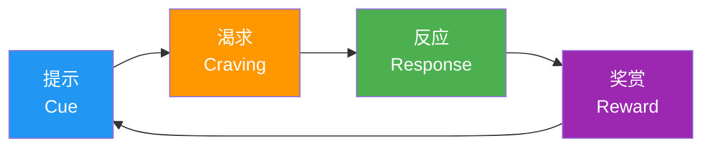
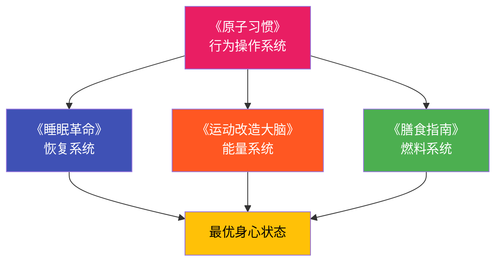

## 八、健康与生活

身体是认知系统的物理载体，是所有思维活动、情绪调节和创造力的物质基础。大脑消耗全身 20% 的能量，神经递质的合成依赖充足的营养，突触可塑性在深度睡眠中完成，注意力的持续时间与心肺功能直接相关。忽略身体健康去追求心智成长，就像在漏水的船上拼命划桨——方向再正确，效率也会被物理限制吞噬。

本节推荐的书籍覆盖健康与生活领域四个核心维度：**睡眠管理**、**运动科学**、**习惯养成**、**饮食营养**。这些不是"养生鸡汤"，而是有扎实科学证据支撑的行为改造指南。每一本都包含可立即执行的操作系统，而非模糊的建议。

---

### 38.《睡眠革命》——尼克·利特尔黑尔斯

**推荐指数：** ★★★★☆
**难度：** ★★☆☆☆
**适合人群：** 睡眠质量差、总觉得睡不够、作息不规律的所有人

#### 为什么这本书重要

尼克·利特尔黑尔斯（Nick Littlehales）是英国顶级运动睡眠教练，曾为曼联、英国自行车队等精英团队提供睡眠咨询。他的核心贡献是将睡眠从"每天必须睡满 8 小时"的刚性指标，转化为基于 90 分钟周期的弹性管理系统。

这个转变意义重大。传统"8 小时睡眠"建议来自统计平均值，但个体差异极大——有些人在 6 小时睡眠后精力充沛，有些人睡 9 小时仍然疲惫。真正决定睡眠质量的不是总时长，而是**完整睡眠周期的数量**。

#### 核心框架：R90 睡眠方案

一个完整的睡眠周期约 90 分钟，包含以下阶段：

| 阶段 | 时长 | 脑电波特征 | 功能 |
|------|------|-----------|------|
| 入睡期（N1） | 5-10 分钟 | α 波→θ 波过渡 | 身体放松，意识模糊 |
| 浅睡期（N2） | 20-25 分钟 | θ 波+睡眠纺锤波 | 体温下降，心率减慢 |
| 深睡期（N3） | 20-40 分钟 | δ 波（慢波睡眠） | 身体修复，免疫增强，生长激素分泌 |
| REM 睡眠 | 10-60 分钟 | β 波（类似清醒） | 记忆巩固，情绪调节，创造性思维 |

每个 90 分钟周期中，深睡和 REM 的比例不同——前半夜以深睡为主（身体修复），后半夜以 REM 为主（大脑整理）。这就是为什么**早醒比晚睡更伤认知**——你可能砍掉了最密集的 REM 阶段。

**R90 方案的操作步骤：**

1. **确定固定起床时间。** 这是整个系统的锚点。选择一个每天（包括周末）都能执行的时间，比如 6:30。
2. **倒推入睡时间。** 以 5 个周期（7.5 小时）为起点，即 23:00 入睡。如果白天精力不足，增加到 6 个周期（9 小时）；如果 4 个周期（6 小时）也能保持良好状态，也可以。
3. **睡前 90 分钟开始"关机程序"。** 调暗灯光，停止屏幕使用，降低室温至 18-20°C，避免剧烈运动和大量进食。
4. **醒来后 90 分钟内完成"开机程序"。** 接触自然光（刺激皮质醇分泌），轻度活动，吃早餐。

**周期不足时的补偿策略：**

如果某晚只睡了 3 个周期（4.5 小时），第二天白天补充一个 90 分钟的"可控修复期"（下午 1-3 点之间的小睡），比当晚提前入睡更重要。利特尔黑尔斯建议不要在 30 分钟内醒来——那意味着你在深睡期被中断，醒后会更困。

#### 常见误区

- **"周末补觉能弥补工作日的睡眠债"。** 错误。睡眠债无法完全"偿还"，周末多睡 2-3 小时只会打乱生物钟，导致周一更难起床。正确做法是保持固定的起床时间，在白天用 20-30 分钟的小睡补充。
- **"睡前喝酒助眠"。** 酒精确实能加快入睡速度，但它会严重破坏后半夜的 REM 睡眠，导致睡眠质量下降 30-40%。
- **"失眠了就躺在床上等"。** 如果 20 分钟内无法入睡，应该起床做些无聊的事（不要看屏幕），等到有困意再回到床上。躺在床上焦虑只会把床和失眠建立条件反射。

#### 与个人提升的关联

睡眠质量直接影响第三章讨论的**专注力管理**和**情绪调节**。睡眠不足 6 小时连续一周后，认知能力下降程度等同于血液酒精浓度 0.1%（超过法定醉驾标准）。如果你想提升阅读效率（本章主题），先确保你的睡眠系统在正常运转。

---

### 39.《运动改造大脑》——约翰·瑞迪

**推荐指数：** ★★★★★
**难度：** ★★★☆☆
**适合人群：** 久坐工作者、想要提升认知能力但不热衷运动的人

#### 为什么这本书重要

约翰·瑞迪（John Ratey）是哈佛医学院精神病学教授，这本书的副标题"Spark"点明了核心观点：运动不是为了让身体好看，而是为了**点燃大脑**。这是第一本系统性地用神经科学证据证明运动对大脑功能有直接改造作用的科普书。

#### 运动如何改造大脑

运动对大脑的影响通过三条通路实现：

**通路一：提升神经递质水平**

运动能同时提升三种关键神经递质的浓度：

| 神经递质 | 功能 | 运动的提升效果 |
|---------|------|--------------|
| 多巴胺 | 动机、奖赏、注意力 | 运动后提升 30-50%，效果持续 2-3 小时 |
| 血清素 | 情绪稳定、睡眠调节 | 规律运动者的基线水平比久坐者高 20% |
| 去甲肾上腺素 | 警觉性、注意力集中 | 中高强度运动后显著提升，效果持续 1-2 小时 |

这三种递质恰好是治疗 ADHD（注意力缺陷多动障碍）和抑郁症药物的主要靶点。瑞迪在书中引用了大量案例：美国纳帕维尔高中的"零时体育课"项目，让学生在第一节课前进行高强度有氧运动，结果这些学生的阅读理解成绩提升了 17%，数学成绩在全州排名第一。

**通路二：促进 BDNF 分泌**

BDNF（脑源性神经营养因子）是大脑的"肥料"，它能促进神经元生长、增强突触连接、保护现有神经元免受损伤。运动是目前已知最有效的 BDNF 自然刺激手段。

关键发现：有氧运动后 BDNF 水平可提升 2-3 倍，效果持续 2-4 小时。这意味着**运动后学习效率最高**。瑞迪建议在需要高强度脑力工作前 30 分钟进行 20 分钟中等强度有氧运动。

**通路三：改善大脑结构**

长期规律运动能在物理层面改变大脑：

- 海马体（记忆中枢）体积增大 2%——相当于逆转 1-2 年的年龄相关萎缩
- 前额叶皮层（执行功能）灰质密度增加
- 白质纤维束完整性提升（信息传递速度更快）

#### 最优运动方案

瑞迪综合了大量研究，给出的运动处方：

**基础方案（每周最低有效量）：**
- 每周 3-5 次有氧运动，每次 30-45 分钟
- 心率维持在最大心率的 65-75%（最大心率 ≈ 220 - 年龄）
- 跑步、游泳、骑车、快走均可

**进阶方案（最大化认知收益）：**
- 有氧运动 + 复杂运动技能结合
- 瑜伽、武术、舞蹈等需要协调性的运动效果更佳——因为它们同时激活运动皮层和认知区域
- 高强度间歇训练（HIIT）每周 1-2 次，BDNF 释放量最大

**最小可行方案（实在没时间时）：**
- 10 分钟快走或爬楼梯，就能产生可测量的注意力提升
- "运动零食"（Exercise Snacks）：每小时起身做 1-2 分钟高强度活动（深蹲、开合跳）

#### 久坐的危害比你想的严重

瑞迪引用了加州大学洛杉矶分校的研究：每天久坐超过 8 小时且不运动的人，海马体萎缩速度比规律运动者快 3 倍。更关键的是，**运动无法完全抵消久坐的危害**——即使你每天锻炼 1 小时，如果剩余 15 个小时都坐着不动，健康风险仍然显著升高。

**对抗久坐的策略：**
- 每 45-60 分钟起身活动 5 分钟（设置闹钟）
- 使用站立式办公桌，每小时切换坐/站
- 电话会议时站着或走动
- 阅读时使用 treadmill desk 或在原地踏步

#### 常见误区

- **"运动太累了，会降低工作效率"。** 短期看，运动后确实有疲劳感；但长期看，规律运动者的基线精力水平比久坐者高 20-30%。关键是找到合适的强度——中等强度运动（微微出汗，能说话但不能唱歌）后应该感到精力充沛，而不是精疲力竭。
- **"没时间运动"。** 这是对优先级的误判。每天 30 分钟运动换来 2-3 小时的高效脑力工作时间，ROI 远高于你节省的那 30 分钟。
- **"散步就够了"。** 散步好于不动，但对 BDNF 的刺激非常有限。要获得显著的认知收益，需要将心率提升到中等强度以上。

#### 与个人提升的关联

运动与本书第三章讨论的**精力管理**直接相关。瑞迪的研究表明：运动是唯一一种同时提升注意力、情绪、记忆力和创造力的行为。如果你在第四章的深度学习中遇到瓶颈（记不住、注意力涣散、情绪低落），先检查你的运动量是否达标，再考虑学习方法的问题。

---

### 40.《原子习惯》——詹姆斯·克利尔

**推荐指数：** ★★★★★
**难度：** ★★☆☆☆
**适合人群：** 所有人——这是习惯养成领域的"第一本书"

#### 为什么这本书重要

詹姆斯·克利尔（James Clear）不是第一个写习惯的人，但他可能是最好的翻译者。查尔斯·杜希格的《习惯的力量》讲了习惯的科学原理，BJ·福格的《福格行为模型》讲了行为设计的理论框架，而克利尔把两者融合成了一个**任何人都能用的四步操作系统**。

这本书的核心洞察是：**你不需要改变目标，你需要改变系统。** 目标决定方向，系统决定进步。奥运冠军和排名第二的选手目标相同（拿金牌），区别在于支撑目标的日常系统。

#### 核心框架：习惯四步法

每个习惯的形成都经历四个阶段，改变习惯也需要从这四个阶段入手：

**四步法的正反操作：**

| 步骤 | 建立好习惯 | 戒除坏习惯 |
|------|-----------|-----------|
| 提示 | 让它显而易见（Make it obvious） | 让它看不见（Make it invisible） |
| 渴求 | 让它有吸引力（Make it attractive） | 让它无吸引力（Make it unattractive） |
| 反应 | 让它简单易行（Make it easy） | 让它难以执行（Make it difficult） |
| 奖赏 | 让它令人满意（Make it satisfying） | 让它令人痛苦（Make it unsatisfying） |

#### 深度拆解：每个步骤的操作细节

**第一步：让它显而易见**

**（1）习惯记分卡。** 列出你一天中的所有习惯（包括无意识的习惯），标记为正面（+）、负面（-）或中性（=）。这个过程本身就有价值——大多数人从未意识到自己有多少无意识的日常行为。

**（2）执行意图（Implementation Intention）。** 不要说"我要多读书"，而是说"我在午饭后回到办公桌前，会打开《XX》读 20 页"。格式：**我将在[时间]于[地点]做[行为]**。

**（3）习惯叠加（Habit Stacking）。** 把新习惯绑定在已有习惯之后："在我[已有习惯]之后，我会[新习惯]"。例如："在我早上冲完咖啡之后，我会坐在书桌前读 10 分钟。"这个技巧利用了已有习惯的神经通路作为新习惯的"提示"。

**（4）环境设计。** 你的行为是环境的函数。想多喝水？把水杯放在桌上最显眼的位置。想少看手机？把手机放在另一个房间。克利尔引用了研究：美国医院食堂把健康食物放在视线高度、把糖果放在不透明容器里后，健康食品的销量提升了 25%，垃圾食品销量下降了 18%——没有任何禁令，纯粹靠环境设计。

**第二步：让它有吸引力**

**（1）诱惑捆绑（Temptation Bundling）。** 把"想做的事"和"需要做的事"绑定在一起。帕基研究的案例：只允许自己在健身房听最喜欢的有声书，结果健身出勤率提升了 51%。

**（2）加入正确的群体。** 人类是社会性动物，我们倾向于模仿三个群体：亲近的人、多数人、有权力的人。加入一个你渴望的习惯已经是常态的群体——想坚持读书就加入读书会，想坚持运动就加入跑团。你不需要刻意模仿，**身份认同会自动驱动行为改变**。

**第三步：让它简单易行**

**（1）两分钟规则。** 任何新习惯的开始版本都应该在 2 分钟内完成。想养成跑步习惯？先从"穿上跑鞋走出家门"开始，不要要求自己跑 5 公里。想养成阅读习惯？先从"每天读一页"开始。关键不是单次行为的效果，而是**重复的次数**——每次你执行了习惯，都在强化相关的神经通路。

**（2）减少阻力。** 预先决定好你的行为。运动前一天晚上把运动服放在床边。阅读前一晚把书翻开放在枕头上。克利尔称之为"减少未来行为的摩擦系数"。

**（3）承诺装置。** 通过预先承诺来限制未来的选择。比如：提前购买健身房年卡（已经花了钱，不去就是浪费），删除手机上的社交媒体 App（需要使用时重新下载，增加了阻力），在朋友圈宣布自己要连续 100 天每天读 30 页书（社会压力）。

**第四步：让它令人满意**

**（1）即时奖赏。** 人类大脑对即时反馈的敏感度远高于延迟反馈。坏习惯之所以容易养成，因为它们的奖赏是即时的（刷手机立刻获得多巴胺）；好习惯的收益是延迟的（读书三个月后才能看到变化）。你需要给好习惯设计即时奖赏。

**操作方法：** 在完成习惯行为后立即给自己一个小奖励——读完 20 页后喝一杯好咖啡，完成运动后洗一个热水澡，写完晨间日记后看 5 分钟喜欢的视频。关键：奖赏必须紧跟行为，间隔越短越好。

**（2）习惯追踪。** 用视觉化的方式记录习惯完成情况——日历上打叉、App 记录、手账打卡。"不要断链"（Don't break the chain）本身成为一种激励。克利尔提醒：**最多只错过一天**——连续错过两天是习惯崩塌的开始。

#### 身份驱动的行为改变

克利尔最深刻的洞察不是四步法，而是**行为改变的三个层次**：

| 层次 | 示例 | 持久性 |
|------|------|--------|
| 结果层 | 我想减掉 10 斤 | 低——目标达成后行为停止 |
| 过程层 | 我每天运动 30 分钟 | 中——靠自律维持 |
| 身份层 | 我是一个运动的人 | 高——行为自然流露 |

最持久的改变从身份层开始，而不是从结果层。不要问"我想达成什么"，而是问"什么样的人能达成这个目标"，然后用每一个小习惯来投票证明"我就是那种人"。每读一页书，你就在投票说"我是一个读者"；每做一次运动，你就在投票说"我是一个运动的人"。

#### 进阶：习惯的复利效应

克利尔用了一个数学类比：每天进步 1%，一年后你会好 37 倍（1.01^365 = 37.78）；每天退步 1%，一年后你几乎归零（0.99^365 = 0.03）。这就是习惯的复利——单个行为微不足道，但累积效应惊人。

然而，复利也有一个阴暗面：**习惯在达到某个临界点之前，回报几乎是不可见的。** 克利尔称之为"失望之谷"（Valley of Disappointment）。大多数人在这个阶段放弃——他们以为进步是线性的，实际上它是指数曲线。突破临界点之前的所有努力都不是浪费，而是在积累势能。

#### 常见误区

- **"21 天就能养成习惯"。** 这个说法来自 1960 年代一位整形外科医生的观察，没有科学依据。伦敦大学学院的研究表明，习惯自动化平均需要 66 天，且因行为复杂度和个人差异在 18-254 天之间波动。
- **"靠意志力坚持"。** 意志力是有限资源，会随着使用而消耗。真正持久的习惯不需要意志力——它们通过四步法设计后会自动化执行。如果你的习惯总是需要意志力来维持，说明系统设计有问题，不是你有问题。
- **"一次改变太多"。** 克利尔建议一次只增加 1-2 个微习惯。当新习惯完全自动化后（不需要有意识地执行），再添加下一个。贪多嚼不烂是习惯养成最常见的失败原因。
- **"错过一天就放弃"。** 偶尔错过一天不会毁掉习惯，但连续错过两天会。克利尔称之为"绝不错过两次"规则——这是应对不完美现实的最佳策略。

---

### 41.《中国居民膳食指南》——中国营养学会

**推荐指数：** ★★★★☆
**难度：** ★★☆☆☆
**适合人群：** 所有关注健康饮食的中文读者

#### 为什么推荐这本而不是其他营养学畅销书

市面上的营养学书籍鱼龙混杂，很多畅销书（如各种"生酮饮食""断食法"）存在过度简化或选择性引用证据的问题。《中国居民膳食指南》由中国营养学会基于大量循证研究编写，每 5-10 年更新一次，是目前**最适合中国人体质和饮食习惯**的科学饮食参考。

#### 核心原则：膳食宝塔与平衡膳食

中国居民膳食指南的核心框架是"平衡膳食宝塔"，从底层到顶层：

**第一层（基础）：谷薯类 250-400g/天**
- 全谷物和杂豆应占 1/3 以上（糙米、燕麦、红豆等）
- 薯类 50-100g/天
- 全谷物的价值：膳食纤维是肠道菌群的主要"食物"，与血糖稳定、情绪调节直接相关

**第二层：蔬菜和水果**
- 蔬菜 300-500g/天，其中深色蔬菜占 1/2 以上
- 水果 200-350g/天
- 蔬菜不能用果汁替代——榨汁破坏了膳食纤维，且浓缩了糖分

**第三层：动物性食物**
- 畜禽肉 40-75g，水产品 40-75g，蛋类 1 个
- 优先级：鱼虾 > 禽肉 > 红肉
- 加工肉制品（香肠、培根、火腿）已被 WHO 列为一类致癌物

**第四层：奶及奶制品、大豆及坚果**
- 奶及奶制品 300-500g/天
- 大豆及坚果 25-35g/天

**第五层（顶层）：油盐**
- 烹调油 25-30g/天
- 盐 < 5g/天（中国人均摄入 10.5g，超标一倍）

**关键提醒：水和运动**
- 饮水量 1500-1700ml/天，不包括食物中的水分
- 每天至少 30 分钟中等强度活动

#### 与大脑功能直接相关的饮食要素

在个人提升的语境下，有几个营养要素特别值得关注：

| 营养素 | 大脑功能影响 | 最佳食物来源 |
|--------|------------|------------|
| Omega-3 脂肪酸 | 神经元细胞膜的主要成分，影响信号传导速度 | 深海鱼（三文鱼、鲭鱼）、亚麻籽、核桃 |
| 铁 | 氧气运输，铁缺乏导致注意力下降和疲劳 | 红肉、动物肝脏、黑木耳、菠菜 |
| 维生素 B12 | 髓鞘合成（保护神经纤维），缺乏导致认知衰退 | 动物性食物，纯素食者需补充剂 |
| 维生素 D | 神经保护，与抑郁症风险负相关 | 日照、蛋黄、深海鱼，中国人缺乏率 >60% |
| 镁 | 参与 300+ 酶反应，缺乏导致焦虑和失眠 | 深绿叶蔬菜、坚果、全谷物 |

#### 常见误区

- **"少吃主食能减肥"。** 短期有效，但长期低碳水饮食会导致大脑供能不足（大脑的首选燃料是葡萄糖）、情绪波动、注意力下降。正确做法是选择优质碳水（全谷物、薯类），控制总量但不戒断。
- **"保健品能替代均衡饮食"。** 食物中的营养素以复合形式存在，彼此协同作用，这是单一补充剂无法复制的。除维生素 D（日照不足时）和 B12（素食者）外，大多数健康人不需要额外补充。
- **"吃得越少越健康"。** 热量不足会触发身体的节能模式——降低基础代谢率、减少大脑能量供应、增加皮质醇（压力激素）。这是为什么节食者常常注意力下降、脾气暴躁。

#### 操作建议

1. **每周采购清单法。** 每周日规划下一周的膳食，列出采购清单。覆盖 12 种以上食物类别，每类至少 2-3 种食材。
2. **"一拳蛋白、两拳蔬菜、一拳碳水"的简易分餐法。** 每餐的盘子里：1/4 优质蛋白（肉/鱼/蛋/豆腐），1/2 蔬菜，1/4 全谷物主食。
3. **提前准备。** 周末洗好切好一周的蔬菜，分装冷冻。减少工作日的烹饪摩擦，让你更容易选择健康食物。

---

### 四本书的阅读顺序与整合建议

这四本书不是孤立的知识点，而是一个**健康操作系统**的四个模块。它们之间的关系如下：

**推荐的阅读顺序：**

1. **先读《原子习惯》。** 习惯是一切行为改变的基础设施。没有可靠的执行系统，再好的知识都无法落地。
2. **然后读《运动改造大脑》。** 运动对认知能力的即时提升效果最显著，是最容易感受到"正反馈"的习惯。
3. **接着读《睡眠革命》。** 睡眠和运动互相增强——运动改善睡眠质量，好的睡眠提升运动表现和恢复速度。
4. **最后读《膳食指南》。** 饮食是最后优化的变量——它的效果最隐蔽，但在前三者建立好之后，饮食优化会带来最后 10-20% 的提升。

**一个整合性实践方案（第 1-4 周）：**

| 周次 | 行动 | 时长 |
|------|------|------|
| 第 1 周 | 固定起床时间（±15 分钟），睡前 90 分钟关机 | 每天 |
| 第 2 周 | 每天 20 分钟快走或慢跑（早饭后或午饭后） | 每天 |
| 第 3 周 | 记录每日饮食，用"一拳法"调整每餐结构 | 每天 |
| 第 4 周 | 复盘前三周，用习惯叠加法将三个习惯连接成链 | 每天 |

到第 4 周结束时，你应该能感受到：精力更充沛、注意力更持久、情绪更稳定、睡眠质量提升。这些不是鸡汤式的安慰，而是神经科学可预测的生理变化。

***

