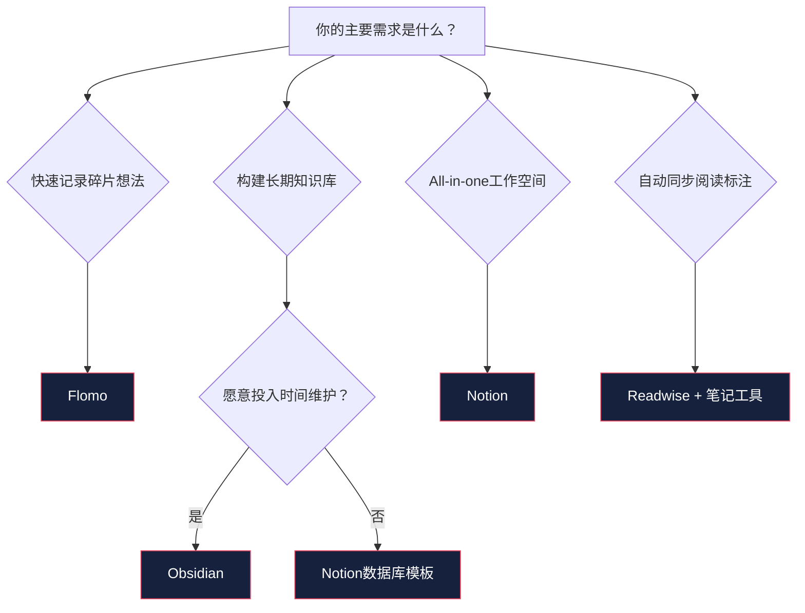
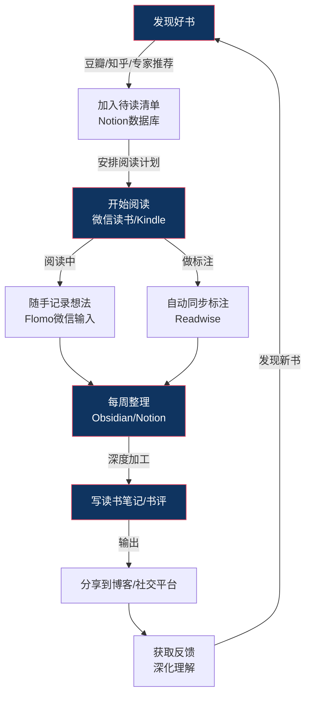

## 阅读工具与平台推荐

工具不是目的，但好的工具能将阅读效率提升数倍。本节从"选书—购书—阅读—笔记—知识管理"的完整链路出发，系统梳理每个环节的最佳工具与平台，并给出针对不同读者群体的组合推荐方案。

### 工具选型的核心原则

在推荐具体工具之前，先确立选工具的底层逻辑：

**匹配阅读场景，而非追逐功能堆砌。** 一个每天通勤路上读书30分钟的人，和一个周末在家深度阅读3小时的人，需要的工具完全不同。前者需要手机端体验优秀、支持离线的App；后者可能更需要一个大屏幕、低干扰的阅读器。

**工具链的连贯性比单点最优更重要。** 如果你在Kindle上做标注，但笔记工具无法导入Kindle标注，那么每次整理笔记都需要手动复制——这个摩擦力会在三个月内摧毁你的笔记习惯。理想状态是：标注→同步→整理→回顾，形成一条无摩擦的流水线。

**先用免费工具验证需求，再付费升级。** 很多人买了昂贵的工具后发现根本用不上那些高级功能。先用免费版本跑通完整的阅读流程，确认自己的真实需求后，再针对性地付费。

### 选书发现平台

选书是阅读链路的起点。选错一本书，浪费的不只是购书费用，更是你投入的数小时阅读时间。以下平台可以帮你做出更明智的选择。

#### 豆瓣读书

**定位：** 中国最大、最活跃的读书社区，中文世界选书的第一站。

**核心功能：**
- **评分系统：** 豆瓣评分是中文读者最广泛参考的质量指标。一般而言，8.0分以上是好书，7.0-8.0之间是中等偏上，7.0以下需要谨慎。但要注意，评分人数也很重要——一本只有50人评8.5分的书，不如5000人评7.8分的书可靠，因为大样本更稳定。
- **书评与短评：** 书评区的长文评论往往比评分更有参考价值。关注那些写过大量高质量书评的用户，他们的推荐列表本身就是一份精选书单。
- **书单功能：** 搜索"XX领域书单"，可以找到其他读者整理的主题书单。好的书单通常有清晰的选书逻辑和难度分级。
- **标记系统：** "想读/在读/读过"三状态标记，帮你追踪自己的阅读轨迹。

**使用技巧：**
- 在决定是否读一本书之前，先看3-5条标记为"有用"最多的短评，尤其是那些给出3-4星（而非5星）的评价——它们通常更客观。
- 豆瓣小组（如"买书如山倒读书如抽丝""我们都爱看闲书"）中有大量书友的真实推荐和踩坑经验。
- 警惕"水军书评"：如果一本书刚出版就有大量五星好评，且评论内容高度相似，很可能是营销行为。

#### Goodreads

**定位：** 全球最大的读书社区（亚马逊旗下），英文书籍选书的首选平台。

**核心功能：**
- **年度Choice Awards：** 每年由读者投票选出各类型最佳书籍，是发现当年好书的高效途径。
- **Shelf系统：** 比豆瓣更灵活的书架分类，支持自定义标签（如"2024读过""技术书""重读清单"）。
- **Reading Challenge：** 年度阅读挑战功能，设定目标后自动追踪进度，有社群激励效果。
- **Similar Books推荐：** 算法推荐与你当前在读的书相似的其他书籍。

**使用场景：** 如果你需要阅读英文原版书，Goodreads的评分和评论比豆瓣更有参考价值。它的评分体系比豆瓣更"宽松"——3.5分在Goodreads上已经算不错，相当于豆瓣的7.5分左右。

#### 知乎

**定位：** 中文问答社区，深度书评和专业领域推荐的重要来源。

**使用方法：**
- 搜索"XX领域 入门书籍推荐"或"XX领域 必读书单"，通常会有专业人士给出带有详细说明的推荐。
- 关注该领域的活跃答主，他们的个人主页往往有"回答过的阅读相关问题"汇总。
- 知乎的"书店"板块也提供电子书购买，但价格优势不大。

**优势：** 知乎推荐的优势在于"理由充分"——推荐者通常会解释为什么推荐这本书、适合什么阶段的读者、与其他同类书的对比。这比豆瓣的纯评分更有决策参考价值。

#### 其他选书渠道

| 渠道 | 适用场景 | 操作方法 |
|------|---------|---------|
| **Amazon关联推荐** | 发现同主题更多选择 | "买了这本书的人还买了"功能，输入一本你喜欢的书，查看推荐列表 |
| **出版社官方账号** | 跟踪优质出版社的新书 | 关注中信、三联、商务印书馆、机械工业出版社、人民邮电出版社的微博/公众号 |
| **学者/专家推荐** | 专业领域选书 | 在该领域的KOL博客、播客、公众号中搜索他们的推荐书单 |
| **学术引用追踪** | 进阶学习选书 | 一本好书的参考文献列表就是该领域的经典书单；用Google Scholar追踪引用它的论文和书籍 |
| **播客推荐** | 跨领域发现 | 《随机波动》《忽左忽右》《翻转电台》等知识类播客经常推荐好书 |

#### 选书的六条铁律

掌握了选书平台之后，还需要一套筛选标准来过滤信息。以下是经过大量读者验证的选书方法论：

**第一条：先看书评数量和评分分布，不只看平均分。** 一本5000人评价的7.8分书，通常比50人评价的9.0分书更可靠。评分分布也很关键——如果一本书的评分集中在4星和5星，说明读者群体高度认可；如果1星和5星各占一半，说明这本书有争议性，可能适合特定人群但不适合所有人。

**第二条：优先看领域专家的推荐，而非畅销榜。** 畅销榜反映的是大众偏好和营销力度，不是书籍质量。一个在该领域深耕十年的研究者推荐的书，往往比畅销榜前三更有学习价值。如何找到专家推荐？去该领域的学术会议网站、知名学者的个人主页、专业期刊的年度书评专栏。

**第三条：一本书的参考文献是宝库。** 《思考，快与慢》引用了数百篇论文和数十本著作，这些引用本身就是行为经济学的经典文献。学会"顺藤摸瓜"——从一本好书的参考文献出发，可以构建出整个领域的知识图谱。

**第四条：畅销不等于高质量，但经典经过时间检验。** 一本出版超过20年仍在再版的书，几乎可以确定是该领域的经典。比如《人性的弱点》（1936年出版）至今仍是有价值的人际关系指南。而很多一时畅销的书，三年后就无人问津。

**第五条：试读前30页再做决定。** 这个方法来自美国作家Nancy Pearl的"50页规则"，考虑到中文阅读速度，30页已经足够判断一本书是否值得继续。如果30页后你仍然提不起兴趣，或者觉得内容太浅/太深，果断放弃。时间是比书价更贵的资源。

**第六条：关注出版社和译者。** 中文世界里，出版社是质量的重要信号。以下出版社的选书标准普遍较高：

| 出版社 | 擅长领域 | 质量信号 |
|--------|---------|---------|
| 中信出版社 | 商业、经济、科普 | 选题前沿，翻译质量整体不错 |
| 三联书店 | 人文、社科、文学 | 学术严谨，编辑水平高 |
| 商务印书馆 | 学术经典、工具书 | 百年老店，学术权威 |
| 机械工业出版社 | 技术、管理、教育 | 专业领域覆盖广 |
| 人民邮电出版社 | 计算机、通信、技术 | 技术书翻译质量有保障 |
| 上海译文出版社 | 外国文学、社科翻译 | 译者阵容强大 |
| 译林出版社 | 外国文学 | 经典文学翻译首选 |
| 后浪出版公司 | 艺术、设计、生活 | 选题独特，装帧精美 |

翻译书还要看译者——同一个作者的同一本书，不同译者的版本可能天差地别。在豆瓣上搜索该书的不同版本，对比评分，选择评分更高的译本。

### 电子书阅读平台

电子书不是纸质书的劣质替代品，而是一种有独特优势的阅读媒介。电子书可以全文搜索、即时查词、同步标注、携带万本书出门——这些是纸质书做不到的。以下详细对比主流电子书平台。

#### 微信读书

**定位：** 国内用户量最大的免费+付费混合模式电子书平台。

**核心优势：**
- **免费资源丰富：** 大量出版书籍可以通过"无限卡"或"阅读时长兑换"免费阅读。相比Kindle动辄几十元一本，微信读书的获取门槛极低。
- **社交功能：** 可以看到微信好友在读什么书、他们的标注和想法。这个功能有两面性——一方面可以发现好书，另一方面可能产生"社交压力"。建议根据自己的需求选择是否开启。
- **多端同步：** 手机、平板、电脑、网页全平台覆盖，阅读进度和标注实时同步。
- **AI问书：** 2024年推出的AI辅助功能，可以对书中内容提问，快速获取关键信息。

**使用技巧：**
- 利用"阅读时长兑换无限卡"机制——每天阅读30分钟以上，基本可以持续获得免费阅读权限。
- 开启"翻页模式"而非"滚动模式"，翻页模式的阅读体验更接近纸质书，有助于保持专注。
- 善用"书架分组"功能，按"正在读""待读""已读"分类管理，避免书架变成垃圾堆。
- 标注功能支持"写想法"，建议每次标注时至少写一句自己的理解，而非仅仅划线。

**局限性：**
- 部分书籍只有会员才能阅读，会员价格约19元/月。
- 出版书籍的覆盖范围不如Kindle商店全面，尤其是英文原版书几乎缺失。
- 长时间在手机上阅读容易被通知打扰，建议开启"专注模式"。

#### Kindle

**定位：** 全球最大的电子书生态，以硬件（电子墨水屏阅读器）为核心体验。

**注意：** 亚马逊中国Kindle电子书店已于2023年6月停止运营，但Kindle设备仍可通过导入外部电子书使用。国际版Kindle账号仍可访问全球Kindle商店。

**核心优势：**
- **电子墨水屏：** E-Ink屏幕的显示效果最接近纸质书，不发光、不刺眼，长时间阅读眼睛疲劳远低于手机/平板。这是Kindle最大的不可替代优势。
- **超长续航：** 一次充电可使用数周，远超手机和平板。
- **无干扰环境：** 没有微信通知、没有短视频诱惑，是一个纯粹的阅读空间。
- **标注导出：** Kindle的标注保存在`My Clippings.txt`文件中，可以导出到笔记工具进行二次整理。

**使用建议（中国市场）：**
- 从Z-Library、鸠摩搜书、微信读书导出等渠道获取EPUB/MOBI格式电子书，通过USB或Send to Kindle功能导入设备。
- 安装Calibre软件管理电子书库——Calibre是免费开源的电子书管理工具，支持格式转换、元数据编辑、批量传输。
- 如果预算充足，Kindle Oasis或Kindle Paperwhite Signature Edition的阅读体验最佳；预算有限则选择基础款Paperwhite。

#### 得到App

**定位：** 知识付费平台，核心产品是"听书"（书籍解读）和"电子书"。

**核心优势：**
- **书籍解读：** 由专业解读人将一本书浓缩为20-30分钟的音频精华。适合在通勤、做家务时"听书"。
- **课程体系：** 大量由专家学者主讲的系统课程，深度超过一般书籍。
- **电子书库：** 得到电子书的质量较高，排版精良，部分独家内容在其他平台买不到。

**适合人群：**
- 时间极度紧张，无法大量阅读原文的职场人。
- 需要快速了解一个新领域全貌的人。
- 喜欢音频学习方式的人。

**注意事项：**
- 听书≠读书。听书是"了解"一本书，不是"读完"一本书。对于真正重要的书，听书只能作为入门引导，不能替代原文阅读。
- 得到的会员费用较高（约365元/年），需要评估自己的使用频率。
- 警惕"知识焦虑"——不要因为"听了很多书"就觉得自己学到了。真正的学习需要主动思考和实践。

#### 多看阅读

**定位：** 小米旗下阅读App，以精美排版著称。

**核心优势：**
- **排版质量：** 多看阅读的中文排版是所有电子书平台中最好的——字体、行距、段间距、标点处理都经过精心调整。
- **格式支持：** 原生支持EPUB、PDF、TXT等多种格式，导入外部书籍非常方便。
- **笔记导出：** 支持将标注和笔记导出为TXT或Evernote格式。

**适合人群：** 对排版有洁癖的读者，以及需要导入大量外部电子书的用户。

#### 豆瓣阅读

**定位：** 豆瓣旗下的原创文学和独立出版平台。

**核心优势：**
- **原创内容：** 大量高质量的原创中短篇小说、非虚构作品，这些内容在其他平台买不到。
- **独立出版：** 支持独立作者自出版，题材多样，经常出现令人惊喜的作品。
- **社区联动：** 与豆瓣读书社区无缝衔接，可以直接看到书评和讨论。

**适合人群：** 文学爱好者，尤其是喜欢发现新锐作者和小众作品的读者。

#### 电子书平台对比总览

| 维度 | 微信读书 | Kindle（国际版） | 得到 | 多看阅读 | 豆瓣阅读 |
|------|---------|-----------------|------|---------|---------|
| **书库规模** | ★★★★ | ★★★★★ | ★★★ | ★★★ | ★★★ |
| **免费资源** | ★★★★★ | ★★ | ★★ | ★★★ | ★★ |
| **排版质量** | ★★★ | ★★★★ | ★★★★★ | ★★★★★ | ★★★★ |
| **笔记功能** | ★★★★ | ★★★ | ★★★★ | ★★★★ | ★★★ |
| **跨平台同步** | ★★★★★ | ★★★★ | ★★★★★ | ★★★ | ★★★ |
| **硬件阅读器** | 无 | E-Ink设备 | 无 | 无 | 无 |
| **英文书覆盖** | ★ | ★★★★★ | ★ | ★★ | ★ |
| **社交功能** | ★★★★★ | ★ | ★★★ | ★ | ★★★★ |

### 纸质书购买渠道

电子书方便，但纸质书在某些场景下不可替代：深度阅读、需要来回翻阅的参考书、以及收藏价值高的经典。以下是购买纸质书的主要渠道和省钱技巧。

#### 购买渠道对比

| 渠道 | 价格优势 | 品种覆盖 | 特殊优势 |
|------|---------|---------|---------|
| **京东** | 自营经常有满减活动（满100减50） | 品种齐全 | 物流最快，次日达 |
| **当当网** | 图书起家，价格有竞争力 | 最全面的中文书库 | 专注图书品类 |
| **淘宝/天猫** | 第三方店铺价格低 | 最全 | 可以找到绝版书 |
| **拼多多** | 价格最低 | 覆盖主流书籍 | 注意辨别正版/影印版 |
| **多抓鱼** | 二手书，价格约原价3-5折 | 热门书为主 | 品相有保障，环保 |
| **孔夫子旧书网** | 绝版书、稀缺书 | 最全的旧书市场 | 找绝版书的最后手段 |
| **出版社官方网店** | 偶有独家签名版 | 仅该社出版物 | 支持作者和出版社 |

#### 省钱购书策略

**等大促节点买书。** 京东618、双11、423世界读书日期间，图书满减力度最大。京东自营图书经常有"满100减50"的活动，叠加优惠券可以做到4折左右。提前把想买的书加入购物车，等大促时一次性下单。

**善用多抓鱼。** 多抓鱼是国内最大的二手书交易平台，书籍经过翻新消毒后品相有保证。价格通常是原价的3-5折，而且卖出旧书的收入可以直接用于购买新书，形成"以书养书"的循环。

**关注出版社自营渠道。** 一些出版社（如后浪、新星）的官方网店会不定期推出签名版、典藏版，价格与普通版相同，但具有收藏价值。

**图书馆借阅。** 不要忽视图书馆——尤其是大学图书馆和市级图书馆，藏书量往往超出你的想象。很多图书馆还提供电子书借阅服务（如超星、中文在线），完全免费。

### 笔记与知识管理工具

阅读而不做笔记，就像往漏水的桶里倒水。笔记工具是阅读链路中最关键的一环——它决定了你读过的内容能否真正转化为你的知识。以下从不同使用场景出发，详细分析各类笔记工具。

#### 工具选择的底层逻辑

在选择笔记工具之前，先想清楚两个问题：

**问题一：你的笔记目的是什么？**
- 如果是为了"记录"（保存原文信息），需要强大的搜索和剪藏功能。
- 如果是为了"理解"（用自己的话重述），需要支持长文写作和自由格式输入。
- 如果是为了"创造"（将知识转化为输出），需要支持双向链接、图谱等知识网络功能。

**问题二：你愿意投入多少时间维护笔记系统？**
- 如果不想花时间维护：选择"自动同步型"工具（如Readwise + Notion自动同步）。
- 如果愿意精心整理：选择"灵活自定义型"工具（如Obsidian、Logseq）。

#### 卡片笔记工具：Flomo（浮墨笔记）

**定位：** 极简主义的卡片式笔记工具，灵感来自卢曼卡片盒笔记法。

**核心理念：** 不追求大而全的笔记系统，而是鼓励你随时记录碎片化的想法。每条笔记就像一张卡片，简单、快速、零负担。

**核心功能：**
- **微信输入：** 关注Flomo的微信服务号后，可以直接在微信里发送消息给自己，自动同步到Flomo。这是Flomo最杀手级的功能——你不需要切换到另一个App，在最常用的微信里就能记录。
- **标签系统：** 用`#标签`组织笔记，支持多级标签（如`#阅读/心理学`）。
- **每日回顾：** 每天随机推送你过去的笔记，帮你"偶遇"旧想法，激发新灵感。
- **API接口：** 支持通过API自动导入数据，可以对接Readwise等工具。

**最佳实践：**
- 每条笔记只记一个想法，不要写成长文章。保持卡片的原子性。
- 标签不宜过多，控制在20个以内。标签太多等于没有标签。
- 每天花5分钟回顾今天的笔记，每周花15分钟回顾本周的精华笔记。

**适合人群：** 不想维护复杂系统、只想快速记录想法的人。特别适合阅读时的灵感捕捉。

#### 双链笔记工具：Obsidian

**定位：** 本地优先的双链笔记工具，构建个人知识库的利器。

**核心优势：**
- **本地存储：** 所有笔记以Markdown文件形式保存在本地，数据完全在你手里。不依赖任何云服务，不怕平台倒闭。
- **双向链接：** 用`[[笔记名]]`语法创建笔记之间的双向链接，形成知识网络。当你链接了足够多的笔记，知识图谱会自然浮现。
- **插件生态：** 超过1000个社区插件，几乎可以实现任何功能——日历视图、看板、Anki卡片生成、Zotero文献管理集成等。
- **免费：** 核心功能完全免费，只有同步和发布需要付费。

**使用建议：**
- 不要一开始就安装大量插件。先用原生功能跑通基本流程，再根据实际需求逐步添加插件。
- 用"PARA"方法组织文件夹：Projects（项目）、Areas（领域）、Resources（资源）、Archives（归档）。
- 定期维护笔记之间的链接——新读完一本书后，花10分钟把它链接到已有的相关笔记。
- 同步方案推荐：使用Obsidian官方同步服务（$8/月），或者用iCloud/坚果云进行免费同步。

**适合人群：** 有耐心构建长期知识系统的人，尤其是研究者、写作者和终身学习者。

#### 全能型工具：Notion

**定位：** All-in-one工作空间，笔记只是其功能之一。

**核心优势：**
- **模板系统：** 丰富的社区模板，包括阅读追踪器、书评模板、知识库模板等。
- **数据库视图：** 可以把笔记组织成表格、看板、日历、画廊等多种视图。
- **协作功能：** 支持多人协作，适合团队共享知识库。
- **Web Clipper：** 官方浏览器插件，一键保存网页内容到Notion。

**阅读笔记模板示例：**

| 字段 | 类型 | 用途 |
|------|------|------|
| 书名 | Title | 书籍名称 |
| 作者 | Text | 作者信息 |
| 分类 | Select | 领域分类 |
| 状态 | Select | 在读/已读/弃读 |
| 评分 | Rating | 1-5星个人评分 |
| 开始日期 | Date | 开始阅读日期 |
| 完成日期 | Date | 完成阅读日期 |
| 核心观点 | Text | 3个最重要的观点 |
| 行动项 | Checkbox | 从这本书中提炼的可执行行动 |
| 书评 | Long Text | 完整书评 |

**局限性：**
- 不支持离线使用（免费版），没有网络时无法访问笔记。
- 数据存储在Notion的服务器上，存在平台依赖风险。
- 中文搜索偶尔有Bug，不如Obsidian的本地搜索稳定。

#### 经典笔记工具：印象笔记（Evernote）

**定位：** 老牌笔记工具，以强大的网页剪藏和搜索功能著称。

**核心功能：**
- **网页剪藏：** Evernote的浏览器插件是所有笔记工具中最好的之一，可以完整保存网页内容，包括图片和格式。
- **OCR搜索：** 可以搜索图片中的文字——拍一张纸质书的照片，以后可以搜到其中的文字。
- **跨设备同步：** 免费版支持2台设备同步，付费版无限制。

**现状评估：** Evernote近年来发展缓慢，免费版限制越来越多（每月上传限额60MB，仅支持2台设备）。如果你已经是Evernote用户，可以继续使用；如果是新用户，建议优先考虑Notion或Obsidian。

#### 阅读标注同步工具：Readwise

**定位：** 专注于阅读标注的自动同步和回顾。

**核心功能：**
- **自动导入：** 自动同步Kindle、微信读书、Apple Books、Instapaper、Pocket等平台的高亮标注。你读完一本书后，所有标注已经自动出现在Readwise中。
- **每日回顾：** 每天通过邮件或App推送你过去的标注，利用间隔重复原理帮助你记住读过的内容。
- **导出到笔记工具：** 可以将标注一键导出到Notion、Obsidian、Roam Research等工具。
- **Twitter推文收藏：** 可以收藏Twitter推文并纳入回顾系统。

**使用流程：**
1. 在Kindle/微信读书中正常阅读和标注。
2. Readwise自动同步所有标注。
3. 每天早上花3-5分钟回顾Readwise推送的旧标注。
4. 发现有价值的标注，一键导出到Obsidian/Notion进行深度加工。

**定价：** $8.99/月（约65元/月），年付有折扣。对于每天阅读的人来说，这个投入是值得的。

**适合人群：** 在Kindle/微信读书上有大量标注、但苦于无法有效回顾的人。

#### 笔记工具选择决策树

### 阅读效率工具

除了笔记工具，还有一些工具专门用于提升阅读效率——帮你更快地阅读、更好地理解、更持久地记忆。

#### 速读训练工具

**Spreeder（网页版/桌面版）**
- **原理：** 基于RSVP（快速序列视觉呈现）技术，将文本一个词一个词地快速显示在屏幕中央，消除回视和眼跳，迫使你的大脑跟上速度。
- **使用方法：** 从每分钟300词开始，每周增加50词，逐步训练到每分钟600-800词。
- **局限性：** 适合阅读信息密集型文本（新闻、报告），不适合文学作品和需要深度思考的材料。

**Readlax（网页版）**
- 结合速读训练和阅读理解测试，帮你评估速读后的真实理解率。
- 提供眼动训练小游戏，改善阅读时的眼球运动效率。

#### 词典与翻译工具

| 工具 | 平台 | 核心优势 | 推荐场景 |
|------|------|---------|---------|
| **欧路词典** | iOS/Android/Mac/Windows | 支持加载第三方词库，划词翻译 | 英文阅读时的查词工具首选 |
| **DeepL** | 全平台 | 翻译质量最高，支持文档翻译 | 翻译整段/整页英文内容 |
| **沙拉查词** | 浏览器插件 | 划词翻译，支持多词典同时查询 | 网页英文阅读 |
| **有道词典** | 全平台 | 中文释义详细，例句丰富 | 英语学习者 |
| **Pleco** | iOS/Android | 最好的中文字典App | 外国人学中文/查古文 |

**英文阅读的词典配置建议：** 使用欧路词典，加载牛津高阶、朗文当代、柯林斯三本词典的离线包。阅读时遇到生词，长按即可查看三本词典的释义——不同词典的解释角度不同，交叉参照理解更准确。

#### RSS与信息聚合工具

如果你想持续获取优质阅读材料，RSS是最高效的信息获取方式——它帮你绕过算法推荐，直接订阅你想看的内容源。

**Inoreader / Feedly**
- 订阅你关注的博客、新闻网站、学术期刊的RSS源。
- 自动聚合更新，按分类整理，消除信息噪音。
- 比每天刷社交媒体获取信息的效率高10倍以上。

**推荐阅读源示例：**

| 类型 | 推荐源 | 说明 |
|------|--------|------|
| 综合知识 | 端传媒、少数派、利器 | 高质量中文内容 |
| 技术 | Hacker News、InfoQ、掘金 | 技术前沿动态 |
| 学术 | arXiv RSS、Google Scholar Alerts | 学术论文追踪 |
| 深度长文 | 纽约客、大西洋月刊、经济学人 | 英文深度报道 |
| 中文博客 | 月光博客、阮一峰的网络日志、酷壳 | 技术与思考 |

### 阅读环境优化工具

阅读环境对阅读质量的影响常被低估。一个安静、舒适、无干扰的环境，可以将阅读效率提升30%以上。

#### 专注与防打扰

**Forest（专注森林）**
- 设定专注时间后种下一棵虚拟树，中途退出App树就会枯萎。游戏化的设计让专注变得有趣。
- 可以设定白名单App（如词典），查词不会导致树枯萎。

**番茄钟工具**
- 推荐使用物理番茄钟（厨房计时器）而非手机App，因为拿起手机本身就是一个分心的触发点。
- 如果必须用App，推荐`Flat Tomato`（iOS）或`Pomodoro Timer`（Android），界面简洁无广告。

#### 阅读灯光与姿势

**护眼台灯推荐标准：**
- 色温：4000K（中性白光），既不偏黄（容易困）也不偏蓝（刺眼）。
- 照度：桌面500lux以上，达到国家AA级照度标准。
- 显色指数：Ra≥90，色彩还原度高。
- 推荐品牌：明基ScreenBar（屏幕挂灯，不占桌面空间）、米家台灯Pro（性价比高）。

**阅读姿势提醒：** 使用`Posture Reminder`等App，每30分钟提醒你调整坐姿。长期低头阅读会导致颈椎问题，建议使用阅读支架将书/平板抬高到视线水平位置。

#### 白噪音与背景音

**Noisli（网页版/App）**
- 自定义混合雨声、风声、咖啡厅噪音等环境音。
- 研究表明，适度的环境噪音（约70分贝）可以提升创造性思维。

**Brain.fm**
- 基于神经科学研究的AI生成背景音乐，声称可以提升专注力。
- 提供"专注""放松""睡眠"三种模式，阅读时使用"专注"模式。

### 不同读者群体的工具组合推荐

理论分析够了，以下给出针对不同类型读者的具体工具组合方案。每个方案都是经过验证的"开箱即用"配置。

#### 学生党（预算有限，以学习为主）

**选书：** 豆瓣读书 + 知乎书单推荐
**阅读：** 微信读书（免费）+ 学校图书馆电子资源
**笔记：** Obsidian（免费）+ Flomo（免费版）
**效率：** 欧路词典（免费版）+ Forest专注App

**月度成本：** 0元

**配置理由：** 学生的时间相对充裕但预算有限，微信读书的免费资源加上学校图书馆基本够用。Obsidian免费且功能强大，适合从零开始构建知识库。Flomo用于课堂和阅读中的碎片化记录。

#### 职场人（时间紧张，追求效率）

**选书：** 豆瓣读书 + 领域专家推荐
**阅读：** 得到App（听书）+ 微信读书会员 + Kindle
**笔记：** Readwise + Notion（自动同步标注）
**效率：** 沙拉查词 + 番茄钟 + RSS信息聚合

**月度成本：** 约100-150元

**配置理由：** 职场人时间碎片化严重，需要"听书"来利用通勤时间。Readwise + Notion的自动同步链路消除了手动整理笔记的时间成本。微信读书会员解锁更多书籍，Kindle用于深度阅读。

#### 研究者/写作者（深度阅读，构建知识体系）

**选书：** Goodreads + Google Scholar + 学术引用追踪
**阅读：** Kindle + 电脑端PDF阅读器（如MarginNote）
**笔记：** Obsidian + Zotero（文献管理）+ Readwise
**效率：** DeepL翻译 + 欧路词典 + Inoreader RSS

**月度成本：** 约150-200元

**配置理由：** 研究者需要处理大量英文文献，Zotero管理引用和PDF，Obsidian构建知识图谱，Readwise桥接两者的标注数据。MarginNote可以在PDF上做结构化笔记，适合学术论文的精读。

#### 家庭阅读者（亲子阅读，培养习惯）

**选书：** 豆瓣读书 + 学校推荐书单 + 图书馆
**阅读：** 微信读书 + 纸质书（京东/多抓鱼）
**笔记：** Flomo（记录读书感悟）+ 朋友圈/读书群分享
**效率：** 无特殊需求

**月度成本：** 约30-50元

**配置理由：** 家庭阅读者的核心需求不是效率，而是习惯养成和社交激励。微信读书的好友在读功能可以形成阅读社群，纸质书适合亲子共读。Flomo记录每天的阅读感悟，积累起来就是一份珍贵的阅读日记。

### 避免工具陷阱：常见误区与纠正

#### 误区一：工具收集症

**症状：** 不断尝试新工具，每个工具都浅尝辄止。Notion用了两个月觉得太重，换Obsidian；Obsidian用了三个月觉得插件太复杂，换Flomo；Flomo用了一个月觉得功能太少，又换回Notion……

**根源：** 把"选工具"当成了"做准备"，本质上是拖延行为。你以为自己在为阅读做准备，其实你是在逃避真正的阅读。

**纠正方法：** 给自己一个规则——选定一套工具后，至少使用三个月再评估是否更换。三个月足够形成习惯，也足够判断工具是否适合你。工具不完美是正常的，没有完美的工具。

#### 误区二：过度设计笔记系统

**症状：** 花大量时间设计精美的Notion模板、Obsidian工作流，但实际记的笔记寥寥无几。笔记系统的"完成度"远高于笔记内容的"填充度"。

**根源：** 设计系统带来即时的满足感（"看，我多有条理！"），而记笔记需要长期坚持才有回报。大脑天然倾向于选择即时满足。

**纠正方法：** 先记100条笔记，再考虑系统化。100条笔记之后，你会自然知道自己的笔记习惯是什么样的，再根据实际情况设计系统，而不是凭空想象。

#### 误区三：忽视数据可导出性

**症状：** 在某个平台积累了大量笔记和标注，后来想换平台，发现数据无法导出，或者导出后格式混乱。

**根源：** 选择工具时只看功能，不看数据可迁移性。

**纠正方法：** 选择工具时，第一个问题不是"它能做什么"，而是"我的数据能带走吗"。优先选择支持标准格式（Markdown、JSON、CSV）导出的工具。Obsidian（本地Markdown文件）和Notion（支持导出为Markdown/CSV）在这方面做得最好。

#### 误区四：过度依赖自动化

**症状：** 设置了Readwise自动同步、Notion自动整理、RSS自动推送……但从来不回顾这些自动化收集的内容。自动化的结果是：你的笔记库变成了一个永远不会被翻阅的"数字坟场"。

**根源：** 自动化解决了"收集"的问题，但没有解决"消化"的问题。

**纠正方法：** 自动化是手段，不是目的。设置一个固定时间（比如每天早上15分钟），回顾自动化收集的内容。不需要每条都深入处理——快速浏览，只对真正有价值的内容进行深度加工。

### 工具进阶：构建你的个人阅读系统

当你使用工具一段时间后，可以开始考虑将各个工具串联成一个完整的系统。

#### 推荐阅读工作流

#### 系统搭建的三个阶段

**第一阶段（第1-2周）：建立最小可行系统。**
- 注册微信读书 + 安装Flomo。
- 开始阅读，在Flomo中记录每本书的3个关键想法。
- 不需要任何复杂系统，先跑起来。

**第二阶段（第3-8周）：完善笔记系统。**
- 根据你的实际使用习惯，选择Obsidian或Notion作为主笔记工具。
- 建立简单的书籍数据库（书名、作者、分类、评分、核心观点）。
- 开始使用Readwise同步阅读标注。

**第三阶段（第9周以后）：优化与自动化。**
- 建立固定的信息输入管道（RSS订阅）。
- 设计笔记模板，标准化书评写作流程。
- 建立定期回顾机制（每周回顾、每月总结）。

#### 数据备份策略

你的阅读笔记是宝贵的知识资产，必须做好备份：

- **本地备份：** 如果使用Obsidian，笔记本身就是本地Markdown文件，用Git版本控制即可。建议每天自动commit一次。
- **云端备份：** Notion数据定期导出为Markdown存档。微信读书标注通过Readwise同步后，再导出到本地。
- **3-2-1备份原则：** 至少3份副本，存储在2种不同介质上，其中1份在异地（如云端）。

### 本节核心要点

1. **工具服务于流程，不要本末倒置。** 先确定你的阅读流程，再选择匹配的工具。
2. **选书是最重要的环节。** 花10分钟选一本好书，比花10小时读一本烂书有价值得多。豆瓣读书、专家推荐、参考文献追踪是选书的三大法宝。
3. **笔记工具的核心不是功能丰富，而是你愿意持续使用。** Flomo的极简设计反而可能比Notion的复杂模板更有效。
4. **Readwise是连接"阅读"和"笔记"的关键桥梁。** 如果你在Kindle/微信读书上有大量标注，Readwise值得投资。
5. **先用免费工具验证需求，再付费升级。** 不要在还没开始阅读之前就花大量金钱购买工具。
6. **避免工具陷阱：** 不要让"选工具"和"设计系统"成为逃避阅读的借口。先读起来，工具自然会迭代到位。

