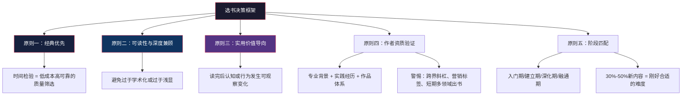
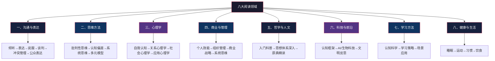
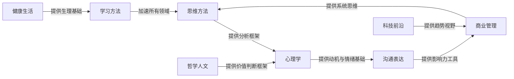
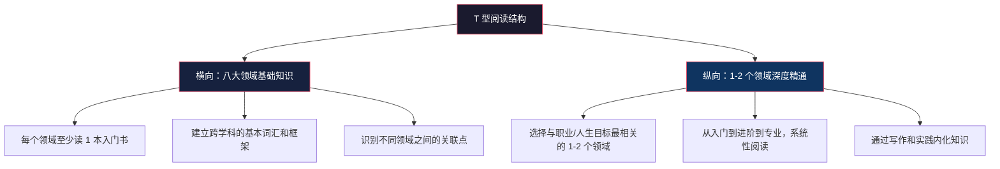

## 本节总结

本节从选书方法论出发，按八大领域推荐了 50+ 本精选书籍，并梳理了阅读工具与平台生态。这一节的核心目标不是给你一份"买书清单"，而是帮你建立一套**可持续运转的选书-读书-用书系统**。以下是对整个产品推荐节的全面回顾、知识整合与行动指引。

### 一、选书方法论回顾

选书能力是阅读能力的前置环节。本节开篇建立的五大选书原则，构成了一个完整的筛选框架：

**五大原则的核心要点：**

| 原则 | 一句话总结 | 关键判断标准 |
|------|-----------|-------------|
| 经典优先 | 出版 5 年以上、多次再版、被持续引用的书更可靠 | 技术类/前沿领域除外，需选最新版 |
| 可读性与深度 | 好书既有知识密度又有良好表达 | 10 分钟试读法：目录→首章→随机翻 3 处→末章 |
| 实用价值 | 读完后认知或行为发生可观察的变化 | 认知层/方法层/行动层三层递进 |
| 作者资质 | 作者在该领域至少 5 年深耕 | 警惕"畅销书作家"标签、短期多领域出书 |
| 阶段匹配 | 30%-50% 内容是新的才算合适 | 太简单=验证已有认知，太难=无法吸收 |

**四步选书实操流程：** 信息收集（多渠道交叉验证）→ 10 分钟快速筛选（7 项检查清单，4 项以上通过即入清单）→ 优先级排序（紧急×重要矩阵）→ 每季度回顾更新。

**五个常见选书误区：** 被书名封面欺骗、迷信畅销榜（5 年后仍在印刷的不到 30%）、只读同一类书（违背多元思维模型）、追求数量而非质量（10 本精读 > 100 本泛读）、忽视翻译质量（译者重要性不亚于作者）。

---

### 二、八大领域核心知识地图

本节推荐的书籍覆盖八大领域，每个领域都有其独特的知识体系和阅读路径。以下是八大领域的全景概览：

#### 1. 沟通与表达——所有技能的底层基础设施

沟通能力不是"天生的"，而是可习得、可训练、可量化提升的技能。哈佛商学院跟踪研究显示，系统学过沟通技巧的 MBA 毕业生，10 年后平均薪资高出同等条件毕业生约 15%——差距来自"让别人理解并认可你专业能力"的能力差异。

该领域覆盖六大子系统：倾听能力（主动倾听、情绪识别、信息提取）、表达能力（结构化表达、非语言沟通、书面表达）、说服能力（影响力原理、叙事技巧、逻辑论证）、谈判能力（利益分析、策略博弈、双赢设计）、冲突管理（情绪管理、非暴力沟通、关系修复）、公众表达（演讲设计、即兴表达、视觉辅助）。

推荐书目从《非暴力沟通》的"观察-感受-需要-请求"四步模型起步，到《影响力》的六大心理学原理，再到《金字塔原理》的结构化表达体系，形成从情感到逻辑、从日常到专业的完整能力阶梯。

#### 2. 思维方法——给大脑安装"防错操作系统"

人类大脑天生依赖直觉和经验做判断，这种机制在现代社会中频繁出错。丹尼尔·卡尼曼的研究表明，人类的思维系统存在**系统性的、可预测的**偏差。思维方法类书籍不教你"想什么"，而是教你"怎么想"。

阅读路径按"识别偏差→建立框架→多元整合"推进：先通过《学会提问》掌握批判性思维的基本流程（找到论题→找到理由→评估质量），再通过《思考，快与慢》理解系统 1（快速直觉）和系统 2（慢速分析）的双系统模型，最后通过查理·芒格的多元思维模型整合跨学科思维框架。《穷查理宝典》中芒格强调的"反过来想"（Invert, always invert）和"能力圈"概念，是思维方法领域的最高阶整合。

#### 3. 心理学——理解自我与他人的底层操作系统

心理学关注的核心问题是：人为什么会这样想、这样感受、这样行动？这个问题的答案直接影响决策质量、情绪处理、人际关系和教育方式。

该领域按"自我→关系→社会"的路径展开。自我认知层面，《被讨厌的勇气》用阿德勒心理学的"课题分离"概念帮你摆脱他人评价的束缚；关系层面，《亲密关系》用依恋理论解释了亲密关系中的动态模式；社会层面，《社会心理学》系统呈现了从众、偏见、群体极化等社会现象的心理机制。《思考，快与慢》同时横跨思维方法和心理学两个领域，是连接两大领域的枢纽之作。

#### 4. 商业与管理——理解系统运转的思维框架

商业思维不是"做生意的人才需要的"。现代社会的底层逻辑就是商业逻辑——薪资由供需决定、职业发展受行业周期影响、消费决策被商业模式引导。不理解商业逻辑的人，本质上是在一个自己看不懂的游戏中盲目行动。

该领域分四个层次：个人效能（《高效能人士的七个习惯》《原子习惯》）、组织管理（《从 0 到 1》中彼得·蒂尔关于垄断与竞争的洞察）、商业战略（《竞争战略》的五力模型）、系统思维（《第五项修炼》的系统动力学）。入门者从个人效能层起步，逐步向上构建商业认知体系。

#### 5. 哲学与人文——建立理解世界的底层框架

哲学阅读的价值远不止"陶冶情操"。查理·芒格说过："我这辈子遇到的聪明人，没有不每天阅读的——没有，一个都没有。而他们读的书里，哲学和历史类占了相当大的比重。"

阅读路径分三层：入门层用《苏菲的世界》以悬疑小说形式串起 2500 年西方哲学史，用《活出生命的意义》展示存在主义如何在极端苦难中赋予人意义感，用《人类简史》提供宏观文明叙事框架；进阶层深入叔本华《人生的智慧》的幸福哲学和马可·奥勒留《沉思录》的斯多葛实践；高阶层直面《道德经》原典，体会东方智慧中"无为而无不为"的深层逻辑。

#### 6. 科技与前沿——理解趋势而非技术细节

科技素养的核心价值不在于让你"懂技术"，而在于让你"懂趋势"。趋势感决定了你能否在变化到来之前做好准备，而不是在变化发生之后仓促应对。

该领域按"认知框架→专题深入→反思整合"的路径推进：先通过《黑天鹅》和《反脆弱》建立理解不确定性的思维框架（塔勒布的核心洞察：我们生活在一个极端斯坦的世界里，却用平均斯坦的思维做决策）；再深入 AI 领域（《生命 3.0》探讨超级智能的可能性，《AI 超级大国》分析中美 AI 竞争格局）和生物科技（基因编辑、合成生物学、脑机接口）；最后通过《未来简史》和《技术的本质》进行文明层面的反思。

#### 7. 学习方法——"学会学习"是核心生存技能

认知科学的大量研究颠覆了人们对学习的直觉认知。反复阅读的边际收益急剧递减（第 3 遍重读几乎无额外收益）；分散练习的记忆保持率比集中练习高 200%；学习时感觉"流畅"反而可能是"流畅性错觉"——你高估了自己的掌握程度。

该领域覆盖认知层（大脑如何学习）、方法层（具体学习策略）和实操层（场景应用）。《如何阅读一本书》建立了阅读的四个层次（基础阅读→检视阅读→分析阅读→主题阅读），是整个阅读方法论的基石。《学习之道》从认知神经科学角度解释了"组块化"学习的原理——大脑的工作记忆容量有限（约 4 个组块），高效学习的本质是将零散信息打包成更大的认知组块。

#### 8. 健康与生活——认知系统的物理载体

身体是所有思维活动、情绪调节和创造力的物质基础。大脑消耗全身 20% 的能量，神经递质的合成依赖充足的营养，突触可塑性在深度睡眠中完成，注意力的持续时间与心肺功能直接相关。忽略身体健康去追求心智成长，就像在漏水的船上拼命划桨。

该领域覆盖四个核心维度：睡眠管理（《睡眠革命》的 R90 周期方案——以 90 分钟为单位管理睡眠，而非死守"8 小时"标准）、运动科学（《运动改造大脑》揭示运动如何通过促进 BDNF 分泌来增强学习和记忆）、习惯养成（《原子习惯》的四步模型：提示→渴求→反应→奖赏）、饮食营养（科学证据驱动的饮食建议，而非养生鸡汤）。

---

### 三、八大领域之间的内在关联

这八大领域不是孤立的知识岛屿，而是彼此交织、相互强化的能力网络。理解它们之间的关联，才能真正实现"道法术器贯通"。

**关键关联说明：**

- **思维方法 × 心理学**：思维方法教你"怎么想"，心理学教你"为什么这样想"。两者结合才能既识别偏差又理解偏差的来源。
- **学习方法 × 所有领域**：学习方法是"元技能"——掌握高效学习策略后，其他七个领域的学习效率都会倍增。间隔重复、主动回忆、交错练习等方法适用于任何知识的习得。
- **健康生活 × 学习方法**：睡眠不足 6 小时连续一周后，认知能力下降程度等同于血液酒精浓度 0.1%。没有健康的身体基础，再好的学习方法也无法发挥效果。
- **哲学人文 × 商业管理**：哲学提供价值判断框架（"应该做什么"），商业管理提供执行框架（"怎么做到"）。芒格的多元思维模型正是哲学与商业的交汇点。
- **科技前沿 × 商业管理**：理解技术趋势是做出正确商业决策的前提。缺乏科技素养的人在投资和职业选择上容易被概念炒作收割。
- **沟通表达 × 商业管理**：再好的商业策略，如果无法清晰传达给团队和利益相关者，也无法落地执行。沟通是战略到执行的桥梁。

---

### 四、阅读工具与平台生态总结

工欲善其事，必先利其器。本节同时梳理了三类阅读辅助工具：

#### 4.1 电子书平台选择矩阵

| 平台 | 核心优势 | 最佳场景 | 成本模型 |
|------|---------|---------|---------|
| 微信读书 | 海量免费资源，社交读书功能 | 预算有限、喜欢社交激励的读者 | 免费 + 付费会员 |
| Kindle | 电子墨水屏护眼，深度阅读体验 | 长时间沉浸式阅读 | 设备 + 按书购买 |
| 得到 | 书籍解读、知识付费体系 | 时间紧张、需要筛选的职场人 | 会员制 |
| 多看阅读 | 排版精美，格式兼容性强 | 注重阅读体验和排版的读者 | 按书购买 |
| 豆瓣阅读 | 原创文学、独立出版 | 文学爱好者、发现小众好书 | 按书购买 |

#### 4.2 笔记与知识管理工具对比

| 工具 | 核心特点 | 最佳场景 | 学习成本 |
|------|---------|---------|---------|
| Obsidian | 双链笔记、本地存储、插件生态丰富 | 构建长期个人知识库 | 中等（需学习双链逻辑） |
| Notion | 功能全面、模板丰富、协作友好 | 团队协作 + 个人知识管理 | 低（模板驱动） |
| Flomo | 极简卡片式、低摩擦输入 | 碎片化想法的快速捕捉 | 极低 |
| Readwise | 自动同步 Kindle/网页标注 | Kindle 深度用户 | 低（自动化为主） |
| 印象笔记 | 老牌工具、搜索强大、网页剪藏 | 资料收集和全文检索 | 低 |

#### 4.3 选书辅助平台使用策略

| 平台 | 核心价值 | 使用技巧 |
|------|---------|---------|
| 豆瓣读书 | 中国最大读书社区，评分参考价值高 | 7.5 分以上通常质量有保障；重点看长评而非短评 |
| Goodreads | 全球最大读书社区，英文书籍覆盖广 | 查看"shelves"分类了解读者如何归类这本书 |
| 知乎 | 中文问答社区，专家推荐集中 | 搜索"XX 领域推荐书籍"，关注高赞回答中的推荐理由 |
| Amazon | 全球最大电商平台，推荐算法精准 | "买了这本书的人还买了什么"是发现关联书目的利器 |

**选书技巧六条：** 先看评分再看书评；关注领域专家的私人推荐书单；好书的参考文献是宝库（好书引用的书通常也是好书）；不要只看畅销榜；试读前 30 页无感则果断放弃；关注优质出版社（中信、三联、商务印书馆等）的选书标准。

---

### 五、跨领域阅读策略

#### 5.1 T 型阅读模型

最有效的阅读结构是"T 型"——在一个领域纵向深入（T 的竖线），同时在多个领域保持横向视野（T 的横线）。

#### 5.2 四阶段阅读推进法

| 阶段 | 时间跨度 | 目标 | 推荐书数 | 阅读方式 |
|------|---------|------|---------|---------|
| 探索期 | 第 1-3 个月 | 从八大领域各选 1 本入门书，建立全景认知 | 8 本 | 略读 + 笔记要点 |
| 聚焦期 | 第 4-8 个月 | 选定 2-3 个核心领域，按入门→进阶顺序深入 | 10-15 本 | 精读 + 思维导图 |
| 深耕期 | 第 9-18 个月 | 在核心领域建立完整的知识体系 | 15-20 本 | 主题阅读 + 输出 |
| 融通期 | 第 19-24 个月 | 跨领域整合，形成自己的思维模型 | 不限 | 对比阅读 + 写作 |

#### 5.3 主题阅读法

当你对某个领域产生了深入兴趣时，采用"主题阅读法"——围绕一个主题，同时阅读 3-5 本不同角度的书：

1. **选定主题**：例如"决策"这个主题
2. **多角度选书**：心理学角度（《思考，快与慢》）+ 商业角度（《原则》）+ 哲学角度（《沉思录》）+ 行为经济学角度（《助推》）
3. **对比阅读**：记录每本书对同一问题的不同回答
4. **整合输出**：写一篇综合性的主题笔记，形成自己的判断

这种方法能让你在短时间内对该主题形成立体化的理解，远胜于孤立地读一本"最好的"书。

---

### 六、常见误区与纠正

在使用本节推荐书单时，以下误区需要特别警惕：

#### 误区一：一口气买齐所有推荐书

**表现**：看到书单后立刻下单 50 本书，结果书架上堆满了未拆封的书，反而产生焦虑感。

**纠正**：书单是"候选池"而非"购物清单"。每次只选 2-3 本当前最需要的书，读完后再选下一批。书的价值不在于拥有，而在于消化。

#### 误区二：严格按照推荐顺序阅读

**表现**：认为必须从第一本读到最后一本，不能跳读。

**纠正**：推荐顺序是建议而非规定。如果你当前最紧迫的需求是提升沟通能力，那就先从沟通领域开始，不必先读思维方法。**与当前需求最匹配的书就是最好的起点。**

#### 误区三：只读书不实践

**表现**：读完一本关于习惯养成的书，笔记做了很多，但自己的习惯一个也没改。

**纠正**：每读完一本实用类书籍，至少选择一个方法立即实践。读书的目的是改变行为，而非积累知识。《原子习惯》的作者詹姆斯·克利尔说得好："每一页书都是一个微小的行为改变机会。"

#### 误区四：对推荐书目全盘接受

**表现**：认为书单上的每一本都是"必读"，不适合自己的书也硬读。

**纠正**：本书单的选书标准是"值得投入时间阅读"，但并不意味着每一本都适合你。如果一本书读了 50 页后仍然无法产生共鸣或收获，果断放下。强读一本不适合的书，比不读更浪费时间——因为你消耗了本可以用来读一本好书的时间和精力。

#### 误区五：忽视旧书重读的价值

**表现**：读完一本书后永远不再翻，继续追新书。

**纠正**：重读经典的价值远超读一本新的平庸之作。你在不同人生阶段重读同一本书，收获完全不同——因为你变了，你看到的东西也变了。《如何阅读一本书》中提到：真正的经典值得在 20 岁、30 岁、50 岁各读一遍。建议每读 3 本新书后，重读 1 本旧书。

#### 误区六：将阅读量等同于成长速度

**表现**：在社交媒体上炫耀"今年读了 100 本书"，但实际认知和行为没有明显变化。

**纠正**：衡量阅读效果的标准不是数量，而是**你因为阅读而做出的不同决策、养成的不同习惯、形成的不同认知**。一本被你深度消化并付诸实践的书，胜过十本翻过即忘的书。

---

### 七、从书单到行动：个人阅读计划模板

以下是基于本节推荐书单的可执行阅读计划模板：

#### 7.1 快速启动方案（适合时间有限的读者）

从八大领域中各选 1 本最具代表性的入门书，用 3 个月完成第一轮全景阅读：

| 顺序 | 领域 | 推荐首选 | 预计阅读时间 | 核心收获 |
|------|------|---------|------------|---------|
| 第 1 本 | 沟通表达 | 《非暴力沟通》 | 8-10 小时 | 掌握"观察-感受-需要-请求"四步沟通法 |
| 第 2 本 | 思维方法 | 《学会提问》 | 10-12 小时 | 建立批判性思维的基本流程 |
| 第 3 本 | 心理学 | 《被讨厌的勇气》 | 8-10 小时 | 理解"课题分离"，摆脱他人评价的束缚 |
| 第 4 本 | 商业管理 | 《原子习惯》 | 6-8 小时 | 掌握习惯养成的四步模型 |
| 第 5 本 | 哲学人文 | 《活出生命的意义》 | 5-6 小时 | 理解意义感如何帮助人度过极端苦难 |
| 第 6 本 | 科技前沿 | 《黑天鹅》 | 10-12 小时 | 建立理解不确定性的思维框架 |
| 第 7 本 | 学习方法 | 《如何阅读一本书》 | 15-20 小时 | 掌握阅读的四个层次 |
| 第 8 本 | 健康生活 | 《原子习惯》或《睡眠革命》 | 6-8 小时 | 建立健康生活的基本操作系统 |

**执行要点：** 每本书读完后写一篇 500 字的"核心收获 + 行动承诺"笔记；每读完 2 本书后，回顾前一本的行动承诺是否兑现。

#### 7.2 深度阅读方案（适合想系统提升的读者）

在快速启动方案完成后，选择 1-2 个最需要提升的领域，按入门→进阶的顺序进行主题阅读。每个领域读完 3-5 本后，写一篇该领域的"知识地图"文章——这是检验你是否真正理解一个领域的最佳方法。

#### 7.3 阅读效果自检清单

每完成一个阶段的阅读后，用以下清单自检：

- [ ] 我能用一句话概括每本书的核心论点吗？
- [ ] 我能说出每本书与其他书的异同点吗？
- [ ] 我能把书中的方法论应用到实际生活中吗？
- [ ] 我能向别人清晰地解释书中的核心概念吗？
- [ ] 我的决策方式或行为模式因为阅读而发生改变了吗？
- [ ] 我能识别出哪些观点是作者的主观判断，哪些是有证据支撑的结论吗？

如果以上问题中有 2 个以上回答"否"，说明阅读效果还需要加强——可以考虑重读、做笔记、或与他人讨论来加深理解。

---

### 八、延伸资源

除了本书单推荐的书籍和工具，以下资源可以进一步丰富你的阅读生态：

**书评与深度解读平台：**
- **得到"每天听本书"**：适合快速了解一本书的核心框架，作为"筛选器"使用——先听解读，有兴趣再精读原书
- **豆瓣书评**：重点看 3 星评价（既非盲目吹捧也非情绪化差评），往往最客观
- **B 站/YouTube 读书频道**：视频形式的书籍解读，适合视觉型学习者

**阅读社群：**
- **线下读书会**：与他人讨论能暴露你阅读中的盲区和误解
- **线上读书打卡**：社交压力有助于维持阅读习惯
- **主题阅读小组**：围绕同一主题的多人讨论，能产生远超个人阅读的认知收益

**阅读记录与复盘工具：**
- **阅读日志**：记录每本书的开始/结束日期、核心收获、行动承诺
- **年度阅读回顾**：每年年底回顾全年的阅读清单，评估哪些书真正产生了影响
- **知识管理系统**：用 Obsidian/Notion 等工具将阅读笔记连接成知识网络

---

### 总结

本节推荐的 50+ 本书和配套工具，构成了一个覆盖"认知-方法-行动"全链路的阅读资源库。但请记住：**书单只是起点，真正的价值在于你如何阅读和应用这些书籍。**

选书比读书更重要——用五大原则筛选出真正值得投入时间的书；读书比买书更重要——与其囤积 50 本未读的书，不如精读 5 本并付诸实践；用书比读书更重要——每读完一本书，至少选择一个方法立即应用到生活中。

查理·芒格说："我这辈子遇到的聪明人，没有不每天阅读的。" 这句话的重点不是"阅读"，而是"每天"。阅读不是一次性事件，而是一种生活方式。从今天开始，从你最需要的那一本书开始。
