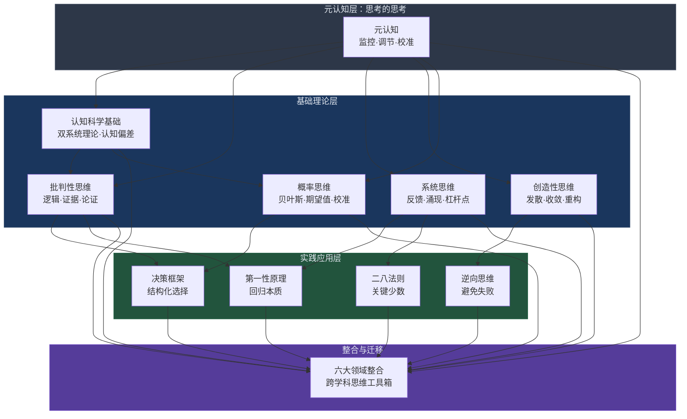
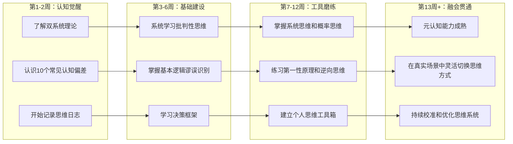
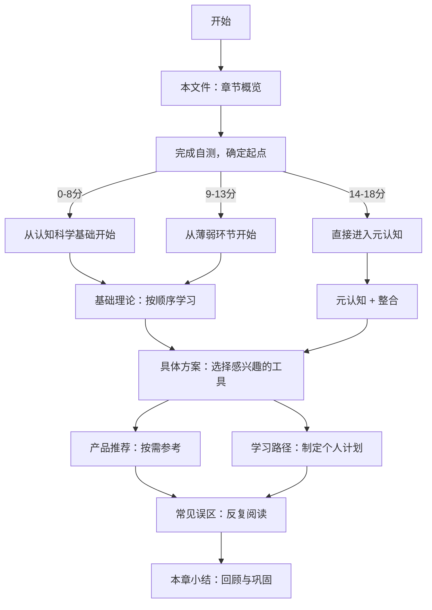

# 第六章：思维提升

> "思维的质量决定生活的质量。" —— 亚里士多德

## 为什么思维提升是个人成长的底层引擎

在前面的章节中，我们探讨了健康、技能、财务、社交和习惯等维度的个人提升方案。然而，所有这些维度的背后，都依赖一个根本性的底层能力——**思维能力**。思维是我们认知世界、做出决策、解决问题的核心工具。一个人的思维方式决定了他如何理解信息、如何判断形势、如何创造价值。

### 思维能力为什么是"元能力"

如果把个人能力比作一棵树，那么具体技能（编程、写作、演讲）是枝叶，习惯和纪律是树干，而**思维能力是根系**。根系决定了树能长多高、能承受多大的风。具体来说：

- **决策质量由思维决定**：你选择什么职业、和谁结婚、如何投资，这些人生关键决策的质量取决于你能否看清本质、权衡利弊、规避偏差
- **学习效率由思维决定**：同样的学习时间，思维能力强的人能更快抓住核心概念、建立知识之间的联系、形成可迁移的理解
- **问题解决由思维决定**：面对复杂问题，线性思维者看到的是混乱，系统思维者看到的是结构；悲观思维者看到的是障碍，创造性思维者看到的是可能性
- **情绪管理由思维决定**：认知行为疗法的核心原理就是——情绪不是由事件本身引起的，而是由你对事件的**解释方式**引起的

历史上几乎所有的重大突破，无论是科学发现、技术创新还是商业奇迹，其背后都有一种卓越的思维方式在驱动。爱因斯坦用思想实验推导出相对论，查理·芒格用多元思维模型构建投资哲学，马斯克用第一性原理颠覆多个行业。思维能力不是天赋的专属领地，它是一套可以学习、训练和精进的技能体系。

### 思维能力的可训练性：神经科学的证据

大脑具有**神经可塑性**（Neuroplasticity）——神经元之间的连接会因为反复使用而增强，因为废弃而弱化。这意味着：

1. **思维模式是可以改变的**：虽然认知偏差是"出厂设置"，但通过有意识的训练，我们可以在关键场景中启动更理性的思维模式
2. **刻意练习有效**：就像运动员通过反复练习提升肌肉记忆一样，思维能力也可以通过刻意练习来提升
3. **改变需要时间**：神经通路的重塑不是一朝一夕的事，通常需要持续数周到数月的练习才能形成稳定的新习惯

研究表明，经过批判性思维训练的人在以下方面有显著提升：
- 识别逻辑谬误的能力提升 40-60%
- 决策质量在高风险场景中提升 25-35%
- 对认知偏差的自我觉察能力提升 50% 以上

## 本章知识地图

本章的六大理论领域和四大实践工具不是孤立的知识模块，而是相互支撑的有机整体。下图展示了它们之间的关系：

### 各领域之间的关联说明

| 关联路径 | 解释 |
|---------|------|
| 认知科学 → 批判性思维 | 了解大脑的认知偏差是批判性思维的基础——你需要知道陷阱在哪里，才能避开它 |
| 认知科学 → 概率思维 | 理解可得性偏差和代表性偏差后，你才能真正理解为什么需要用概率而非直觉来思考 |
| 系统思维 → 第一性原理 | 系统思维帮助你看到事物的结构，第一性原理帮助你拆解到最基本的组成部分 |
| 系统思维 → 二八法则 | 理解系统的杠杆点后，你才能识别出那关键的20% |
| 创造性思维 → 逆向思维 | 逆向思维本质上是一种创造性重构——从反面看问题需要打破常规的思维定势 |
| 批判性思维 → 决策框架 | 所有好的决策框架都建立在批判性评估证据的基础上 |
| 元认知 → 所有领域 | 元认知是"监控器"，它让你知道自己正在用什么思维方式、是否需要切换 |

## 自测：你当前的思维能力水平

在开始学习之前，花5分钟完成以下自测。这不是考试，而是一个基准线——学完本章后你可以重新评估，看看进步了多少。

### 认知偏差自测（每题1分，共8分）

请诚实地回答以下问题，选择"是"或"否"：

| # | 问题 | 答案 |
|---|------|------|
| 1 | 你是否曾经因为"已经投入了很多"而继续做一件明知不值得的事？ | 沉没成本谬误 |
| 2 | 看到某个产品有大量好评时，你是否更倾向于购买？ | 从众效应 |
| 3 | 你是否更愿意搜索和阅读支持自己已有观点的信息？ | 确认偏误 |
| 4 | 你是否曾因为一个专家说了某句话就降低了对这个观点的审查标准？ | 权威偏差 |
| 5 | 你是否经常在事后觉得"我早就知道会这样"？ | 后见之明偏差 |
| 6 | 面对一个不熟悉的投资机会，你是否更关注可能赚多少而非可能亏多少？ | 损失厌恶的反面 |
| 7 | 你是否因为对一个人第一印象好，就倾向于认为他各方面都不错？ | 光环效应 |
| 8 | 你是否经常觉得自己的判断比大多数人更准确？ | 过度自信偏差 |

**评分解读：**

| 得分 | 水平 | 建议 |
|------|------|------|
| 0-2 分 | 自我觉察较强 | 你对认知偏差已有较好的觉察，可以重点关注高级思维工具 |
| 3-5 分 | 中等水平 | 建议系统学习认知科学基础部分 |
| 6-8 分 | 需要提升 | 认知偏差对你的日常决策影响较大，本章将对你帮助很大 |

### 批判性思维自测（每题1分，共5分）

| # | 问题 | 考察点 |
|---|------|--------|
| 1 | 当你看到一条新闻标题时，你是否会先查看信息来源再决定是否相信？ | 信息评估习惯 |
| 2 | 你能区分"相关关系"和"因果关系"吗？举一个例子 | 逻辑推理能力 |
| 3 | 当别人提出与你相反的观点时，你的第一反应是反驳还是理解？ | 开放性思维 |
| 4 | 你能否识别以下论证中的谬误："这个保健品一定有效，因为一位诺贝尔奖得主推荐了它" | 逻辑谬误识别 |
| 5 | 面对一个复杂问题，你是否会主动寻找替代解释，而不是接受第一个合理的答案？ | 替代解释习惯 |

### 思维习惯自测（每题1分，共5分）

| # | 问题 | 考察点 |
|---|------|--------|
| 1 | 做重要决策前，你是否会写下不同选项的利弊？ | 结构化决策 |
| 2 | 你是否定期回顾自己过去的决策，分析哪些做得好、哪些可以改进？ | 反思习惯 |
| 3 | 面对一个复杂问题，你是否会尝试画出相关的因果关系图或系统图？ | 系统思维习惯 |
| 4 | 你是否有意识地使用"如果...那么..."的思维方式来预判不同场景？ | 情景规划能力 |
| 5 | 你是否有一套固定的思维工具或框架来帮助分析问题？ | 工具化思维 |

**总分解读：**

| 总分（18分） | 思维水平 | 本章学习建议 |
|-------------|---------|-------------|
| 14-18 | 高级 | 重点学习元认知和整合部分，建立个人思维系统 |
| 9-13 | 中级 | 系统学习基础理论，在实践中巩固 |
| 4-8 | 初级 | 从认知科学基础开始，循序渐进 |
| 0-3 | 入门 | 本章将为你打开全新的思维视角，建议完整学习 |

## 本章核心内容概览

### 基础理论：七大思维范式

本章的基础理论部分构建了思维提升的完整知识体系，包含七大核心领域：

**第一层：理解大脑如何运作**

| 领域 | 核心问题 | 关键概念 |
|------|---------|---------|
| 认知科学基础 | 大脑如何思考？为什么会犯错？ | 双系统理论、认知偏差、启发式 |

**第二层：建立正确的思维方式**

| 领域 | 核心问题 | 关键概念 |
|------|---------|---------|
| 批判性思维 | 如何辨别真伪、评估论证？ | 逻辑谬误、证据评估、苏格拉底提问法 |
| 创造性思维 | 如何突破常规、产生新想法？ | 发散思维、收敛思维、SCAMPER法 |
| 系统思维 | 如何看到整体而非局部？ | 反馈循环、涌现特性、杠杆点 |
| 概率思维 | 如何在不确定性中做决策？ | 贝叶斯推理、期望值计算、校准 |

**第三层：高阶能力**

| 领域 | 核心问题 | 关键概念 |
|------|---------|---------|
| 元认知 | 如何监控和优化自己的思维？ | 思维日志、偏差审计、认知校准 |
| 六大领域整合 | 如何将不同思维方式融合运用？ | 跨学科思维工具箱、场景切换策略 |

### 具体方案：六大实践工具

| 工具 | 适用场景 | 核心方法 |
|------|---------|---------|
| 思维模型大全 | 理解复杂世界 | 掌握100个跨学科思维模型及其应用场景 |
| 决策框架 | 面对重大选择 | 从混乱到清晰的结构化决策流程 |
| 问题解决方法论 | 面对复杂挑战 | 系统化的问题拆解和解决路径 |
| 创新思维训练 | 需要突破和创新 | 创造性思维的刻意练习方法 |
| 逻辑思维训练 | 需要严密推理 | 逻辑推理能力的系统训练 |
| 综合训练计划 | 日常思维提升 | 整合所有工具的日常练习方案 |

### 学习路径：从入门到精通

### 产品推荐

本章精选思维提升领域的经典书籍（如《思考，快与慢》《穷查理宝典》《系统之美》等）、高质量在线课程、数字工具（思维导图软件、笔记系统等）以及播客与博客资源，帮助你建立系统的学习资源库。

### 常见误区

思维训练中最容易掉入的陷阱包括：将认知偏差知识当作"标签工具"去评判他人而非校准自己、过度依赖单一思维模型、把理论知识等同于实际能力、忽视思维习惯的日常练习等。本章将逐一揭示这些误区并提供纠偏方法。

## 本章的学习目标

完成本章学习后，你将能够：

1. **理解大脑的思维机制**：掌握双系统理论，识别至少15种常见认知偏差及其应对策略
2. **建立批判性思维习惯**：在日常生活中有意识地评估信息来源、识别逻辑谬误、寻找替代解释
3. **运用系统思维看待复杂问题**：识别系统中的反馈循环、延迟效应和杠杆点
4. **掌握创造性思维工具**：运用发散思维和收敛思维工具系统化地产生和筛选创意
5. **熟练运用四大思维工具**：第一性原理、二八法则、逆向思维和概率思维
6. **发展元认知能力**：能够监控自己的思维过程，识别偏差，主动调整思维方式
7. **建立个人思维工具箱**：形成一套可复用的思维框架，在不同场景中灵活调用
8. **实现思维习惯的自动化**：将高质量的思维模式从"需要刻意启动"转变为"自然而然的反应"

## 如何使用本章

### 推荐阅读顺序

### 学习策略建议

| 策略 | 说明 | 适用人群 |
|------|------|---------|
| 系统通读 | 按章节顺序完整学习，建立完整的知识体系 | 思维训练初学者、希望系统提升的人 |
| 主题聚焦 | 选择与当前需求最相关的1-2个主题深入学习 | 有特定问题需要解决的人 |
| 问题驱动 | 从自己遇到的真实问题出发，寻找对应的思维工具 | 实践导向的学习者 |
| 每日一练 | 每天学习一个思维模型或工具，当天就应用到实际生活中 | 时间有限但希望持续进步的人 |

### 配合练习的建议

理论学习只是起点，思维能力的真正提升来自于**持续的刻意练习**。建议配合以下练习：

1. **思维日志**：每天记录一个重要决策的思考过程，标注使用了哪些思维工具、有哪些偏差可能影响了判断
2. **偏差审计**：每周回顾一次本周的决策，识别可能存在的认知偏差
3. **跨领域迁移**：每周尝试用一个领域学到的思维模型去分析另一个领域的问题
4. **思维辩论**：找一个学习伙伴，定期就某个话题进行正反方辩论，锻炼批判性思维

---

思维提升是一个终身课题。本章为你提供的不是一套速成技巧，而是一个系统的框架和持续精进的起点。无论你当前的思维水平如何，只要你愿意投入时间和精力，思维能力的提升几乎是确定的——因为神经科学已经证明，大脑会因为正确的训练而改变。让我们开始这段思维升级之旅。
