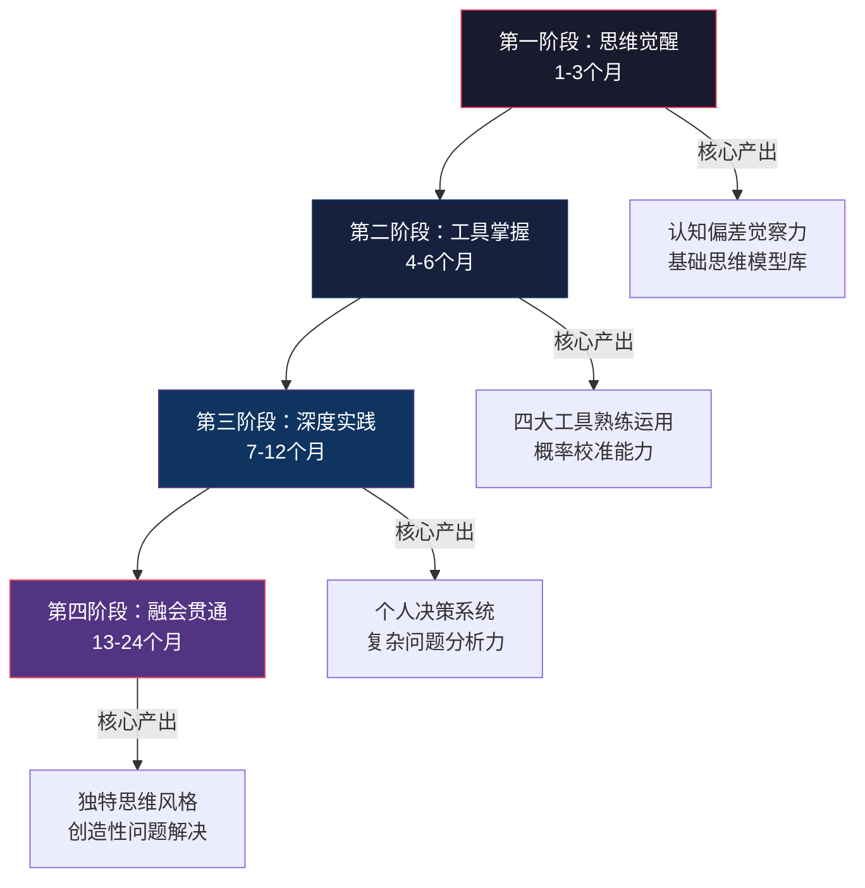

# 学习路径：从零基础到思维精通

## 为什么需要一条系统化的学习路径

思维提升不同于学习一门编程语言或一项具体技能——它没有明确的"毕业标准"，也没有线性的知识递进关系。大多数人尝试提升思维能力时面临三个核心困境：

**第一，碎片化陷阱。** 读了一本《思考，快与慢》，学了几个认知偏差的名词，感觉自己"懂了"，但在真实决策中依然凭直觉行事。孤立的知识点不构成能力，正如背了1000个英语单词不代表能对话。

**第二，知行断裂。** 知道"要逆向思考"和能在压力下自然地逆向思考是两回事。思维工具的"知道"到"内化"之间隔着数百小时的刻意练习，大多数人在这个过程中放弃了。

**第三，缺乏反馈。** 代码写错了编译器会报错，但思维犯了错往往没有即时反馈——错误决策的后果可能数月甚至数年后才显现，届时你早已忘记当初的推理过程。

一条好的学习路径解决这三个问题：它提供有序的知识结构避免碎片化，设计渐进的练习阶梯缩短知行差距，建立评估机制提供反馈。本文将12-24个月的思维提升过程拆解为四个阶段，每个阶段包含具体的理论学习、工具掌握、实践练习和评估标准。

---

## 第一阶段：思维觉醒期（第1-3个月）

### 阶段定位与核心任务

这个阶段的本质是**认知校准**——你首先需要意识到自己的思维并不像你以为的那样理性。认知科学的大量研究表明，人类大脑天生依赖快速直觉（系统1），而直觉在很多场景下会产生系统性偏差。觉醒期的目标不是让你变得"完全理性"，而是建立一个元认知的监控层——当你思考时，能同时"观察"自己的思考过程。

这个阶段不需要任何前置知识，适合所有背景的学习者。唯一的门槛是愿意承认"我的判断可能是错的"。

### 月份1：认识自己的思维

#### 理论学习（每周3-4小时）

**必读材料：**

| 优先级 | 材料 | 预计时间 | 学习重点 |
|--------|------|----------|----------|
| P0 | Coursera "Learning How to Learn" (Barbara Oakley) | 4周×3小时 | 理解大脑学习机制：组块化、专注模式vs发散模式、睡眠对记忆巩固的作用 |
| P0 | 《学会提问》(Neil Browne) 前半部分 | 2周×2小时 | 批判性思维的基本框架：论题、结论、理由、歧义、价值观假设 |
| P1 | 认知偏差清单（维基百科"Cognitive biases"词条） | 3小时 | 浏览并标记与自身相关的偏差，不需要全部记住 |

**为什么推荐这个顺序：** "Learning How to Learn" 教你如何高效学习本身，这是一切后续学习的元技能。先掌握学习方法论，再投入具体内容，效率提升显著。Barbara Oakley 的课程基于神经科学，解释了为什么间隔重复比集中突击有效，为什么睡眠中的记忆回放对知识固化至关重要。

**关键概念速览：**

认知偏差不是"错误"——它们是大脑为了在信息不完整、时间有限的条件下快速做出决策而进化出的启发式规则。问题在于，这些规则在现代复杂环境中频繁失灵。你需要理解的核心偏差包括：

- **确认偏差（Confirmation Bias）**：倾向于寻找支持自己已有观点的信息，忽略相反证据。这是最普遍也最具破坏力的偏差，因为它是所有其他偏差的"放大器"。
- **锚定效应（Anchoring Effect）**：第一个接触到的数字会不成比例地影响后续判断。商业谈判中的首次报价、法庭审判中的赔偿请求金额都是锚定效应的经典应用。
- **可得性偏差（Availability Heuristic）**：越容易回忆起来的事件，你越认为它发生的概率高。这就是为什么空难后人们选择开车而非飞行——飞机事故的戏剧性使其在记忆中过度代表。
- **损失厌恶（Loss Aversion）**：等量的损失带来的痛苦是等量收益带来的快乐的2-2.5倍。这解释了为什么人们宁愿维持现状也不愿冒险追求更好的结果。
- **后见之明偏差（Hindsight Bias）**：事件发生后，你倾向于认为自己"早就知道会这样"。这种偏差让你无法从预测失败中真正学习，因为你错误地认为自己的预测其实是准确的。

#### 实践练习（每天15-30分钟）

**练习1：思维日志（每日必做）**

准备一个专门的笔记本或电子文档，每天记录1-2个重要的思维过程。记录模板如下：

日期：____
情境：描述你做决策或形成判断的场景
我的判断：____
判断依据：我是基于什么信息/推理得出这个判断的？
可能的偏差：我是否受到了某种认知偏差的影响？
验证方式：如何事后检验这个判断是否正确？

这个练习的核心价值不在于记录本身，而在于**强迫你将隐性思维显性化**。大多数人的推理过程是"自动驾驶"模式——输入情境，输出判断，中间过程完全不透明。思维日志把这个黑箱打开，让你看到自己实际的推理链条。

**练习2：信息审视（每日1条）**

每天选择1条你看到的新闻或信息，用以下三个维度进行分析：

1. **来源质量**：信息来自哪里？是一手来源还是转述？发布者有什么动机？
2. **证据强度**：有具体数据支撑吗？样本量多大？是否有对照组？
3. **逻辑结构**：结论是否由前提合理推出？有没有偷换概念或滑坡论证？

**练习3："五个为什么"（每周3次）**

对你认为理所当然的事情连续追问五个"为什么"。例如：

- "我应该学编程" → 为什么？→ "因为编程薪资高" → 为什么？→ "因为数字化需求大" → 为什么数字化需求大？→ ……

这个练习来自丰田生产系统（Toyota Production System），其价值在于帮助你穿透表面原因，触达底层逻辑。大多数人止步于第一个"为什么"就得到了一个看起来合理但经不起深究的答案。

### 月份2：学习基础思维工具

#### 理论学习（每周3-4小时）

**必读材料：**

| 优先级 | 材料 | 预计时间 | 学习重点 |
|--------|------|----------|----------|
| P0 | 《系统之美》(Donella Meadows) | 3周×3小时 | 系统的基本结构：存量、流量、反馈回路；杠杆点理论 |
| P0 | 《思考，快与慢》(Daniel Kahneman) 前半部分 | 4周×2小时 | 系统1与系统2的运作机制，启发式与偏差的来源 |
| P1 | 五个基础思维模型的深度理解 | 每个1小时 | 复利效应、机会成本、沉没成本、边际效用、激励机制 |

**五个基础思维模型详解：**

这些模型是查理·芒格反复强调的"多元思维模型"中最核心的五个。它们之所以排在最前面，是因为它们在日常决策中出现的频率最高，且理解门槛最低。

- **复利效应**：不仅是金融概念。知识的积累、技能的提升、信任的建立都遵循复利曲线——前期增长缓慢（平台期），一旦突破临界点后呈指数增长。理解这一点能帮你度过学习初期的"怎么学了这么久还没效果"的焦虑。关键公式：`终值 = 初始值 × (1 + 增长率)^时间`。增长率哪怕只提升1%，长期的差异是惊人的。

- **机会成本**：每一个选择的真实成本不是你付出了什么，而是你放弃了什么。当你花3小时刷短视频时，成本不是"3小时时间"，而是"这3小时你本可以做的最有价值的事"。这个模型要求你养成一个习惯：做任何决策前，先想清楚你放弃了什么。

- **沉没成本谬误**：已经投入的、不可收回的成本不应该影响未来的决策。但几乎所有人都会因为"已经花了这么多"而继续投入。理性的做法是：每次决策时假设自己是"从零开始"——如果你今天刚进入这个局面，没有任何历史投入，你会怎么选？

- **边际效用递减**：第1杯水对沙漠中的人价值连城，第10杯水几乎毫无价值。这个规律在时间管理、精力分配、学习策略中无处不在。它提示你：把资源投入到边际效用最高的地方，而非已经投入最多的地方。

- **激励机制**：人们响应激励，理解这一点是理解一切人类行为的钥匙。如果你想改变某个人（或自己）的行为，首先要看激励结构是什么。公司的KPI如何，员工就会如何行动——即使KPI设计得很糟糕。

#### 实践练习（每天15-30分钟）

**练习1：因果图练习（每周1次）**

选择一个你关心的问题（如"为什么我总是加班？"或"为什么这个行业在衰退？"），画出简化的因果回路图。不需要完美的系统动力学模型，重点是识别：

- 哪些因素互相增强（正反馈回路）？
- 哪些因素互相制约（负反馈回路）？
- 系统中有没有延迟效应？

例如，"加班问题"的因果图可能包含：工作量增加 → 加班 → 疲劳 → 效率下降 → 工作积压 → 工作量增加。这是一个典型的增强回路，而打破它的杠杆点可能不在"更努力工作"，而在"提高效率"或"减少工作量"。

**练习2：决策记录（每个重要决策必做）**

使用以下模板记录每个重要决策：

日期：____
决策内容：____
可用选项：A____  B____  C____
选择：____
决策依据：我用了什么思维模型？考虑了哪些因素？
预期结果：____
事后验证（1个月后填写）：实际结果如何？

**练习3：反转练习（每周1次）**

对每周的一个重要信念或判断进行逆向思考。如果你认为"远程办公比坐班好"，就认真思考远程办公的缺点和坐班的优点。这个练习的目的不是改变你的观点，而是训练你从多个角度审视同一个问题的能力。

### 月份3：整合与初步反思

#### 理论学习（每周2-3小时）

| 材料 | 学习重点 |
|------|----------|
| 《思考，快与慢》后半部分 | 前景理论、经验自我vs记忆自我、过度自信 |
| 第一性原理入门 | 亚里士多德的原始定义、现代应用框架 |
| 概率思维入门 | 基础概率论、条件概率、贝叶斯定理直觉 |

**第一性原理的正确理解：** 第一性原理不是"质疑一切"——那是虚无主义。第一性原理是**将复杂问题分解到最基本的事实，然后从这些事实出发重新推理**。关键在于：什么算"最基本的事实"？通常指物理定律、经过验证的科学原理、或无法进一步分解的逻辑公理。例如，SpaceX的火箭降本不是简单地质疑"火箭很贵"，而是将火箭成本分解为原材料成本（铝、碳纤维、钛等），发现原材料仅占成品价格的2%，从而推断制造过程的低效是主要成本来源。

**概率思维的核心要义：** 大多数人对概率的直觉是严重失准的。例如，当你说"这件事大概率会发生"时，你的"大概率"是指60%还是90%？研究表明，当人们说"很可能"时，实际概率平均只有50-65%。概率思维的第一步不是学习概率计算，而是**校准你的概率语言**——让你说的"很可能"真正对应一个高概率值。

#### 实践练习（每天20-30分钟）

**练习1：第一性原理分解（每周1次）**

选择你所在行业的一个"常识"，用第一性原理进行质疑。模板：

行业常识：____
这个常识的假设前提是什么？
哪些假设是经过验证的事实？哪些只是习惯或传统？
如果从零开始推理，结论会不同吗？

**练习2：二八分析（对生活3个领域）**

分别对你的工作、学习、时间使用进行帕累托分析：
- 列出你做的所有事情
- 识别哪些20%的活动产出了80%的成果
- 识别哪些活动投入了大量时间但产出极低

**练习3：阶段回顾（月末进行）**

回顾过去3个月的思维日志，用以下框架进行总结：

我最常犯的认知偏差是哪些？（列出前3）
我的决策过程中最大的系统性弱点是什么？
哪些思维工具对我最有用？哪些感觉"用不上"？
下个阶段我最想改进的是什么？

### 阶段评估标准

完成第一阶段后，你应该能够：

- [ ] 识别至少10种常见认知偏差，并能在日常生活中觉察到它们的影响
- [ ] 用因果回路图分析简单的系统问题，识别增强回路和制约回路
- [ ] 养成每日记录思维日志的习惯（已坚持至少60天）
- [ ] 在日常决策中有意识地运用至少3种思维模型（不只是"知道"，而是实际用过）
- [ ] 完成2本推荐书籍的深度阅读（非浏览）
- [ ] 能用"五个为什么"穿透表面原因，找到底层逻辑
- [ ] 对"很可能""不太可能"等模糊概率词有了初步的量化意识

---

## 第二阶段：工具掌握期（第4-6个月）

### 阶段定位与核心任务

如果你在第一阶段建立了"元认知监控"——即能观察自己的思维过程，那么第二阶段的目标是**装备武器库**。你需要深入掌握四大核心思维工具，建立一个包含至少20个思维模型的个人工具箱，并开始在真实决策中刻意运用这些工具。

这个阶段的关键转变是：从"知道这个概念"到"能在压力下自然运用"。这需要大量的刻意练习，就像学开车——你知道方向盘往左打车就往左转，但在紧急情况下能不假思索地正确操作，需要数百小时的练习。

### 月份4：深入第一性原理与逆向思维

#### 理论学习（每周3-4小时）

**第一性原理的深层应用：**

超越"质疑假设"的表面理解，你需要掌握第一性原理的完整操作流程：

1. **定义问题**：精确描述你要解决的问题，避免模糊的表述
2. **列出所有假设**：把你认为"理所当然"的所有前提写下来
3. **分类验证**：将假设分为三类——已验证的事实、合理的推断、未经检验的习惯
4. **分解到基本事实**：只保留第一类，对第二类进行验证，暂时搁置第三类
5. **从基本事实重新推理**：用逻辑和证据从基本事实出发，构建新的解决方案

案例研究：特斯拉电池成本。2008年，锂电池组的市场价约600美元/千瓦时。马斯克没有接受这个价格，而是将电池分解为碳、镍、铝、钢壳、聚合物隔膜等原材料，发现这些材料在伦敦金属交易所的价格仅约80美元/千瓦时。由此推断：问题不在材料，而在制造过程的低效和供应链的中间层。这个推理直接指导了特斯拉后来的超级工厂战略。

**逆向思维的系统化方法：**

逆向思维不只是"反过来想"，它有三种具体的执行模式：

| 模式 | 操作方法 | 适用场景 |
|------|----------|----------|
| 预验尸（Pre-mortem） | 假设项目已经失败，回头推理"是什么导致了失败" | 项目启动前的风险评估 |
| 反面清单（Inversion） | 不问"如何成功"，而问"如何确保失败"，然后避免 | 任何目标导向的场景 |
| 反事实推理（Counterfactual） | 如果某个关键条件不同，结果会如何变化？ | 回顾决策、理解因果 |

**推荐材料：**
- 《穷查理宝典》核心章节：芒格的多元思维模型和逆向思维哲学。重点阅读"人类误判心理学"演讲，这是芒格将认知偏差系统化的经典之作。
- Gary Klein 的"Pre-mortem"方法论文：理解预验尸的科学基础和实证效果。

#### 实践练习（每天20-30分钟）

**练习1：每周一次"归零思考"**

选择你工作中的一个项目或流程，假设你今天刚接手，没有任何历史包袱——你会怎么设计？这个练习的价值在于帮你识别那些"一直在做但没人知道为什么"的惯性做法。

**练习2：预验尸分析（每两周1次）**

对你正在进行或即将开始的项目进行预验尸：

项目名称：____
假设现在是6个月后，这个项目彻底失败了。
列出导致失败的所有可能原因（至少5个）：
1. ____
2. ____
3. ____
4. ____
5. ____
对每个原因评估：发生概率____，可控程度____
制定针对前3个高风险原因的预防措施

**练习3：反面清单**

建立个人的"要避免的错误"清单。每当你犯了一个错误、观察到别人犯错、或从书中读到一个失败案例，就加入清单。这个清单的价值在于：知道不该做什么，往往比知道该做什么更重要。芒格说的"如果我知道我会死在哪里，我就永远不去那个地方"就是这个道理。

### 月份5：掌握二八法则与概率思维

#### 理论学习（每周3-4小时）

**二八法则的深层理解：**

帕累托法则不是一个精确的80/20比例——它是一个关于分布不均匀的思维方式。核心洞察：**在大多数系统中，少数因素产生了多数效果**。关键应用层次：

1. **识别层**：找到那关键的20%是什么
2. **聚焦层**：将更多资源投入关键的20%
3. **递归层**：在关键的20%中再次应用二八法则，找到关键的4%（20%×20%）
4. **动态层**：理解关键的20%会随时间变化，定期重新评估

**概率思维的系统学习：**

推荐《对赌》(Annie Duke) 或《超预测》(Philip Tetlock) 二选一。两本书的核心主题相同——如何在不确定性中做出更好的判断——但切入角度不同：

- 《对赌》：从职业扑克玩家的角度，教你将决策视为下注，区分"好决策"和"好结果"。核心观点：结果好不代表决策好，运气的成分需要被剥离。
- 《超预测》：从预测科学研究的角度，揭示了超级预测者的共同特征——他们持续更新概率估计，而非给出一个固定答案。

**贝叶斯思维的基本原理：**

贝叶斯定理的核心不是数学公式，而是一种**思维习惯**：

后验概率 = (先验概率 × 似然度) / 证据强度

用日常语言翻译：你对一件事的判断（后验概率）应该等于你之前的信念（先验概率）乘以新证据的支持程度（似然度），再归一化。

实用要点：
- **先验信念很重要**：在看到任何证据之前，基础概率是多少？如果你朋友说"这次创业一定会成功"，先看看创业的总体成功率（约10%）。
- **新证据应该更新信念，而非推翻**：一个有利证据应该让你的信心从10%上升到20%，而不是直接跳到90%。
- **证据的质量比数量重要**：一个高质量的证据（大样本、随机对照、独立重复）抵得上100个低质量的证据（轶事、小样本、有偏选择）。

#### 实践练习（每天20-30分钟）

**练习1：概率校准练习（每日5题）**

这是本阶段最重要的练习。每天对5个不确定的事情给出概率估计，记录结果，每周回顾校准度。

问题：____
我的概率估计：___%
实际结果：____
校准度分析：（连续多题后评估：说"70%的事"是否真的有70%发生了？）

校准的目标不是"预测准确"——很多事情本质上不可预测。目标是让你的概率估计和实际频率一致：你说"70%概率的事"，长期来看确实有70%左右发生了。

**练习2：期望值计算（每两周1次）**

对重要的不确定性决策，用期望值框架分析：

选项：____
可能结果A：概率____% × 收益/损失____ = 期望值____
可能结果B：概率____% × 收益/损失____ = 期望值____
总期望值：____

注意：期望值只是决策的输入之一，还要考虑最坏情况的承受能力（风险承受度）和结果的不可逆性。

**练习3：时间二八分析**

精确记录一周的时间使用（精确到30分钟），然后分析：
- 哪些20%的时间段产出了80%的有效成果？
- 哪些活动占据了大量时间但几乎没有产出？
- 你的高产出时间段在一天中的什么位置？（据此调整日程安排）

### 月份6：综合运用与模型库建设

#### 理论学习（每周3-4小时）

**扩展思维模型库（目标：累计20+个）：**

在前5个月学习的模型基础上，继续扩展：

| 类别 | 模型 | 核心洞察 |
|------|------|----------|
| 决策类 | 前景理论 | 人们对损失和收益的感受不对称 |
| 决策类 | 决策矩阵 | 多因素决策的结构化比较方法 |
| 系统类 | 反馈回路 | 系统行为的底层驱动力 |
| 系统类 | 涌现 | 简单规则产生复杂行为 |
| 概率类 | 大数定律 | 小样本不能代表总体 |
| 概率类 | 回归均值 | 极端表现后通常会回归平均水平 |
| 博弈类 | 纳什均衡 | 没有人有动机单方面改变策略的状态 |
| 博弈类 | 囚徒困境 | 个体理性导致集体非理性 |
| 进化类 | 自然选择 | 适应环境的特征被保留和放大 |
| 进化类 | 红皇后效应 | 必须持续进化才能维持现状 |

**推荐阅读：**
- 《原则》(Ray Dalio) 中的决策框架：达利欧将桥水基金的决策系统拆解为可学习的原则，核心是"极度透明"和"可信度加权的决策"。
- 《反脆弱》(Nassim Taleb)：理解从不确定性中获益的思维框架——脆弱的反面不是坚固，而是反脆弱。

#### 实践练习（每天30分钟）

**练习1：综合决策练习（每月2次）**

对一个重大决策，同时运用四个工具：

决策：____

第一性原理分析：
- 这个决策的基本事实是什么？
- 有哪些未经检验的假设？

逆向思维分析：
- 如果这个决策导致了最坏的结果，原因可能是什么？

概率思维分析：
- 各种可能结果的概率分别是多少？
- 期望值如何？

二八法则分析：
- 影响这个决策结果的关键因素是哪几个？
- 我是否把足够精力放在了关键因素上？

**练习2：系统分析项目（选择1个复杂问题）**

用系统思维进行完整分析，包括：识别系统边界、绘制因果回路图、找到杠杆点、预测干预效果。

**练习3：费曼学习法——教是最好的学**

向一个朋友或同事讲解你学到的一个思维工具，用他们能听懂的语言和例子。如果你解释不清楚，说明你理解得还不够深。记录讲解过程中"卡壳"的地方，回去重新学习。

### 阶段评估标准

完成第二阶段后，你应该能够：

- [ ] 熟练运用四大思维工具分析问题，能在15分钟内完成一个综合分析框架
- [ ] 概率估计的校准度有明显改善（偏差在15%以内）
- [ ] 建立了包含20个以上模型的个人思维模型库，每个模型都能说出其核心洞察和适用场景
- [ ] 能画出较完整的系统因果回路图，识别至少2个杠杆点
- [ ] 完成了至少5本推荐书籍的深度阅读
- [ ] 建立了个人的"反面清单"，记录了至少20条要避免的错误
- [ ] 在至少3次重大决策中实际运用了综合决策框架

---

## 第三阶段：深度实践期（第7-12个月）

### 阶段定位与核心任务

第二阶段你学会了使用工具，第三阶段的目标是**在真实、复杂、模糊的环境中运用这些工具**。实验室里做实验和工地上干活是完全不同的——前者的变量可控，后者充满噪音和干扰。

这个阶段的核心挑战是：当问题本身定义不清、信息严重不足、时间压力很大时，你还能不能运用所学的思维工具？答案是：能，但需要把工具从"刻意调用"变成"自动触发"。

### 月份7-8：高级思维模型

#### 理论学习

**博弈论基础：**

博弈论是分析"我的决策取决于你的决策，你的决策也取决于我的决策"这类互动情境的数学框架。你需要掌握的核心概念：

- **纳什均衡**：在一场博弈中，当每个参与者都选择了对自己最优的策略（给定其他人的策略不变），系统就达到了纳什均衡。关键洞察：纳什均衡不一定是全局最优——囚徒困境中双方都背叛就是纳什均衡，但双方合作才是全局最优。
- **囚徒困境**：个体理性导致集体非理性的经典模型。理解它对理解市场竞争、公共资源困境、合作的演化至关重要。
- **重复博弈**：当博弈只进行一次时，背叛是理性的；但当博弈重复进行时，合作可以成为理性策略。这就是为什么声誉（reputation）在长期关系中如此重要。

**进化论思维：**

把自然选择的机制抽象为通用思维工具：
- **变异**：产生多样化的尝试
- **选择**：环境筛选出适应的变体
- **遗传**：成功的特征被保留和复制

这个框架在个人成长中的应用：你的思维模型库就是一个"思想基因库"——不断尝试新的思维方法（变异），保留有效的、淘汰无效的（选择），将有效方法固化为习惯（遗传）。

**推荐阅读：**
- 《模型思维》(Scott Page) 中的高级模型：涵盖网络模型、传播模型、投票模型等。建议选择与你工作最相关的3-4个模型深入学习，不必全书通读。

#### 实践练习

**练习1：博弈分析**

对你参与的谈判或竞争情境进行博弈论分析：

博弈情境：____
参与者：____
每个参与者的策略选项：____
每个策略组合下的收益矩阵：____
预测的纳什均衡：____
实际结果：____
差异分析：为什么实际结果与理论预测不同？

**练习2：跨领域类比（每周1次）**

练习从一个完全不同的领域借用解决方案。方法：将你的问题抽象化，去除行业特征，找到底层结构，然后在其他领域寻找相同结构的问题和解决方案。

例如："如何提高团队效率" → 抽象为"如何提高一个复杂系统中多个组件的协同产出" → 在制造业中找到精益生产方法 → 将"看板""持续改进""消除浪费"等概念迁移到团队管理中。

**练习3：多模型分析（每个复杂问题至少用3个模型）**

对同一个问题同时应用3-5个不同的思维模型，比较它们各自揭示了什么、忽略了什么。没有一个模型能完整描述现实——多模型分析的价值在于不同模型捕捉现实的不同侧面。

### 月份9-10：系统化决策

#### 理论学习

**决策科学的核心框架：**

- **多属性决策**：当决策涉及多个相互冲突的目标时（如薪资vs成长空间vs生活质量），需要结构化的评估方法。加权评分法是最实用的工具：列出所有重要属性，为每个属性分配权重，对每个选项在各属性上打分，计算加权总分。
- **前景理论（深化）**：理解参考点依赖——人们对结果的评价取决于与参考点的比较，而非绝对值。这解释了为什么刚加薪的人很快就会适应新的薪资水平（参考点上移），以及为什么失去100元的痛苦远大于获得100元的快乐。
- **群体决策的陷阱与改进**：群体决策的优势是信息汇聚，但容易出现群体极化（讨论后群体观点比个体观点更极端）和群体思维（追求一致而压制异议）。改进方法包括：指定"魔鬼代言人"、使用"德尔菲法"匿名收集意见、先独立思考再讨论。

**推荐阅读：** 《超越智商》(Keith Stanovich)——理解理性思维和智力的关系，以及为什么聪明人也会犯非理性的错误。

#### 实践练习

**练习1：建立个人决策清单**

为你常面对的决策类型（如：是否接受一个新工作、是否投入一个新项目、是否购买大件商品）建立标准化的决策检查清单。清单应包含：

决策类型：____
必须检查的维度：
□ 是否受到了沉没成本的影响？
□ 我的先验概率是多少？有没有被新信息过度/不足更新？
□ 如果我完全不了解这件事，我会怎么选？（去除参考点依赖）
□ 这个决策的可逆性如何？可逆的决策可以快速行动，不可逆的决策需要更多分析
□ 如果最好的朋友面临同样的选择，我会给他什么建议？（旁观者视角）
□ 最坏结果是什么？我能承受吗？

**练习2：决策回顾（对过去6个月的重要决策）**

系统回顾你过去6个月的所有重要决策：

决策1：____
当时的推理过程：____
实际结果：____
结果好坏归因：这个结果有多少是因为我的决策质量，多少是因为运气？
如果重来一次：____
教训：____

这个练习的核心难点在于**区分决策质量和结果质量**。一个好的决策可能因为坏运气而产生坏结果，一个坏的决策也可能因为好运气而产生好结果。你需要学会评价过程（决策质量），而非只看结果。

**练习3：组建学习小组**

找1-2个志同道合的学习伙伴，每两周进行一次"思维碰撞"会：
- 每人带一个最近用思维工具分析的问题
- 互相审视对方的分析过程，指出可能的盲点
- 讨论不同思维模型对同一问题的不同解读

### 月份11-12：整合与创造

#### 理论学习

**创造力与创新方法论：**

- **设计思维（Design Thinking）**：以用户为中心的创新方法，核心流程：共情→定义→构思→原型→测试。价值在于提供了一套结构化的创新流程，避免"天马行空但无法落地"。
- **TRIZ（发明问题解决理论）**：基于对数百万专利的分析，总结出40个发明原理和矛盾矩阵。核心洞察：技术系统的进化遵循可预测的模式，创新的障碍通常是技术矛盾。
- **类比创新**：大多数创新来自于将一个领域的解决方案迁移到另一个领域。Biomimicry（仿生学）就是系统化的类比创新。

**冥想与正念对思维质量的影响：**

这不是玄学——神经科学研究表明，规律的正念练习（每天10-15分钟）能：
- 增强前额叶皮层的活动（与执行功能、注意力控制相关）
- 减少杏仁核的反应性（与情绪反应相关）
- 改善注意力持续时间和认知灵活性

对思维提升的直接价值：正念训练你"观察念头而不被念头裹挟"——这正是元认知监控在日常层面的实践。

**大师级思考者的思维方法研究：**

| 思考者 | 核心思维特征 | 可迁移的思维方法 |
|--------|------------|-----------------|
| 爱因斯坦 | 思想实验、直觉优先于数学 | 用想象力构建极端场景来检验理论 |
| 达芬奇 | 跨学科好奇心、观察力 | 从多角度长时间观察同一事物 |
| 芒格 | 多模型思维、逆向思考 | 建立跨学科的思维模型网格 |
| 马斯克 | 第一性原理、快速迭代 | 分解到物理极限，然后从那里开始推理 |
| 费曼 | 简化解释、怀疑一切 | 用最简单的语言向12岁小孩解释概念 |

#### 实践练习

**练习1：构建个人思维框架**

整合12个月所学，形成自己的一套思维检查清单。这不是另一份学习笔记——它是一份你能在5分钟内快速过一遍的"思维质量检查表"：

面对复杂问题时，按顺序检查：
1. 问题定义：我是否准确定义了问题？（第一性原理）
2. 假设检验：有哪些隐含假设？（批判性思维）
3. 逆向思考：如果反过来想呢？如何确保失败？（逆向思维）
4. 概率评估：各种结果的概率是多少？期望值如何？（概率思维）
5. 关键因素：影响结果的前3个因素是什么？（二八法则）
6. 系统视角：这个问题在更大的系统中处于什么位置？（系统思维）
7. 博弈考量：其他参与者会如何反应？（博弈论）
8. 时间维度：短期和长期的影响分别是什么？（时间偏好）

**练习2：复杂项目分析**

选择一个真实的复杂项目（可以是工作中的，也可以是社会问题），进行完整的多维度思维分析，产出一份结构化的分析报告。这个练习是前11个月所有学习的综合检验。

**练习3：写作输出**

撰写2-3篇关于思维方法的文章或深度笔记。写作是最好的思考工具——它迫使你将模糊的想法转化为清晰的表达。每篇文章选择一个你最有心得的思维工具，用具体案例说明它的应用价值。

### 阶段评估标准

完成第三阶段后，你应该能够：

- [ ] 思维工具的运用已经较为自然，在日常对话和决策中自动触发
- [ ] 能在复杂情境中灵活切换不同的思维框架，根据问题特征选择最合适的工具
- [ ] 建立了个人的决策系统和思维检查清单，并在实际中持续使用
- [ ] 概率估计的校准度达到较好水平（长期偏差在10%以内）
- [ ] 能够向他人清晰地讲解和传授至少5种思维方法
- [ ] 完成了至少10本推荐书籍的深度阅读
- [ ] 有至少3份结构化的复杂问题分析报告
- [ ] 写作输出了至少2篇高质量的思维方法文章

---

## 第四阶段：融会贯通期（第13-24个月）

### 阶段定位与核心任务

前三个阶段你完成了"觉醒→装备→实战"的进阶，第四阶段的目标是**形成独特的思维风格并持续精进**。这个阶段没有固定课表——你需要根据自己的兴趣、职业和人生阶段，选择深水区方向。

关键转变：从"学习和运用思维工具"到"创造性地组合和改进思维工具"。此时你不只是工具的使用者，而是开始成为方法论的创造者。

### 持续学习方向

#### 跨学科深度阅读

前三个阶段的阅读以"思维方法论"为主，这个阶段应该扩展到各学科的经典著作，因为**最强大的思维模型往往来自基础学科**：

| 学科 | 核心思维贡献 | 推荐入门读物 |
|------|-------------|-------------|
| 物理学 | 简化、对称性思维、量纲分析 | 《费曼物理学讲义》第一卷 |
| 生物学 | 进化思维、生态系统思维 | 《自私的基因》 |
| 心理学 | 认知偏差、动机理论 | 《影响力》《驱动力》 |
| 经济学 | 博弈论、边际分析、制度设计 | 《经济学原理》(曼昆) |
| 统计学 | 概率思维、回归分析、因果推断 | 《赤裸裸的统计学》 |
| 哲学 | 逻辑学、认识论、伦理推理 | 《哲学的邀请》 |
| 历史 | 长期思维、模式识别 | 《枪炮、病菌与钢铁》 |

#### 关注认知科学前沿

订阅认知科学和决策科学的最新研究：
- **期刊**：Trends in Cognitive Sciences, Judgment and Decision Making
- **博客/媒体**：Astral Codex Ten, LessWrong, Behavioral Scientist
- **播客**：Rationally Speaking, The Knowledge Project

#### 参与思维社群

- 加入理性主义或批判性思维社群（如当地或线上的读书会）
- 参与LessWrong等平台的讨论
- 寻找能挑战你思维的学习伙伴——最有效的反馈来自能指出你盲点的人

### 高级实践

#### 复杂决策顾问

为他人的重大决策提供思维分析支持。这个角色的价值是双向的：
- 对他人：你提供了结构化的分析框架，帮助他们避免情绪化决策
- 对你：分析他人的问题比分析自己的问题更容易保持客观，同时你能在更多样的场景中锻炼思维工具

#### 跨学科整合

将不同领域的知识和方法创造性地结合。跨学科整合是创新的重要来源——很多重大突破发生在学科的交界处。练习方法：

1. 每月深入学习一个新领域的基础知识
2. 识别该领域的核心思维模型
3. 思考这些模型如何应用到你的专业领域
4. 记录跨领域的洞察和应用案例

#### 写作与传播

通过写作、演讲或教学来深化和传播自己的思维方法论。教学是最好的学习——当你需要向别人解释一个概念时，你会被迫把模糊的理解变得清晰。建议：
- 开设个人博客或公众号，定期输出思维方法论文章
- 在公司内部做思维工具的分享培训
- 参与或组织思维训练工作坊

### 精进方向选择

根据个人兴趣和职业需求，选择1-2个方向深入研究：

#### 战略思维方向

适合人群：企业管理者、创业者、咨询师

核心能力：博弈论深度应用、竞争分析框架、长期趋势预判、战略规划方法

学习路径：
1. 深入学习博弈论（《策略思维》by Dixit & Nalebuff）
2. 研究经典战略案例（波特五力、蓝海战略、平台战略）
3. 学习情景规划方法（Shell情景规划法）
4. 实践：为所在行业进行完整的战略分析

#### 创新思维方向

适合人群：产品经理、设计师、研发人员、创业者

核心能力：设计思维、TRIZ、系统性创新、创造力激发

学习路径：
1. 深入学习设计思维（斯坦福d.school课程）
2. 学习TRIZ方法论（《创新算法》）
3. 研究创新案例（从不同行业汲取灵感）
4. 实践：用系统性创新方法解决一个真实问题

#### 数据思维方向

适合人群：数据分析师、科学家、技术管理者

核心能力：统计推理、因果推断、数据驱动决策、机器学习思维

学习路径：
1. 深入学习统计学（《统计学的世界》）
2. 学习因果推断方法（《为什么》by Judea Pearl）
3. 理解机器学习的基本思维框架
4. 实践：用数据分析方法重新审视过往的重大决策

#### 哲学思维方向

适合人群：对根本性问题感兴趣的学习者

核心能力：形式逻辑、认识论、伦理推理、概念分析

学习路径：
1. 学习形式逻辑和非形式逻辑谬误
2. 阅读认识论经典（知识的来源、真理的标准）
3. 学习伦理推理框架（功利主义、义务论、美德伦理）
4. 实践：用哲学分析框架审视日常工作和生活中的伦理困境

### 阶段评估标准

完成第四阶段后，你应该能够：

- [ ] 思维能力成为被他人认可的个人优势，有人主动向你请教分析问题
- [ ] 能够对复杂问题提出独到而有价值的见解，而非重复已知的分析
- [ ] 在不确定性中做出高质量决策的能力显著提升，概率校准长期偏差在5%以内
- [ ] 建立了持续学习和精进的机制，这个机制能在没有外部督促的情况下运转
- [ ] 在选定的精进方向上达到了准专家水平
- [ ] 累计阅读了至少25本与思维相关的书籍
- [ ] 有自己的方法论输出（文章、课程、工作坊等）

---

## 学习建议与常见陷阱

### 五条核心建议

**第一，循序渐进，不跳阶段。** 每个阶段的积累是下一阶段的地基。试图直接学习博弈论而不理解基本认知偏差，就像不学加减法直接学微积分——表面上看得懂公式，实际上无法灵活运用。

**第二，实践占比不低于50%。** 思维提升的关键不是"知道"，而是"做到"。如果一天有2小时用于思维提升，至少1小时应该用于实践和反思，而非纯阅读。具体建议比例：理论学习30%，刻意练习40%，反思回顾20%，讨论交流10%。

**第三，建立反馈循环。** 找到一个学习伙伴或加入相关社群，定期讨论和交流。反馈的来源有三种：自我反思（最方便但有盲点）、同伴反馈（新鲜视角但可能不专业）、导师指导（最高效但最难获得）。建议三种反馈来源都建立。

**第四，坚持记录与回顾。** 思维日志不只是记录工具，它是你的"思维成长档案"。每隔3个月回顾一次，你会清晰地看到自己的进步和仍然存在的盲区。如果没有记录，你很可能会高估或低估自己的进步。

**第五，保持耐心，信任复利。** 思维能力的提升遵循复利曲线——前期增长缓慢，你可能觉得"学了3个月好像没什么变化"。但6-12个月后，你会突然发现自己看问题的角度和深度有了质的飞跃。这不是突然开悟，而是积累达到了临界点。

### 常见陷阱与应对

| 陷阱 | 表现 | 应对方法 |
|------|------|----------|
| 概念收集症 | 疯狂学习各种思维模型的名称和定义，但从未在实际中运用 | 每学一个新模型，强制自己在一周内至少用它分析一个真实问题 |
| 工具万能论 | 认为掌握了思维工具就能解决所有问题 | 记住：工具帮你更好地思考，但不能替代领域知识和专业技能 |
| 批判过度 | 学了批判性思维后，对所有事情都持否定和怀疑态度，导致行动瘫痪 | 批判性思维的目的是"更好地判断"，而非"拒绝一切" |
| 分析瘫痪 | 面对决策时无限分析，无法做出选择 | 设定分析截止时间，接受"足够好"的决策而非追求完美决策 |
| 事后合理化 | 学了认知偏差后，用偏差理论为自己的错误决策找借口 | 区分"理解偏差的原因"和"接受偏差的结果"——理解是为了纠正，不是为了合理化 |
| 一劳永逸心态 | 认为学完一轮就"毕业"了 | 思维能力像肌肉，不锻炼就会退化。第四阶段的持续精进是终身的事 |

### 适配不同学习节奏

以上学习路径以每天30-60分钟、每周3-4小时为基准设计。根据你的实际情况调整：

- **快节奏（每天1-2小时）**：每个阶段可以压缩到2/3的时间，但实践练习不能压缩
- **慢节奏（每周1-2小时）**：每个阶段延长到1.5-2倍时间，但要保持连贯性，避免长期中断
- **高强度冲刺（短期集中）**：可以参加思维训练营或闭关集中学习，但之后必须有足够的时间消化和实践

无论哪种节奏，有一个原则不变：**实践时间不能压缩**。你可以在2周内读完《思考，快与慢》，但你无法在2周内内化概率思维——这需要数月的持续练习。

---

## 附录：推荐书单总览

| 阶段 | 书名 | 作者 | 核心价值 |
|------|------|------|----------|
| 一 | 《学会提问》 | Neil Browne | 批判性思维入门框架 |
| 一 | 《系统之美》 | Donella Meadows | 系统思维基础 |
| 一 | 《思考，快与慢》 | Daniel Kahneman | 认知偏差的科学基础 |
| 二 | 《穷查理宝典》 | Peter Kaufman | 多元思维模型哲学 |
| 二 | 《对赌》 | Annie Duke | 概率思维与决策 |
| 二 | 《超预测》 | Philip Tetlock | 预测科学与校准 |
| 二 | 《原则》 | Ray Dalio | 系统化决策框架 |
| 二 | 《反脆弱》 | Nassim Taleb | 从不确定性中获益 |
| 三 | 《模型思维》 | Scott Page | 高级思维模型 |
| 三 | 《超越智商》 | Keith Stanovich | 理性思维的科学 |
| 四 | 《策略思维》 | Dixit & Nalebuff | 博弈论应用 |
| 四 | 《自私的基因》 | Richard Dawkins | 进化论思维 |
| 四 | 《为什么》 | Judea Pearl | 因果推断 |
| 四 | 《枪炮、病菌与钢铁》 | Jared Diamond | 长期历史思维 |
