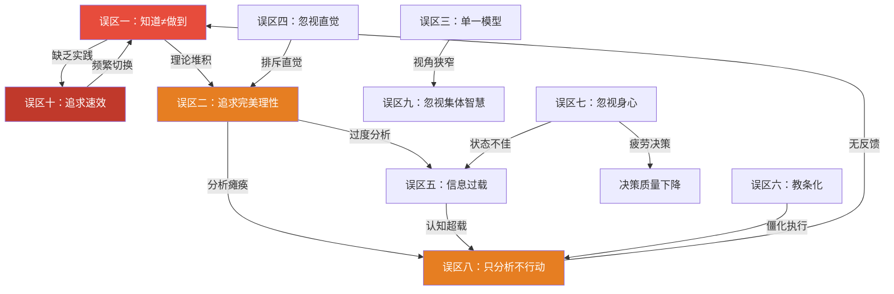
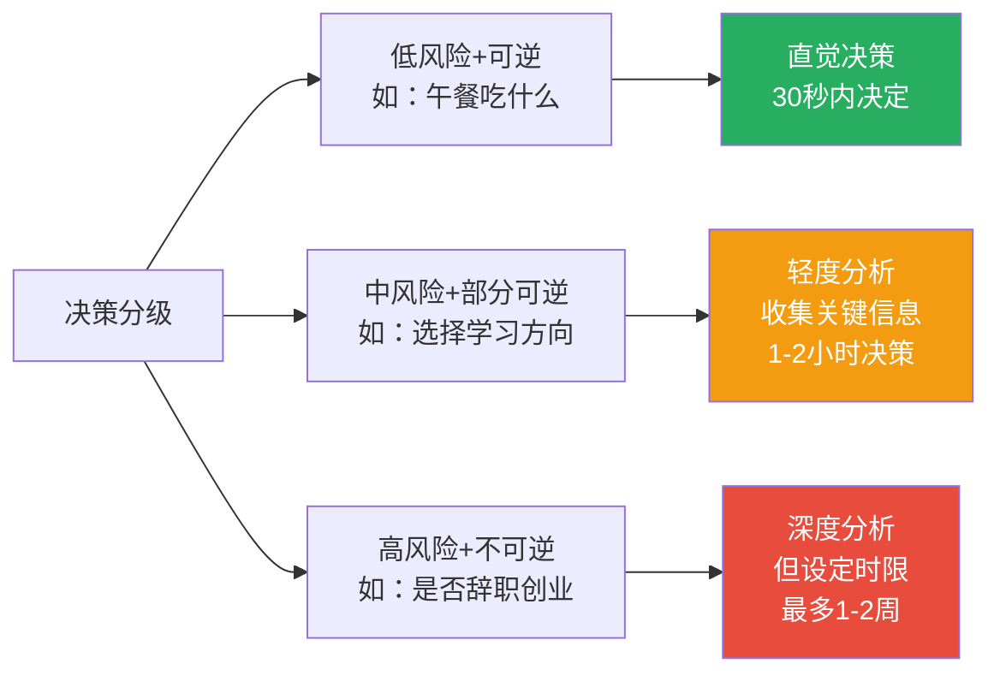
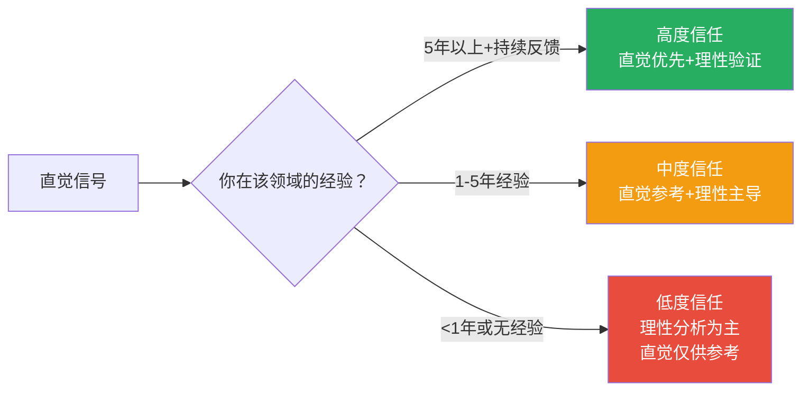
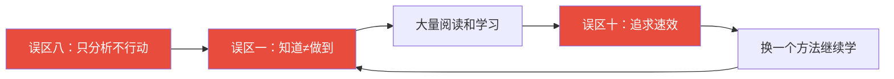

# 常见误区：思维训练中的十大陷阱与破解之道

思维提升是一条正确但容易走偏的路。许多人投入了大量时间和精力阅读思维书籍、学习认知科学，却在实际生活中收效甚微——不是因为方法本身有问题，而是因为他们踩中了思维训练中那些隐蔽的陷阱。

本章系统梳理思维提升过程中最常见的十个误区。每个误区不仅告诉你"错在哪"，还深入分析"为什么会错"、"怎么纠正"，并提供可立即使用的自测工具和练习模板。建议你在阅读时对照自省，找到自己正在犯的错误——这本身就是一次高质量的思维练习。

---

## 误区全景图：它们如何相互关联

十个误区并非孤立存在，它们往往彼此强化、形成恶性循环。理解它们之间的关联，有助于你识别自己是否陷入了复合型陷阱。

如果你同时踩中了"知道不做到"+"追求速效"+"只分析不行动"这三条，说明你陷入了典型的"学习型逃避"模式——用不断学习新方法来逃避真正的实践。

---

## 自测：你踩中了几个误区？

在深入每个误区之前，先做一个快速自测。对以下陈述打分（1=完全不符合，5=完全符合）：

| 编号 | 陈述 | 你的评分 |
|------|------|----------|
| 1 | 我能流畅讲解多种思维模型，但在实际决策中很少主动使用 | ___ |
| 2 | 我经常花很长时间分析一个问题，却迟迟无法做出决定 | ___ |
| 3 | 我发现自己习惯用同一套框架解释所有问题 | ___ |
| 4 | 我认为直觉是不可靠的，应该完全依赖理性分析 | ___ |
| 5 | 我经常收集远超需要的信息才开始决策 | ___ |
| 6 | 我严格按照学到的思维流程执行，即使感觉不太对 | ___ |
| 7 | 我经常在疲惫或情绪低落时仍强迫自己做重要决策 | ___ |
| 8 | 我花在规划和分析上的时间远多于实际行动 | ___ |
| 9 | 我倾向于独自思考重大问题，不太愿意听取他人意见 | ___ |
| 10 | 我希望在几周内看到思维能力的显著提升 | ___ |

**评分解读：**
- **1-2分**：该领域你做得不错，继续保持
- **3分**：有轻微倾向，需要注意
- **4-5分**：高危区域，需要重点纠正

---

## 误区一：知道等于做到——知识的幻觉

### 典型表现

读了《思考，快与慢》能流利讲解系统1和系统2的区别，看了《穷查理宝典》能背出25个思维模型的名称，但在实际决策中——选工作、谈薪资、处理冲突——依然完全依赖直觉和惯性。"知道概念"被误认为"掌握能力"，仿佛读完一本游泳教程就会游泳了。

一个更具欺骗性的版本是：能在文章、视频或朋友圈中漂亮地讲解某个思维工具，获得他人的点赞和认可，由此产生"我已经掌握了"的错觉。这种"知识表演"进一步固化了幻觉。

### 深层根源

**认知神经科学的解释：** 知识存储在大脑的陈述性记忆系统（主要涉及海马体和颞叶），而技能存储在程序性记忆系统（主要涉及基底神经节和小脑）。阅读和理解只能激活前者，只有反复练习才能将知识编码进后者。这就是为什么你"知道"不等于你"能做到"——它们是两套不同的神经回路。

**达克效应的放大作用：** 心理学家邓宁和克鲁格发现，能力不足的人往往会高估自己的能力水平。在思维领域，刚学了一些概念的人最容易产生"我已经懂了"的错觉。真正的高手反而清楚地知道自己的思维还有很多缺陷。

**实践数据支撑：** 教育心理学家约翰·哈蒂（John Hattie）的元分析研究显示，单纯的知识传授对实际行为改变的效果量（effect size）仅为0.06，而刻意练习的效果量高达0.60——差距是10倍。

### 纠正方法

**方法一：即时应用法（学一个用一个）**

每学完一个思维工具，立即在当天寻找真实场景应用。关键在于"立即"——拖延到明天，遗忘曲线就已经削掉了40%的记忆。

具体操作：
1. 学完一个新概念后，用手机备忘录写下："今天我在______场景中可以用到这个方法"
2. 在该场景出现时，实际使用该方法，并记录效果
3. 晚上用5分钟复盘：用了什么方法？效果如何？下次怎么改进？

**方法二：建立触发机制**

在你的日常决策节点设置"思维工具使用提醒"。这不是要你时刻保持警惕，而是在关键场景中形成条件反射。

推荐触发点：
- 每天早上规划时 → 检查是否使用了优先级框架（如艾森豪威尔矩阵）
- 接到新任务时 → 是否用了第一性原理拆解
- 做重要决定前 → 是否考虑了反面论证
- 看到新闻/热点时 → 是否识别了其中的认知偏差
- 发生冲突时 → 是否尝试了换位思考

**方法三：思维日志模板**

每天花10分钟填写以下模板，坚持30天即可形成习惯：

日期：____
今天的一个重要决策/判断：________________
我用了什么思维工具：________________
用得怎么样（1-10分）：____
如果重来我会怎么改进：________________

### 自检清单

- [ ] 我能在不看笔记的情况下，在真实场景中使用至少3个思维工具
- [ ] 我有持续记录思维日志的习惯
- [ ] 我能区分"我能讲解某个概念"和"我能熟练运用某个概念"

---

## 误区二：追求"完美理性"——分析瘫痪

### 典型表现

每次做重要决定时，都要求自己穷尽所有信息、考虑所有可能的场景、权衡所有因素。结果是决策效率极低——买一台笔记本电脑要研究两周，选一家餐厅要浏览半小时点评，发一封工作邮件要反复修改措辞。更严重的是，很多重要的决策因为"分析还没做完"而被无限期推迟。

心理学家巴里·施瓦茨（Barry Schwartz）在《选择的悖论》中指出，追求最优解的人（"最大化者"）不仅决策效率低于追求满意解的人（"满足者"），而且在决策后对自己的选择满意度也更低——因为他们总在想"也许有更好的选项我没发现"。

### 深层根源

赫伯特·西蒙（Herbert Simon）的"有限理性"理论告诉我们：人类的认知资源是有限的，在复杂环境中追求完全理性本身就是不理性的。西蒙因此获得了诺贝尔经济学奖——这个理论的重要性足以获得最高学术认可。

**完美理性追求的三重代价：**

| 代价类型 | 具体表现 | 隐性成本 |
|----------|----------|----------|
| 时间成本 | 花数天/数周研究一个决策 | 失去的时间本可用于其他重要事项 |
| 机会成本 | 因犹豫而错过最佳时机 | 很多机会有时间窗口，过了就没了 |
| 心理成本 | 决策疲劳、焦虑、自我怀疑 | 消耗意志力，影响后续决策质量 |

**关键认知纠正：** 在信息不完全的世界里（也就是现实世界），"足够好"的决策往往就是最好的决策。亚马逊创始人贝索斯将决策分为两类：
- **不可逆决策（单向门）**：需要谨慎分析，但即便如此，也有分析的合理限度
- **可逆决策（双向门）**：快速决定，在执行中调整，远比花时间追求最优解更高效

### 纠正方法

**方法一：决策分级框架**

将所有决策按影响程度和可逆性分级，对不同级别采用不同的分析深度：

**方法二：时间盒法（Time Boxing）**

给每个决策设定固定的分析时间，时间到了就必须做出决定。

操作步骤：
1. 评估决策的重要性和可逆性（1分钟）
2. 根据评估设定分析时间（如：中等决策给1小时，重大决策给1周）
3. 在设定时间内完成分析
4. 时间到后，基于已有信息做出决定
5. 记录决定，并标记为"已决定"——不再反刍

**方法三：10-10-10法则**

当犹豫不决时，问自己三个问题：
- 这个决定在 **10分钟** 后会有什么影响？
- 在 **10个月** 后会有什么影响？
- 在 **10年** 后会有什么影响？

这个框架帮助你快速判断一个决策的真实重要性——大多数让我们纠结的决策，在10年后看来完全无足轻重。

### 案例：决策分析的边际收益递减

斯坦福大学的一项实验让两组人预测足球比赛结果。A组可以查看无限量的比赛数据，B组只能查看有限数据。结果发现：当信息量超过某个临界点后，A组的预测准确率不再提升甚至下降，而决策时间却持续增长。研究者总结："更多信息 ≠ 更好决策，超过临界点的信息只会增加噪音。"

---

## 误区三：过度依赖单一思维模型——锤子综合征

### 典型表现

学了博弈论后，把所有互动都看成博弈——夫妻关系是谈判，同事合作是策略博弈，连和朋友吃饭都要算"效用函数"。学了经济学后，所有行为都归结为"理性自利"——捐款是为了获得社会资本，志愿者是为了积累简历。学了进化心理学后，所有人类行为都是"基因驱动的生存策略"。

### 深层根源

查理·芒格将这种现象称为"锤子综合征"（Man with a Hammer Syndrome）——当你手里只有锤子时，所有东西看起来都像钉子。这不是智力问题，而是认知资源的路径依赖：一旦某个模型在你脑中被成功激活了几次，大脑会倾向于将它作为默认框架。

**单一模型的三个致命缺陷：**

1. **遮蔽效应**：任何模型都是对现实的简化，选择了某个视角就必然遮蔽了其他维度
2. **确认偏差放大**：当你是"锤子人"时，你会不自觉地寻找支持锤子理论的证据，忽略反面证据
3. **过度自信**：单一模型提供的确定感会让你高估自己对复杂问题的理解程度

### 纠正方法

**方法一：多模型分析法（Latticework）**

芒格建议建立一个"多元思维模型格栅"（Latticework of Mental Models）。对每个重要问题，强迫自己使用至少3个不同学科的模型来分析。

实操模板：

问题：________________

模型1（心理学视角）：________________
→ 这个模型揭示了什么：________________

模型2（经济学视角）：________________
→ 这个模型揭示了什么：________________

模型3（系统论视角）：________________
→ 这个模型揭示了什么：________________

三个模型的交集/共识：________________
三个模型的冲突/矛盾：________________
我的综合判断：________________

**方法二：建立模型清单并定期更新**

维护一个个人思维模型清单，按学科分类：

| 学科 | 核心模型 | 适用场景 | 局限性 |
|------|----------|----------|--------|
| 心理学 | 认知偏差清单、双系统理论 | 理解人的行为和决策 | 难以量化，预测力有限 |
| 经济学 | 供需、边际分析、机会成本 | 资源配置和激励分析 | 假设理性人，忽略情感因素 |
| 系统论 | 反馈回路、涌现、杠杆点 | 复杂系统分析 | 模型建立门槛高 |
| 概率论 | 贝叶斯更新、基础概率 | 不确定性下决策 | 需要数据支撑 |
| 博弈论 | 纳什均衡、囚徒困境 | 多方互动分析 | 信息完全假设常不成立 |

**方法三：主动寻找反面观点**

对每个你偏爱的模型，系统性地收集批评和局限性：
- 搜索"XXX模型 批评"或"XXX理论 局限性"
- 阅读反对该模型的学者的文章
- 在思维日志中记录"这个模型解释不了的案例"

---

## 误区四：忽视直觉的价值——理性的傲慢

### 典型表现

学了理性思维工具后，开始全面否定直觉——"直觉就是认知偏差的代名词"。在需要快速决策的场景中反应迟钝，因为总想"理性分析一下"。甚至在自己有丰富经验的领域，也不敢信任直觉判断。

### 深层根源

卡尼曼在《思考，快与慢》中描述的"系统1"（直觉系统）经常被误读为"坏的系统"。事实远非如此——系统1在人类进化和日常生活中承担了绝大部分决策工作，而且在大多数场景中表现良好。

**直觉的真正本质：** 认知科学家加里·克莱因（Gary Klein）的研究表明，直觉不是"胡猜"，而是大脑基于大量经验进行的模式识别——它是压缩后的专业知识。消防队长在火场中的"第六感"、资深棋手的"棋感"、老医生的"临床直觉"，都是多年经验在潜意识中形成的快速判断能力。

**直觉的双面性：**

| 维度 | 高质量直觉 | 低质量直觉 |
|------|-----------|-----------|
| 条件 | 领域有规律可循 + 大量练习 + 及时反馈 | 混沌无规律的领域 + 缺乏经验 + 反馈延迟 |
| 例子 | 棋手判断棋局、医生初步诊断 | 预测股市走势、判断彩票号码 |
| 可信度 | 高——可以作为决策的重要依据 | 低——需要理性分析来校验 |

### 纠正方法

**方法一：建立直觉信任分级**

根据你在特定领域的经验水平，确定对直觉的信任程度：

**方法二：直觉-理性校准法**

不是"用理性替代直觉"，而是"用理性校准直觉"：
1. 先记录你的直觉判断（不要分析，只记录第一反应）
2. 然后进行理性分析
3. 比较两者的差异
4. 如果差异大，分析原因——是直觉被偏差扭曲了，还是理性分析遗漏了什么
5. 长期积累后，你会知道自己的直觉在哪些场景可靠，在哪些场景有系统性偏差

**方法三：注意直觉的"异常信号"**

当你的直觉发出强烈信号（不管是正面的"这件事不对劲"还是负面的"我感觉会出问题"），即使你无法解释原因，也应该停下来认真对待。直觉经常比意识更早察觉到模式中的异常——这是进化赋予人类的生存能力。

---

## 误区五：信息过载导致思维瘫痪

### 典型表现

分析问题时陷入"信息收集无底洞"——买手机要对比20款参数，选餐厅要看100条评价，做职业规划要读完50篇文章。信息越多，反而越难做出决定。更讽刺的是，有时凭第一反应做出的判断，比花三天研究后做出的判断质量更高。

### 深层根源

**认知负荷理论：** 米勒（George Miller）的经典研究表明，人类工作记忆的容量约为7±2个信息块。当输入信息超过这个容量时，大脑要么丢弃信息（导致重要信息被忽略），要么降级处理（导致分析质量下降）。

**信息与决策质量的倒U型关系：**

决策质量
  ↑
  │        ·····
  │      ·       ·
  │    ·           ·
  │  ·               ·····
  │·                       ·····
  └──────────────────────────────→ 信息量
       最佳区间          过载区间

研究发现，超过最佳信息量后，每增加一条信息，决策质量下降约1-2%，但决策时间增加5-10%。在信息爆炸的时代，学会"不看什么"比"看什么"更重要。

### 纠正方法

**方法一：预设信息收集边界**

在开始分析前，明确回答以下问题：
1. 我需要做出什么决定？（一句话说清楚）
2. 做出这个决定需要哪些关键信息？（不超过5项）
3. 每项信息从哪里获取？（具体来源）
4. 什么时候停止收集？（具体时间或信息量）

**方法二：信号-噪音过滤器**

将收集到的信息分为三类：
- **核心信号**：直接影响决策结果的关键信息 → 重点分析
- **补充信息**：能增加决策信心但不改变方向的信息 → 快速浏览
- **噪音**：有趣但与决策无关的信息 → 主动忽略

**方法三：满意化策略（Satisficing）**

赫伯特·西蒙提出的"满意化"是"最大化"（Maximizing）的对立面：
- **最大化**：穷尽所有选项，找到最优解 → 高成本、低满意度
- **满意化**：设定最低标准，找到第一个满足标准的选项 → 低成本、高满意度

操作步骤：
1. 明确你的决策标准（不超过3-5个）
2. 为每个标准设定"可接受"的最低阈值
3. 按顺序评估选项
4. 第一个满足所有标准的选项就是你的选择——不再继续看后面的

---

## 误区六：将思维工具教条化

### 典型表现

把思维模型和方法当作不可违反的规则，死板地按照流程执行。比如：每次决策都必须画完整的因果图，每个问题都必须进行五步第一性原理分析，每封邮件都必须先用金字塔原理写提纲。当工具在某个场景中不适用时，不是灵活调整，而是怀疑自己的使用方式"不够标准"。

### 深层根源

将手段误认为目的。思维工具存在的唯一目的是帮助你做出更好的判断——如果工具反而阻碍了思考或降低了效率，那它在这个场景中就失去了意义。

**教条化的两个隐性危害：**

1. **认知资源浪费**：在简单问题上执行复杂工具，消耗了本应用在更关键问题上的认知资源
2. **虚假胜任感**：严格按照流程执行给人一种"我做了正确的事"的感觉，但流程正确不等于结果正确

### 纠正方法

**方法一：工具选择矩阵**

根据问题的复杂度和紧迫度选择合适的工具深度：

|  | 低紧迫度 | 高紧迫度 |
|--|----------|----------|
| **低复杂度** | 简单分析即可，5分钟 | 直觉决策，信任经验 |
| **高复杂度** | 深度分析+多模型，设定时限 | 核心框架快速应用，不求完美 |

**方法二：工具"瘦身"原则**

对每个你学到的思维工具，思考：
- 这个工具的核心原理是什么？（一句话）
- 在哪些场景中它是多余的？
- 如果只能保留这个工具的一步，应该是哪一步？

掌握工具的"极简版"比死记完整流程更有用。

**方法三：保持实用主义心态**

查理·芒格说："我不关心一个理论来自哪个学科，我只关心它是否能帮助我更好地理解现实。" 同样，你不应该关心一个工具是否被"正确使用"，而应该关心它是否帮助你做出了更好的决定。如果一个工具在某个场景中不好用，果断换一个。

---

## 误区七：忽视情绪和身体的作用

### 典型表现

认为思维提升只需要"动脑"——多读书、多练习、多分析。忽视了情绪状态、睡眠质量、身体状况对思维质量的根本性影响。在疲惫、焦虑、饥饿、愤怒的状态下强行进行深度思考，结果不仅思考质量低下，还可能做出日后后悔的决策。

### 深层根源

**身心不可分割的科学证据：**

笛卡尔的身心二元论深刻影响了我们的文化——我们习惯将"思考"和"身体"视为两个独立系统。但现代神经科学已经清楚地证明：

- **睡眠**：沃克（Matthew Walker）的研究表明，连续17小时不睡觉的认知能力下降等同于血液酒精浓度0.05%（达到醉驾标准）。睡眠不足时，前额叶皮层（负责理性分析的区域）活动下降，而杏仁核（负责情绪反应的区域）活动增强——你变得更情绪化、更冲动。
- **运动**：哈佛大学一项涵盖120万人的研究发现，规律运动的人在认知测试中表现显著优于不运动的人。有氧运动能促进BDNF（脑源性神经营养因子）的分泌，直接促进海马体（记忆和学习的关键区域）的神经生长。
- **血糖**：大脑消耗全身约20%的能量。低血糖状态下，认知功能（尤其是需要自控力和复杂推理的任务）会显著下降。这就是为什么法官在午餐前做出的判决比午餐后更严厉。
- **压力**：适度的压力（肾上腺素适度升高）能提升注意力和短期表现，但长期或过高的压力会导致皮质醇水平持续升高，损害海马体功能，降低工作记忆容量。

**情绪不是思维的敌人——它是思维的信号。**

神经科学家安东尼奥·达马西奥（Antonio Damasio）的"躯体标记假说"表明：情绪在决策中扮演着不可或缺的角色。他研究了前额叶损伤的患者——这些患者保留了完整的逻辑推理能力，但由于无法产生情绪反应，他们在日常决策中变得极度低效甚至无法做出决定。这说明：纯粹的"理性"并不足以支撑好的决策。

### 纠正方法

**方法一：决策前的"身心状态检查"**

在做重要决策前，用30秒回答以下问题：
1. 我现在睡了几个小时？（<6小时 → 推迟非紧急决策）
2. 我上次吃饭是什么时候？（>4小时 → 先吃点东西）
3. 我现在的情绪状态是什么？（识别并命名情绪：焦虑、愤怒、兴奋、平静...）
4. 我是否有身体不适？（头痛、胃不舒服、感冒...）

如果身体或情绪状态不佳，且决策不紧急——推迟。这个简单的检查能避免大量低质量决策。

**方法二：利用"黄金时段"**

每个人都有自己精力最充沛的时段（通常是起床后2-4小时）。在这个时段安排最重要的思考和决策工作。具体操作：
- 记录一周内每个时段的精力水平（1-10分）
- 找到你的精力峰值时段
- 把最重要的决策和思考安排在这个时段
- 把低认知需求的任务（回邮件、整理文件）安排在低谷时段

**方法三：区分情绪信号和情绪噪音**

情绪既携带有价值的信息，也可能产生干扰。关键在于区分：
- **情绪信号**：基于真实威胁或机会的合理情绪反应（如对一个"太好而不真实"的机会感到不安——这种直觉可能捕捉到了你意识层面忽略的风险）
- **情绪噪音**：与当前决策无关的情绪投射（如因工作不顺而在家庭决策中变得悲观）

判断标准：问自己"这个情绪和当前决策有直接关系吗？" 如果有，认真倾听；如果没有，识别它、接受它、然后把它放在一边。

---

## 误区八：只关注分析，忽视行动

### 典型表现

花大量时间进行"完美"的分析和规划——写详细的职业发展计划、做完整的学习路线图、列详尽的创业方案——但在行动环节却犹豫不决或执行力不足。"等我分析完就开始"变成了永远的口头禅。分析本身成了逃避行动不适感的庇护所。

### 深层根源

分析带来确定感和掌控感，而行动意味着面对不确定性和可能的失败。心理学研究表明，人类大脑天生厌恶不确定性——不确定性激活的脑区与身体疼痛相同。因此，停留在"舒适的分析区"而避免"不确定的行动区"是一种自我保护机制。

**更隐蔽的版本：** 有些人把"学习新方法"本身当成了行动——"等我学完这10本书就去创业"，"等我掌握这个框架就开始写报告"。学习是低风险的（你不会因为读了一本书而失败），而行动是高风险的（你可能在行动中遭遇失败和批评）。用学习替代行动，本质上是一种精致的拖延。

### 纠正方法

**方法一：分析-行动配比法则**

不同类型的任务有不同的最佳分析-行动配比：

| 任务类型 | 推荐配比（分析:行动） | 原因 |
|----------|----------------------|------|
| 创意类任务 | 20:80 | 创意在行动中产生，过度分析扼杀创造力 |
| 探索性任务 | 30:70 | 信息在行动中获取，不做就不知道 |
| 执行性任务 | 10:90 | 方向已明确，关键是执行 |
| 战略性任务 | 40:60 | 需要深思但不能陷入无限分析 |

**方法二：最小可行决策（MVD）**

借鉴精益创业的"最小可行产品"概念——做出一个"足够好"的决策，立即开始执行，在执行过程中收集反馈并迭代优化。

操作步骤：
1. 用30分钟快速分析，确定核心标准和方向
2. 做出一个"及格"的决定
3. 立即开始执行（哪怕只有一个小步骤）
4. 在执行中收集反馈
5. 根据反馈调整方向

**方法三：两分钟法则**

对于可逆且影响不大的决策：如果在两分钟内无法做出决定，就选择第一个可行的选项。这个规则的核心不是"两分钟"这个具体数字，而是建立一个"快速决策并行动"的习惯。

**方法四：截止日期强制法**

为每个重要决策设定一个"决定截止日"。告诉自己："到了这个日期，不管分析到什么程度，我都必须做出选择并开始行动。" 把这个截止日告诉一个你信任的人——外部约束比自我约束更有效。

---

## 误区九：单打独斗，忽视集体智慧

### 典型表现

认为思维提升是纯粹的个人修行，完全依靠自己来分析和判断。不寻求外部视角，不愿暴露自己的思考过程，觉得"问别人"是能力不足的表现。结果陷入个人的思维盲区而不自知——你的盲区在别人眼中可能一目了然。

### 深层根源

**对"独立思考"的误解：** 独立思考不等于孤立思考。独立思考的核心是"形成自己的判断"，但这不排斥——甚至要求——从多元的信息源和视角中获取输入。真正的独立思考者善于整合外部信息，形成自己的判断，而不是拒绝一切外部输入。

**知识的诅咒：** 一旦你对某个问题形成了自己的看法，你就很难从原始状态重新审视它。外部人没有这个包袱，他们能看到你因为"已知太多"而看不到的东西。

**研究支撑：** 斯科特·佩奇（Scott Page）的"多样性预测定理"表明：在复杂问题上，一群背景多样的人的集体判断往往比任何单一专家的判断更准确。这不是"三个臭皮匠胜过诸葛亮"的简单说法，而是一个数学上可证明的结论——多样性的视角能抵消个体的系统性偏差。

### 纠正方法

**方法一：建立个人"智囊团"**

找到2-4个满足以下条件的人，定期交流：
- 你信任他们的判断力和人品
- 他们有不同的专业背景和思维风格
- 他们愿意坦诚地指出你的思考盲点
- 你也愿意为他们提供同样的价值

**方法二：钢铁人论证法（Steel Manning）**

在反驳或拒绝一个观点之前，先用自己的话把它表述得比原始版本更有说服力。如果你做不到，说明你还没有真正理解这个观点。

练习步骤：
1. 听到/读到一个你不同意的观点
2. 先不要反驳，尝试用你自己的话重述它
3. 问自己："这个观点在什么条件下是成立的？"
4. 如果你能把反面观点表述得让支持者都说"对，就是这样"，你才真正理解了争议的本质
5. 然后再基于这个深度理解形成你的判断

**方法三：魔鬼代言人练习**

定期邀请他人对你的分析和决策提出质疑。关键是选择对的人——你需要的是"理性质疑者"（能指出你逻辑漏洞的人），而不是"习惯性反对者"（为了反对而反对的人）。

具体的提问方式：
- "我的分析中有什么盲点？"
- "如果你站在反对立场，你会怎么说？"
- "有什么证据会改变我的结论？"

---

## 误区十：追求速效，忽视长期积累

### 典型表现

希望找到一种"思维速成法"——几天或几周内就能大幅提升思维能力。买了10本思维书籍，报了3个思维课程，学了一堆思维工具，期待很快能看到"明显的进步"。几周后发现生活和决策并没有明显改善，于是得出"这些方法没用"的结论，转而寻找下一个"更有效"的方法。

### 深层根源

**即时满足的进化本能：** 人类大脑的奖励系统偏好即时回报——远古时代，能立刻获得的食物比三个月后成熟的果实更有生存价值。但在思维能力这种需要长期积累的领域，这种本能成了最大的障碍。

**思维能力的本质特征：**

思维能力不像学骑自行车（学会了就不会忘）或学一个软件（几天就能上手）。它更像是健身——需要持续练习才能维持和进步，一旦停止就会退化，但长期坚持会产生累积效应。

认知心理学家安德斯·埃里克森（Anders Ericsson）的"刻意练习"理论指出，专家级能力的形成通常需要10年或10000小时的刻意练习——但这不是机械重复，而是有目标、有反馈、不断挑战舒适区的练习。

**实际的时间线预期：**

| 阶段 | 时间范围 | 你可能经历的变化 |
|------|----------|-----------------|
| 初期 | 1-3个月 | 开始注意到自己的思维偏差，但还无法有效纠正 |
| 建立期 | 3-6个月 | 能在部分场景中主动使用思维工具，偶尔"灵光一闪" |
| 巩固期 | 6-12个月 | 越来越多的思维工具开始成为习惯，决策质量明显提升 |
| 内化期 | 1-3年 | 多数思维工具已成为你的默认思维方式，无需刻意调用 |
| 精通期 | 3年以上 | 能灵活组合各种工具，根据场景自如切换，还能创造自己的框架 |

### 纠正方法

**方法一：设定合理预期，关注过程指标**

不要以"我是否变聪明了"作为衡量标准——这个标准太模糊，短期内无法衡量。改为关注过程指标：
- 本周我在几个真实场景中使用了思维工具？
- 我的思维日志记录了几天？
- 我识别出了几个之前忽略的认知偏差？

这些过程指标是可以量化和追踪的，它们最终会导向结果指标。

**方法二：记录微进步**

思维提升的进步是渐进的，如果不刻意记录，很容易被忽略。建立一个"微进步记录"：

日期：____
今天的微进步：________________
（例如：第一次在吵架时意识到自己在使用人身攻击谬误）
感受：________________

定期回顾这些记录（每月一次），你会惊讶于自己进步了多少。

**方法三：建立"终身学习"心态**

将思维训练看作像刷牙一样的终身习惯，而不是一个有明确终点的项目。这消除了"什么时候能看到效果"的焦虑——因为你已经接受了"这是一个持续的过程"。

查理·芒格在90多岁时仍在不断学习和改进自己的思维方法。他说："每天睡觉前，比起床时聪明一点点。" 这句话的力量在于"一点点"——不是大的飞跃，而是微小但持续的进步。

---

## 十大误区的关系与复合陷阱

在现实中，误区往往不是单独出现的。它们会形成"复合陷阱"——多个误区相互强化，让你陷入难以自拔的恶性循环。

### 三种典型的复合陷阱

**陷阱一：学习型逃避**

**特征：** 持续学习新方法但从不实践，用"学习"替代"行动"，不断切换方法追求速效。
**破解：** 强制自己"一个方法用30天再换"，设定每日最低行动量。

**陷阱二：分析型瘫痪**

**特征：** 不断收集信息、分析方案，但始终无法做出决定并行动。
**破解：** 设定决策截止日，强制执行"时间盒法"，接受"足够好"。

**陷阱三：孤立型固执**

**特征：** 固守单一思维框架，不愿听取外部意见，把工具当教条。
**破解：** 建立智囊团，每周主动寻求一次外部视角，强制使用多模型分析。

---

## 总结：三个核心教训

十个误区可以归纳为三个根本性的教训：

### 教训一：实践重于理论

思维能力是练出来的，不是读出来的。知识存储和技能存储是两套不同的神经系统——前者通过阅读获得，后者只能通过反复练习形成。每学一个工具，立刻在真实场景中使用。建立思维日志，记录每一次应用和反思。**行动量是思维提升的第一变量。**

### 教训二：平衡重于极端

思维提升中的几乎每个维度都需要平衡，而非追求极端：
- **理性与直觉**：不是"二选一"，而是"何时信任哪个"
- **分析与行动**：不是"分析完了再行动"，而是"边分析边行动"
- **个人与集体**：不是"独立思考"或"听别人的"，而是"整合多元视角形成自己的判断"
- **工具与灵活**：不是"严格按流程"或"随意发挥"，而是"掌握工具本质后灵活运用"

### 教训三：长期重于短期

思维提升是终身修炼，不是速成项目。它更像健身而非学骑车——需要持续练习，进步是渐进的，但累积效果是惊人的。设定合理预期（6-12个月看到明显进步），关注过程而非结果，记录微小进步，把思维训练融入日常生活的每个决策中。

最后，连查理·芒格这样的人也在90多岁时仍在不断学习和改进自己的思维方法——思维提升没有终点，但每一步都让你成为更好的思考者。现在就开始：选一个你最可能犯的误区，今天就用纠正方法中的第一个步骤去行动。
