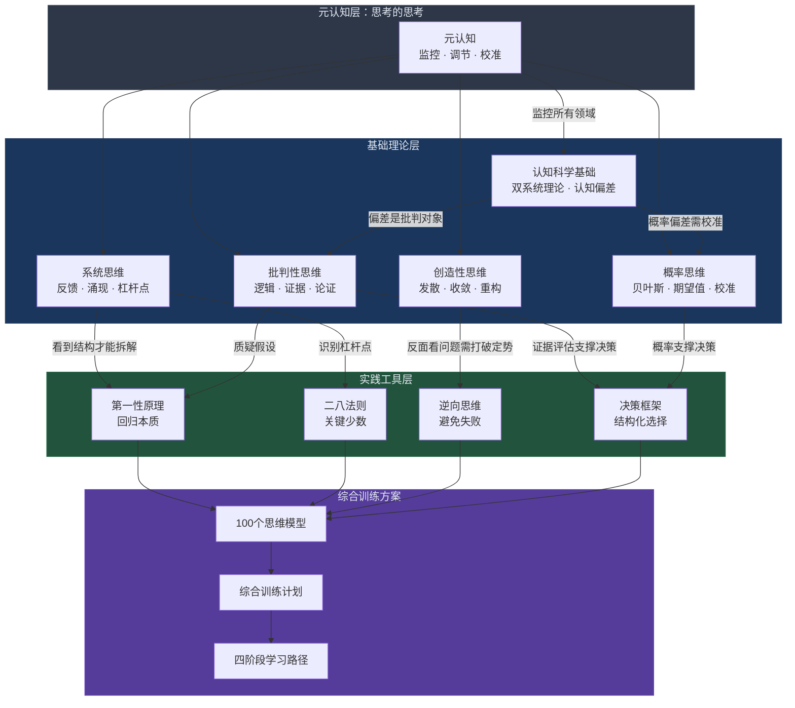

# 本章小结：思维提升全景回顾与行动指南

> "思维的质量决定生活的质量。" —— 亚里士多德

本章从认知科学的底层原理出发，经过批判性思维、创造性思维、系统思维、概率思维、元认知六大理论模块的学习，到第一性原理、二八法则、逆向思维、概率思维四大核心工具的实操训练，再到决策框架、问题解决方法论、创新训练、逻辑训练等综合方案的实践应用，为你构建了一套完整的思维提升体系。本小结将系统回顾所有核心内容，提供自检评估，给出分层行动指南，帮助你将本章所学转化为日常思维习惯。

---

## 一、七大理论领域核心要点回顾

本章的基础理论部分覆盖了七大思维领域，它们不是孤立的知识点，而是层层递进、相互支撑的有机整体。

### 1.1 认知科学基础：理解大脑如何思考

认知科学是一切思维提升的起点——你必须先理解大脑的运作机制，才能知道在哪些环节会出现偏差、如何纠正。

**核心概念：**

| 概念 | 要义 | 为什么重要 |
|------|------|-----------|
| 双系统理论 | 系统1（快思维）自动、快速、依赖直觉；系统2（慢思维）理性、费力、需要注意力 | 思维提升的本质是让系统2更好地监控系统1，同时将高质量思维模式"下放"为系统1的自动化习惯 |
| 认知偏差 | 系统1使用启发式规则产生的系统性错误 | 偏差不是"缺陷"而是进化产物，但在现代高风险决策中需要识别和纠正 |
| 启发式 | 大脑用来简化复杂判断的心理捷径 | 理解启发式才能理解偏差的产生机制，从而有针对性地校准 |
| 神经可塑性 | 大脑神经元连接因反复使用而增强 | 思维能力可以通过刻意练习改变——这是所有训练的科学基础 |

**关键认知偏差速查表（本章详细讲解了15种以上）：**

| 类别 | 偏差名称 | 核心表现 | 应对要诀 |
|------|---------|---------|---------|
| 信息处理 | 锚定效应 | 第一信息过度影响后续判断 | 主动从多角度设定锚点，用客观数据替代第一印象 |
| 信息处理 | 可得性偏差 | 容易回忆的事被高估概率 | 主动查找统计数据，不依赖记忆判断频率 |
| 信息处理 | 确认偏误 | 只关注支持自己观点的信息 | 主动寻找反面证据，设定"改变想法的条件" |
| 信息处理 | 代表性偏差 | 用相似度替代概率判断 | 始终考虑基础概率，联合事件概率不会大于单一事件 |
| 决策 | 沉没成本谬误 | 因已投入而继续不值得的事 | 问"如果从零开始，我还会选吗？" |
| 决策 | 损失厌恶 | 损失痛苦是收益快乐的2倍 | 将"不行动"也视为选择，评估其成本 |
| 决策 | 过度自信 | 高估自己判断的准确度 | 记录预测与结果，定期校准 |
| 决策 | 现状偏差 | 偏好维持现状 | 将现状也视为需要辩护的选择 |
| 社会偏差 | 从众效应 | 因多数人做而跟从 | 独立思考后再参考他人意见 |
| 社会偏差 | 权威偏差 | 因权威身份降低审查标准 | 关注证据本身，区分权威的领域边界 |
| 记忆偏差 | 后见之明 | 事后觉得"早就知道" | 事前记录预测，事后验证准确率 |

### 1.2 批判性思维：理性判断的基石

批判性思维是对"思考的思考"——用理性的标准审视推理过程和结论。

**五大核心要素：**

1. **明确问题与目的**：清晰界定问题，练习"问题重构"——很多时候无法解决问题是因为问错了问题
2. **评估信息来源**：掌握证据层级金字塔（系统评价 > 随机对照 > 队列研究 > 病例对照 > 轶事证据）
3. **识别逻辑谬误**：掌握相关性谬误（稻草人、诉诸权威、诉诸情感、人身攻击等）、因果谬误（后此谬误、相关即因果、滑坡谬误等）、逻辑结构谬误（虚假二分法、循环论证、以偏概全等）
4. **考虑替代解释**：面对任何现象，主动寻找至少3种替代解释，不接受第一个合理答案
5. **形成合理结论**：根据证据强度校准信心水平——极强证据对应"几乎可以确定"，弱证据对应"不确定"

**核心实践工具：**

- **苏格拉底提问法**：通过持续追问（为什么？证据是什么？有什么替代解释？）穿透表面答案
- **红队思维**：主动扮演反对者角色，寻找自己论点的漏洞
- **钢铁人论证法**：在反驳之前，先把对方观点表述得比原版更有说服力

### 1.3 创造性思维：突破常规的力量

创造力不是灵光一闪的天赋，而是可以系统化培养的能力。

**核心方法论：**

| 方法 | 适用场景 | 操作要点 |
|------|---------|---------|
| 发散思维 | 需要大量创意时 | 延迟判断、追求数量、鼓励异想天开、在此基础上组合改良 |
| 收敛思维 | 筛选和聚焦时 | 设定评估标准、分类聚类、投票排序、可行性验证 |
| SCAMPER法 | 对现有事物改进 | 替代(S)、合并(C)、调整(A)、修改(M)、另作他用(P)、消除(E)、重排(R) |
| 六顶思考帽 | 团队讨论和决策 | 白帽(事实)、红帽(情感)、黑帽(风险)、黄帽(价值)、绿帽(创意)、蓝帽(管控) |
| 类比思维 | 跨领域借鉴 | 将问题抽象化、去除行业特征、在其他领域找相同结构的解决方案 |

**突破创造性障碍的关键认知：**

- 功能固着：只看到事物的传统用途 → 有意识地练习"重新定义用途"
- 思维定势：用旧方法解决新问题 → 强制改变问题框架
- 过早收敛：在创意不够时就筛选 → 设定"发散时间"，时间到了才开始筛选

### 1.4 系统思维：看见整体与关联

系统思维让你看到事物之间的关联、反馈循环和涌现特性，避免线性因果思维的陷阱。

**核心概念框架：**

| 概念 | 含义 | 实际应用 |
|------|------|---------|
| 反馈循环 | 正反馈（自我增强）和负反馈（自我调节） | 识别问题背后的增强回路，找到打破恶性循环的杠杆点 |
| 延迟效应 | 原因和结果之间有时间差 | 理解"做了但没效果"可能是延迟效应，不要过早放弃 |
| 涌现特性 | 简单规则产生复杂行为 | 团队效能不是个体能力的简单加总 |
| 杠杆点 | 小投入产生大效果的关键节点 | 把精力放在杠杆点上，而非均匀分布 |
| 冰山模型 | 事件→模式→结构→心智模型 | 透过表面事件看到深层结构和思维模式 |

**因果回路图绘制方法：**

1. 列出问题涉及的所有关键变量
2. 用箭头连接因果关系（+表示同向变化，-表示反向变化）
3. 识别正反馈环路（恶性/良性循环）和负反馈环路（自我调节机制）
4. 标注延迟效应
5. 找到杠杆点——小改变能撬动整个系统的节点

### 1.5 概率思维与统计思维：在不确定性中决策

概率思维用概率而非确定性来理解世界，这是在不确定环境中做出更好决策的核心能力。

**核心能力清单：**

- **概率校准**：让你说的"很可能"真正对应高概率值。研究表明，当人们说"很可能"时，实际概率平均只有50-65%——这需要通过持续校准来修正
- **贝叶斯更新**：新证据应该更新而非推翻信念。公式核心是"后验 = 先验 × 似然度 / 证据强度"。实用要点：先验信念很重要（创业成功率约10%）、一个高质量证据抵100个低质量证据
- **期望值计算**：面对不确定性决策，计算"概率 × 收益"的期望值，而非只看最可能的结果
- **基础概率思维**：做判断时先问"这类事件的总体概率是多少？"而非只看个案信息
- **区分好决策和好结果**：结果好不代表决策好（可能有运气成分），结果差不代表决策差

**概率校准训练方法：**

每天对5个不确定事件给出概率估计，记录实际结果，每周回顾。长期积累后，你说"70%概率的事"确实有约70%发生——这就是校准的目标。

### 1.6 元认知：思考的思考

元认知是思维提升的"操作系统"——它让你监控、评估和调节自己的思维过程，是所有其他思维技能的前提。

**元认知的三个层次：**

| 层次 | 能力 | 核心问题 | 训练方法 |
|------|------|---------|---------|
| 觉察层 | 知道自己在想什么 | "我现在在用什么方式思考？" | 思维旁观、情绪标签、思维模式识别 |
| 评估层 | 知道思考质量如何 | "我的推理有没有漏洞？" | 逻辑性/全面性/证据支持/偏差检测/情绪影响五维评估 |
| 调节层 | 能改变思考方式 | "我需要切换到什么策略？" | 切换思维模式、改变视角、寻求外部输入、暂停决策 |

**元认知日常训练四件套：**

1. **思维日志**：每天记录10分钟，追踪思维过程和决策依据
2. **偏差审计**：每周回顾本周决策，识别认知偏差的影响
3. **决策回顾**：每月回顾重大决策，对比预期和实际结果
4. **模式总结**：每季度总结自己的思维模式和改进方向

### 1.7 六大领域整合：跨学科思维工具箱

六大领域不是独立模块，而是有机整体。整合的关键是：

**场景切换策略：**

| 面对的问题类型 | 优先启动的思维方式 | 辅助思维方式 |
|--------------|------------------|------------|
| 信息真伪判断 | 批判性思维 | 概率思维、认知科学 |
| 复杂系统问题 | 系统思维 | 批判性思维、元认知 |
| 需要创新突破 | 创造性思维 | 逆向思维、第一性原理 |
| 不确定性决策 | 概率思维 | 系统思维、决策框架 |
| 自我觉察改进 | 元认知 | 认知科学、批判性思维 |
| 重大人生选择 | 多模型综合分析 | 全部领域轮番审视 |

---

## 二、四大核心思维工具回顾

四大工具是思维提升的"瑞士军刀"——覆盖了从问题定义到方案构建到风险规避到不确定性处理的完整链条。

### 2.1 第一性原理：回归事物本质

| 维度 | 内容 |
|------|------|
| 核心理念 | 不接受类比和惯例，将问题拆解到最基本的物理事实和逻辑公理，从零重建解决方案 |
| 操作步骤 | ①定义问题 → ②列出所有假设 → ③分类验证（事实/推断/习惯） → ④只保留已验证事实 → ⑤从基本事实重新推理 |
| 典型案例 | 特斯拉电池降本：市场价600美元/kWh → 分解为原材料（约80美元/kWh） → 判断问题在制造效率和供应链 → 指导超级工厂战略 |
| 常见误用 | "质疑一切"不是第一性原理，而是虚无主义；关键是区分"基本事实"和"未经检验的假设" |
| 适用场景 | 行业惯例突破、成本结构优化、产品设计重构、战略方向选择 |

### 2.2 二八法则（帕累托法则）：聚焦关键少数

| 维度 | 内容 |
|------|------|
| 核心理念 | 在大多数系统中，少数因素产生了多数效果 |
| 四层递进 | ①识别关键的20% → ②将资源集中于此 → ③递归应用（关键的20%中的20%，即4%） → ④定期重评（关键因素会变化） |
| 实操方法 | 时间二八分析：精确记录一周时间使用，找到产出最高的20%时间段和活动 |
| 关键认知 | 80/20不是精确比例，而是关于分布不均匀的思维方式；实际可能是70/30或90/10 |
| 适用场景 | 时间管理、精力分配、客户管理、技能学习、问题排查 |

### 2.3 逆向思维：从反面出发

| 维度 | 内容 |
|------|------|
| 核心理念 | "反过来想，总是反过来想"——通过避免失败来找到成功的路径 |
| 三种模式 | ①预验尸（假设已失败，推理原因）→ 项目启动前风险评估 ②反面清单（如何确保失败？然后避免）→ 任何目标导向场景 ③反事实推理（关键条件不同会如何？）→ 回顾决策、理解因果 |
| 典型案例 | 芒格："如果我知道我会死在哪里，我就永远不去那个地方"——知道不该做什么，比知道该做什么更重要 |
| 实操建议 | 建立个人"反面清单"，持续记录犯过的错误、观察到的失败案例、书中的教训 |

### 2.4 概率思维：在不确定性中决策

| 维度 | 内容 |
|------|------|
| 核心理念 | 用概率而非确定性理解世界；区分"好决策"和"好结果" |
| 四大技能 | ①概率校准（让"很可能"对应真实高概率） ②贝叶斯更新（新证据更新而非推翻信念） ③期望值计算（概率×收益） ④基础概率意识（先看总体率，再看个案） |
| 核心警示 | 结果好≠决策好（运气成分）；结果差≠决策差（可能做了正确的事但运气不好） |
| 校准方法 | 每日5题概率估计 + 结果记录 + 周度回顾，长期训练使主观概率与客观频率一致 |

---

## 三、六大具体方案核心要点

具体方案部分将理论转化为可执行的训练体系。

### 3.1 思维模型大全

本章系统介绍了100个跨学科思维模型，涵盖心理学、经济学、系统论、概率论、博弈论、进化论六大领域。掌握这些模型的关键不是死记硬背，而是：

- **理解核心洞察**：每个模型用一句话说清它揭示了什么
- **知道适用场景**：什么问题用什么模型
- **了解局限性**：每个模型在什么情况下会失效
- **练习组合使用**：面对复杂问题，同时用3-5个模型分析，比较各自揭示了什么、忽略了什么

### 3.2 决策框架

从混乱到清晰的结构化决策流程：

1. **决策分级**：按影响程度和可逆性分级（低风险+可逆 → 直觉决策；高风险+不可逆 → 深度分析+设定时限）
2. **多属性决策**：对涉及多个冲突目标的决策，使用加权评分法（列出属性→分配权重→逐一打分→计算总分）
3. **贝叶斯决策**：持续更新概率估计，而非一次性拍板
4. **时间盒法**：给每个决策设定分析时限，时间到了必须决定
5. **10-10-10法则**：问"10分钟后/10个月后/10年后这个决定的影响？"快速判断真实重要性

### 3.3 问题解决方法论

系统化的问题拆解和解决路径：

1. **问题重构**：很多时候解决不了是因为问错了问题
2. **MECE原则**：相互独立、完全穷尽地拆解问题
3. **五个为什么**：丰田方法，连续追问穿透表面原因
4. **根因分析**：区分症状和病因，找到杠杆点
5. **方案生成与评估**：发散生成多个方案，用结构化标准收敛筛选

### 3.4 创新思维训练

创造性思维的刻意练习方法：

- **每日创意训练**：每天用SCAMPER法对一个日常事物进行重新构想
- **跨领域类比**：每周练习一次从完全不同领域借用解决方案
- **强制关联法**：将两个不相关的概念强制建立联系，寻找创新可能
- **约束激发法**：人为设定限制条件（如"如果预算只有1/10怎么办"），激发创意

### 3.5 逻辑思维训练

逻辑推理能力的系统训练：

- **论证分析**：拆解论证的结构（前提→推理→结论），检验每一步的逻辑有效性
- **谬误识别练习**：每天分析1条新闻或观点，识别其中的逻辑谬误
- **归谬法练习**：假设对方结论为真，推理出荒谬结果来反驳
- **条件推理**：练习"如果P则Q"的各种变体（逆命题、否命题、逆否命题）

### 3.6 综合训练计划

整合所有工具的日常练习方案，按学习阶段分四期推进：

| 阶段 | 时间 | 核心任务 | 关键产出 |
|------|------|---------|---------|
| 思维觉醒期 | 第1-3个月 | 认知校准，建立元认知监控层 | 认知偏差觉察力、基础思维模型库、思维日志习惯 |
| 工具掌握期 | 第4-6个月 | 深入四大工具，建立个人工具箱 | 四大工具熟练运用、概率校准能力、20+模型库 |
| 深度实践期 | 第7-12个月 | 在真实复杂环境中运用工具 | 个人决策系统、复杂问题分析力、多模型综合运用 |
| 融会贯通期 | 第13-24个月 | 形成个人思维风格 | 独特思维风格、创造性问题解决、灵活场景切换 |

---

## 四、十大常见误区速览

思维训练中最容易掉入的陷阱，以及对应的一句话纠正：

| # | 误区 | 核心问题 | 一句话纠正 |
|---|------|---------|-----------|
| 1 | 知道≠做到 | 把"能讲解"误认为"已掌握" | 学一个立刻用一个，知识和技能是两套不同的神经系统 |
| 2 | 追求完美理性 | 穷尽信息导致分析瘫痪 | "足够好"的决策往往就是最好的决策；给决策设时间盒 |
| 3 | 锤子综合征 | 过度依赖单一模型 | 对每个问题至少用3个不同学科的模型分析 |
| 4 | 忽视直觉 | 全面否定系统1的价值 | 直觉是压缩后的专业知识，在经验丰富的领域可以信任 |
| 5 | 信息过载 | 收集远超需要的信息 | 预设信息收集边界，更多信息≠更好决策 |
| 6 | 教条化工具 | 死板按流程执行 | 工具是手段不是目的，不好用就换一个 |
| 7 | 忽视身心状态 | 疲劳/情绪低落时强做决策 | 决策前做30秒身心状态检查；在精力峰值时段做重要决策 |
| 8 | 只分析不行动 | 分析本身成了精致的拖延 | 分析-行动配比：创意类20:80，战略类40:60 |
| 9 | 单打独斗 | 独立思考≠孤立思考 | 建立2-4人的"智囊团"，定期寻求外部视角 |
| 10 | 追求速效 | 期待几周内显著提升 | 思维提升是终身修炼，6-12个月才见明显进步 |

**三种复合陷阱需要特别警惕：**

1. **学习型逃避**（误区1+8+10）：持续学习新方法但从不实践 → 解法：一个方法强制用30天
2. **分析型瘫痪**（误区2+5+8）：不断收集分析但无法决定 → 解法：设定决策截止日，强制执行
3. **孤立型固执**（误区3+6+9）：固守单一框架不听外部意见 → 解法：每周主动寻求一次外部视角

---

## 五、知识体系全景图

下图展示了本章七大理论领域和四大实践工具之间的关联结构：

**核心关联路径说明：**

| 关联路径 | 为什么重要 |
|---------|-----------|
| 认知科学 → 批判性思维 | 知道陷阱在哪里，才能避开它 |
| 认知科学 → 概率思维 | 理解可得性/代表性偏差后，才能真正理解为什么需要概率思维 |
| 系统思维 → 第一性原理 | 看到系统结构后，才能有效拆解到基本组成部分 |
| 系统思维 → 二八法则 | 理解杠杆点后，才能识别关键的20% |
| 创造性思维 → 逆向思维 | 从反面看问题本质上是一种创造性重构 |
| 元认知 → 所有领域 | 元认知是"监控器"，决定何时切换思维方式 |

---

## 六、自检评估：你的思维能力进步了多少

对照章节概览中的初始自测，完成以下进阶评估。

### 6.1 知识掌握度自检

请对以下陈述评分（1=完全不了解，5=能熟练运用）：

| # | 陈述 | 你的评分 |
|---|------|---------|
| 1 | 我能说出系统1和系统2的核心区别，并在日常中觉察两者的切换 | ___ |
| 2 | 我能识别至少10种认知偏差，并在真实场景中觉察到它们的影响 | ___ |
| 3 | 我能用苏格拉底提问法对一个观点进行系统质疑 | ___ |
| 4 | 我能画出一个问题的因果回路图，识别增强回路和制约回路 | ___ |
| 5 | 我能用第一性原理将一个行业"常识"拆解到基本事实 | ___ |
| 6 | 我能对不确定事件给出校准过的概率估计 | ___ |
| 7 | 我能用决策框架对多选项进行结构化比较 | ___ |
| 8 | 我能在思考过程中觉察并调节自己的思维策略 | ___ |
| 9 | 我能用逆向思维对一个项目进行预验尸分析 | ___ |
| 10 | 我能同时用3个以上不同学科的模型分析同一问题 | ___ |

**评分解读：**

| 总分（50分） | 水平 | 后续建议 |
|-------------|------|---------|
| 40-50 | 高级 | 重点在真实复杂场景中打磨，建立个人思维风格 |
| 30-39 | 中级 | 加强刻意练习，重点补齐薄弱项 |
| 20-29 | 初级 | 系统回顾基础理论，每日坚持思维日志 |
| 10-19 | 入门 | 从认知科学基础开始，完整重读本章 |

### 6.2 实践习惯自检

| # | 行为习惯 | 是否养成（是/否） |
|---|---------|-----------------|
| 1 | 我有持续记录思维日志的习惯（每周≥4天） | ___ |
| 2 | 我在做重要决策前会做身心状态检查 | ___ |
| 3 | 我在分析问题时会主动寻找反面证据 | ___ |
| 4 | 我有意识地在精力峰值时段做重要决策 | ___ |
| 5 | 我定期回顾过去的决策，分析偏差 | ___ |
| 6 | 我会用多模型分析法审视复杂问题 | ___ |
| 7 | 我有2-4个可以坦诚交流思维的学习伙伴 | ___ |
| 8 | 我能区分"好决策"和"好结果"，不因运气成分否定决策质量 | ___ |

### 6.3 关键能力对比表

用这张表对比你学习本章前后的变化：

| 能力维度 | 学习前 | 学习后 | 进步幅度 |
|---------|-------|-------|---------|
| 认知偏差觉察力 | ___ | ___ | ___ |
| 批判性思维习惯 | ___ | ___ | ___ |
| 系统思维能力 | ___ | ___ | ___ |
| 创造性思维能力 | ___ | ___ | ___ |
| 概率估计校准度 | ___ | ___ | ___ |
| 元认知监控能力 | ___ | ___ | ___ |
| 决策质量 | ___ | ___ | ___ |

---

## 七、分层行动指南

根据你当前的评估结果，选择对应的行动路径。

### 7.1 入门级行动（立即开始，无需任何准备）

1. **今天开始记录思维日志**：每天10分钟，记录一个重要的思维过程。模板：

   日期：____
   今天的一个重要决策/判断：________________
   我用了什么思维工具：________________
   可能的偏差：________________
   如果重来我会怎么改进：________________

2. **选定一个思维工具连续练习4周**：不要贪多，选择与你当前需求最相关的工具。推荐优先级：确认偏误觉察 → 第一性原理 → 逆向思维 → 概率校准

3. **每天分析1条信息**：选择一条你看到的新闻或观点，用三个维度审视——来源质量、证据强度、逻辑结构

4. **本月读完一本推荐书籍**：从《思考，快与慢》《学会提问》《系统之美》或《穷查理宝典》中选一本，深度阅读而非浏览

### 7.2 中级行动（需要一定基础）

5. **建立个人思维模型清单**：从本章介绍的模型中选择20个你最需要的，制作卡片或清单，标注核心洞察和适用场景，定期复习

6. **每周完成一次预验尸分析**：对你正在进行或即将开始的项目，假设已经失败，推理导致失败的所有可能原因

7. **建立个人"反面清单"**：记录犯过的错误、观察到的失败案例、书中的教训。目标：3个月内积累50条以上

8. **进行概率校准训练**：每天对5个不确定事件给出概率估计并记录结果，每周回顾校准度

9. **找到一个学习伙伴**：思维提升的最佳方式之一是与人讨论和辩论。定期交流思维训练心得，互相挑战对方的推理

### 7.3 高级行动（已具备基础理论和工具）

10. **建立个人决策系统**：为你常面对的决策类型（职业选择、项目评估、重大消费等）建立标准化的决策检查清单

11. **进行综合决策练习**：每月2次对重大决策同时使用第一性原理、逆向思维、概率思维、二八法则四个工具分析

12. **练习跨领域类比**：每周从一个完全不同的领域借用解决方案来解决你的问题

13. **开始元认知深度训练**：不只记录"想了什么"，还要记录"用什么方式想的"和"这种方式是否合适"

14. **建立个人智囊团**：找2-4个有不同专业背景和思维风格的人，定期交流，互相挑战推理

---

## 八、最后的提醒：思维提升的本质

### 思维提升不是目的，而是手段

它的价值在于帮助你做出更好的决策、解决更复杂的问题、创造更大的价值、过上更满意的生活。不要为了"提升思维"而提升思维——始终将思维能力与实际行动结合，在实践中检验和精进你的思维方法。

本章"常见误区"中最重要的教训是：**实践重于理论，平衡重于极端，长期重于短期。** 读完本章后如果只做一件事，那就是——**今天就开始记录思维日志，然后坚持下去。**

### 思维提升的真实时间线

| 阶段 | 时间 | 你可能经历的变化 |
|------|------|-----------------|
| 初期 | 1-3个月 | 开始注意到自己的思维偏差，但还无法有效纠正 |
| 建立期 | 3-6个月 | 能在部分场景中主动使用思维工具，偶尔"灵光一闪" |
| 巩固期 | 6-12个月 | 思维工具开始成为习惯，决策质量明显提升 |
| 内化期 | 1-3年 | 多数思维工具成为默认思维方式，无需刻意调用 |
| 精通期 | 3年以上 | 灵活组合各种工具，根据场景自如切换，创造自己的框架 |

### 推荐下一步

1. 回到"章节概览"中的自测重新评分，与初始分数对比
2. 从上方"分层行动指南"中选择适合你的行动项，今天就开始
3. 从本章推荐书籍中选一本，本月内完成深度阅读
4. 设定一个3个月的思维训练目标，每周回顾进展

正如查理·芒格所说："获取智慧是一种道德责任。"在这个充满不确定性和复杂性的时代，持续提升思维能力不仅是个人发展的需要，更是一种对自己和他人负责的态度。

芒格在90多岁时仍在不断学习和改进自己的思维方法。他的信条是："每天睡觉前，比起床时聪明一点点。" 力量在于"一点点"——不是大的飞跃，而是微小但持续的进步。

**愿你成为更好的思考者，也因此成为更好的决策者、创造者和生活者。**
