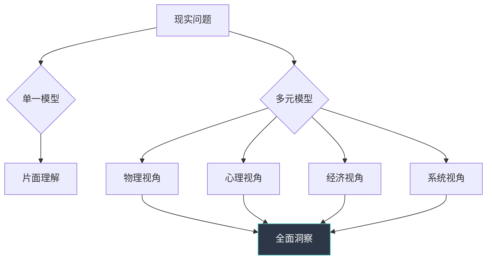
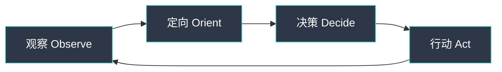
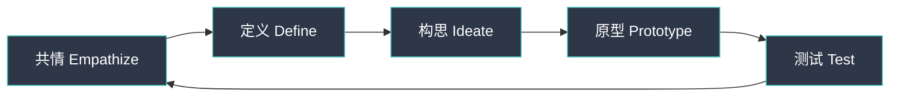
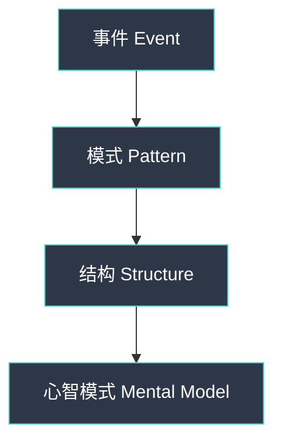

## 一、思维模型大全：100个改变你思维方式的模型

查理·芒格说过："一个人如果掌握80-90个思维模型，就能解决生活中90%的问题。"思维模型不是抽象的理论，而是你理解世界的操作系统。每多掌握一个模型，你就多了一副观察现实的眼镜——看到别人看不到的模式、风险和机会。

本章系统整理100个核心思维模型，按学科分类，每个模型包含：**定义→核心洞察→真实案例→应用方法→常见误区**。读完后你将拥有一个完整的思维工具箱，能够在工作、学习、投资、人际关系等各个领域做出更明智的决策。

### 1.1 什么是思维模型

思维模型是对现实世界运作方式的简化表示。它不是真理本身，而是帮助你理解复杂现实的思维透镜。就像地图不是领土，但没有地图你寸步难行。

**为什么需要多个思维模型？** 因为现实是多维的。如果你只有一把锤子，所有问题看起来都像钉子。拥有多个模型让你能够从不同角度审视同一个问题，避免盲区。

**如何使用这100个模型？** 不要试图一次掌握所有模型。建议分三步走：

1. **第一周：浏览全貌**——快速阅读所有100个模型，建立整体认知
2. **第二周：精选20个**——标记与你当前工作/生活最相关的20个模型，深入学习
3. **第三周起：刻意练习**——每天找一个真实场景，用1-2个模型分析它

### 1.2 模型选择框架：什么时候用什么模型

面对具体问题时，如何快速找到合适的模型？下面这个框架帮你定位：

| 问题类型 | 首选模型类别 | 典型模型 |
|---------|-------------|---------|
| 看不清趋势方向 | 物理/数学 | 临界质量、复利、幂律分布 |
| 人际关系/团队管理 | 心理学/生物学 | 激励机制、社会认同、共生 |
| 商业竞争决策 | 经济学/战略 | 博弈论、五力模型、蓝海战略 |
| 个人成长/学习 | 进化/认知 | 自然选择、刻意练习、反脆弱 |
| 复杂系统分析 | 系统论 | 反馈循环、涌现、冰山模型 |
| 面对不确定性 | 哲学/决策 | 贝叶斯定理、安全边际、预期价值 |

---

### 1.3 物理学与数学模型（1-15）

物理世界的规律往往隐喻着更广泛的社会和商业现象。这些模型帮助你用精确的数学思维理解复杂现实。

#### 1. 临界质量（Critical Mass）

**核心定义：** 事物达到某个阈值后会发生质变。在核物理学中，临界质量是链式反应自我维持所需的最小质量；在现实生活中，它指任何系统从量变到质变的转折点。

**真实案例：**
- WhatsApp在2012年用户突破2亿后，增长从线性变为指数级，最终被Facebook以190亿美元收购
- 习惯养成研究显示，一个新习惯平均需要66天才能自动化（而非流行的21天），第66天就是习惯的"临界质量"
- YouTube早期数据显示，当一个视频的点赞/踩比超过95%时，算法会将其推送给更多人，形成病毒传播

**应用方法：**
1. **识别阈值**——问自己"这件事需要达到什么规模/程度才能自我维持？"
2. **集中资源突破**——与其分散精力做10件事，不如集中资源让1件事突破临界点
3. **监测领先指标**——找到能预示临界点即将到来的早期信号（如用户留存率、复购率）

**常见误区：** 误以为临界点是突然出现的。实际上，临界质量之前往往有漫长的积累期。很多人在距离临界点只有一步之遥时放弃。

#### 2. 熵增定律（Entropy）

**核心定义：** 封闭系统总是趋向无序。这是热力学第二定律，也是宇宙的基本法则。要维持秩序，必须持续投入能量。

**真实案例：**
- 谷歌的"20%时间"政策（允许员工用20%工作时间做自己的项目）本质上是在对抗组织熵增——通过持续注入新想法来维持创新活力
- 个人知识管理：如果你不持续整理笔记、更新知识，你的知识库会逐渐过时、混乱、失去价值
- 婚姻研究显示，幸福的婚姻需要每周至少5小时的刻意互动（Gottman研究所），否则关系会自然退化

**应用方法：**
1. **建立维护系统**——每周固定时间整理文件、更新知识库、回顾目标
2. **接受不完美**——熵增是自然规律，不要追求完美，而是建立可持续的维护节奏
3. **引入外部能量**——定期学习新技能、接触新人群、尝试新事物

**关键洞察：** 熵增定律解释了为什么"维持现状"需要持续努力。你以为什么都不做就能保持原状，实际上你什么都不做的结果是退化。

#### 3. 杠杆原理（Leverage）

**核心定义：** 找到正确的支点，以小博大。阿基米德说："给我一个支点，我能撬动地球。"在现实中，杠杆是用最小的投入产生最大效果的能力。

**真实案例：**
- 亚马逊AWS：亚马逊将自己内部的IT基础设施对外开放，用相对较小的边际成本撬动了云计算市场，现在AWS年收入超过800亿美元
- 个人层面：学习一门编程语言（Python）可能花费100小时，但它能自动化你未来数年的工作，节省数千小时

**应用方法：**
1. **找到高杠杆活动**——问自己"如果我只能做一件事，哪件事能产生最大影响？"
2. **识别杠杆点**——技术杠杆（自动化）、人脉杠杆（连接关键人物）、资本杠杆（投资）
3. **避免低杠杆陷阱**——忙碌≠高效，很多"紧急"的事情其实是低杠杆的

**相关模型：** 二八法则（#91）、杠杆点（#83）

#### 4. 复利效应（Compound Effect）

**核心定义：** 微小的持续改进会产生惊人的累积效果。公式：最终结果 = 初始值 × (1 + 增长率)^时间。

**真实案例：**
- 每天进步1%，一年后你将进步37倍（1.01^365 ≈ 37.78）
- 每天退步1%，一年后你将几乎归零（0.99^365 ≈ 0.03）
- 巴菲特99%的财富是在50岁之后获得的——这就是复利的力量
- 亚马逊从卖书到万亿帝国，贝索斯说："我们所做的每一件事，都是为了延长那个'飞轮'的旋转时间。"

**应用方法：**
1. **选择正向循环**——找到能产生复利的活动：学习、写作、投资、人脉积累
2. **保持一致性**——复利的关键不是单次投入的大小，而是持续性。每天写500字比偶尔写5000字效果更好
3. **耐心等待拐点**——复利曲线前期增长缓慢，容易让人放弃。理解"曲棍球棒"效应

**数学真相：** 复利效应的威力在于指数增长。人类大脑天生不擅长理解指数增长（我们是线性思维），所以要刻意训练这种直觉。

#### 5. 正态分布（Normal Distribution）

**核心定义：** 大多数自然现象呈钟形分布——大部分数据集中在平均值附近，极端值很少。

**真实案例：**
- 人的身高、智商、考试成绩大致服从正态分布
- 但注意：收入、城市规模、网站流量等服从幂律分布，不是正态分布

**应用方法：**
1. **判断分布类型**——先确定你的数据是正态分布还是幂律分布
2. **正态分布的策略**——关注平均值和标准差，极端值可以忽略
3. **幂律分布的策略**——关注头部效应，赢家通吃

**常见误区：** 把所有数据都假设为正态分布。金融市场常被建模为正态分布，但实际是"肥尾分布"——极端事件发生的概率远高于正态分布预测。

#### 6. 幂律分布（Power Law）

**核心定义：** 少数事件产生大部分影响。与正态分布不同，幂律分布没有"典型值"。

**真实案例：**
- 20%的客户贡献80%的收入（帕累托法则的数学基础）
- 少数城市（东京、纽约、伦敦）拥有全球大部分财富
- 少数文章获得大部分阅读量，大部分文章几乎无人问津

**应用方法：**
1. **识别幂律现象**——问自己"这个领域是否存在赢家通吃？"
2. **集中资源**——在幂律分布的领域，把资源集中在头部
3. **避免平均思维**——"平均收入"在幂律分布中没有意义

#### 7. 贝叶斯定理（Bayes' Theorem）

**核心定义：** 根据新证据更新信念。公式：P(A|B) = P(B|A) × P(A) / P(B)。

**真实案例：**
- 医学检测：某种疾病的患病率是0.1%，检测准确率是99%。如果你检测呈阳性，你真正患病的概率只有约9%（因为假阳性数量远超真阳性）
- 侦探破案：每发现一个新线索，就更新对嫌疑人概率的判断

**应用方法：**
1. **先验概率**——在看任何证据之前，你对这件事的初始判断是什么？
2. **似然度**——如果假设是真的，看到这个证据的概率有多大？
3. **持续更新**——每获得新信息，就用贝叶斯公式更新你的判断

**实操模板：**
初始判断（先验）：这个项目成功的概率是30%
新证据：第一个MVP用户反馈非常好（似然度：如果项目会成功，获得好反馈的概率是80%；如果会失败，获得好反馈的概率是20%）
更新后判断：P(成功|好反馈) = 0.8×0.3 / (0.8×0.3 + 0.2×0.7) ≈ 63%

**相关模型：** 校准（#100）、确认偏误（#42）

#### 8. 涌现（Emergence）

**核心定义：** 系统整体表现出的特性不能从其组成部分单独预测。蚂蚁个体很简单，但蚁群表现出惊人的集体智慧。

**真实案例：**
- 维基百科：没有中央编辑，但产生了人类历史上最大的百科全书
- 股票市场：每个交易者只关注自己的利益，但市场整体表现出复杂的模式
- 互联网：没有中央控制，但涌现出全球信息网络

**应用方法：**
1. **不要过度控制**——给系统足够的自由度，让涌现发生
2. **设置简单规则**——复杂的行为可以来自简单的规则（如蚁群的信息素规则）
3. **观察整体模式**——不要只看个体，要看整体涌现出的模式

#### 9. 惯性（Inertia）

**核心定义：** 物体保持其运动状态的趋势。牛顿第一定律的隐喻：改变需要外力，启动比维持更难。

**真实案例：**
- 诺基亚在智能手机时代的衰落：不是因为不知道触屏技术，而是组织惯性让它无法放弃已成功的功能手机业务
- 个人层面：你知道应该锻炼，但"开始"是最难的部分

**应用方法：**
1. **降低启动门槛**——想跑步？先穿上跑鞋。想写作？先打开文档写一句话
2. **利用惯性**——一旦开始，让惯性帮你维持。建立例行公事
3. **对抗有害惯性**——识别你生活中哪些惯性在拖后腿，用外力打破它

#### 10. 摩擦力（Friction）

**核心定义：** 阻碍运动的力。在行为设计中，摩擦力是指任何增加行动难度的因素。

**真实案例：**
- 亚马逊的"一键购买"：减少购买摩擦力，显著提高转化率
- 把运动鞋放在床边：减少晨跑的摩擦力
- 把零食藏起来：增加吃零食的摩擦力

**应用方法：**
1. **增加坏习惯的摩擦力**——把手机放到另一个房间，增加刷手机的难度
2. **减少好习惯的摩擦力**——把健康食物放在最显眼的位置
3. **设计环境**——你的环境设计比意志力更可靠

#### 11. 共振（Resonance）

**核心定义：** 当外部频率与系统自然频率匹配时，振幅急剧增大。

**真实案例：**
- 市场营销：当你的信息与受众的痛点"共振"时，传播效果会指数级放大
- 团队管理：当个人目标与团队目标"共振"时，会产生巨大的协同效应
- 创业：当产品与市场需求"共振"时，增长会自然发生

**应用方法：**
1. **找到自然频率**——了解你的目标受众真正关心什么
2. **调整频率**——让你的信息、产品、行动与受众的需求频率匹配
3. **避免强迫**——如果频率不匹配，强行推动只会适得其反

#### 12. 相变（Phase Transition）

**核心定义：** 物质在特定条件下从一种状态转变为另一种状态（如水在0°C结冰）。

**真实案例：**
- 技术采纳：从早期采纳者到主流市场的跳跃（跨越鸿沟）
- 社会运动：从少数人的抗议到大规模的社会变革
- 个人成长：从"知道"到"做到"的转变

**应用方法：**
1. **识别临界条件**——相变需要特定条件（温度、压力、规模）
2. **耐心积累**——在相变发生之前，看起来什么都没有发生
3. **准备跳跃**——相变发生时，速度会非常快

#### 13. 反馈循环（Feedback Loop）

**核心定义：** 输出反过来影响输入。增强反馈加速变化，平衡反馈维持稳定。

**真实案例：**
- 社交媒体的"点赞"循环：点赞→多巴胺→发更多内容→更多点赞
- 经济周期：繁荣→过度投资→泡沫破裂→衰退→复苏
- 学习循环：学习→应用→反馈→改进→学习

**应用方法：**
1. **设计正反馈**——建立让你进步的循环（如写作→发布→反馈→改进）
2. **打破负反馈**——识别让你退化的循环（如焦虑→逃避→更多焦虑）
3. **引入延迟**——有些反馈循环太快（如情绪反应），需要人为延迟

**相关模型：** 复利效应（#4）、飞轮效应（#70）

#### 14. 最小作用量原理（Least Action）

**核心定义：** 自然系统倾向于以最小的能量消耗完成变化。

**真实案例：**
- 河流总是选择阻力最小的路径流向大海
- 优秀的系统设计应该让用户以最少的步骤完成任务
- 个人效率：找到完成任务的最短路径

**应用方法：**
1. **简化流程**——删除不必要的步骤
2. **自动化重复**——把重复性工作交给机器
3. **专注核心**——去掉花哨的功能，专注核心价值

#### 15. 测不准原理（Uncertainty Principle）

**核心定义：** 观察行为本身会影响被观察的对象。在量子力学中，你无法同时精确测量粒子的位置和动量。

**真实案例：**
- 绩效考核：被考核者会改变行为以适应考核标准（Goodhart定律）
- 社交媒体：当人们知道自己被观察时，行为会改变
- 科学研究：实验者的期望会影响实验结果（安慰剂效应）

**应用方法：**
1. **考虑观察的影响**——当你测量某件事时，要考虑测量本身的影响
2. **设计稳健的指标**——让指标难以被操纵
3. **多角度观察**——用多个指标而非单一指标

---

### 1.4 生物学与进化模型（16-30）

生物进化经过数十亿年的"实验"，产生了无数精妙的策略。这些模型帮助你理解竞争、适应和生存的本质。

#### 16. 自然选择（Natural Selection）

**核心定义：** 适应环境的才能存活。达尔文进化论的核心机制：变异→选择→遗传。

**真实案例：**
- 商业：柯达发明了数码相机但拒绝转型，最终被市场淘汰
- 个人职业：那些持续学习新技能的人在职场竞争中存活下来
- 产品：只有满足用户需求的产品才能生存（其余99%的创业公司失败）

**应用方法：**
1. **持续变异**——尝试新方法、新技能、新思路
2. **接受选择**——让市场、用户、现实来检验你的想法
3. **保留有效策略**——把成功的经验固化为习惯和系统

#### 17. 适者生存（Survival of the Fittest）

**核心定义：** 不是最强的物种生存下来，而是最能适应变化的。"Fittest"不是"最强壮"，而是"最适合"。

**真实案例：**
- 恐龙灭绝：体型庞大、适应性强的恐龙在小行星撞击后灭绝，而小型哺乳动物存活下来
- 诺基亚vs苹果：诺基亚是手机市场的"霸主"，但苹果更适应智能手机时代

**应用方法：**
1. **培养适应能力**——学习速度比当前知识更重要
2. **保持灵活性**——不要过度优化当前环境，要为变化做准备
3. **拥抱变化**——把变化视为机会而非威胁

**相关模型：** 红皇后效应（#21）、反脆弱（#94）

#### 18. 生态系统（Ecosystem）

**核心定义：** 万物相互依存。一个物种的生存依赖于整个生态系统的健康。

**真实案例：**
- 苹果的生态系统：iPhone、App Store、iCloud、Mac相互强化，形成强大的护城河
- 个人生态系统：你的健康、工作、关系、学习相互影响

**应用方法：**
1. **思考系统**——不要孤立地看问题，要看到整个系统
2. **维护多样性**——健康的生态系统需要多样性
3. **关注依赖关系**——识别你依赖的关键节点

#### 19. 共生（Symbiosis）

**核心定义：** 不同物种之间的互利关系。

**真实案例：**
- 小丑鱼和海葵：小丑鱼保护海葵免受捕食者侵害，海葵为小丑鱼提供庇护
- 商业合作：Spotify和唱片公司——Spotify提供分发渠道，唱片公司提供内容
- 个人关系：好的婚姻是互利共生的关系

**应用方法：**
1. **寻找互补伙伴**——找到能与你形成互利关系的人或组织
2. **提供价值**——共生的前提是你也能提供价值
3. **避免寄生**——只索取不付出的关系不可持续

#### 20. 变异（Mutation）

**核心定义：** 随机的基因变化。大多数变异是有害的，但少数变异提供了进化的原材料。

**真实案例：**
- 3M的便利贴：来自一个"失败"的强力胶实验
- Instagram：最初是一个签到应用Burbn，转型后才成功
- 个人成长：尝试新事物（变异）→保留有效的（选择）→形成新习惯（遗传）

**应用方法：**
1. **鼓励变异**——尝试新方法、新思路，即使大多数会失败
2. **快速筛选**——快速测试，快速淘汰无效的变异
3. **保留有效变异**——把成功的创新固化为标准流程

#### 21. 红皇后效应（Red Queen Effect）

**核心定义：** 必须不断奔跑才能留在原地。来自《爱丽丝镜中奇遇》："在这个地方，你必须不停地跑才能留在原地。"

**真实案例：**
- 科技行业：不持续创新就会被淘汰
- 个人职业：不持续学习就会被超越
- 军备竞赛：国家之间不断升级武器，但相对优势没有改变

**应用方法：**
1. **持续投入**——把持续改进视为必要的成本，而非可选项
2. **找到差异化**——在所有人都在跑的赛道上，找到不同的赛道
3. **接受现实**——在竞争激烈的领域，不进则退

#### 22. 进化稳定策略（Evolutionarily Stable Strategy）

**核心定义：** 一种策略一旦被大多数个体采用，就不能被其他策略替代。

**真实案例：**
- 市场定价：在某个价格点上，没有企业有动机单独改变价格
- 社会规范：当大多数人都遵守某个规范时，违反者会受到惩罚

**应用方法：**
1. **识别稳定状态**——问自己"当前的均衡状态是什么？"
2. **寻找突破口**——在稳定状态中找到可以改变的点
3. **利用均衡**——在稳定状态下，专注于优化而非颠覆

#### 23. 间断平衡（Punctuated Equilibrium）

**核心定义：** 长期稳定被短暂的剧烈变化打断。进化不是匀速的，而是"长期稳定+短期剧变"。

**真实案例：**
- 技术革命：蒸汽机、电力、互联网——长期的技术积累在某个时刻爆发
- 个人成长：长期的学习积累，突然在某个时刻"顿悟"
- 行业颠覆：汽车行业100年几乎不变，然后10年内被电动化和智能化颠覆

**应用方法：**
1. **在稳定期积累**——利用平静期学习、准备、积累资源
2. **在剧变期行动**——当变化发生时，快速行动
3. **不要被稳定期迷惑**——稳定是暂时的，变化是必然的

#### 24. 协同进化（Coevolution）

**核心定义：** 物种之间相互影响对方的进化。

**真实案例：**
- 苹果和三星：既是竞争对手又是供应链伙伴，相互塑造
- 技术和用户：技术改变用户行为，用户需求推动技术发展
- 父母和孩子：相互影响对方的成长

**应用方法：**
1. **关注互动**——你的变化会影响环境，环境的变化会影响你
2. **主动塑造**——不要被动适应，主动塑造对你有利的环境
3. **接受相互依赖**——你的成功依赖于他人的成功

#### 25. 遗传漂变（Genetic Drift）

**核心定义：** 随机事件对小种群的影响大于大种群。

**真实案例：**
- 创业公司：小公司的命运受随机因素（如遇到关键投资人）影响更大
- 小团队：一个关键成员的离开可能毁掉整个团队
- 个人：一个偶然的机会可能改变你的人生轨迹

**应用方法：**
1. **小团队要增加冗余**——不要过度依赖单一成员或资源
2. **大团队要关注趋势**——随机因素的影响会被大数法则抵消
3. **拥抱随机性**——在小规模时，随机性可能是你的优势

#### 26. 性选择（Sexual Selection）

**核心定义：** 某些特征因吸引配偶而被选择，即使这些特征对生存不利（如孔雀的尾巴）。

**真实案例：**
- 品牌建设：奢侈品通过"浪费"（高昂的价格、精美的包装）来显示品质
- 个人形象：得体的着装和形象是职场的"孔雀尾巴"
- 产品设计：苹果产品的美学设计增加了成本，但提升了品牌吸引力

**应用方法：**
1. **投资"信号"**——有些看似"浪费"的投资（如教育、形象）实际上是在发送信号
2. **理解信号成本**——有效的信号必须是有成本的，否则会被伪造
3. **选择合适的信号**——不同场合适用不同的信号

#### 27. 利他行为（Altruism）

**核心定义：** 个体牺牲自身利益帮助他人。进化论解释：利他行为可以通过亲缘选择或互惠利他获得进化优势。

**真实案例：**
- 开源软件：程序员免费贡献代码，但获得了声誉、技能提升和职业机会
- 企业社会责任：Patagonia将利润捐赠给环保组织，反而提升了品牌忠诚度
- 人际关系：真诚的帮助会建立长期的信任关系

**应用方法：**
1. **长期视角**——短期的利他行为可能带来长期的回报
2. **选择性利他**——帮助那些会回报的人（互惠利他）
3. **建立声誉**——利他行为是最好的个人品牌建设

#### 28. 超个体（Superorganism）

**核心定义：** 个体组成的高度协调的集体，如蚁群、蜂群。

**真实案例：**
- 维基百科：数百万编辑者协调工作，产生人类最大的百科全书
- Linux社区：数千开发者协作开发操作系统
- 高效团队：成员之间高度协调，整体大于部分之和

**应用方法：**
1. **建立共同目标**——超个体需要共同的目标和规则
2. **分工协作**——每个成员专注于自己擅长的部分
3. **信息共享**——高效的信息流通是超个体的关键

#### 29. 生态位（Ecological Niche）

**核心定义：** 物种在生态系统中的独特位置，包括它吃什么、住在哪里、什么时候活动。

**真实案例：**
- Netflix：在传统电视和电影院之间找到了流媒体的生态位
- 个人职业：找到你的独特定位——你擅长什么、市场需要什么、别人做不了什么

**应用方法：**
1. **分析竞争环境**——找到未被满足的需求
2. **发挥独特优势**——专注于你有相对优势的领域
3. **持续调整**——生态位会随着环境变化而改变

#### 30. 关键种（Keystone Species）

**核心定义：** 对生态系统有不成比例影响的物种。移除关键种会导致整个生态系统崩溃。

**真实案例：**
- 个人层面：某些关键员工的离开会导致团队崩溃
- 商业层面：某些关键供应商的中断会影响整个供应链
- 技术层面：某些基础技术（如TCP/IP协议）的失败会导致整个互联网崩溃

**应用方法：**
1. **识别关键节点**——找到系统中的关键种
2. **保护关键节点**——对关键节点投入更多资源
3. **减少依赖**——避免过度依赖单一关键节点

---

### 1.5 心理学与认知模型（31-50）

人类的大脑是进化的产物，充满了各种"快捷方式"（启发式）和系统性偏差。了解这些模型帮助你理解自己和他人的行为。

#### 31. 激励机制（Incentives）

**核心定义：** 人对激励做出反应。理解行为背后的真实动机。

**芒格原话：** "告诉我激励机制是什么，我就能告诉你结果是什么。"

**真实案例：**
- 美国教师绩效工资：当教师的工资与学生成绩挂钩时，有些教师会作弊（提高分数）
- 销售佣金：高佣金激励销售人员推销高利润产品，而非最适合客户的产品
- 开源贡献：开发者贡献开源代码的激励是声誉、学习和职业机会

**应用方法：**
1. **分析真实激励**——不要只看表面的激励，要看真实的激励
2. **设计正确激励**——确保激励机制能引导你想要的行为
3. **注意副作用**——每个激励机制都有意想不到的后果

**实操框架：**
1. 列出相关人员
2. 分析每个人的真实激励（而非表面激励）
3. 预测他们的行为
4. 设计激励机制引导正确行为

#### 32. 认知偏差（Cognitive Bias）

**核心定义：** 系统性的思维错误。识别偏差是避免误判的第一步。

**常见偏差列表：**
- 确认偏误：只寻找支持自己观点的信息
- 可得性偏差：容易回忆起来的事件被判断为更常见
- 锚定效应：先接收到的信息不成比例地影响后续判断
- 光环效应：对某一方面的正面评价扩展到所有方面

**应用方法：**
1. **识别偏差**——了解常见的认知偏差
2. **建立检查清单**——在重要决策前检查是否有偏差
3. **引入外部视角**——让不同背景的人参与决策

#### 33. 社会认同（Social Proof）

**核心定义：** 人们倾向于模仿他人行为，特别是在不确定的情况下。

**真实案例：**
- 亚马逊的"购买此商品的客户也买了..."
- 社交媒体的点赞和分享数
- 排队效应：人们会排长队购买他们认为受欢迎的产品

**应用方法：**
1. **利用社会认同**——在营销中展示用户评价、使用人数
2. **警惕虚假认同**——不要因为"大家都在做"就盲目跟随
3. **独立思考**——在不确定时，先独立分析再参考他人

#### 34. 锚定效应（Anchoring）

**核心定义：** 先接收到的信息不成比例地影响后续判断。

**真实案例：**
- 定价策略：先展示高价产品，再展示目标产品，后者会显得更便宜
- 谈判：先提出极端要求，为后续谈判设定锚点
- 薪资谈判：先报价的人通常会设定锚点

**应用方法：**
1. **主动设定锚点**——在谈判中先提出你的期望
2. **识别他人的锚点**——警惕别人试图设定的锚点
3. **重新设定锚点**——如果锚点不利，主动引入新的参考点

#### 35. 禀赋效应（Endowment Effect）

**核心定义：** 拥有某物后对它的估价会提高。

**真实案例：**
- 人们对已拥有的物品估价高于市场价
- 免费试用策略：一旦用户拥有产品，他们更不愿意放弃
- 个人层面：人们对自己的想法、习惯、关系有过度估值

**应用方法：**
1. **换位思考**——如果你没有这个东西，你愿意花多少钱买它？
2. **定期清理**——定期审视你拥有的东西，识别哪些是真正有价值的
3. **避免过度执着**——不要因为"已经拥有"就不愿意放弃

#### 36. 损失厌恶（Loss Aversion）

**核心定义：** 等量损失的痛苦是等量收益快乐的约2倍。

**真实案例：**
- 投资者过早卖出盈利股票，过久持有亏损股票（处置效应）
- 人们对免费试用结束后"失去"服务的恐惧，促使他们订阅
- 个人层面：人们对失去现有关系的恐惧，大于对获得新关系的期待

**应用方法：**
1. **重新框架**——把"损失"框架转换为"收益"框架
2. **接受损失**——学会接受小的损失，避免大的损失
3. **利用损失厌恶**——在营销中强调"失去"比"获得"更有效

#### 37. 框架效应（Framing Effect）

**核心定义：** 同样的信息以不同方式呈现会导致不同的判断。

**真实案例：**
- "90%存活率"比"10%死亡率"更容易被接受（即使信息相同）
- "限时优惠"比"打折"更能促进购买
- "减少浪费"比"节约成本"更能激发行动

**应用方法：**
1. **选择有利框架**——用最有利的方式呈现信息
2. **识别框架操纵**——警惕别人用框架影响你的判断
3. **多角度思考**——从不同框架审视同一个问题

#### 38. 心理账户（Mental Accounting）

**核心定义：** 人们在心理上将钱分入不同的"账户"，对不同账户有不同的态度。

**真实案例：**
- 人们会把奖金"挥霍"而对工资精打细算（即使都是钱）
- 赌场效应：赢来的钱更容易被冒险（因为是"意外之财"）
- 个人财务：人们会为不同的支出设置不同的心理账户

**应用方法：**
1. **统一账户**——把所有的钱视为同一个账户
2. **理性分配**——根据实际需求而非心理账户来分配资源
3. **利用心理账户**——在营销中利用人们对不同账户的态度

#### 39. 峰终定律（Peak-End Rule）

**核心定义：** 对经历的记忆由高峰和结尾决定，而非平均值。

**真实案例：**
- 结肠镜检查研究：延长检查时间但减少结尾痛苦，患者评价反而更好
- 客户体验：在服务结束时提供小惊喜，能显著提升整体评价
- 个人关系：在重要时刻（如生日、纪念日）创造美好回忆

**应用方法：**
1. **设计高峰时刻**——在关键触点创造惊喜
2. **优化结尾**——确保每次体验的结尾是积极的
3. **不要追求完美**——整体体验不需要完美，只需要有亮点

#### 40. 沉没成本（Sunk Cost）

**核心定义：** 已经发生的不可回收成本不应影响未来决策。

**真实案例：**
- 电影看了一半发现很难看，但因为"已经看了这么久"而坚持看完
- 项目投入了大量资源后发现方向错误，但因为"已经投入了"而不愿放弃
- 个人关系：因为"在一起很久了"而不愿分手

**应用方法：**
1. **问自己**——"如果我现在从零开始，我还会做这个选择吗？"
2. **向前看**——只考虑未来的成本和收益
3. **设置止损点**——提前设定放弃的标准

#### 41. 邓宁-克鲁格效应（Dunning-Kruger Effect）

**核心定义：** 能力不足的人高估自己的能力，能力强的人低估自己的能力。

**真实案例：**
- 新手司机通常高估自己的驾驶技能
- 专家往往低估自己的知识水平（因为知道得越多，越知道自己不知道的多）
- 创业者常常高估成功的概率

**应用方法：**
1. **寻求外部反馈**——不要只依赖自我评估
2. **保持谦逊**——认识到自己的知识边界
3. **持续学习**——知道得越多，越能准确评估自己

#### 42. 确认偏误（Confirmation Bias）

**核心定义：** 倾向于寻找支持自己观点的信息，忽视反对的证据。

**真实案例：**
- 投资者只关注支持自己投资决策的信息
- 政治立场：人们只消费符合自己立场的媒体
- 科学研究：研究者可能无意中只寻找支持假设的数据

**应用方法：**
1. **主动寻找反对证据**——问自己"什么证据能证明我是错的？"
2. **接触不同观点**——阅读与你立场相反的文章
3. **魔鬼代言人**——让别人扮演反对者的角色

#### 43. 可得性偏差（Availability Bias）

**核心定义：** 容易回忆起来的事件被判断为更常见。

**真实案例：**
- 飞机失事的新闻让人们高估飞行风险（实际上飞行比开车安全得多）
- 最近的成功案例让人们高估成功的概率
- 社交媒体让人们高估某些话题的普遍性

**应用方法：**
1. **用数据而非记忆**——查找实际统计数据
2. **考虑样本偏差**——你接触到的信息是否具有代表性？
3. **质疑直觉**——你的第一感觉可能是可得性偏差的结果

#### 44. 代表性偏差（Representativeness Bias）

**核心定义：** 根据相似度而非概率来判断。

**真实案例：**
- "琳达问题"：人们认为"琳达是银行柜员且是女权主义者"比"琳达是银行柜员"更可能（实际上后者的概率更高）
- 面试中根据第一印象判断候选人的能力
- 投资中根据公司名称或行业判断其前景

**应用方法：**
1. **考虑基础概率**——先问"这类事情发生的概率有多大？"
2. **不要被表面相似性迷惑**——相似的外表不等于相似的本质
3. **使用统计思维**——用数据而非直觉来判断

#### 45. 光环效应（Halo Effect）

**核心定义：** 对某一方面的正面评价扩展到所有方面。

**真实案例：**
- 长相好看的人被认为更聪明、更善良
- 知名公司的产品被认为质量更好
- 名人的推荐被认为更可信

**应用方法：**
1. **分别评估**——不要因为一个优点就认为所有方面都好
2. **关注实质**——评估具体的能力和表现，而非光环
3. **警惕光环**——识别光环效应对自己判断的影响

#### 46. 后见之明偏差（Hindsight Bias）

**核心定义：** 在知道结果后认为自己"早就知道了"。

**真实案例：**
- 股市下跌后，人们说"我早就知道会跌"
- 项目失败后，人们说"我早就知道会失败"
- 历史事件：人们事后觉得历史进程是"必然的"

**应用方法：**
1. **记录预测**——在事前记录你的预测，事后对照
2. **承认不确定性**——接受你无法预测未来
3. **学习而非自责**——从错误中学习，而非假装没有犯错

#### 47. 现状偏差（Status Quo Bias）

**核心定义：** 偏好维持现状，即使改变可能更好。

**真实案例：**
- 员工宁愿留在不满意的工作，也不愿跳槽
- 消费者宁愿支付更高的费用，也不愿更换供应商
- 个人层面：人们宁愿保持不健康的习惯，也不愿改变

**应用方法：**
1. **评估"不行动"的成本**——维持现状也有成本
2. **小步尝试**——用小的改变来测试新的选择
3. **设置默认选项**——利用现状偏差设计有利的默认选项

#### 48. 过度自信（Overconfidence）

**核心定义：** 对自己的判断过度高估。

**真实案例：**
- 90%的司机认为自己的驾驶水平高于平均
- 创业者高估成功的概率
- 专家对自己领域的预测准确度低于预期

**应用方法：**
1. **使用概率语言**——不说"肯定"，说"80%的概率"
2. **记录预测**——定期校准你的预测准确度
3. **考虑不确定性**——为意外情况留出空间

#### 49. 情感启发式（Affect Heuristic）

**核心定义：** 根据情感反应来做判断。

**真实案例：**
- 人们对核电的恐惧导致高估其风险（实际上核电比煤炭安全得多）
- 人们对喜欢的品牌的产品质量评价更高
- 个人层面：情绪低落时更容易做出悲观判断

**应用方法：**
1. **识别情感影响**——在重要决策前检查自己的情绪状态
2. **延迟决策**——在情绪激动时不要做重要决定
3. **用数据平衡情感**——用客观数据来校正情感判断

#### 50. 注意力偏差（Attentional Bias）

**核心定义：** 关注某些信息而忽视其他信息。

**真实案例：**
- 焦虑的人更容易注意到威胁性信息
- 投资者过度关注短期波动，忽视长期趋势
- 个人层面：人们关注自己在意的事情，忽视其他重要信息

**应用方法：**
1. **有意识地扩展注意力**——定期检查你忽视了什么
2. **设置提醒**——用系统提醒你关注重要的但容易忽视的事情
3. **换位思考**——从不同角度看问题

---

### 1.6 经济学与商业模型（51-70）

经济学模型帮助你理解激励、市场和商业运作的底层逻辑。

#### 51. 机会成本（Opportunity Cost）

**核心定义：** 每个选择都意味着放弃其他选择。真正的成本不是花了什么，而是放弃了什么。

**真实案例：**
- 读研究生的机会成本：不是学费，而是两年的工作经验和收入
- 创业的机会成本：不是启动资金，而是稳定的薪资和职业发展
- 个人时间：花一小时刷短视频的机会成本是一小时的学习或锻炼

**应用方法：**
1. **考虑替代方案**——每次做选择时，问自己"我放弃了什么？"
2. **比较机会成本**——选择机会成本最低的方案
3. **避免沉没成本**——过去的投入不应影响未来决策

#### 52. 边际效用递减（Diminishing Marginal Utility）

**核心定义：** 每增加一单位投入，产出的增量逐渐减少。

**真实案例：**
- 吃第一个包子很满足，第五个包子就没什么感觉了
- 学习一个新技能的前100小时进步最快，之后进步越来越慢
- 营销投入：前100万的广告效果最好，之后每增加100万的效果递减

**应用方法：**
1. **知道什么时候"足够好"**——不要追求完美，追求最优性价比
2. **分配资源**——把资源分配到边际效用最高的地方
3. **避免过度投入**——识别边际效用递减的拐点

#### 53. 规模效应（Economies of Scale）

**核心定义：** 规模扩大带来的成本优势。

**真实案例：**
- 沃尔玛：巨大的采购规模带来极低的进货成本
- 云计算：大规模数据中心的单位成本远低于小规模
- 个人层面：批量购买通常更便宜

**应用方法：**
1. **寻找规模优势**——在能产生规模效应的领域投入
2. **警惕规模劣势**——规模也可能带来官僚主义和效率下降
3. **找到最优规模**——规模不是越大越好，要找到最优平衡点

#### 54. 网络效应（Network Effects）

**核心定义：** 用户越多，产品对每个用户的价值越大。

**真实案例：**
- 微信：用户越多，对每个用户的价值越大（你的朋友都在上面）
- Uber：司机越多，乘客等待时间越短；乘客越多，司机收入越高
- 标准：VHS战胜Betamax不是因为技术更好，而是因为网络效应

**应用方法：**
1. **优先获取用户**——在网络效应市场，用户数量比利润更重要
2. **建立转换成本**——让用户难以离开你的平台
3. **利用网络效应**——设计产品时考虑如何增强网络效应

#### 55. 比较优势（Comparative Advantage）

**核心定义：** 即使在所有方面都处于劣势，也可以通过专注于相对优势领域来获益。

**真实案例：**
- 律师打字比秘书快，但律师应该专注于法律工作，让秘书打字
- 个人层面：即使你什么都会，也应该专注于你相对最擅长的事情
- 国家层面：每个国家应该专注于自己有比较优势的产业

**应用方法：**
1. **找到你的比较优势**——你相对擅长什么？
2. **专注于比较优势**——把时间花在你有相对优势的事情上
3. **外包其他工作**——把你不擅长的工作交给有比较优势的人

#### 56. 供需关系（Supply and Demand）

**核心定义：** 价格由供给和需求共同决定。

**真实案例：**
- 演唱会门票：供不应求时价格飙升
- 技术人才：AI人才供不应求，薪资高涨
- 个人层面：提升自己的稀缺性，就能获得更高的回报

**应用方法：**
1. **分析供需**——在做决策前，分析供给和需求的关系
2. **寻找供需失衡**——供需失衡意味着机会
3. **提升稀缺性**——让自己变得稀缺，就能获得更高的价值

#### 57. 博弈论（Game Theory）

**核心定义：** 研究理性决策者之间策略互动的数学理论。

**真实案例：**
- 价格战：两家企业竞相降价，最终都受损
- 谈判：了解对方的策略，制定最优应对方案
- 个人层面：在竞争中，考虑他人的策略再做决策

**应用方法：**
1. **分析参与者**——有哪些参与者？他们的目标是什么？
2. **预测策略**——他们可能采取什么策略？
3. **制定最优策略**——基于他人的可能策略，制定你的最优策略

#### 58. 囚徒困境（Prisoner's Dilemma）

**核心定义：** 个体理性选择导致集体非最优结果。

**真实案例：**
- 价格战：每家企业都想降价抢客户，最终整个行业利润下降
- 公共资源过度使用：每个人都想多用一点，最终资源枯竭
- 个人层面：每个人都想多休息一点，最终团队效率下降

**应用方法：**
1. **建立合作机制**——通过重复博弈、声誉机制促进合作
2. **设计激励**——让合作成为理性选择
3. **引入第三方**——通过规则、法律促进合作

#### 59. 纳什均衡（Nash Equilibrium）

**核心定义：** 在给定他人策略的情况下，没有人有动机改变自己的策略。

**真实案例：**
- 市场定价：在某个价格点上，没有企业有动机单独改变价格
- 交通规则：所有人都靠右行驶，没有人有动机单独改变
- 社会规范：当大多数人都遵守规范时，违反者会受到惩罚

**应用方法：**
1. **识别当前均衡**——当前的均衡状态是什么？
2. **评估改变的成本**——改变需要付出什么代价？
3. **寻找更好的均衡**——是否有更好的均衡状态？

#### 60. 公地悲剧（Tragedy of the Commons）

**核心定义：** 共享资源被过度使用。

**真实案例：**
- 过度捕捞：每个渔民都想多捕一点，最终渔业资源枯竭
- 环境污染：每个企业都想降低成本，最终环境被破坏
- 个人层面：公共设施被过度使用而损坏

**应用方法：**
1. **产权明晰**——明确资源的所有权
2. **建立规则**——制定使用规则和惩罚机制
3. **引入监控**——监督资源的使用情况

#### 61. 柠檬市场（Market for Lemons）

**核心定义：** 信息不对称导致劣币驱逐良币。

**真实案例：**
- 二手车市场：卖家知道车的真实状况，买家不知道，导致好车被低估
- 人才市场：雇主难以区分优秀员工和普通员工
- 个人层面：在信息不对称的市场中，要建立信任机制

**应用方法：**
1. **建立信号**——通过教育、证书、声誉来传递质量信号
2. **提供保证**——通过保修、退款保证来减少信息不对称
3. **透明化**——提供更多信息来减少信息不对称

#### 62. 外部性（Externality）

**核心定义：** 经济活动对第三方的影响。

**真实案例：**
- 环境污染：企业的生产活动对环境造成负面影响（负外部性）
- 教育：个人受教育对社会产生正面影响（正外部性）
- 技术创新：一家公司的创新对整个行业产生正面影响

**应用方法：**
1. **识别外部性**——你的行为对他人有什么影响？
2. **内部化外部性**——通过税收、补贴等方式让外部性内部化
3. **创造正外部性**——做对他人有益的事情

#### 63. 代理问题（Agency Problem）

**核心定义：** 代理人的利益与委托人的利益不一致。

**真实案例：**
- 公司管理层（代理人）可能追求自己的利益而非股东（委托人）的利益
- 房产中介可能推荐佣金高的房子而非最适合客户的房子
- 个人层面：员工可能追求自己的职业发展而非公司的利益

**应用方法：**
1. **设计激励机制**——让代理人的利益与委托人的利益一致
2. **加强监督**——监督代理人的行为
3. **透明化**——让信息更透明，减少信息不对称

#### 64. 道德风险（Moral Hazard）

**核心定义：** 有保险的人可能冒更大风险。

**真实案例：**
- 银行有存款保险，可能冒更大风险
- 有医疗保险的人可能不太注意健康
- 个人层面：有"后路"的人可能不够努力

**应用方法：**
1. **风险共担**——让决策者承担部分风险
2. **加强监督**——监督行为而非只看结果
3. **设计激励**——让谨慎行为得到奖励

#### 65. 逆向选择（Adverse Selection）

**核心定义：** 信息不对称导致高风险者更愿意参与。

**真实案例：**
- 保险市场：高风险人群更愿意购买保险
- 二手车市场：卖家比买家更了解车况
- 人才市场：能力差的人可能更愿意申请工作

**应用方法：**
1. **筛选机制**——设计机制来筛选参与者
2. **信号传递**——让高质量参与者发送可信的信号
3. **差异化定价**——根据风险水平差异化定价

#### 66. 交易成本（Transaction Cost）

**核心定义：** 进行经济交易所需要的成本，包括搜索、谈判、执行等成本。

**真实案例：**
- 亚马逊：通过减少交易成本（搜索、比较、支付）创造了巨大价值
- 个人层面：外包家务可以节省时间（交易成本低于自己做的机会成本）

**应用方法：**
1. **减少交易成本**——简化流程、提高效率
2. **内部化交易**——当外部交易成本高于内部协调成本时，选择内部化
3. **利用技术**——用技术减少交易成本

#### 67. 边际成本（Marginal Cost）

**核心定义：** 多生产一单位产品的成本。

**真实案例：**
- 数字产品的边际成本趋近于零（软件、音乐、电子书）
- 实体产品的边际成本较高（汽车、家具）
- 个人层面：知识分享的边际成本几乎为零

**应用方法：**
1. **关注边际成本**——在做决策时，考虑边际成本而非平均成本
2. **利用零边际成本**——在边际成本趋近于零的领域投入
3. **规模化**——在边际成本低的领域，规模越大越好

#### 68. 长尾理论（Long Tail）

**核心定义：** 大量小众产品的总销量可以超过少数热门产品。

**真实案例：**
- 亚马逊：大量小众书籍的总销量超过畅销书
- Netflix：大量小众电影的总观看量超过热门电影
- 个人层面：在小众领域建立专业能力，也能获得可观的收入

**应用方法：**
1. **关注长尾市场**——不要只关注热门市场
2. **提供多样性**——提供丰富的产品选择
3. **利用互联网**——互联网让触达长尾市场变得可行

#### 69. 破坏性创新（Disruptive Innovation）

**核心定义：** 低端市场的新技术逐渐取代高端市场的主流技术。

**真实案例：**
- 智能手机取代PC：最初功能简单，但逐渐侵蚀PC市场
- 电动汽车：最初续航短、充电慢，但正在颠覆传统汽车行业
- 个人层面：新技能可能在初期不如现有技能，但可能有更大的发展潜力

**应用方法：**
1. **关注低端市场**——低端市场可能是创新的起点
2. **拥抱新技术**——即使初期不成熟，也要关注新技术
3. **不要被现有优势束缚**——现有优势可能成为转型的障碍

#### 70. 飞轮效应（Flywheel Effect）

**核心定义：** 多个相互强化的因素形成加速循环。

**真实案例：**
- 亚马逊的飞轮：更多商品→更多买家→更多卖家→更多商品→...
- 个人成长：学习→应用→获得反馈→改进→学习→...
- 品牌建设：好产品→口碑→更多用户→更多资源→更好产品

**应用方法：**
1. **设计飞轮**——找到相互强化的因素
2. **持续推动**——飞轮需要持续推动才能加速
3. **耐心等待**——飞轮效应需要时间才能显现

**相关模型：** 复利效应（#4）、反馈循环（#13）

---

### 1.7 系统与战略模型（71-85）

系统思维帮助你看到整体而非局部，理解复杂系统的运作机制。

#### 71. OODA循环（OODA Loop）

**核心定义：** 观察-定向-决策-行动。由美国空军战略家约翰·博伊德提出。

**真实案例：**
- 军事决策：快速完成OODA循环的一方占据优势
- 创业：快速迭代、快速学习的创业公司更容易成功
- 个人层面：快速观察环境、调整策略、采取行动

**应用方法：**
1. **缩短循环时间**——比竞争对手更快地完成OODA循环
2. **提高信息质量**——更好的观察能带来更好的决策
3. **快速行动**——不要追求完美，快速行动并迭代

#### 72. SWOT分析

**核心定义：** 优势-劣势-机会-威胁。战略规划的基本框架。

**真实案例：**
- 苹果：优势（品牌、生态系统）、劣势（价格高）、机会（新兴市场）、威胁（竞争对手）
- 个人职业：优势（技能、经验）、劣势（短板）、机会（行业趋势）、威胁（自动化）

**应用方法：**
1. **内部审视**——识别你的优势和劣势
2. **外部观察**——识别机会和威胁
3. **制定策略**——利用优势抓住机会，弥补劣势应对威胁

**SWOT分析模板：**

|  | 有利因素 | 不利因素 |
|--|---------|---------|
| **内部** | 优势：品牌强、技术领先 | 劣势：成本高、规模小 |
| **外部** | 机会：市场增长、政策支持 | 威胁：竞争加剧、技术变革 |

#### 73. 五力模型（Porter's Five Forces）

**核心定义：** 分析行业竞争的五个力量：供应商议价能力、买方议价能力、新进入者威胁、替代品威胁、现有竞争者。

**真实案例：**
- 供应商议价能力：芯片短缺时，芯片供应商的议价能力增强
- 买方议价能力：消费者可以轻松比较价格，议价能力增强
- 新进入者威胁：互联网降低了进入门槛
- 替代品威胁：流媒体替代了传统电视
- 现有竞争者：智能手机市场竞争激烈

**应用方法：**
1. **分析每个力量**——评估每个力量的强度
2. **识别关键力量**——找到影响行业竞争的关键力量
3. **制定策略**——根据分析结果制定竞争策略

#### 74. 价值链（Value Chain）

**核心定义：** 企业创造价值的各个环节。

**真实案例：**
- 亚马逊的价值链：采购→仓储→物流→销售→售后
- 个人价值链：学习→技能→产品→市场→收入

**应用方法：**
1. **分析价值链**——识别每个环节的价值和成本
2. **找到优势环节**——在你有优势的环节投入更多
3. **优化薄弱环节**——改进或外包薄弱环节

#### 75. 蓝海战略（Blue Ocean Strategy）

**核心定义：** 创造无竞争的市场空间。

**真实案例：**
- 任天堂Wii：不与索尼、微软在性能上竞争，而是创造新的游戏体验
- Cirque du Soleil：不与传统马戏团竞争，而是创造高端娱乐体验
- 个人层面：在竞争激烈的市场中，找到独特的定位

**应用方法：**
1. **分析现有市场**——找到现有市场的痛点
2. **创造新价值**——提供现有市场没有的价值
3. **避免直接竞争**——不要在红海中与竞争对手硬碰硬

#### 76. 设计思维（Design Thinking）

**核心定义：** 以用户为中心的创新方法。

**真实案例：**
- 苹果：通过设计思维创造出用户喜爱的产品
- Airbnb：通过设计思维改善用户体验，从濒临破产到估值千亿
- 个人层面：用设计思维解决生活中的问题

**应用方法：**
1. **共情**——深入理解用户的需求和痛点
2. **定义**——明确要解决的问题
3. **构思**——产生多种解决方案
4. **原型**——快速制作原型
5. **测试**——测试并迭代

#### 77. 精益创业（Lean Startup）

**核心定义：** 构建-测量-学习的快速迭代循环。

**真实案例：**
- Dropbox：先做视频原型验证需求，再开发产品
- Zappos：创始人先去鞋店拍照上传，验证在线卖鞋的可行性
- 个人层面：先做最小可行产品（MVP），再根据反馈迭代

**应用方法：**
1. **构建MVP**——用最小的成本制作原型
2. **测量反馈**——收集用户反馈和数据
3. **学习迭代**——根据反馈调整方向

#### 78. 敏捷方法（Agile）

**核心定义：** 小步快跑、持续迭代的工作方式。

**真实案例：**
- Spotify的敏捷实践：小团队（Squad）自主决策，快速迭代
- 个人层面：把大目标分解为小任务，每周迭代

**应用方法：**
1. **迭代开发**——把大项目分解为小的迭代
2. **持续反馈**——每个迭代后收集反馈
3. **适应变化**——根据反馈调整计划

#### 79. OKR（Objectives and Key Results）

**核心定义：** 目标与关键结果。目标管理框架。

**真实案例：**
- 谷歌：通过OKR实现快速增长
- 个人层面：用OKR管理个人目标

**应用方法：**
1. **设定目标**——设定有挑战性的目标
2. **定义关键结果**——用可衡量的指标定义成功
3. **定期回顾**——每周/每月回顾进展

**OKR示例：**
目标：提升个人影响力
关键结果1：发布12篇高质量文章（每月1篇）
关键结果2：获得1000个订阅者
关键结果3：受邀参加3次行业分享

#### 80. 金字塔原理（Pyramid Principle）

**核心定义：** 结论先行，自上而下的逻辑结构。

**真实案例：**
- 麦肯锡的咨询报告：结论先行，然后展开论证
- 演讲：先说结论，再说理由，最后说细节
- 写作：先写中心思想，再展开论述

**应用方法：**
1. **结论先行**——先把结论说出来
2. **分组归类**——把论据分组归类
3. **逻辑递进**——按照逻辑顺序展开

#### 81. 冰山模型（Iceberg Model）

**核心定义：** 事件-模式-结构-心智模式四个层次。

**真实案例：**
- 事件：员工离职
- 模式：最近半年离职率上升
- 结构：薪资低于市场水平，晋升通道不清晰
- 心智模式：管理层认为"员工只是成本"

**应用方法：**
1. **看到表面事件**——发生了什么？
2. **识别模式**——这种事件是否重复出现？
3. **分析结构**——什么结构导致了这种模式？
4. **审视心智模式**——什么信念和假设支撑着这种结构？

#### 82. 因果回路图（Causal Loop Diagram）

**核心定义：** 可视化系统中的因果关系和反馈循环。

**真实案例：**
- 人口增长：出生→人口增加→更多出生→更多人口（增强循环）
- 供需平衡：价格上升→需求下降→供给增加→价格下降（平衡循环）

**应用方法：**
1. **识别变量**——找到系统中的关键变量
2. **画因果关系**——用箭头连接因果关系
3. **识别循环**——找到增强循环和平衡循环
4. **找到杠杆点**——在循环中找到最有效的干预点

#### 83. 杠杆点（Leverage Points）

**核心定义：** 系统中可以用较小改变产生较大效果的位置。

**真实案例：**
- 改变系统规则比改变系统参数更有效
- 改变系统目标比改变系统规则更有效
- 改变系统心智模式比改变系统目标更有效

**应用方法：**
1. **识别杠杆点**——找到系统中最有影响力的点
2. **从高层次干预**——改变规则、目标、心智模式比改变参数更有效
3. **避免低层次干预**——不要在低杠杆点浪费资源

**杠杆点层级（从低到高）：**
1. 参数（数字、补贴、标准）
2. 缓冲区（库存、储量）
3. 物质流结构
4. 延迟（系统响应时间）
5. 负反馈循环强度
6. 正反馈循环增益
7. 信息流
8. 规则
9. 自组织能力
10. 目标
11. 范式（心智模式）
12. 超越范式

#### 84. 复杂适应系统（Complex Adaptive System）

**核心定义：** 由多个相互作用的主体组成的系统，能够学习和适应。

**真实案例：**
- 股票市场：每个交易者都在学习和适应，导致市场整体行为复杂
- 生态系统：每个物种都在适应环境，导致生态系统动态变化
- 互联网：每个用户都在创造内容，导致互联网不断演化

**应用方法：**
1. **接受不可预测性**——复杂适应系统无法完全预测
2. **关注涌现行为**——观察系统整体涌现出的模式
3. **设计适应机制**——让系统能够学习和适应

#### 85. 系统基模（System Archetypes）

**核心定义：** 反复出现的系统行为模式。

**常见基模：**
- **增长极限**：增长遇到限制因素后放缓
- **转移负担**：用短期方案替代根本解决方案
- **成长与投资不足**：投资不足导致增长受限
- **竞争升级**：双方相互升级导致两败俱伤

**应用方法：**
1. **识别基模**——识别当前系统属于哪种基模
2. **找到根本解**——不要依赖短期方案
3. **提前投资**——在增长放缓前投资

---

### 1.8 哲学与决策模型（86-100）

哲学和决策模型帮助你思考思考本身，做出更理性的决策。

#### 86. 奥卡姆剃刀（Occam's Razor）

**核心定义：** 如无必要，勿增实体。在多种解释中选择最简单的。

**真实案例：**
- 诊断疾病时，先考虑常见病，再考虑罕见病
- 代码调试时，先检查最简单的错误
- 个人层面：在解释他人行为时，先考虑最简单的动机

**应用方法：**
1. **选择简单解释**——在多种解释中，选择假设最少的
2. **避免过度复杂化**——不要把简单问题复杂化
3. **但不要过度简化**——简单不等于错误，复杂不等于正确

#### 87. 汉隆剃刀（Hanlon's Razor）

**核心定义：** 能用愚蠢解释的，不要归因于恶意。

**真实案例：**
- 同事没有回复你的邮件，可能只是太忙了，而非故意忽视
- 产品经理没有采纳你的建议，可能只是没有理解，而非反对你
- 个人层面：不要把所有负面事件都归因于他人的恶意

**应用方法：**
1. **先考虑善意**——在归因恶意之前，先考虑其他可能性
2. **减少人际冲突**——不要过度解读他人的行为
3. **保持理性判断**——用事实而非情绪来判断

#### 88. 萨根标准（Sagan Standard）

**核心定义：** 非凡的主张需要非凡的证据。

**真实案例：**
- 声称发现了外星生命，需要非常强的证据
- 声称某种保健品能治愈癌症，需要严格的临床试验
- 个人层面：对过于美好的承诺保持警惕

**应用方法：**
1. **评估证据强度**——非凡的主张需要更强的证据
2. **保持怀疑**——对过于美好的事物保持怀疑
3. **寻找独立验证**——不要只依赖单一来源

#### 89. 第一性原理（First Principles）

**核心定义：** 从最基本的事实出发，通过逻辑推理重建解决方案。

**真实案例：**
- 伊隆·马斯克造火箭：不接受"火箭就是贵"的行业共识，从材料成本出发重新计算
- 个人层面：不接受"事情就是这样的"，而是问"为什么是这样？"

**应用方法：**
1. **质疑假设**——列出你对这个问题的所有假设
2. **找到基本事实**——哪些是不可再分的基本事实？
3. **重新构建**——从基本事实出发，重新构建解决方案

**实操步骤：**
1. 明确你要解决的问题
2. 列出所有相关假设
3. 质疑每个假设："这是基本事实还是可改变的假设？"
4. 找到不可再分的基本事实
5. 从基本事实出发，重新构建解决方案

#### 90. 逆向思维（Inversion）

**核心定义：** 从期望结果的反面出发思考问题。

**真实案例：**
- 查理·芒格："反过来想，总是反过来想。"想知道如何成功，先研究如何失败
- 个人层面：想知道如何幸福，先研究什么会导致不幸福
- 投资：想知道如何赚钱，先研究如何亏钱

**应用方法：**
1. **定义目标**——你想要什么？
2. **反转问题**——什么会导致相反的结果？
3. **避免反面**——确保你不会做那些导致失败的事情

#### 91. 二八法则（Pareto Principle）

**核心定义：** 20%的因素产生80%的结果。

**真实案例：**
- 20%的客户贡献80%的收入
- 20%的代码产生80%的价值
- 20%的学习时间带来80%的知识

**应用方法：**
1. **找到关键20%**——识别哪些因素产生大部分结果
2. **集中资源**——把资源集中在关键20%
3. **忽略不重要的80%**——不要在不重要的事情上浪费时间

#### 92. 能力圈（Circle of Competence）

**核心定义：** 知道自己知道什么，更重要的是知道自己不知道什么。

**真实案例：**
- 巴菲特只投资自己理解的公司
- 个人层面：在自己的专业领域做决策，而非在不了解的领域冒险

**应用方法：**
1. **定义你的能力圈**——你真正了解什么？
2. **在能力圈内决策**——不要在不了解的领域冒险
3. **扩大能力圈**——持续学习，但不要急于行动

#### 93. 安全边际（Margin of Safety）

**核心定义：** 为意外情况留出缓冲。

**真实案例：**
- 工程设计：桥梁的承重能力远超预期最大荷载
- 投资：只在价格远低于内在价值时买入
- 个人层面：存够6个月的生活费作为应急基金

**应用方法：**
1. **估算最坏情况**——最坏的情况是什么？
2. **留出缓冲**——为意外情况留出足够的空间
3. **不要追求极限**——不要把系统推向极限

#### 94. 反脆弱（Antifragility）

**核心定义：** 不仅能抵抗冲击，还能从冲击中获益。

**真实案例：**
- 人体肌肉：锻炼时微小损伤，恢复后更强壮
- 创业者：从失败中学习，变得更强大
- 个人层面：从挫折中成长，而非被挫折击垮

**应用方法：**
1. **接受小挫折**——小挫折是成长的机会
2. **建立冗余**——在关键系统中建立备份
3. **拥抱不确定性**——把不确定性视为机会

**相关模型：** 自然选择（#16）、间断平衡（#23）

#### 95. 不对称性（Asymmetry）

**核心定义：** 收益和损失的分布不均匀。

**真实案例：**
- 创业：失败了损失有限，成功了收益无限
- 写作：写一本书的成本是固定的，但收益可能是无限的
- 个人层面：寻找下行有限、上行无限的机会

**应用方法：**
1. **寻找不对称机会**——找下行有限、上行无限的机会
2. **避免不对称风险**——避免上行有限、下行无限的风险
3. **小赌大赢**——用小的代价尝试大的机会

#### 96. 可逆决策与不可逆决策（Reversible vs Irreversible Decisions）

**核心定义：** 可逆决策快速做出，不可逆决策慎重做出。

**真实案例：**
- 亚马逊的"单向门/双向门"框架：双向门决策快速做出，单向门决策慎重做出
- 个人层面：选择餐厅是可逆决策，选择职业是不可逆决策

**应用方法：**
1. **分类决策**——先判断决策是可逆还是不可逆
2. **可逆决策快速做**——不要在可逆决策上花费太多时间
3. **不可逆决策慎重做**——收集更多信息，咨询更多人

#### 97. 预期价值（Expected Value）

**核心定义：** 概率 × 收益。评估不确定性决策的标准。

**真实案例：**
- 彩票：虽然奖金高，但中奖概率极低，预期价值为负
- 创业：虽然失败概率高，但成功收益大，预期价值可能为正
- 个人层面：评估不同选择的预期价值

**应用方法：**
1. **估算概率**——每种结果的概率是多少？
2. **估算收益**——每种结果的收益是多少？
3. **计算预期价值**——概率 × 收益的总和

**计算示例：**
创业选择：
- 成功（20%概率）：收益1000万
- 失败（80%概率）：损失100万
预期价值 = 0.2×1000万 + 0.8×(-100万) = 120万

打工选择：
- 稳定收入：每年50万
预期价值 = 50万

结论：从预期价值看，创业更优（但需要考虑风险承受能力）

#### 98. 决策矩阵（Decision Matrix）

**核心定义：** 多维度评估不同选项。

**真实案例：**
- 选择工作：评估薪资、发展、文化、地点等多个维度
- 选择供应商：评估价格、质量、交期、服务等多个维度
- 个人层面：用决策矩阵评估重大选择

**应用方法：**
1. **列出选项**——有哪些可选方案？
2. **确定维度**——从哪些维度评估？
3. **分配权重**——每个维度的重要性是多少？
4. **评分**——每个选项在每个维度的得分是多少？
5. **计算总分**——加权计算每个选项的总分

**决策矩阵示例：**

| 维度 | 权重 | 选项A | 选项B | 选项C |
|-----|------|-------|-------|-------|
| 薪资 | 30% | 8 | 6 | 9 |
| 发展 | 25% | 7 | 9 | 6 |
| 文化 | 20% | 9 | 7 | 7 |
| 地点 | 15% | 6 | 8 | 5 |
| 工作强度 | 10% | 7 | 6 | 8 |
| **加权总分** | | **7.45** | **7.25** | **7.05** |

#### 99. 事前验尸（Pre-mortem）

**核心定义：** 假设项目已经失败，分析失败原因。

**真实案例：**
- 谷歌在项目启动前进行"事前验尸"，提前识别风险
- 个人层面：在做重大决策前，假设已经失败，分析可能的原因

**应用方法：**
1. **假设失败**——假设项目已经失败
2. **头脑风暴**——列出所有可能的失败原因
3. **制定预防措施**——针对每个失败原因，制定预防措施

**实操步骤：**
1. 召集团队
2. 宣布："假设这个项目已经失败了"
3. 每个人独立写下可能的失败原因
4. 汇总所有失败原因
5. 针对每个原因，制定预防措施

#### 100. 校准（Calibration）

**核心定义：** 使自己的概率估计与实际结果匹配。

**真实案例：**
- 预测专家：那些校准良好的专家，说"70%概率"的事情，确实有70%会发生
- 个人层面：定期检查你的预测准确度，调整你的信心水平

**应用方法：**
1. **记录预测**——在事前记录你的概率估计
2. **定期回顾**——定期检查你的预测准确度
3. **调整信心**——根据回顾结果调整你的信心水平

**校准练习：**
问自己一系列问题，给出90%置信区间：
- 中国人口数量：_____到_____
- 地球到月球的距离：_____到_____

如果90%的问题答案都在你的区间内，说明你校准良好
如果答案在区间外的比例超过10%，说明你过于自信

---

### 1.9 如何组合使用多个思维模型

单个模型的力量有限，真正的智慧在于组合使用多个模型。以下是几个组合使用的框架：

**案例：分析一个创业机会**

| 步骤 | 使用的模型 | 分析内容 |
|-----|-----------|---------|
| 1. 市场分析 | 五力模型、供需关系 | 市场竞争格局、供需状态 |
| 2. 竞争策略 | 蓝海战略、比较优势 | 如何差异化竞争 |
| 3. 增长策略 | 网络效应、飞轮效应 | 如何实现快速增长 |
| 4. 风险评估 | 事前验尸、安全边际 | 可能的失败原因和缓冲 |
| 5. 决策 | 预期价值、决策矩阵 | 量化评估是否值得做 |

**案例：分析一个个人决策**

| 步骤 | 使用的模型 | 分析内容 |
|-----|-----------|---------|
| 1. 信息收集 | 贝叶斯定理、确认偏误 | 收集信息，避免偏差 |
| 2. 选项评估 | 机会成本、决策矩阵 | 评估不同选项 |
| 3. 风险评估 | 安全边际、不对称性 | 评估风险和收益 |
| 4. 决策执行 | 可逆/不可逆、OODA循环 | 快速决策和行动 |
| 5. 结果回顾 | 校准、后见之明偏差 | 学习和改进 |

### 1.10 常见误区和纠正方法

**误区1：拥有模型就等于理解**
- 纠正：只有在真实场景中应用过，才算真正理解一个模型

**误区2：试图用一个模型解释一切**
- 纠正：每个模型都有适用范围，要根据问题选择合适的模型

**误区3：把模型当作真理**
- 纠正：模型只是简化，现实比模型复杂

**误区4：收集模型但不实践**
- 纠正：每周深入学习一个模型，并在生活中应用

**误区5：忽视模型之间的冲突**
- 纠正：不同模型可能给出矛盾的建议，要根据具体情况权衡

### 1.11 学习路径建议

**入门阶段（第1-2周）：** 掌握10个最常用的模型
- 复利效应、二八法则、机会成本、沉没成本、激励机制
- 反馈循环、第一性原理、逆向思维、安全边际、能力圈

**进阶阶段（第3-4周）：** 掌握与你领域相关的20个模型
- 根据你的工作和生活，选择最相关的模型深入学习

**精通阶段（第5周起）：** 组合使用多个模型
- 在真实场景中练习组合使用多个模型
- 建立自己的模型库和应用案例库

### 1.12 本章小结

100个思维模型是你理解世界的工具箱。记住：

1. **数量不是目的**——掌握10个并在生活中应用，比知道100个但从未使用更有价值
2. **实践是关键**——每个模型都要在真实场景中应用过才算掌握
3. **组合使用**——真正的智慧在于组合使用多个模型
4. **持续迭代**——随着经验积累，你会对模型有更深的理解

从今天开始，选择一个与你当前最相关的模型，在生活中应用它。一周后，再选择下一个。日积月累，这些模型将成为你思维的"肌肉记忆"。

***
