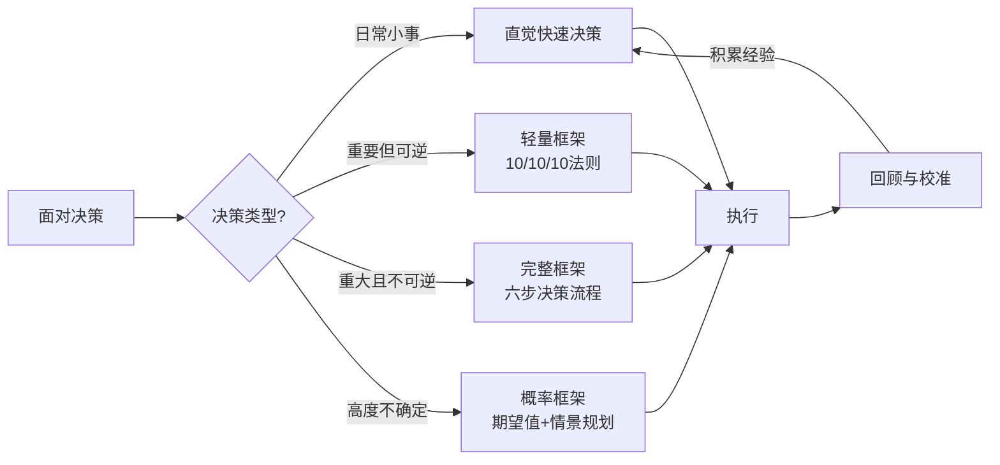
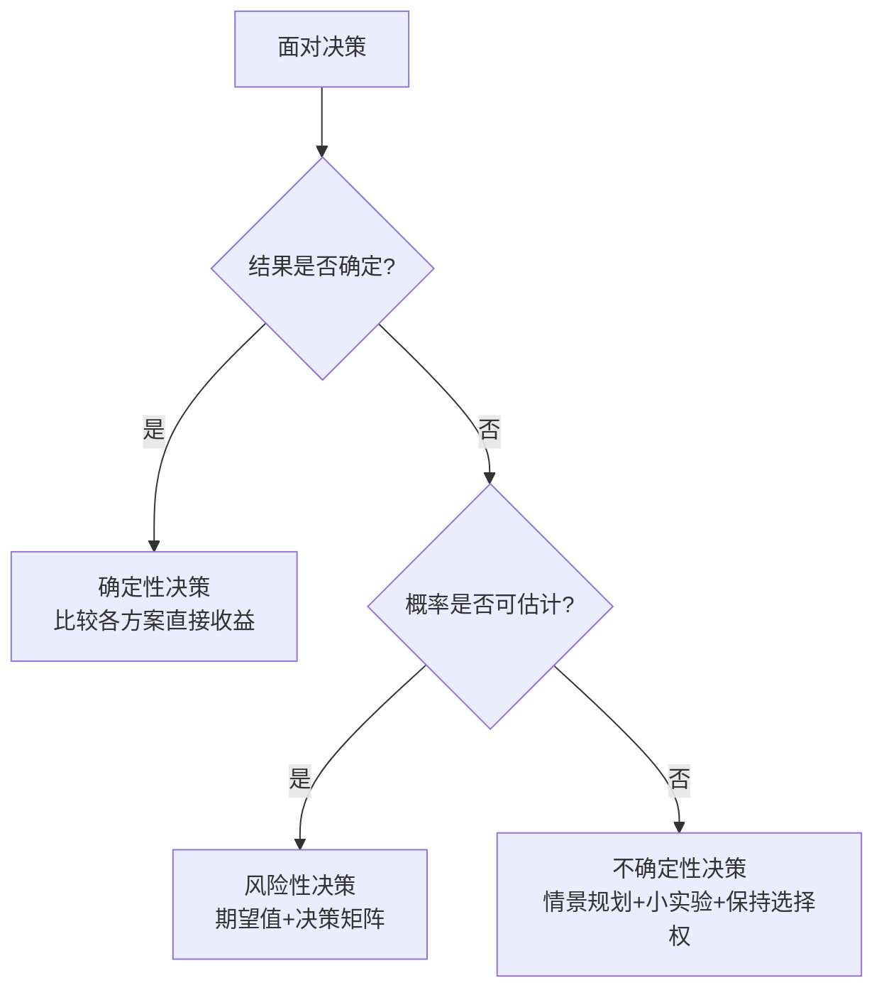
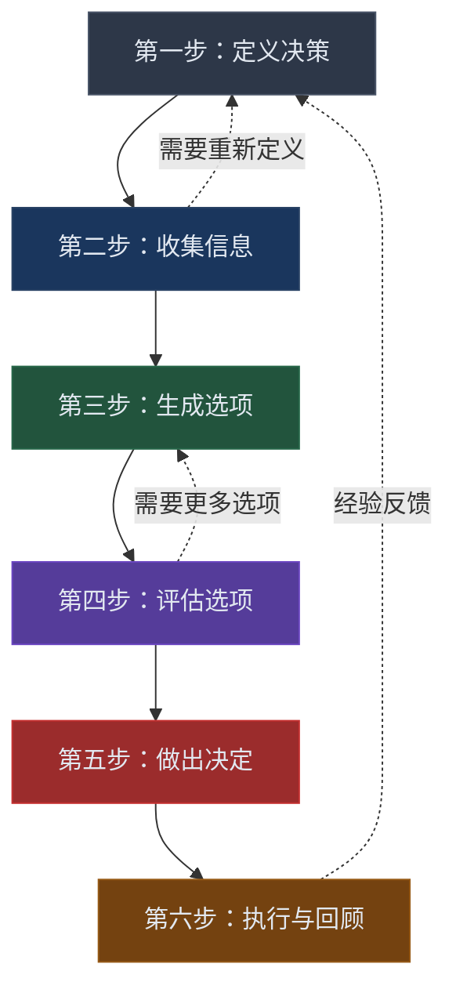

## 二、决策框架：从混乱到清晰

> "决策的质量不取决于结果，而取决于决策过程本身的质量。" —— 安妮·杜克（Annie Duke），《对赌》作者、世界扑克冠军

人的一生大约要做 35000 个重大决策。从早上穿什么到选什么职业、和谁结婚、在哪里定居，决策质量的微小差异会在几十年后产生巨大的复利效应。然而大多数人从未系统学习过如何做决策——我们凭直觉、凭情绪、凭"感觉对"来做选择，然后在事后困惑为什么结果总是不尽如人意。

本节将为你构建一套完整的决策系统：从理解决策的本质分类，到掌握结构化的决策流程，再到熟练运用多种决策工具，最后识别并规避那些悄悄扭曲你判断的心理陷阱。

### 2.1 为什么需要决策框架

#### 直觉决策的局限性

诺贝尔经济学奖得主丹尼尔·卡尼曼（Daniel Kahneman）在《思考，快与慢》中揭示了人类思维的双重系统：

| 系统 | 特征 | 适用场景 | 典型错误 |
|------|------|---------|---------|
| 系统1（快思维） | 自动化、直觉式、低能耗 | 日常小事、专家在熟悉领域的判断 | 认知偏差、刻板印象、情绪劫持 |
| 系统2（慢思维） | 刻意的、分析式、高能耗 | 重大决策、陌生领域、高风险场景 | 分析瘫痪、过度思考、决策疲劳 |

直觉决策在以下场景中尤其危险：

- **陌生领域**：你对投资一无所知时，"感觉这个基金不错"毫无参考价值
- **高风险决策**：买房、换职业、创业——错误代价极高，不允许"试试看"
- **信息过载**：面对海量选项时，直觉容易被表面特征（如品牌、价格）锚定
- **情绪波动时**：愤怒、恐惧、兴奋都会系统性地扭曲判断

决策框架的本质作用是：**在你最需要理性的时候，提供一个结构化的脚手架，防止你掉入直觉的陷阱**。

#### 框架不是束缚，而是杠杆

有人会担心：用框架做决策是不是太死板了？答案恰恰相反。查理·芒格说过："如果你手上只有一把锤子，你看什么都像钉子。"决策框架给你的是一个**工具箱**——面对不同的决策场景，你调用不同的工具。熟练之后，框架会内化为你的思维习惯，决策速度反而更快、质量更高。

### 2.2 决策的分类：选对工具的前提

不同的决策类型需要不同的处理方式。用重炮打蚊子和用弹弓打坦克同样是错误的。

#### 按可逆性分类（杰夫·贝佐斯的"双向门"理论）

亚马逊创始人杰夫·贝佐斯在1997年致股东信中提出了"单向门/双向门"（Type 1 / Type 2 Decisions）的经典分类，这一框架深刻影响了亚马逊的决策文化。

**可逆决策（双向门 / Type 2）**

这类决策的特点是：做错了可以回头，代价可控。例如：

- 尝试一种新的笔记方法——不好用就换回来
- 买一件可退货的衣服——不喜欢就退
- 给团队分配一个探索性项目——不行就停
- 发布一个A/B测试版本——数据不好就回滚

处理原则：**快速决策，小步试错**。贝佐斯认为，对于双向门决策，组织中大约70%的决策都应该由个人或小团队快速做出，不需要层层审批。在个人生活中同样如此——你不需要为午餐吃什么开一个"决策会议"。

**不可逆决策（单向门 / Type 1）**

这类决策一旦做出就很难撤销，或者撤销的代价极其高昂：

- 辞职创业——放弃了稳定的收入和职业积累
- 结婚——法律和情感上的长期承诺
- 购买房产——大额资金锁定，流动性极差
- 移民——文化、社交圈、职业路径的全面重置
- 选择专业——影响至少4-10年的学习方向

处理原则：**慎重分析，充分收集信息，必要时延迟决策**。对于单向门决策，多花一周甚至一个月来思考是完全值得的。

**实际操作中的灰色地带**

很多决策并不纯粹是单向门或双向门，而是介于两者之间。一个实用的判断方法是问自己："如果这个决定是错的，我要花多少时间和金钱来纠正？"如果答案是"很少"，按双向门处理；如果答案是"很多"或"无法纠正"，按单向门处理。

| 判断维度 | 双向门 | 单向门 |
|---------|--------|--------|
| 纠正成本 | 低（时间/金钱/声誉） | 高或不可逆 |
| 决策频率 | 高频，可重复决策 | 低频，一次性 |
| 信息需求 | 有限信息即可行动 | 需要充分信息 |
| 最佳策略 | 快速试错，迭代优化 | 深度分析，慎重选择 |
| 典型场景 | 产品功能迭代、日常消费 | 人生重大选择、战略方向 |

#### 按确定性分类

**确定性决策**

结果可以准确预测。这类决策的核心是找到最优解。例如：两家超市卖同一款产品，选择价格低的那家。现实中纯粹的确定性决策很少，但很多决策的某些维度是确定的——比如合同中的固定条款。

处理方法：直接比较各选项在确定维度上的表现，选择最优。

**风险性决策（已知概率）**

结果有多种可能，每种可能的概率可以合理估计。这是最需要用量化工具处理的决策类型。

示例场景：
- 投资：历史数据可以提供回报率的概率分布
- 职业选择：不同行业的平均薪资和晋升概率有统计资料
- 医疗决策：手术成功率和并发症概率有临床数据

处理方法：使用**期望值计算**和**决策矩阵**进行量化评估。

**不确定性决策（未知概率）**

结果有多种可能，但概率无法可靠估计。这是最困难也最常见的决策类型。

示例场景：
- 进入一个全新的市场——没有历史数据可供参考
- 应对黑天鹅事件——事件本身的性质使概率估计不可靠
- 技术路线选择——未来技术的演化路径高度不确定

处理方法：使用**情景规划**（Scenario Planning）、**小规模实验**和**可选性策略**（保持选择权开放）。

#### 按时间跨度分类

| 跨度 | 特征 | 适用工具 | 示例 |
|------|------|---------|------|
| 即时决策（秒级） | 需要立即反应，无暇分析 | 直觉+经验规则 | 交通避险、紧急应对 |
| 短期决策（天到周） | 有一定思考时间 | 轻量框架（利弊表、10/10/10） | 购买决定、工作安排 |
| 中期决策（月到年） | 充分的分析时间 | 完整决策流程、决策矩阵 | 职业转换、学习计划 |
| 长期决策（年以上） | 需要考虑深远影响 | 情景规划、价值观对齐 | 人生方向、财务规划 |

### 2.3 决策流程框架：从定义到回顾

以下是经过大量实践验证的六步决策流程。它不是线性的——你经常会需要回退到前一步，这完全正常。

#### 第一步：定义决策

**为什么定义比解决更重要？**

爱因斯坦说过："如果给我一小时拯救世界，我会花55分钟定义问题，5分钟解决它。"决策中最常见的错误不是选错了选项，而是**做错了决策**——解决了错误的问题。

**具体操作：**

1. **用一句话清晰陈述决策问题**。格式：「我需要在[时间限制]内，决定[具体选择]，以实现[目标]」。
   - 反例："我应该换工作吗？"——太模糊
   - 正例："我需要在三个月内决定是否离开当前的软件工程师岗位，去追求产品经理的职业方向，目标是获得更大的职业影响力和成长空间。"

2. **明确约束条件**。每个决策都有边界：
   - 资金约束：你能动用多少钱？
   - 时间约束：决策的截止日期是什么？
   - 关系约束：哪些人的利益需要考虑？
   - 能力约束：你的核心能力是什么？

3. **确定决策的时间框架**。什么时候必须做出决定？这个截止日期是硬性的（如报名截止）还是软性的（如自己设定的）？

4. **识别利益相关者**。这个决策会影响谁？他们的利益和立场是什么？是否需要他们的输入或同意？

**实操模板——决策定义表：**

┌─────────────────────────────────────────────┐
│ 决策定义表                                    │
├─────────────────────────────────────────────┤
│ 核心问题：__________________________________  │
│ 决策类型：□ 双向门  □ 单向门                   │
│ 确定性：  □ 确定  □ 风险  □ 不确定              │
│ 截止日期：__________________________________  │
│ 约束条件：                                    │
│   - 资金：__________________________________  │
│   - 时间：__________________________________  │
│   - 关系：__________________________________  │
│ 利益相关者：________________________________  │
│ 成功标准：__________________________________  │
│ 最坏可接受结果：____________________________  │
└─────────────────────────────────────────────┘

#### 第二步：收集信息

**信息收集的核心原则：够用就好，不必完美**

信息收集是一个投入回报递减的过程。前期每一条新信息都可能改变你的判断，但到了某个临界点，新信息只是在强化你已有的倾向。

**三步信息收集法：**

1. **确定"必须知道"和"最好知道"**
   - 必须知道（Must Know）：没有这个信息就无法做出合理判断。例如：一份工作的薪资范围、一个投资产品的风险等级。
   - 最好知道（Nice to Know）：有更好，但没有也不影响决策。例如：同事对新工作的评价、产品的用户口碑细节。
   - **关键规则**：先收集所有"必须知道"，再根据剩余时间收集"最好知道"。

2. **设定信息收集的时间限制**
   - 对于双向门决策：给信息收集设1-2天的上限
   - 对于单向门决策：给信息收集设1-4周的上限
   - 使用**帕累托法则**：用20%的时间获取80%的关键信息

3. **评估信息的可靠性和相关性**

| 信息质量指标 | 高质量 | 低质量 |
|------------|--------|--------|
| 来源 | 一手数据、权威机构、专业人士 | 匿名传言、利益相关方、营销材料 |
| 时效性 | 近期数据，反映当前状态 | 过时数据，可能已不适用 |
| 样本量 | 大样本、多来源验证 | 单一来源、小样本 |
| 偏差风险 | 信息提供者无利益冲突 | 信息提供者有明显动机 |
| 可验证性 | 可以交叉验证 | 无法独立核实 |

**信息收集的常见陷阱：**

- **信息焦虑**：总觉得"再查查"才安心，实际上是在拖延决策
- **确认偏误收集**：只搜索支持自己倾向的信息，忽略反面证据
- **信息过载**：收集了太多信息反而更难做决定，淹没了关键信号
- **虚假精确**：用大量细节来营造"分析透彻"的幻觉，但忽略了根本问题

#### 第三步：生成选项

**为什么要多选项思考？**

研究表明，当人们只考虑两个选项（做或不做）时，决策质量显著低于考虑三个或更多选项时。因为"做或不做"是一个虚假的二元对立，现实中几乎总有第三条路。

**生成更多选项的方法：**

1. **强制产生至少三个选项**。即使你已经有了明显倾向的方案，也强制自己再想出至少两个替代方案。

2. **使用SCAMPER法探索创新选项**

   | 字母 | 含义 | 操作 | 示例（改进一辆自行车） |
   |------|------|------|---------------------|
   | S | Substitute（替代） | 用什么可以替换现有元素？ | 用碳纤维替代钢架 |
   | C | Combine（合并） | 可以和什么结合？ | 自行车+电动机=电动自行车 |
   | A | Adapt（适应） | 从其他领域借鉴什么？ | 借鉴汽车的变速系统 |
   | M | Modify/Magnify（修改/放大） | 放大或缩小什么？ | 加大轮胎（山地车） |
   | P | Put to other uses（另作他用） | 还能用于什么场景？ | 健身车（室内使用） |
   | E | Eliminate（消除） | 去掉什么？ | 去掉链条（无链条传动） |
   | R | Reverse/Rearrange（反转/重排） | 颠倒或重排什么？ | 倒骑自行车（躺式自行车） |

3. **"不做任何改变"作为一个选项**。这个选项经常被忽略，但它帮助你明确改变的机会成本——维持现状的代价是什么？收益是什么？

4. **反向思考**：如果你的对手（或竞争者）希望你怎么做？为什么？——这通常暗示你应该避免的方向。

5. **跨界借鉴**：其他行业或领域是怎么解决类似问题的？例如，医院的急诊分诊系统启发了软件开发中的优先级排序方法。

#### 第四步：评估选项

**确定评估标准和权重**

不要凭感觉比较选项——先明确你用什么标准来衡量。步骤如下：

1. **列出所有可能的评估标准**（头脑风暴，先不筛选）
2. **筛选出最重要的3-7个标准**（太多标准会导致分析瘫痪）
3. **为每个标准分配权重**（所有权重之和=100%）
4. **给每个选项在每个标准上打分**（1-10分）

**一个实用的权重分配技巧**——"痛苦测试"：想象每个标准不达标时你有多痛苦。让你最痛苦的标准应该获得最高权重。

**评估时的进阶考量：**

- **尾部风险**：不仅看"最可能的结果"，还要看"最坏的结果"及其影响
- **可逆性**：如果选错了，纠正的代价有多大？
- **成长性**：这个选项是否为你打开了更多未来的选择？
- **一致性**：这个选项是否与你的核心价值观和长期目标一致？

#### 第五步：做出决定

**从"完美决策"到"足够好决策"**

赫伯特·西蒙（Herbert Simon）提出的"满意化"（Satisficing）策略在大多数情况下优于"最大化"（Maximizing）策略：

| 策略 | 描述 | 优点 | 缺点 |
|------|------|------|------|
| 最大化 | 搜索所有选项，选择最优 | 理论上最优 | 耗时长、压力大、决策后悔率反而更高 |
| 满意化 | 设定最低标准，选择第一个达标的 | 快速、压力小、满意度更高 | 可能错过最优解 |

研究表明，"最大化者"比"满意化者"更容易感到后悔和抑郁——因为他们总在想"如果选了另一个会怎样"。

**做出决定的关键动作：**

1. **设定不可更改的截止日期**。在日历上标出，到时间就必须做出选择。
2. **接受"足够好"**。在一个不确定的世界里，事前追求"完美选择"是徒劳的。
3. **写下决策理由**。记录你为什么选了这个方案、你的假设是什么、你预期的结果是什么。这为第六步的回顾提供了基线。
4. **"10-10-10"时间透镜**。问自己：这个决定10分钟后我会怎么想？10个月后呢？10年后呢？这个方法帮助你超越当下的情绪冲击，从更长的时间维度来评估。通常10分钟后的反应代表情绪，10个月后代表逻辑，10年后代表价值观。

#### 第六步：执行与回顾

**为什么回顾比决策本身更重要？**

大多数人做完决定后就再也不回头看了。但**决策能力的真正提升来自于系统的回顾**——它让你从经验中学习，而不是简单地积累经历。

**执行阶段的关键动作：**

1. **制定执行计划**：将决策分解为具体的行动步骤，明确每一步的责任人和截止日期
2. **设定检查点**：在关键节点安排"继续/调整/停止"的判断时刻
3. **建立反馈机制**：设定指标来衡量决策的实际效果

**回顾阶段的标准流程：**

决策回顾清单（决策后1个月/3个月/6个月/1年各做一次）

1. 实际结果 vs 预期结果
   - 哪些预期被验证了？
   - 哪些预期落空了？原因是什么？

2. 决策过程评估
   - 信息收集是否充分？
   - 是否生成了足够的选项？
   - 评估标准和权重是否合理？
   - 是否有明显的认知偏差？

3. 从中学到了什么？
   - 如果重来一次，我会做出不同的选择吗？
   - 我的决策过程中哪些环节需要改进？
   - 这个经验可以迁移到哪些未来的决策？

4. 更新决策档案
   - 将这次决策的完整记录存入"决策日志"
   - 标注可以复用的经验和需要避免的陷阱

### 2.4 常用决策工具详解

#### 决策矩阵（加权评分法）

决策矩阵是最常用的量化决策工具，它强制你将模糊的"感觉"转化为具体的数字。

**使用步骤：**

1. 列出所有评估标准
2. 为每个标准分配权重（总和100%）
3. 为每个选项在每个标准上打分（1-10分）
4. 计算加权分（评分 × 权重）
5. 汇总每个选项的总加权分

**完整示例——选择职业方向：**

| 标准 | 权重 | 大厂程序员 | 创业公司CTO | 技术自媒体 |
|------|------|----------|-----------|----------|
| 薪资收入 | 20% | 9 → 1.80 | 6 → 1.20 | 4 → 0.80 |
| 成长空间 | 25% | 6 → 1.50 | 9 → 2.25 | 7 → 1.75 |
| 工作自主性 | 20% | 4 → 0.80 | 8 → 1.60 | 10 → 2.00 |
| 稳定性 | 15% | 8 → 1.20 | 3 → 0.45 | 5 → 0.75 |
| 生活质量 | 20% | 5 → 1.00 | 4 → 0.80 | 8 → 1.60 |
| **总计** | **100%** | | **6.30** | **6.30** | **6.90** |

**决策矩阵的进阶技巧：**

- **敏感性分析**：稍微调整权重，看看结果是否会改变。如果权重微调就导致结论反转，说明这个决策对权重设定非常敏感，你需要更慎重地确定权重。
- **反面测试**：给每个选项的分数取反（用10减去原始分），看看你的评分是否受到"想要某个选项胜出"的偏见影响。
- **极端测试**：给某个标准权重设为0%，看看结论是否改变。如果改变，说明这个标准其实是关键因素。

#### 期望值计算

对于概率性决策，期望值（Expected Value）是最基础也最强大的工具。

**公式：** 期望值 = Σ（概率ᵢ × 结果ᵢ）

**示例——投资决策：**

| 选项 | 概率分布 | 期望值计算 | 期望值 |
|------|---------|-----------|--------|
| 选项A（稳定基金） | 70%赚10万，30%赚0 | 0.7×10 + 0.3×0 | 7万 |
| 选项B（成长股） | 30%赚30万，50%赚2万，20%亏5万 | 0.3×30 + 0.5×2 + 0.2×(-5) | 9万 |
| 选项C（创业） | 10%赚100万，40%赚10万，50%亏20万 | 0.1×100 + 0.4×10 + 0.5×(-20) | 4万 |

**关键洞察**：选项B的"最可能结果"（50%概率赚2万）看起来不如选项A（70%概率赚10万），但选项B的期望值更高（9万 vs 7万）。这就是为什么我们需要计算期望值而不是只看"最可能发生什么"。

**期望值的局限与补充：**

期望值有一个重大盲区——它假设你可以"重复"这个决策很多次。但人生中的很多重大决策（如创业、结婚）只能做一次。对于这种"一次性"决策，你还需要考虑：

- **最坏情况的承受力**：选项C的最坏情况是亏20万，你能承受吗？
- **尾部风险**：是否有可能出现比预估更极端的结果？
- **非金钱因素**：创业带来的人生体验、技能成长、人脉积累等无法用金钱衡量的因素

#### 预验尸法（Pre-mortem）

由心理学家加里·克莱因（Gary Klein）提出。与传统的"事后复盘"相反，预验尸是在**决策做出之前**假设它已经失败了，然后逆向分析原因。

**为什么预验尸有效？**

- 它给了人们"许可"去质疑一个看似已经成型的决定
- 它激活了"未来的失败"这个具体场景，比抽象的风险分析更容易引发深入思考
- 研究表明，预验尸可以将问题识别率提高30%以上

**标准操作流程：**

1. **假设决策已经做出且失败了**。告诉自己："六个月后，这个决定彻底失败了。"
2. **每人独立写下失败的可能原因**（5-10分钟）。强调"独立"——避免群体思维。如果是一个人决策，可以在不同时间、不同心境下分别写下原因。
3. **汇总所有原因，按严重程度排序**。不讨论、不反驳，先收集。
4. **针对排名前三的高风险原因，制定具体的预防措施或应急方案**。
5. **将预防措施纳入执行计划**。

**预验尸检查清单：**

预验尸分析模板

决策：________________________________
假设日期：决策已过去6个月

1. 如果这个决策失败了，最可能的原因是什么？
   - 原因1：________________（严重度：高/中/低）
   - 原因2：________________（严重度：高/中/低）
   - 原因3：________________（严重度：高/中/低）

2. 哪些外部因素变化会导致失败？
   - ________________________________
   - ________________________________

3. 我忽略了哪些反面信号？
   - ________________________________

4. 针对每个高风险原因的预防措施：
   - 原因1 → 预防：________________
   - 原因2 → 预防：________________
   - 原因3 → 预防：________________

#### 第三选择法

由史蒂芬·柯维（Stephen Covey）在《第三选择》中系统阐述。核心思想是：当面对"要么A要么B"的对立时，不要被迫在两者中选择——寻找一个**超越两者**的第三选择。

**寻找第三选择的方法：**

1. **明确A和B各自的优点和缺点**
2. **问自己："有没有一种方案，能同时保留A和B的核心优点，同时规避它们的核心缺点？"**
3. **用"是的，而且……"替代"要么……要么……"**

**真实案例：**

| 场景 | A方案 | B方案 | 第三选择 |
|------|-------|-------|---------|
| 职业选择 | 留在大公司（稳定但缺自由） | 辞职创业（自由但高风险） | 在公司内部发起创新项目，或做副业验证创业想法 |
| 定居选择 | 留在老家（离父母近但机会少） | 去一线城市（机会多但远离家人） | 选择新一线城市或远程工作+定期回老家 |
| 教育选择 | 国内读研（成本低但视野窄） | 出国留学（视野广但成本高） | 先在国内积累经验，再申请带奖学金的海外项目 |

#### 红队分析法

军事和情报领域常用的决策验证方法。基本思想是：指定一个"红队"（或自己扮演红队），专门从**反对者的角度**攻击你的决策方案。

**操作步骤：**

1. 明确你倾向的决策方案
2. 想象你是一个聪明的、善意的批评者，列出这个方案的所有漏洞
3. 针对每个漏洞，评估它发生的概率和影响
4. 如果存在高概率、高影响的漏洞，要么修改方案，要么准备应对计划

#### 二阶思维（Second-Order Thinking）

一阶思维问"然后呢？"，二阶思维问"然后的然后呢？"。

大多数人的思考停留在一阶：做这个决定→直接结果是什么？但真正的高手会继续追问：直接结果之后，还会引发什么连锁反应？

**示例——公司决定裁员20%以降低成本：**

| 思维层次 | 分析 |
|---------|------|
| 一阶思维 | 成本降低了20%，利润率提升 |
| 二阶思维 | 留下的员工人心不稳，核心人才可能流失；士气下降导致生产力降低 |
| 三阶思维 | 人才流失→产品质量下降→客户流失→收入下降→需要进一步裁员（死亡螺旋） |

**二阶思维的练习方法：**

1. 做出任何决策后，问自己："这个决策的直接结果是什么？"
2. 再问："这些直接结果会引发什么新的情况？"
3. 继续问："这些新情况又会引发什么？"
4. 重复直到你看到的后果不再显著变化

### 2.5 决策的心理陷阱与应对策略

认知偏差是决策质量的最大杀手。以下是最常见、影响最大的几种偏差，以及具体的应对方法。

#### 分析瘫痪（Analysis Paralysis）

**表现**：过度收集信息、反复比较选项，始终无法做出决定。

**根本原因**：对错误的恐惧 + 完美主义倾向 + 选项过多（心理学家巴里·施瓦茨称之为"选择的悖论"）。

**具体应对方法：**

1. **硬性截止日期**：在日历上标出，到时间必须决定，不得延期
2. **减少选项**：将候选方案从10个砍到3个——研究表明，超过5个选项时决策质量不升反降
3. **设定"足够好"标准**：明确最低可接受标准，达到就行动
4. **"两分钟法则"**：如果决策的后果在两分钟内就能被纠正（如买什么饮料），不要超过10秒钟做决定
5. **"如果不确定，就选更难的那个"**：这个启发式在个人成长类决策中特别有效，因为困难的选择通常意味着更多的成长

#### 确认偏误（Confirmation Bias）

**表现**：只搜索、只注意、只记住支持自己已有观点的信息。

**为什么这么危险**：它是无声的——你不会意识到自己正在选择性地处理信息。你以为自己在"客观分析"，实际上只是在为一个已经做出的决定寻找理由。

**具体应对方法：**

1. **主动寻找反面证据**。做决策时，专门花时间搜索"为什么这个方案可能是错的"
2. **"钢铁人论证"**：不是稻草人（歪曲对方观点），而是把反对意见强化到最强版本，然后看看你的方案能否站住脚
3. **"杀死你的宝贝"**：对你最偏爱的方案，列出它必须满足的3个条件——如果不满足，就放弃它
4. **定期做"信念审计"**：每季度列出你最坚信的5个观点，检查它们是否有新的反面证据

#### 沉没成本谬误（Sunk Cost Fallacy）

**表现**：因为已经投入了时间、金钱或情感，而继续一条不值得走的路。

**经典案例**：花100元买了一张电影票，看了30分钟发现电影很烂，但因为"已经花了100元"而坚持看完。理性分析：那100元已经花了，不管你走不走。现在你唯一应该考虑的是：接下来的90分钟，是继续坐在这里忍受烂片，还是去做更有价值的事？

**具体应对方法：**

1. **"零基思维"**：问自己——"如果我现在没有投入任何东西，我还会选择这条路吗？"如果答案是"不会"，那就该停了。
2. **区分"已投入"和"还将投入"**：沉没成本（已投入的）不可挽回，但你还可以控制"还将投入多少"
3. **设定止损点**：在做决策之前就设定明确的止损标准——"如果到X日期还没达到Y结果，就放弃"
4. **把"退出"重新定义为"战略调整"**：语言框架会影响心理感受。"退出"听起来像失败，"战略调整"听起来像智慧。

#### 群体思维（Groupthink）

**表现**：团队追求一致而压制不同意见，导致集体做出糟糕的决策。

**预警信号：**
- 会议中没有人提出反对意见
- 提出异议的人被贴上"不配合"的标签
- 团队对自己的方案过度自信
- 领导者在讨论开始前就表明了立场

**具体应对方法：**

1. **指定"魔鬼代言人"**：每次重大决策会议，指定1-2人专门负责挑战主流方案
2. **匿名投票**：在讨论之前先匿名投票，避免第一个发言者锚定所有人
3. **"沉默开场"**：会议前5分钟，每个人安静地写下自己的观点，然后再分享
4. **外部视角**：邀请不参与决策的外部人员提供新鲜观点
5. **领导者最后发言**：如果你是团队领导，在团队讨论完成前不要表态

#### 锚定效应（Anchoring Effect）

**表现**：被初始信息过度影响，后续判断围绕这个"锚点"偏离。

**经典实验**：让两组人估计非洲国家在联合国中的比例。第一组事先看到随机数字10，第二组看到65。结果：第一组平均估计25%，第二组平均估计45%。一个完全无关的随机数字就能显著影响判断。

**生活中的锚定效应：**
- 商品标价"原价999，现价399"——"999"就是锚点
- 面试时先提出的薪资数字会锚定整个谈判
- 第一印象会锚定你对一个人的长期评价

**具体应对方法：**

1. **自己设定锚点**：在谈判或评估之前，先独立确定一个基于事实的基准值
2. **多个锚点**：从不同角度设定多个参考值，避免被单一锚点主导
3. **质疑参考点**：问自己"这个数字/信息从哪来的？它真的合理吗？"
4. **延迟判断**：收到第一个信息后，先不要形成观点，等收集更多信息后再综合判断

#### 过度自信偏差（Overconfidence Bias）

**表现**：高估自己判断的准确性、低估风险和不确定性。

**数据佐证**：研究发现，当人们对某件事有90%的信心时，他们的正确率通常只有70-80%。驾驶员中93%的人认为自己的驾驶水平"高于平均水平"——这在统计上显然不可能。

**具体应对方法：**

1. **记录预测，定期校准**：把你的预测写下来，事后对照实际结果。这是最有效的校准训练。
2. **使用"置信区间"而非点估计**：不说"这个项目需要3个月"，说"2-5个月，最可能3个月"
3. **参考基准率**：在你做出判断之前，先查一下"一般情况下，这类事情的成功率是多少？"
4. **"事前验尸"**（同上文预验尸法）：假设你错了，会是因为什么？
5. **寻找"反事实"**：如果你的判断是错的，你预期看到什么信号？提前定义这些信号，以便及时调整。

#### 损失厌恶（Loss Aversion）

**表现**：对损失的痛苦感受是同等收益快乐感受的约2倍（卡尼曼和特沃斯基的前景理论）。

**这意味着**：失去100元的痛苦大约等于获得200元的快乐。这导致人们在很多情况下做出非理性的选择——比如死守亏损的股票不卖（避免实现损失），但急着卖掉赚钱的股票（锁定收益）。

**具体应对方法：**

1. **重新框架**：将"可能的损失"重新定义为"获取选择权的成本"。花1万元学一个新技能不是"损失1万"，而是"用1万买了一个新的职业可能性"。
2. **关注总体而非单笔**：不要只看单个决策的得失，看你的整体决策组合的长期表现。
3. **使用"零基思维"**：问自己"如果我此刻什么都没持有，我会选择现在这个方案吗？"

#### 幸存者偏差（Survivorship Bias）

**表现**：只看到成功者的经验，忽略了大量失败者的沉默。

**典型案例**：
- "比尔·盖茨辍学创业成功了，所以学历不重要"——忽略了数百万辍学创业失败的人
- "我爷爷抽烟活到90岁"——忽略了更多因吸烟早逝的人

**应对方法**：主动寻找和研究失败案例。想知道创业是否值得冒险？不要只读成功者的传记，也读读失败者的复盘。

### 2.6 不同场景的决策策略速查表

| 决策场景 | 推荐工具 | 关键步骤 | 常见陷阱 |
|---------|---------|---------|---------|
| 职业选择 | 决策矩阵 + 情景规划 + 价值观对齐 | 1.明确核心需求 2.列出3-5个选项 3.加权评估 4.10/10/10检验 | 锚定效应、从众压力、短期利益诱惑 |
| 投资理财 | 期望值 + 资产配置模型 | 1.评估风险承受力 2.计算期望值 3.分散配置 4.设定止损 | 损失厌恶、过度自信、追涨杀跌 |
| 创业决策 | 预验尸 + 小实验验证 | 1.最小可行产品验证 2.预验尸分析 3.设定里程碑和止损点 | 乐观偏差、沉没成本、确认偏误 |
| 人际关系 | 第三选择 + 价值观对齐 | 1.明确核心需求 2.坦诚沟通 3.寻找双赢方案 | 情绪劫持、非此即彼思维 |
| 日常消费 | 10/10/10 + 需求vs想要测试 | 1.等24小时再决定 2.问自己10/10/10 3.确认在预算内 | 锚定效应、即时满足偏误 |
| 团队决策 | 红队分析 + 魔鬼代言人 | 1.独立思考 2.匿名投票 3.红队挑战 4.综合决策 | 群体思维、权威偏差 |

### 2.7 建立你的个人决策系统

决策框架不只是工具，更是一种**思维习惯**。以下是如何将本节内容内化为日常行为的具体方案。

#### 第一周：建立决策日志

从今天开始，每做一个不平凡的决策就记录：

日期：__________
决策问题：__________
决策类型：□ 双向门  □ 单向门
使用工具：□ 决策矩阵  □ 10/10/10  □ 预验尸  □ 其他________
最终选择：__________
预期结果：__________
信心水平：_____% (0-100)

一个月后回顾这些记录，你会惊讶于自己的决策模式——有些偏差会反复出现，这正是你需要重点训练的地方。

#### 第二周：练习"反面论证"

对你本周做出的每一个重要决策，写一段200字的"反面论证"——假装你是一个聪明的反对者，这个决策为什么可能是错的？

#### 第三周：使用决策矩阵做一次重要决策

找到一个正在纠结的选择，用完整的决策矩阵流程来分析它。对比你用直觉做出的判断和矩阵得出的结果，看看差异在哪里。

#### 第四周：做一次完整的预验尸

对你最重要的一个计划或目标，做一次完整的预验尸分析。列出至少10个可能导致失败的原因，并为前3个制定预防措施。

#### 长期习惯

- **每月回顾**：回顾本月的所有决策记录，计算预测准确率，识别偏差模式
- **每季度校准**：检查自己的信心水平与实际准确率的匹配程度
- **每年审计**：回顾年度重大决策，评估整体决策质量的提升

### 2.8 常见误区与纠正

**误区一：以为有了框架就不会犯错**

纠正：框架降低的是**系统性错误**（认知偏差、信息遗漏），但不能消除**随机性**。一个好的决策过程仍然可能产生坏的结果——因为世界本身就有不确定性。评价决策质量要看过程，不要只看结果。

**误区二：对所有决策都用复杂框架**

纠正：对午餐吃什么用决策矩阵是荒谬的。**框架的复杂度应该与决策的影响力成正比**。99%的决策应该用快速启发式完成，只有1%的重大决策才需要完整的分析流程。

**误区三：决策框架是冷冰冰的理性工具，忽略了情感**

纠正：情感不是理性的敌人——它是重要的信息源。如果你对某个"理性最优"的选项感到强烈的不安，这可能意味着你的潜意识捕捉到了某些理性分析遗漏的风险信号。正确的做法是：**尊重情感信号，但不被情感劫持**。把"我感觉不对"翻译成"我感觉不对，具体是什么让我感到不安？"

**误区四：过度依赖历史数据和他人的经验**

纠正：过去的成功模式不一定适用于未来，他人的成功路径不一定适合你。历史数据是参考，不是处方。特别注意**幸存者偏差**——你看到的成功案例只是冰山一角。

**误区五：追求"不后悔的决策"**

纠正：后悔是人类的正常情感，而且研究表明**行动后悔**（做了某事的后悔）通常比**不行动后悔**（没做某事的后悔）消退得更快。10年后你更可能后悔的是你没做的事，而不是你做了的事。

---

**本节核心要点回顾：**

1. **先分类再决策**——区分双向门/单向门、确定/风险/不确定，选对工具
2. **六步流程是骨架**——定义→信息→选项→评估→决定→回顾，缺一不可
3. **工具是手段不是目的**——决策矩阵、期望值、预验尸、第三选择，按需调用
4. **最大的敌人是自己的大脑**——确认偏误、沉没成本、锚定效应、群体思维，觉察是第一步
5. **回顾比决策更重要**——建立决策日志，定期校准，让每次决策都成为学习机会
