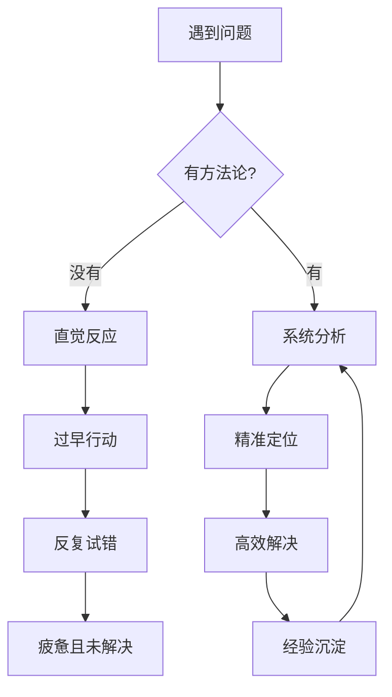
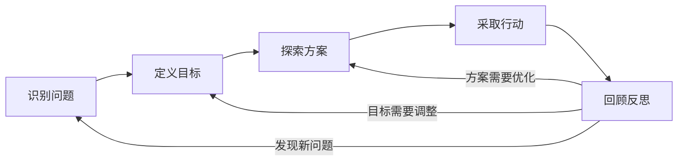
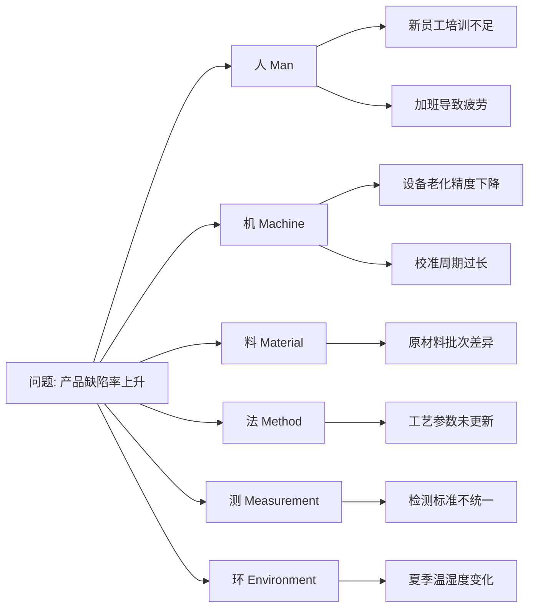
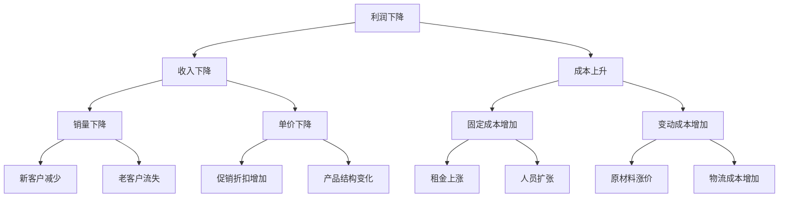
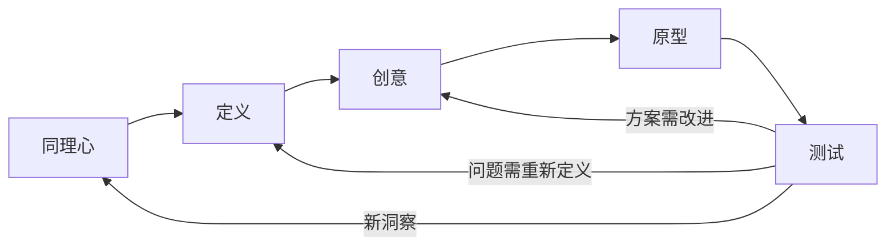
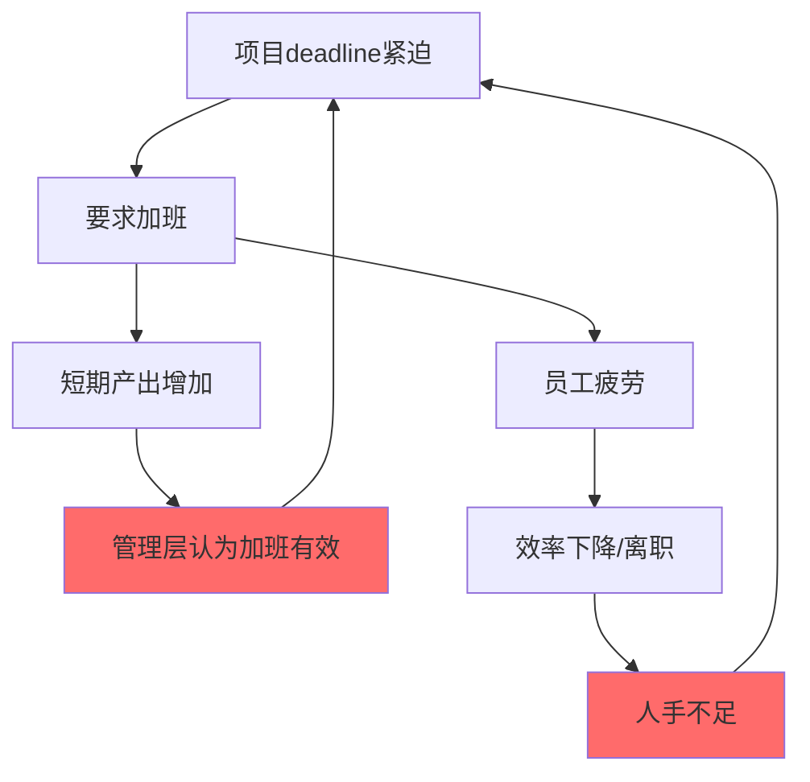
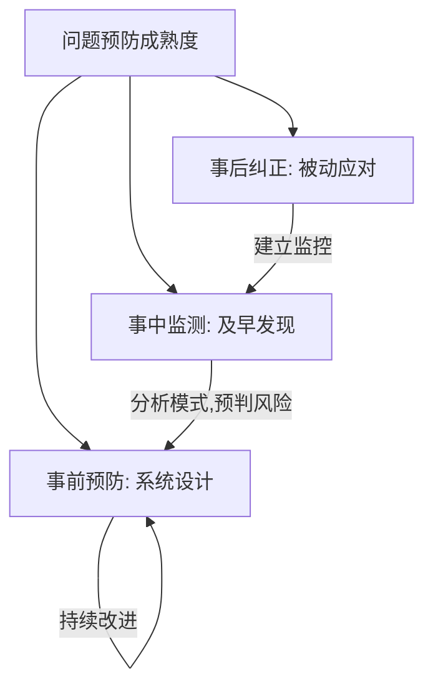

## 三、问题解决方法论

问题解决是人类最高阶的认知活动之一。它不是天赋，而是一套可以习得、训练和精进的系统方法。本章将从底层原理到高阶技巧，完整构建你的问题解决能力体系。

### 3.1 为什么需要方法论？

很多人面对问题时的本能反应是"赶紧想办法解决"。这种直觉式反应在简单问题上有效，但面对复杂问题时往往导致三个典型失败模式：

| 失败模式 | 表现 | 后果 |
|---------|------|------|
| 过早收敛 | 想到第一个方案就立刻执行 | 错过更优解，反复返工 |
| 症状导向 | 只处理表面现象 | 问题反复出现，越治越严重 |
| 线性思维 | 用单一因果链分析 | 忽略系统性因素，按下葫芦浮起瓢 |

方法论的价值在于：它提供了一个**可重复、可检验、可改进**的思考框架，让你在面对任何类型的问题时都有章可循。

### 3.2 问题解决的通用框架

#### 3.2.1 IDEAL框架详解

IDEAL框架由美国心理学家John Bransford和Barry Stein于1984年提出，是认知心理学领域最经典的问题解决模型。五个字母代表五个阶段：

**I - Identify（识别问题）**

识别问题看似简单，实则是整个流程中最关键的环节。爱因斯坦曾说："如果给我一个小时解决问题，我会花55分钟思考问题本身，5分钟思考解决方案。"

识别问题的核心任务：

1. **区分症状与根因**：发烧是症状，感染才是病因。企业利润下降是症状，可能是产品竞争力、市场环境、内部管理等多重原因。永远不要把症状当成问题本身。

2. **界定问题边界**：明确什么在问题范围内，什么不在。边界太宽会导致无从下手，太窄会遗漏关键因素。一个实用技巧是问自己："如果解决了这个问题，还会有什么相关问题存在？"如果答案是"没有"，说明边界合适。

3. **量化问题影响**：问题有多严重？影响多少人？造成多大损失？量化能帮你判断优先级，也能在解决问题后作为效果评估的基准线。

**D - Define（定义目标）**

目标定义遵循SMART原则，但问题解决场景下需要额外注意两点：

- **区分"消除问题"和"达到理想状态"**：前者是底线思维（让客户投诉率降到5%以下），后者是愿景思维（让客户满意度达到95%以上）。两者导向的解决方案可能完全不同。
- **明确约束条件**：时间、预算、人力、技术、政策等约束不是障碍，而是筛选方案的过滤器。越早明确约束，越能避免在不可行的方向上浪费精力。

**E - Explore（探索方案）**

探索阶段的核心原则是**发散优先，收敛在后**。具体操作：

1. **数量优先于质量**：先不评判方案的好坏，尽可能多地产出想法。研究表明，前10个想法通常是常规思路，第11-30个想法中才容易出现创新方案。
2. **使用结构化工具**：随机激发（随机词联想）、SCAMPER（替代/合并/调整/修改/挪用/消除/反转）、六顶思考帽等工具能系统性地拓展思维空间。
3. **引入多元视角**：如果是一个人思考，尝试从不同角色（客户、竞争对手、新人、专家）的角度审视问题。如果是团队讨论，确保成员背景多样化。

**A - Act（采取行动）**

行动阶段的关键是**降低试错成本**：

- 选择方案时，不要追求"完美方案"，而是寻找"足够好且风险可控"的方案
- 制定执行计划时，识别关键路径和里程碑
- 设置检查点，在每个检查点评估是否需要调整方向

**L - Look back（回顾反思）**

回顾是将经验转化为能力的唯一途径。没有回顾的行动只是经历，不是经验。

回顾时问自己三个问题：
1. 结果是否达到预期？差距在哪里？
2. 过程中哪些判断是正确的？哪些是错误的？
3. 如果重来一次，我会怎么做？

#### 3.2.2 PDCA循环

PDCA（Plan-Do-Check-Act）由质量管理之父Walter Deming推广，是持续改进的经典模型。与IDEAL相比，PDCA更强调**迭代和渐进式改进**。

| 阶段 | 核心活动 | 关键产出 |
|------|---------|---------|
| Plan（计划） | 分析现状、设定目标、制定方案 | 行动计划书 |
| Do（执行） | 按计划实施，小规模试点 | 执行数据和观察记录 |
| Check（检查） | 对比实际结果与预期目标 | 偏差分析报告 |
| Act（处理） | 标准化成功经验，处理遗留问题 | 改进后的标准流程 |

PDCA的精髓在于：每一轮循环都不是从零开始，而是站在上一轮的肩膀上。一个小团队每周做一次PDCA循环，一年下来就是52次改进，累积效应惊人。

#### 3.2.3 OODA循环

OODA（Observe-Orient-Decide-Act）由美国空军战略家John Boyd提出，最初用于空战决策，后来被广泛应用于商业竞争和危机处理。

与PDCA的区别：OODA强调**速度和适应性**，特别适合信息不完整、环境快速变化的场景。

- **Observe（观察）**：快速收集环境信息，不求全面但求关键
- **Orient（定向）**：基于已有经验和知识框架，快速形成对局势的理解
- **Decide（决策）**：在信息不完美的情况下果断做出选择
- **Act（执行）**：快速行动，同时准备根据反馈调整

OODA的核心理念是：在不确定环境中，**比对手更快地完成OODA循环**本身就是竞争优势。这解释了为什么很多成功的创业公司能在资源远不如大企业的情况下胜出——它们的决策循环更快。

### 3.3 根本原因分析

找到根本原因（Root Cause）是解决问题的关键。如果只处理表面症状，问题会反复出现，甚至恶化。

#### 3.3.1 5个为什么（5 Whys）

5 Whys方法由丰田创始人丰田佐吉发明，是丰田生产系统（TPS）的核心工具之一。

**操作方法：**

对问题连续追问"为什么"，每一层回答都要基于事实和数据，而不是猜测。通常追问5次左右能触及根本原因，但实际次数取决于问题的复杂度。

**完整示例——从客户投诉到系统改进：**

问题：Q3客户投诉量比Q2增加了40%

Why 1：为什么投诉增加了？
→ 因为产品交付延迟率从5%上升到了18%（数据来源：物流系统记录）

Why 2：为什么交付延迟率上升了？
→ 因为仓库的拣货效率下降了30%（数据来源：仓库管理系统）

Why 3：为什么拣货效率下降了？
→ 因为新上架的2000个SKU没有按照销量频率分区存放（数据来源：仓库布局图）

Why 4：为什么新SKU没有按销量频率分区？
→ 因为新品上架流程中没有包含"销量预测→库位分配"这个步骤（数据来源：SOP文档）

Why 5：为什么SOP缺少这个步骤？
→ 因为SOP是在品类较少时制定的，品类扩张后没有更新（数据来源：SOP版本记录）

根本原因：SOP管理机制缺失，没有定期审查和更新流程
解决方案：建立SOP季度审查制度，品类扩张时触发专项审查

**5 Whys的常见陷阱：**

| 陷阱 | 表现 | 纠正方法 |
|------|------|---------|
| 停在症状层 | 第2-3个Why就停了 | 强制追问到"如果不解决这个，问题还会出现吗？"答案为"不会"时才算到底 |
| 归咎于人 | "因为小王粗心" | 追问"为什么系统允许粗心导致错误？"转向流程和机制层面 |
| 跳跃推理 | 从Why 2直接跳到Why 5 | 每一步都要有事实支撑，不能凭直觉跳步 |
| 单一链条 | 只找一条因果链 | 用鱼骨图补充，考虑多条并行的因果链 |

#### 3.3.2 鱼骨图（石川图/Ishikawa Diagram）

鱼骨图由日本质量管理专家石川馨于1960年代发明，用于系统性地识别问题的所有可能原因。

**6M分类法详解：**

鱼骨图将原因分为六大类，每一类下面需要深入挖掘具体因素：

**绘制步骤：**

1. 在右侧写下问题陈述（尽可能具体和量化）
2. 画出主骨（水平箭头指向问题）
3. 画出六大类别的分支骨
4. 在每个类别下头脑风暴具体原因
5. 对每个原因追问"为什么"，层层深入
6. 用数据验证哪些原因是真实存在的
7. 圈出最可能的根本原因，进入验证阶段

**鱼骨图 vs 5 Whys的使用场景对比：**

| 维度 | 5 Whys | 鱼骨图 |
|------|--------|--------|
| 适用场景 | 单一因果链较明显的问题 | 多因素交织的复杂问题 |
| 优势 | 简单快速，直击要害 | 系统全面，不遗漏 |
| 劣势 | 容易遗漏并行原因 | 耗时较长，需要团队协作 |
| 最佳实践 | 先用5 Whys快速定位，再用鱼骨图补充验证 | 复杂问题首选，团队讨论效果最佳 |

#### 3.3.3 帕累托分析（80/20法则）

意大利经济学家Vilfredo Pareto发现，80%的结果往往由20%的原因造成。在问题解决中，这意味着我们应该优先解决那20%的关键原因。

**操作步骤：**

1. **收集数据**：列出所有可能的原因，并量化每个原因导致的问题次数或影响程度
2. **排序**：按影响从大到小排列
3. **计算累积百分比**：计算每个原因占总影响的百分比和累积百分比
4. **绘制帕累托图**：柱状图表示各原因的影响量，折线图表示累积百分比
5. **识别关键少数**：通常累积百分比达到80%之前的原因就是需要优先解决的

**示例——客服投诉分类分析：**

| 投诉类型 | 次数 | 占比 | 累积占比 |
|---------|------|------|---------|
| 产品质量 | 320 | 40% | 40% |
| 物流延迟 | 200 | 25% | 65% |
| 售后响应慢 | 120 | 15% | 80% |
| 价格争议 | 80 | 10% | 90% |
| 包装破损 | 48 | 6% | 96% |
| 其他 | 32 | 4% | 100% |

分析结论：产品质量和物流延迟两类问题占总投诉的65%，是需要优先解决的关键少数。把这两项解决好，超过一半的投诉就会消失。

#### 3.3.4 故障树分析（FTA）

故障树分析是一种自上而下的演绎分析方法，由美国贝尔实验室于1960年代为导弹发射系统开发，后来广泛应用于航空、核电、医疗等高可靠性领域。

**与鱼骨图的区别：** 鱼骨图是归纳法（从原因到结果），FTA是演绎法（从结果推导原因）。FTA更强调事件之间的逻辑关系（AND/OR），适合分析需要精确定位故障路径的场景。

**基本逻辑门：**

- **OR门**：任一输入事件发生，输出事件就发生（任何一个零件失效都会导致产品故障）
- **AND门**：所有输入事件都发生，输出事件才发生（同时满足高温+高湿才会导致发霉）

**示例——网站宕机故障树：**

网站宕机 [OR]
├── 服务器故障 [OR]
│   ├── 硬件故障
│   │   ├── 硬盘损坏
│   │   └── 内存故障
│   └── 软件故障
│       ├── 操作系统崩溃
│       └── 应用进程OOM
├── 网络故障 [OR]
│   ├── DNS解析失败
│   ├── 负载均衡器故障
│   └── 带宽耗尽 [AND]
│       ├── 正常流量增长
│       └── DDoS攻击
└── 数据库故障 [OR]
    ├── 连接池耗尽
    └── 主从同步延迟

### 3.4 复杂问题解决

当问题涉及多个变量、存在非线性关系、且有多个利益相关方时，它就不再是"问题"而是一个"难题"（Wicked Problem）。这类问题需要更高级的思维工具。

#### 3.4.1 MECE原则

MECE（Mutually Exclusive, Collectively Exhaustive，相互独立，完全穷尽）是麦肯锡咨询的核心思维工具。

**两个维度的含义：**

- **相互独立（ME）**：分解后的各个子问题之间没有重叠，每个因素只出现在一个类别中
- **完全穷尽（CE）**：所有子问题加起来覆盖了整个问题空间，没有遗漏

**为什么MECE如此重要？**

非MECE的分解会导致两种错误：因素重叠会导致重复分析和资源浪费；因素遗漏会导致盲点和意外。只有MECE的分解才能确保你对问题的理解是完整且不冗余的。

**常用的MECE分解框架：**

| 框架 | 适用场景 | 示例 |
|------|---------|------|
| 流程分解 | 按时间顺序分析 | 获客→转化→留存→变现 |
| 公式分解 | 量化问题 | 利润 = 收入 - 成本 = (销量×单价) - (固定成本+变动成本) |
| 矩阵分解 | 两个维度交叉 | 紧急/重要矩阵、BCG矩阵 |
| 逻辑树分解 | 层层细分 | 问题→一级原因→二级原因→具体因素 |

**实操示例——用MECE分析"为什么利润下降"：**

#### 3.4.2 假设驱动法

假设驱动法是顶级咨询公司的核心方法论。它的核心理念是：**不要试图从零开始分析，而是先提出一个可验证的假设，然后用数据来证明或推翻它。**

**为什么假设驱动优于穷举分析？**

- 穷举分析：收集所有数据→分析所有数据→得出结论。耗时长，容易迷失在数据中。
- 假设驱动：提出假设→只收集验证假设所需的数据→快速得出结论。高效，聚焦。

**完整操作流程：**

1. **提出初始假设**：基于经验和初步观察，提出一个关于问题根因或解决方案的假设。假设必须是可证伪的——如果数据不支持，你能明确地说"这个假设是错的"。

2. **设计验证方案**：明确需要什么数据来验证假设，以及数据的来源和获取方式。同时设计"证伪条件"——什么数据出现时，假设就不成立。

3. **快速验证**：用最小成本获取数据，快速检验假设。优先使用现有数据（内部系统、公开数据），避免过早投入大规模数据采集。

4. **迭代修正**：
   - 假设被证实 → 进入解决方案设计
   - 假设被推翻 → 分析为什么错了，提出新的假设
   - 假设部分成立 → 细化或修正假设，继续验证

**示例——电商平台用户流失分析：**

初始假设：用户流失主要是因为竞品价格更低

验证数据：
- 携程/飞猪同类产品价格对比 → 发现价格差异<5%，假设不成立
- 流失用户问卷调查 → 68%用户提到"操作复杂"
- 用户行为数据分析 → 下单流程平均7步，行业平均4步

修正假设：用户流失主要因为下单流程复杂导致体验差

验证数据：
- 简化流程A/B测试 → 实验组转化率提升23%
- 简化后30天留存率 → 提升15%

结论：确认假设，全面推行流程简化

#### 3.4.3 设计思维（Design Thinking）

设计思维由斯坦福大学d.school推广，是一种以人为中心的创新方法论。它的核心特点是**同理心驱动**和**快速原型迭代**。

**五个阶段详解：**

**第一阶段：同理心（Empathize）**

同理心不是"我觉得用户需要什么"，而是通过观察、访谈、体验来真正理解用户的处境和感受。

具体方法：
- **用户访谈**：开放式提问，不引导。问"能告诉我你上次遇到这个问题时的情况吗？"而不是"你觉得这个问题难吗？"
- **影子观察**：跟着用户走完整个流程，记录他们的每一个动作、停顿和表情
- **极端用户研究**：同时研究"重度用户"和"从不使用的用户"，两者的洞察往往比中间用户更有价值
- **同理心地图**：从四个维度记录用户信息——说了什么、做了什么、想了什么、感受了什么

**第二阶段：定义（Define）**

将同理心阶段收集的海量信息综合成一个清晰的问题陈述。常用格式：

> [用户] 需要 [某种方式] 来 [完成某事]，因为 [某个障碍/洞察]。

示例："年轻职场人需要一种不需要大量时间投入的方式来保持身体健康，因为他们每天工作10小时以上，传统健身方式太耗时。"

**第三阶段：创意（Ideate）**

创意阶段的目标是产出大量可能的解决方案。关键规则：

- **推迟判断**：在创意阶段，没有坏想法
- **追求数量**：目标是100个想法，而不是5个好想法
- **在他人想法上构建**：说"是的，而且..."而不是"是的，但是..."
- **鼓励疯狂想法**：疯狂的想法往往能打开新的思路空间

**第四阶段：原型（Prototype）**

用最低成本制作可体验的模型。原型不是产品，是**思考的工具**。

原型的层次：

| 层次 | 成本 | 时间 | 适用场景 |
|------|------|------|---------|
| 纸面原型 | 几乎为零 | 30分钟 | 界面布局和流程验证 |
| 可点击原型 | 低 | 1-2天 | 用户体验测试 |
| 功能原型 | 中 | 1-2周 | 核心功能可行性验证 |
| 最小可行产品 | 高 | 1-3月 | 市场验证 |

**第五阶段：测试（Test）**

与真实用户一起测试原型，收集反馈。测试的关键原则：

- 让用户自己操作，不要引导或解释
- 观察用户的行为，而不是只听他们说的话（用户说的和做的经常不一致）
- 快速迭代：测试→学习→改进→再测试

#### 3.4.4 系统思维

系统思维关注的不是单个元素，而是元素之间的**关系和反馈回路**。很多复杂问题的根源不在于某个组件失效，而在于系统结构本身存在缺陷。

**反馈回路的两种类型：**

- **增强回路（正反馈）**：A增加导致B增加，B增加又导致A增加。例如：用户越多→数据越多→推荐越准→用户更多。增强回路会导致指数增长或指数崩溃。
- **调节回路（负反馈）**：A增加导致B增加，B增加导致A减少。例如：室温升高→空调制冷→室温降低。调节回路会趋向稳定。

**杠杆点（Leverage Points）：**

系统思维的核心实践是找到杠杆点——系统中那些"四两拨千斤"的位置。Donella Meadows提出了12个杠杆点，从低到高排列：

1. 参数（数字）：调整税率、预算等（效果最弱）
2. 缓冲区：增加库存、备用金等
3. 存量-流量结构：改变物理系统的容量和速率
4. 延迟：缩短反馈延迟
5. 平衡反馈回路：增强调节机制
6. 信息流：让更多人看到真实数据
7. 规则：改变游戏规则
8. 自组织：允许系统自行演化
9. 目标：改变系统的目标
10. 范式：改变根本信念和假设（效果最强）

**实操——用系统思维分析"团队加班文化"：**

分析：这是一个典型的增强回路陷阱。加班→疲劳→效率下降→更多加班。杠杆点在"管理层认为加班有效"这个信念上（范式层面），而不是简单地增加人手（参数层面）。

### 3.5 高级技巧

#### 3.5.1 重新定义问题

很多时候，问题之所以难以解决，是因为我们问错了问题。重新定义问题是最强大的问题解决技巧之一。

**重新定义的四种方法：**

1. **逆转法**：把问题反过来问。
   - 原问题："如何提高员工满意度？"
   - 逆转："什么会让员工极度不满？"→ 然后避免这些事情

2. **放大法**：把问题放大到更大的背景中。
   - 原问题："如何让这个广告更吸引人？"
   - 放大："如何让品牌在用户心中留下深刻印象？"→ 答案可能根本不需要广告

3. **缩小法**：把问题缩小到更具体的层面。
   - 原问题："如何提高销售额？"
   - 缩小："如何让进店客户中多10%的人完成购买？"→ 聚焦转化率

4. **换人法**：换一个主体来思考。
   - 原问题："我们如何获取更多用户？"
   - 换人："用户为什么会主动推荐我们？"→ 从"我们找用户"变成"用户帮我们找用户"

**经典案例——重新定义问题带来的突破：**

牙膏品牌最初的问题是"如何让牙膏卖得更多？"经过重新定义，问题变成"如何让人们每次挤更多牙膏？"答案是：把牙膏口做大一点。这个简单的产品设计改变带来了显著的销量增长。

#### 3.5.2 约束转化

将限制条件变成创新的催化剂。这种思维方式的核心洞察是：**没有约束就没有创新的压力，很多伟大的解决方案恰恰是在极端约束下诞生的。**

**约束转化的三个层次：**

| 层次 | 思维方式 | 示例 |
|------|---------|------|
| 接受约束 | 在约束内寻找最优解 | 预算只有10万，找性价比最高的方案 |
| 重新定义约束 | 质疑约束是否真的存在 | "必须用线下推广"→ 线上推广效果可能更好 |
| 利用约束 | 把约束变成独特优势 | "我们太小了"→ "我们小所以灵活，能快速响应客户" |

**案例——西南航空的约束转化：**

西南航空面临的核心约束是：只有一种机型（波音733）、不提供指定座位、不提供餐食、只飞短途。这些在传统航空业看来都是劣势，但西南航空把它们转化成了优势：

- 单一机型 → 维护成本极低、飞行员培训简化、调度灵活
- 不指定座位 → 登机速度极快，飞机周转时间是行业平均的一半
- 不提供餐食 → 清理时间短，进一步提升周转效率
- 短途航线 → 避开大型航空公司的竞争，占领被忽视的市场

结果：西南航空连续47年盈利，成为美国最成功的航空公司之一。

#### 3.5.3 类比迁移

从其他领域借鉴解决方案，是创新思维的重要来源。很多突破性创新都是跨领域类比的结果。

**类比迁移的操作步骤：**

1. **抽象化**：把当前问题抽象成通用模式（"资源分配问题"、"信息传递问题"、"复杂系统协调问题"）
2. **搜索**：在其他领域寻找类似的模式
3. **映射**：把其他领域的解决方案映射回自己的问题
4. **适配**：根据具体场景调整方案细节

**经典类比迁移案例：**

| 源领域 | 目标领域 | 类比内容 | 创新结果 |
|--------|---------|---------|---------|
| 医院急诊分诊 | 客户服务 | 按紧急程度分级处理 | VIP客户快速通道系统 |
| 航空安全检查清单 | 软件开发 | 关键步骤逐项确认 | 代码审查清单（Code Review Checklist） |
| 生态系统多样性 | 投资管理 | 多样化降低系统性风险 | 投资组合理论 |
| 鸟群飞行模式 | 无人机编队 | 分布式协调、无中心控制 | 无人机蜂群算法 |
| 人体免疫系统 | 网络安全 | 自适应防御、记忆机制 | 入侵检测系统的自学习模型 |
| 蚁群觅食 | 物流优化 | 信息素路径选择 | 蚁群算法（ACO）用于路径规划 |

### 3.6 认知偏差与纠偏

问题解决的最大敌人往往不是问题本身，而是我们的大脑。认知偏差是系统性的思维错误，它们在问题识别、分析和决策的每个环节都可能造成干扰。

#### 3.6.1 问题解决中最常见的认知偏差

| 偏差名称 | 定义 | 典型表现 | 纠正方法 |
|---------|------|---------|---------|
| 确认偏差 | 只关注支持自己观点的信息 | "我觉得是A原因"→ 只找A的证据 | 主动寻找反面证据，指定"魔鬼代言人" |
| 锚定效应 | 过度依赖第一个接触的信息 | 第一次报价100万，后续谈判都在100万附近 | 先独立评估，再参考外部信息 |
| 沉没成本谬误 | 因为已投入而不愿放弃 | "这个项目已经花了500万，不能放弃" | 只看未来收益，忽略已投入成本 |
| 可得性偏差 | 容易想到的事情被认为更常见 | 最近看到飞机失事新闻→觉得飞机很危险 | 用数据而非印象做判断 |
| 框架效应 | 同一问题的不同表述导致不同决策 | "成功率90%"vs"失败率10%"效果不同 | 同时用正面和负面框架描述问题 |
| 过度自信 | 高估自己判断的准确性 | "我确定这个方案能行" | 引入参考类别统计，做预mortem分析 |

#### 3.6.2 预mortem分析（Pre-mortem Analysis）

预mortem由心理学家Gary Klein提出，是一种对抗过度自信的有效工具。它的核心思想是：**在项目开始前，假设项目已经失败了，然后倒推失败的可能原因。**

**操作步骤：**

1. 召集团队，宣布："假设我们现在是6个月后，这个项目彻底失败了。"
2. 每个人独立写下"导致失败的可能原因"（5-10条）
3. 汇总所有原因，去重归类
4. 对每个原因评估概率和影响
5. 为高风险原因制定预防措施

预mortem之所以有效，是因为它把"预测失败"从一种消极行为（可能被认为是对项目的不忠）变成了一种被鼓励的思考练习。

### 3.7 团队问题解决

个人面对复杂问题时容易陷入盲区。团队协作能引入多元视角，但也带来新的挑战——群体思维、责任分散、沟通成本等。

#### 3.7.1 六顶思考帽

Edward de Bono发明的六顶思考帽是一种结构化的团队讨论方法，通过强制切换思考角度来避免争论和盲区。

| 帽子颜色 | 代表角度 | 典型问题 |
|---------|---------|---------|
| 白帽 | 事实和数据 | "我们有哪些数据？还缺什么数据？" |
| 红帽 | 直觉和情感 | "我的直觉告诉我什么？" |
| 黑帽 | 风险和问题 | "这个方案的风险是什么？可能的失败模式？" |
| 黄帽 | 价值和机会 | "这个方案的好处是什么？有什么机会？" |
| 绿帽 | 创造和替代 | "还有什么其他可能性？如何突破现有思路？" |
| 蓝帽 | 过程和控制 | "我们的讨论过程是否合理？下一步该做什么？" |

**使用规则：**

- 同一时间所有人戴同一颜色的帽子（避免各说各话）
- 由蓝帽主持人控制帽子切换的节奏
- 黑帽和黄帽必须成对出现（既要看到风险也要看到价值）
- 绿帽阶段禁止批判（先发散后收敛）

#### 3.7.2 世界咖啡（World Café）

世界咖啡是一种适合大规模群体（20-200人）的问题解决方法：

1. 将参与者分成4-5人的小组，每组一张桌子
2. 每桌有一个桌主，讨论一个特定子问题
3. 每轮讨论20分钟后，除桌主外的所有人换到其他桌子
4. 新成员到来后，桌主先介绍上一轮的讨论成果
5. 经过3-4轮后，各桌桌主向全体汇报成果

这种方法的优势是：每一轮都汇集了新的视角，讨论成果像滚雪球一样越来越丰富。

### 3.8 问题解决的工具箱

#### 3.8.1 按问题类型选择工具

| 问题类型 | 推荐工具 | 原因 |
|---------|---------|------|
| 原因明确的简单问题 | 5 Whys | 快速定位，直接行动 |
| 多因素交织的复杂问题 | 鱼骨图 + 帕累托分析 | 系统梳理，聚焦关键 |
| 需要创新突破的问题 | 设计思维 + 重新定义 | 以人为中心，突破思维定势 |
| 紧急决策场景 | OODA循环 | 快速循环，适应变化 |
| 需要持续改进的流程 | PDCA + IDEAL | 迭代优化，积累经验 |
| 高可靠性要求的系统 | 故障树分析 | 精确定位故障路径 |
| 战略级复杂问题 | 系统思维 + MECE | 全局视角，结构化分解 |
| 信息不完整的探索 | 假设驱动法 | 快速验证，高效聚焦 |

#### 3.8.2 问题解决检查清单

在启动任何问题解决流程前，用这个检查清单确保你没有遗漏：

□ 问题定义是否清晰？能否用一句话描述？
□ 我是否区分了症状和根本原因？
□ 问题的影响范围和紧急程度是否明确？
□ 成功的标准是什么？如何衡量？
□ 有哪些约束条件？（时间/预算/资源/政策）
□ 是否有类似的历史经验可以参考？
□ 是否考虑了多个利益相关方的视角？
□ 是否警惕了常见的认知偏差？
□ 是否有备选方案？如果首选方案失败怎么办？
□ 最坏情况是什么？能否承受？

### 3.9 从问题解决到问题预防

最高级的问题解决不是解决问题，而是**预防问题**。

**问题预防的三个层次：**

1. **事后纠正**：问题发生后解决（最低层次）
2. **事中监测**：在问题发展过程中及早发现并干预
3. **事前预防**：通过系统设计消除问题发生的可能性

**实操方法：**

- **FMEA（失效模式与影响分析）**：在产品或流程设计阶段，系统性地识别所有可能的失效模式，评估其严重度、发生概率和可检测度，计算风险优先级数（RPN），对高RPN的失效模式提前采取预防措施。
- **红队演练**：组建一个"攻击方"团队，专门尝试找出系统或方案的漏洞。在安全领域叫渗透测试，在商业领域叫竞争模拟。
- **情景规划**：设想多种未来情景（最好情况、最坏情况、最可能情况），为每种情景准备应对预案。

### 3.10 常见误区与纠正

| 误区 | 为什么是错的 | 正确做法 |
|------|------------|---------|
| "分析越多越好" | 过度分析导致行动瘫痪（Analysis Paralysis） | 用假设驱动法聚焦，80%确定就行动 |
| "一个方法解决所有问题" | 不同问题需要不同工具 | 根据问题类型选择合适的工具组合 |
| "独自思考就够了" | 个人盲区无法自己发现 | 引入多元视角，用结构化方法（六顶思考帽） |
| "问题解决了就结束了" | 没有回顾就无法积累经验 | 每次问题解决后做回顾，沉淀方法论 |
| "根因只有一个" | 复杂问题通常是多因素交织的 | 用鱼骨图系统梳理，考虑交互效应 |
| "专家一定比我判断准" | 专家也有认知偏差和知识盲区 | 尊重数据，保持独立思考，用预mortem对抗过度自信 |

### 3.11 本章小结

问题解决方法论不是一套死记硬背的步骤，而是一种需要反复练习才能内化的思维习惯。关键要点：

1. **先定义问题，再找方案**：80%的问题解决失败源于问题定义错误
2. **工具是手段不是目的**：不要为了用工具而用工具，选择最适合当前问题的工具
3. **拥抱不确定性**：完美信息永远不存在，学会在不确定性中做决策
4. **重视反馈和迭代**：没有一步到位的解决方案，快速试错、快速调整
5. **预防优于治疗**：最高级的问题解决是让问题不发生

> 问题解决的终极目标不是成为"救火队长"，而是成为"防火专家"。当你能够预见问题、预防问题、将问题消灭在萌芽状态时，你就真正掌握了问题解决的艺术。
