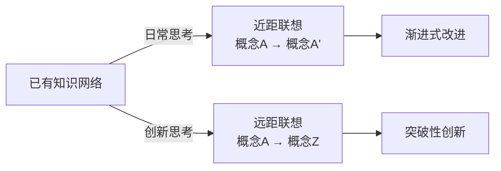
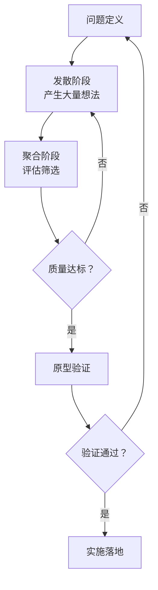
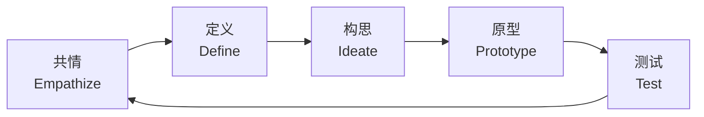
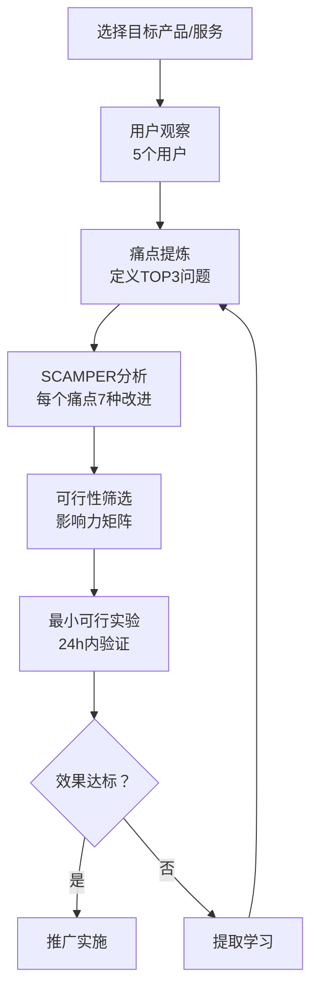
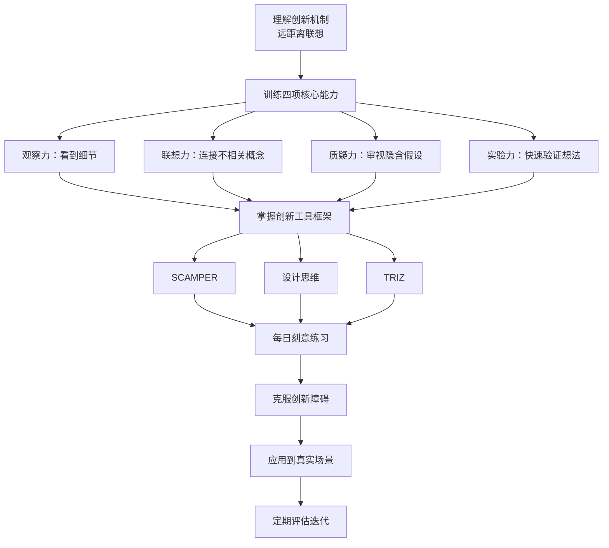

## 四、创新思维训练

创新思维不是少数天才的专利，而是一套可以通过系统训练逐步提升的能力。本节从基础理论出发，详细拆解创新思维的核心能力、训练方法论、主流工具框架，并提供可直接执行的训练计划。每一项训练都经过设计——它不是"想到了就做"的随机活动，而是刻意练习的产物。

### 4.1 创新思维的科学基础

在学习具体训练方法之前，有必要理解"创新想法是怎么在大脑中产生的"。只有理解了底层机制，训练才能有的放矢。

#### 创造力的认知神经科学

大脑产生创新想法的过程，本质上是**远距离联想（Remote Association）**——将原本不在同一神经网络中的概念连接起来。

**Mednick的远距离联想理论（RAT）** 认为，创造力高的人拥有更扁平的联想层级——普通人想到"苹果"只会想到"水果""红色""手机"，而创造力高的人还会想到"牛顿""圣诞树""亚当·斯密的经济学隐喻"。这种"思维跨度"不是天赋，是训练的结果。

**默认模式网络（DMN）** 在你走神、洗澡、散步时最活跃，它正是大脑进行远距离联想的关键网络。这意味着：创新想法往往不产生在"努力思考"的时刻，而产生在放松的间隙。这解释了为什么很多重大创新都诞生于"非工作场景"——阿基米德在浴缸里发现浮力定律，凯库勒在梦中发现苯环结构。

#### 创新思维与发散-聚合循环

创新不是一次性的灵光乍现，而是**发散思维→聚合思维→再发散→再聚合**的迭代循环。

| 阶段 | 目标 | 关键原则 | 常见错误 |
|------|------|----------|----------|
| 发散 | 数量优先 | 暂停评判，追求广度 | 过早评估，自我审查 |
| 聚合 | 质量优先 | 依据标准筛选 | 缺乏明确评估标准 |
| 验证 | 可行性 | 最小成本快速试错 | 追求完美再行动 |
| 迭代 | 优化改进 | 基于反馈调整 | 放弃太早或死守不放 |

理解这个循环，是所有创新训练的前提。很多人"缺乏创造力"不是因为想不到，而是把发散和聚合混在一起——一边想一边评判，最终什么新想法都冒不出来。

### 4.2 创新思维的四项核心能力

创新思维由四项互相支撑的能力构成。它们不是独立的，而是形成一个完整的链条：**观察→联想→质疑→实验**。

#### 能力一：观察力——看见别人看不见的

创新始于敏锐的观察。大多数人对周围的世界视而不见——他们看到的是"概念"（"这是一把椅子"），而非"事实"（"这把椅子有四条腿、一个靠背、座面高度45cm、材质是橡木"）。创新者看到的是事实，因为只有事实层面的细节才能触发新的联想。

**训练方法：**

**1. 每日三现象记录**

每天记录3个你观察到的有趣现象，要求描述到可被第三方验证的精度。

示例——差的记录："今天地铁很挤。"
示例——好的记录："周三早8:15，3号线从天河客运站到体育西路，车厢内密度约为每平方米6人（我无法转身），到体育西路后下车率约40%，但站台上仍有大量乘客无法上车。有趣的是，很多人选择等下一班而非硬挤。"

**2. 用户行为观察法**

选一个你日常使用的App或产品，花30分钟只观察（不操作）其他人如何使用它。记录：
- 用户的操作路径与你的有何不同？
- 用户在哪些步骤犹豫或犯错？
- 用户在哪些时刻露出微笑或皱眉？

**3. 跨感官观察**

通常我们主要依赖视觉。刻意调动其他感官：
- 去一家咖啡店，闭上眼睛3分钟，只记录声音、气味、温度、触感
- 吃一顿饭时，尝试用20个形容词描述味道层次

这种训练能打破"概念化观看"的惯性，让你重新看到细节。

#### 能力二：联想力——连接不相关的概念

联想力是在看似无关的概念之间发现连接的能力。这是创新思维最核心的"发动机"。

**训练方法：**

**1. 强制联想练习**

每天随机选择两个词（可以用随机词生成器），在3分钟内找出至少5个它们之间的连接。

示例——"雨伞"和"婚姻"：
- 两者都提供"庇护"
- 都需要在正确的时间打开
- 坏了可以选择修或扔
- 都有一个"骨架"支撑
- 太小的伞/婚姻只能保护一个人

**2. 属性分解法**

选择一个日常物品，将其分解为5-10个独立属性（形状、材质、颜色、功能、重量等），然后随机替换其中1-3个属性，思考会产生什么新事物。

示例——"雨伞"分解：
- 骨架结构 → 替换为充气结构 → 充气伞（已有产品）
- 手持形式 → 替换为头戴形式 → 帽子伞（已有产品）
- 防雨功能 → 替换为防紫外线 → 遮阳伞（已有产品）
- 柔性面料 → 替换为硬质透明材料 → 透明伞（已有产品）
- 单人尺寸 → 替换为多人尺寸 → 庭院伞（已有产品）

看似平凡的雨伞，通过属性分解就能衍生出多种变体。这就是联想力的实战价值。

**3. 类比迁移法**

遇到一个问题时，主动从三个完全不相关的领域寻找类比解决方案。

示例——如何提高团队协作效率？
- 生物学类比：蚁群没有中央指挥，通过信息素实现高效协作 → 能否用"数字信息素"（实时状态标记）替代频繁会议？
- 交响乐类比：不同乐器各司其职，由乐谱和指挥协调 → 能否用"项目乐谱"（详细时间线+职责矩阵）替代口头协调？
- 消化系统类比：食物经过口腔→胃→小肠，每一步专注不同类型处理 → 能否将工作流拆分为类似的"加工站"？

#### 能力三：质疑力——不接受"理所当然"

创新的最大敌人是"理所当然"。质疑力不是无目的的否定，而是对既有假设的系统性审查。

**训练方法：**

**1. "五个为什么"深挖法**

对任何"理所当然"的做法追问5层"为什么"，直到触及根本假设。

示例——"为什么要写周报？"
- 为什么1：为了让领导了解工作进展
- 为什么2：因为领导无法直接看到每个人的工作
- 为什么3：因为团队分散、信息不透明
- 为什么4：因为我们没有实时共享的工作看板
- 为什么5：因为我们习惯了"汇报制"而非"透明制"

结论：如果引入实时看板工具，周报可能完全多余。这就是质疑力的价值——它帮你发现"问题本身可以被消灭"。

**2. 假设清单法**

列出某个做法的全部隐含假设，然后逐一检验。

示例——"会议必须所有人同时在场"的假设清单：
| 假设 | 是否必然成立 | 替代方案 |
|------|------------|----------|
| 信息必须同步传达 | 否 | 异步文档+评论 |
| 讨论必须实时进行 | 否 | 先异步收集意见，再短会讨论决策 |
| 面对面更好 | 部分 | 复杂议题面对面，简单议题异步 |
| 会议时间必须固定 | 否 | 弹性时间+录制回放 |

**3. 反转思维法**

将一个常规做法完全反转，看会发生什么。

| 常规做法 | 反转版本 | 可能的发现 |
|----------|----------|------------|
| 公司面试候选人 | 候选人面试公司 | 候选人评估体验设计 |
| 用户找产品 | 产品找用户 | 精准推送/场景化触达 |
| 学生选课 | 课程选学生 | 自适应学习路径 |
| 老板定KPI | 员工自定OKR | 自驱力激发 |

#### 能力四：实验力——快速验证想法

想法不值钱，验证值钱。实验力是将模糊的灵感转化为可检验假设的能力。

**训练方法：**

**1. 最小可行实验（MVE）**

对任何新想法，在24小时内设计一个成本最低、耗时最短的验证实验。

设计原则：
- 成本 ≤ 100元
- 时间 ≤ 2小时
- 风险：失败了也没关系
- 结果：必须可观察/可衡量

示例：
- 想法："做一个帮助老年人使用智能手机的课程"
- MVE：去社区找3位老人，免费教他们一个手机功能，观察他们的反应和学习难点
- 不是写商业计划书、不是建网站、不是招团队

**2. 对比实验思维**

对同一个问题，同时尝试两种不同方案，用数据而非直觉做决策。

示例——提升文章阅读完成率：
- 方案A：开头用数据吸引（"90%的人读不完一篇文章"）
- 方案B：开头用故事吸引（"张三昨天犯了一个错误……"）
- 各发布5篇，统计平均阅读完成率

**3. 失败日志法**

每周记录至少1个失败的实验，分析：
- 我假设了什么？
- 实际发生了什么？
- 差距的原因是什么？
- 如果重来，我会怎么设计实验？

失败日志的价值不在于记录失败本身，而在于训练你"从失败中提取信息"的能力。大多数人失败后的反应是情绪性的（沮丧、自责），失败日志强迫你切换到分析模式。

### 4.3 创新工具框架

除了核心能力训练，掌握几个主流创新工具框架能大幅提高创新效率。这些框架不是替代思考，而是为思考提供"脚手架"。

#### SCAMPER：七步创新法

SCAMPER是由Bob Eberle基于Alex Osborn的头脑风暴理论发展出的系统化创新工具，包含7个操作方向。

| 操作 | 含义 | 核心问题 | 实例 |
|------|------|----------|------|
| **S** - Substitute（替代） | 替换某个组件 | 什么可以被替代？ | 用植物蛋白替代肉类→人造肉 |
| **C** - Combine（组合） | 合并不同元素 | 什么可以组合？ | 手机+相机+GPS→智能手机 |
| **A** - Adapt（适配） | 从其他领域借鉴 | 什么可以被借鉴？ | 航空气泡技术→运动鞋气垫 |
| **M** - Modify（修改） | 改变某个属性 | 什么可以放大/缩小/改变？ | 正常尺寸→迷你便携装 |
| **P** - Put to other use（新用途） | 寻找新使用场景 | 还能用在哪里？ | 小苏打从烘焙→清洁→除臭 |
| **E** - Eliminate（消除） | 删除某个组件 | 什么可以去掉？ | 去掉键盘→全触屏手机 |
| **R** - Reverse/Rearrange（反转/重排） | 颠倒顺序或结构 | 什么可以反过来？ | 先穿鞋再穿袜子→无鞋带鞋 |

**实战练习：以"书"为对象做SCAMPER分析**

| SCAMPER操作 | 创新结果 | 已有产品/概念 |
|-------------|----------|---------------|
| 替代 | 纸张→电子墨水 | Kindle |
| 组合 | 书+社交 | 微信读书的"想法"功能 |
| 适配 | 游戏化机制→阅读 | 阅读积分/成就系统 |
| 修改 | 300页→30页精要 | 拆书/听书/摘要服务 |
| 新用途 | 书→社交货币 | "读书会"作为社交场景 |
| 消除 | 去掉线性顺序 | 超文本/维基百科 |
| 反转 | 读者写，作者评 | UGC平台/Wattpad |

#### 设计思维（Design Thinking）五步法

设计思维是IDEO公司和斯坦福d.school推广的以人为中心的创新方法论。

**第一步：共情（Empathize）**

深入理解用户的真实需求，而非你认为他们需要什么。

具体方法：
- **用户访谈**：至少5位目标用户，每人30-60分钟
- **影子观察**：跟着用户走完一个完整场景，记录每个细节
- **同理心地图**：记录用户在想什么、说什么、做什么、感受到什么

**第二步：定义（Define）**

将观察到的需求转化为清晰的问题陈述。

格式："【用户】需要【什么】因为【什么洞察】。"

示例："上班族需要一种在通勤中高效学习的方式，因为他们每天有1-2小时的碎片时间但无法使用需要集中注意力的学习材料。"

**第三步：构思（Ideate）**

针对定义好的问题，产生尽可能多的解决方案。

规则：
- 15分钟内产生至少20个想法
- 不评判任何想法
- 鼓励"疯狂"的想法
- 在别人的想法上叠加

**第四步：原型（Prototype）**

将最好的想法制作成低成本原型。原型的目的不是展示，而是学习。

原型类型：
- **纸面原型**：用纸和笔画出界面或流程
- **角色扮演**：模拟服务场景
- **故事板**：用漫画展示用户体验旅程
- **最小功能版本**：只实现核心功能的一个步骤

**第五步：测试（Test）**

让真实用户接触原型，观察他们的反应。

关键原则：
- 不要解释原型——让用户自己探索
- 记录用户的行为，而非仅记录他们的言语
- 关注困惑、犹豫、惊讶的瞬间
- 每次测试至少3个用户

#### TRIZ：系统化创新方法论

TRIZ（发明问题解决理论）是前苏联学者Genrich Altshuller通过分析250万项专利总结出的系统化创新方法。它的核心洞察是：**发明问题和解决方案存在可重复的模式**。

**TRIZ 40个发明原理（节选最常用的10个）：**

| 编号 | 原理 | 含义 | 实例 |
|------|------|------|------|
| 1 | 分割 | 将物体分成独立部分 | 可拆卸模块化家具 |
| 2 | 抽取 | 从物体中提取有用部分 | 将嘈杂的压缩机移到室外 |
| 3 | 局部质量 | 不同部分具有不同功能 | 铅笔+橡皮→带橡皮头的铅笔 |
| 5 | 合并 | 合并相似或相关物体 | 多功能瑞士军刀 |
| 10 | 预先作用 | 提前完成所需动作 | 预涂胶信封 |
| 13 | 反转 | 颠倒操作 | 用震动而非拉拽来脱模 |
| 15 | 动态化 | 使物体可自适应调整 | 可调节亮度的台灯 |
| 25 | 自服务 | 物体自我维护 | 自清洁烤箱 |
| 28 | 机械系统替代 | 用感官/场/信息替代 | 虚拟键盘替代物理键盘 |
| 35 | 参数变化 | 改变物理状态 | 速溶咖啡（液态→固态→液态） |

**TRIZ矛盾矩阵：**

创新中常遇到的核心困境是"改进A特性会导致B特性变差"。TRIZ的矛盾矩阵将这种矛盾标准化，为每种技术矛盾提供推荐的发明原理组合。

示例——手机的矛盾：
- 想要：更大的屏幕（更好的视觉体验）
- 但导致：更大的体积（不便携）
- TRIZ推荐原理：分割（折叠屏）、动态化（可伸缩屏）、多维化（投影屏幕）

### 4.4 每日训练计划

将上述能力训练和工具应用整合为可执行的每日练习计划。

#### 基础训练（每日15分钟）

| 星期 | 训练内容 | 具体操作 | 用时 |
|------|----------|----------|------|
| 周一 | SCAMPER练习 | 选择一个日常物品，用7个操作逐一分析 | 15min |
| 周二 | 强制联想 | 随机2个词，找出5个连接 | 15min |
| 周三 | 约束创新 | 给定约束条件下解决问题 | 15min |
| 周四 | 反转思维 | 选一个常规做法，完全反转分析 | 15min |
| 周五 | 属性分解 | 将一个物品分解为5+属性并替换 | 15min |
| 周末 | 观察日志回顾 | 回顾一周的观察记录，提炼洞察 | 30min |

#### 进阶训练（每周2小时）

**跨界学习计划：**

每周花2小时深入学习一个非专业领域，并完成"跨界笔记"——记录至少3个可以迁移到自己领域的概念或方法。

| 领域 | 学习重点 | 可迁移的创新模式 |
|------|----------|-----------------|
| 生物学 | 自然选择、共生关系、仿生结构 | 适者生存的产品迭代、互利共生的商业生态 |
| 物理学 | 能量守恒、熵增定律、量子叠加 | 资源转化效率、系统衰退的必然性、叠加态决策 |
| 心理学 | 认知偏差、动机理论、行为改变 | 用户行为预测、激励设计、习惯养成机制 |
| 音乐 | 和声结构、节奏变化、主题变奏 | 信息架构的"和声"、内容节奏控制、主题一致性 |
| 建筑学 | 结构力学、空间叙事、材料特性 | 系统架构设计、用户体验动线、技术选型 |
| 历史 | 技术革命周期、制度演变、文明兴衰 | 预判技术趋势、理解组织变革规律 |

**月度创新工作坊（个人版）：**

每月安排一次2小时的深度创新练习：

1. **问题定义**（15分钟）：选择一个困扰你的真实问题，用"用户需要……因为……"格式定义
2. **发散阶段**（30分钟）：使用头脑风暴+SCAMPER，产生至少30个想法
3. **聚合阶段**（20分钟）：用"影响力×可行性"矩阵筛选前5个想法
4. **原型设计**（30分钟）：为排名第一的想法制作纸面原型或文字描述
5. **验证设计**（15分钟）：设计一个最小可行实验
6. **反思总结**（10分钟）：记录本次练习的收获和改进点

### 4.5 创新思维的障碍与突破

| 障碍 | 心理机制 | 具体表现 | 突破方法 | 训练练习 |
|------|----------|----------|----------|----------|
| 功能固着 | 认知图式固化 | 只看到物品的传统用途 | 强制列举非传统用途 | "砖头的50种用途"练习 |
| 思维定势 | 路径依赖 | 用过去的方法解决新问题 | 设定"禁用已知方案"约束 | 每次解决问题时先排除最常见的3个方案 |
| 自我审查 | 社会评价恐惧 | 想法刚萌生就自我否定 | 设定"无评判时间"（5分钟纯发散） | 5分钟内只记录不评价，用计时器 |
| 从众压力 | 群体极化 | 放弃独特的想法以合群 | 先独立思考写下来，再讨论 | 每次会议前先独立提交想法 |
| 过早收敛 | 认知吝啬 | 想到一个方案就停止探索 | 强制"至少10个方案"规则 | 想到"满意"方案后，强制再想5个 |
| 资源限制心态 | 稀缺思维 | 认为"没有条件所以做不了" | 将约束视为创新的催化剂 | 专门练习"零预算创新"——如何不花钱解决这个问题 |
| 害怕失败 | 损失厌恶 | 不敢尝试未经验证的想法 | 建立"失败预算"——允许每月失败3次 | 记录失败日志，提取学习收获 |
| 专家诅咒 | 知识的诅咒 | 知道得越多，越难想到新角度 | 定期与非专业人士交流 | 每月向一个外行解释你的专业问题 |

### 4.6 从训练到实战：创新思维的应用路径

训练的最终目的是应用。以下是创新思维从训练场迁移到真实场景的路径。

#### 创新思维在工作中的应用

**场景一：产品/服务改进**

**场景二：解决复杂问题**

遇到复杂问题时，按以下流程操作：
1. 用"五个为什么"找到根本原因
2. 用反转思维探索非常规路径
3. 用强制联想从其他领域借鉴方案
4. 用约束创新在现有条件下设计方案
5. 用最小可行实验快速验证

**场景三：个人创新习惯养成**

将创新训练融入日常：
- 通勤时：随机选一个观察到的现象，用SCAMPER分析
- 开会前：先独立列出3个非常规想法
- 遇到困难时：先问"如果反过来做呢？"
- 读到新闻时：思考"这个趋势对我所在的领域有什么启示？"
- 每周回顾：本周最大的一个创新洞察是什么？

### 4.7 创新思维训练效果的自我评估

没有评估的训练是盲目的。每季度用以下指标自评：

| 评估维度 | 初级（1-3分） | 中级（4-6分） | 高级（7-10分） |
|----------|--------------|--------------|---------------|
| 流畅性 | 5分钟内产生10个想法 | 5分钟内产生25个想法 | 5分钟内产生40+个想法 |
| 灵活性 | 想法集中在2-3个类别 | 想法覆盖5-6个类别 | 想法跨越8+个不同类别 |
| 独创性 | 多数想法是常见方案 | 30%+的想法有独特角度 | 50%+的想法让人意外 |
| 联想跨度 | 只在本领域内联想 | 能跨2-3个领域联想 | 能跨5+个领域建立连接 |
| 实验频率 | 偶尔尝试新想法 | 每月至少3个MVE | 每周至少1个MVE |
| 失败恢复 | 失败后需要较长时间恢复 | 能从失败中提取学习 | 主动寻求有价值的失败 |

将每次自评结果记录下来，观察3-6个月的变化趋势。真正的进步不是"感觉自己更有创造力了"，而是"同样时间内产生的有价值想法数量增加了"。

### 4.8 本节小结

创新思维训练的核心逻辑：

创新不是等灵感，而是**用系统化的方法把灵感的概率提高100倍**。每天15分钟的刻意练习，3个月后你会发现自己看世界的方式完全不同——不再是"这个东西就是这样的"，而是"这个东西还可以怎样？"这种思维方式的转变，才是创新训练最有价值的产出。
