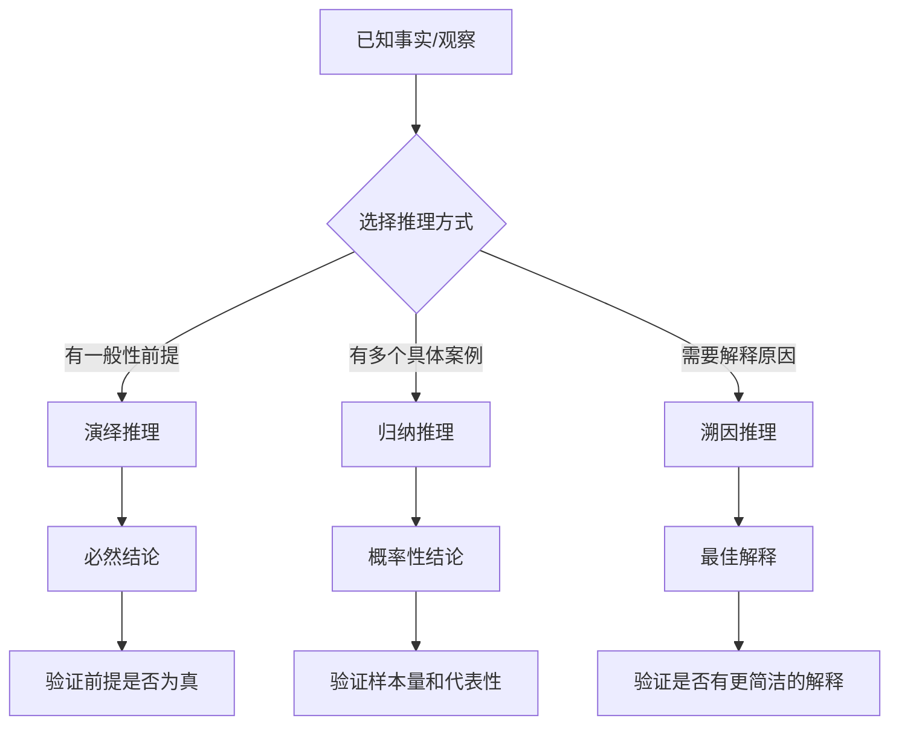
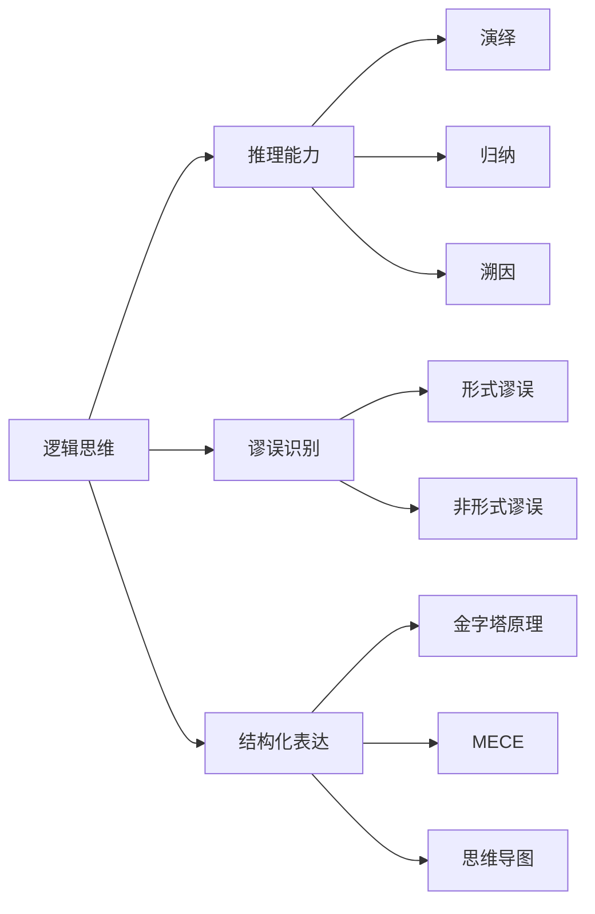

## 五、逻辑思维训练

逻辑思维是所有理性思维的底层操作系统。批判性思维依赖它评估论证的有效性，创新思维依赖它验证创意的可行性，系统思维依赖它理清因果链条。没有逻辑思维，其他思维方式就如同建在沙子上的楼阁——外表华丽，一推就倒。

本章从逻辑推理的三种基本形式出发，系统讲解逻辑谬误的识别与防范，然后提供一套可执行的训练方案，最后将逻辑思维与结构化表达工具（金字塔原理、MECE、思维导图）打通，让你不仅"会想"，还能"想清楚、说明白"。

### 5.1 逻辑推理的三种基本形式

逻辑推理是从已知信息推导出新结论的过程。根据推导方向和确定性程度，分为三种基本形式：演绎推理、归纳推理和溯因推理。理解三者的差异和适用场景，是逻辑思维训练的第一步。

#### 5.1.1 演绎推理：从一般到特殊

演绎推理（Deductive Reasoning）是从一般性前提出发，推导出必然成立的具体结论。如果前提为真且推理形式正确，结论 **必然为真**——这是演绎推理最强大的特征。

**三段论（Syllogism）** 是演绎推理的经典形式：

大前提：所有人类都会死亡
小前提：苏格拉底是人类
结论：苏格拉底会死亡

三段论的有效性取决于两个条件：(1) 前提为真；(2) 推理形式有效。两个条件缺一不可。下面是一个前提为假但形式有效的例子：

大前提：所有鸟都会飞        ← 假（企鹅、鸵鸟不会飞）
小前提：企鹅是鸟            ← 真
结论：企鹅会飞              ← 形式有效，但结论为假

**常见的有效演绎推理形式：**

| 推理形式 | 逻辑结构 | 示例 |
|---------|---------|------|
| **假言推理（Modus Ponens）** | 若A则B；A成立；∴B成立 | 如果下雨地面会湿；下雨了；∴地面湿了 |
| **否定后件（Modus Tollens）** | 若A则B；B不成立；∴A不成立 | 如果下雨地面会湿；地面没湿；∴没下雨 |
| **析取三段论（Disjunctive Syllogism）** | A或B；A不成立；∴B成立 | 要么A方案要么B方案；A方案被否决；∴选B方案 |
| **假言三段论（Hypothetical Syllogism）** | 若A则B；若B则C；∴若A则C | 努力→好成绩→好大学；∴努力→好大学 |
| **构造性二难（Constructive Dilemma）** | 若A则B，若C则D；A或C；∴B或D | 要么涨价要么降本；涨价→流失客户，降本→裁员；∴要么流失客户要么裁员 |

**演绎推理的日常应用场景：**

- **编程调试**：如果这段代码逻辑正确，输入X应该输出Y。输出不是Y，所以代码有bug。这就是典型的否定后件。
- **合同审查**：合同规定"若逾期超过30天则可解除合同"。现在逾期了45天，所以可以解除合同。这是假言推理。
- **医疗诊断**：如果是流感会发烧；不发烧，所以大概率不是流感。否定后件。

**训练要点：** 日常生活中刻意识别自己和他人使用的演绎推理形式，检验前提是否为真、形式是否有效。

#### 5.1.2 归纳推理：从特殊到一般

归纳推理（Inductive Reasoning）是从多个具体观察中总结出一般性规律。与演绎推理不同，归纳推理的结论是 **概率性的**，而非确定性的——再多的正面案例也不能100%证明一个普遍结论。

观察1：铜导电
观察2：铁导电
观察3：铝导电
……
结论：所有金属都导电

归纳推理的问题在于"黑天鹅"：你观察到一万只白天鹅也不能证明"所有天鹅都是白的"，但只要一只黑天鹅就能推翻这个结论。这是归纳推理的本质局限。

**归纳推理的强度取决于三个因素：**

1. **样本数量**：观察的案例越多，结论越可靠。观察了1000只天鹅比观察了10只更有说服力。
2. **样本代表性**：样本是否覆盖了各种情况。如果只在一个国家观察天鹅，结论可能不适用于另一个国家。
3. **反例是否存在**：没有发现反例增强结论的可信度，但不能证明反例不存在。

**归纳推理的三种子类型：**

- **枚举归纳**：通过枚举多个案例得出一般结论。"我认识的程序员都喜欢喝咖啡，所以程序员都喜欢喝咖啡。"样本量和代表性都存疑。
- **类比推理**：因为A和B在某些方面相似，推断A在其他方面也与B相似。"这家公司和那家公司的商业模式相似，那家公司成功了，所以这家公司也会成功。"需要评估相似点与结论的相关性。
- **统计推理**：基于统计数据得出结论。"70%的用户在3秒内会离开加载缓慢的页面。"这是最可靠的归纳形式，但仍需注意统计陷阱（辛普森悖论、幸存者偏差等）。

**归纳推理在日常中的应用：**

- **科学实验**：通过可重复的实验归纳出自然规律
- **市场调研**：通过用户样本推断整体市场趋势
- **个人经验总结**：从多次失败中归纳出"什么方法不管用"

#### 5.1.3 溯因推理：从结果到最佳解释

溯因推理（Abductive Reasoning）是从观察到的结果出发，推导出最可能的解释。它不像演绎推理那样保证结论为真，也不像归纳推理那样追求统计概率，而是寻找 **最合理的解释**。

观察：草地是湿的
可能的解释：
  - 昨晚下雨了         ← 最可能
  - 有人浇了水         ← 可能
  - 露水凝结           ← 某些条件下可能
  - 地下水渗透上来      ← 不太可能
结论：昨晚下雨了（最佳解释）

**溯因推理是日常思维中最常用的推理形式。** 医生诊断疾病、侦探破案、程序员排查bug，本质上都是溯因推理——从症状/线索出发，找到最可能的原因。

**溯因推理的质量取决于：**

1. **竞争假设的数量**：是否考虑了足够多的可能解释？只想到一个解释就下结论，容易犯"锚定偏差"。
2. **奥卡姆剃刀**：在其他条件相同的情况下，选择最简洁的解释。不要引入不必要的假设。
3. **解释力**：好的解释应该能说明已知事实，并能做出可验证的预测。
4. **可证伪性**：如果一个解释无法被任何可能的观察推翻，它就不是一个好的科学解释。

**三种推理形式的对比：**

| 维度 | 演绎推理 | 归纳推理 | 溯因推理 |
|------|---------|---------|---------|
| 推理方向 | 一般→特殊 | 特殊→一般 | 结果→原因 |
| 结论确定性 | 必然（前提真+形式有效时） | 概率性 | 最佳解释 |
| 典型错误 | 形式谬误、前提不成立 | 以偏概全、黑天鹅 | 过早下结论、忽视竞争假设 |
| 日常应用 | 数学证明、编程逻辑 | 经验总结、科学归纳 | 诊断、排查、推理 |
| 可靠性排序 | 最高 | 中等 | 最低（但最实用） |

### 5.2 逻辑谬误识别与防范

逻辑谬误是推理过程中的错误。识别谬误不仅能帮你不被别人忽悠，更能帮你发现自己思维中的漏洞。以下按类别系统梳理最常见的逻辑谬误。

#### 5.2.1 形式谬误：推理结构本身出错

形式谬误的错误在于推理的形式结构，即使前提为真，结论也不一定成立。

**肯定后件谬误（Affirming the Consequent）**

错误形式：若A则B；B成立；∴A成立

"如果下雨，地面会湿。地面湿了，所以一定下雨了。"——可能是洒水车、管道漏水、消防演习。正确的推理是否定后件（地面没湿→没下雨），而不是肯定后件。

**否定前件谬误（Denying the Antecedent）**

错误形式：若A则B；A不成立；∴B不成立

"如果我努力学习，我会通过考试。我没有努力学习，所以我不会通过考试。"——可能题目简单，可能你本来就掌握了知识。A是B的充分条件，不一定是必要条件。

**中项不周延（Undistributed Middle）**

错误形式：A是C；B是C；∴A是B

"猫是动物，狗是动物，所以猫是狗。"——中项"动物"在两个前提中都没有穷尽（没有说"所有动物"），因此不能建立A和B之间的关系。

**四概念谬误（Fallacy of Four Terms）**

一个有效的三段论应该只有三个概念。如果出现四个概念，推理就无效：

所有鱼都是动物
我的宠物是鱼（观赏鱼 ≠ 宠物鱼的品类归属可能有歧义）
∴ 我的宠物是动物

虽然结论碰巧正确，但推理过程有误——"鱼"在两个前提中可能指不同概念。

#### 5.2.2 非形式谬误：内容和语境中的陷阱

非形式谬误的错误不在推理结构，而在论证内容、语境或表达方式。这些谬误更隐蔽，也更常见。

**人身攻击（Ad Hominem）**

不回应论证内容，转而攻击论证者本人。

- "你一个没创过业的人，凭什么谈商业策略？"——论证的有效性与论证者的身份无关。
- "他就是个利益相关方，他说的话不可信。"——可能存在利益冲突，但不能因此否定论证本身。
- 变体：**你也一样（Tu Quoque）**——"你自己都做不到，有什么资格说我？"对方做不做得到与建议是否正确是两码事。

**稻草人谬误（Straw Man）**

歪曲对方的论点，然后攻击被歪曲的版本。

- 甲："我认为应该适度减少加班。"
- 乙："你是说公司应该养闲人？那公司怎么活下去？"
- 甲说的是"适度减少"，乙偷换成"养闲人"。

**滑坡谬误（Slippery Slope）**

没有充分证据就断言一个行为会导致一连串极端后果。

- "如果允许学生上课用手机，他们就会沉迷游戏，然后成绩下滑，然后考不上大学，然后人生就完了。"
- 每一步之间的因果链接都没有充分论证，却被当成必然推导。

**诉诸权威（Appeal to Authority）**

引用不相关的权威来支持论点。

- "这位著名物理学家说这款保健品有效，所以一定有效。"——物理学家不是医学权威。
- 有效的诉诸权威需要：权威在相关领域内、有专业资质、观点代表领域共识。

**诉诸无知（Appeal to Ignorance）**

以"无法证明其不存在"来论证其存在，或反之。

- "没有人能证明外星人不存在，所以外星人存在。"——无法证伪不等于证实。
- "没有证据证明这个添加剂有害，所以它是安全的。"——也可能是研究不充分。

**虚假因果（Post Hoc / False Cause）**

先后发生不等于因果关系。

- "我戴了这条手链之后运气变好了，所以手链带来了好运。"——相关不等于因果。
- 常见变体：**确认偏差下的因果**——你只记住了"戴手链且运气好"的日子，忘记了"戴手链但运气差"的日子。

**合成谬误与分割谬误**

- **合成**："每个零件都很轻，所以整台机器也很轻。"——部分的性质不能直接推广到整体。
- **分割**："这家公司很赚钱，所以每个部门都很赚钱。"——整体的性质不能直接分配给部分。

**虚假二分法（False Dichotomy）**

把复杂问题简化为只有两个选项，非此即彼。

- "你要么支持我们，要么就是我们的敌人。"——可能有中立立场、部分认同等多种状态。
- "不加班就是不上进。"——上进有多种表现形式。

**循环论证（Begging the Question）**

结论被暗中包含在前提中。

- "这本书是畅销书因为它卖得好。"——畅销 = 卖得好，等于什么都没说。
- "他说的是真的因为他不会说谎。"——用"不会说谎"预设了"说的就是真的"。

**诉诸情感（Appeal to Emotion）**

用情感操控代替逻辑论证。

- **诉诸恐惧**："如果你不买这个保险，你家人出事了怎么办？"
- **诉诸同情**："他这么可怜，一定不会撒谎。"
- **诉诸从众**："一百万人都在用，你不试试？"

**红鲱鱼（Red Herring）**

引入无关话题来转移注意力。

- 记者："请问您对公司在环境污染问题上的立场？"
- 发言人："我们公司今年创造了5000个就业岗位。"

**谬误速查表：**

| 谬误名称 | 一句话识别 | 反驳要点 |
|---------|-----------|---------|
| 肯定后件 | "结果对了所以原因也对" | 还有其他原因能导致同样结果吗？ |
| 人身攻击 | "你没资格说" | 论证与人品无关，看论证内容 |
| 稻草人 | 歪曲后攻击 | "我说的不是这个意思" |
| 滑坡 | 极端推演 | 每一步的因果证据呢？ |
| 诉诸权威 | "某专家说的" | 权威在相关领域吗？是共识吗？ |
| 虚假因果 | "先后发生就是因果" | 有控制组吗？排除了第三变量吗？ |
| 虚假二分 | "只有两个选择" | 还有第三种/第四种可能吗？ |
| 循环论证 | 结论藏在前提里 | 前提独立于结论吗？ |
| 诉诸情感 | 用情绪代替证据 | 回到事实和逻辑层面 |
| 红鲱鱼 | 转移话题 | "请回到原来的问题" |

### 5.3 逻辑思维训练方案

知道逻辑原理不等于能运用逻辑思维。以下是一套分层递进的训练方案，从基础的识别练习到高阶的论证构建，每天15-30分钟即可执行。

#### 5.3.1 基础层：识别与分析

**练习一：每日谬误扫描（15分钟）**

选择一篇新闻评论、社交媒体帖子或同事的邮件，逐句分析：

1. 列出文中所有论证（前提→结论）
2. 检验每个前提是否为真
3. 检验推理形式是否有效
4. 标注出现的逻辑谬误
5. 写出正确的推理版本

**练习二：三段论构造与检验（15分钟）**

练习模板：
1. 构造5个有效三段论（覆盖5种推理形式）
2. 构造5个无效三段论，说明错在哪里
3. 从今天的阅读材料中找出2个隐含的三段论

**练习三：命题逻辑基础**

理解基本的逻辑联结词及其真值关系：

| 联结词 | 符号 | 含义 | 示例 |
|-------|------|------|------|
| 合取 | A ∧ B | A且B | "既聪明又勤奋" |
| 析取 | A ∨ B | A或B（或两者） | "学英语或学法语" |
| 否定 | ¬A | 非A | "不努力" |
| 蕴涵 | A → B | 若A则B | "如果下雨就带伞" |
| 等价 | A ↔ B | A当且仅当B | "及格当且仅当分数≥60" |

**关键真值关系：**

- `A → B` 与 `¬B → ¬A`（逆否命题）等价
- `A → B` 与 `B → A`（逆命题）**不等价**
- `A → B` 与 `¬A → ¬B`（否命题）**不等价**

这组关系解释了为什么"肯定后件"和"否定前件"是谬误——它们混淆了原命题与逆命题/否命题的关系。

#### 5.3.2 进阶层：论证与反驳

**练习四：正反论证（20分钟）**

选择一个争议话题（如"远程办公是否优于坐班"），分别撰写正方和反方论证：

论证结构模板：
┌─ 主张：[一句话陈述你的立场]
├─ 论据1：[事实/数据/权威观点]
│  └─ 论据1的支撑证据
├─ 论据2：[另一个角度的证据]
│  └─ 论据2的支撑证据
├─ 论据3：[类比/推理]
│  └─ 论据3的支撑证据
├─ 预判反驳：[对方可能的反对意见]
│  └─ 你的回应
└─ 总结：[重申主张，概括关键论据]

**练习五：反驳训练（20分钟）**

拿到一个论证后，练习用以下六种方法反驳：

1. **质疑前提**：前提的证据充分吗？来源可靠吗？
2. **质疑推理**：前提到结论的推理过程有漏洞吗？
3. **举反例**：是否存在前提为真但结论为假的情况？
4. **类比削弱**：是否存在一个类似的论证推出了明显错误的结论？
5. **滑坡检验**：推理链中每一步的因果关系是否成立？
6. **替换解释**：是否有更合理的替代解释？

**练习六：辩论练习（30分钟，建议双人）**

辩论流程：
1. 选定话题（如"AI会取代大部分白领工作"）
2. 随机分配正方/反方
3. 各准备5分钟（列出3个论据+2个预判反驳）
4. 正方立论3分钟 → 反方立论3分钟
5. 正方反驳2分钟 → 反方反驳2分钟
6. 自由辩论5分钟
7. 各总结1分钟
8. 交换立场，重复以上过程

这个练习的核心价值在于 **强制换位思考**——当你必须为反对的观点辩护时，你会发现自己之前的立场远没有那么牢不可破。

#### 5.3.3 高阶层：逻辑在专业领域的应用

**练习七：代码逻辑审查（程序员适用）**

审查清单：
□ 条件判断是否覆盖所有情况（switch是否有default？）
□ 循环是否有明确的终止条件？
□ 边界值是否处理（空数组、null、0、负数）？
□ 布尔表达式的否定形式是否正确（德摩根律）？
□ 异常处理是否覆盖了所有可能的失败路径？

德摩根律在代码中的应用：
- `!(A && B)` 等价于 `(!A || !B)`
- `!(A || B)` 等价于 `(!A && !B)`

**练习八：商业决策逻辑（职场适用）**

分析一个真实的商业决策，用逻辑框架拆解：

1. 决策的前提假设是什么？（往往隐含未检验）
2. 推理过程是否有效？（有没有常见的因果谬误？）
3. 是否考虑了所有可行方案？（有没有虚假二分？）
4. 风险评估的逻辑是否成立？（有没有滑坡谬误或过度乐观？）
5. 决策标准是否一致？（对不同方案是否用了同一套标准？）

**练习九：学术论文逻辑审查（学生/研究者适用）**

阅读一篇论文的方法论部分，检查：

- 研究假设的逻辑前提是否成立
- 实验设计是否排除了混淆变量
- 统计推断的方法是否恰当
- 结论是否超出了数据支持的范围
- 是否存在选择性报告（只报告显著结果）

### 5.4 结构化思维：逻辑的表达工具

逻辑思维不仅要"想得对"，还要"表达清楚"。以下三种结构化工具是逻辑思维在表达层面的延伸。

#### 5.4.1 金字塔原理

金字塔原理（Pyramid Principle）由麦肯锡顾问芭芭拉·明托提出，核心思想是 **结论先行、自上而下** 的逻辑表达结构。

              ┌─────────┐
              │  核心结论  │
              └────┬────┘
         ┌─────────┼─────────┐
    ┌────┴────┐ ┌──┴──┐ ┌───┴───┐
    │  论点 1  │ │论点 2│ │ 论点 3 │
    └────┬────┘ └──┬──┘ └───┬───┘
    ┌────┼────┐    │       │
   证据 证据 证据  证据    证据

**四大原则：**

1. **结论先行**：先说结论，再说理由。决策者最需要知道的是"所以呢？"而不是"首先……其次……最后……所以"。
2. **以上统下**：上层观点是下层观点的总结概括。读者只看每一层的第一个句子，就能理解你的逻辑主线。
3. **归类分组**：同一层级的内容必须属于同一逻辑类别。不要把"价格"和"交期"混在同一个分组里。
4. **逻辑递进**：同一层级内的内容按照统一的逻辑顺序排列——时间顺序、结构顺序或重要性顺序。

**三种组织逻辑：**

| 逻辑类型 | 适用场景 | 示例 |
|---------|---------|------|
| 时间顺序 | 描述流程/步骤 | 第一步→第二步→第三步 |
| 结构顺序 | 描述组成部分 | 产品部→技术部→市场部 |
| 程度顺序 | 按重要性排列 | 最重要→次要→补充 |

**实际应用示例——给老板的汇报：**

错误示范（铺垫型）：
"我们调研了A方案、B方案、C方案，经过详细对比分析……
 我们考虑了成本、可行性、风险……
 最终我们认为应该选择B方案。"

正确示范（金字塔型）：
"建议选择B方案。原因有三：
 第一，成本最低（比A低30%，比C低15%）；
 第二，可行性最高（现有团队可执行，无需额外招聘）；
 第三，风险可控（最坏情况损失不超过50万）。"

#### 5.4.2 MECE分析法

MECE（Mutually Exclusive, Collectively Exhaustive）——相互独立、完全穷尽——是咨询行业分解问题的黄金标准。

**两个核心要求：**

- **相互独立（ME）**：各子分类之间不重叠。每个问题/因素只归入一个类别。
- **完全穷尽（CE）**：所有子分类加起来覆盖了整体。没有遗漏。

**经典分解框架：**

| 框架 | 分解方式 | 适用场景 |
|------|---------|---------|
| 2×2矩阵 | 两个维度交叉 | 战略分析（波士顿矩阵） |
| 流程分解 | 按时间/步骤 | 流程优化、用户旅程 |
| 因素分解 | 按影响因素 | 根因分析 |
| 公式分解 | 用数学公式拆解 | 量化分析 |
| 类别分解 | 按类型/属性 | 市场细分、问题分类 |

**示例——分析公司利润下降：**

利润 = 收入 - 成本

收入下降？
├── 客户数量减少
│   ├── 新客户获取减少
│   └── 老客户流失增加
└── 客单价下降
    ├── 产品降价
    └── 产品结构变化（低价产品占比上升）

成本上升？
├── 固定成本增加
│   ├── 租金上涨
│   └── 人员扩张
└── 可变成本增加
    ├── 原材料涨价
    └── 物流成本上升

这个分解满足MECE：收入和成本不重叠且穷尽利润的所有来源；客户数量和客单价的乘积等于总收入；固定成本和可变成本不重叠且穷尽所有成本。

**MECE的常见违反情况：**

- **重叠**：把"80后用户"和"年轻用户"放在同一层级——80后和年轻有交集。
- **遗漏**：分析营收只考虑"产品收入"和"服务收入"，忘了"授权收入"和"投资收益"。
- **层级混乱**：把"华东区"和"大客户"放在同一层级——一个是地理维度，一个是客户规模维度。

#### 5.4.3 思维导图

思维导图（Mind Map）是将放射性思维可视化的工具，适合发散性思考和知识整理。

**绘制规则：**

1. **中心主题**放在正中央，用一个关键词或图像表示
2. **主分支**从中心向外延伸，每条分支代表一个主要分类
3. **子分支**从主分支继续延伸，层级不超过4层
4. 每个节点只写 **一个关键词**，不用完整句子
5. 用 **颜色**区分不同分支，增强视觉记忆
6. 适当使用 **图标和符号**标记重点

**思维导图与逻辑结构的关系：**

思维导图擅长展示"有什么"（发散），但不擅长展示"为什么"（因果）和"所以呢"（推论）。因此：

- **探索阶段**用思维导图——尽可能多地发散
- **论证阶段**用金字塔原理——把发散的点组织成有逻辑的论证
- **分解阶段**用MECE——确保分解无遗漏无重叠

### 5.5 逻辑思维的常见陷阱

即使了解了逻辑原理和谬误类型，在实际运用中仍有一些隐蔽的陷阱需要注意。

#### 5.5.1 信念偏差（Belief Bias）

当一个结论符合你的既有信念时，你倾向于接受它的论证，即使论证本身有逻辑缺陷。反过来，当结论与你的信念矛盾时，你倾向于拒绝它，即使论证是严密的。

**应对方法：** 先评估论证的形式有效性，再看结论是否合理。刻意练习接受"论证有效但我不喜欢的结论"。

#### 5.5.2 框架效应（Framing Effect）

同一个事实，用不同的方式表述，会导致截然不同的判断。

- "这个手术的存活率是90%" vs "这个手术的死亡率是10%"——同一个事实，后者让人更不愿意接受手术。
- "这款产品有5%的瑕疵率" vs "这款产品的合格率是95%"——前者让人觉得质量差。

**应对方法：** 遇到数字和概率时，主动进行正反两种表述，看结论是否一致。

#### 5.5.3 确认偏差（Confirmation Bias）

你倾向于寻找、解读和记忆支持你已有观点的信息，忽略或贬低反面信息。这是最普遍也最顽固的认知偏差。

**应对方法：**

- 刻意搜索与自己观点相反的证据
- 对支持自己观点的信息更加挑剔（"这个证据真的能证明我想的吗？"）
- 寻找"能推翻我的观点的最小证据"，然后主动去找

#### 5.5.4 可得性偏差（Availability Bias）

你能轻易想到的例子，你会高估它的概率或重要性。飞机失事的新闻让你觉得飞行很危险，但统计上飞行比驾车安全得多。

**应对方法：** 用数据而非直觉判断概率。问自己："我能想到这个例子，是因为它真的常见，还是因为它更引人注目？"

#### 5.5.5 从"知道"到"做到"的鸿沟

逻辑思维最大的陷阱是：你学了所有这些知识，考试也能答对，但在日常生活中依然凭直觉和情绪做判断。

**原因：** 逻辑思维是"系统2"（慢思考）的能力，而日常决策大多由"系统1"（快思考）驱动。系统1快、省力、自动化，但容易出错；系统2慢、费力、需要刻意启动，但更准确。

**破解方法：**

1. **建立检查清单**：在重要决策前过一遍逻辑检查清单，把系统2的操作"半自动化"
2. **设置触发器**：给自己设定特定场景下的逻辑检查习惯（如"每次听到统计数据时，先问样本量"）
3. **定期复盘**：每周回顾自己的决策，分析哪些是逻辑驱动的，哪些是情绪/直觉驱动的
4. **找逻辑伙伴**：找一个思维风格互补的人，在重大决策时互相挑战对方的推理

### 5.6 逻辑思维训练周计划

以下是一份可直接执行的每周训练计划，每天15-30分钟，循序渐进：

| 星期 | 训练内容 | 时长 | 训练重点 |
|------|---------|------|---------|
| 周一 | 谬误扫描：分析一篇社论或评论 | 15分钟 | 识别谬误、分类标注 |
| 周二 | 三段论练习：构造+检验 | 15分钟 | 演绎推理的形式有效性 |
| 周三 | 假设检验：对一个观点列出正反证据 | 20分钟 | 归纳推理、证据评估 |
| 周四 | 因果分析：分析一个现象的多种原因 | 15分钟 | 溯因推理、排除第三变量 |
| 周五 | 正反论证：就争议话题写双面论证 | 25分钟 | 论证构建、反驳能力 |
| 周六 | 结构化表达：用金字塔原理重组一个汇报 | 20分钟 | 逻辑表达、MECE分解 |
| 周日 | 周度复盘：回顾本周的决策和推理过程 | 30分钟 | 元认知、自我校准 |

**执行建议：**

- 准备一本"逻辑笔记"，记录每天的练习和发现
- 每月统计一次自己最常犯的逻辑谬误类型，针对性强化
- 3个月后尝试挑战更复杂的论证分析（学术论文、法律文书、商业案例）
- 6个月后尝试在实时对话中识别谬误——这是最高难度的训练

逻辑思维不是天赋，而是可训练的技能。关键在于 **刻意练习 + 持续复盘**。每天15分钟，坚持3个月，你会明显感受到自己分析问题和辨别谬误能力的提升。

***
