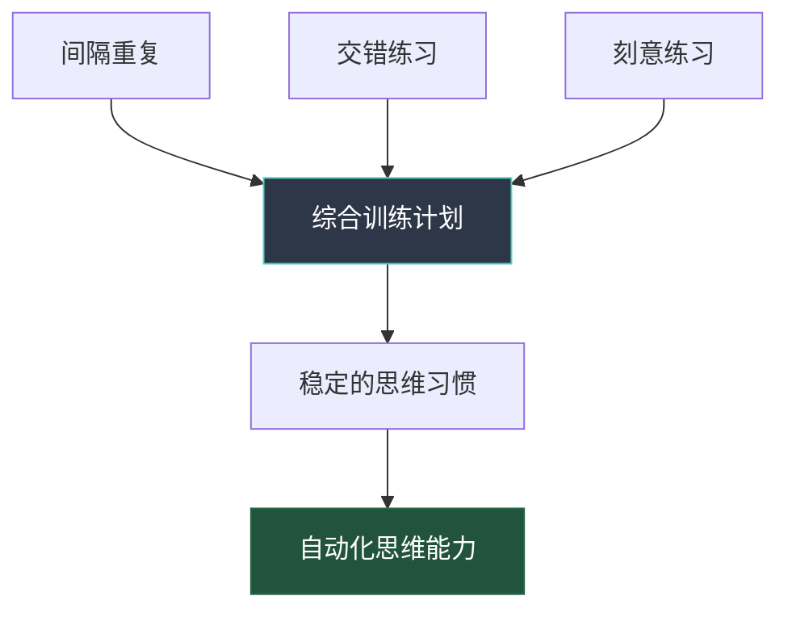

## 六、综合训练计划：从知道到做到的系统化路径

> "我们不是因为变老才停止玩耍，而是因为停止玩耍才变老。" —— 萧伯纳

前面五节分别介绍了思维模型、决策框架、问题解决方法论、创新思维训练和逻辑思维训练。但知识本身不产生价值——只有将知识转化为**可重复的日常实践**，思维能力才会真正提升。本节的核心任务就是：把零散的思维工具整合为一套可执行的综合训练计划。

### 6.1 为什么需要综合训练计划

#### 孤立练习的陷阱

大多数人学习思维工具时犯的最大错误是"学一个、丢一个"。读完一本关于批判性思维的书，就只在那段时间留意逻辑谬误；看完系统思维的内容，就只画因果回路图。这种孤立练习有两个致命问题：

1. **遗忘曲线效应**：艾宾浩斯遗忘曲线告诉我们，学习后24小时内会遗忘约70%的内容。如果不通过间隔重复来巩固，两周后你对这些工具的记忆几乎归零
2. **迁移失败**：在课堂上（或书本中）学到的思维工具，如果不主动在真实场景中反复应用，大脑就不会建立"场景→工具"的自动关联。结果就是：你"知道"这些工具，但在需要的时候根本想不起来用

#### 综合训练的科学基础

一套好的训练计划需要建立在三个认知科学原理之上：

| 原理 | 含义 | 对训练计划的启示 |
|------|------|-----------------|
| **间隔重复** (Spaced Repetition) | 在逐渐增大的时间间隔中重复学习，记忆效果远优于集中突击 | 每个思维工具应该以不同的频率反复出现 |
| **交错练习** (Interleaving) | 混合练习不同类型的技能，比单独练习每种技能效果更好 | 每天的训练应该涉及不同维度的思维能力 |
| **刻意练习** (Deliberate Practice) | 有明确目标、即时反馈、略超出舒适区的练习才能真正提升能力 | 每次训练都要有具体的练习对象和自我评估 |



#### 从刻意到自动化：习惯形成的四个阶段

任何思维能力从"学到"到"用好"，都经历四个阶段：

1. **无意识无能**：不知道自己不会——你甚至没意识到自己的思维有问题
2. **有意识无能**：知道自己不会——学习了思维工具后，你能发现自己以前的错误
3. **有意识有能力**：能做到但需要刻意提醒自己——每次使用工具都需要主动启动
4. **无意识有能力**：自然而然地运用——思维工具成为你的"默认设置"

训练计划的目标就是帮你从第2阶段推进到第4阶段。这个过程通常需要8-16周的持续练习。

### 6.2 每日思维训练（15-30分钟）

每日训练是整套计划的基石。设计原则是：每天聚焦一个维度，一周覆盖所有维度，形成完整的训练循环。

#### 周一：认知偏差检测日（15分钟）

**训练目标**：提升元认知能力，建立"偏差雷达"

**具体步骤**：

1. **回顾**（5分钟）：回顾上周末到今天做出的3个决策（可以是消费决策、时间分配决策、人际交往决策等）
2. **分析**（7分钟）：对每个决策问自己三个问题：
   - 我做出这个决策时，情绪状态如何？（情绪会激活特定的认知偏差）
   - 我是否只考虑了支持自己选择的信息？（确认偏误）
   - 如果换个选项，我是否同样能找到支持它的理由？（事后合理化）
3. **记录**（3分钟）：在思维日志中记录发现的偏差和改进思路

**示例**：周六你花了300元买了一件衣服。分析：你买它是因为真的需要，还是因为"打折不买就亏了"（损失厌恶）？你是否只关注了喜欢的那几个细节，忽略了"其实衣柜里已经有3件类似的"这个事实（确认偏误）？

#### 周二：SCAMPER创新练习日（20分钟）

**训练目标**：锻炼发散思维能力，打破思维定势

**具体步骤**：

1. **选择对象**（2分钟）：选一个日常物品、流程或服务（比如：外卖点餐流程、通勤路线、手机充电方式）
2. **逐项创新**（15分钟）：用SCAMPER的7个维度依次发问：
   - **S**（替代）：有什么可以被替代？用什么替代？
   - **C**（组合）：能和什么组合产生新价值？
   - **A**（调整）：放大、缩小、改变形状会怎样？
   - **M**（修改）：改变颜色、声音、材质会怎样？
   - **P**（挪用）：能用在其他什么场景？
   - **E**（消除）：去掉哪个部分反而更好？
   - **R**（反转）：颠倒顺序、角色互换会怎样？
3. **筛选**（3分钟）：从7个创意中选出最有潜力的1个，想一个具体的落地方案

#### 周三：逻辑谬误识别日（15分钟）

**训练目标**：提升批判性思维，建立对论证质量的敏感度

**具体步骤**：

1. **选择素材**（2分钟）：打开一篇新闻、一条热搜评论、一段广告文案、或者朋友圈的一条观点
2. **识别谬误**（10分钟）：检查是否存在以下常见谬误：
   - **稻草人谬误**：是否歪曲了对方的观点？
   - **诉诸权威**：是否仅因为某人是"专家"就接受其观点？
   - **滑坡谬误**：是否把一个温和的开头推导到极端结论？
   - **虚假二分**：是否把多元选择简化为非此即彼？
   - **以偏概全**：是否用个别案例代表整体？
3. **重构论证**（3分钟）：如果原文论证有谬误，尝试用正确的逻辑重新构建一个更好的论证

#### 周四：概率校准日（15分钟）

**训练目标**：训练概率思维，减少过度自信偏差

**具体步骤**：

1. **提出预测**（5分钟）：对5个未来事件给出概率估计，例如：
   - 下周公司某个项目能按期完成的概率是多少？
   - 三个月内你所在行业会出一个重大新闻的概率是多少？
   - 今年你能读完20本书的概率是多少？
2. **标注置信区间**（3分钟）：对每个估计给出90%置信区间（"我90%确信概率在X%到Y%之间"）
3. **校准检查**（7分钟）：翻看过去几周的概率记录。如果你的90%置信区间真的准，那应该有90%的预测落在区间内。如果实际命中率远低于90%，说明你过度自信——这是最常见的人类认知偏差之一

**进阶技巧**：使用"预检验"（Pre-Mortem）来校准——想象你的预测已经失败了，然后倒推可能的失败原因。研究表明，这种逆向思考能显著提高预测的准确性。

#### 周五：系统思维分析日（20分钟）

**训练目标**：培养全局视角，看到事物之间的隐藏联系

**具体步骤**：

1. **选择系统**（2分钟）：选一个你正在经历的"系统"——你的工作效率系统、家庭关系、公司的审批流程、健身计划等
2. **画因果回路图**（12分钟）：
   - 列出系统中的3-5个关键变量
   - 标注变量之间的正向（+）或负向（-）关系
   - 找出是否存在"增强回路"（越来越好的良性循环或越来越差的恶性循环）和"平衡回路"（自动调节的机制）
   - 识别"延迟效应"——哪些变化不会立即显现
3. **识别杠杆点**（6分钟）：根据因果回路图，找到系统中"用最小的改变产生最大效果"的那个点

**示例**：


杠杆点可能是"睡眠质量"——改善睡眠（比如固定10:30上床）会同时降低疲劳、提升效率、减少加班需求，打破恶性循环。

#### 周六：第一性原理质疑日（20分钟）

**训练目标**：打破常规假设，回归事物本质

**具体步骤**：

1. **选择"常识"**（2分钟）：选一个你从未质疑过的"常识"或行业惯例。例如：
   - "读书一定要从头读到尾"
   - "会议一定要在会议室开"
   - "简历一定要写一页纸"
   - "买房比租房划算"
2. **逐层拆解**（12分钟）：
   - 这个"常识"的底层假设是什么？
   - 这些假设在什么条件下成立？
   - 这些条件现在还成立吗？
   - 如果从零开始设计，会得到什么结论？
3. **重建方案**（6分钟）：基于你的分析，设计一个打破常规的新方案

**案例深度解析**：质疑"读书一定要从头读到尾"

| 层级 | 内容 |
|------|------|
| 表层常识 | 书应该从第一页读到最后一页 |
| 底层假设 | 信息排列顺序 = 最优学习顺序 |
| 假设检验 | 大多数非虚构类书籍的信息是模块化的，不是线性依赖的 |
| 第一性原理 | 读书的核心目的是获取对你有用的知识，不是"读完" |
| 新方案 | 先读目录找到最相关的3章→读完后问自己还想不想继续→不想就换下一本 |

#### 周日：周度综合反思日（30分钟）

**训练目标**：回顾与整合，建立元认知闭环

**具体步骤**：

1. **回顾本周训练**（10分钟）：翻看本周的思维日志，回答：
   - 哪天的训练最有收获？为什么？
   - 哪天的训练最敷衍？是什么阻碍了你？
   - 你在真实生活中有主动使用学到的思维工具吗？
2. **决策审计**（10分钟）：回顾本周做出的最重要的3个决策，用以下模板分析：

| 决策 | 使用了什么思维工具 | 有什么偏差可能影响了判断 | 如果重来会怎样做 |
|------|------------------|----------------------|----------------|
| 例：买了一台新电脑 | 沉没成本分析 | 锚定效应（被原价锚定） | 应该先比较3个品牌 |

3. **下周计划**（10分钟）：确定下周想要重点提升的1个思维维度，并设定一个具体的"实战任务"——下周必须用一次某个特定的思维工具来解决一个真实问题

### 6.3 每周深度练习（1-2小时）

每日训练是"基本功"，每周深度练习是"实战演练"。从以下5种练习中，每周选择1种进行：

#### 练习一：决策审计（60分钟）

这是最有价值的周练习，因为它直接训练你的元认知能力。

**完整流程**：

1. **收集**（15分钟）：列出本周所有"有意义"的决策——不需要记录"午饭吃什么"，但"是否接受那个offer""是否购买某个课程""如何回复一封重要的邮件"都值得记录
2. **分类**（10分钟）：将决策按重要程度分为A（重大）、B（中等）、C（轻微）三类
3. **深度分析**（25分钟）：对每个A类决策，用以下框架逐一分析：
   - **决策时的状态**：你是在精力充沛还是疲惫时做的决策？是在冷静还是情绪激动时？
   - **信息充分性**：你掌握了足够的信息吗？有没有信息你没去获取就做了决定？
   - **备选方案**：你认真考虑了多少个备选方案？还是只在"做"和"不做"之间选择？
   - **偏差检查**：用前面学到的30+种认知偏差逐一扫描
   - **结果评估**：事后看来，这个决策的效果如何？如果不及预期，问题出在哪里？
4. **提炼教训**（10分钟）：将分析结果转化为1-3条可操作的"决策原则"，写入你的个人决策手册

#### 练习二：创新工作坊（90分钟）

对一个真实问题进行完整的创新流程：

1. **问题定义**（15分钟）：用"5个为什么"法深挖问题本质
2. **发散阶段**（25分钟）：用SCAMPER + 随机联想 + 类比迁移，产生至少20个创意（追求数量，不评判）
3. **收敛阶段**（20分钟）：用"影响力×可行性"矩阵筛选，保留3-5个最佳创意
4. **原型设计**（20分钟）：为最佳创意设计一个最小可行方案（MVP）
5. **反向验证**（10分钟）：用"预检验"方法——假设这个方案失败了，找出所有可能的失败原因

#### 练习三：结构化辩论（60分钟）

选择一个争议话题，独自进行正反方论证：

**话题示例**：
- "远程办公是否比坐班更高效？"
- "人工智能会在10年内取代50%的工作岗位吗？"
- "30岁转行学编程是否太晚？"

**流程**：

1. **正方立论**（15分钟）：列出所有支持论据，每个论据标注证据强度（强/中/弱）
2. **反方立论**（15分钟）：列出所有反对论据，同样标注证据强度
3. **交叉质询**（15分钟）：用正方视角攻击反方论据，再用反方视角攻击正方论据。这个步骤最容易发现自己的思维盲区
4. **综合判断**（15分钟）：基于证据强度而非个人偏好，得出一个经过深思熟虑的结论。注意：好的结论往往不是非此即彼，而是"在什么条件下A成立，在什么条件下B成立"

#### 练习四：跨领域迁移（60分钟）

**目标**：打破领域壁垒，培养跨界思维能力

**流程**：

1. **选择源领域**（5分钟）：从你熟悉的领域选一个你精通的概念或方法（比如：编程中的"解耦"概念、烹饪中的"火候控制"、军事中的"后勤补给"）
2. **提取抽象结构**（15分钟）：把具体概念抽象化。例如："解耦"的本质是"降低组件之间的依赖度，使系统更灵活、更易维护"
3. **映射到目标领域**（25分钟）：将抽象结构应用到一个完全不同的领域。例如："解耦"应用到人际关系→减少对单一社交圈的依赖，建立多元社交网络；应用到财务管理→资产配置多元化，降低相关性
4. **检验有效性**（15分钟）：这个类比在目标领域成立吗？有哪些地方不成立？不成立的地方恰恰揭示了两个领域之间的本质差异

#### 练习五：多模型分析（90分钟）

对一个复杂问题同时使用3-5个不同维度的思维模型进行分析：

**问题示例**："是否应该创业？"

| 思维模型 | 分析视角 | 关键洞察 |
|---------|---------|---------|
| 期望值计算 | 数学/概率 | 计算成功概率×成功收益 vs 失败概率×失败损失 |
| 博弈论 | 经济学 | 分析竞争对手的可能反应和市场均衡 |
| 反脆弱 | 哲学 | 创业经历本身是否让你变得更强？即使失败 |
| 系统思维 | 复杂系统 | 创业会如何影响你的家庭系统、社交系统、健康系统？ |
| 沉没成本 | 心理学 | 你犹豫是因为真的不适合创业，还是因为害怕放弃当前的稳定？ |

多模型分析的价值不在于得到一个"正确答案"，而在于看到单一视角看不到的维度。

### 6.4 每月综合评估（每月最后一天，60分钟）

月度评估是整套训练计划的"质量保证"环节。没有评估的练习是盲目的。

#### 五维评估清单

**维度一：工具使用广度**

回答以下问题，每使用过一次计1分：

| 思维工具/模型 | 本月是否使用过 | 使用场景 |
|-------------|--------------|---------|
| 认知偏差检测（至少识别过一种偏差） | □ | |
| 决策框架（用过结构化决策流程） | □ | |
| 系统思维（画过因果图或识别过反馈循环） | □ | |
| 第一性原理（质疑过一个"常识"） | □ | |
| 概率思维（给出过概率估计并校准） | □ | |
| 创新方法（用过SCAMPER或其他创新工具） | □ | |
| 逻辑分析（识别过一个逻辑谬误） | □ | |
| 逆向思维（从反面思考过一个问题） | □ | |

**维度二：偏差觉察深度**

- 本月是否记录了至少5次认知偏差的自我发现？
- 本月是否有一次"及时刹车"的经历——在做出决策的瞬间意识到偏差并改变了选择？
- 本月是否有一次帮助他人识别认知偏差的经历？（教是最好的学）

**维度三：决策质量改善**

回顾本月的A类决策（重大决策），用1-5分评估：

| 评估项 | 评分（1-5） | 备注 |
|-------|-----------|------|
| 信息收集的充分性 | | |
| 备选方案的多样性 | | |
| 情绪管理的质量 | | |
| 决策过程的结构化程度 | | |
| 事后评估的诚实度 | | |

**维度四：问题解决能力**

- 本月是否遇到过一个"看起来无解"的问题，最终用系统性方法解决了？
- 本月是否有一次"换个角度就豁然开朗"的经历？
- 本月是否主动拆解过一个复杂问题？

**维度五：创新产出**

- 本月是否有过至少3个"不走寻常路"的想法？
- 本月是否有过一次"跨界迁移"的成功经验——用A领域的知识解决了B领域的问题？
- 本月是否有人对你说过"这个想法很有创意"？

#### 月度复盘模板

```markdown
## [月份] 思维训练月度复盘

### 本月训练完成情况
- 每日训练完成率：__/30 天
- 每周深度练习完成率：__/4 次
- 思维日志记录天数：__/30 天

### 本月最大收获
（用具体事例说明，不要说空话）

### 本月最大的思维盲区
（诚实面对自己的弱点）

### 偏差热力图
本月出现最多的认知偏差类型：
1. ______（出现 __ 次）
2. ______（出现 __ 次）
3. ______（出现 __ 次）

### 下月训练重点
1. 重点提升维度：______
2. 计划使用的2-3个新工具：______
3. 一个具体的实战目标：______
```

### 6.5 季度与年度进阶系统

#### 季度复盘（每3个月）

季度复盘的目标是评估训练计划本身是否需要调整：

| 评估维度 | 问题 | 调整方向 |
|---------|------|---------|
| 趣味性 | 你是否觉得训练变得枯燥？ | 调整练习方式，增加变化 |
| 挑战性 | 训练是否变得太轻松？ | 提升难度，增加新工具 |
| 相关性 | 训练内容是否和你的实际需求匹配？ | 更换训练素材和场景 |
| 效果 | 你的思维能力是否在可衡量地提升？ | 调整训练重点 |

#### 年度思维能力审计

每年年底进行一次全面的思维能力审计。方法是：

1. **重做入门自测**：用章节开头的18题自测重新评估，对比年初的基准分
2. **回顾年度重大决策**：用决策审计框架分析过去一年中最重要的5个决策
3. **收集外部反馈**：问3个你信任的人："你觉得我今年在分析问题、做决策方面有什么变化？"
4. **制定下年计划**：基于审计结果，确定下一年的训练重点

### 6.6 训练计划的个性化定制

上面给出的是通用模板，但每个人的起点、目标和可用时间不同。以下是定制指南：

#### 按水平分级

| 水平 | 特征 | 每日训练时间 | 重点 |
|------|------|------------|------|
| **入门级** | 之前没有系统学过思维训练 | 10-15分钟 | 认知偏差觉察 + 基本逻辑 |
| **中级** | 了解基本概念但缺乏实践 | 15-25分钟 | 决策框架 + 系统思维 |
| **高级** | 有一定实践经验 | 20-30分钟 | 多模型分析 + 跨领域迁移 |

#### 按职业场景定制

**程序员**：侧重系统思维（架构设计的本质就是系统思维）、第一性原理（技术选型）、二八法则（性能优化的20%关键路径）

**产品经理**：侧重决策框架（优先级排序）、认知偏差（理解用户行为偏差）、创新思维（产品创新）

**管理者**：侧重博弈论（团队激励）、系统思维（组织设计）、概率思维（风险评估）

**创业者**：侧重逆向思维（避免失败比追求成功更重要）、第一性原理（商业模式创新）、反脆弱（不确定性管理）

#### 按可用时间定制

**只有5分钟/天**：只做当日核心练习，省略记录步骤。用手机备忘录代替思维日志。

**有15分钟/天**：按标准模板执行每日训练。

**有30分钟/天**：标准训练 + 当天额外做一个小练习（比如多分析一个案例）。

**有1小时/天**：每日训练 + 每周深度练习拆分到每天进行。

### 6.7 训练计划中的常见陷阱

#### 陷阱一：完美主义瘫痪

**表现**：觉得自己还没准备好就开始训练，或者因为某天漏做就放弃整个计划。

**纠正**：采用"两天规则"——可以偶尔漏一天，但绝不连续漏两天。完成比完美重要100倍。哪怕只做了5分钟的简化版本，也比"等到有空再做完整版"好一万倍。

#### 陷阱二：只输入不输出

**表现**：大量阅读思维模型和理论知识，但从不在真实场景中使用。感觉自己"学了很多"，但在面对实际问题时依然凭直觉行事。

**纠正**：每次学习一个新工具后，必须在24小时内找一个真实场景使用它。学习和应用的比例应该至少是1:1。

#### 陷阱三：工具崇拜

**表现**：沉迷于收集更多的思维模型和框架，但不深入掌握任何一个。思维工具箱越来越满，但真正能熟练使用的寥寥无几。

**纠正**：宁可把10个工具用到极致，也不要浅尝辄止地知道100个工具。深度大于广度。

#### 陷阱四：只在"训练时间"使用

**表现**：每天认真做15分钟训练，但训练之外的时间依然按旧习惯思考。训练和日常生活是"两张皮"。

**纠正**：设置"触发器"——在特定场景中自动启动特定的思维工具。例如：每次开会前花30秒想"今天的讨论中可能出现什么认知偏差"；每次做消费决策前默念"这是需要还是想要"。

#### 陷阱五：缺乏反馈机制

**表现**：自己练自己的，从不检验训练效果。不知道自己有没有进步，也不知道哪里需要改进。

**纠正**：严格坚持周日的反思和月末的评估。如果可能，找一个"思维训练伙伴"互相检查和反馈。

### 6.8 90天启动计划

如果你不知道从哪里开始，这个90天计划帮你逐步建立完整的训练习惯：


**第1-30天（习惯启动期）**：
- 只做周一（偏差检测）、周三（逻辑谬误）、周日（反思）三天的训练
- 每天10分钟即可，重点是建立"每天都练"的节奏感
- 准备一个思维日志本或电子文档，格式越简单越好

**第31-60天（扩展期）**：
- 每天的训练全部覆盖
- 时间增加到15-20分钟
- 开始加入每周一次的深度练习（从"决策审计"开始）
- 开始在日常生活中主动寻找使用思维工具的机会

**第61-90天（深化期）**：
- 完整执行所有训练
- 时间增加到20-30分钟
- 加入月度评估
- 开始尝试跨领域迁移和多模型分析

90天后，训练已经成为你的日常习惯。你不需要再"提醒自己去做"，就像刷牙一样自然。

### 6.9 进阶：从训练到教学

当你的思维训练持续6个月以上，一个强大的进阶方法是：**开始教别人**。

费曼学习法的核心洞察是：如果你不能把一个概念简单地解释给别人听，说明你还没有真正理解它。教别人的过程迫使你：

1. 梳理知识结构，填补自己的理解空白
2. 用具体例子把抽象概念具象化
3. 回答别人的问题时发现自己从未想过的角度
4. 在教学互动中获得即时反馈

**如何开始教**：

- 在团队分享会上做一次10分钟的"认知偏差速成"分享
- 写一篇博客或社交媒体帖子，用一个真实案例解释一个思维模型
- 在遇到朋友的困惑时，用思维工具帮他分析问题（而不是直接给建议）
- 创建一个小型学习小组，每周讨论一个思维主题

---

> **本节核心要点**：
> 1. 综合训练计划的理论基础是间隔重复、交错练习和刻意练习三大认知科学原理
> 2. 每日训练覆盖七个维度（偏差检测、创新练习、逻辑谬误、概率校准、系统思维、第一性原理、周度反思），形成完整的训练循环
> 3. 每周深度练习（决策审计、创新工作坊、结构化辩论、跨领域迁移、多模型分析）将基本功转化为实战能力
> 4. 月度评估通过五维清单（工具广度、偏差觉察、决策质量、问题解决、创新产出）确保训练效果
> 5. 个性化定制要根据水平、职业和可用时间调整训练方案
> 6. 避免完美主义、只输入不输出、工具崇拜等五个常见陷阱
> 7. 90天启动计划帮你从零开始逐步建立完整的训练习惯
> 8. 进阶的关键是从"学"到"教"，教学相长是最高效的学习方式
