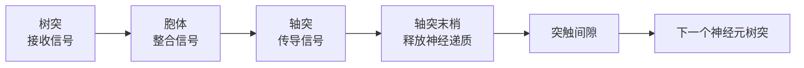
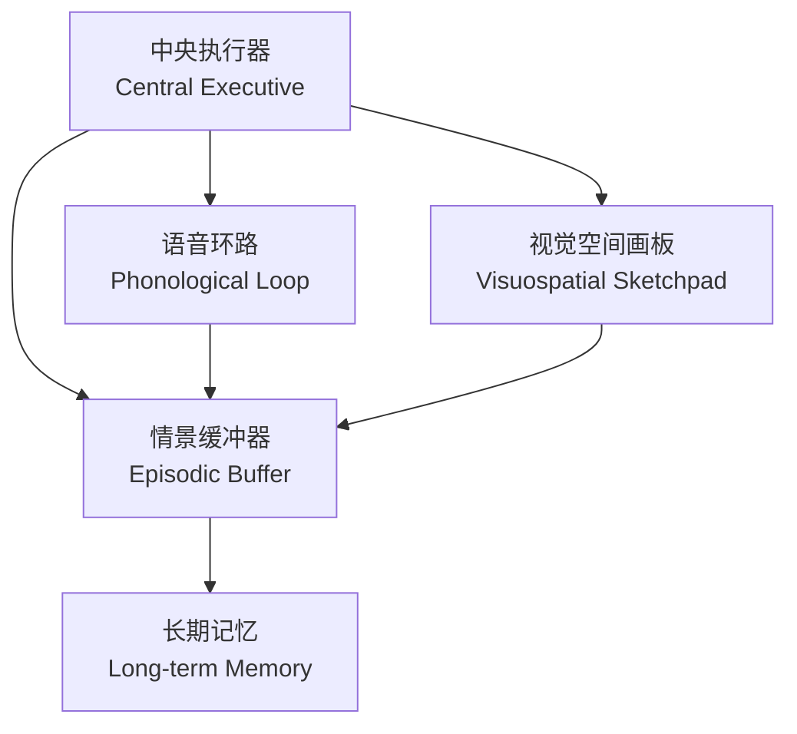
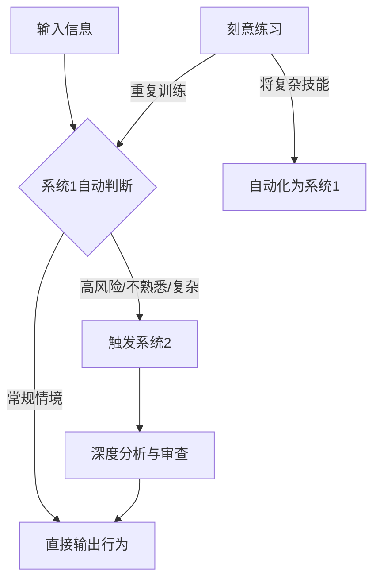
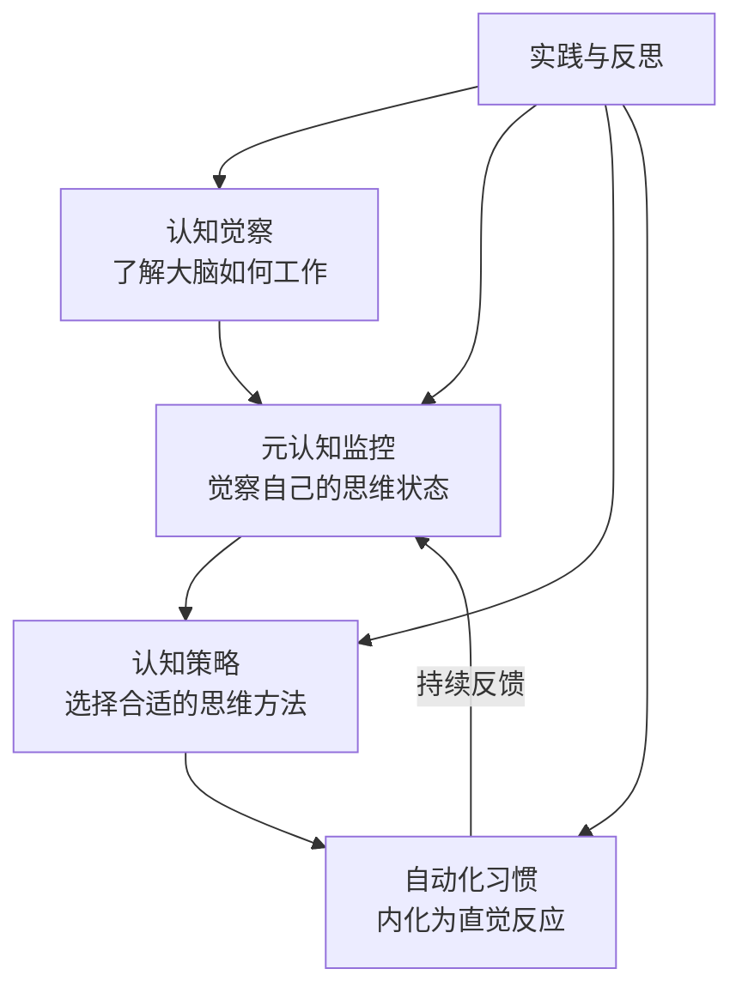

## 一、认知科学基础：理解大脑如何思考

> "如果你知道大脑是如何工作的，你就能更好地使用它。" —— 丹尼尔·卡尼曼

认知科学是一门跨学科领域，融合了心理学、神经科学、语言学、哲学、人工智能和人类学的研究成果，旨在理解人类心智的本质和运作机制。本章将为你建立完整的认知科学基础框架，帮助你理解大脑如何思考、为什么会产生错误判断，以及如何系统性地提升思维质量。

### 1.1 大脑的神经基础：思维的物质载体

在讨论思维的"软件"之前，我们需要先理解思维的"硬件"。大脑是已知宇宙中最复杂的结构——约860亿个神经元，每个神经元与数千个其他神经元形成突触连接，总计约100万亿个突触。理解这些基础机制，是理解所有高级思维能力的前提。

#### 神经元与信号传递

神经元（neuron）是大脑的基本信息处理单元。一个典型的神经元由三部分组成：

- **树突（dendrites）**：接收来自其他神经元的信号，如同天线
- **胞体（soma）**：整合接收到的信号，决定是否"激活"
- **轴突（axon）**：将信号传递给下一个神经元，如同电缆

信号传递的过程是电化学混合的：

1. 当输入信号的总和超过阈值（约-55mV），神经元"放电"
2. 电信号沿轴突传导，速度可达120米/秒
3. 到达轴突末梢时，释放神经递质（如多巴胺、血清素、乙酰胆碱）
4. 神经递质穿过突触间隙，与下一个神经元的受体结合
5. 接收神经元产生兴奋性或抑制性信号

关键点：**神经元一起激活的连接会增强（赫布定律："一起放电的细胞连在一起"）**。这被称为突触可塑性，是学习和记忆的物理基础。

#### 大脑的关键区域与功能

大脑不同区域负责不同的认知功能。了解这些区域有助于理解为什么某些思维能力可以独立训练：

| 脑区 | 位置 | 核心功能 | 与思维的关系 |
|------|------|----------|-------------|
| **前额叶皮层（PFC）** | 额头后方 | 执行功能、工作记忆、决策、计划 | "大脑的CEO"，系统2的主要载体 |
| **海马体（Hippocampus）** | 颞叶内侧 | 短期记忆转化为长期记忆、空间导航 | 学习和记忆的关键枢纽 |
| **杏仁核（Amygdala）** | 颞叶深处 | 情绪处理、恐惧反应、情绪记忆 | 情绪对决策影响的源头 |
| **前扣带回（ACC）** | 大脑中线 | 冲突监控、错误检测、注意力调节 | 发现"哪里不对了"的报警器 |
| **基底神经节** | 大脑深部 | 习惯形成、程序性记忆、奖赏处理 | 自动化技能和习惯的存储地 |
| **顶叶** | 头顶区域 | 空间推理、注意力导向、数量处理 | 数学思维和空间想象的基础 |
| **颞叶** | 两侧太阳穴 | 语言理解、面孔识别、听觉处理 | 语言和概念理解的核心 |

前额叶皮层（PFC）值得特别关注。它是人类大脑中最晚进化成熟的区域（直到25岁左右才完全发育），也是系统2思维的神经基础。PFC负责：

- **工作记忆**：暂时保存和操作信息
- **抑制控制**：压制自动反应，做出深思熟虑的选择
- **认知灵活性**：在不同思维模式间切换
- **计划与推理**：预测未来、制定策略

PFC的一个重要特点是它非常"昂贵"——虽然大脑只占体重的2%，却消耗20%的能量，而PFC在深度思考时能量消耗更大。这就是为什么深度思考会让人感到疲倦，也是为什么系统2倾向于"懒惰"的生理原因。

#### 神经可塑性：大脑可以改变

神经可塑性（neuroplasticity）是指大脑根据经验改变其结构和功能的能力。这是思维提升的神经科学基础——**你的大脑不是固定不变的，它会根据你如何使用它而改变**。

神经可塑性有两种主要形式：

1. **结构可塑性**：神经元之间连接的数量和强度发生变化。伦敦出租车司机的研究发现，经过大量导航训练后，他们的海马体（负责空间记忆的区域）比普通人显著增大。

2. **功能可塑性**：大脑区域可以"接管"其他区域的功能。例如，先天性失明者的视觉皮层会被重新分配用于处理触觉和听觉信息。

可塑性的关键原则：

- **用进废退（Use it or lose it）**：不使用的神经连接会被修剪
- **同步放电加强连接（Fire together, wire together）**：反复同时激活的神经元连接更强
- **需要时间和重复**：改变不是一夜之间发生的，需要持续练习
- **注意力是催化剂**：有意识的专注练习比机械重复更有效

> **实践意义**：思维能力不是天赋决定的固定值。通过正确的训练方法和足够的时间，你可以显著改变大脑的结构和功能。这不是鸡汤，而是经过大量神经科学研究证实的事实。

### 1.2 工作记忆：思维的瓶颈

工作记忆（working memory）是大脑的"临时工作台"——它决定了你在任何时刻能同时处理多少信息。理解工作记忆的限制，是理解为什么我们会犯错、为什么会感到"脑子不够用"的关键。

#### Baddeley工作记忆模型

阿兰·巴德利（Alan Baddeley）提出的工作记忆模型是目前最被广泛接受的理论框架。该模型包含四个组件：

| 组件 | 功能 | 容量限制 | 日常表现 |
|------|------|----------|----------|
| **中央执行器** | 注意力控制、任务切换、抑制无关信息 | 同时管理的任务有限 | 同时做两件事时效率下降 |
| **语音环路** | 暂存和复述语音信息 | 7±2个组块（Miller定律） | 记住一个7位电话号码 |
| **视觉空间画板** | 暂存视觉和空间信息 | 约3-4个对象 | 心算时想象数字位置 |
| **情景缓冲器** | 整合来自不同来源的信息 | 约4个组块 | 将听到的故事与看到的画面关联 |

#### Miller定律与组块化

1956年，乔治·米勒（George Miller）发表了经典论文《神奇的数字7±2》，提出人类工作记忆的容量约为7个组块（chunk）。后来的研究表明，更准确的数字可能是4±1个组块。

**组块化（chunking）** 是突破工作记忆容量限制的关键策略：将多个信息单元合并为一个有意义的组块。

例子：
- 记住 `1-9-4-9-1-0-0-1`（8个数字）很困难
- 但记成 `1949-10-01`（3个组块：年份-月份-日期）就很容易
- 专家棋手看到棋盘能记住整个局面，不是因为他们的工作记忆更大，而是因为他们将棋子位置编码为有意义的模式（组块）

**组块化的核心策略**：

1. **意义编码**：将无意义的信息与已有知识关联
2. **层次组织**：将信息组织成树状结构
3. **模式识别**：寻找重复出现的规律
4. **练习自动化**：通过练习将低层次操作自动化，释放工作记忆空间

#### 认知负荷理论

约翰·斯威勒（John Sweller）提出的认知负荷理论（Cognitive Load Theory）直接基于工作记忆的限制。该理论区分了三种认知负荷：

| 类型 | 定义 | 来源 | 是否可控 |
|------|------|------|----------|
| **内在负荷** | 学习材料本身的复杂度 | 元素之间的交互程度 | 通过拆分内容降低 |
| **外在负荷** | 不良的教学/呈现方式造成的额外负荷 | 信息呈现方式不当 | 通过优化设计消除 |
| **相关负荷** | 用于构建心智模型的有效认知负荷 | 主动学习和深度加工 | 通过引导思考增加 |

**核心原则**：认知负荷管理的目标是**最小化外在负荷，管理内在负荷，最大化相关负荷**。

实践方法：
- **拆分复杂任务**：将多元素任务分解为单元素任务，逐步组合
- **消除冗余信息**：同时呈现相同内容的文字和图表会增加外在负荷
- **使用示例效应**：先展示完整的问题解决示例，再让学习者独立练习
- **渐进式复杂度**：从简单版本开始，逐步增加难度

### 1.3 注意力：思维的聚光灯

注意力是认知系统的"门户"——没有注意力，信息无法进入工作记忆，也就无法被深度加工。理解注意力的机制和限制，是提升思维效率的前提。

#### 注意力的类型

1. **选择性注意力**：从众多信息中选择相关信息
   - 鸡尾酒会效应：在嘈杂派对中仍能听到自己的名字
   - 选择性注意实验：被试专注于一件事时，完全忽略视野中出现的大猩猩（"看不见的大猩猩"实验）

2. **持续性注意力**：长时间保持注意力集中
   - 注意力持续时间因年龄和任务而异
   - 成人的深度专注通常只能维持20-50分钟
   - 这是番茄工作法（25分钟工作+5分钟休息）的科学依据

3. **分配性注意力**：同时处理多个任务
   - 真正的"多任务"在认知层面几乎不可能——大脑只是在快速切换
   - 每次切换都有"切换成本"（switch cost），通常需要15-25分钟恢复深度专注
   - 简单任务（如走路说话）可以并行，因为一个已经自动化
   - 复杂任务（如写报告+听会议）无法真正并行，效率会大幅下降

#### 注意力的执行控制

前额叶皮层通过以下机制控制注意力：

- **目标激活**：保持当前任务目标在工作记忆中活跃
- **干扰抑制**：压制与当前任务无关的刺激
- **冲突解决**：当多个竞争性反应出现时，选择正确的反应
- **错误监控**：发现行为偏离目标时发出警报

这些机制消耗大量认知资源，这就是为什么：
- 睡眠不足时注意力严重下降
- 长时间决策后会出现"决策疲劳"
- 压力和焦虑会严重影响注意力

#### 提升注意力的科学方法

| 方法 | 原理 | 实践建议 |
|------|------|----------|
| **消除干扰源** | 减少注意力竞争 | 工作时关闭通知、使用专注模式 |
| **环境设计** | 外部线索触发注意力状态 | 固定工作地点、使用"启动仪式" |
| **正念冥想** | 训练注意力的元认知监控 | 每天10-20分钟，专注呼吸 |
| **适度运动** | 增加大脑血流、促进BDNF分泌 | 有氧运动30分钟可改善后续数小时的注意力 |
| **充足睡眠** | 前额叶功能恢复 | 7-9小时，睡眠不足时注意力下降40% |
| **分段工作** | 利用注意力自然节律 | 25-50分钟深度专注+5-10分钟休息 |

### 1.4 双系统思维理论

诺贝尔经济学奖得主丹尼尔·卡尼曼在《思考，快与慢》中提出了影响深远的"双系统"理论，将人类思维分为两个系统。这不是大脑真实的解剖分区，而是一个有用的认知模型。

#### 系统1：快思维

系统1是自动化的、无意识的、快速的思维系统。它的特点包括：

- **自动化运作**：不需要有意识的努力，自动运行
- **速度快**：几乎瞬间完成判断
- **并行处理**：可以同时处理多个信息
- **依赖直觉**：基于经验和模式匹配
- **情绪驱动**：与情绪系统紧密相连
- **不易控制**：很难有意识地关闭

系统1的典型运作场景：

| 场景 | 系统1的反应 | 背后机制 |
|------|------------|----------|
| 看到2+2 | 立即知道等于4 | 通过练习自动化的数学事实 |
| 看到愤怒的面孔 | 立即感知到威胁 | 杏仁核的快速情绪评估 |
| 开车在空旷的路上 | 自动驾驶，无需集中注意力 | 基底神经节存储的自动化程序 |
| 闻到食物的香味 | 自动产生食欲 | 进化形成的趋利反应 |
| 听到巨响 | 立即感到惊吓 | 保护性反射 |
| 读出大号字体的字 | 比小号字体更快 | 知觉流畅性影响判断 |

系统1在大多数日常场景中表现良好——它帮助我们快速做出无数个小决策，让我们不必对每件事都进行深思熟虑。但系统1也是认知偏差的主要来源，因为它依赖启发式（heuristics）而非严密的逻辑推理。

#### 系统2：慢思维

系统2是有意识的、需要努力的、缓慢的思维系统。它的特点包括：

- **需要注意力**：必须集中精力才能运作
- **速度慢**：需要时间进行推理和计算
- **序列处理**：一次只能处理一个任务
- **逻辑驱动**：遵循规则和逻辑
- **费力**：消耗大量认知资源
- **可控制**：可以有意识地启动和停止

系统2的典型运作场景：

| 场景 | 系统2的参与 | 为什么需要系统2 |
|------|------------|----------------|
| 计算17×24 | 需要笔算或心算 | 超出系统1的自动化数学能力 |
| 在陌生城市找路 | 需要看地图、规划路线 | 没有已存储的路线模式 |
| 填写复杂的表格 | 需要集中注意力 | 多个字段需要仔细核对 |
| 比较两台洗衣机的性价比 | 需要收集信息、权衡利弊 | 多维度比较超出直觉能力 |
| 在嘈杂环境中专注工作 | 需要意志力来维持注意力 | 需要主动抑制干扰 |
| 审查合同条款 | 逐字逐句阅读分析 | 法律语言不能依赖直觉理解 |

#### 系统1与系统2的协作

两个系统并非对立，而是协作关系。理想的状态是：

1. **系统1快速判断**：对大多数日常事务，信任系统1的直觉
2. **系统2监控质量**：当系统1的判断可能出错时（高风险、不熟悉、复杂情境），系统2介入审查
3. **系统2训练系统1**：通过刻意练习，将复杂的技能转化为系统1的自动反应

**关键洞察**：思维提升的本质是训练系统2更好地监控和校准系统1，同时将高质量的思维模式"下放"到系统1，使之成为自动化的习惯。

#### 系统2的"懒惰"问题

卡尼曼指出，系统2有一个根本性的问题：它很懒惰。默认情况下，系统2会接受系统1的建议，而不进行独立审查。这解释了为什么认知偏差如此普遍——不是因为我们缺乏理性能力，而是因为我们没有启动它。

系统2懒惰的原因有三：

1. **能量消耗**：深度思考消耗大量葡萄糖，大脑倾向于节省能量
2. **认知忙碌**：当工作记忆被占满时，系统2无力进行额外审查
3. **过度自信**：系统1通常给出一个"足够好"的答案，系统2没有动力去质疑

应对策略：

- **识别高风险场景**：在做重大决策、处理不熟悉问题、面对复杂信息时，有意识地启动系统2
- **设置触发器**：建立"决策检查清单"，在特定场景下自动触发深度思考
- **减少认知负荷**：在需要系统2工作时，减少干扰和无关信息
- **保持精力充沛**：系统2需要能量，确保在精力充沛时做重要决策
- **预设决策规则**：提前定义"当X发生时，我做Y"，减少实时判断的负担

### 1.5 心智模型与图式理论

#### 什么是心智模型

心智模型（mental model）是你对世界如何运作的内在表征。它不是世界本身，而是你对世界的简化理解。你的每一个决策、判断和行为，都基于你的心智模型。

心智模型的特点：

- **简化性**：它省略了现实世界的大量细节，只保留你认为重要的部分
- **个人化**：每个人的心智模型都不同，取决于经验、教育和文化
- **可更新**：新的经验可以修正和扩展心智模型
- **层次性**：心智模型可以嵌套——你可以有关于"系统"的心智模型，也有关于"经济系统"的更具体模型

查理·芒格（Charlie Munger）的"多元思维模型"（Latticework of Mental Models）理念正是基于这一认知科学原理：

> "你必须有多个模型——因为如果你只有一两个，你就会扭曲现实来适应你的模型。"

#### 图式理论

图式（schema）是一种认知框架，帮助我们组织和解释信息。图式就像大脑中的"文件夹"——当新信息进入时，大脑会自动将其归入已有的图式。

图式的运作方式：

1. **自上而下处理**：已有的图式影响我们如何感知新信息
   - 例：如果你对"教授"的图式是"戴眼镜、严肃"，你可能不会注意到一个穿着休闲的教授
2. **选择性注意**：我们倾向于注意与已有图式一致的信息
3. **填补空白**：当信息不完整时，图式会自动"填补"缺失的部分
   - 例：看到"他在餐厅点了__"，你会自动填入"菜"而不是"螺丝刀"

图式的双刃剑效应：

| 积极作用 | 消极作用 |
|----------|----------|
| 快速处理大量信息 | 忽略不符合图式的信息 |
| 填补信息空白 | 导致刻板印象和偏见 |
| 提供行为脚本 | 抵制新的学习和改变 |
| 降低认知负荷 | 在新情境中产生错误预期 |

#### 如何优化心智模型

1. **积累多元模型**：从不同学科（物理学、生物学、心理学、经济学、数学）学习基本原理
2. **主动测试模型**：用"如果我的模型是对的，应该观察到什么？"来检验
3. **寻找反例**：主动寻找不符合你模型的证据
4. **模型更新**：当证据与模型矛盾时，修正模型而非忽略证据
5. **简化但不过度简化**：好的模型在简洁和准确之间取得平衡

### 1.6 元认知：对思维的思维

元认知（metacognition）是人类最独特的认知能力之一——它是指"对自己的思维过程的认知和调控"。简单说，就是你能意识到自己在想什么、怎么想的，以及想得对不对。

#### 元认知的两个维度

1. **元认知知识**：关于认知的知识
   - **个人变量**：了解自己的认知优势和劣势（"我擅长视觉学习但不擅长听觉学习"）
   - **任务变量**：了解不同任务的认知要求（"这个任务需要深度分析而不是快速判断"）
   - **策略变量**：了解不同认知策略的适用条件（"这种情况用SWOT分析比直觉判断更可靠"）

2. **元认知调控**：对认知过程的管理和控制
   - **计划**：在思考之前决定策略和分配资源
   - **监控**：在思考过程中检查进度和质量
   - **评估**：在思考之后评价结果和改进方向

#### 元认知的实践价值

研究表明，元认知能力是区分专家和新手的关键因素之一。专家不仅知道更多，更重要的是他们知道自己知道什么、不知道什么，以及在什么情况下使用什么策略。

元认知能力强的人具有以下特征：

- 能够准确评估自己对某个知识领域的掌握程度
- 在遇到困难时会调整策略而不是死磕
- 能够识别自己的认知偏差并做出修正
- 知道什么时候需要寻求外部信息或帮助

#### 提升元认知的具体方法

1. **思维日志**：记录重要决策的思考过程，定期回顾
   - 记录：问题是什么？我考虑了哪些因素？我做了什么假设？结果如何？
   - 回顾：我的判断准确吗？哪些因素我忽略了？下次可以怎么改进？

2. **自我提问法**：在思考过程中定期问自己
   - "我现在正在做什么？"
   - "我的方法有效吗？"
   - "我是否遗漏了重要信息？"
   - "有没有更好的方法？"
   - "我的判断是否受到了情绪影响？"

3. **校准练习**：用预测-结果对比来校准自己的判断能力
   - 对不确定的事情给出概率估计
   - 记录实际结果
   - 定期统计准确率

4. **反思框架**：
   - **OODA循环**：观察（Observe）→ 判断（Orient）→ 决策（Decide）→ 行动（Act）
   - **事前验尸**（Pre-mortem）：在执行之前假设"这个计划已经失败了"，然后分析可能的失败原因

### 1.7 认知偏差全景

认知偏差是系统1使用启发式规则产生的系统性错误。了解这些偏差不是为了消除它们（这既不可能也不必要），而是为了在关键场景中识别和纠正它们。

#### 信息处理偏差

**锚定效应（Anchoring Effect）**

定义：先接收到的信息（锚点）会不成比例地影响后续判断。

经典实验：让两组人估计联合国中非洲国家的比例。先给一组人看到数字10，另一组看到65。结果第一组平均估计25%，第二组平均估计45%——尽管这两个数字完全是随机的。

神经机制：锚定效应激活了大脑的"确认"回路——一旦锚点被接受，大脑会自动搜索与之一致的信息，而不是进行独立评估。

日常应用：
- 商品定价：先展示高价商品，再展示目标商品，后者显得更便宜
- 薪资谈判：先出价的一方设定了谈判的锚点
- 评估任务：如果先告诉你"这个项目很难"，你会花更多时间
- 房产中介：先带你看几套差的房子（低锚点），再带你看目标房子，让它显得更好

应对方法：
- 在形成判断前，意识到锚点的存在
- 主动从多个角度设定锚点
- 使用客观数据而非第一印象作为判断基础
- 从相反方向重新评估

**可得性偏差（Availability Bias）**

定义：容易回忆起来的事件被判断为更常见或更可能。

经典实验：让人们估计"以R开头的单词多还是第三个字母是R的单词多"。大多数人认为前者更多，因为以R开头的单词更容易回忆。实际上第三个字母是R的单词更多。

影响因素——哪些事件更容易被回忆：
- **最近发生的事件**（近因效应）
- **情绪强烈的事件**（恐惧、愤怒、惊喜）
- **生动具体的事件**（画面感强的）
- **反复接触的事件**（媒体反复报道的）

日常表现：
- 飞机失事的新闻让人高估飞行风险（实际飞行比驾车安全约100倍）
- 最近发生的事件对判断的影响大于统计数据
- 个人经历比统计数据更有说服力
- 一次失败的创业经历可能让人过度恐惧创业风险

应对方法：
- 在判断概率时，主动查找统计数据而非依赖记忆
- 质问自己："我的判断是否受到了最近看到的信息的影响？"
- 使用基础概率（base rate）作为判断起点
- 注意信息来源的频率和选择性

**代表性偏差（Representativeness Bias）**

定义：根据事物与某个类别的相似度来判断其属于该类别的概率，忽视基础概率。

经典案例——琳达问题：
> 琳达31岁，单身，性格直爽，聪明。她主修哲学，学生时代关心社会歧视和正义问题，参加过反核示威游行。
>
> 以下哪个更可能？
> A. 琳达是银行出纳
> B. 琳达是银行出纳且是女权主义者

大多数人选择B，但B的概率不可能大于A（B是A的子集）。人们被"代表性"误导——B的描述更符合琳达的形象。

这个问题揭示了代表性偏差的两个核心错误：
1. **忽视基础概率**：不考虑银行出纳的总人数远多于"银行出纳且女权主义者"
2. **合取谬误**：错误认为联合事件的概率大于单一事件

应对方法：
- 始终考虑基础概率
- 记住：联合事件的概率永远不会大于单一事件
- 用数学而非直觉来计算概率
- 当描述非常"符合"某个类别时，特别警惕代表性偏差

**确认偏误（Confirmation Bias）**

定义：倾向于寻找、解释和记住支持自己已有信念的信息，忽视矛盾信息。

这是最普遍也最有害的认知偏差之一。它的表现形式包括：

1. **选择性搜索**：只搜索支持自己观点的信息
2. **选择性解读**：将模糊信息解读为支持自己的观点
3. **选择性记忆**：更容易记住支持自己观点的信息
4. **选择性接受**：对支持自己观点的证据降低审查标准

日常表现：
- 在社交媒体上只关注与自己观点一致的账号
- 对支持自己观点的文章不加批判地接受
- 对反对自己观点的证据寻找漏洞
- "研究"只是为了证明自己已经相信的结论
- 科学家也被证明会无意识地偏向支持自己假说的数据

应对方法：
- 主动寻找反对自己观点的证据（"红队思维"）
- 对自己的观点设定"如果我发现______，我就改变想法"的条件
- 阅读与自己观点不同的媒体和作者
- 与持不同观点的人交流，认真倾听他们的理由
- 使用"钢铁人"策略：先尽量将对方的论点理解到最强版本，再反驳

#### 决策偏差

**沉没成本谬误（Sunk Cost Fallacy）**

定义：因为已经投入了时间、金钱或精力，而继续一个本应放弃的项目。

经典表现：
- "我已经在这部烂电影上花了50块钱，不能浪费，必须看完"
- "我已经在这段感情中投入了三年，不能轻易放弃"
- "这个项目已经花了这么多钱，不能半途而废"

神经机制：研究表明，沉没成本效应激活了大脑的眶额叶皮层（OFC），这个区域与价值评估相关。当考虑"已经投入的"资源时，大脑会错误地将"过去的投入"纳入"未来的价值"计算。

理性分析：沉没成本已经发生，无法收回，不应该影响未来的决策。正确的做法是只考虑未来的成本和收益。

应对方法：
- 问自己："如果我没有之前的投入，我现在还会选择继续吗？"
- 将决策基于未来预期而非过去投入
- 设定"止损点"——在开始前就确定什么条件下放弃
- 引入外部视角：让没有沉没成本负担的人提供建议

**损失厌恶（Loss Aversion）**

定义：等量的损失带来的痛苦是等量收益带来的快乐的约2倍。

卡尼曼和特沃斯基的前景理论（Prospect Theory）揭示了这一现象。损失厌恶是人类决策中最强大的力量之一。

这意味着：
- 人们为了避免损失愿意冒更大的风险
- 人们更关注可能失去什么而非可能得到什么
- 拥有一样东西后，对它的估价会提高（禀赋效应）

日常表现：
- 不愿卖掉亏损的股票（实现损失太痛苦）
- 对现有工作不满但不敢跳槽（害怕失去已有的一切）
- 不愿尝试新事物（害怕失败的损失）
- 商家的"免费试用"利用禀赋效应——试用后不愿退还

应对方法：
- 将"不行动"也视为一种选择，评估其成本和风险
- 用"如果我不做这件事，一年后会后悔吗？"来检验决策
- 关注机会成本——不行动也有代价
- 将关注点从"可能失去什么"转向"可能得到什么"

**过度自信偏差（Overconfidence Bias）**

定义：对自己判断的准确性和能力过度高估。

过度自信有三种形式：
1. **过度估计**：高估自己的能力和表现
2. **过度精确**：对自己的估计过于确定（置信区间太窄）
3. **优于平均效应**：认为自己比大多数人更好

研究表明：
- 当人们说"90%确定"时，实际正确率通常只有70-80%
- 专业人士（如医生、律师）的过度自信程度通常不低于普通人
- 过度自信在低反馈领域（如长期预测）更为严重
- 在自己不熟悉的领域，过度自信反而可能更严重（达克效应）

应对方法：
- 记录自己的预测和实际结果，定期校准
- 使用概率语言而非绝对语言
- 主动考虑自己可能出错的原因
- 参考外部基准和统计数据
- 问自己："如果我错了，最可能的原因是什么？"

**现状偏差（Status Quo Bias）**

定义：偏好维持现状，即使改变可能带来更好的结果。

这与损失厌恶密切相关——改变意味着放弃现状（感知为损失），而现状的收益被低估。

应对方法：
- 将"维持现状"也视为一个需要辩护的选择
- 评估不改变的长期成本
- 设定定期审查的时间点，强制重新评估选择
- 使用"归零思考"：假设你今天从零开始，还会做同样的选择吗？

#### 社会偏差

**从众效应（Bandwagon Effect）**

定义：因为大多数人相信或做某事，自己也倾向于相信或做同样的事。

这是人类作为社会动物的深层本能。在进化环境中，与群体保持一致通常更安全。但在现代社会，群体行为往往是错误的（如金融泡沫）。

阿希从众实验（1951年）：当房间里其他人都给出明显错误的答案时，约75%的被试至少有一次跟随了错误的多数意见。

应对方法：
- 在形成判断前独立思考，再参考他人意见
- 质问自己："如果只有我一个人知道这个信息，我会怎么判断？"
- 关注"为什么"而非"多少人"
- 注意区分"信息性从众"（别人知道我不知道的信息）和"规范性从众"（只是为了合群）

**权威偏差（Authority Bias）**

定义：因为信息来源是权威人物，就降低对其信息的审查标准。

米尔格拉姆的服从实验（1961年）清楚地展示了权威的影响力：65%的参与者在权威人物的指示下，对他人施加了最大电压的电击。

应对方法：
- 区分权威的领域——一个领域的权威不等于所有领域的权威
- 关注证据本身而非来源的身份
- 寻找独立的证据支持
- 记住：权威也可能有利益冲突和认知偏差

**光环效应（Halo Effect）**

定义：对一个人某一方面的正面评价扩展到对其所有方面的正面评价。

例如：外表有魅力的人被认为更聪明、更善良、更有能力。一家产品质量好的公司，人们也会认为它的客服、财务都好。

应对方法：
- 分别评估不同的特质和能力
- 使用结构化的评估标准
- 意识到第一印象可能产生的偏差
- 对"全面好评"保持警惕——很少有人或事物在所有方面都优秀

#### 记忆偏差

**后见之明偏差（Hindsight Bias）**

定义：在知道结果后，认为自己"早就知道了"。

"我早就说过会这样"——这句话几乎每个人都在说过或听过。后见之明偏差让我们高估了自己预测未来的能力，阻碍了从经验中学习。

应对方法：
- 在事件发生前记录自己的预测
- 定期回顾预测的准确率
- 区分"知道结果后觉得合理"和"事先能预测到"

**峰终定律（Peak-End Rule）**

定义：对一段经历的记忆主要由其高峰（最强烈时刻）和结尾决定，而非整体体验。

经典实验：结肠镜检查实验。一组患者检查时间短但结束时疼痛；另一组检查时间长但结束前有几分钟的低度不适。结果后者对整个过程的记忆更积极。

应对方法：
- 在设计体验时，注重高峰时刻和结尾的质量
- 在评估经历时，意识到记忆可能被峰终效应扭曲
- 在做决策时，区分"体验中的快乐"和"记忆中的快乐"

**错误记忆（False Memory）**

定义：大脑会"创造"从未发生过的记忆，或修改已有记忆的细节。

伊丽莎白·洛夫特斯的经典实验：通过暗示性提问，成功让被试"回忆起"童年时在商场走失的经历——而这个经历从未发生过。

应对方法：
- 对特别清晰或特别情绪化的记忆保持谨慎
- 意识到每次回忆都可能是一次"重写"
- 重要的事实记录不要依赖记忆，要留下书面记录

### 1.8 启发式：大脑的思维捷径

启发式（heuristic）是大脑用来简化复杂判断的心理捷径。它们在大多数情况下有效，但也会导致系统性偏差。理解启发式的运作机制，能帮助你更准确地判断何时可以依赖直觉、何时需要深度思考。

#### 代表性启发式

根据事物与某个原型的相似度来判断概率。例如：看到一个戴眼镜、安静、爱读书的人，更容易认为他是图书管理员而非农民——即使农民的总人数远多于图书管理员。

代表性启发式的核心问题是忽视基础概率（base rate）。在日常生活中，这意味着：
- 看到一篇"像学术论文"的文章就认为它是可靠的
- 听到一个"像专家"的人说话就认为他的观点正确
- 看到一个项目的"表面特征"像成功案例就认为它会成功

应对：始终追问"基础概率是多少？"

#### 可得性启发式

根据信息容易获得的程度来判断频率或概率。例如：因为飞机失事的报道更容易记住，人们高估了飞行的风险。

可得性启发式在以下情况下最容易出错：
- **媒体放大**：被大量报道的事件（如恐怖袭击）被认为比统计上更常见的事件（如车祸）更可能发生
- **个人经验偏差**：自己经历过的事情被认为比未经历的更可能发生
- **生动性效应**：画面感强的事件比抽象的统计数据更有影响力

应对：用数据而非记忆来估计概率

#### 锚定与调整启发式

从一个初始值（锚点）出发进行调整。问题是调整通常不充分，导致最终判断偏向锚点。

这个启发式在以下场景特别强大：
- **价格谈判**：第一个报价设定了整个谈判的框架
- **估计数量**：即使是随机数字也会影响后续估计
- **法律判决**：原告律师要求的赔偿金额影响最终判决金额

应对：意识到锚点的存在，主动从多个起点重新评估

#### 情感启发式

根据对某事物的情感反应来做判断。如果某事物让你感觉好，你会低估它的风险、高估它的收益。

情感启发式解释了为什么：
- 人们会投资"感觉对"的项目而忽略风险评估
- 对某人有好感时会忽视他们的缺点
- 恐惧情绪会让人过度规避风险
- 愤怒情绪会让人低估风险

应对：将情感反应与理性分析分开——先记录你的直觉感受，再用数据和逻辑验证

#### 识别启发式（Recognition Heuristic）

当面对两个选项而你只认识其中一个时，你会倾向于选择你认识的那个。

例子：如果问"哪个城市人口更多，圣迭戈还是圣安东尼奥？"，大多数德国人（他们知道圣迭戈但不知道圣安东尼奥）会正确选择圣迭戈——即使他们对这两个城市几乎一无所知。

这个启发式在信息不足时有时有效，但在以下情况下会失效：
- 知名度与实际质量不相关（如品牌效应）
- 存在选择性曝光（如媒体偏好）

#### 满意化策略（Satisficing）

赫伯特·西蒙（Herbert Simon）提出的"满意化"概念：面对复杂决策，人们不会（也不能）找到最优解，而是找到一个"足够好"的解就停止搜索。

这不是懒惰，而是对有限理性的合理适应。问题在于：
- 什么时候"足够好"确实足够好？
- 什么时候你应该继续搜索更好的选项？

实践指南：
- 对低风险、可逆的决策：使用满意化策略，快速决策
- 对高风险、不可逆的决策：投入更多时间和精力搜索
- 设定"搜索预算"——在开始决策前确定花多少时间/精力

#### 认知偏差的实用价值

值得注意的是，认知偏差并非全是"错误"。它们是进化过程中形成的适应性机制，在大多数日常场景中帮助我们快速做出足够好的判断。问题在于：

1. **当环境与进化环境不同时**：现代世界的信息密度、决策复杂度远超进化环境
2. **当风险很高时**：低风险决策中偏差的代价很小，高风险决策中代价可能很大
3. **当系统可以被利用时**：广告、政治宣传、社交工程都在利用认知偏差

**正确的态度不是"消灭所有偏差"，而是：**
- 在低风险日常决策中，信任系统1的直觉
- 在高风险重要决策中，有意识地启动系统2并检查常见偏差
- 了解自己的"盲点"——你最容易犯哪些偏差
- 建立"防护机制"——决策清单、外部咨询、记录与回顾

### 1.9 知觉流畅性与认知轻松

#### 什么是知觉流畅性

知觉流畅性（processing fluency）是指信息被大脑处理的容易程度。当信息处理流畅时，大脑会将其解读为"这个信息是好的、真的、熟悉的"。

这是一个深刻的认知现象：**你对信息的"感觉"不仅取决于信息本身，还取决于你的大脑处理它有多轻松**。

知觉流畅性的影响：

| 高流畅性（处理轻松） | 低流畅性（处理费力） |
|---------------------|---------------------|
| 感觉更真实 | 感觉不太可靠 |
| 感觉更熟悉 | 感觉更新颖 |
| 感觉更安全 | 感觉更危险 |
| 感觉更愉悦 | 感觉不太愉快 |
| 做出更乐观的判断 | 做出更保守的判断 |

日常应用：
- **字体效应**：同一句话用易读字体呈现时，人们认为它更真实；用难读字体呈现时，人们会更仔细地审视内容
- **名字效应**：名字容易发音的公司股票在上市初期表现更好
- **重复曝光效应**：反复看到的品牌或人会感觉更可信（纯粹因为"熟悉"）
- **韵语效应**："能治百病的药"比"能治愈各种疾病的药"感觉更可信

实践意义：
- 在学习时，如果内容很难理解，不要因为"感觉不对"就放弃——低流畅性不代表内容有问题
- 在评估信息时，不要因为"读起来很顺"就降低审查标准
- 在说服他人时，使用简洁清晰的表达会增加说服力

### 1.10 从认知科学到思维提升的实践框架

理解了上述认知科学基础后，我们可以建立一个系统性的思维提升框架：

#### 第一层：认知觉察（知道）

- 了解大脑的基本运作机制
- 认识常见的认知偏差
- 理解工作记忆的限制
- 知道注意力的特性

#### 第二层：元认知监控（监控）

- 在思考过程中觉察自己的思维状态
- 识别可能的认知偏差
- 评估自己的认知负荷
- 判断何时需要切换策略

#### 第三层：认知策略（选择）

- 根据任务特点选择合适的思维策略
- 管理认知负荷（拆分任务、消除干扰）
- 使用外部工具弥补认知限制（笔记、清单、流程图）
- 在直觉和分析之间做出合理选择

#### 第四层：自动化习惯（内化）

- 通过练习将有效的思维模式变成习惯
- 将常用的检查清单变成自动反应
- 在实践中持续校准和优化

### 1.11 常见误区与纠正

**误区一：认知偏差可以完全消除**

纠正：认知偏差是大脑的默认运作方式，无法完全消除。目标不是消除偏差，而是在关键场景中识别和修正它们。试图在所有决策中都"理性"是不现实的，也会消耗过多认知资源。

**误区二：系统2总是比系统1更好**

纠正：在很多日常场景中，系统1的直觉判断既快速又准确。一位经验丰富的急诊医生的直觉诊断可能比费力的系统2分析更快更准。关键是在合适的场景使用合适的系统。

**误区三：了解认知偏差就能避免它们**

纠正：知道偏差的存在是第一步，但不足以自动避免。研究表明，即使是认知心理学专家也无法完全避免认知偏差。你需要建立具体的防护机制（检查清单、外部视角、记录与回顾）。

**误区四：大脑像电脑一样工作**

纠正：大脑不是电脑。它是一个生物系统，受情绪、疲劳、饥饿、压力的影响。它会犯"非理性"的错误，但也会产生电脑无法做到的创造性洞察。理解大脑的生物特性（如需要休息、需要营养、受情绪影响）是有效使用大脑的前提。

**误区五：多任务处理是高效的工作方式**

纠正：真正的多任务处理在认知层面几乎不可能。当你"同时做两件事"时，大脑只是在快速切换，每次切换都有成本。研究显示，频繁切换任务可以降低40%的工作效率。深度专注比忙碌更有价值。

**误区六：直觉是不可靠的**

纠正：直觉的可靠性取决于领域。在有规律、有即时反馈的领域（如棋类、消防），专家直觉通常非常可靠。在没有规律或反馈延迟的领域（如长期预测、股票投资），直觉可能不可靠。关键是要了解你的直觉在什么领域是经过训练的。

### 1.12 本章小结

认知科学为我们提供了理解人类思维的基础框架：

| 概念 | 核心要点 | 实践意义 |
|------|----------|----------|
| 神经基础 | 大脑可塑性，用进废退 | 思维能力可以通过训练提升 |
| 工作记忆 | 容量有限（4±1组块） | 管理认知负荷是关键 |
| 注意力 | 是认知的门户，不可真正多任务 | 深度专注比忙碌更有价值 |
| 双系统 | 系统1快速但有偏差，系统2准确但懒惰 | 在合适场景启动合适的系统 |
| 心智模型 | 是对现实的简化表征 | 积累多元模型，主动更新 |
| 元认知 | 对思维的思维 | 是区分专家和新手的关键 |
| 认知偏差 | 系统性的判断错误 | 在关键场景中识别和修正 |
| 启发式 | 大脑的思维捷径 | 了解适用条件和失效场景 |
| 知觉流畅性 | 处理容易度影响判断 | 不要把"感觉轻松"等同于"正确" |

**下一步**：了解了大脑如何思考之后，下一节将进入具体的心智模型方法论——如何建立、使用和优化你的思维工具箱。

---
