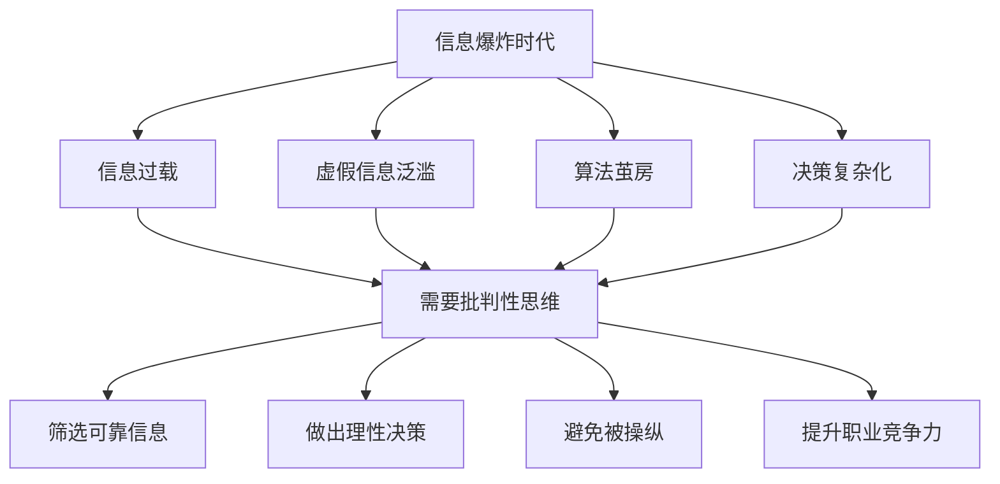
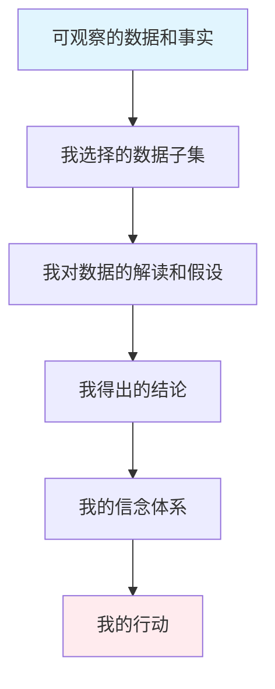
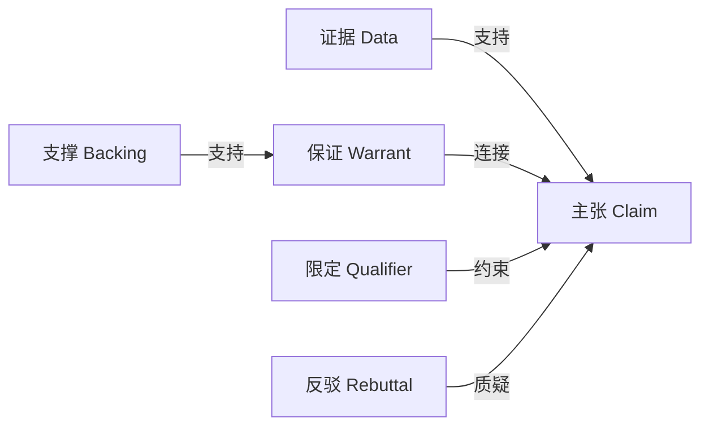
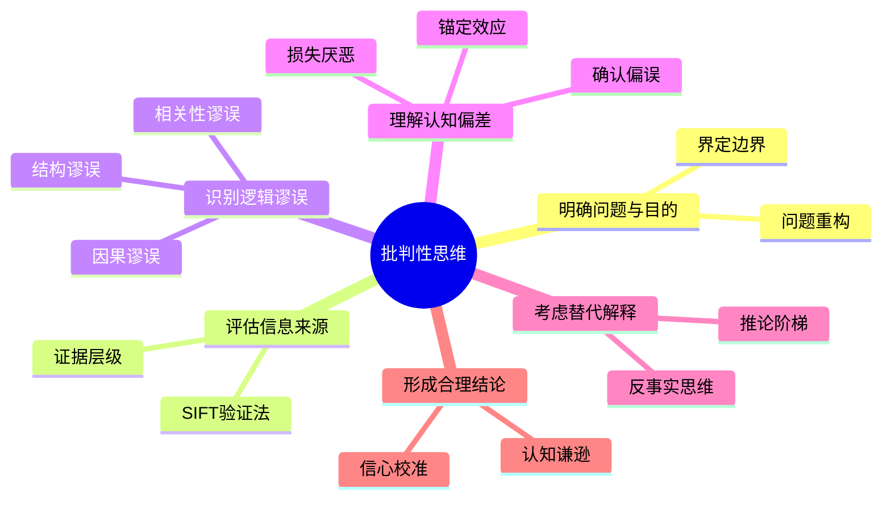

## 二、批判性思维：理性判断的基石

### 2.1 什么是批判性思维

#### 2.1.1 定义与本质

批判性思维（Critical Thinking）是一种有目的的、自我调节的判断过程。它包括对证据、概念、方法和标准的分析、评估和推理。简而言之，批判性思维就是"对思考的思考"——用理性的标准来审视我们的思维过程和结论。

这个定义包含三个关键维度：

| 维度 | 含义 | 实际表现 |
|------|------|---------|
| 有目的性 | 思考不是随机的，而是指向特定目标 | 解决问题、做出决策、评估主张 |
| 自我调节 | 能够监控和修正自己的思维过程 | 发现自己的偏见并主动纠正 |
| 基于标准 | 按照逻辑和证据的客观标准评估 | 区分事实与观点、强论证与弱论证 |

批判性思维并非"批评一切"或"怀疑一切"。它的核心是**合理的怀疑**——在证据不足时保持开放，在证据充分时果断判断。正如哲学家伯特兰·罗素所说："问题不在于你的想法是否疯狂，而在于它是否经得起检验。"

#### 2.1.2 历史源流与理论基础

批判性思维的思想根源可以追溯到古希腊：

- **苏格拉底（公元前470-399年）**：通过持续追问揭示思维中的矛盾和假设，开创了"苏格拉底问答法"
- **柏拉图与亚里士多德**：建立了形式逻辑体系，为理性推理提供了工具
- **笛卡尔（1596-1650）**：提出"系统怀疑法"，主张对一切知识进行根本性审查
- **约翰·杜威（1859-1952）**：将批判性思维引入现代教育，提出"反省性思维"概念
- **罗伯特·恩尼斯（1962）**：首次在教育领域正式定义批判性思维，提出评估框架

现代批判性思维研究形成了两大主要流派：

**① 逻辑分析流派（Informal Logic）**
代表人物：恩尼斯、希区柯克。强调识别论证结构、发现逻辑谬误、评估证据质量。这一流派把批判性思维看作一种分析技能，可以通过练习逻辑题和论证分析来培养。

**② 认知心理学流派**
代表人物：卡尼曼、特沃斯基。强调理解人类认知偏差（如确认偏误、锚定效应），通过了解大脑的"系统性错误"来提升判断质量。这一流派更关注思维的底层机制。

**③ 苏格拉底探究流派**
代表人物：保罗、埃尔德。强调通过持续的深层提问来揭示思维的深层假设。这一流派更像是一种思维态度和习惯。

这三种流派并不矛盾，而是互补的。真正强大的批判性思维能力需要同时掌握：逻辑分析工具、认知偏差意识、以及持续追问的习惯。

#### 2.1.3 为什么批判性思维比以往更重要

在信息爆炸的时代，批判性思维的重要性前所未有。具体来看：

**信息环境的恶化**

- 全球每天产生约2.5万亿字节的数据，但人类大脑每天只能处理约174份报纸的信息量
- 社交媒体算法制造的"信息茧房"让人只看到符合已有观点的内容
- 深度伪造（Deepfake）技术让虚假信息越来越难以辨别
- 2023年MIT研究发现，虚假新闻在社交媒体上的传播速度比真实新闻快6倍

**决策复杂性的增加**

- 现代人每天要做约35000个有意识的决策
- 投资、职业、健康等关键决策的信息量远超过去
- AI生成内容的普及让信息真伪判断更加困难

**职业竞争力的要求**

世界经济论坛《2025年未来就业报告》将批判性思维列为最重要的十大职场技能之一。在AI能够处理越来越多常规任务的今天，人类的核心价值恰恰在于：提出正确的问题、评估复杂信息、做出需要判断的决策。

### 2.2 批判性思维的核心要素

#### 2.2.1 要素一：明确问题与目的

批判性思维的第一步是清晰地界定你要思考的问题。模糊的问题导致模糊的答案。你需要问自己：

- 我真正想解决的问题是什么？
- 这个问题的边界在哪里？
- 谁是利益相关者？
- 成功的标准是什么？
- 这个问题是否有隐含的假设？

**问题重构**是批判性思维的关键技能。很多时候，我们之所以无法解决问题，是因为我们问错了问题。爱因斯坦曾说："如果给我一个小时来解决一个问题，我会花55分钟思考问题本身，花5分钟思考答案。"

**问题重构的四种模式**：

| 模式 | 方法 | 示例 |
|------|------|------|
| 从"怎么做"到"为什么做" | 挑战问题的必要性 | "如何提高转化率？" → "为什么转化率低？是产品问题还是渠道问题？" |
| 从"选A还是B"到"还有C吗" | 打破二元框架 | "该跳槽还是留下？" → "能否在现有岗位上创造新机会？" |
| 从"如何阻止"到"如何利用" | 反转视角 | "如何防止员工离职？" → "如何让离职成为知识传递的机会？" |
| 从"个别现象"到"系统问题" | 提升分析层次 | "为什么这个项目失败了？" → "我们的项目管理流程有什么系统性缺陷？" |

**实操练习——问题重构工作表**：

1. 写下原始问题
2. 问自己"如果这个问题解决了，真正改变了什么？"
3. 问自己"这个问题背后还有什么更深层的问题？"
4. 尝试用至少三种不同的方式重新表述
5. 选择最有希望产生突破性解决方案的表述

#### 2.2.2 要素二：评估信息来源

不是所有信息都同样可靠。批判性思考者需要建立一套系统的信息质量评估方法。

**来源可信度评估五维度**：

1. **专业资质**：信息发布者是否有相关领域的专业知识？学术背景、从业经验、研究记录如何？
2. **利益关系**：信息发布者是否可能因特定结论而获益？谁资助了这项研究？
3. **发表渠道**：信息是否经过同行评审？发布平台的编辑标准如何？
4. **一致性**：该信息是否与其他独立来源的信息一致？
5. **可追溯性**：信息是否有明确的原始来源？能否追溯到一手资料？

**证据层级金字塔**（从弱到强）：

        /\
       /  \      系统评价和Meta分析
      /    \
     /      \    随机对照实验（RCT）
    /        \
   /          \  队列研究（前瞻性观察）
  /            \
 /              \ 病例对照研究（回顾性观察）
/________________\ 案例报告、专家意见、轶事证据

**实操：信息验证的SIFT方法**

SIFT是斯坦福大学历史教育组提出的快速信息验证方法：

| 步骤 | 动作 | 具体操作 |
|------|------|---------|
| **S** - Stop | 停下来 | 不要急于转发或采信，先暂停 |
| **I** - Investigate | 调查来源 | 搜索信息来源的背景、声誉、利益关系 |
| **F** - Find | 找更好的覆盖 | 搜索同一事件的其他独立报道进行交叉验证 |
| **T** - Trace | 追溯原始出处 | 找到信息的原始来源，确认是否被断章取义 |

**数字时代的特殊陷阱**：

- **权威幻觉**：看到"哈佛研究发现"就自动采信，但不核实是否真的来自哈佛，以及研究的具体内容和局限性
- **数字幻觉**：看到具体数字就认为是精确的，但数字可能来自有缺陷的方法论
- **新鲜度幻觉**：认为最新发表的就最可靠，但科学发现需要时间验证和复制
- **共识幻觉**：看到多数评论支持就认为正确，但评论区可能被水军操控

#### 2.2.3 要素三：识别逻辑谬误

逻辑谬误是推理中的错误，它们使论证看似有理但实际无效。掌握逻辑谬误不仅能帮助你识别他人的错误推理，更重要的是能帮助你发现自己思维中的漏洞。

**相关性谬误——攻击的不是论点，而是无关的东西**

| 谬误名称 | 定义 | 示例 | 如何回应 |
|---------|------|------|---------|
| 稻草人谬误 | 歪曲对方观点后攻击这个歪曲版本 | "你支持提高最低工资？你一定是想摧毁所有小企业。" | "我的实际主张是X，不是你说的Y。请回应我的实际论点。" |
| 诉诸权威 | 仅因权威身份就接受其在非专业领域的观点 | "这位诺贝尔物理学奖得主说这个保健品有效。" | "他在物理学的权威不等于在营养学的权威。有没有营养学领域的证据？" |
| 诉诸情感 | 用情绪代替论证 | "想想那些可怜的孩子！"（代替提供数据和论据） | "我理解这个话题让人情绪化，但我们需要看实际的证据和数据。" |
| 诉诸大众 | 因为多数人相信就接受 | "五百万人都在用这个产品。" | "流行不等于正确。我们需要看产品本身的效果证据。" |
| 人身攻击 | 攻击提出论点的人而非论点本身 | "你没有资格谈论经济，你又不是经济学家。" | "我的资格不重要，重要的是我的论据是否成立。" |
| 诉诸无知 | 因为无法证伪就认为正确 | "没有人能证明外星人不存在，所以他们一定存在。" | "无法证伪不等于为真。举证责任在主张方。" |
| 诉诸传统 | 因为一直这样做就认为正确 | "我们一直都这么做。" | "传统做法在当时有其原因，但条件可能已经改变。" |
| 诉诸自然 | 认为"自然的"就是好的 | "这个药是纯天然的，所以比化学药品好。" | "天然不等于安全，砒霜也是天然的。要看具体的效果和风险数据。" |

**因果谬误——最常见也最危险的推理错误**

| 谬误名称 | 定义 | 示例 | 正确的思考方式 |
|---------|------|------|--------------|
| 后此谬误（Post Hoc） | 因为B在A之后发生，就认为A导致B | "我吃了这个药，第二天感冒好了，所以是药治好的。" | 感冒本来就会自愈，需要对照组才能判断药物效果 |
| 相关即因果 | 把相关关系当作因果关系 | "冰淇淋销量和溺水率都上升了，所以冰淇淋导致溺水。" | 两者都是夏天的结果，是混淆变量（confounding variable） |
| 单一原因谬误 | 把复杂问题归结为单一原因 | "犯罪率上升完全是因为经济不景气。" | 犯罪是多因素系统，涉及教育、执法、社会结构等 |
| 滑坡谬误 | 夸大连锁后果但不提供证据 | "如果允许学生上课喝水，接下来就会允许吃东西，然后就是不穿校服。" | 每一步都需要独立论证，A不必然导致B |
| 倒果为因 | 把结果误认为原因 | "成功人士都早起，所以早起导致成功。" | 可能是自律的人既早起又成功，共同的底层特质是自律 |

**判断因果关系的四条标准**（布拉德福德·希尔准则简化版）：

1. **时间顺序**：原因必须先于结果发生
2. **剂量反应**：原因的强度越大，结果是否也越大？
3. **机制合理性**：有合理的生物学/物理学/心理学机制解释因果链吗？
4. **可复制性**：其他独立研究是否也发现了同样的关联？

**逻辑结构谬误——论证本身的缺陷**

| 谬误名称 | 定义 | 示例 | 为什么错误 |
|---------|------|------|----------|
| 虚假二分法 | 将复杂问题简化为非此即彼 | "你要么支持我们，要么就是我们的敌人。" | 存在中间立场和第三种选择 |
| 循环论证 | 用结论证明前提 | "这本书是对的，因为书上说自己是对的。" | 结论已经假设在前提中 |
| 以偏概全 | 用个案推断整体 | "我认识一个XX人很懒，所以XX人都懒。" | 个案不具有统计代表性 |
| 赌徒谬误 | 认为独立事件的概率受之前结果影响 | "已经出了五次正面，下次一定是反面。" | 每次抛硬币都是独立事件，概率始终是50% |
| 移动门柱 | 不断改变标准 | "即使你证明了A，还有B；证明了B，还有C。" | 这表明对方不是在寻求真相，而是在寻找拒绝的理由 |
| 窃取论点 | 把需要证明的结论藏在前提中 | "人人都知道自由市场是最好的经济制度。" | "最好的"正是需要论证的，不能直接假设 |
| 合成谬误 | 认为部分的属性就是整体的属性 | "每个零件都轻，所以整台机器也轻。" | 整体可能有部分不具备的新属性 |

#### 2.2.4 要素四：理解认知偏差

认知偏差是大脑的"系统性错误"——它们不是个别人的个别错误，而是人类大脑普遍存在的思维倾向。了解这些偏差是批判性思维的核心基础。

**最影响判断力的12种认知偏差**：

**1. 确认偏误（Confirmation Bias）**
- 定义：倾向于寻找、解读、记忆支持自己已有观点的信息，忽略矛盾信息
- 机制：大脑为了节省认知资源，优先处理与已有模型一致的信息
- 案例：相信某种饮食有效的人，会特别注意支持其有效的证据，而忽略无效的研究
- 对策：主动搜索反对意见；让别人帮你找反面证据；问自己"什么证据能改变我的想法？"

**2. 锚定效应（Anchoring Effect）**
- 定义：过度依赖第一个接收到的信息（"锚"），后续判断围绕它调整
- 机制：大脑用初始值作为参照点，调整通常不充分
- 案例：商品原价标1000元打折到500元，你会觉得便宜，但如果直接标500元你可能觉得贵
- 对策：主动设置自己的锚；从多个不同角度独立评估；延迟决策，减少锚的影响

**3. 达克效应（Dunning-Kruger Effect）**
- 定义：能力不足的人倾向于高估自己的能力，而专家倾向于低估自己
- 机制：缺乏某领域能力的人也缺乏评估该能力的元认知能力
- 案例：刚学了两个月编程的人认为自己可以开发复杂系统
- 对策：寻求外部反馈；了解领域的深度；与真正专家交流

**4. 损失厌恶（Loss Aversion）**
- 定义：对损失的敏感度约是对同等收益的2倍
- 机制：进化中失去资源的代价高于获得资源的收益
- 案例：投资者宁愿不卖出亏损的股票（避免确认损失），即使持有更不合理
- 对策：用绝对值而非涨跌幅评估；问自己"如果我今天没有持有这只股票，我会现在买入吗？"

**5. 可得性偏差（Availability Bias）**
- 定义：根据信息在记忆中的易得程度来判断事件发生的概率
- 机制：印象深刻或最近发生的事情更容易被回忆
- 案例：飞机失事后大量人改坐汽车，但统计上汽车旅行更危险
- 对策：查数据而非凭感觉；意识到生动案例会扭曲判断

**6. 框架效应（Framing Effect）**
- 定义：同一信息因表述方式不同而导致不同判断
- 机制：正面框架和负面框架激活大脑不同的决策区域
- 案例："手术存活率90%"vs"手术死亡率10%"——同一数据，人们更接受前者
- 对策：同一问题至少用两种方式表述后再做判断

**7. 从众效应（Bandwagon Effect）**
- 定义：因为多数人相信某事，自己也倾向于相信
- 机制：进化中群体判断通常比个体判断更安全
- 案例：加密货币泡沫中大量人因为"人人都在买"而入场
- 对策：独立评估证据；记住"多数人相信"不等于"正确"

**8. 光环效应（Halo Effect）**
- 定义：对某人某方面的好印象泛化到对其所有方面的评价
- 机制：大脑倾向于形成一致的判断，避免认知不协调
- 案例：长相好看的人被认为更聪明、更值得信赖
- 对策：分别评估不同维度；使用结构化的评估标准

**9. 后见之明偏差（Hindsight Bias）**
- 定义：事后认为事件的结果是"早就预料到的"
- 机制：记忆会被结果"污染"，大脑会重构记忆使其与结果一致
- 案例：金融危机后所有人都说"早就知道会崩盘"
- 对策：在事件发生前记录自己的预测；回顾这些记录

**10. 沉没成本谬误（Sunk Cost Fallacy）**
- 定义：因为已经投入了大量资源，而继续不合理的决策
- 机制：不想让之前的投入"白费"，但过去的投入已经无法改变
- 案例：看了一个小时烂电影，因为"已经看了一个小时"而继续看完
- 对策：问自己"如果我现在从零开始，我还会做这个选择吗？"

**11. 幸存者偏差（Survivorship Bias）**
- 定义：只看到成功者，忽略失败者，从而高估成功概率
- 机制：成功者更可见、更被报道，失败者沉默
- 案例：看了乔布斯辍学创业成功的故事就认为辍学是个好选择，但没有看到无数辍学失败的人
- 对策：主动寻找失败案例；查看分母（总尝试人数），不只看分子（成功人数）

**12. 聚光灯效应（Spotlight Effect）**
- 定义：高估别人对自己的关注度
- 机制：我们是自己世界的中心，误以为别人也这么看我们
- 案例：穿了一件有小污渍的衣服出门，觉得所有人都注意到了
- 对策：意识到别人并没有你想象的那么关注你

**认知偏差自查表**：

在做出重要判断之前，逐条检查：

- [ ] 我是否只在寻找支持我观点的证据？（确认偏误）
- [ ] 我是否被某个初始数字或信息过度影响？（锚定效应）
- [ ] 我对这个领域的了解是否足以做出判断？（达克效应）
- [ ] 我是否因为害怕损失而做出非理性决定？（损失厌恶）
- [ ] 我是否因为某个信息容易想起就认为它更重要？（可得性偏差）
- [ ] 这个信息的表述方式是否影响了我的判断？（框架效应）
- [ ] 我是否因为很多人才相信某事就也相信？（从众效应）
- [ ] 我是否因为喜欢/讨厌某个人就影响了对其观点的判断？（光环效应）

#### 2.2.5 要素五：考虑替代解释

面对任何现象，批判性思考者会主动寻找替代解释，而不是接受第一个看起来合理的答案。这是避免确认偏误的关键策略。

**系统化替代解释分析——Ladder of Inference（推论阶梯）**：

我们从现实出发，每上升一级就加入了更多主观成分。批判性思维的关键是在每一级都停下来问："这一步有没有其他可能性？"

**替代解释练习**：

现象：某公司业绩大幅提升。

可能的解释：
1. 新任CEO的管理有方
2. 市场环境整体向好（整个行业都在增长）
3. 竞争对手犯了错误（市场份额被动获得）
4. 上一任CEO的投入终于见效（时滞效应）
5. 前期的市场推广产生了延迟效果
6. 纯粹的运气因素或数据波动
7. 会计政策变更导致的数字变化（非实质性改善）

**如何系统地生成替代解释**：

1. **改变因果方向**：A导致B，还是B导致A？或者C同时导致了A和B？
2. **寻找混淆变量**：是否存在第三个因素同时影响了自变量和因变量？
3. **检查时间框架**：换个时间段看，结论还成立吗？
4. **考虑选择偏差**：你看到的数据是否代表了整体？
5. **问"反事实"问题**：如果这件事没有发生，结果会不同吗？

批判性思考者不会满足于第一个看起来合理的解释，而是系统地评估每种可能性。

#### 2.2.6 要素六：形成合理结论

在充分分析后，批判性思考者会形成有适当限定条件的结论。他们不追求绝对确定性，而是根据证据的强度来调整信心水平。这就是所谓的**认知谦逊**（Epistemic Humility）。

**信心水平校准表**：

| 证据强度 | 适当的信心水平 | 语言表达 | 决策指导 |
|---------|--------------|---------|---------|
| 极强（多项高质量研究一致） | 95%+ | "几乎可以确定" | 可以据此采取行动 |
| 强（多项研究支持） | 80-95% | "很可能" | 可以作为主要决策依据 |
| 中等（有限但一致的证据） | 60-80% | "有可能" | 需要更多证据或有备选方案 |
| 弱（少量或矛盾的证据） | 40-60% | "不确定" | 谨慎行动，密切监控 |
| 极弱或无证据 | <40% | "没有足够信息判断" | 暂不行动或收集更多信息 |

**校准信心水平的实操方法**：

- **预测日记**：记录你对各种事件的预测及其信心水平，定期回顾准确性
- **区间估计**：不要给出单一数字，而是给出区间（"我有90%的信心GDP增长在3%-5%之间"）
- **事前分析（Pre-mortem）**：假设你的结论是错的，然后往回推理"如果我错了，最可能的原因是什么？"
- **外部视角（Outside View）**：不要只看这个具体案例，先问"这类事情通常的成功率是多少？"

### 2.3 批判性思维的实践框架

#### 2.3.1 苏格拉底提问法

苏格拉底提问法是训练批判性思维的经典方法，已有2400多年的历史。其核心是通过一系列深层提问来揭示思维中的假设和漏洞。

**六类核心问题**：

| 问题类型 | 核心问题 | 深层意图 |
|---------|---------|---------|
| 澄清问题 | "你说的____具体是什么意思？能举个例子吗？" | 确保讨论建立在清晰的概念基础上 |
| 探究假设 | "这个观点基于什么假设？这些假设都成立吗？" | 揭示隐含的前提，往往问题出在假设上 |
| 追问证据 | "有什么证据支持这个观点？这些证据可靠吗？" | 检验论证的事实基础 |
| 考虑视角 | "从另一个角度看会怎样？有没有相反的证据？" | 避免单一视角的局限 |
| 推导后果 | "如果这是真的，会有什么后果？有什么隐含的推论？" | 检验结论的一致性和可行性 |
| 反思问题 | "我们为什么会讨论这个问题？这个问题本身是否合理？" | 元认知层面的审视 |

**日常苏格拉底提问练习**：

选择一个你今天看到的新闻标题或社交媒体帖子，用以上六类问题进行分析。记录你的思考过程。坚持一个月，你会发现自己的思维深度有明显提升。

**进阶用法——在团队中使用苏格拉底提问**：

在会议或讨论中，指定一位"苏格拉底"角色，专门负责提问而非提出观点。这个角色的职责是：
- 不提供答案，只提出问题
- 帮助团队发现论证中的漏洞
- 确保每个关键假设都被审视
- 防止群体思维（Groupthink）

#### 2.3.2 论证分析框架——Toulmin模型

任何完整的论证都包含六个要素。理解这个模型可以帮助你既评估他人的论证，也完善自己的论证。

1. **主张（Claim）**：你想要证明的结论
2. **证据（Data）**：支持主张的事实和数据
3. **保证（Warrant）**：连接证据和主张的推理规则（往往是隐含的）
4. **支撑（Backing）**：保证本身的证据
5. **限定（Qualifier）**：主张的适用范围和条件
6. **反驳（Rebuttal）**：可能的反对意见和回应

**完整示例分析**：

> "应该推广远程办公（主张），因为斯坦福大学的研究发现远程工作者的生产力提高了13%（证据），因为减少通勤和干扰能让员工更专注（保证），该研究基于16000名员工的随机对照实验（支撑），至少对于知识型工作而言（限定），尽管远程办公可能影响团队协作（反驳），但可以通过定期线下会议来弥补。"

**Toulmin分析练习——找出缺失的要素**：

当你在现实中遇到一个论证时，检查以下清单：
- [ ] 主张是否明确陈述？
- [ ] 证据是否可靠且充分？
- [ ] 保证（从证据到主张的推理）是否合理？
- [ ] 限定条件是否恰当？
- [ ] 是否考虑了反驳意见？
- [ ] 最常见的薄弱环节是"保证"——很多人给出证据后直接跳到结论，省略了中间的推理步骤

#### 2.3.3 证据评估清单

面对任何主张，使用以下清单系统评估其可信度：

**来源评估**
- [ ] 证据来源是谁？他们有什么资质和利益关系？
- [ ] 来源是否在该领域有公认的专业知识？
- [ ] 是否存在资助方偏见或利益冲突？

**证据质量**
- [ ] 证据的类型是什么？（实验、观察、调查、个案）
- [ ] 样本量是否足够？是否具有代表性？
- [ ] 是否有对照组？是否进行了随机化？
- [ ] 结果是否被其他研究独立复制？

**逻辑一致性**
- [ ] 是否存在替代解释？
- [ ] 结论是否超出了证据支持的范围？
- [ ] 推理过程中是否有逻辑谬误？

**时效性与适用性**
- [ ] 证据的时效性如何？领域是否有新进展？
- [ ] 证据来自的环境/人群是否适用于当前情境？

#### 2.3.4 DECIDE决策框架

当批判性思维需要转化为实际决策时，可以使用DECIDE框架：

| 步骤 | 英文 | 含义 | 具体操作 |
|------|------|------|---------|
| D | Define | 定义问题 | 明确你需要做出什么决策，问题的边界是什么 |
| E | Explore | 探索选项 | 列出所有可能的选项，包括"不做任何改变" |
| C | Consider | 考虑后果 | 评估每个选项的利弊、风险和不确定性 |
| I | Identify | 识别价值观 | 明确你做决策时最重要的标准是什么 |
| D | Decide | 做出决定 | 基于前面的分析，选择最优方案 |
| E | Evaluate | 评估结果 | 事后回顾决策效果，为未来改进 |

### 2.4 真实案例分析

#### 案例一：如何评估一条健康建议

场景：你在朋友圈看到一篇文章声称"每天喝柠檬水可以预防癌症"。

**批判性分析过程**：

**步骤1：评估信息来源**
- 发布者是谁？个人账号、健康类自媒体还是专业医学期刊？
- 是否有利益关系？是否在推销柠檬或相关产品？

**步骤2：检查证据质量**
- 是否引用了具体的研究？研究设计是什么类型（RCT还是观察性研究）？
- 研究对象是谁？样本量多大？
- "预防癌症"这个结论是否被原始研究支持，还是自媒体的夸大解读？

**步骤3：考虑替代解释**
- 即使有相关性，是否存在因果关系？每天喝柠檬水的人可能整体生活方式更健康
- 是柠檬水的效果还是水本身的效果？增加水分摄入本身就有健康益处
- 剂量问题：实验中的剂量是否等于日常饮用的量？

**步骤4：形成合理结论**
- 结论：目前没有高质量证据支持"柠檬水预防癌症"的说法。柠檬水可能有一定健康益处（补充维C、促进水分摄入），但将其宣传为"防癌"是过度解读
- 信心水平：对该说法的有效性信心很低（<20%），因为缺乏RCT级别的证据

#### 案例二：如何评估一个商业决策

场景：团队提议投入100万开发一个新功能，理由是"竞品已经有了，用户也在提需求"。

**批判性分析过程**：

| 问题 | 分析 |
|------|------|
| 隐含假设是什么？ | 假设1：竞品有的功能我们也必须有。假设2：提需求的用户代表所有用户。假设3：投入100万能带来超过100万的回报 |
| 证据可靠吗？ | "用户提需求"——提需求的用户占总用户的比例是多少？是否有沉默的大多数并不需要这个功能？ |
| 有没有替代解释？ | 竞品可能是因为战略误判才做了这个功能。用户提需求可能是表面需求，深层需求是另一个问题 |
| 什么证据能改变结论？ | 如果数据显示只有2%的用户需要这个功能，ROI分析显示回报率低于10%，就应该放弃 |
| 风险是什么？ | 开发延期、超出预算、用户实际使用率低、挤占其他更重要的开发资源 |

#### 案例三：识别社交媒体中的操控

场景：你看到一条推文"震惊！XX食品被发现含有致癌物！转发给你爱的人！"

**批判性分析检查点**：

1. **情绪操控信号**：使用"震惊"、"转发给你爱的人"等情绪化语言，目的是激发恐惧和分享冲动，而非传递信息
2. **来源追踪**：搜索原始新闻来源——是否来自权威机构？原始报道的具体措辞是什么？
3. **剂量问题**："含有致癌物"不等于"致癌"。离开剂量谈毒性是不科学的。水喝太多也会中毒
4. **措辞陷阱**：注意"被发现含有"和"会导致"的区别。很多食物在极微量水平都可能检出有害物质
5. **时间检验**：这类消息往往周期性出现，换一个食品名称就能反复传播

### 2.5 批判性思维的日常训练

#### 2.5.1 每日练习清单

| 练习 | 方法 | 时间投入 | 锻炼能力 |
|------|------|---------|---------|
| 每日质疑一条新闻 | 选择一条新闻，从来源、证据、逻辑三个角度分析 | 10分钟 | 信息评估、逻辑分析 |
| 红队练习 | 对自己深信不疑的观点，刻意寻找反对的理由 | 15分钟 | 对抗确认偏误 |
| 费米估算 | 对不确定的数量进行基于逻辑的估算（如"全市有多少个加油站？"） | 10分钟 | 量化思维、分解问题 |
| 论证写作 | 就争议话题写出正反两面的论证 | 30分钟 | 多视角思考、论证构建 |
| 逻辑谬误识别 | 在日常对话和媒体中练习识别逻辑谬误 | 随时 | 谬误识别能力 |
| 钢铁侠论证 | 在反驳一个观点之前，先用自己的话把它表达得比对方还好 | 15分钟 | 同理心、深度理解 |

#### 2.5.2 进阶训练方法

**方法一：辩论俱乐部**
- 加入或创建一个定期辩论小组
- 规则：随机抽取立场，即使你不同意也要为之辩护
- 收获：学会从不同角度看问题，理解对方的推理逻辑

**方法二：贝叶斯思维训练**
- 对日常事件给出概率估计（如"明天会下雨的概率是70%"）
- 当新信息出现时，练习更新你的概率估计
- 定期回顾你的估计和实际结果的偏差
- 目标：让你的直觉概率越来越接近实际频率

**方法三：认知偏差日记**
- 每天记录至少一个你发现自己或他人受到认知偏差影响的情况
- 分析：是什么偏差？如何影响了判断？如何避免？
- 坚持3个月，你会对自己的思维盲点有深刻认识

**方法四：阅读"对手"观点**
- 定期阅读与你观点相反的优质内容
- 不是为了反驳，而是为了理解对方最好的论证是什么
- 推荐：阅读该领域最好的辩护者而非最差的

**方法五：思维实验练习**
- 经典思维实验（如电车问题、维特根斯坦的甲虫盒子）可以帮助你探索思维的边界
- 自己设计思维实验来测试某个原则在极端情况下是否仍然成立

#### 2.5.3 常见误区与纠正

| 误区 | 为什么错误 | 正确做法 |
|------|----------|---------|
| 批判性思维 = 怀疑一切 | 无差别的怀疑是另一种形式的非理性 | 合理怀疑，根据证据调整信心水平 |
| 批判性思维 = 找茬/抬杠 | 找茬是寻找攻击点，批判性思维是寻找真相 | 公平评估所有证据，包括支持对方的证据 |
| 聪明人不需要批判性思维 | 智力和批判性思维是不同的能力，聪明人同样有认知偏差 | 越聪明的人越需要批判性思维，因为他们更擅长为自己的偏见找理由 |
| 批判性思维会让人犹豫不决 | 合理的不确定性不会阻止行动，反而帮助做出更好的决策 | 区分"完美信息"和"足够信息"，在足够信息下果断行动 |
| 批判性思维是天生的 | 研究表明批判性思维可以通过训练显著提升 | 通过持续练习，每个人都能提升批判性思维能力 |
| 学了逻辑学就会批判性思维 | 逻辑学是工具之一，但批判性思维还包括认知偏差、信息评估、实践判断 | 综合运用逻辑分析、认知科学、实践智慧 |

### 2.6 批判性思维工具箱

#### 2.6.1 思维工具

| 工具 | 用途 | 使用场景 |
|------|------|---------|
| 思维导图 | 可视化思维结构，发现遗漏 | 分析复杂问题时 |
| 六顶思考帽 | 从六个不同角度系统思考 | 团队决策讨论 |
| 决策矩阵 | 多标准量化比较选项 | 面临多个选择时 |
| SWOT分析 | 评估优势、劣势、机会、威胁 | 战略决策 |
| 前提-结论图 | 可视化论证的逻辑结构 | 评估复杂论证 |
| 反事实思维 | "如果X没有发生会怎样？" | 评估因果关系 |

#### 2.6.2 推荐学习资源

**入门书籍**：
- 《学会提问》（尼尔·布朗）——批判性思维入门经典
- 《思考，快与慢》（丹尼尔·卡尼曼）——认知偏差的权威著作
- 《清醒思考的艺术》（罗尔夫·多贝里）——52种常见思维错误的简明指南

**进阶书籍**：
- 《Beyond Feelings》（文森特·鲁杰罗）——系统的批判性思维教材
- 《Asking the Right Questions》（布朗&基利）——实用的提问框架
- 《Superforecasting》（菲利普·泰洛克）——如何做出准确预测
- 《The Scout Mindset》（朱莉亚·加莱夫）——"侦察兵思维"vs"士兵思维"

**在线课程**：
- Coursera: "Introduction to Logic and Critical Thinking"（杜克大学）
- edX: "Critical Thinking & Problem Solving"（罗彻斯特理工学院）

**日常练习工具**：
- FactCheck.org——美国政治声明的事实核查
- Snopes——都市传说和网络谣言的核查
- Our World in Data——用数据看世界，训练数据素养

### 2.7 本章小结

批判性思维不是一种天赋，而是一种可以系统训练的技能。它由六大核心要素构成：

**核心要点回顾**：

1. **批判性思维是对思考的思考**，目的是追求真相而非赢得辩论
2. **逻辑谬误无处不在**，掌握15种以上常见谬误是基础要求
3. **认知偏差是人类大脑的默认设置**，了解它们是纠正它们的第一步
4. **评估信息来源要用SIFT方法**：停下来、调查来源、找更好覆盖、追溯原始出处
5. **形成结论要校准信心水平**，根据证据强度使用恰当的限定语
6. **训练批判性思维需要持续练习**，每天10-30分钟的刻意练习就能带来显著提升

记住：批判性思维的终极目标不是成为一个永远正确的人，而是成为一个**知道自己可能在哪里出错，并有方法去检验的人**。
