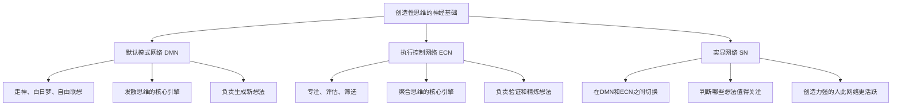
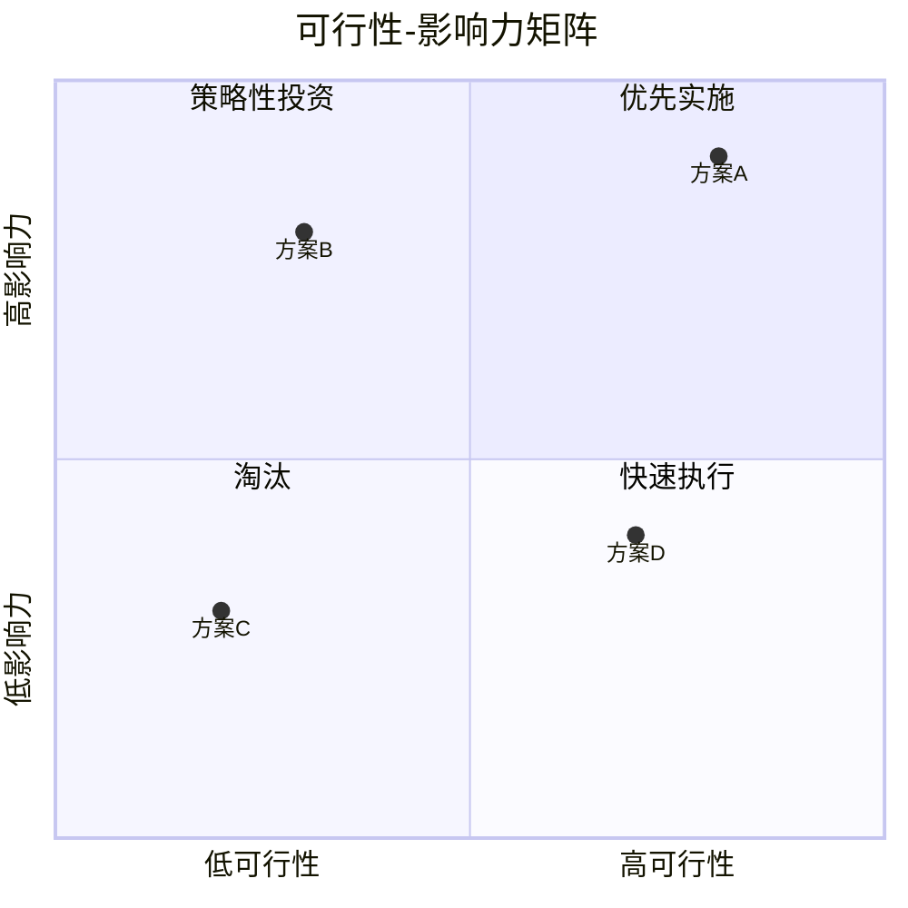
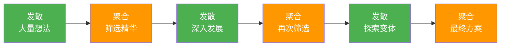

## 三、创造性思维：突破常规的力量

### 3.1 创造性思维的本质

创造性思维不是少数天才的专利，也不是神秘的灵感迸发。现代认知科学已经证明，创造力是一种可以被理解、训练和系统化提升的思维方式。它的核心机制是在看似不相关的概念之间建立新的连接，从而产生既有新颖性又有实用价值的想法。

#### 3.1.1 创造力的科学定义

创造力的学术定义由两个必要条件构成：

| 维度 | 含义 | 说明 |
|------|------|------|
| **新颖性（Novelty）** | 想法必须是新的、不常见的 | 但随机组合也很新颖，新颖性单独不足以构成创造力 |
| **有用性（Usefulness）** | 想法必须有价值、能解决问题 | 但已有的解决方案也有用，有用性单独也不构成创造力 |

两个条件必须同时满足。单纯的新颖是怪异，单纯的是有用是重复，只有两者结合才是创造。心理学家 Margaret Boden 进一步将创造力分为三个层次：

- **P-创造力（Psychological）**：对个体而言是新的想法——哪怕别人已经想到过
- **H-创造力（Historical）**：在人类历史上首次出现的想法
- **组合创造力**：将已有的概念以新的方式组合，产生新的意义

对于个人成长而言，P-创造力是起点。你不需要每次都发明人类历史上前所未有的东西，只需要对你自己而言产生新的洞察。

#### 3.1.2 创造力的神经科学基础

创造力并非某个单一脑区的功能，而是大脑多个网络协同工作的结果。理解这个机制，能帮助你更有针对性地训练创造性思维。



**关键发现：**

加州大学圣巴巴拉分校的 Rex Jung 研究发现，高创造力个体的大脑具有一个独特的特征——他们的默认模式网络（DMN，负责走神和自由联想）和执行控制网络（ECN，负责专注和评估）能够同时激活。普通人这两个网络通常是此消彼长的关系，而高创造力者可以让"自由联想"和"批判评估"同时工作。

这意味着：创造力不是"不思考"，也不是"苦思冥想"，而是一种特殊的认知状态——既放松又专注，既发散又收敛。

#### 3.1.3 创造力的过程模型：Wallas四阶段

英国心理学家 Graham Wallas 在1926年提出的创造力四阶段模型至今仍是理解创造过程的经典框架：

| 阶段 | 大脑状态 | 核心任务 | 持续时间 | 关键要点 |
|------|---------|---------|---------|---------|
| **准备期（Preparation）** | 高度专注，ECN主导 | 广泛收集信息、学习相关知识 | 数小时到数月 | 信息输入的广度和深度决定了后续创意的质量 |
| **酝酿期（Incubation）** | 放松，DMN主导 | 让潜意识处理问题 | 数小时到数月 | 刻意中断专注思考，做不相关的事情 |
| **顿悟期（Illumination）** | DMN与ECN瞬间协同 | 想法突然涌现 | 一瞬间 | 顿悟是酝酿的结果，不是凭空出现的 |
| **验证期（Verification）** | 高度专注，ECN主导 | 评估、发展、完善想法 | 数小时到数月 | 将模糊的灵感转化为可行的方案 |

**实操要点：**

很多人在创造过程中犯的一个根本性错误是：他们只做准备期和验证期的工作（学习知识、验证方案），跳过了酝酿期和顿悟期。结果就是"我已经很努力了，但就是没有好想法"。

解决方法是有意识地管理你的思考节奏：

1. **准备期**：集中精力学习、研究、收集素材。写笔记、画思维导图、与人讨论
2. **刻意暂停**：把问题"放下"——去散步、运动、洗澡、做手工、做其他工作
3. **捕捉顿悟**：随身携带笔记本或手机备忘录，随时准备记录冒出来的想法
4. **回到桌前**：对顿悟进行验证、发展、完善

爱因斯坦曾说他的相对论想法是在拉小提琴时出现的。阿基米德在浴缸里发现浮力定律。凯库勒在梦中看到蛇咬尾巴而想到苯环的结构。这些都是酝酿期发挥作用的经典案例。

### 3.2 发散思维与聚合思维

创造力的核心运转机制包含两个截然不同但必须交替进行的思维过程。理解并掌握这对思维模式，是提升创造力的最重要基础。

#### 3.2.1 发散思维（Divergent Thinking）

发散思维是产生大量不同想法的能力，追求的是广度和多样性。心理学家 J.P. Guilford 在1967年首次将发散思维与聚合思维区分开来，这是创造力研究的里程碑。

**发散思维的四个核心指标：**

| 指标 | 定义 | 训练方法 |
|------|------|---------|
| **流畅性（Fluency）** | 单位时间内产生想法的数量 | 设定时间限制，追求数量目标（如5分钟50个想法） |
| **灵活性（Flexibility）** | 想法的类别多样性 | 刻意从不同角度、不同领域、不同维度思考 |
| **独创性（Originality）** | 想法的独特和罕见程度 | 远离显而易见的方案，探索统计上不常见的答案 |
| **精细性（Elaboration）** | 对想法的细化和发展深度 | 对初步想法追问"具体怎么做""还有哪些细节" |

**经典发散思维练习——"砖头的用途"：**

在5分钟内列出砖头的所有可能用途。测试数据显示，普通人平均列出10-15个，经过发散思维训练的人可以列出50个以上，创造性思维极强的人可以超过100个。

| 水平 | 数量 | 典型答案特征 |
|------|------|-------------|
| 初级（10-15个） | 建房子、铺路、砌墙、做壁炉、垫桌脚 | 都属于"建筑"类别 |
| 中级（30-50个） | 纸镇、门挡、健身器材、艺术品、研磨工具 | 跨越3-5个类别 |
| 高级（50-100个） | 热量储存器、化学研磨粉、颜色颜料、教学道具、物理实验器材 | 跨越10+个类别，抽象到物理属性层面 |
| 专家（100+个） | 将砖头拆解为"黏土材料+矩形形状+特定重量+吸水性+导热性"等属性，每个属性都有多种用途 | 完全脱离"砖头"这个标签，只看底层属性 |

**发散思维的关键心法：**

1. **暂停评判**——在想法产生阶段，禁止任何"这个不行""这个不现实"的内部声音。评判是创造力的杀手
2. **追求数量**——数量是质量的前提。前30个想法通常是显而易见的，真正有创意的想法往往在第50个之后出现
3. **跳跃思考**——允许想法之间的跳跃和不相关。从A跳到Z再跳回B，完全没问题
4. **拥抱"疯狂"**——最不寻常的想法往往最有启发性。"用砖头做香水"听起来荒谬，但"砖头粉末可以作为香料载体"可能就是一个创新方向

#### 3.2.2 聚合思维（Convergent Thinking）

聚合思维是评估和筛选想法的能力，追求的是质量和可行性。如果发散思维是"广撒网"，聚合思维就是"精选鱼"。

**聚合思维的评估维度：**

1. **相关性**：想法与核心问题的相关程度有多高？
2. **可行性**：在现有资源（时间、金钱、技术、人力）下能否实现？
3. **影响力**：如果实现了，能产生多大的价值和效果？
4. **优雅性**：解决方案是否简洁、巧妙、容易理解和执行？

**实用的聚合思维工具：**

**工具一：可行性-影响力矩阵**



- **右上角（高影响力+高可行性）**：立即实施，这是你的"金矿"
- **左上角（高影响力+低可行性）**：战略性投资——花时间提升可行性，或者拆解为小步骤
- **右下角（低影响力+高可行性）**：快速执行，作为"低垂的果实"收割
- **左下角（低影响力+低可行性）**：果断淘汰，不要浪费时间

**工具二：加权评分法**

| 评估维度 | 权重 | 方案A | 方案B | 方案C |
|---------|------|-------|-------|-------|
| 创新性 | 25% | 9 | 7 | 8 |
| 可行性 | 30% | 7 | 9 | 6 |
| 成本 | 20% | 6 | 8 | 9 |
| 时间 | 15% | 8 | 6 | 7 |
| 影响力 | 10% | 9 | 7 | 8 |
| **加权总分** | 100% | **7.55** | **7.55** | **7.25** |

权重根据你的具体情境调整。例如，如果时间紧迫，就把"时间"权重提高到30%以上。

**工具三：原型快速验证**

对于最有潜力的想法，不讨论、不辩论——直接做最小可行原型（MVP），用事实说话：

1. 制作一个能展示核心功能的最简版本
2. 找3-5个目标用户测试
3. 收集反馈，判断是否值得继续投入
4. 整个过程控制在1-3天内

#### 3.2.3 发散与聚合的交替节奏

真正的创造性工作不是单次的发散或聚合，而是两者的多次交替进行。这是一个螺旋上升的过程：



**铁律：不要在发散阶段进行聚合，也不要在聚合阶段进行发散。**

为什么这是铁律？因为发散和聚合需要完全不同的认知状态。发散需要放松、开放、不评判；聚合需要专注、批判、做决定。如果你在头脑风暴中突然想"这个想法不行"，你就破坏了发散的状态，大脑会开始自我审查，好想法就不会冒出来了。

实操建议：用物理方式分隔两个阶段。例如，发散阶段在白板上写便利贴，聚合阶段把便利贴移到另一面墙上分类。或者用不同的工具——发散用思维导图软件，聚合用电子表格。

### 3.3 创造性思维的五重障碍

了解创造力的障碍是突破它们的前提。这些障碍不是独立存在的，它们往往相互强化，形成一个"创造力抑制循环"。逐一识别和突破这些障碍，是释放创造力的关键。

#### 3.3.1 功能固着（Functional Fixedness）

**定义**：只看到事物的传统用途，无法想象新的用法。这是大脑的"节省能量"机制——将物体归入固定类别可以加速日常决策，但在需要创造力时就会成为障碍。

**经典实验——邓克尔蜡烛问题：**

给参与者一支蜡烛、一盒图钉和一盒火柴，要求把蜡烛固定在墙上，点燃后蜡油不能滴到桌上。

大多数人尝试直接把蜡烛钉在墙上（失败），或用蜡油粘在墙上（不稳定）。只有少数人想到：倒空图钉盒，用图钉把盒子钉在墙上，做成一个"烛台"。

为什么大多数人想不到？因为"图钉盒"在他们脑中被固化为"装图钉的容器"，而不是"一个可以被利用的平坦表面"。

**突破方法：**

1. **属性分解法**：把物体拆解为底层物理属性——形状、材质、重量、颜色、透明度、导热性、弹性、磁性等。然后问："这些属性中有哪些可以为我所用？"
2. **"第一次看到"练习**：想象你是外星人第一次看到这个物体，你不知道它"应该"怎么用。你会怎么使用它？
3. **SCAMPER系统扫描**：用SCAMPER的七种操作（替代、合并、适应、修改、另作他用、消除、反转）系统地探索替代用途。这个工具在3.4节会详细展开

#### 3.3.2 思维定势（Einstellung Effect）

**定义**：过去成功的经验形成思维惯性，阻碍新方案的探索。你的"经验"既是你最大的资产，也是你最大的负债——它让你快速解决熟悉的问题，但也让你看不见更好的解决方案。

**经典实验——卢钦斯水壶问题：**

先给参与者三个可以用"A-B+C"公式解决的量水问题（如：A=21, B=127, C=3，答案=127-21-2×3=100）。然后给一个可以用更简单公式"B-A-C"直接解决的问题（如：A=23, B=49, C=3，答案=49-23-3=23）。大多数人仍然使用复杂的A-B+C公式，因为他们已经形成了路径依赖。

**突破方法：**

1. **"新手视角"练习**：遇到新问题时，先问自己："如果这是我第一次遇到这类问题，我会怎么解决？"强制自己从零开始思考
2. **强制替代路径**：要求自己至少想出3种完全不同的解决方法，即使你已经有一个"显然正确"的方案
3. **逆向思考**：不是想"怎么解决这个问题"，而是想"怎么让这个问题更糟糕"——然后反转每个答案
4. **"杀死你的宠儿"练习**：对自己最满意的方案进行刻意攻击——找它的弱点、假设它失败、想象竞争对手怎么打败它

#### 3.3.3 过早评判（Premature Evaluation）

**定义**：在想法萌芽阶段就进行自我审查，扼杀了可能有价值的概念。这是最常见的创造力杀手，大多数人甚至意识不到自己在做这件事。

**自我审查的典型内心独白：**

- "这太蠢了，没人会接受"
- "这不现实，做不到"
- "别人肯定已经想过了"
- "这和我们以前的做法完全不同，领导不会同意"
- "这太冒险了，万一失败怎么办"

**突破方法：**

1. **"想法笔记本"**：随身携带一个小本子或使用手机备忘录，不加评判地记录所有想法——包括那些"愚蠢的"和"不现实的"。每周回顾一次，你会发现其中有一些想法比你当时认为的有价值得多
2. **"无评判时间"规则**：在头脑风暴中设定明确的"无评判时段"（至少前10-15分钟），期间禁止任何批评，包括非语言的（叹气、皱眉、摇头）
3. **语言模式转换**：用"是的，而且……"替代"是的，但是……"。"但是"是否定前面的肯定，"而且"是在肯定的基础上延伸
4. **"三秒法则"**：当一个想法冒出来时，给自己至少3秒时间感受它，不要立即否定

#### 3.3.4 从众压力（Conformity Pressure）

**定义**：为了融入群体而放弃独特的想法。Solomon Asch的从众实验证明，即使答案明显是错的，约75%的人至少会跟随群体做出一次错误判断。

**在创造力场景中的表现：**

- 团队讨论中，第一个发言的人设定了思维框架，后面的人不自觉地在这个框架内思考
- "专家"的权威意见压制了新手的不同见解
- "大家都同意"制造了一种虚假的共识，没有人敢提出反对意见

**突破方法：**

1. **先写后说**：在团队讨论前，每人独立写下自己的想法（3-5分钟），然后同时分享。这避免了第一个人设框架的问题
2. **匿名收集**：用匿名投票或匿名帖子收集想法，减少社会压力
3. **指定"反对者"角色**：在每次会议中指定一个人专门负责提出反对意见和替代方案。当反对是"被要求的"，就不那么难以启齿
4. **建立心理安全环境**：领导者要公开鼓励不同意见，对提出异议的人表示感谢而不是惩罚

#### 3.3.5 过早收敛（Premature Closure）

**定义**：在没有充分探索可能性空间的情况下就锁定方案。这往往是因为人们感到不确定的焦虑，急于找到一个"确定"的答案来消除这种不适感。

**典型表现：**

- "这个方案看起来不错，我们就用这个吧"（实际上只评估了2-3个方案）
- "时间紧迫，我们没时间再想了"（但实际上花在执行一个错误方案上的时间远超思考时间）
- "大家都同意，那就不讨论了"（实际上可能只是没人敢反对）

**突破方法：**

1. **"至少五个"规则**：在收敛之前，强制要求至少产生5个不同方向的方案。如果不够5个，继续发散
2. **"如果……会怎样"假设**：对已有的方案提出假设性挑战——"如果预算翻倍，方案会变吗？""如果时间减半，方案会变吗？""如果竞争对手已经做了同样的事，我们还需要做吗？"
3. **"第三选择"练习**：当面临二选一的困境时（A还是B），强制要求想出第三种选择C。99%的二选一困境都有第三种甚至第四种选择
4. **设置"探索截止时间"**：不是"什么时候做出决定"，而是"什么时候停止探索"——确保探索期足够长

### 3.4 创造性思维工具箱

以下是经过验证的创造性思维工具，每个工具都有其最佳适用场景。不要试图掌握所有工具——根据你的具体场景选择2-3个作为主力工具，熟练后再扩展。

#### 3.4.1 头脑风暴（Brainstorming）及变体

头脑风暴是由广告公司BBDO创始人Alex Osborn在1939年发明的，至今仍是最广泛使用的创造力工具。它的核心思想是将"想法产生"和"想法评估"明确分离。

**经典头脑风暴四规则：**

1. **追求数量而非质量**：目标是产生尽可能多的想法。数量是质量的前提
2. **暂停评判**：在产生想法阶段不允许任何批评——包括皱眉、叹气等非语言批评
3. **鼓励疯狂的想法**：不寻常的想法往往最有启发性。"疯狂"的想法可以被调适为"创新"的想法
4. **在他人想法基础上发展**：组合、改进、延伸别人的想法。"搭便车"是被鼓励的

**头脑风暴的常见误区：**

很多人认为头脑风暴效果不好。研究确实表明，传统的"围坐一圈自由发言"的头脑风暴，效果往往不如每个人独立思考后汇总（这叫做"名义群体技术"）。原因包括：社交焦虑、评价顾虑、话语权不均等。

**解决方案：结合独立思考和集体讨论。**

**四种进阶头脑风暴变体：**

| 变体名称 | 核心方法 | 适用场景 | 操作步骤 |
|---------|---------|---------|---------|
| **逆向头脑风暴** | 不想"如何解决"，而想"如何让问题更糟" | 需要发现问题和风险时 | 1. 列出让问题更糟的方法 → 2. 反转每个方法 → 3. 得到解决方案 |
| **脑写作635** | 每人写3个想法，传给下一个人发展 | 需要安静、平等的环境 | 1. 每人写3个想法（5分钟） → 2. 传给右边的人 → 3. 在他人想法基础上发展 → 4. 重复5轮 → 5. 6人×3想法×5轮=90个想法 |
| **随机词汇联想** | 随机选一个词，与问题建立联系 | 思维陷入僵局时 | 1. 随机选词（翻开字典、看周围物体） → 2. 列出该词的所有联想 → 3. 将每个联想与问题建立连接 |
| **角色风暴** | 以不同身份角色思考问题 | 需要突破个人视角限制时 | 1. 选择角色（孩子、科学家、艺术家、竞争对手、外星人） → 2. "作为XX，我会怎么解决这个问题？" → 3. 每个角色至少产生5个想法 |

#### 3.4.2 六顶思考帽（Six Thinking Hats）

由爱德华·德博诺（Edward de Bono）提出的平行思维工具，核心思想是：让团队在同一时间从同一角度思考，避免"各说各话"的混乱讨论。

| 帽子颜色 | 思维模式 | 关注点 | 典型引导问题 | 使用时长建议 |
|---------|---------|--------|-------------|-------------|
| 🔵 蓝帽 | 过程管理 | 思考过程的控制 | "我们今天讨论什么？流程是什么？" | 贯穿始终 |
| ⚪ 白帽 | 中立事实 | 数据和信息 | "我们有哪些确定的数据？还需要什么信息？" | 5-10分钟 |
| 🔴 红帽 | 直觉情感 | 感受和直觉 | "我对这个方案的直觉感受是什么？" | 2-3分钟（快速） |
| ⚫ 黑帽 | 谨慎批判 | 风险和问题 | "有什么风险？可能出什么问题？什么会失败？" | 5-10分钟 |
| 🟡 黄帽 | 积极乐观 | 价值和机会 | "有什么好处？有哪些机会？为什么值得做？" | 5-10分钟 |
| 🟢 绿帽 | 创意发散 | 新想法和可能性 | "还有什么可能？能否换个角度？有没有全新的方案？" | 10-15分钟 |

**标准使用流程：**

1. **蓝帽启动**（2分钟）：明确议题、目标、流程和时间安排
2. **白帽呈现**（5-10分钟）：展示客观数据和事实，不做解读
3. **绿帽发散**（10-15分钟）：产生尽可能多的创意方案
4. **黄帽评估**（5-10分钟）：找出每个方案的积极面和价值
5. **黑帽审视**（5-10分钟）：识别每个方案的风险和问题
6. **红帽感受**（2-3分钟）：每个人快速表达直觉判断（不需要理由）
7. **蓝帽总结**（2分钟）：总结决策，确定下一步行动

**注意事项：**

- 不是每次会议都要用完六顶帽子。根据议题复杂度选择使用哪些帽子
- 黑帽和黄帽必须配对使用——不能只看到风险不看价值，也不能只看到价值不看风险
- 红帽的使用时长要短，避免它演变成冗长的辩论

#### 3.4.3 SCAMPER法详解

SCAMPER由Bob Eberle在1971年基于Alex Osborn的创意检查表发展而来，是一种通过七种系统操作来改进现有事物的创意激发方法。它的强大之处在于：当你不知道怎么开始创造性思考时，七种操作给你提供了七个明确的切入点。

| 操作 | 英文 | 核心问题 | 经典案例 | 个人应用示例 |
|------|------|---------|---------|-------------|
| **S** | Substitute（替代） | 可以用什么来替换？ | 用植物蛋白替代动物蛋白（Beyond Meat）；用视频会议替代出差（Zoom） | 用晨跑替代咖啡提神；用番茄工作法替代长时间硬撑 |
| **C** | Combine（合并） | 可以和什么结合？ | 手机+相机+GPS+电脑=智能手机；咖啡+社交空间=星巴克 | 日记+数据分析=量化自我；运动+社交=团建活动 |
| **A** | Adapt（适应） | 可以从哪里借鉴？ | 新干线车头借鉴翠鸟喙；Velcro（魔术贴）来自牛蒡刺的观察 | 借鉴游戏化机制用于学习；借鉴军事训练方法用于自律 |
| **M** | Modify（修改） | 可以放大、缩小或改变什么？ | 微型化：笔记本电脑、微型相机；大型化：大型超市、主题公园 | 把30分钟冥想改为5分钟微冥想；把大目标拆解为微任务 |
| **P** | Put to other uses（另作他用） | 可以用在其他什么地方？ | 小苏打从烘焙材料变为清洁剂；3M便利贴来自"失败"的强力胶 | 用写作整理思绪（不只是记录）；用烹饪练习时间管理 |
| **E** | Eliminate（消除） | 可以去掉什么？简化什么？ | 无印良品去除品牌标识；IKEA去除组装服务 | 砍掉不必要的会议；去掉手机上不常用的APP |
| **R** | Reverse（反转） | 可以颠倒或重新排列什么？ | 先买后用→先用后买（试用）；先写后卖→先卖后写（众筹） | 先行动再找动力（而不是等有动力再行动）；从教中学（而不是学完再教） |

**SCAMPER系统扫描模板：**

当你面对一个产品、方案或问题时，按顺序对每个操作回答以下问题：

S（替代）：当前方案中的哪些元素可以被替换？替换后会怎样？
C（合并）：当前方案可以和什么其他想法/产品/方法结合？
A（适应）：其他领域/行业/场景中有什么类似的方案可以借鉴？
M（修改）：当前方案的哪些方面可以放大/缩小/改变形状/改变频率？
P（另用）：当前方案或其中的组件可以用在其他什么地方？
E（消除）：当前方案中哪些元素是可以去掉的？去掉后会怎样？
R（反转）：当前方案的流程/顺序/角色/假设可以怎样颠倒？

#### 3.4.4 类比思维（Analogical Thinking）

类比思维是从完全不同的领域寻找解决方案的能力。研究表明，领域跨度越大的类比，产生的创新越具突破性。这是创造力最强大的来源之一。

**类比思维的四个步骤：**

1. **抽象化**：将当前问题抽象为底层结构——不是"我怎么提高销量"，而是"我怎么让一个系统中的个体更愿意执行某个行为"
2. **跨域搜索**：哪些领域面临类似的结构问题？例如，这个问题的结构在生态学、物理学、心理学、军事学中是否也有出现？
3. **提取原理**：那些领域是如何解决的？底层的机制和原理是什么？
4. **迁移适配**：如何将这个原理适配到当前场景？需要做哪些修改？

**类比思维的四个层次：**

| 层次 | 说明 | 示例 | 创新潜力 |
|------|------|------|---------|
| **表面类比** | 外观或形态相似 | 飞机机翼模仿鸟类翅膀 | 低——容易想到，也容易被竞争者模仿 |
| **结构类比** | 结构关系相似 | 原子结构类似太阳系（行星绕太阳→电子绕原子核） | 中——需要一定的抽象能力 |
| **深层类比** | 底层原理相似 | 自然选择应用于商业竞争（优胜劣汰、适者生存） | 高——需要对两个领域都有深入理解 |
| **抽象类比** | 数学或逻辑关系相似 | 网络效应在社交网络、传染病传播、核裂变中的共同表现（指数增长曲线） | 极高——往往产生范式级别的创新 |

**如何培养类比思维：**

1. **广泛阅读**——尤其是与你所在领域完全无关的领域。生物学家读经济学，工程师读哲学
2. **建立"模式库"**——当你看到一个有趣的解决方案时，抽象出它的底层模式，存入你的"模式库"
3. **定期做跨域类比练习**——每周选一个你所在领域的问题，然后随机选另一个领域，看能否找到类比解决方案

#### 3.4.5 约束驱动创新

直觉上，我们以为创造力需要"完全的自由"。但研究和实践反复证明：适当的约束反而能激发更强的创造力。完全的自由往往导致无所适从和决策瘫痪，而约束提供了结构和聚焦。

**约束激发创造力的三个机制：**

1. **缩小搜索空间**：无限的可能性让人不知从何下手，约束将搜索空间缩小到可管理的范围
2. **迫使非常规思维**：当常规方案被约束排除时，你不得不探索新的路径
3. **创造"游戏感"**：约束将工作变成一个"解谜游戏"，激发内在动机和成就感

**经典约束创新案例：**

| 约束类型 | 案例 | 创新结果 |
|---------|------|---------|
| 形式约束 | Twitter的140字限制 | 催生了简洁、有力的表达方式，创造了全新的社交媒体文化 |
| 资源约束 | 低成本独立电影《女巫布莱尔》（预算3.5万美元） | 手持摄像机的"伪纪录片"风格成为一种全新的电影语言 |
| 材料约束 | 宜家的"平板包装"约束 | 推动了家具设计的模块化革命，降低了物流成本 |
| 时间约束 | 48小时创业马拉松 | 2天内完成从创意到原型的全过程，很多项目后来成为真正的创业公司 |
| 物理约束 | 日本便当盒的空间约束 | 催生了极致的食物美学和空间利用技巧 |

**如何主动施加约束来激发创造力：**

- **时间约束**：给自己设定一个较短的时间限制——"在30分钟内想出20个解决方案"
- **资源约束**："如果预算只有现在的十分之一，你会怎么做？"
- **形式约束**："用一句话/一张图/一分钟来表达你的方案"
- **排除约束**："不能使用任何技术手段/不能增加人手/不能改变预算"
- **强制约束**："方案必须让10岁小孩也能理解"或"方案必须在没有互联网的地方也能工作"

#### 3.4.6 形态分析法（Morphological Analysis）

由瑞士天体物理学家 Fritz Zwicky 在1960年代开发，是一种系统性的创造力工具。它的核心思想是：将问题分解为若干独立维度，然后穷举每个维度的所有可能取值，通过组合产生新方案。

**操作步骤：**

1. **识别维度**：确定影响方案的关键维度（通常3-7个）
2. **穷举取值**：为每个维度列出所有可能的取值（每个维度至少3-5个）
3. **随机组合**：从每个维度中取一个取值进行组合，产生新方案
4. **评估筛选**：对组合出的方案进行评估和筛选

**示例：设计一款新的咖啡产品**

| 维度 | 取值1 | 取值2 | 取值3 | 取值4 | 取值5 |
|------|-------|-------|-------|-------|-------|
| 饮用场景 | 早晨通勤 | 下午办公 | 深夜学习 | 户外运动 | 社交聚会 |
| 容器形式 | 纸杯 | 玻璃瓶 | 胶囊 | 粉末冲泡 | 即饮罐 |
| 核心卖点 | 极致口味 | 超快提神 | 健康有机 | 低卡路里 | 社交属性 |
| 渠道 | 便利店 | 线上订阅 | 自动售货机 | 咖啡馆 | 健身房 |

5×5×5×5 = 625种组合。即使大部分组合不可行，能产生50个以上值得探索的方案。例如：

- 早晨通勤 × 即饮罐 × 超快提神 × 便利店 = 针对上班族的高咖啡因即饮咖啡
- 户外运动 × 胶囊 × 低卡路里 × 健身房 = 针对健身人群的低卡咖啡能量胶囊
- 深夜学习 × 粉末冲泡 × 健康有机 × 线上订阅 = 针对大学生的健康提神订阅盒

### 3.5 创造性思维的系统训练体系

创造性思维不是靠"灵感"和"天赋"，而是像肌肉一样可以通过系统训练持续增强。以下是经过科学验证的训练体系，从日常习惯到专项练习，覆盖不同层次的训练需求。

#### 3.5.1 日常习惯层：创意的"基础设施"

这些习惯为创造力提供持续的"燃料"和"土壤"：

**1. 输入多样化**

创造力的本质是"连接"——你脑子里的"素材"越多、越多样，能产生的连接就越多。这就是为什么跨界经验对创造力如此重要。

具体做法：
- 每周至少读一篇与你所在领域完全无关的文章或书籍
- 每月至少参加一次与你行业无关的活动或讲座
- 关注3-5个与你领域无关的社交媒体账号或播客
- 与不同职业、不同年龄、不同文化背景的人定期交流

**2. 记录灵感系统**

灵感来去无常，不记录就会丢失。你需要一个可靠、快速、随时随地可用的灵感捕获系统。

推荐工具和方法：
- 手机备忘录（Apple Notes、Google Keep、Flomo等）——随时记录
- 语音备忘录——在走路、开车等场景下快速口述
- 随身小本子（Moleskine等）——对屏幕疲劳时的替代方案
- 每周回顾一次灵感记录，标记哪些值得深入发展

**3. 利用"默认模式网络"**

大脑在放松状态下（散步、洗澡、发呆、做手工）会进入默认模式网络（DMN），此时潜意识会继续处理之前专注思考的问题。很多伟大的顿悟都发生在这种状态下。

具体做法：
- 每天安排至少15-30分钟的"无目的时间"——不看手机、不听播客、不做任务
- 散步是最有效的创意活动之一（斯坦福研究：散步时创造力提升60%）
- 在遇到困难问题时，不要一直"硬想"——先集中精力研究30-60分钟，然后去做别的事情

**4. 身体活动**

研究表明，适度运动能显著提升创造性思维。其机制包括：增加大脑血流量、提升BDNF（脑源性神经营养因子）水平、减少焦虑和压力、激活默认模式网络。

| 运动类型 | 对创造力的影响 | 推荐频率 |
|---------|--------------|---------|
| 散步 | 提升60%创造力（斯坦福研究） | 每天30分钟 |
| 有氧运动（跑步、游泳、骑行） | 运动后2小时内创造力显著提升 | 每周3-5次 |
| 瑜伽 | 提升发散思维能力 | 每周2-3次 |
| 力量训练 | 间接提升（通过改善睡眠和减少焦虑） | 每周2-3次 |

**5. 环境切换**

新的环境能激发新的想法——因为新的环境提供了新的感官刺激，激活大脑中不常用的神经通路。

- 定期更换工作场所（咖啡馆、图书馆、公园、共享办公空间）
- 旅行——尤其是去文化差异大的地方
- 重新布置工作空间
- 在自然环境中思考（绿色空间已被证明能提升创造力）

#### 3.5.2 专项练习层：刻意训练创造力

**练习一：日常发散训练（每天5-10分钟）**

每天选一个日常物品，在5分钟内想出尽可能多的用途。

训练日历示例：

| 第1天 | 第2天 | 第3天 | 第4天 | 第5天 |
|-------|-------|-------|-------|-------|
| 回形针的用途 | 牙签的用途 | 报纸的用途 | 橡皮筋的用途 | 矿泉水瓶的用途 |

关键：记录数量，追踪进步。第一个月目标从15个提升到30个，第三个月目标提升到50个。

**练习二：强制连接练习（每周2-3次）**

随机选择两个完全不相关的概念，强制建立连接。

操作步骤：
1. 随机选词A（打开字典随机指一个词、看桌上的物品、看窗外的景物）
2. 随机选词B（同样方法）
3. 在5分钟内找出A和B之间尽可能多的联系

示例：随机选到"雨伞"和"教育"
- 雨伞保护你不被淋湿 → 教育保护你不被错误信息"淋湿"
- 雨伞的骨架结构 → 知识体系的框架结构
- 折叠伞可以收纳 → 知识也需要"折叠收纳"便于携带
- 雨伞在雨天才是必需的 → 教育在面对挑战时才显现价值

**练习三：视角切换练习（每周1-2次）**

选择一个你正在面对的问题，从5个不同视角来思考：

1. **孩子视角**：如果一个8岁的孩子面对这个问题，他会怎么做？（孩子不受"常识"限制）
2. **竞争对手视角**：如果竞争对手要解决这个问题，他们会怎么做？
3. **百年后视角**：100年后的人会怎么看这个问题？
4. **其他行业视角**：如果这个问题出现在医疗/军事/艺术/餐饮行业，他们会怎么解决？
5. **反面视角**：如果目标不是"解决"而是"恶化"这个问题，我会怎么做？

**练习四："如果……会怎样"思维实验（每周1次）**

对你的工作或生活中一个常规做法，提出"如果……会怎样"的假设性挑战：

- "如果预算翻倍，我会怎么做不同的事？"（揭示你因为资源限制而放弃的方案）
- "如果预算为零，我会怎么做？"（揭示你因为有资源而产生的惰性）
- "如果时间减半，我会怎么做？"（揭示哪些步骤是真正必要的）
- "如果目标用户变成完全不同的群体，方案会变吗？"（揭示你的隐含假设）
- "如果这个产品/方案失败了，最可能的原因是什么？"（预防性思维）

#### 3.5.3 项目实践层：在真实项目中锤炼创造力

**项目一：30天创意挑战**

每天完成一个创意任务，坚持30天。参考任务列表：

- 第1周：视觉创意（画一幅画、设计一个LOGO、拍一组创意照片）
- 第2周：文字创意（写一个短故事、一首诗、一组广告文案）
- 第3周：方案创意（解决一个生活中的真实问题）
- 第4周：跨界创意（将两个不相关的领域结合，创造一个新产品/服务/方法）

**项目二：问题重构练习**

选择一个你面对的真实问题，用5种不同的方式重新定义它。

示例——原始问题："我怎么提高团队的工作效率？"

重新定义：
1. "我怎么减少团队在低价值工作上浪费的时间？"
2. "我怎么让团队成员更愿意主动投入工作？"
3. "我怎么识别和消除阻碍效率的系统性障碍？"
4. "我怎么改变工作方式，使得同样的产出需要更少的努力？"
5. "我怎么重新定义'效率'——不是做更多，而是做更重要的事？"

每个重新定义都指向完全不同的解决方案方向。问题的定义方式决定了你能看到的解决方案空间。

**项目三：创新日志**

每周记录一个你观察到的创新案例，分析它：
1. 它解决了什么问题？
2. 它使用了哪种创造性思维方法？（发散、类比、约束驱动、SCAMPER等）
3. 它的"新颖性"和"有用性"分别体现在哪里？
4. 我可以从中学到什么？可以如何迁移到我自己的领域？

### 3.6 常见误区与纠正

| 误区 | 为什么是错的 | 正确认知 |
|------|-------------|---------|
| "创造力是天生的，我没有创造力" | 大量研究表明创造力可以通过训练提升。所有人的创造力都在正态分布上，绝大多数人处于中间区域，都有显著的提升空间 | 创造力是技能，不是天赋。它像肌肉一样可以通过训练增强 |
| "创造力就是头脑风暴" | 头脑风暴只是创造力工具箱中的一种工具，而且不是最有效的。创造力是一个包含准备、酝酿、顿悟、验证的完整过程 | 创造力是一个系统过程，需要多种工具和方法的配合 |
| "创造力需要完全的自由" | 适当的约束反而能激发创造力。完全的自由往往导致决策瘫痪 | 约束是创造力的催化剂，不是阻碍 |
| "好的想法一开始就是好的" | 大多数伟大的创新在最初的想法阶段都很粗糙。想法需要在验证期经历大量的打磨和完善 | 创造力的第一步是产生"足够多"的粗糙想法，然后打磨 |
| "创造力只在特定领域有用" | 创造力在所有领域都有价值——技术开发、商业策略、人际关系、日常生活、问题解决 | 创造力是一种通用思维能力 |
| "团队头脑风暴比个人思考更有效" | 研究表明，名义群体技术（个人独立思考后汇总）往往比传统头脑风暴产生更多更好的想法 | 结合独立思考和集体讨论效果最佳 |
| "创造力不需要准备" | Wallas模型的准备期是基础——没有足够的知识储备和信息输入，"灵感"不会凭空出现 | 广泛而深入的学习是创造力的必要前提 |
| "一个好想法就够了" | 你需要大量的想法才能筛选出少数真正有价值的。爱迪生试验了数千种材料才找到合适的灯丝 | 追求数量，然后从数量中筛选质量 |

### 3.7 创造力在不同场景中的应用

#### 3.7.1 工作中的创造力

**问题解决场景：**

面对一个棘手的工作问题时，使用"五步创造性问题解决法"：

1. **定义问题**：用"我怎么……"的句式重新定义问题，至少写5个不同版本
2. **发散方案**：对每个问题定义产生至少5个解决方案
3. **评估筛选**：用可行性-影响力矩阵筛选出TOP 3方案
4. **原型验证**：对TOP 3方案分别制作最小可行原型
5. **迭代优化**：根据反馈选择最佳方案并持续优化

**创新提案场景：**

当你需要向上级或客户提出创新方案时，使用"创新提案模板"：

```markdown
## 创新提案：[方案名称]

### 问题定义
- 我们要解决什么问题？（具体、可量化）
- 当前做法的不足是什么？

### 解决方案
- 核心创意是什么？（一句话）
- 这个方案使用了什么创造性思维方法？
- 与现有方案的本质区别是什么？

### 验证计划
- 最小可行原型是什么？
- 如何快速验证核心假设？
- 成功标准是什么？

### 风险与应对
- 最大的风险是什么？
- 如果风险发生，我们如何应对？
```

#### 3.7.2 学习中的创造力

创造力不仅适用于"创新"和"艺术"场景，在学习中同样重要：

- **类比学习法**：将新概念与已知概念进行类比。例如，将电磁波类比为水波
- **费曼技巧**：用教别人的方式学习——你需要创造性地简化和重组知识才能教会别人
- **问题驱动学习**：不是"我要学XX"，而是"我要解决XX问题，需要学什么"
- **跨界连接**：将不同学科的知识进行连接。例如，用物理中的"反馈回路"理解心理学中的"习惯循环"

#### 3.7.3 生活中的创造力

日常生活中的创造力同样可以被训练和应用：

- **日常生活优化**：用SCAMPER方法优化你的日常流程（晨间习惯、通勤路线、做饭方式等）
- **人际关系**：用视角切换练习理解他人的立场和需求
- **消费决策**：用形态分析法系统地探索所有选择
- **个人问题解决**：用"如果……会怎样"假设挑战你生活中的隐含假设

### 3.8 延伸阅读与工具推荐

**经典书籍：**

| 书名 | 作者 | 核心价值 |
|------|------|---------|
| 《创造力》（Creativity） | Mihaly Csikszentmihalyi | 系统阐述创造力的本质和培养方法 |
| 《水平思维》（Lateral Thinking） | Edward de Bono | 创造性思维方法论的奠基之作 |
| 《创新者的窘境》（The Innovator's Dilemma） | Clayton Christensen | 理解创新的本质和规律 |
| 《SCAMPER》 | Bob Eberle | SCAMPER方法的详细介绍和练习 |
| 《关于创造力》（A Technique for Producing Ideas） | James Webb Young | 创造力过程的经典小书 |

**在线工具：**

- **思维导图工具**：XMind、MindMeister——用于发散思维的可视化
- **白板工具**：Miro、FigJam——用于团队头脑风暴和想法整理
- **随机词生成器**：randomwordgenerator.com——用于随机词汇联想练习
- **SCAMPER工作表**：可打印的SCAMPER扫描模板，用于系统性探索

---

> **本节核心要点回顾**：创造性思维是一种可训练的技能，其神经基础是默认模式网络与执行控制网络的协同工作。创造力的核心运转机制是发散思维与聚合思维的交替进行。五重障碍（功能固着、思维定势、过早评判、从众压力、过早收敛）需要被逐一识别和突破。工具箱中最重要的六种工具——头脑风暴、六顶思考帽、SCAMPER、类比思维、约束驱动创新、形态分析法——覆盖了从个人到团队、从产品到策略的各个场景。系统训练需要三个层次：日常习惯（输入多样化、灵感捕获、DMN利用、运动、环境切换）、专项练习（发散训练、强制连接、视角切换、假设挑战）、项目实践（30天挑战、问题重构、创新日志）。创造力不是等待灵感，而是主动创造灵感出现的条件。
