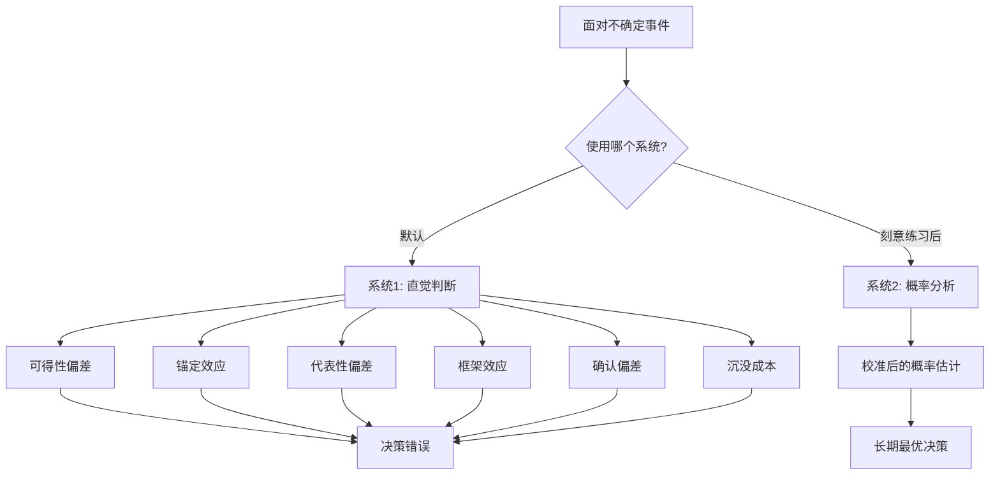
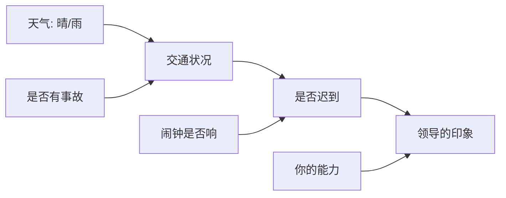
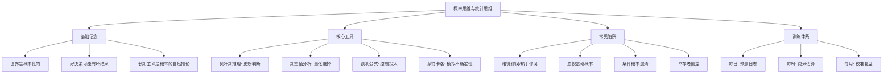

## 五、概率思维与统计思维：在不确定性中决策

> "不确定性不是敌人，对不确定性的无知才是。" —— 纳西姆·塔勒布

现实世界没有水晶球。你无法确切知道明天的股价、下个月的天气、或者这份工作能否干满三年。但你仍然必须做出选择——投资哪只股票、出门带不带伞、要不要跳槽。概率思维和统计思维就是你在迷雾中行走的指南针：它不能消除不确定性，但能帮你看清每条路的风险分布，做出长期最优的决策。

### 5.1 为什么人类天生不擅长概率思维

在学习概率思维之前，先理解为什么它如此反直觉——这不是你的错，而是进化的设计。

#### 大脑的两套系统

丹尼尔·卡尼曼在《思考，快与慢》中描述了大脑的两套认知系统：

| 维度 | 系统1（快思考） | 系统2（慢思考） |
|------|----------------|----------------|
| 速度 | 毫秒级自动反应 | 需要刻意努力 |
| 能耗 | 低，几乎无感 | 高，容易疲劳 |
| 处理方式 | 模式匹配、直觉 | 逻辑推理、计算 |
| 概率能力 | 极差，依赖直觉 | 可以处理，但懒惰 |
| 典型场景 | "这个人看起来很可疑" | "根据统计数据显示…" |

系统1在远古环境中帮我们快速逃离猛兽，但它对概率一窍不通。当你看到"飞机失事"的新闻时，系统1会立刻拉响警报"飞机很危险"，而不会去计算飞机失事的概率（约1/1100万）比驾车（约1/5000）低两个数量级。

#### 六大致命的认知偏差

进化留给我们的概率偏差并非只有一种，而是系统性的：

**1. 可得性偏差（Availability Bias）**

大脑用"想起来有多容易"来估计"发生的概率有多大"。越生动、越近期、越情绪化的事件越容易被想起，因此被严重高估概率。

- 鲨鱼攻击致死的概率约1/370万，但很多人对海滩恐惧
- 恐怖袭击致死的概率远低于心脏病，但前者引发的恐惧远大于后者
- 你身边朋友创业失败的案例会让你高估创业失败率

**2. 锚定效应（Anchoring Effect）**

第一个接触到的数字会"锚定"你的后续判断，即使这个数字完全无关。卡尼曼的经典实验：让两组人先转一个随机数字轮盘，然后估计联合国中非洲国家的比例。转到10的那组平均估计25%，转到65的那组平均估计45%——一个随机数字就能左右你的"理性判断"。

**3. 代表性偏差（Representativeness Bias）**

用"看起来像不像"来代替概率计算。经典描述："琳达31岁，单身，直率聪明，主修哲学，学生时代关注社会正义和反歧视。"大多数人认为"琳达是银行柜员且是女权主义者"比"琳达是银行柜员"更可能——但这在概率上不可能，因为联合概率永远小于单一事件概率。

**4. 框架效应（Framing Effect）**

同一个概率用不同方式表达，会导致截然不同的决策：
- "手术存活率90%" vs "手术死亡率10%"——同一数据，后者让人更恐惧
- "这款产品好评率95%" vs "每20个用户中有1个不满意"——后者感觉风险更高

**5. 确认偏差（Confirmation Bias）**

一旦形成某个概率判断，大脑会自动过滤掉反面证据、放大正面证据。你相信"这家餐厅很好"，就会记住每次好的体验，忽略或合理化糟糕的体验。

**6. 沉没成本谬误（Sunk Cost Fallacy）**

"我已经投入了这么多，不能放弃"——过去的投入不应该影响未来的概率判断，但它确实影响了，而且影响巨大。



### 5.2 风险与不确定性：两个被混淆的关键概念

1921年，经济学家弗兰克·奈特（Frank Knight）做了一个至今仍影响深远的区分：

| 维度 | 风险（Risk） | 不确定性（Uncertainty） |
|------|-------------|----------------------|
| 定义 | 未来有多种可能结果，且每种结果的概率可知 | 未来有多种可能结果，但概率不可知甚至不可列 |
| 例子 | 抛硬币：正面50%，反面50% | 明年是否会出现一种全新的颠覆性技术 |
| 可量化 | 是，可以用概率分布描述 | 否，无法建立可靠的概率模型 |
| 应对工具 | 保险、对冲、期望值计算 | 冗余、反脆弱、期权思维 |
| 典型领域 | 赌博、保险精算、短期股市 | 战争、革命、黑天鹅事件 |

**为什么这个区分重要？**

因为你对风险和不确定性的应对策略完全不同：

- 对**风险**：计算期望值，做好对冲，接受"正确决策也可能出错"的事实
- 对**不确定性**：无法精确计算，需要构建"反脆弱"的系统——无论发生什么都能受益或至少存活

塔勒布在《反脆弱》中提出一个实用框架：

- **脆弱**：在波动中受损（如：所有资产集中在一只股票）
- **坚韧**：在波动中不受影响（如：分散投资的指数基金）
- **反脆弱**：在波动中受益（如：持有大量现金等待危机抄底的机会）

在面对深度不确定性时，不要试图精确预测——而是构建反脆弱的系统，让不可预测的事件成为你的机会而非灾难。

### 5.3 概率思维的核心信念体系

概率思维不仅是一种技能，更是一套认知世界的基本信念：

**信念一：世界本质上是概率性的**

大多数事情不是"会"或"不会"发生，而是有某个概率发生。"这个人会不会骗我"不应该是一个是/否问题，而应该是"基于我目前掌握的信息，他骗我的概率大约是多少"。

**信念二：概率是可以估计的**

即使不能精确计算，也可以给出合理的概率范围。费米估算法就是一种用逻辑链条把未知量拆解为可估计量的技术。说"我完全不知道"通常是一种思维懒惰——仔细想一想，你总能找到一些相关信息来缩小范围。

**信念三：概率是可以更新的**

随着新信息的到来，概率估计应该被调整。固守初始判断而无视新证据是反概率思维的。贝叶斯推理就是系统化地做这件事。

**信念四：好决策可能产生坏结果**

这是概率思维中最难接受但最重要的信念。你精心调研后投资了一家优秀公司，结果它因为不可预见的黑天鹅事件暴跌——这不是决策错误，而是概率世界中必然存在的"坏运气"。评判决策质量应该看决策过程，而不是单次结果。

打一个比方：如果你每次拿一对A（AA）全押，长期一定赢钱。但某一次你可能输给别人的7-2——这不意味着你的决策是错的，只是那一次概率落在了不利的尾巴上。

**信念五：长期主义是概率思维的自然推论**

好决策的回报需要足够多的样本来兑现。如果你做了100次正确的决策，即使每次只有55%的胜率，你在统计上几乎必然赢。问题在于大多数人做了3次正确决策、看到1次坏结果就放弃了。

### 5.4 贝叶斯推理：概率思维的引擎

贝叶斯推理是概率思维的核心方法论。它不是一个复杂的数学公式，而是一种"根据新证据更新判断"的思维习惯。

#### 贝叶斯定理的直觉理解

**贝叶斯定理**：

$$P(A|B) = \frac{P(B|A) \times P(A)}{P(B)}$$

用大白话说就是：

$$\text{更新后的判断} = \frac{\text{如果假设成立，看到这个证据的可能性} \times \text{原来的判断}}{\text{这个证据出现的总体概率}}$$

四个关键概念：

| 符号 | 术语 | 含义 | 例子 |
|------|------|------|------|
| P(A) | 先验概率 | 看到证据之前的初始判断 | 这个人说谎的初始概率 |
| P(B\|A) | 似然度 | 如果假设成立，看到证据的概率 | 如果他说谎，出现这种含糊措辞的概率 |
| P(B) | 边际概率 | 证据出现的总体概率 | 所有人使用这种含糊措辞的总体概率 |
| P(A\|B) | 后验概率 | 看到证据之后的更新判断 | 看到含糊措辞后，他说谎的更新概率 |

#### 完整实例一：医学检测悖论

这是贝叶斯推理最经典的案例，也是最反直觉的：

**场景设定**：
- 某种罕见疾病的发病率为 0.1%（每1000人中有1人患病）
- 检测方法的灵敏度（真阳性率）为 99%（患病者检测为阳性的概率）
- 检测方法的特异度（真阴性率）为 99%（未患病者检测为阴性的概率）
- 一个人检测结果为阳性，他真正患病的概率是多少？

**直觉回答**：99%。几乎所有人都这么猜。

**实际答案**：约 9%。

**推导过程（频率树法）**：

假设有 100,000 人接受检测：

100,000 人
├── 100 人患病（0.1%）
│   ├── 99 人检测为阳性（真阳性，99%灵敏度）
│   └── 1 人检测为阴性（假阴性）
└── 99,900 人未患病
    ├── 999 人检测为阳性（假阳性，1%误报率）
    └── 98,901 人检测为阴性（真阴性）

总阳性结果 = 99（真阳性）+ 999（假阳性）= 1,098 人

真正患病的概率 = 99 / 1,098 ≈ **9.02%**

**为什么这么低？**

因为疾病太罕见了（基础概率只有0.1%）。即使检测很准确，未患病人群中1%的误报率乘以巨大的基数（99,900人），产生的假阳性数量远超真阳性。这就是**基础概率**的威力——它像一个巨大的锚，把后验概率拉向它。

**贝叶斯更新的思维过程**：

1. **先验**：患病概率 0.1%（非常低）
2. **证据强度**：阳性结果，似然比 = 99% / 1% = 99（很强的证据）
3. **后验**：先验 × 似然比 = 0.1% × 99 ≈ 9.9%（接近9%的精确值）

即使证据很强（似然比99倍），因为先验概率极低（0.1%），后验概率仍然只有约9%。

#### 完整实例二：诈骗邮件的贝叶斯分析

**场景**：你收到一封来自尼日利亚的邮件，对方声称是已故富翁的律师，需要你帮忙转移一笔巨款，并承诺给你20%的佣金。

**贝叶斯分析**：

| 步骤 | 合法请求的假设(H1) | 诈骗的假设(H2) |
|------|-------------------|---------------|
| 先验概率 | P(H1) = 0.0001（万分之一） | P(H2) = 0.9999 |
| 证据E：来自尼日利亚 | P(E\|H1) = 0.01（合法请求碰巧来自尼日利亚的概率） | P(E\|H2) = 0.8（诈骗邮件来自尼日利亚的概率） |
| 第一次更新 | 后验 ∝ 0.0001 × 0.01 = 0.000001 | 后验 ∝ 0.9999 × 0.8 = 0.79992 |

一次更新后，合法假设的概率已经低到可以忽略不计。后续即使出现"支持合法性"的证据（如伪造的律师执照、银行对账单），也几乎不会改变结论——因为先验概率太低了。

这就是萨根标准的数学基础："异常的主张需要异常强的证据"（Extraordinary claims require extraordinary evidence）。

#### 完整实例三：面试判断的贝叶斯更新

一个更贴近日常的例子：

**场景**：你在面试一个候选人，简历看起来不错。你的先验判断是"这个人大概有60%的概率能胜任"。

面试过程中你观察到以下证据，逐一更新：

| 证据 | 似然比（胜任者展示此特征 / 不胜任者展示此特征） | 更新后的概率 |
|------|---------------------------------------------|-------------|
| 先验 | — | 60% |
| 回答技术问题时逻辑清晰 | 3:1（胜任者更可能做到） | 82% |
| 被问到失败经历时回避细节 | 1:4（不胜任者更可能回避） | 58% |
| 提出了一个你没想到的好问题 | 5:1（胜任者更可能做到） | 85% |
| 薪资期望远高于预算 | 1:2（不胜任者中贪婪者比例更高） | 71% |

最终判断：71%的概率能胜任——这比简单的"感觉行/不行"精确得多，也为你提供了一个可以进一步验证的数字基准。

#### 贝叶斯推理的关键原则

1. **强证据产生大更新，弱证据产生小更新**：一个朋友说"这家餐厅不错"是弱证据；你亲自去吃了三次都不错是强证据
2. **异常主张需要异常强的证据**：先验概率越低，需要越强的证据才能翻转判断
3. **先验概率是锚**：不要被生动的个案淹没而忽视基础概率
4. **更新是持续的**：不要一次性形成固定观点，每次新信息都是更新的机会
5. **注意证据之间的独立性**：如果你问了三个朋友都说好，但他们是同一个美食群的、看过同一篇测评——这其实只算一条独立证据

### 5.5 统计思维的核心概念

统计思维是概率思维的"工程化"——它把概率理论转化为可操作的数据分析工具。

#### 5.5.1 基础概率（Base Rate）

基础概率是某类事件在总体中发生的频率，它是一切概率判断的起点。

**忽视基础概率的代价**：

你看到一个创业公司的创始人：名校毕业、大厂经历、BP做得漂亮、口才出众。你觉得他成功的概率有多高？

如果你只关注这些"生动特征"而忽略基础概率，你可能会给出70-80%的判断。但中国创业公司5年存活率不到7%——这才是你的起点。即使这些特征把概率提高了5倍，也只是从7%变成35%——仍然不到一半。

**基础概率清单**（日常决策参考）：

| 场景 | 基础概率 | 数据来源 |
|------|---------|---------|
| 中国创业公司5年存活率 | ≈7% | 工商总局企业注销数据 |
| 主动管理型基金跑赢指数（10年期） | ≈15% | 标普SPIVA报告 |
| 相亲后发展为长期关系的概率 | ≈5-10% | 婚恋平台统计 |
| 首次投稿被顶级期刊接收 | ≈5-15% | 各期刊公开数据 |
| 自学编程成功转行的概率 | ≈15-25% | 在线教育平台完课+就业数据 |

**正确使用基础概率的步骤**：

1. 首先找到参考类别的基础概率
2. 然后评估当前案例的具体特征如何调整这个概率
3. 最后给出一个经过调整的概率估计

这就是"参考类预测法"（Reference Class Forecasting），由诺贝尔奖得主丹尼尔·卡尼曼推荐，被用于大型项目的风险评估。

#### 5.5.2 条件概率与因果混淆

条件概率是最容易被误用的统计概念。核心规则只有一条：**P(A|B) ≠ P(B|A)**。

| 实际数据 | 错误推理 | 正确理解 |
|---------|---------|---------|
| 90%的成功企业家有MBA | "读MBA有90%概率成为成功企业家" | MBA持有者中成功企业家的比例可能只有1% |
| 80%的车祸发生在离家10公里内 | "离家10公里内开车更危险" | 只是大部分驾驶发生在离家近的地方 |
| 70%的肺癌患者是吸烟者 | "吸烟者有70%概率得肺癌" | 吸烟者中肺癌的发病率约15% |
| 95%的暴力犯罪者是男性 | "男性有95%概率是暴力犯罪者" | 男性中暴力犯罪者的比例不到0.1% |

**检验方法——交换条件**：如果你把A和B交换后，结论变得荒谬，那你很可能混淆了条件概率。

**实战应用——面试中的条件概率**：

面试官说："我们公司优秀员工中80%在面试时都展示了很强的沟通能力。"

错误推理："面试中展示强沟通能力的人80%会成为优秀员工。"

正确推理：还需要知道"面试中展示强沟通能力的人中，有多少最终成为优秀员工"。如果100%的面试者都展示了强沟通能力，那这个特征完全没有区分度。

#### 5.5.3 大数定律与小数定律

**大数定律**：样本量越大，样本均值越接近总体均值。抛10次硬币可能7次正面（70%），但抛10000次几乎一定接近50%。

**小数定律**（丹尼尔·卡尼曼提出的认知偏差）：人们错误地认为小样本也能代表总体。

小数定律的日常陷阱：

| 错误推理 | 问题所在 | 正确思考 |
|---------|---------|---------|
| "我认识的三个XX人都很聪明，所以XX人都聪明" | 样本量=3，远不足以代表总体 | 需要数百个样本才能做出可靠判断 |
| "这家餐厅我去了两次都很好，所以一定好" | 两次体验受太多随机因素影响 | 至少需要5-10次不同菜品的体验 |
| "这个策略连续成功了三次，所以它有效" | 三次可能是运气 | 需要至少30-50次测试才能确认 |
| "我试了这个药两次都有效" | 安慰剂效应+回归均值 | 需要大规模双盲随机对照试验 |

**实际影响——A/B测试的陷阱**：

做产品A/B测试时，很多人在看到前100个用户的数据就宣布"方案B好30%！"——这极可能是随机波动。行业标准是每个方案至少需要1000-5000个样本才能做出统计显著的判断。

**经验法则**：

- 样本量 < 30：几乎不能得出任何可靠结论
- 样本量 30-100：可以做粗略的趋势判断
- 样本量 100-1000：可以做中等置信度的判断
- 样本量 > 1000：可以做高置信度的判断
- 注意：以上适用于独立同分布的样本，如果是有偏样本，再大的样本量也不可靠

#### 5.5.4 回归均值

极端表现往往会向平均值回归——这是统计规律，不是因果关系。

**经典案例**：

- **体育画报诅咒**：上了《体育画报》封面的运动员，下赛季表现通常会下降。原因不是"诅咒"，而是他们之所以被选上封面，正是因为处于极端出色的状态——而极端状态本来就会回归均值
- **" sophomore juries"（大二诅咒）**：第一张专辑大获成功的歌手，第二张通常评价下降
- **治疗效果的幻觉**：你感冒最严重的时候吃了药，第二天感觉好了——很可能是疾病自然回归的过程

**回归均值的陷阱**：

最容易犯的错误是把回归均值当成因果关系。你批评了表现差的员工，他下次表现变好了——你觉得是批评起了作用。但更可能的解释是：极端差的表现本来就会自然改善，无论你批不批评。

同样，你表扬了表现好的孩子，他下次成绩下降了——不要以为表扬有害。极端好的表现本来就倾向于回归。

**如何避免回归均值的误判**：

1. 不要对极端结果做过度归因（无论是奖励还是惩罚）
2. 多次观察取平均，而不是基于单次极端结果下结论
3. 设对照组——如果没有干预也会回归均值，那干预的真实效果可能是零

#### 5.5.5 辛普森悖论

这是一个更高级但极其重要的统计陷阱：在分组数据中呈现的趋势，在合并数据后可能完全逆转。

**真实案例——加州大学伯克利分校性别歧视案**：

1973年，伯克利研究生院整体数据显示：男性申请者录取率44%，女性申请者录取率35%——看起来存在性别歧视。但当分院系查看时，每个院系的女性录取率都等于或高于男性。

原因：女性倾向于申请竞争更激烈的院系（录取率低的），男性倾向于申请竞争不那么激烈的院系（录取率高的）。合并数据后，这个混杂因素造成了虚假的"歧视"结论。

**辛普森悖论的启示**：

1. 看合并数据时要考虑是否有混杂变量
2. 不要轻信"总体趋势"——它可能在分组后完全反转
3. 分析数据时，先问"这些数据的分组方式是否合理"

#### 5.5.6 相关不等于因果

这是统计学中被违反次数最多的戒律。

**相关但非因果的例子**：

| 相关关系 | 虚假因果 | 真实解释 |
|---------|---------|---------|
| 冰淇淋销量 ↑ 溺水事故 ↑ | 吃冰淇淋导致溺水？ | 夏天是共同原因（混杂变量） |
| 鞋码越大 → 识字率越高 | 大脚让人更聪明？ | 年龄是共同原因 |
| 国家巧克力消费量 ↔ 诺贝尔奖数量 | 吃巧克力变聪明？ | 经济发展水平是共同原因 |
| 教育年限 ↑ 收入 ↑ | 读书多=赚得多？ | 智力/家庭背景是混杂变量（部分因果确实存在） |

**判断因果关系的三个条件（布拉德福德·希尔标准简化版）**：

1. **时间先后**：原因必须先于结果
2. **剂量反应**：原因的强度变化应该对应结果的变化
3. **机制可解释**：存在合理的因果机制

最可靠的因果判断来自**随机对照实验（RCT）**——随机分配消除混杂变量，是因果推断的金标准。

### 5.6 概率思维的实战应用框架

#### 5.6.1 期望值决策法

面对不确定的选择时，计算每个选项的期望值：

$$E(X) = \sum_{i} P_i \times V_i$$

**实例：是否接受一份新工作？**

| 维度 | 当前工作 | 新工作A | 新工作B |
|------|---------|--------|--------|
| 稳定发展概率 | 70%，年收入30万 | 50%，年收入40万 | 60%，年收入35万 |
| 小幅提升概率 | 20%，年收入35万 | 30%，年收入50万 | 25%，年收入42万 |
| 大幅提升概率 | 5%，年收入50万 | 15%，年收入80万 | 10%，年收入60万 |
| 失败/降薪概率 | 5%，年收入20万 | 5%，年收入15万 | 5%，年收入18万 |
| **期望收入** | **31.25万** | **43.75万** | **36.95万** |

计算过程（以新工作A为例）：
E = 0.50 × 40 + 0.30 × 50 + 0.15 × 80 + 0.05 × 15 = 20 + 15 + 12 + 0.75 = 47.75万

等等，这里需要更精确——期望收入还需考虑职业发展、通勤成本、生活质量等非金钱因素。纯数字只是决策的起点，不是终点。

**但期望值有一个重大缺陷**：它假设你是风险中性的。实际上大多数人是风险厌恶的。

#### 5.6.2 决策矩阵法

扩展期望值法，加入风险偏好：

| 选项 | 概率(乐观) | 结果(乐观) | 概率(中性) | 结果(中性) | 概率(悲观) | 结果(悲观) | 期望值 | 最坏情况 |
|------|-----------|-----------|-----------|-----------|-----------|-----------|--------|---------|
| 创业 | 20% | +500万 | 30% | +50万 | 50% | -30万 | +95万 | -30万 |
| 跳槽 | 40% | +30万 | 40% | +15万 | 20% | -5万 | +19万 | -5万 |
| 留守 | 10% | +20万 | 70% | +10万 | 20% | 0万 | +9万 | 0万 |

**决策规则**：

- **风险中性**：选期望值最高的（创业：+95万）
- **风险厌恶**：选最坏情况最可接受的（留守：0万）
- **风险调整**：用效用函数把金额转换为"满足感"后再算期望值

**效用函数的直觉**：赚100万和亏100万的"感受量"不是对称的。亏100万的痛苦远大于赚100万的快乐。期望效用理论（Expected Utility Theory）就是把这个不对称性纳入计算。

一个简单的近似规则：对大多数人来说，亏钱的"权重"约是赚钱的2-2.5倍（损失厌恶系数）。

#### 5.6.3 凯利公式：最优下注比例

凯利公式（Kelly Criterion）告诉你在有正期望值的机会中应该投入多少比例的资源：

$$f^* = \frac{bp - q}{b}$$

其中：
- f* = 最优投入比例
- b = 赔率（净盈利 / 投入）
- p = 胜率
- q = 败率（1-p）

**实例**：一个投资机会有60%的概率翻倍（盈利100%），40%的概率亏损50%。

f* = (1 × 0.6 - 0.4) / 1 = 0.2 = 20%

结论：应该把总资产的20%投入这个机会。

**凯利公式的实际意义**：

- 如果你投入太少（远低于凯利比例），你浪费了正期望值的机会
- 如果你投入太多（超过凯利比例），你面临破产风险
- 实际操作中，大多数人使用"半凯利"（投入凯利公式计算值的一半），因为参数估计本身有误差

**警告**：凯利公式假设你知道精确的胜率和赔率——在现实中这很难。所以永远不要全仓投入，即使凯利公式告诉你应该。

#### 5.6.4 预测校准训练

校准（Calibration）是概率思维最核心的技能之一：当你说"我80%确定"时，你的正确率是否真的接近80%？

研究表明：大多数人的校准很差。声称"90%确定"的人实际正确率往往只有70-75%——他们过度自信。

**校准训练方法**：

**步骤一：建立预测日志**

每天记录5-10个可验证的概率判断：

日期: 2025-03-15
预测1: "项目A本周五前完成" - 信心: 70%
预测2: "候选人张三会接受offer" - 信心: 85%
预测3: "下周一不会下雨" - 信心: 60%
预测4: "这个PR不会引入新bug" - 信心: 90%
预测5: "本月KPI能达标" - 信心: 75%

**步骤二：定期复盘（每月一次）**

把所有"70%信心"的预测拿出来，看看实际正确率是多少。如果只有50%对，说明你过度自信；如果有90%对，说明你过于保守。

**步骤三：调整校准曲线**

理想校准: 你声称X%的预测，实际正确率应该接近X%
过度自信: 实际正确率 < 声称信心 → 降低你的信心数值
过度保守: 实际正确率 > 声称信心 → 提高你的信心数值

**步骤四：使用概率语言替代定性语言**

| 不精确表达 | 替换为 | 含义 |
|-----------|--------|------|
| "肯定" | "95%+概率" | 几乎确定，但留5%给意外 |
| "很可能" | "70-80%概率" | 大概率，但有失败的可能 |
| "有可能" | "40-60%概率" | 不确定，需要更多信息 |
| "不太可能" | "15-30%概率" | 小概率，但不能忽视 |
| "不可能" | "<5%概率" | 接近零，但科学从不说绝对 |

#### 5.6.5 费米估算法

费米估算是恩里科·费米发明的一种"在信息不全的情况下做合理估算"的技术。经典问题："芝加哥有多少个钢琴调音师？"

**费米估算的五步法**：

1. **确定目标量**：芝加哥的钢琴调音师数量
2. **拆解为可估计的子量**：
   - 芝加哥人口 ≈ 300万
   - 平均每户2.5人 → 约120万户
   - 有钢琴的家庭比例 ≈ 5% → 约6万户
   - 每年调音次数 ≈ 1次/年
   - 每个调音师每天调音 ≈ 4次
   - 每年工作天数 ≈ 250天
3. **计算**：
   - 年调音需求 = 60,000 次
   - 每个调音师年工作量 = 4 × 250 = 1,000 次
   - 调音师数量 ≈ 60,000 / 1,000 = 60 人
4. **合理性检查**：60人，对于300万人口的城市，听起来合理
5. **给出区间**：30-120人（覆盖估计误差）

**费米估算的训练题**：

- 你所在城市每天消耗多少杯咖啡？
- 一家普通超市一年卖出多少瓶水？
- 全中国有多少架钢琴？
- 一个人一生中会和多少人握手？

每次估算时，强迫自己拆解为3-5个可独立估计的子量，不要直接猜最终答案。

### 5.7 概率思维的七大陷阱

#### 陷阱一：赌徒谬误

"已经连续出了5次正面，下次一定是反面。"

**错误本质**：把独立事件当成了有记忆的过程。每次抛硬币都是独立事件，概率永远是50/50，不管之前出了多少次正面。

**为什么会犯这个错**：大脑期望看到"均匀分布"，觉得5次正面之后"该轮到"反面了。这是把大数定律错误地应用到了小样本上。

**正确的理解**：大数定律说的是，在足够多次抛掷后，正反面比例趋向50%——但这个趋向是通过后续大量的抛掷实现的，不是通过"补偿"前面的偏差。

#### 陷阱二：热手谬误

与赌徒谬误相反："他连续投进了3个三分球，手感火热，下一个一定进。"

**研究表明**：在真正随机的过程中，"连续成功"不增加下一次成功的概率。但在有技能参与的领域（如篮球），可能存在微弱的热手效应——不过远没有人们直觉感受到的那么强。

**关键区分**：
- 纯随机事件（轮盘赌）：绝对没有热手效应
- 技能+随机混合（篮球投篮）：可能有微弱的热手效应
- 纯技能事件（下棋）：连赢确实说明状态好

#### 陷阱三：忽视基础概率（基准率忽视）

**经典例子**：一个人在街上被闪电击中两次。媒体报道后，很多人觉得"太不可思议了，一定有什么特殊原因"。但实际上，全球被闪电击中两次的人有据可查的超过300人——在一个70亿人口的世界里，这完全是基础概率可以解释的。

**如何避免**：面对任何"令人惊讶"的事件时，先问"在多大的基础群体中，这件事发生的概率是多少？"

#### 陷阱四：确定性效应

诺贝尔奖得主丹尼尔·卡尼曼和阿莫斯·特沃斯基发现：人们对"确定的"结果赋予了不成比例的高权重。

**经典实验**：

选项A：确定获得 3,000 元
选项B：80%概率获得 4,000 元（期望值3,200元）

大多数人选择A——即使B的期望值更高。人们愿意为了"确定性"而放弃200元的期望收益。

这解释了为什么：
- 人们愿意为保修服务支付远超其期望价值的费用
- 保险公司的定价远高于精算风险
- "免费试用"比"首次半价"更有效

#### 陷阱五：概率忽视与概率过度加权

人们对概率的反应呈U型曲线：

- 接近0%的概率：完全忽视（"不可能发生在我身上"）
- 中间概率（10%-90%）：过度敏感地反应
- 接近100%的概率：完全确定（"一定不会出问题"）

**后果**：
- 对10%的风险反应过度（买太多保险）
- 对0.01%的风险反应不足（不做任何防护）
- 对99%的风险过度自信（不做备份计划）

#### 陷阱六：合取谬误（Conjunction Fallacy）

人们错误地认为"两个事件同时发生"比"单一事件发生"更可能——当联合事件的描述更"合理"时。

**琳达问题**（卡尼曼和特沃斯基的经典实验）：

"琳达31岁，单身，直率聪明，主修哲学。学生时代关注社会正义和反歧视运动。"

以下哪个更可能？
A. 琳达是银行柜员
B. 琳达是银行柜员且是女权主义者

85%的人选了B——但B在逻辑上不可能比A更可能，因为"银行柜员且是女权主义者"是"银行柜员"的子集。

为什么犯这个错？因为B的描述更符合琳达的"人设"，大脑用"代表性"（像不像）替代了"概率"（可不可能）。

#### 陷阱七：幸存者偏差

只看到"活下来的"样本，而忽略了"死掉的"样本。

**经典案例**：

- "比尔·盖茨辍学创业成功了，所以学历不重要"——你没看到成千上万辍学创业失败的人
- "这位90岁的老人每天抽烟喝酒，所以烟酒无害"——你没看到同龄的烟酒爱好者中大部分已经去世
- "二战中返航的飞机，机翼弹孔最多，所以应该加固机翼"——返航的飞机恰恰说明机翼中弹不致命，应该加固的是机舱和引擎（那些中弹的飞机没能返航）

**避免方法**：看到成功案例时，立刻问"失败的案例在哪里？数量有多少？"

### 5.8 高级概率工具

#### 5.8.1 贝叶斯网络与因果图

当你面对多个相互关联的不确定变量时，贝叶斯网络（Bayesian Network）提供了可视化的推理框架。



这个因果图帮助你：

1. **识别关键变量**：哪些因素真正影响结果
2. **理解因果方向**：箭头的方向表示因果关系
3. **发现混杂变量**：哪些变量同时影响原因和结果
4. **做条件推理**：如果观察到某个变量的值，其他变量的概率如何变化

#### 5.8.2 蒙特卡洛模拟

当问题太复杂、无法用公式直接计算时，用"模拟"代替"计算"。

**原理**：把不确定的变量设为概率分布，然后随机抽样上万次，观察结果的分布。

**实例——估算项目完成时间**：

任务A: 乐观3天, 最可能5天, 悲观12天
任务B: 乐观2天, 最可能4天, 悲观8天
任务C: 乐观5天, 最可能8天, 悲观20天
（A→B→C串行依赖）

蒙特卡洛模拟的过程：

1. 为每个任务设定三角分布或PERT分布
2. 随机抽取每个任务的工期（如A=4.2天, B=5.1天, C=10.3天）
3. 计算总工期（4.2+5.1+10.3=19.6天）
4. 重复10000次
5. 得到总工期的概率分布

结果可能是：
- 50%概率在18天内完成
- 80%概率在23天内完成
- 95%概率在30天内完成

这比"预计需要16天"（乐观估计的简单加总）有用得多。

**Python实现**：

```python
import numpy as np

def triangular_sample(optimistic, most_likely, pessimistic, n=100000):
    return np.random.triangular(optimistic, most_likely, pessimistic, n)

# 模拟10万次
task_a = triangular_sample(3, 5, 12)
task_b = triangular_sample(2, 4, 8)
task_c = triangular_sample(5, 8, 20)

total = task_a + task_b + task_c

print(f"50%概率完成时间: {np.percentile(total, 50):.1f}天")
print(f"80%概率完成时间: {np.percentile(total, 80):.1f}天")
print(f"95%概率完成时间: {np.percentile(total, 95):.1f}天")
```

#### 5.8.3 前验分析（Pre-Mortem）

加里·克莱因（Gary Klein）发明的"前验分析"是概率思维的实战利器——在做决策之前，假设决策已经失败了，然后倒推可能的失败原因。

**操作步骤**：

1. **做出初步决策**（如"我们要进入XX市场"）
2. **假设一年后这个决策彻底失败了**
3. **每个人独立写下**：它为什么会失败？（每人至少3个原因）
4. **汇总所有原因**，按概率排序
5. **为高概率的失败原因制定预防方案**

**为什么有效**：

- 消除了"事后诸葛亮"的偏差——提前想象失败比事后分析更容易
- 给了团队成员一个安全的方式来表达担忧——"这不是我反对，只是假设失败"
- 把隐性的风险显性化——很多风险大家都知道但没人说出来

### 5.9 概率思维的日常训练体系

#### 5.9.1 每日训练（5-10分钟）

**预测日志**：每天记录3-5个可验证的概率判断，周末复盘。

示例模板：

日期: ____
预测1: ___________________ 信心: __%  结果: ✓/✗
预测2: ___________________ 信心: __%  结果: ✓/✗
预测3: ___________________ 信心: __%  结果: ✓/✗
本月校准度: 声称X%的预测实际正确率 = ____%

**概率语言练习**：今天把至少3个"肯定/不可能"的表述替换为概率估计。

#### 5.9.2 每周训练（30分钟）

**费米估算**：每周做1-2个费米估算题。从简单开始（"我们小区有多少棵树"），逐渐挑战复杂问题（"全中国一天消耗多少度电"）。

**概率游戏**：玩需要概率判断的游戏——德州扑克是最优训练工具，因为它完美结合了概率计算、对手建模和风险管理。

#### 5.9.3 每月训练（1-2小时）

**预测复盘**：分析过去一个月的所有预测日志，计算校准度，识别系统性偏差。

**决策回顾**：回顾过去一个月的重大决策，分析：
- 我在做决策时考虑了哪些概率？
- 我是否忽视了基础概率？
- 结果不好是因为决策错误还是运气不好？

#### 5.9.4 长期成长路径

| 阶段 | 时间 | 目标 | 关键活动 |
|------|------|------|---------|
| 入门 | 1-2月 | 理解基础概念 | 学习概率基础、建立预测日志 |
| 进阶 | 3-6月 | 形成直觉 | 费米估算、概率游戏、校准训练 |
| 熟练 | 6-12月 | 融入决策 | 所有重大决策使用概率框架 |
| 精通 | 1年+ | 自动化思维 | 概率直觉自然流露，校准度>85% |

### 5.10 推荐资源

**入门书籍**：
- 《思考，快与慢》——丹尼尔·卡尼曼：认知偏差的百科全书
- 《对赌》——安妮·杜克：职业牌手教你用概率思维做决策
- 《超预测》——菲利普·泰洛克：超级预测者的思维方法

**进阶书籍**：
- 《反脆弱》——纳西姆·塔勒布：不确定性中的生存哲学
- 《赤裸裸的统计学》——查尔斯·惠伦：用日常语言讲统计
- 《贝叶斯思维》——Allen Downey：贝叶斯推理的编程入门
- 《How to Measure Anything》——Douglas Hubbard：量化"不可量化"的不确定性的方法

**在线工具**：
- Metaculus（metaculus.com）：在线概率预测平台，用于校准训练
- Guesstimation（guessthetrivia.com）：费米估算练习
- 国际预测锦标赛（IARPA）：超级预测者竞赛

### 5.11 核心要点总结



**一句话总结**：概率思维不是让你变成计算器，而是让你养成一个习惯——在下结论之前，先问"这件事发生的概率有多大？我的判断有多可靠？还有什么基础概率我忽略了？"

当你开始用概率而非确定性来理解世界时，你会发现：不确定性不再是焦虑的来源，而是你做出更好决策的盟友。因为你终于看到了别人看不到的——每条路的风险地图。
