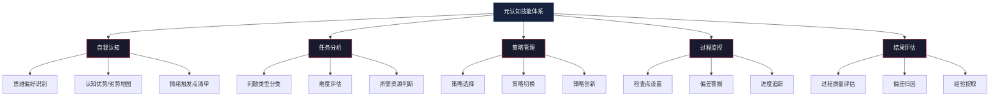
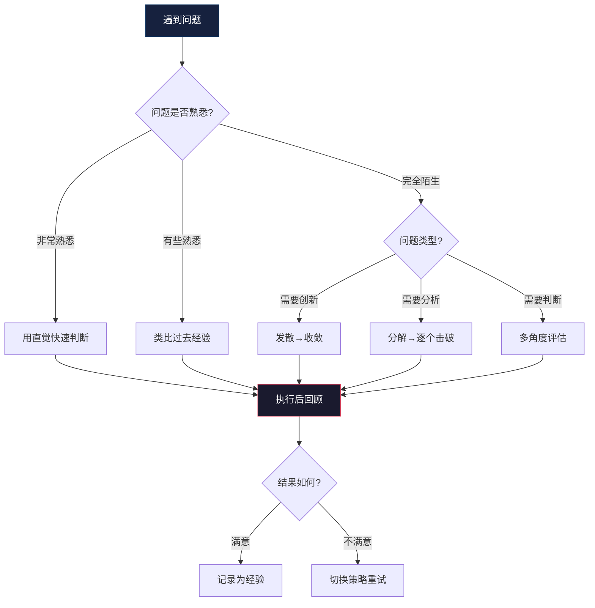
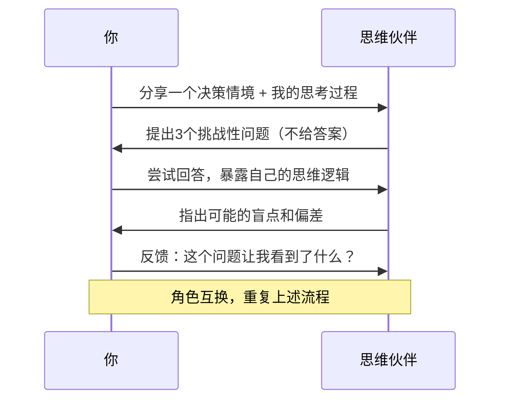
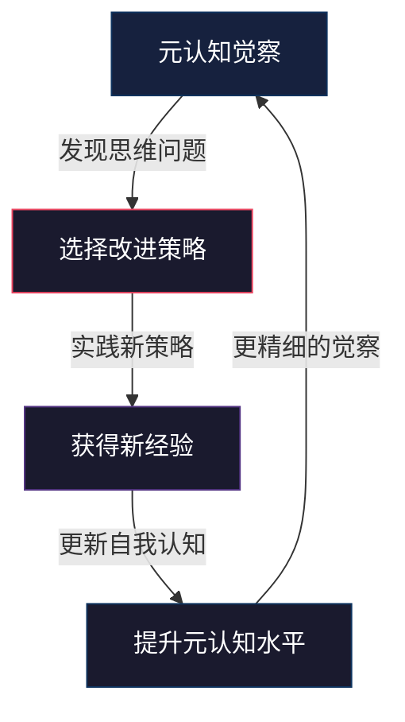

## 六、元认知：思考的思考

> "知道自己知道，知道自己不知道——这才是真正的智慧。" ——苏格拉底

你有没有经历过这样的场景：明明已经花了两小时写一份方案，回过头来才发现方向完全跑偏？或者在一次争论中赢了对方，事后却意识到自己的论证其实漏洞百出？又或者制定了无数个计划，每一次都信心满满，但执行时总是半途而废？

这些问题的根源不是"不够聪明"，而是缺少一种更高层次的能力——**元认知（Metacognition）**。

元认知是思维的"操作系统"。你学过的所有思维工具、框架、方法论，都是运行在这个操作系统上的"应用程序"。操作系统出了问题，再好的应用也跑不顺畅。反过来，操作系统一旦升级，所有应用的运行效率都会提升。

### 6.1 什么是元认知

#### 6.1.1 概念溯源

元认知这个概念由美国发展心理学家约翰·弗拉维尔（John Flavell）于1976年正式提出。Flavell将其定义为"对认知过程的知识和对认知过程的调节"（knowledge about cognition and regulation of cognition）。这一概念的提出，标志着心理学研究从"人如何思考"转向"人如何理解自己的思考"。

在Flavell之前，让·皮亚杰（Jean Piaget）的儿童认知发展理论已经暗示了元认知的存在——儿童从"前运算阶段"到"形式运算阶段"的发展，本质上就是逐步获得反思自身思维能力的过程。而弗拉维尔的工作将这一隐含的洞见提炼为一个明确的研究框架。

#### 6.1.2 完整定义

元认知是"关于认知的认知"——即对自己思维过程的**觉察、监控和调节**。它由三个相互关联的子系统构成：

| 子系统 | 功能 | 核心问题 | 日常表现 |
|--------|------|----------|----------|
| 元认知知识（Metacognitive Knowledge） | 了解自己的认知特征 | "我的思维有什么特点？" | 知道自己在疲惫时容易做出冲动决定 |
| 元认知监控（Metacognitive Monitoring） | 实时评估思维过程 | "我现在的思考质量如何？" | 感觉到自己的论证开始站不住脚 |
| 元认知调节（Metacognitive Regulation） | 根据评估调整策略 | "我应该换一种方式思考吗？" | 发现钻牛角尖后主动切换到全局视角 |

这三个子系统构成一个动态循环：

举一个具体的例子：你正在做一个职业选择（监控子系统工作），突然意识到"我现在可能过度看重薪资而忽略了成长空间"（监控子系统发出信号）。你回忆起自己过去几次决策都因为短视而后悔（知识子系统提供历史数据），于是决定用"10-10-10法则"重新评估——10分钟后、10个月后、10年后分别怎么看这个选择（调节子系统改变策略）。

这就是元认知在一次真实决策中的完整工作流程。

#### 6.1.3 为什么元认知是"元技能"

心理学家将元认知称为"元技能"（meta-skill），原因有三层：

**第一层：它决定了其他技能的上限。** 一个逻辑思维很强但元认知薄弱的人，在情绪激动时仍然会做出非理性决策——因为他不知道自己的逻辑能力在那一刻已经"离线"了。元认知就像一个质量监控系统，确保你的各项思维技能在正确的时机以正确的强度被调用。

**第二层：它是可迁移的。** 学会了在编程中运用元认知，你在写作、谈判、投资中也会自动带入这种监控能力。而其他技能（比如SQL查询优化）的迁移性则差得多。

**第三层：它是可自举的（self-bootstrapping）。** 元认知能力越强，你就越能识别自己在元认知方面的不足，从而进一步提升。这是一个正反馈循环。

研究数据支持这一判断：Dunlosky等人（2013）在《Psychological Science in the Public Interest》发表的元分析研究表明，元认知策略是少数几种被反复验证为"高效学习"的核心策略之一，其效果远超被动重读和划线等常见但低效的方法。

### 6.2 元认知的三个层次

元认知能力不是"有或没有"的二元状态，而是一个可以逐步提升的阶梯。理解这三个层次，有助于你准确定位自己当前的水平，并找到下一步的提升方向。

#### 第一层：觉察——知道自己在想什么

这是最基础的元认知能力。大多数人终其一生都没有刻意练习过这个能力——他们的思维像一条暗河，在意识的地表之下无声流动，偶尔才冒出一个想法被注意到。

觉察的本质是将无意识的思维过程拉到意识层面。它分为三个子层次：

**6.2.1 内容觉察：我在想什么？**

这听起来像一个简单到不需要练习的问题，但试试看：闭上眼睛30秒，然后告诉我你刚才在想什么。大多数人做不到精确描述——他们知道自己在"想事情"，但说不清楚具体内容，更说不清楚这些想法是怎么来的。

练习方法：

- **思维流记录**：每天选一个5分钟的窗口，不间断地把脑子里出现的任何念头写下来，不加评判。一开始你会发现自己很难跟上思维的速度，这本身就是觉察力不够的表现。坚持两周后，你会显著改善。
- **随机抽样法**：设3-4个随机闹钟，响铃时立即记录当前在想什么。一天积累下来，你会看到自己的思维"默认模式"——那个在你不需要专注时自动运行的思维程序。

**6.2.2 过程觉察：我是怎么想的？**

不仅知道内容，还要知道过程。比如：你在评估一个方案好不好，你是先看了结论再找理由（自上而下），还是先看完所有证据再得出结论（自下而上）？你在面对一个难题时，是直觉先行还是分析先行？

练习方法：

- **思维旁观者练习**：在日常活动中，定期暂停3-5秒，以第三方视角观察自己正在用什么方式思考。比如开会时，当别人提出反对意见，你暂停一下，观察自己的心理反应——是立即反驳？还是先理解？还是感到不舒服？这个暂停就是元认知的"插桩"。
- **思维标签**：给自己的思维过程贴标签。"我现在在做类比推理"、"我在用排除法"、"我在直觉判断"。标签本身就是一种觉察。

**6.2.3 情绪觉察：情绪正在如何影响我的思维？**

情绪和思维从来不是分离的。神经科学的研究（Damasio的躯体标记假说）表明，情绪是决策过程中不可或缺的一部分——但也是最容易失控的一部分。元认知的关键功能之一就是实时监测情绪对思维的"干扰信号"。

练习方法：

- **情绪-思维关联日志**：当发现自己做出一个非理性决策时，回溯当时的情绪状态。你会发现很多"理性决策"其实被情绪偷偷劫持了。模式识别是关键——你可能会发现"我在饥饿时对风险的容忍度显著降低"或者"我在受到批评后的24小时内倾向于过度保守"。
- **生理信号监控**：情绪往往先于意识出现在身体上——心跳加速、肩膀紧绷、呼吸变浅。训练自己识别这些信号，就是在情绪劫持思维之前安装了一个"早期预警系统"。

#### 第二层：评估——知道自己的思考质量

觉察让你"看到"了自己的思维，评估则让你"判断"思维的质量。这是一个更高级的能力，因为它需要一套内在的评判标准。

评估从五个维度展开：

| 维度 | 核心问题 | 常见陷阱 | 检验方法 |
|------|----------|----------|----------|
| 逻辑性 | 推理过程是否成立？ | 跳跃推理、循环论证 | 尝试把论证写成三段论形式，看中间是否有断裂 |
| 全面性 | 是否考虑了所有重要因素？ | 框架效应导致遗漏 | 主动列出"我没有考虑的因素"清单 |
| 证据支持 | 结论有没有足够的证据？ | 以个案代替统计 | 问自己"如果有人反对，我能拿出什么证据？" |
| 偏差检测 | 是否受到系统性偏差影响？ | 确认偏误、锚定效应 | 用6.4节的偏差检查清单逐一排查 |
| 情绪影响 | 情绪是否在不当干预判断？ | 恐惧导致过度保守 | 问自己"如果情绪平稳时，我会怎么想？" |

实际操作中，你不需要每次都做完整的五维评估。更可行的做法是建立"红绿灯系统"：

- **绿灯**：直觉告诉你"这件事我有把握，思考过程顺畅"——不做额外检查。
- **黄灯**：感觉"好像哪里不对"——快速扫一遍五个维度。
- **红灯**：明确意识到"这个决策很重要/我很情绪化/我缺乏经验"——完整评估，甚至暂停决策。

#### 第三层：调节——能够改变自己的思考方式

觉察和评估解决的是"发现问题"，调节解决的是"解决问题"。这是元认知的最高层能力，也是唯一能直接影响结果的层次。

调节不是一种固定技能，而是一个策略库——你需要根据具体问题选择合适的调节手段：

**策略一：思维模式切换**

大多数人都有默认的思维模式：有人习惯先想后做（分析型），有人习惯先做后想（行动型），有人习惯找人讨论（社交型）。当默认模式不奏效时，需要主动切换。

切换信号：
- 分析型的人发现自己已经想了30分钟还没开始——切换到行动模式，先做一个最小可行版本
- 行动型的人发现自己连续踩了同一个坑——切换到分析模式，停下来研究规律
- 社交型的人发现自己过度依赖他人意见——切换到独立思考模式，先形成自己的判断

**策略二：思考深度调节**

当思考停留在表面时，使用"五个为什么"（5 Whys）技术将思维逐层推深。反过来，当陷入过度分析时，使用"那又怎样？"（So What?）技术把思维拉回到核心问题。

**策略三：视角转换**

这是最强大也最难掌握的调节策略。它要求你暂时放下自己的立场，从另一个完全不同的角度看同一个问题。

具体操作框架：
- **对立面论证**：花10分钟认真为相反的观点辩护
- **角色替换**：如果是我的竞争对手/导师/5年后的自己，会怎么看这件事？
- **尺度变换**：如果这个问题发生在整个国家层面/整个公司层面/仅仅对我个人，结论会变吗？
- **时间变换**：1年后我还会这样想吗？10年后呢？

**策略四：暂停与重置**

当你意识到以下信号时，最好的策略可能是什么都不做：
- 连续思考超过90分钟未得出满意结论
- 情绪指数（愤怒、焦虑、兴奋）处于极端状态
- 已经连续修改方案超过3次，越改越混乱
- 在争论中，双方都在重复自己的观点

暂停不是放弃，而是给大脑一个"后台处理"的机会。心理学研究（Dijksterhuis的"无意识思维理论"）表明，复杂决策在意识暂停期间，大脑仍在后台加工信息，而且这种加工往往能整合更多变量。

### 6.3 元认知的核心技能体系

元认知不是单一能力，而是一组协同工作的技能。理解这个技能体系的结构，有助于你找到最薄弱的环节进行针对性训练。

#### 6.3.1 自我认知：你的"思维用户手册"

每个人的大脑都有自己的"出厂设置"和"使用习惯"。自我认知就是编写自己的"用户手册"——知道自己在什么条件下表现最好、什么条件下容易出错。

**思维偏好识别**

回答以下问题（诚实作答，不是你希望自己怎么答）：

- 面对一个新问题，你第一反应是"我来分析一下"还是"我先试试看"？
- 你更喜欢用文字、图表还是代码来表达想法？
- 在讨论中，你更倾向于先说还是先听？
- 你做决策时更依赖数据还是直觉？
- 你在安静独处时效率高，还是在热闹环境中效率高？

这些偏好没有好坏之分，但你需要知道它们——因为你最容易犯的思维错误，往往就是你的思维偏好的"副作用"。比如，依赖直觉的人容易犯"可得性偏差"，过度分析的人容易犯"分析瘫痪"。

**认知优势/劣势地图**

用一张表格绘制你的认知地图：

| 场景 | 我的优势 | 我的劣势 | 我需要注意的偏差 |
|------|----------|----------|------------------|
| 技术决策 | 逻辑清晰，善于分解 | 容易忽视人的因素 | 技术乐观主义 |
| 人际冲突 | 能看到多方立场 | 容易回避冲突 | 讨好型偏差 |
| 长期规划 | 愿意思考长远 | 执行力不足 | 计划谬误 |
| 学习新领域 | 学习速度快 | 容易浅尝辄止 | 达克效应初期 |

这张表不是一成不变的——每季度回顾一次，根据新的经历更新。

**情绪触发点清单**

每个人都有特定的情境会"触发"情绪反应，进而干扰思维。识别这些触发点是元认知防御系统的关键组件。

常见的触发点模式：
- 被质疑专业能力时 → 愤怒 → 防御性论证
- 接到紧急任务时 → 焦虑 → 冲动决策
- 收到负面反馈时 → 羞耻 → 回避或过度反应
- 看到别人成功时 → 嫉妒 → 自我贬低或盲目模仿

识别后，可以为每个触发点建立"预防协议"：在触发情境出现时，自动执行一套预设的思维流程。比如："当被质疑专业能力时，先深呼吸3次，然后问自己'对方说的有没有道理'，再决定回应方式。"

#### 6.3.2 任务分析：在思考之前思考

元认知的一个关键应用时机是在开始思考之前。大多数人的习惯是"拿到问题就开干"，但高效的思考者会先花10-15%的时间做任务分析。

**问题类型分类**

不同类型的问题需要不同的思维策略。把所有问题都用同一种方式思考，就像用同一把钥匙开所有的锁。

| 问题类型 | 特征 | 最佳策略 | 典型错误 |
|----------|------|----------|----------|
| 定义明确的问题 | 有明确的目标和约束 | 算法式、系统分析 | 过度简化 |
| 定义模糊的问题 | 目标不清晰，边界不明确 | 发散思维、迭代探索 | 过早收敛 |
| 两难选择 | 两个或多个选项都有道理 | 多维度评估、价值观排序 | 假二元思维 |
| 创造性问题 | 需要新的解决方案 | 头脑风暴、类比迁移 | 批判过早 |
| 人际问题 | 涉及他人的情绪和立场 | 换位思考、非暴力沟通 | 只从自己角度分析 |

**难度评估**

不是每个问题都值得你全力以赴。元认知的效率体现在：对简单问题使用快速直觉判断，对复杂问题投入深度分析。

快速评估框架（GRASP模型）：
- **G**oal clarity（目标清晰度）：目标清楚吗？1-5分
- **R**isk level（风险级别）：错误的代价有多大？1-5分
- **A**vailable information（信息充足度）：手头信息够吗？1-5分
- **S**takeholder complexity（利益相关方复杂度）：涉及多少人/多少立场？1-5分
- **P**recedent（先例可循度）：有类似经验可参考吗？1-5分

总分5-10分：直觉决策即可。11-17分：中等分析。18-25分：需要深度分析甚至团队讨论。

#### 6.3.3 策略管理：建立你的思维工具箱

**策略选择**

面对一个具体问题时，如何选择合适的思维策略？这里提供一个决策树：

**策略切换的时机信号**

以下信号表明当前策略可能需要切换：
- 使用同一策略超过30分钟没有进展
- 感到越来越困惑而不是越来越清晰
- 发现自己在重复相同的思路
- 情绪开始从平静变为烦躁
- 有新的重要信息出现，但当前框架无法整合

**策略创新**

有时候你的工具箱里没有现成的工具。这时候需要组合或创造新策略。比如：
- 将"思维导图"和"六顶思考帽"结合：先用思维导图发散，再用六顶帽子逐个角度收敛
- 将"第一性原理"和"类比推理"交替使用：先用第一性原理拆解，再用类比找灵感

#### 6.3.4 过程监控：思考中的"质量检查员"

**检查点设置**

长思考过程需要设置"检查点"——就像软件开发中的Code Review。在以下节点暂停，评估进展：

- **启动后10分钟**：方向对吗？在解决正确的问题吗？
- **出现第一个结论时**：这个结论过早了吗？还有其他可能性吗？
- **感到"差不多了"时**：真的够了吗？有没有遗漏关键因素？
- **即将提交/执行前**：最终检查——逻辑、证据、偏差。

**偏差警报机制**

建立自动触发的偏差检测机制。以下是7种最常见且影响最大的认知偏差，以及对应的"警报触发条件"：

| 偏差 | 触发条件 | 警报问题 | 纠正方法 |
|------|----------|----------|----------|
| 锚定效应 | 接触到第一个数字/信息后 | "如果第一个信息完全不同，我的判断会变吗？" | 主动寻找多个参考点 |
| 确认偏误 | 只在找支持自己观点的证据 | "我能列出反对自己观点的3个论据吗？" | 强制搜索反面证据 |
| 沉没成本 | 已经投入大量时间/金钱/精力 | "如果从零开始，我还会做同样的选择吗？" | 关注未来收益而非过去投入 |
| 过度自信 | 觉得"我肯定没问题" | "如果我的判断有50%的概率是错的，我会怎么做？" | 设定置信区间，留出安全边际 |
| 可得性偏差 | 最近发生的事过度影响判断 | "这是基于系统数据还是最近的个案？" | 查找基础率和统计数据 |
| 从众效应 | "大家都这么觉得" | "如果只有我一个人持这个观点，我还会坚持吗？" | 独立思考后再参考他人意见 |
| 权威偏差 | 因为说话的人地位高就降低标准 | "如果这话是普通人说的，我还会信吗？" | 评估论证本身而非说话人身份 |

#### 6.3.5 结果评估：从经验中提取智慧

思考完成不等于元认知完成。最关键的学习发生在事后回顾中。

**过程质量评估（而非结果质量）**

一个常见的陷阱是"结果论英雄"——成功了就觉得当时的做法对，失败了就觉得当时的做法错。但运气在短期结果中扮演了重要角色。

正确的评估方法：关注过程而非结果。

评估模板：
1. 我当时面临什么情境？（客观描述，不加评判）
2. 我选择了什么思维策略？为什么选它？
3. 执行过程中遇到了什么困难？我如何应对的？
4. 如果过程一样但结果不同（成功→失败，或失败→成功），我还会觉得自己的策略对吗？
5. 有什么系统性错误需要下次避免？
6. 有什么有效策略值得复制？

**经验提取的PARE框架**

从每次重要思考经历中提取经验，使用PARE框架：

- **P**attern（模式）：这次经历是否反映了某种反复出现的模式？（比如"我又在信息不足时匆忙做决定了"）
- **A**ssumption（假设）：我做了哪些假设？哪些被证实了，哪些被推翻了？
- **R**ule（规则）：这次经历是否为我增加了一条新的决策规则？（比如"涉及大额支出的决策，至少等24小时"）
- **E**xception（例外）：这次经历有什么特殊之处，使其不适用于一般规则？

### 6.4 元认知的日常训练体系

元认知不是一种"知道了就能做到"的能力，它需要系统化的训练。以下是一套完整的日常训练体系，从简单到复杂逐步展开。

#### 6.4.1 基础训练：每日思维日志

**操作方法：** 每天花10-15分钟，选择当天一个重要的思维过程或决策，用以下模板记录：

━━━━━━━━ 每日思维日志 ━━━━━━━━
日期：____
情境：____（发生了什么？触发因素是什么？）
我的判断/决策：____
使用的思维策略：____（分析型/直觉型/发散型/聚合型/...）
思维过程中的情绪状态：____（1-10分的情绪强度 + 具体情绪）
可能存在的偏差：____
替代解释/替代方案：____
（事后填写）实际结果：____
与预期的差距：____
下次可以改进的地方：____
━━━━━━━━━━━━━━━━━━━━━━━━━━━━━

**关键要点：**
- 不要追求"完美"的记录，重要的是坚持
- 重点关注"过程"而非"结果"
- 每周回顾一次本周的日志，寻找模式
- 一个月后你会开始发现自己的"思维习惯地图"

**案例示范：**

日期：2025-03-15
情境：团队讨论新功能方案，同事A提出了一个我没想到的技术路线
我的判断/决策：立即反驳，认为我的方案更好
使用的思维策略：防御性论证（这是我默认的回应模式）
思维过程中的情绪状态：7/10——轻微的威胁感 + 不服气
可能存在的偏差：确认偏误（只找自己方案的优点）、禀赋效应（高估自己方案的价值）
替代解释：同事A的方案可能在某些我没考虑的维度上更优
（事后填写）实际结果：领导采纳了A的方案，实际效果确实更好
与预期的差距：我低估了用户端性能的重要性
下次可以改进的地方：在听到不同意见时，先问3个问题再表达自己的看法

#### 6.4.2 中级训练：月度决策审计

每月花1小时，对过去一个月的重要决策进行系统回顾。

**审计流程：**

1. **决策清单**：列出本月做出的5-10个重要决策
2. **分类**：将每个决策按结果分为"好过程好结果"、"好过程坏结果"、"坏过程好结果"、"坏过程坏结果"四类
3. **重点分析**：
   - "坏过程好结果"——这是最危险的类别。坏过程偶尔也能带来好结果（运气），但这会强化你的错误习惯
   - "好过程坏结果"——这些不代表你做错了什么，重要的是坚守好习惯
4. **模式识别**：在所有决策中寻找共性——你是否在某一类问题上反复犯错？是否在特定情绪状态下决策质量下降？
5. **规则更新**：根据本月的经验，更新你的个人决策规则清单

**决策审计的Socratic问题清单：**

- "当时我有哪些信息不足？这些不足是可弥补的还是不可弥补的？"
- "如果当时有一个人完全理性的旁观者，他会怎么看我的决策？"
- "我在决策过程中花了多少时间？太多还是太少？"
- "我的情绪在决策中扮演了什么角色？是助力还是阻力？"
- "有哪些假设我默许了但没有检验？"
- "如果重新来过，考虑到当时已有的信息（不是现在的信息），我会做出不同的选择吗？"

#### 6.4.3 高级训练：认知偏差防御系统

将偏差检测从"偶尔想起来用一下"升级为"自动运行的防御系统"。

**第一步：绘制你的偏差倾向图**

根据过去的经验和自我观察，列出你最容易犯的3-5种偏差，按影响程度排序。大多数人有2-3种"主偏差"——它们是你思维风格的副作用。

**第二步：为每个主偏差建立"触发-应对"协议**

| 我的主偏差 | 典型触发情境 | 自动应对协议 |
|------------|--------------|--------------|
| 锚定效应 | 谈判、定价、估算 | 先独立估算，再看外部参考 |
| 过度自信 | 连续成功之后 | 要求自己列出"最可能出错的3个地方" |
| 沉没成本 | 已投入大量时间后 | 问"如果从零开始，我还会投入吗？" |

**第三步：在关键决策前运行"偏差检查清单"**

在做重要决策前，花5分钟逐条检查：

- [ ] 我是否受到了锚定效应的影响？（第一个接触到的信息是否过度影响了判断？）
- [ ] 我是否只在寻找支持自己观点的证据？（确认偏误：主动搜索反面证据了吗？）
- [ ] 我是否因为已经投入了太多而不愿放弃？（沉没成本：关注未来收益而非过去投入）
- [ ] 我是否高估了自己的能力或判断？（过度自信：如果50%概率是错的，我有后备方案吗？）
- [ ] 我是否受到了最近信息的影响？（可得性偏差：这基于系统数据还是个别案例？）
- [ ] 我是否因为大多数人这么做就跟着做？（从众效应：如果只有我一个人，我还会这样选择吗？）
- [ ] 我是否因为对方是权威就降低了审查标准？（权威偏差：论证本身是否站得住脚？）

#### 6.4.4 进阶训练：思维伙伴系统

独自练习元认知的最大障碍是"盲点"——你不知道自己不知道什么。思维伙伴系统通过引入外部视角来突破这个限制。

**如何选择思维伙伴：**
- 思维风格与你不同（你偏分析，他偏直觉；你偏保守，他偏进取）
- 彼此信任，能坦诚指出对方的盲点
- 对元认知训练有共同的兴趣和承诺
- 不是上下级关系（权力差异会阻碍坦诚交流）

**思维伙伴的协作模式：**

**定期讨论议题：**
- "本月我最糟糕的一次思维是什么？"（互相分享，互相分析）
- "我最近发现了一个自己的思维模式"（分享发现，请对方验证）
- "我需要你挑战我的一个观点"（主动暴露弱点，请对方攻击）

### 6.5 元认知与持续提升

#### 6.5.1 元认知的正向螺旋

元认知最深刻的特质是它的**自举性（bootstrapping）**——它是一个能够自我增强的能力。

这个螺旋的关键特征是**加速度递增**：每一次完整的觉察-策略-实践-反思循环，都会提升你下一次循环的效率。初学者可能需要刻意练习6个月才能建立基本的元认知习惯，但一旦习惯内化，元认知就变成了"自动运行的后台程序"——你不再需要刻意提醒自己去觉察，它已经成为了你思维的一部分。

#### 6.5.2 不同阶段的训练重点

| 阶段 | 时间跨度 | 训练重点 | 核心目标 |
|------|----------|----------|----------|
| 入门期 | 第1-3个月 | 每日思维日志、基础觉察练习 | 能够识别自己的思维过程和情绪状态 |
| 成长期 | 第4-8个月 | 月度决策审计、偏差检测、策略选择 | 能够评估思维质量并选择合适策略 |
| 精通期 | 第9-18个月 | 思维伙伴系统、策略创新、跨域迁移 | 元认知成为自动运行的后台能力 |
| 大师期 | 18个月以上 | 教授他人元认知、建立团队元认知文化 | 通过教学深化理解，通过文化固化习惯 |

每个阶段都有一个标志性能力可以检验：

- **入门期标志**：能够在事后回顾时准确描述自己当时的思维过程和情绪状态
- **成长期标志**：能够在思考过程中实时觉察到偏差信号并做出调整
- **精通期标志**：能够在不同领域之间迁移元认知策略——比如将编程中的调试思维迁移到人际沟通中
- **大师期标志**：能够帮助他人建立元认知能力——教学相长，教授过程中你会发现自己还有盲点

#### 6.5.3 元认知的边界与局限

元认知不是万能的。诚实地认识它的边界，本身就是一种元认知能力。

**局限一：元认知消耗认知资源。** 在疲劳、压力大、信息过载时，元认知能力会显著下降。这不是意志力的问题，而是前额叶皮层的工作机制决定的——它和所有需要自控力的功能共享同一组有限的认知资源。

应对策略：在状态好的时候做重要决策；建立"最小化决策清单"——在疲劳时只做预先定义好的决策，不尝试创新。

**局限二：元认知可能导致"过度分析"。** 有些人学会了元认知后，开始对每一个想法都进行监控和评估，结果导致行动力下降——做什么都觉得"还不够好"。

应对策略：为不同重要性的问题设定不同的元认知投入水平。小事用直觉，大事用分析，极端重要的事用完整的元认知流程。

**局限三：元认知存在"盲点的盲点"。** 你不知道自己不知道什么——这是元认知的终极悖论。即使你的元认知能力很强，仍然有一些思维模式是你看不见的，因为它们构成了你看世界的"镜片"本身。

应对策略：保持认知谦逊。定期引入外部视角（思维伙伴、导师、跨领域交流）。承认自己可能是错的——这不是软弱，是智慧。

#### 6.5.4 将元认知嵌入日常工作流

最终目标不是"专门花时间练元认知"，而是让元认知成为你日常工作流的自然组成部分。

**微习惯清单（选2-3个开始）：**

1. **晨间意图设定**（2分钟）：每天开始工作前，问自己"今天我最需要注意的思维陷阱是什么？"
2. **会议后快速复盘**（3分钟）：每次重要会议后，记录"我在会议中的思维模式是什么？有什么可以改进的？"
3. **决策前30秒扫描**：在做出任何决策前，花30秒扫一遍偏差检查清单的前3项
4. **周五回顾**（10分钟）：每周五回顾本周的3个最重要的思维/决策，提取一条经验
5. **月度审计**（1小时）：每月做一次完整的决策审计

正如查理·芒格所说："获取智慧是一种道德责任。"元认知是获取智慧的钥匙——它让你不仅知道更多，还能更好地运用你所知道的一切。更重要的是，它让你成为一个持续进化的思考者——不是因为你在不断获取新知识，而是因为你在不断优化运用知识的方式。

这不是一条轻松的路。但每一个走上这条路的人，都会发现自己在做出更好的决策、拥有更清晰的思维、过着更有意识的生活。而这一切，从一个问题开始：**"我刚才，是怎么想的？"**
