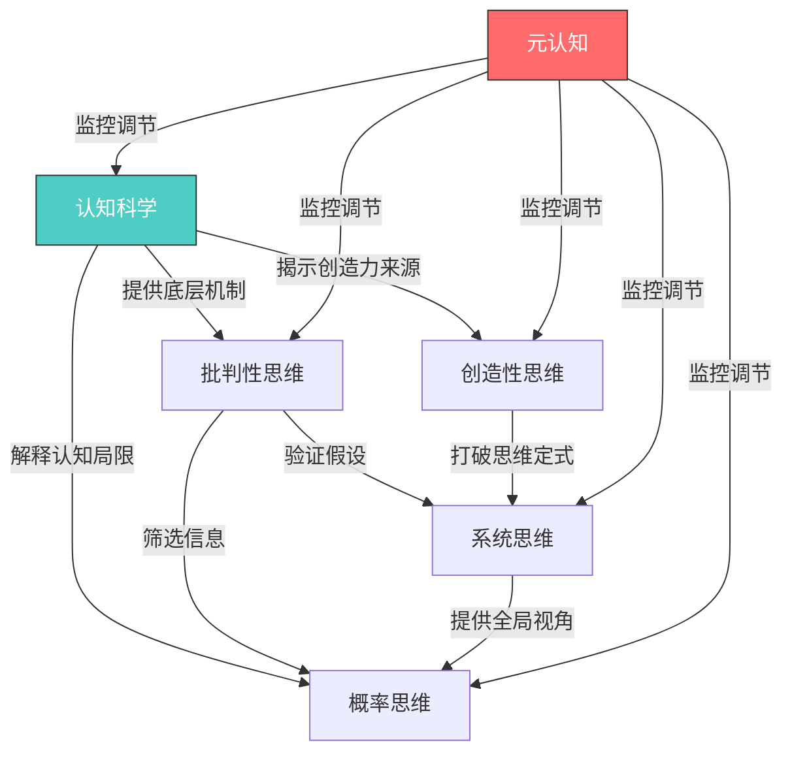
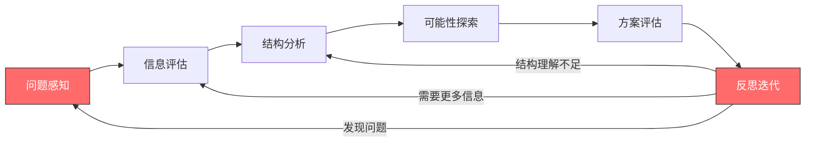

## 七、六大领域的整合

前六节分别深入探讨了认知科学、批判性思维、创造性思维、系统思维、概率思维和元认知。然而在真实世界中，没有任何问题会贴心地标注"请用批判性思维解决"或"此处需要系统思维"。**真正强大的思维者，不是掌握六种独立工具的工匠，而是能让这六种能力自然融合、协同运作的高手。** 本节将揭示六大领域之间的深层关联，构建一个统一的思维操作系统。

### 7.1 六大领域的角色定位与协作关系

#### 7.1.1 各领域的核心角色

可以把六大领域想象成一个交响乐团——每种乐器都有独特的音色，但只有协同演奏才能创造伟大的音乐：

| 领域 | 核心角色 | 核心问题 | 类比 |
|------|---------|---------|------|
| 认知科学 | 基础设施 | 大脑如何运作？ | 乐团的声学环境 |
| 批判性思维 | 质量守门员 | 这个信息/论证可靠吗？ | 调音师 |
| 创造性思维 | 突破引擎 | 有什么新的可能性？ | 即兴独奏者 |
| 系统思维 | 全局视野 | 整体结构是什么？ | 指挥家 |
| 概率思维 | 决策校准 | 有多大可能？ | 节拍器 |
| 元认知 | 过程监控 | 我的思考方式对吗？ | 录音监听 |

#### 7.1.2 协作关系网络

六大领域之间不是简单的线性关系，而是一个多向协作网络：

**认知科学是地基**——理解大脑的双系统运作、认知偏差的来源、注意力和记忆的局限，才能理解其他五种能力为什么必要以及如何发挥作用。

**元认知是操作系统**——它监控和调节其他所有思维过程。没有元认知，你不知道自己正在犯错，也就无法启动纠错机制。

**批判性思维是过滤器**——在信息输入端把关，确保进入思维系统的信息是可靠的、论证是有效的。

**创造性思维是发散器**——在需要突破时打开新的可能性空间，防止思维被困在已知框架中。

**系统思维是整合器**——把碎片化的信息组织成有机的结构，看到因果关系、反馈循环和涌现特性。

**概率思维是校准器**——为所有判断和决策赋予量化的置信度，避免全有或全无的极端判断。

### 7.2 整合思维的运作机制

#### 7.2.1 六阶段整合模型

面对一个复杂问题时，整合思维的运作可以分解为六个阶段。这不是死板的线性流程，而是一个可以循环迭代的动态过程：

**阶段一：问题感知（元认知 + 认知科学）**

首先用元认知觉察自己面对的是什么类型的问题，同时调用认知科学知识识别可能的认知陷阱。

触发问题 →
  元认知提问："这是什么类型的问题？我的第一反应是什么？第一反应可靠吗？"
  认知科学检查："我是否陷入了锚定效应？是否受到可得性启发的影响？"

**阶段二：信息评估（批判性思维）**

对获取的信息进行质量筛选，识别偏见、谬误和不可靠来源。

- 信息来源是否可靠？是否有利益冲突？
- 论证逻辑是否成立？是否存在偷换概念或循环论证？
- 数据是否完整？是否有选择性呈现？

**阶段三：结构分析（系统思维）**

将问题放入更大的系统中理解，识别关键变量、反馈循环和杠杆点。

- 这个问题涉及哪些子系统？
- 存在哪些正反馈和负反馈循环？
- 哪些是杠杆点——小改变能产生大效果的位置？

**阶段四：可能性探索（创造性思维）**

在理解了问题结构之后，用创造性思维突破现有框架，产生新的解决方案。

- 如果打破现有假设，还有什么可能？
- 其他领域有哪些类似问题的解法可以迁移？
- 最疯狂的想法中是否隐藏着可行的核心？

**阶段五：方案评估（概率思维）**

对不同方案进行概率评估，考虑基础概率、条件概率和不确定性。

- 每个方案成功的先验概率是多少？
- 需要哪些条件同时成立？这些条件同时成立的概率是多少？
- 最坏情况的概率和后果是什么？

**阶段六：反思迭代（元认知）**

对整个过程进行反思，评估思维质量，识别改进空间。

- 我的分析是否遗漏了重要因素？
- 我是否因为情感偏好而偏向某个方案？
- 如果结果不好，最可能的原因是什么？

#### 7.2.2 不同问题类型的侧重组合

不同类型的问题需要不同的能力组合。高手的标志是能快速判断问题类型，调用正确的组合：

| 问题类型 | 核心组合 | 典型场景 | 示例 |
|---------|---------|---------|------|
| 信息判断型 | 批判性思维 + 概率思维 | 新闻真伪、投资信息、健康建议 | "这个研究结论可靠吗？" |
| 复杂决策型 | 系统思维 + 概率思维 + 批判性思维 | 职业选择、商业战略、人生规划 | "我应该跳槽还是留下？" |
| 创新突破型 | 创造性思维 + 系统思维 | 产品设计、问题解决、艺术创作 | "如何用全新方式解决这个问题？" |
| 学习理解型 | 认知科学 + 批判性思维 + 元认知 | 学科知识、技能习得、理论理解 | "我真的理解了这个概念吗？" |
| 风险评估型 | 概率思维 + 系统思维 + 批判性思维 | 投资决策、项目风险、健康风险 | "这件事的风险到底有多大？" |
| 自我改进型 | 元认知 + 认知科学 | 习惯改变、思维纠偏、能力提升 | "我的思维方式哪里出了问题？" |

### 7.3 实战案例：整合思维的应用

#### 7.3.1 案例一：职业转型决策

假设你是一名30岁的程序员，正在考虑转型做产品经理。这个决策需要调动全部六种能力：

**元认知启动**：我为什么想转型？是因为真的对产品感兴趣，还是因为最近工作不顺在逃避？——识别真实动机，排除情绪干扰。

**批判性思维审查**：我收集的转型信息是否全面？那些成功转型的案例是否是幸存者偏差？朋友圈里转型成功的案例和失败的比例是多少？

**系统思维分析**：转型涉及多个子系统——收入变化、技能缺口、家庭影响、行业趋势。需要画出因果回路图，识别强化回路（新技能→新机会→更多新技能）和平衡回路（转型压力→焦虑→表现下降→更多压力）。

**创造性思维探索**：除了"转"或"不转"的二元选择，有没有第三条路？比如内部转岗、技术型产品经理、兼职试水、利用技术背景做产品咨询？

**概率思维评估**：转型成功的概率取决于多个条件——学习能力、行业时机、经济环境、家庭支持。每个条件单独成立的概率可能有70%，但五个条件同时成立的概率只有0.7^5 ≈ 17%。这个计算让你对风险有清醒的认识。

**元认知反思**：我是否因为沉没成本而犹豫？是否因为过度自信而低估了转型难度？我对产品经理工作的想象是否准确？

#### 7.3.2 案例二：评估一个创业想法

你的朋友邀请你投资他的AI教育创业项目，投资额50万元。

**批判性思维**：他的商业计划书中的市场规模数据来源是什么？是否引用了权威机构的数据？竞品分析是否完整？财务预测的假设是否合理？

**概率思维**：创业公司五年存活率不到10%。这是基础概率（基准率）。然后用贝叶斯更新——他的团队有相关经验（正面证据，更新后存活率提升到15%），但赛道已经很拥挤（负面证据，更新回12%），他有独家技术专利（正面证据，更新到18%）。最终估计存活概率约18%。

**系统思维**：这个创业项目处于什么系统中？教育行业的政策环境、AI技术的发展速度、资本市场的热度、用户付费意愿的变化趋势——这些系统性因素如何影响项目前景？

**创造性思维**：如果这个项目失败了，有没有其他方式参与这个趋势？比如投资AI教育ETF、在现有公司内部推动AI教育项目、以顾问而非投资者的身份参与？

**认知科学检查**：我是否因为朋友关系而产生了信任偏差？是否因为"AI"这个热门标签而被光环效应影响？

**元认知决策**：综合所有分析，我的真实判断是什么？我是否能承受50万元全部亏损的最坏情况？

#### 7.3.3 案例三：日常信息判断——"某食物致癌"

社交媒体上出现一篇文章声称"XX食物致癌"，如何用整合思维判断？

| 步骤 | 能力 | 具体操作 |
|------|------|---------|
| 1. 先停一停 | 元认知 | 觉察自己的恐慌情绪，不转发、不传播，先分析 |
| 2. 检查来源 | 批判性思维 | 文章引用的研究是否发表在权威期刊？作者是否有相关资质？ |
| 3. 检查逻辑 | 批判性思维 | 是否混淆了"相关"和"因果"？剂量是否达到有害水平？ |
| 4. 查看基础概率 | 概率思维 | 这个食物导致癌症的绝对风险增加多少？从万分之一增加到万分之二？ |
| 5. 系统性思考 | 系统思维 | 如果不吃这个食物，替代食物是否也有其他风险？整体饮食模式比单一食物更重要 |
| 6. 反思自己的反应 | 元认知 | 我是否因为恐惧而过度反应了？这种恐惧是合理的还是被媒体放大的？ |

### 7.4 整合能力的训练方法

#### 7.4.1 日常微训练：思维日记

每天花10分钟，选择一个当天遇到的问题或决策，用六领域框架进行简要分析：

【日期】2024-XX-XX
【问题】是否接受同事的聚餐邀请

【元认知】我为什么犹豫？是因为社交焦虑还是真的有事？
【批判性思维】我预设"聚餐很无聊"的依据是什么？上次的体验？还是偏见？
【系统思维】拒绝聚餐对我的人际关系有什么长期影响？正反馈循环是什么？
【创造性思维】除了去或不去，有没有第三种选择？比如参加但提前离开？
【概率思维】去了之后真的无聊的概率有多大？可能有意外收获的概率呢？
【元认知反思】我是一个经常高估社交成本、低估社交收益的人吗？

#### 7.4.2 周度练习：多视角写作

每周选一个争议性话题，用六种视角分别写一段分析。例如"远程办公是否应该成为常态"：

- **认知科学视角**：远程办公如何影响注意力、创造力和社交需求？
- **批判性思维视角**：支持远程办公的研究是否可靠？是否存在选择偏差？
- **创造性思维视角**：除了"全远程"和"全坐班"，有什么创新的工作模式？
- **系统思维视角**：远程办公对城市经济、家庭关系、碳排放的系统性影响是什么？
- **概率思维视角**：远程办公提高/降低效率的概率各是多少？取决于什么条件？
- **元认知视角**：我对远程办公的态度是否受到了个人偏好的过度影响？

#### 7.4.3 月度项目：真实问题解决

每月选择一个真实面临的问题，完整走一遍六阶段整合模型。关键要求：

1. **书面化**：把每个阶段的思考过程写下来，不要只在脑子里想
2. **记录预测**：在做出决策前，写下你的预期结果和置信度
3. **事后复盘**：一个月后回顾，实际结果和预期是否一致？偏差来自哪里？
4. **识别模式**：连续几个月后，你会发现自己在哪些环节经常出错

#### 7.4.4 建立个人思维检查清单

随着训练的深入，逐步建立适合自己的检查清单。以下是参考模板：

【决策前检查清单】

□ 我是否清楚自己的真实目标？（元认知）
□ 我是否受到了情绪的过度影响？（认知科学 + 元认知）
□ 我的信息来源是否多元且可靠？（批判性思维）
□ 我是否考虑了系统性的影响因素？（系统思维）
□ 我是否探索了足够多的替代方案？（创造性思维）
□ 我对结果的概率估计是否合理？（概率思维）
□ 如果最好的朋友面临同样情况，我会给什么建议？（去偏见）
□ 一年后回头看，我会为这个决定后悔吗？（时间透视）

### 7.5 从刻意到自然：整合思维的进阶之路

#### 7.5.1 四个发展阶段

整合思维的习得遵循从刻意到自然的一般规律：

**第一阶段：无意识不胜任**——不知道自己需要这些思维工具。面对复杂问题凭直觉和情绪反应，经常做出事后后悔的决定。

**第二阶段：有意识不胜任**——学了理论但还不熟练。知道应该用批判性思维审查信息，但在实际场景中经常忘记，或者知道该用但用不好。这个阶段会感到"越学越觉得自己笨"，这是正常的——因为你开始看到以前看不到的错误。

**第三阶段：有意识胜任**——能在需要时主动调用正确的思维工具，但还需要刻意努力。像刚拿到驾照的新手，能正确驾驶但需要全神贯注。

**第四阶段：无意识胜任**——思维工具内化为直觉。面对问题时自然地进行系统分析、概率评估和批判审查，就像老司机驾驶一样自动化。这是整合思维的最终目标。

#### 7.5.2 从第四阶段再出发：专家的"新手心态"

值得注意的是，即使达到了第四阶段，也需要保持警惕。思维的自动化是一把双刃剑——它提高了效率，但也可能导致"专家盲区"。最优秀的思维者会在自动化的熟练和初学者的好奇之间保持动态平衡：

- 定期质疑自己习以为常的思维模式
- 对新信息保持开放，即使它挑战了自己深信的观点
- 在重要决策面前，刻意放慢思考速度，启动完整的六阶段分析

#### 7.5.3 常见的整合失败模式

在实际应用中，整合思维常见的失败模式包括：

**单打独斗**：只用一种思维工具解决所有问题。比如过度依赖批判性思维的人会变成"什么都怀疑"的杠精，过度依赖创造性思维的人会变成"什么都敢想"但不落地的空想家。

**工具误用**：在需要创造性思维的场合启动了批判性思维（过早否定新想法），或者在需要批判性思维的场合启动了创造性思维（对明显有漏洞的计划过度乐观）。

**元认知缺席**：前五种工具都在运转，但没有元认知的监控。就像一支没有指挥的乐团，每种乐器都在演奏，但整体不和谐。

**理论脱离实践**：学了很多理论但从不练习。思维能力跟肌肉一样，不用就会退化。

### 7.6 整合思维与人生质量

#### 7.6.1 思维质量决定人生质量

查理·芒格说过："如果我知道我会死在哪里，我就永远不去那个地方。"这句话的背后是概率思维（识别高风险区域）、系统思维（理解因果链）和批判性思维（不被表面现象迷惑）的整合应用。

整合思维的价值不在于让你成为全知全能的人，而在于：

1. **减少可避免的错误**：很多人生遗憾源于可以被理性分析避免的错误决策
2. **提高信息环境的质量**：在信息爆炸时代，批判性思维是最重要的过滤器
3. **增强适应能力**：系统思维让你在变化中看到结构，不被表象迷惑
4. **保持心理平衡**：概率思维让你对好事和坏事都有合理的预期
5. **持续自我进化**：元认知确保你不断发现和修正自己的盲点

#### 7.6.2 整合思维者的特征

长期练习整合思维的人，通常会表现出以下特征：

- **决策时从容不迫**：不是因为不在乎，而是因为有系统化的分析框架
- **面对不确定性时心态平稳**：理解了世界的概率本质，不再追求100%的确定性
- **对新观点保持开放**：知道自己的认知局限，愿意被说服
- **看问题有深度也有广度**：既能深入细节，也能抽身看全局
- **自我觉察水平高**：清楚自己的偏见和情绪如何影响判断

这些特征不是天生的，而是通过长期刻意练习逐步形成的。思维提升是一场终身修炼，而六大领域的整合是这场修炼的核心功夫。

***

> **本节核心要点**：
> 1. 六大思维领域不是孤立技能，而是有机协作的整体——认知科学是地基，元认知是操作系统，其他四种是功能模块
> 2. 整合思维遵循六阶段模型：问题感知→信息评估→结构分析→可能性探索→方案评估→反思迭代
> 3. 不同问题类型需要不同的能力组合，高手能快速判断并调用正确的组合
> 4. 整合能力通过思维日记、多视角写作、真实问题解决和检查清单来训练
> 5. 习得过程经历四个阶段：无意识不胜任→有意识不胜任→有意识胜任→无意识胜任
> 6. 整合思维的终极价值不是掌握更多技巧，而是形成自然的高质量思维习惯，减少可避免的错误，持续自我进化
