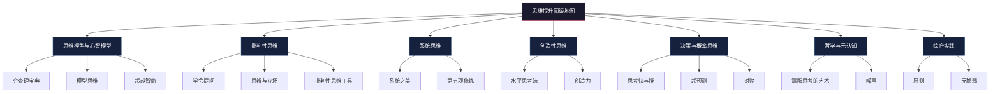

## 一、经典书籍推荐

阅读是思维提升最系统、最经济的途径。一本好书浓缩了作者数十年的研究和实践，读者花几十小时就能内化这些成果。但思维类书籍数量庞大，盲目阅读效率极低——你需要一张清晰的阅读地图，告诉你先读什么、怎么读、读到什么程度。

本节按"思维提升"的知识体系，将经典书籍分为七个模块，每个模块给出必读、进阶、选读三个层级，并附上阅读顺序、难度标注、核心收获和实操建议。无论你是零基础入门还是资深思考者，都能找到适合自己的路径。

### 阅读路径总览

**推荐阅读顺序（零基础路线）：**

| 阶段 | 书目 | 目标 | 预计时间 |
|------|------|------|----------|
| 第一阶段：建立基础 | 《学会提问》→《清醒思考的艺术》 | 学会识别谬误，建立批判意识 | 3-4 周 |
| 第二阶段：理解决策 | 《思考，快与慢》→《超越智商》 | 理解认知偏差的底层机制 | 4-6 周 |
| 第三阶段：掌握工具 | 《系统之美》→《模型思维》→《穷查理宝典》 | 获得系统化的思维工具箱 | 6-8 周 |
| 第四阶段：概率与决策 | 《对赌》→《超预测》→《噪声》 | 在不确定性中做出更好的判断 | 4-6 周 |
| 第五阶段：综合应用 | 《反脆弱》→《原则》→《第五项修炼》 | 构建个人决策系统 | 6-8 周 |
| 第六阶段：创造力提升 | 《水平思考法》→《创造力》 | 突破思维定势，产生创新想法 | 3-4 周 |

---

### 1.1 思维模型与心智模型

思维模型是思维的"积木块"——你拥有的模型越多、越精确，看问题就越全面。查理·芒格说："手里只有锤子的人，看什么都像钉子。"这个模块的书帮你获得一整套工具箱，而不只是一把锤子。

#### 《穷查理宝典》（Poor Charlie's Almanack）

- **作者**：彼得·考夫曼 编
- **难度**：★★★★☆（部分章节需要商业和投资背景）
- **核心价值**：查理·芒格的智慧精华，核心理念是"多元思维模型格栅"——从物理学、生物学、心理学、经济学、数学等学科各取一个最有力的模型，组合使用来分析问题。芒格提出的"人类误判心理学"（25种心理倾向）是全书最精华的部分，每一种倾向都配有真实商业案例。
- **关键概念**：
  - **多元思维模型格栅**：不依赖单一学科视角，而是将多个学科的核心模型交叉运用。比如分析一个商业决策时，同时运用心理学（确认偏误）、数学（复利效应）、生物学（进化适应）的视角。
  - **25种人类误判心理学**：奖励和惩罚超级反应倾向、喜欢/热爱倾向、讨厌/憎恨倾向、避免怀疑倾向、避免不一致性倾向、好奇心倾向、康德式公平倾向、羡慕/妒忌倾向、回馈倾向、受简单联想影响的倾向、简单的避免痛苦的心理否认、自视过高倾向、过度乐观倾向、被剥夺超级反应倾向、社会认同倾向、对比错误反应倾向、压力影响倾向、错误衡量易得性倾向、不用就忘倾向、化学物质错误影响倾向、衰老错误影响倾向、权威错误影响倾向、废话倾向、重视理由倾向、lollapalooza倾向（多因素叠加效应）。
  - **能力圈原则**：只在自己真正理解的领域做决策，诚实面对自己的无知边界。
- **阅读建议**：不必从头到尾阅读。先读"人类误判心理学"章节（这是全书核心），再读核心演讲（1994年南加州大学商学院演讲最经典），最后翻阅感兴趣的案例。建议做一张25种误判倾向的清单，贴在工作区，遇到决策时逐条对照检查。
- **适合人群**：所有希望提升思维质量的读者，尤其适合需要做重大决策的管理者和投资者。
- **中译本说明**：中译本翻译质量不错，但部分投资案例的语境需要读者自行补充。如果英文阅读能力允许，建议读英文原版。

#### 《模型思维》（The Model Thinker）

- **作者**：斯科特·佩奇（Scott Page）
- **难度**：★★★☆☆（涉及统计学和数学概念，但解释清晰）
- **核心价值**：密歇根大学"模型思维"MOOC课程的配套教材，系统介绍了24种思维模型，从正态分布、幂律分布到网络模型、博弈论模型、马尔可夫模型等。核心主张是"多模型思维"（Many-Model Thinking）——面对任何复杂问题，使用2-3个独立模型分析，取交集得出结论，比单一模型准确得多。
- **关键模型清单**：

| 模型类别 | 代表模型 | 应用场景 |
|----------|----------|----------|
| 分布模型 | 正态分布、幂律分布、长尾分布 | 理解数据的分布规律，识别异常值 |
| 网络模型 | 六度分隔、偏好依附、小世界网络 | 社交网络分析、信息传播、组织设计 |
| 博弈论模型 | 囚徒困境、纳什均衡、协调博弈 | 竞争策略、合作机制设计 |
| 决策模型 | 多属性决策、投票模型、排序模型 | 产品选择、团队决策、资源配置 |
| 随机模型 | 马尔可夫链、随机游走、蒙特卡洛 | 状态预测、风险评估、模拟 |

- **阅读建议**：每章独立，可以按兴趣跳跃阅读。建议先读第一章（概述）和最后两章（综合应用），再按需要选读中间章节。读完每章后，尝试用该模型分析一个自己遇到的真实问题，这是巩固理解的最佳方式。
- **适合人群**：希望系统学习思维模型的读者。有数据分析背景会更容易上手，但没有也不影响理解核心思想。

#### 《超越智商：为什么聪明人也会做蠢事》（What Intelligence Tests Miss / Rationality）

- **作者**：基思·斯坦诺维奇（Keith Stanovich）
- **难度**：★★★☆☆（学术性较强，但论证清晰）
- **核心价值**：斯坦诺维奇是认知科学领域的权威学者，这本书的核心论点是：智商测试只测量了认知能力的一部分（流体智力和晶体智力），但遗漏了"理性思维"这个独立维度。一个人可以智商很高，但因为缺乏理性思维工具，在实际决策中频频犯错。他将这种缺失称为"理性障碍"（dysrationalia）。
- **关键概念**：
  - **思维的双过程理论**：系统1（快速、自动、直觉）和系统2（缓慢、费力、分析）的运作机制，以及为什么系统1经常出错。
  - **认知吝啬鬼**：大脑天生倾向于用最少的认知资源处理信息，这导致我们倾向于使用简单的启发式而非深入分析。
  - **理性思维的三大障碍**：处理能力缺陷（缺乏概率思维等工具）、心智程序缺陷（没有安装正确的思维"软件"）、心智程序污染（安装了错误的思维"软件"，如阴谋论思维）。
- **阅读建议**：这本书与《思考，快与慢》有大量交叉内容，但角度不同——卡尼曼侧重于描述偏差，斯坦诺维奇侧重于如何克服偏差。建议先读《思考，快与慢》，再读本书作为"治疗方案"。
- **适合人群**：希望理解认知偏差根源并找到系统性纠正方法的读者。

#### 补充推荐

- **《清醒思考的艺术》**（The Art of Thinking Clearly）——罗尔夫·多贝里著。52个认知偏差的短篇集合，每篇2-3页，适合碎片化阅读。作为认知偏差的"速查手册"非常实用，但深度有限，适合入门后作为日常提醒。
- **《穷查理宝典》vs《模型思维》对比**：前者偏商业智慧和人生哲学，案例丰富但模型不够系统；后者偏学术系统化，模型完整但商业案例较少。建议两者都读，互相补充。

---

### 1.2 批判性思维

批判性思维是所有思维能力的基础——如果你不能识别论证中的漏洞，其他所有思维工具都会被错误的输入所污染。这个模块教你如何审视信息、分析论证、识别谬误。

#### 《学会提问》（Asking the Right Questions）

- **作者**：尼尔·布朗（Neil Browne）、斯图尔特·基利（Stuart Keeley）
- **难度**：★★☆☆☆（入门级，语言通俗，案例贴近生活）
- **核心价值**：批判性思维领域最经典的入门教材，已经出到第12版。全书围绕一套系统的提问框架展开：论题和结论是什么？理由是什么？哪些词语意思不明确？什么是价值观假设和描述性假设？推理过程中有没有谬误？证据的效力如何？有没有替代原因？数据有没有欺骗性？有没有被忽略的重要信息？能得出哪些合理的结论？
- **核心框架（10步提问法）**：
  1. 论题是什么？结论是什么？
  2. 理由是什么？
  3. 哪些词语意思不明确（有歧义）？
  4. 什么是价值观假设和描述性假设？
  5. 推理过程中有没有谬误？
  6. 证据的效力如何？
  7. 有没有替代原因？
  8. 数据有没有欺骗性？
  9. 有没有被忽略的重要信息？
  10. 能得出哪些合理的结论？
- **阅读建议**：这是一本"练"比"读"更重要的书。每读完一章，立即找一篇新闻报道或社交媒体帖子，用该章的提问框架进行分析。坚持练习2-3周，批判性思维就会成为你的本能反应。
- **适合人群**：批判性思维零基础的读者，大学生、职场新人。

#### 《思辨与立场》（Critical Thinking: Tools for Taking Charge of Your Professional and Personal Life）

- **作者**：理查德·保罗（Richard Paul）、琳达·埃尔德（Linda Elder）
- **难度**：★★★☆☆（框架性强，需要一定的抽象思维能力）
- **核心价值**：构建了批判性思维最完整的三维框架——思维元素（目的、问题、信息、概念、假设、推理、结论、影响）、思维标准（清晰性、准确性、精确性、相关性、深度、广度、逻辑性、重要性、公正性）、思维特质（谦逊、勇气、同理心、正直、毅力、信心、自主性）。这个框架让你不仅能分析别人的论证，还能系统地改进自己的思维过程。
- **关键工具**：
  - **思维元素检核表**：每次思考时，检查自己的思维是否包含了所有8个元素。
  - **思维标准评估矩阵**：用9个标准评估每个思维元素的质量。
  - **思维特质自评量表**：定期评估自己在7个思维特质上的表现。
- **阅读建议**：建议与《学会提问》配合使用——前者教你分析外部信息，后者教你优化内部思维。读完后制作一张个人的"思维检核卡"，每天反思时使用。
- **适合人群**：已经掌握批判性思维基础、希望进一步系统化的读者。

#### 补充推荐

- **《批判性思维工具》**（Critical Thinking: Tools for Clinical Reasoning）——侧重于医学和临床领域的批判性思维应用，但其中的思维工具具有普适性。
- **《逻辑学导论》**（Introduction to Logic）——柯匹和科恩著。如果想从形式逻辑层面夯实批判性思维的基础，这本书是权威教材。但篇幅较长（700+页），建议作为参考书查阅而非通读。

---

### 1.3 系统思维

线性思维让我们只能看到因果链上的一段，系统思维让我们看到整个网络。理解了系统，你就能理解为什么"好心办坏事"、为什么"治标不治本"、为什么"按下葫芦浮起瓢"。

#### 《系统之美》（Thinking in Systems: A Primer）

- **作者**：德内拉·梅多斯（Donella Meadows）
- **难度**：★★☆☆☆（入门级，语言优美，案例直观）
- **核心价值**：系统思维最好的入门书，没有之一。梅多斯是"罗马俱乐部"报告《增长的极限》的核心作者，她用极其通俗的语言解释了系统的基本结构：存量、流量、反馈回路（正反馈和负反馈）、延迟效应。全书最有价值的部分是"杠杆点"理论——在系统中，不同位置的干预效果差异巨大，找到杠杆点就能"四两拨千斤"。
- **关键概念**：
  - **存量与流量**：存量是系统中可测量的积累量（如水库中的水），流量是改变存量的速率（如流入和流出）。理解存量-流量关系是理解所有动态系统的基础。
  - **正反馈与负反馈**：正反馈放大变化（如复利效应、病毒传播），负反馈维持稳定（如体温调节、市场供需平衡）。
  - **12个杠杆点**（按影响力从小到大排列）：
    1. 数字（如补贴金额、税率）——效果最弱
    2. 缓冲区（库存大小）
    3. 存量-流量结构（物理系统及其交汇节点）
    4. 延迟（系统变化的速度）
    5. 负反馈回路的强度
    6. 正反馈回路的驱动力
    7. 信息流（谁能看到什么信息）
    8. 规则（激励、惩罚、约束）
    9. 自组织（系统自我进化的能力）
    10. 目标（系统的目的）
    11. 范式（系统的根本信念和假设）
    12. 超越范式（保持灵活，不执着于任何范式）——效果最强
- **阅读建议**：全书不长（约200页），建议一口气读完，建立整体框架。读完后用系统图分析一个你生活中的实际系统（如你的工作流程、你的消费习惯、你的人际关系网络），标注其中的存量、流量和反馈回路。
- **适合人群**：所有人。这是思维提升书单中优先级最高的书之一。

#### 《第五项修炼》（The Fifth Discipline）

- **作者**：彼得·圣吉（Peter Senge）
- **难度**：★★★★☆（偏管理学，部分章节需要组织管理背景）
- **核心价值**：将系统思维从个人工具提升为组织工具。圣吉提出了"学习型组织"的五项修炼：自我超越、心智模式、共同愿景、团队学习、系统思维（第五项）。书中大量使用"系统基模"（system archetypes）来解释组织中的常见困境。
- **关键系统基模**：
  - **增长极限**：增长触发了抑制增长的负反馈，越努力增长越慢。对策：找到并消除限制因素。
  - **舍本逐末**：用短期对症方案替代根本解，导致问题越来越依赖对症方案。对策：坚持根本解，即使短期效果不明显。
  - **成长与投资不足**：因为对增长不够自信而投资不足，最终限制了增长能力。对策：提前投资于未来产能。
  - **饮鸩止渴**：一个对策产生的副作用会恶化原来的问题。对策：识别并减少任何有副作用的对策。
  - **目标侵蚀**：对问题的容忍度逐渐提高，目标不断降低。对策：坚持绝对标准，不随环境妥协。
- **阅读建议**：先读第1-2章（理解系统思维的重要性），再读第5章（系统基模详解），最后读其他章节。如果你不是管理者，可以跳过第3-4章中关于组织学习的部分。
- **适合人群**：管理者、创业者、团队领导者。个人读者建议先读《系统之美》打基础。

#### 补充推荐

- **《增长的极限》**（Limits to Growth）——梅多斯等著。用系统动力学模型预测全球资源消耗趋势，是系统思维在宏观问题上的经典应用。读完《系统之美》后可以翻阅。
- **《系统思维》**（Systems Thinking for Social Innovation）——约翰·斯特曼著。更学术化的系统思维教材，包含大量系统动力学建模案例，适合想深入建模技术的读者。

---

### 1.4 创造性思维

创新不是天赋，而是方法。这个模块的书教你如何用系统化的方法产生创意，打破思维定势。

#### 《水平思考法》（Lateral Thinking: Creativity Step by Step）

- **作者**：爱德华·德博诺（Edward de Bono）
- **难度**：★★☆☆☆（工具性强，实操性高）
- **核心价值**：德博诺是"创造性思维"领域的奠基人，他创造了"水平思考"（Lateral Thinking）这个概念。与"垂直思考"（深入挖掘同一个思路）不同，水平思考强调跳出现有框架，从完全不同的角度看待问题。书中提供了多种具体的创意激发工具。
- **核心工具**：
  - **随机词汇法**：从词典中随机选择一个词，强制将它与当前问题建立联系，从而产生新的联想。例如，要改进杯子的设计，随机词是"云"，由此联想到"轻盈"→用更轻的材料；"变化"→能变色的杯子；"漂浮"→带悬浮底座的杯子。
  - **六顶思考帽**：白帽（事实数据）、红帽（直觉情感）、黑帽（风险批判）、黄帽（乐观价值）、绿帽（创意新意）、蓝帽（过程控制）。通过轮流"戴帽"，团队可以从不同角度系统地分析问题，避免混乱的争论。
  - **概念提取法**：从现有方案中提取核心概念，然后寻找实现同一概念的替代方案。例如，"铅笔"的核心概念是"可擦除的书写工具"，由此可以想到可擦墨水笔、电子手写板等。
  - **PO思维**（Provocation Operation）：故意提出一个荒谬或反直觉的假设（如"PO：汽车应该有方形轮子"），然后从中寻找有价值的想法。
- **阅读建议**：每读完一个工具，立即用它解决一个你实际面临的问题。六顶思考帽特别适合在团队会议中实践——下次开会时主动提议使用这个方法。
- **适合人群**：需要在工作中产生创意的所有人，特别是产品经理、设计师、创业者。

#### 《创造力》（Creativity: Flow and the Psychology of Discovery and Invention）

- **作者**：米哈里·契克森米哈赖（Mihaly Csikszentmihalyi）
- **难度**：★★★☆☆（研究性质较强，需要耐心阅读）
- **核心价值**：契克森米哈赖以"心流"理论闻名，这本书是他对创造力的系统研究。他采访了91位杰出的创意人士（包括14位诺贝尔奖得主），总结出创造力的三大要素：个人（产生新颖想法的能力）、领域（相关知识和技能）、环境（社会和文化环境）。书中揭示了一个反直觉的发现：最具创造力的人往往同时拥有看似矛盾的特质（既开放又保守，既敏感又坚韧）。
- **关键发现**：
  - 创造力需要"十年规则"——在任何领域达到创造性卓越，通常需要至少10年的深耕。
  - 创造力需要"心流状态"——当挑战与技能匹配时，人最容易产生创造性想法。
  - 创造力需要"多样化刺激"——跨领域的经历和知识是创造力的燃料。
  - 创造力需要"孵化期"——有意识地放松，让潜意识处理问题，往往比死磕更有效。
- **阅读建议**：这本书更适合作为"理解创造力"而非"学习创造力"的读物。如果你想要实操工具，优先读《水平思考法》；如果你想知道创造力的底层原理和如何培养创造力的环境，读这本。
- **适合人群**：希望理解创造力本质的专业人士、教育工作者、管理者。

#### 补充推荐

- **《创意行为》**（A Technique for Producing Ideas）——詹姆斯·韦伯·扬著。只有48页的小册子，但提出了创意产生的5步法（收集素材→消化素材→酝酿→创意诞生→验证），是广告创意领域的经典。
- **《创新者的窘境》**（The Innovator's Dilemma）——克莱顿·克里斯坦森著。从商业战略角度理解创新，解释了为什么大公司会被小公司的颠覆性创新击败。适合管理者和创业者。

---

### 1.5 决策与概率思维

人类天生不擅长概率思维——我们的大脑是为了在非洲草原上快速做生死决策而进化的，不是为了在信息过载的现代社会中做精确判断的。这个模块的书帮你认识到自己的决策缺陷，并提供改进工具。

#### 《思考，快与慢》（Thinking, Fast and Slow）

- **作者**：丹尼尔·卡尼曼（Daniel Kahneman）
- **难度**：★★★★☆（内容密度高，需要反复阅读）
- **核心价值**：诺贝尔经济学奖得主的毕生研究总结，是认知科学领域影响力最大的书之一。全书围绕"系统1"（快速、自动、直觉）和"系统2"（缓慢、费力、分析）两个思维系统展开，详细介绍了数十种认知偏差及其产生的机制。
- **核心认知偏差清单**：

| 偏差名称 | 含义 | 日常表现 |
|----------|------|----------|
| 锚定效应 | 先接收到的数字会影响后续判断 | 看到"原价999现价299"觉得便宜 |
| 可得性偏差 | 容易想到的事情被认为更常见 | 看到空难新闻后高估飞行风险 |
| 代表性偏差 | 根据刻板印象做概率判断 | 认为安静的人更可能是图书管理员 |
| 框架效应 | 同一信息的不同表述影响判断 | "存活率90%"比"死亡率10%"更让人安心 |
| 损失厌恶 | 损失的痛苦是等量收益快乐的2倍 | 股票亏损时不愿卖出 |
| 峰终定律 | 体验的记忆取决于峰值和结尾，而非平均值 | 记住手术最痛的瞬间和结束时的感受 |
| 过度自信 | 高估自己的知识准确性和判断能力 | 认为自己的投资判断优于平均水平 |
| 后见之明偏差 | 事后觉得"我早就知道了" | 股市涨跌后觉得走势很明显 |
| 禀赋效应 | 拥有某物后对其估值更高 | 不愿以市场价卖出自己持有的股票 |
| 现状偏差 | 倾向于维持现状，即使改变更好 | 不更换更优惠的手机套餐 |

- **阅读建议**：这本书信息密度极高，不建议快速通读。建议每天读1-2节，读完后在当天的生活中寻找对应的偏差实例。可以制作一个"个人偏差日志"，记录自己犯过的认知偏差。重点阅读第四部分（选择的框架）和第五部分（两个自我），这两部分对日常决策的帮助最大。
- **适合人群**：所有人。这是思维提升书单中必读的一本。

#### 《超预测》（Superforecasting: The Art and Science of Prediction）

- **作者**：菲利普·泰洛克（Philip Tetlock）
- **难度**：★★★☆☆（案例丰富，可读性强）
- **核心价值**：泰洛克进行了长达20年的预测准确度研究（"精准预测项目"），发现少数人——"超级预测者"——的预测准确度持续超过情报分析师、甚至超过了有秘密情报来源的专家。这本书揭示了超级预测者的思维习惯和方法论。
- **超级预测者的共同特征**：
  - **概率思维**：用精确的概率（如"67%"）而非模糊的措辞（如"很可能"）表达预测。
  - **贝叶斯更新**：当新信息出现时，系统地调整自己的预测概率，而不是固守最初的判断。
  - **狐狸型思维**：博采众长，从多个角度考虑问题，而非固守单一理论（与"刺猬型"相对）。
  - **主动寻找反面证据**：刻意搜索与自己判断相反的信息，主动质疑自己的假设。
  - **分解问题**：将大问题分解为可评估的小问题，逐一分析后综合判断。
  - **校准意识**：定期回顾自己的预测记录，检查是否存在系统性偏差。
- **预测改善四步法**：
  1. 将模糊问题转化为可验证的预测（"经济会好转吗？"→"2026年Q2的GDP增长率是否超过3%？"）
  2. 给出基准概率（参考历史数据和基础比率）
  3. 根据新信息进行贝叶斯更新
  4. 定期回顾和校准
- **阅读建议**：案例部分非常精彩，但不要只看故事——每个案例背后的思维方法才是重点。读完后尝试对自己的工作或生活中的一个不确定事件做概率预测，一个月后回顾校准。
- **适合人群**：需要在不确定性中做判断的管理者、投资者、战略规划者。

#### 《对赌》（Thinking in Bets）

- **作者**：安妮·杜克（Annie Duke）
- **难度**：★★☆☆☆（故事性强，轻松好读）
- **核心价值**：安妮·杜克是前职业扑克选手（曾赢得世界扑克系列赛冠军），同时也是认知心理学博士。她将扑克桌上的决策智慧提炼为一套适用于日常决策的框架。核心思想是：人生就像一场不完全信息博弈，你永远无法确定结果，但可以提高做出好决策的概率。
- **关键框架**：
  - **结果质量≠决策质量**：好决策可能带来坏结果（买了保险但没出事，觉得浪费钱），坏决策可能带来好结果（闯红灯但没出事，觉得无所谓）。要学会将"决策质量"和"结果质量"分开评估。
  - **"愿意下注"检验法**：当你说"我认为X是对的"时，问自己"我愿意用多少钱下注？"这迫使你把模糊的信心转化为精确的概率判断。
  - **心智时间旅行**：在做决策前，想象未来的自己回顾这个决策时会怎么想。这有助于克服当下的情绪偏差。
  - **结果归因三分法**：将结果归因于三类——技能（你做得好/差的地方）、运气（你无法控制的随机因素）、不确定性（你当时不知道的信息）。分别对三类进行复盘，才能从结果中真正学到东西。
  - **同伴压力学习组**：组建一个"可信度加权"的学习小组，成员之间相互挑战观点、分享预测记录。
- **阅读建议**：这本书非常适合与《超预测》配合阅读——后者提供了预测方法论，前者提供了日常决策框架。建议先读《对赌》（更实用），再读《超预测》（更深入）。
- **适合人群**：希望将概率思维应用于日常决策的所有人。

#### 补充推荐

- **《噪声》**（Noise: A Flaw in Human Judgment）——卡尼曼等著。《思考，快与慢》的续作，聚焦于"噪声"（判断中的随机变异）而非"偏差"（判断中的系统性偏离）。核心发现：同一案件交给不同法官，判决差异可能高达数倍——这种噪声比偏差造成更大的判断误差。书的后半部分给出了"决策卫生"（decision hygiene）的具体措施。
- **《助推》**（Nudge）——理查德·塞勒、卡斯·桑斯坦著。诺贝尔经济学奖得主的"行为经济学"应用指南，讨论如何通过设计"选择架构"来改善决策。适合管理者、政策制定者、产品经理。

---

### 1.6 哲学与元认知

思维的最高层是"关于思维的思维"——元认知。这个模块的书帮你跳出思维本身，审视自己的思维过程，从根本上提升认知水平。

#### 《清醒思考的艺术》（The Art of Thinking Clearly）

- **作者**：罗尔夫·多贝里（Rolf Dobelli）
- **难度**：★☆☆☆☆（极简，每篇独立，适合碎片化阅读）
- **核心价值**：52个认知偏差的"速查手册"，每个偏差用2-3页的故事和案例解释清楚，附带一个简洁的应对建议。这不是一本需要从头读到尾的书，而是放在手边随时翻阅的"偏差词典"。
- **最实用的几个偏差**：
  - **幸存者偏差**：我们只看到成功者，看不到失败者，因此高估了成功的概率。纠正：主动寻找失败案例。
  - **沉没成本谬误**：已经投入的时间/金钱/精力不应该影响未来的决策。纠正：只考虑未来的成本和收益。
  - **从众效应**：当不确定时，我们倾向于跟随大多数人的选择。纠正：独立思考，问自己"如果没有其他人做这件事，我还会做吗？"
  - **确认偏误**：我们倾向于寻找支持自己观点的证据，忽略反驳的证据。纠正：主动寻找反驳证据。
  - **故事偏误**：我们倾向于用故事来理解世界，即使随机事件也可以编成一个有因果关系的故事。纠正：问自己"这可能只是巧合吗？"
- **阅读建议**：放在床头或厕所，每天读1-2篇。读完后在当天的生活中寻找对应的偏差实例。

#### 补充推荐

- **《思考的艺术》**（The Art of Thinking）——文森特·鲁吉罗著。更全面的批判性和创造性思维教材，比《学会提问》更注重思维的创造性方面。
- **《如何阅读一本书》**（How to Read a Book）——莫提默·艾德勒著。虽然主题是阅读方法，但本质是一本关于"主动思维"的书。它教你如何与文本进行深度对话，如何分析作者的论证结构。对于想通过阅读提升思维的读者来说，这是一本"元技能"手册。

---

### 1.7 综合类

这些书跨越了多个思维模块，提供了整合性的框架或哲学视角。

#### 《原则》（Principles: Life and Work）

- **作者**：瑞·达利欧（Ray Dalio）
- **难度**：★★★☆☆（实操性强，但个人经历部分可能显得冗长）
- **核心价值**：桥水基金创始人（管理资产超过1500亿美元）将自己40多年的人生和工作原则系统化。核心方法论是"五步流程"：设定目标→识别问题→诊断根本原因→设计方案→执行方案。达利欧还提出了"极度透明"和"极度真实"的组织文化理念。
- **关键原则**：
  - **五步流程**：设定目标→识别问题→诊断根本原因→设计方案→坚定执行。这五步是一个迭代循环，不是一次性的。
  - **可信度加权决策**：不是一人一票的民主，也不是一人独裁，而是根据每个人在相关领域的过往表现给予权重。在你有经验的领域，你的意见权重更高。
  - **极度透明**：所有会议录音，所有决策可追溯，任何人都可以质疑任何人（但要基于逻辑和证据）。
  - **痛苦+反思=进步**：每次痛苦的经历都是学习机会，但前提是你必须认真反思，找到根本原因并改变行为模式。
- **阅读建议**：第一部分（自传）可以快速浏览；第二部分（生活原则）和第三部分（工作原则）是核心，建议精读。读完后尝试为自己的生活和工作各制定3-5条原则，并定期回顾修订。
- **适合人群**：希望建立个人决策系统的读者，特别是管理者和创业者。

#### 《反脆弱》（Antifragile: Things That Gain from Disorder）

- **作者**：纳西姆·尼古拉斯·塔勒布（Nassim Nicholas Taleb）
- **难度**：★★★★☆（思想深刻但文风狂放，需要耐心适应）
- **核心价值**：塔勒布提出了一个全新的概念——"反脆弱"。传统的思维框架只区分"脆弱"（受冲击受损）和"坚韧/强韧"（受冲击不变），塔勒布指出还有第三类——"反脆弱"（受冲击反而变强）。比如人体的肌肉在承受适度压力后会变得更强壮，免疫系统在接触病原体后会变得更强大。这本书教你如何让自己和你的系统变得反脆弱。
- **关键概念**：
  - **反脆弱三元组**：脆弱→坚韧→反脆弱。判断事物属于哪一类：如果随机性/压力让你变差，就是脆弱；不变，就是坚韧；变好，就是反脆弱。
  - **杠铃策略**：将资源分配在两个极端——极度保守（85-90%）和极度冒险（10-15%），避免中间地带。例如，85%的资产放在国债里，15%放在高风险投机中。中间地带的风险收益比往往最差。
  - **凸性/凹性**：反脆弱的事物具有"凸性"——损失有限、收益无限（如期权买方）。脆弱的事物具有"凹性"——收益有限、损失无限（如期权卖方）。在做决策时，优先选择具有凸性的选项。
  - **via negativa**（减法法则）：通过减少有害的东西（而非增加有益的东西）来改善系统。比如健康方面，戒烟比吃保健品效果更大。
  - **林迪效应**：对于不会自然老化的事物（如书籍、思想、技术），已存在的时间越长，预期寿命就越长。一本已经流传了100年的书比一本畅销新书更值得阅读。
- **阅读建议**：塔勒布的文风非常个人化，充满了对学术界和金融界的讽刺，有些人很喜欢，有些人觉得难以忍受。如果你不适应他的风格，可以先读他的另一本书《黑天鹅》（更通俗）。建议重点读第2卷（反脆弱的概念）、第4卷（杠铃策略）、第12卷（杠铃策略的实操应用）。
- **适合人群**：希望在不确定性中获益的读者，特别是投资者、创业者、需要面对高度不确定性环境的专业人士。

#### 补充推荐

- **《黑天鹅》**（The Black Swan）——塔勒布著。《反脆弱》的前传，聚焦于极端事件（黑天鹅事件）的影响和我们的认知局限。核心论点：我们严重低估了极端事件的概率和影响力。
- **《随机漫步的傻瓜》**（Fooled by Randomness）——塔勒布著。探讨随机性对人类判断的影响，是塔勒布三部曲（《随机漫步的傻瓜》→《黑天鹅》→《反脆弱》）的起点。如果想完整理解塔勒布的思想体系，建议从这本开始。

---

### 如何高效阅读思维类书籍

掌握了书单还不够，阅读方法同样重要。思维类书籍与小说不同，需要"主动阅读"——边读边思考、边练习、边应用。

#### 阅读四步法

1. **预读（10-15分钟）**：读目录、序言、每章开头和结尾、黑体字。建立全书的框架地图，明确哪些章节对自己最有价值。
2. **精读（核心章节）**：不是每章都值得精读。对核心章节（与你当前问题最相关的2-3章）进行逐字精读，做批注和笔记。其他章节可以略读或跳读。
3. **输出（读完每章后）**：用自己的话写一段200字的总结。如果写不出来，说明你没有真正理解。输出是检验理解的唯一标准。
4. **应用（读完后一周内）**：选一个核心概念，在真实场景中刻意练习一周。比如读完《学会提问》后，连续一周用10步提问法分析你看到的每一条新闻。
5. **定期复盘**：一个月后回顾笔记，看看哪些概念已经被你内化为习惯，哪些还需要继续练习。

#### 读书笔记模板

每读完一本思维类书籍，建议用以下模板整理笔记：

书名：《XX》
核心论点：（一句话概括作者的核心主张）
对我最有价值的3个概念：
  1. 概念名 — 我的理解（用自己的话）— 我可以用在哪里
  2. ...
  3. ...
我的行动计划：（读完后我要改变什么行为？）
推荐指数：⭐⭐⭐⭐⭐（1-5星）
推荐理由：（这本书适合什么样的人，在什么阶段读最合适）

#### 纸质书 vs 电子书 vs 有声书

| 形式 | 优势 | 劣势 | 适合场景 |
|------|------|------|----------|
| 纸质书 | 便于翻阅、做批注、空间记忆强 | 不便携带、价格较高 | 需要精读的核心书籍 |
| 电子书 | 便携、搜索方便、价格低 | 阅读体验略差、容易分心 | 通勤阅读、速读浏览 |
| 有声书 | 利用碎片时间、听觉记忆 | 信息密度低、不便回顾 | 入门了解、第二次阅读 |

**建议**：第一次读思维类书籍，优先选择纸质书或电子书（需要做笔记和反复翻阅）。有声书适合已经读过一遍后的"复习"，或者用来初步筛选一本书是否值得深入阅读。

---

### 延伸资源

除了书籍，以下资源可以帮助你更高效地提升思维能力：

**在线课程**：
- 斯科特·佩奇的"Model Thinking"（Coursera）——《模型思维》的配套免费课程
- "Learning How to Learn"（Coursera）——芭芭拉·奥克利的元认知学习课程，全球注册人数最多的MOOC
- 丹尼尔·卡尼曼的访谈和讲座视频（YouTube）——比书更生动

**播客**：
- "Rationality"（Rationality by Julia Galef）——理性思维专题播客
- "The Knowledge Project"（Shane Parrish）——深度访谈各领域思考者

**实践社群**：
- LessWrong（lesswrong.com）——理性主义社区，有大量高质量的思维工具文章
- Farnam Street Blog（fs.blog）——Shane Parrish的博客，芒格思想的现代传播者

**思维工具 App**：
- Anki——间隔重复记忆工具，用来记忆核心概念
- Roam Research / Obsidian——网络化笔记工具，适合建立概念之间的联系
- Decision Matrix App——决策矩阵工具，辅助结构化决策

---

> **最后的建议**：不要试图同时读完所有书。从你最需要的那个模块开始，选一本入门书，用一个月时间认真读完并实践。思维的提升不在于你读了多少书，而在于你内化了多少思维工具并真正用在了生活中。一本读透比十本读完更有价值。
