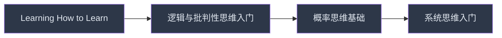
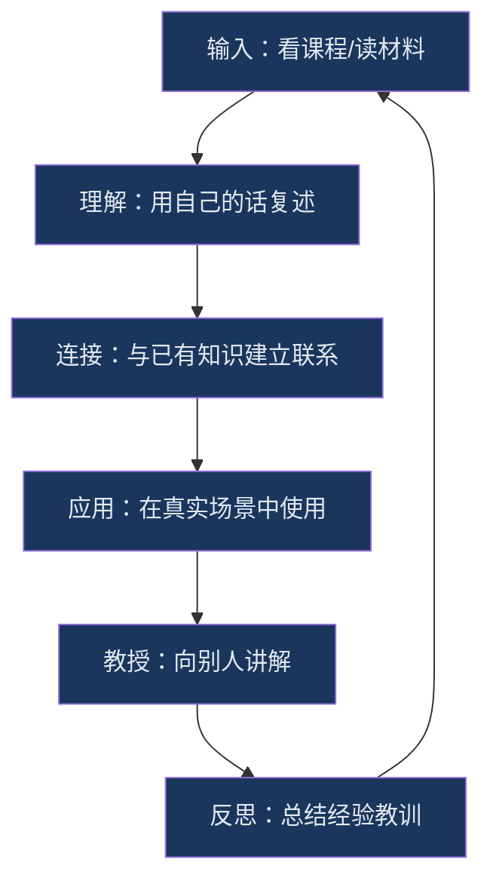

## 二、在线课程推荐

在线课程是思维提升的高效路径——好的课程能把一本书的核心内容压缩成结构化的学习体验，配合视频讲解、测验、作业和同伴讨论，学习效率远超纯阅读。但在线课程的海洋浩瀚无边，选择不当不仅浪费金钱，更浪费宝贵的时间精力。本节将从平台选择、课程分类、学习策略三个维度，为你提供一份经过筛选的实用指南。

### 2.1 主流平台对比与选择策略

#### 海外主流平台

| 平台 | 定位 | 价格区间 | 证书价值 | 中文支持 | 适合人群 |
|------|------|----------|----------|----------|----------|
| **Coursera** | 学术级课程 | 免费旁听/专项$39-79/月 | 高（可抵学分） | 部分课程有中文字幕 | 系统学习者、需要证书者 |
| **edX** | 学术级课程 | 免费旁听/证书$50-300 | 高（MicroMasters可抵硕士学分） | 少量中文课程 | 学术深造者 |
| **Udemy** | 实用技能课程 | $10-200（常打折至$10-15） | 低 | 部分课程有中文 | 实操导向学习者 |
| **Skillshare** | 创意与技能课程 | $13.99/月 | 无官方证书 | 英文为主 | 创意工作者 |
| **MasterClass** | 名师大师课 | $10-20/月 | 无 | 英文字幕 | 启发灵感、拓宽视野 |
| **Brilliant.org** | 交互式数理逻辑 | $24.99/月 | 无 | 英文为主 | 逻辑与概率思维训练 |

#### 国内主流平台

| 平台 | 定位 | 价格区间 | 特色优势 | 适合人群 |
|------|------|----------|----------|----------|
| **中国大学MOOC（爱课程）** | 高校公开课 | 免费为主 | 国内顶尖高校课程，中文原生 | 系统学习、考研准备 |
| **学堂在线** | 清华系MOOC | 免费/认证$50-150 | 清华大学主导，学术质量高 | 学术导向学习者 |
| **得到** | 知识付费 | $199-399/年会员 | 精品课程+听书，内容精炼 | 碎片时间高效学习 |
| **混沌大学** | 商业思维 | $1198/年 | 商业案例+创新思维，企业家导师 | 创业者、管理者 |
| **知乎知学堂** | 通识与技能 | 免费-数百元 | 知乎社区背书，话题广泛 | 泛知识学习者 |
| **网易公开课** | 国际课程汉化 | 免费 | 大量翻译自海外名校课程 | 英文基础薄弱者 |

#### 平台选择决策流程

选择平台不是看哪个"最好"，而是看哪个最匹配你的需求。以下是决策框架：

1. **明确学习目标**：是想系统学习一门学科，还是解决某个具体问题？系统学习选Coursera/edX/中国大学MOOC，解决问题选Udemy/得到。
2. **评估时间投入**：每周能投入多少时间？碎片时间多选得到/喜马拉雅，整块时间多选Coursera/edX。
3. **考虑语言门槛**：英文阅读尚可但听力吃力选有中文字幕的Coursera课程，英文无障碍直接选原版。
4. **判断证书需求**：求职/晋升需要证书选Coursera/edX（行业认可度高），纯自我提升选免费平台。
5. **设定预算**：预算有限先用免费资源（MOOC+YouTube），有预算再投入付费课程。

### 2.2 免费课程精选

免费课程的质量差异极大——有些是名校教授的倾力之作，有些只是营销漏斗的入口。以下是经过筛选的高质量免费课程，按思维能力分类。

#### 2.2.1 学习方法与元认知

**"Learning How to Learn"（学会学习）**
- **平台**：Coursera
- **机构**：加州大学圣迭戈分校（UCSD）
- **讲师**：Barbara Oakley、Terrence Sejnowski
- **核心内容**：组块化（Chunking）、间隔重复（Spaced Repetition）、专注模式与发散模式的切换、记忆的巩固机制、拖延症的心理学机制与应对策略。
- **课程时长**：4周，每周约3-4小时
- **为什么推荐**：这是全球注册人数最多的在线课程（超过300万人），不是因为它浅显，而是因为它用最通俗的语言讲清了学习科学的核心原理。很多人学了十几年，却从没学过"怎么学"——这门课补的就是这块空白。
- **学习建议**：配合阅读Barbara Oakley的《学习之道》（A Mind for Numbers）效果加倍。每学完一个概念，立刻用自己的话写一个"组块卡片"。
- **适合人群**：所有人——这门课应该是你思维提升之旅的第一站。

**"Mindshift: Break Through Obstacles to Learning and Discover Your Hidden Potential"**
- **平台**：Coursera
- **机构**：麦克马斯特大学
- **讲师**：Barbara Oakley
- **核心内容**：职业转型中的学习策略、如何突破自我设限、终身学习的心态建设。
- **为什么推荐**：这是"Learning How to Learn"的姊妹篇，侧重于如何在人生转折点利用学习改变方向。如果你正在考虑转行或探索新领域，这门课会给你实用的框架。

#### 2.2.2 批判性思维与逻辑推理

**"Critical Thinking & Problem Solving"（批判性思维与问题解决）**
- **平台**：edX
- **机构**：罗切斯特理工大学（RIT）
- **核心内容**：论证分析的结构化方法、常见逻辑谬误的识别（稻草人谬误、滑坡谬误、诉诸权威等）、证据的评估标准、问题分解与重构。
- **课程时长**：4周，每周2-3小时
- **为什么推荐**：批判性思维不是天生的"聪明"，而是一套可训练的技能。这门课的练习设计得很好，每学一个谬误类型，都会用真实新闻和广告案例让你做识别训练。
- **学习建议**：准备一个"谬误笔记本"，每天在社交媒体或新闻中找出至少一个逻辑谬误并记录。

**"Introduction to Logic"（逻辑学导论）**
- **平台**：Coursera
- **机构**：斯坦福大学
- **讲师**：Michael Genesereth
- **核心内容**：命题逻辑、谓词逻辑、逻辑证明、演绎推理与归纳推理的区别。
- **为什么推荐**：斯坦福的逻辑学课程，学术严谨但讲解清晰。逻辑是所有思维能力的地基——你可以不懂哲学，但不能不懂逻辑推理的基本规则。
- **适合人群**：愿意啃硬骨头的学习者。这门课有一定难度，但回报巨大。

**"Logical and Critical Thinking"（逻辑与批判性思维）**
- **平台**：FutureLearn
- **机构**：奥克兰大学
- **核心内容**：日常推理中的逻辑分析、如何构建和评估论证、识别隐含前提。
- **为什么推荐**：比RIT那门更轻量，适合完全零基础的入门者。FutureLearn平台的学习体验也很流畅。

#### 2.2.3 系统思维与复杂性

**"Introduction to Systems Thinking"（系统思维导论）**
- **平台**：MIT OpenCourseWare
- **机构**：麻省理工学院
- **核心内容**：系统的基本元素（存量、流量、反馈循环）、系统基模（增长极限、转移负担、公地悲剧等）、杠杆点理论、动态系统建模。
- **为什么推荐**：MIT的课程质量无需多言。系统思维是理解复杂问题的关键能力——为什么减肥总是反弹？为什么公司越大效率越低？为什么好政策反而带来坏结果？系统思维能帮你找到表象之下的结构性原因。
- **学习建议**：配合阅读《系统之美》（Thinking in Systems）一起学，理论+案例双管齐下。

**"Complexity Explorer"（复杂性探索）**
- **平台**：Santa Fe Institute（圣塔菲研究所官网）
- **机构**：圣塔菲研究所
- **核心内容**：复杂系统、涌现、自组织、网络科学、混沌理论。
- **为什么推荐**：圣塔菲研究所是复杂性科学的发源地，这里的课程直击前沿。复杂性思维能帮你理解为什么"简单规则产生复杂行为"——从蚁群智能到股市崩盘，从生态系统到互联网。
- **适合人群**：对科学思维感兴趣的学习者，需要一定的数学基础。

**"Model Thinking"（模型思维）**
- **平台**：Coursera
- **机构**：密歇根大学
- **讲师**：Scott Page
- **核心内容**：24种核心思维模型（分类模型、网络模型、博弈论模型、概率模型等）、多模型思维的方法论、模型在决策中的应用。
- **为什么推荐**：这门课的核心理念是"多模型思维"——没有一个模型能解释所有现象，掌握多个模型并知道何时使用哪个模型，才是真正聪明的思考方式。课程内容与Scott Page的《模型思维》一书对应，但视频讲解更直观。
- **课程时长**：10周，每周约4-5小时

#### 2.2.4 决策与概率思维

**"Introduction to Probability and Data"（概率与数据导论）**
- **平台**：Coursera
- **机构**：杜克大学
- **讲师**：Mine Çetinkaya-Rundel
- **核心内容**：概率基础、条件概率、贝叶斯定理、数据可视化、统计推断入门。
- **为什么推荐**：概率思维是现代决策的基石——大多数人直觉上对概率的理解是错误的（例如基率忽视、赌徒谬误）。杜克大学的这门课用R语言做实操，但编程不是重点，重点是建立概率直觉。
- **学习建议**：不需要编程基础，课程会教。重点关注贝叶斯定理的理解——这是从"我觉得"到"数据表明"的关键跳跃。

**"Game Theory"（博弈论）**
- **平台**：Coursera
- **机构**：斯坦福大学+英属哥伦比亚大学
- **讲师**：Matthew Jackson、Kevin Leyton-Brown、Yoav Shoham
- **核心内容**：纳什均衡、混合策略、合作博弈、重复博弈、机制设计。
- **为什么推荐**：博弈论是理解"互动决策"的核心工具——当你做决策时需要考虑别人的反应，博弈论就派上用场了。从商业谈判到国际关系，从拍卖设计到平台竞争，博弈论无处不在。
- **课程时长**：约8周

**"Calling Bullshit: Data Reasoning in a Digital World"（识别数据谬误）**
- **平台**：University of Washington（官网免费公开）
- **机构**：华盛顿大学
- **讲师**：Carl Bergstrom、Jevin West
- **核心内容**：数据可视化中的误导、统计陷阱、科学论文中的p-hacking、AI生成内容的识别、信息生态系统的批判性审视。
- **为什么推荐**：在数据泛滥的时代，识别"用数据说谎"的能力比数据分析能力更重要。这门课教你如何看穿精心包装的统计骗局——从误导性图表到选择性报告，从伪相关到因果推断错误。
- **学习建议**：配合阅读同名书籍《Calling Bullshit》效果更佳。

#### 2.2.5 创造性思维与设计思维

**"Design Thinking for Innovation"（设计思维与创新）**
- **平台**：Coursera
- **机构**：弗吉尼亚大学
- **核心内容**：设计思维五步法（共情→定义→构思→原型→测试）、用户研究方法、创意发散与收敛、快速原型。
- **为什么推荐**：设计思维不只是设计师的工具——它是一套"以人为中心的问题解决方法论"。硅谷最成功的公司（Apple、Airbnb、Google）都在用设计思维驱动创新。
- **课程时长**：5周，每周2-3小时

**"Creative Problem Solving"（创造性问题解决）**
- **平台**：Coursera
- **机构**：明尼苏达大学
- **核心内容**：创造性思维的理论框架、发散思维训练、约束条件下的创新、团队创造力激发。
- **为什么推荐**：创造力不是天赋，是方法。这门课提供了大量可练习的创造力工具，比如SCAMPER法、六顶思考帽、随机输入法等。

#### 2.2.6 沟通与论证

**"Think Again: How to Reason and Argue"（再想想：如何推理与辩论）**
- **平台**：Coursera
- **机构**：杜克大学
- **讲师**：Walter Sinnott-Armstrong、Ram Neta
- **核心内容**：演绎推理、归纳推理、论证的构建与拆解、常见推理谬误、如何在辩论中保持理性。
- **为什么推荐**：这门课有一个独特之处——它不仅教你如何赢，还教你如何改变自己的观点。在信息茧房时代，"改变想法的能力"比"坚持观点的能力"更珍贵。
- **课程时长**：12周（4个子课程各3周）

### 2.3 付费课程精选

付费课程的核心价值不在于内容本身（免费资源也能找到类似内容），而在于：结构化的学习路径、高质量的练习与反馈、社区互动、以及"花了钱所以认真学"的承诺效应。

#### 2.3.1 综合思维提升

**Farnam Street - "The Art of Decision Making"**
- **讲师**：Shane Parrish（知名思维博主，前加拿大情报机构分析师）
- **核心内容**：心智模型库（超过100个跨学科模型）、决策日记方法、认知偏差的系统性规避、高风险决策的框架化处理。
- **价格**：约$499/年（含会员社区、独家播客、深度文章）
- **为什么推荐**：Shane Parrish的博客Farnam Street是全球最具影响力的思维类内容平台之一。他的付费课程把碎片化的博客知识整合成系统课程，加上活跃的会员社区——这是最接近"和一群聪明人一起学思维"的体验。
- **适合人群**：有一定基础、愿意深入投入的学习者。不适合完全零基础。
- **性价比评估**：如果每天花在Farnam Street内容上的时间超过15分钟，会员费非常值。

**MasterClass - Daniel Kahneman on Judgment and Decision Making**
- **讲师**：丹尼尔·卡尼曼（诺贝尔经济学奖得主，《思考，快与慢》作者）
- **核心内容**：直觉系统与理性系统的协作、判断启发式、前景理论、噪音（Noise）与偏差的区别、决策卫生。
- **价格**：MasterClass年费约$120-180（含所有课程）
- **为什么推荐**：诺贝尔奖得主亲自授课，这不是"看名人演讲"的追星体验——卡尼曼用极其清晰的语言重新组织了他毕生的研究成果。他晚年的研究重点从"偏差"转向了"噪音"（同一问题不同人给出不同判断），这是他在MasterClass课程中特别强调的新视角。
- **学习建议**：配合阅读卡尼曼的《噪声》（Noise）——这是他2021年的新书，比《思考，快与慢》更聚焦于实际应用。

#### 2.3.2 逻辑与哲学思维

**"Introduction to Philosophy"（哲学导论）系列**
- **平台**：Coursera（杜克大学）
- **核心内容**：认识论（我们如何知道我们知道的？）、伦理学基础、自由意志问题、心灵哲学。
- **价格**：免费旁听，证书约$49
- **为什么推荐**：哲学不是"无用的空谈"——它是思维的元训练。学哲学不是为了记住康德说了什么，而是学会"像哲学家一样思考"：追问前提、分析概念、构建论证、识别隐含假设。

**The Great Courses - "Your Deceptive Mind: A Scientific Guide to Critical Thinking Skills"**
- **平台**：Wondrium（原The Great Courses Plus）
- **讲师**：Steven Novella（耶鲁大学神经学教授）
- **核心内容**：大脑的认知机制、为什么我们会犯系统性错误、科学思维的方法论、如何评估专家意见。
- **价格**：Wondrium月费约$20/月（含所有课程）
- **为什么推荐**：从神经科学的角度解释"为什么我们的思维会出错"，比纯逻辑学的角度更有说服力。理解了大脑的局限性，才能更好地规避它。

#### 2.3.3 概率与数据思维

**"Statistics and Probability"（统计与概率）**
- **平台**：Brilliant.org
- **核心内容**：交互式概率学习、贝叶斯推理、假设检验、回归分析、概率分布。
- **价格**：Premium约$24.99/月，$149.99/年
- **为什么推荐**：Brilliant的最大优势是"交互式学习"——不是看视频然后做题，而是在交互式场景中边玩边学。对于概率这种直觉容易出错的领域，"通过犯错来学习"比"通过听讲来学习"有效得多。
- **适合人群**：对纯数学推导感到枯燥、偏好直觉式理解的学习者。

**"Decision Skills: Influence and Power"（决策技能）**
- **平台**：Coursera（斯坦福大学）
- **核心内容**：决策树分析、多属性决策、群体决策偏差、决策中的伦理问题。
- **为什么推荐**：斯坦福的决策科学课程，理论深度与实用性兼具。

#### 2.3.4 商业与管理思维

**"Thinking Strategically: The Power of Business Modeling"**
- **平台**：LinkedIn Learning
- **核心内容**：战略分析框架（波特五力、SWOT、PESTEL）、商业模式画布、竞争策略设计。
- **价格**：LinkedIn Premium约$29.99/月
- **为什么推荐**：将思维模型直接应用于商业场景，适合创业者和管理者。

**混沌大学 - "创新思维"系列**
- **讲师**：李善友及各领域企业家
- **核心内容**：第一性原理、非连续性创新、颠覆式创新理论、商业认知升级。
- **价格**：约¥1198/年
- **为什么推荐**：混沌大学的优势在于"中国商业案例"——不是翻译硅谷的故事，而是用中国创业者的真实经历来讲思维方法论。如果你在中国做商业，这些案例的参考价值远高于海外课程。
- **适合人群**：创业者、企业中高层管理者。

### 2.4 中文课程专项推荐

对中文母语者来说，直接用中文学习思维课程可以减少语言带来的认知负荷，把精力集中在思维本身。以下是中文原创或优质汉化的课程。

#### 2.4.1 中国大学MOOC精选

**"逻辑学概论"**
- **机构**：中国人民大学
- **核心内容**：形式逻辑、非形式逻辑、论证分析、逻辑谬误。
- **为什么推荐**：国内逻辑学教学的标杆课程，中文原生内容，无需"翻译损耗"。

**"批判性思维"**
- **机构**：汕头大学
- **核心内容**：批判性思维的核心技能、论证评估、信息素养。
- **为什么推荐**：国内少见的批判性思维独立课程，不是逻辑学的附属品，而是独立的方法论训练。

**"系统工程导论"**
- **机构**：哈尔滨工业大学
- **核心内容**：系统思维、系统建模、系统动力学。
- **为什么推荐**：系统思维的工程化视角，比纯管理学角度更硬核、更可量化。

#### 2.4.2 得到APP课程

**"万维钢·精英日课"系列**
- **讲师**：万维钢（前物理学家，科学作家）
- **核心内容**：每年更新，涵盖科学思维、认知科学、决策理论、社会心理学等前沿内容。
- **为什么推荐**：万维钢擅长把英文世界的前沿研究"翻译"成中文读者能理解的语言。他的课程是"信息差红利"的典型——很多内容在国内尚无报道，但在英文世界已有定论。
- **学习建议**：不需要订阅全部季，先从第一季开始试听。

**"刘润·5分钟商学院"**
- **讲师**：刘润（前微软战略合作总监）
- **核心内容**：商业思维模型、管理工具、决策框架。
- **为什么推荐**：把复杂的商业思维拆解成每天5分钟的微课，适合碎片时间学习。内容覆盖了从战略到执行的完整链条。

**"宁向东的管理学课"**
- **讲师**：宁向东（清华大学经管学院教授）
- **核心内容**：管理学核心理论、组织行为学、决策理论、领导力。
- **为什么推荐**：清华教授的管理学功底扎实，不是"成功学鸡汤"，而是有理论深度、有案例支撑的正统管理学教育。

#### 2.4.3 其他中文平台

**网易公开课 - 汉化版TED系列**
- **内容**：大量TED演讲的中文字幕版
- **为什么推荐**：TED演讲是"快速了解一个新思维"的最佳方式——18分钟一个观点，高密度、高质量。网易公开课提供了大量已汉化的TED内容。
- **学习建议**：建立一个"TED思维卡片"系统——每看一个演讲，用自己的话总结核心观点、论证逻辑、可应用场景。

**B站（哔哩哔哩）- 学习UP主**
- **推荐频道**：
  - **妈咪说MommyTalk**：用通俗语言讲认知科学和心理学
  - **硬核半佛仙人**：商业分析+批判性思维实战
  - **老石谈芯**：系统化思维的工程案例
- **为什么推荐**：B站已经是中国最大的学习平台之一。优势是免费、社区互动强、内容风格年轻化。劣势是质量参差不齐，需要自己筛选。

### 2.5 学习路径规划

不要盲目开始学习——按路径来，效率翻倍。

#### 入门阶段（1-3个月）

**目标**：建立思维的基本框架，了解核心概念。



**推荐课程组合**：
1. Coursera "Learning How to Learn"（4周）
2. edX "Critical Thinking & Problem Solving"（4周）
3. Coursera "Introduction to Probability and Data"（5周）
4. MIT OCW "Introduction to Systems Thinking"（4周）

**每日时间投入**：1-1.5小时（视频30分钟+笔记整理20分钟+练习20分钟）

#### 进阶阶段（3-6个月）

**目标**：深入核心领域，建立多模型思维能力。

**推荐课程组合**：
1. Coursera "Model Thinking"（10周）
2. Coursera "Game Theory"（8周）
3. Coursera "Think Again: How to Reason and Argue"（12周）
4. Brilliant.org 交互式概率课程（持续）

**学习策略**：这个阶段要开始做"思维模型笔记"——每学一个模型，记录它的适用场景、局限性、以及与其他模型的关系。

#### 精通阶段（6个月以上）

**目标**：将思维能力内化为习惯，能在真实场景中灵活应用。

**推荐课程组合**：
1. Farnam Street 会员课程（持续）
2. MasterClass Kahneman课程
3. 混沌大学创新思维系列（中文）
4. 复杂性探索系列课程

**学习策略**：这个阶段的核心不是"学更多"，而是"用更多"。每周至少做一次"决策复盘"——选一个你做出的重要决策，用不同的思维模型重新分析，看看结论是否一致。

### 2.6 课程学习的实操方法论

知道学什么还不够，怎么学同样重要。以下是经过验证的在线课程学习方法。

#### 主动学习而非被动观看

**错误做法**：像看电影一样看课程视频，看完就关掉。

**正确做法**：
1. **课前预习**（5分钟）：快速浏览课程大纲和本节要点，建立预期框架
2. **主动观看**（视频时间）：每看5-10分钟暂停，用自己的话复述刚才的内容
3. **即时笔记**（10分钟）：用费曼笔记法——左边记要点，右边写"这个要点意味着什么"
4. **间隔复习**（每天5分钟）：第二天花5分钟回顾昨天的笔记，一周后再次回顾

#### 建立课程笔记系统

不要只用课程平台自带的笔记功能——建立你自己的知识管理系统。

**推荐工具组合**：
- **Obsidian**：构建概念之间的连接（双向链接+知识图谱）
- **Anki**：核心概念的间隔重复记忆
- **Notion**：课程进度跟踪+学习计划管理

**笔记模板示例**：

```markdown
# [课程名称] - [章节名称]

## 核心概念
- 概念1：用自己的话解释（不是复制课程内容）
- 概念2：...

## 与已有知识的连接
- 这个概念与我之前学的X有什么关系？
- 这个概念推翻/修正了我之前的什么认知？

## 实际应用场景
- 场景1：在[具体情境]中，我可以用这个概念来...
- 场景2：...

## 待深入问题
- 这个概念的局限性是什么？
- 有没有反例？
```

#### 课程完成率提升策略

在线课程的平均完成率只有5-15%。以下是把完成率提升到80%以上的具体策略：

1. **小批量承诺**：不要一次性注册10门课程，只注册当前能完成的1门
2. **固定学习时间**：每天固定时间段学习（如早上7:00-8:00），形成习惯回路
3. **公开承诺**：在社交媒体或学习社区宣布你的学习计划，利用社交压力
4. **进度可视化**：在日历上标记每天的学习进度，保持连续性
5. **奖励机制**：每完成一个章节，给自己一个小奖励
6. **同伴学习**：找一个学习伙伴或加入课程论坛的讨论小组

#### 课程内容的内化流程

学完课程不代表掌握。真正的掌握需要经过以下流程：



"教授"这一步尤其关键——费曼学习法的核心就是"如果你不能用简单的语言向别人解释一个概念，说明你还没有真正理解它"。你可以写博客、录视频、或者只是向朋友解释。

### 2.7 常见误区与避坑指南

#### 误区一：收藏等于学习

**表现**：疯狂收藏课程链接，注册了20门课程，一门都没看完。

**原因**：收藏带来的"虚假掌控感"让人误以为自己在学习。

**纠正**：限制同时进行的课程数量（最多2门），完成一门再开始下一门。把收藏夹当作"待选清单"而非"学习清单"。

#### 误区二：追求名师而非匹配度

**表现**：只看讲师名气，不看课程内容是否匹配自己的水平和需求。

**原因**：名人效应+信息不对称。

**纠正**：选课前做三件事：（1）看课程大纲是否覆盖你想学的内容；（2）看先修要求是否匹配你的水平；（3）看课程评价中"最有帮助"的评论，了解课程的真实体验。

#### 误区三：只看不练

**表现**：全程看视频，不做练习、不写笔记、不做项目。

**原因**：被动学习比主动学习轻松得多，大脑倾向于选择低能耗路径。

**纠正**：每门课至少投入30%的时间在练习和项目上。如果一门10小时的课程，你只花了10小时看视频而没有花额外3-4小时做练习，你学到的东西会很快遗忘。

#### 误区四：追求速度而非深度

**表现**：用2倍速刷完课程，只为"完成"而非"掌握"。

**原因**：平台的进度条和完成勋章激励了"刷课"行为。

**纠正**：宁可慢一点、学透一点。1.25倍速是极限——超过这个速度，理解力会显著下降。关键章节（核心概念、方法论讲解）甚至应该反复看。

#### 误区五：忽视课程社区的价值

**表现**：只看视频，不参与论坛讨论、不做同伴评议。

**原因**：社恐或觉得"浪费时间"。

**纠正**：课程社区是课程价值的重要组成部分。在论坛上提问、回答别人的问题、参与作业互评，这些互动能加深理解、暴露盲点、建立学习网络。至少每周在课程论坛上发一条帖子。

#### 误区六：证书崇拜

**表现**：为了证书而学习，而非为了掌握能力而学习。

**原因**：证书提供了明确的"完成信号"，但证书≠能力。

**纠正**：证书的价值因场景而异。求职时，Coursera/edX的专业证书有一定加分；自我提升时，证书几乎没有意义。把学习目标从"拿到证书"改为"能用这个方法解决一个实际问题"。

### 2.8 免费vs付费：如何做性价比决策

#### 什么时候该选免费

- 你是入门阶段，还不确定这个方向是否适合自己
- 你有较强的自驱力和自学能力，不需要外部激励
- 你的预算确实有限
- 你想学的内容已经有高质量的免费版本（如MIT OCW、中国大学MOOC）

#### 什么时候该选付费

- 你需要结构化的学习路径，不想自己拼凑课程
- 你需要证书用于求职或晋升
- 你需要社区互动和同伴压力来保持学习动力
- 免费资源无法满足你的深度需求
- 你的时间比金钱更值钱——付费课程通常内容密度更高、结构更清晰

#### 性价比排行

从"单位学习效果/价格"角度：

1. **最高性价比**：中国大学MOOC（免费+高质量中文内容）
2. **高性价比**：Coursera旁听（免费）、YouTube/B站学习频道（免费）
3. **中等性价比**：Coursera/edX证书课程（$49-79/月，有证书+完整体验）
4. **需要评估**：Farnam Street会员（$499/年，深度内容但价格高）、混沌大学（¥1198/年，中文商业思维但内容有时过于"观点化"）
5. **谨慎选择**：个人开发者的高价课程（质量参差不齐，退款政策不确定）

### 2.9 学习效果的自我检验

学完一门课程后，如何检验自己是否真正掌握了？

#### 概念理解检验

对课程中的每个核心概念，尝试回答以下问题：
- 能否用一句自己的话解释这个概念？（不是复述课程原文）
- 能否举一个课程中没有的例子？
- 能否说明这个概念的适用边界和局限性？

#### 应用能力检验

选一个你目前面临的真实问题，尝试用课程中学到的方法来分析：
- 这个方法在这个场景中是否适用？
- 如果适用，你的分析结论是什么？
- 如果不适用，为什么不适用？应该用什么方法替代？

#### 教授能力检验

找一个人（朋友、同事、或者AI助手），尝试向他解释课程的核心内容：
- 对方能听懂吗？
- 对方提出了哪些你无法回答的问题？
- 哪些部分你解释得磕磕绊绊？（这些就是你还没有真正掌握的部分）

#### 长期记忆检验

学完一个月后，不看笔记，尝试列出课程的核心要点：
- 你能记住多少？
- 哪些概念你记得很清楚，哪些已经模糊？
- 模糊的部分说明你需要间隔重复强化。

***

